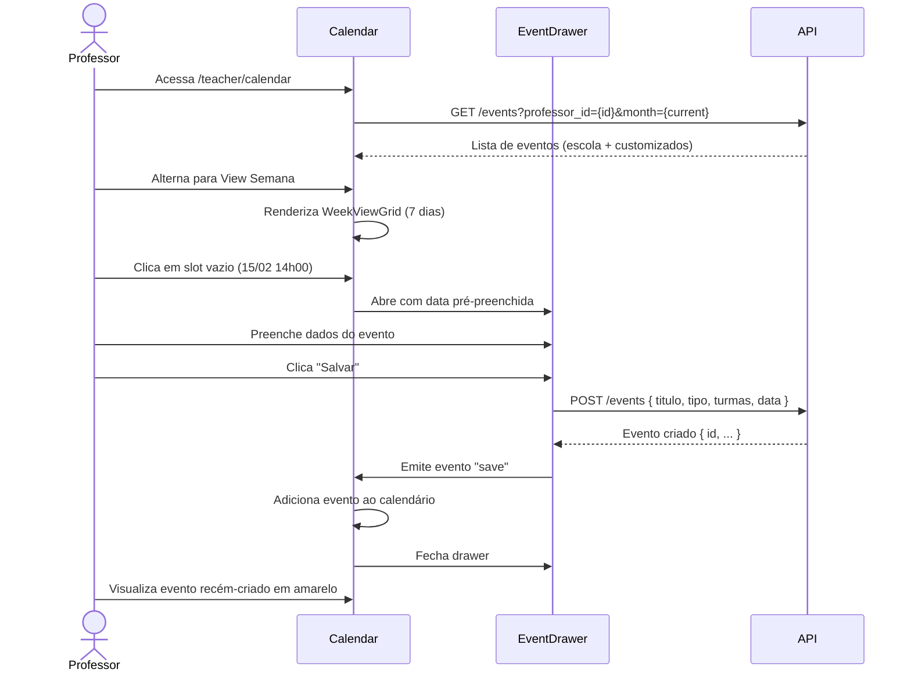
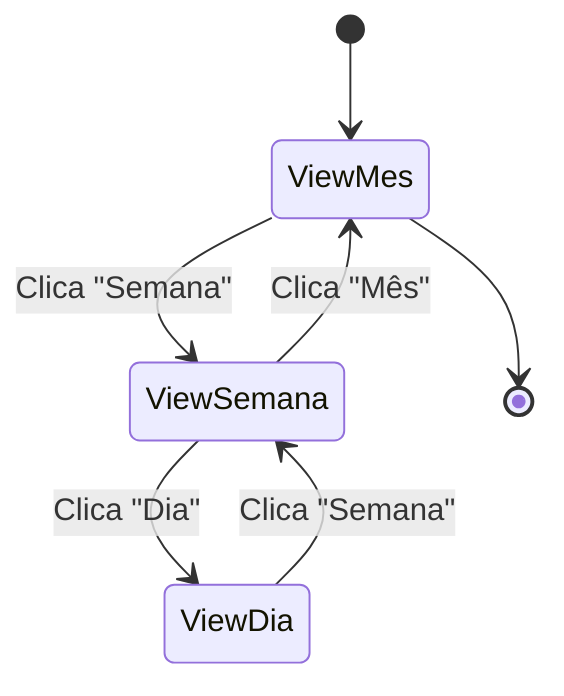
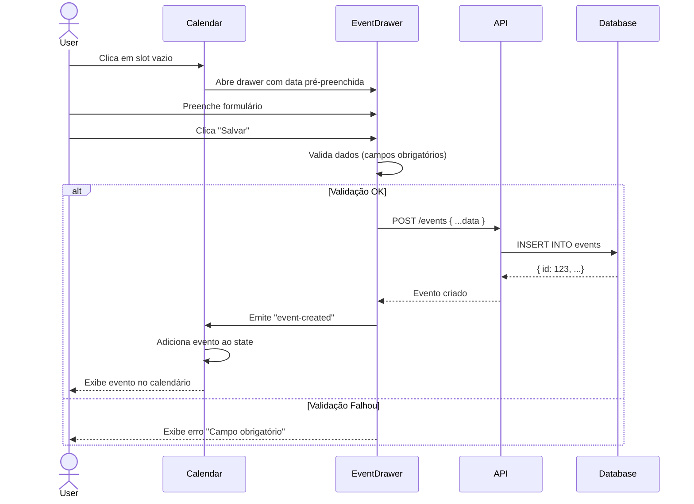
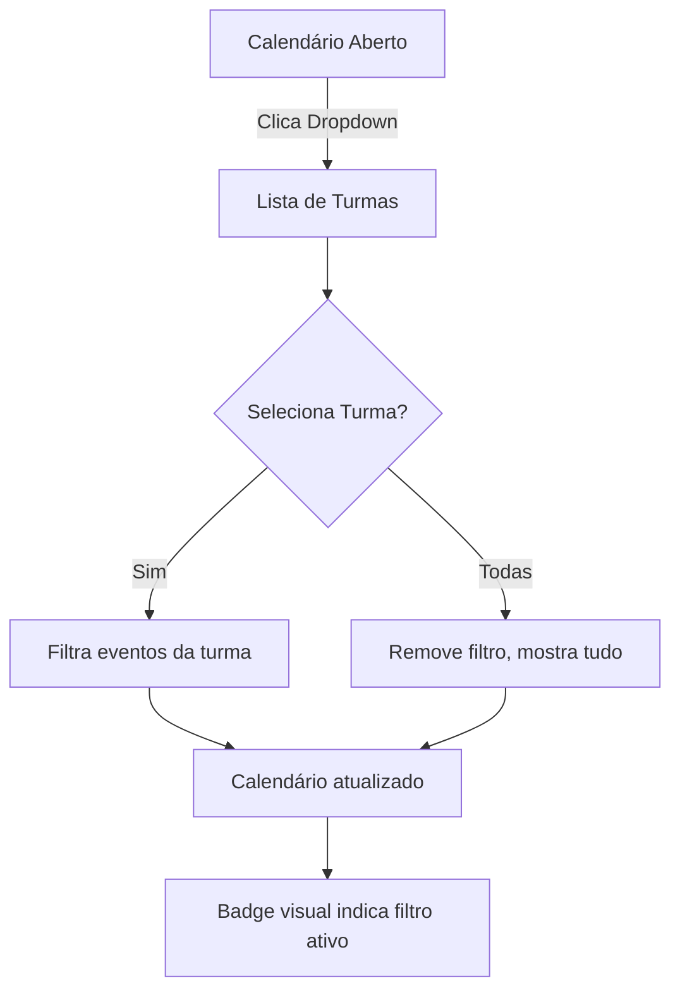

# Jornadas de Usuários - Calendário Educacross

> **Documento**: Matriz de Permissões e Jornadas por Perfil  
> **Data**: 11 de Fevereiro de 2026  
> **Status**: 🟡 Em Desenvolvimento  
> **Versão**: 1.0

---

## Sumário Executivo

Este documento mapeia as jornadas de cada perfil de usuário no módulo de Calendário da plataforma Educacross, definindo:
- ✅ Permissões de acesso por perfil
- 🎯 Casos de uso específicos
- 🔄 Fluxos de interação
- 🎨 Variações de interface por perfil

---

## Perfis de Usuário

### 1. 👨‍🏫 Professor
- **Status**: ✅ Implementado (Sprint 1 - 100%)
- **Rota**: `/teacher/calendar`
- **Prioridade**: 🔴 Alta (>1000 acessos/dia)

### 2. 👨‍🎓 Aluno
- **Status**: 🟡 Planejado
- **Rota**: `/student/calendar`
- **Prioridade**: 🔴 Alta (>2000 acessos/dia)

### 3. 👔 Coordenador Pedagógico
- **Status**: 🟡 Planejado
- **Rota**: `/coordinator/calendar`
- **Prioridade**: 🟠 Média

### 4. 🏢 Diretor Escolar
- **Status**: 🟡 Planejado
- **Rota**: `/director/calendar`
- **Prioridade**: 🟠 Média

### 5. 🎯 Gestor de Rede
- **Status**: 🟡 Planejado
- **Rota**: `/network-manager/calendar`
- **Prioridade**: 🟢 Baixa

### 6. ⚙️ Administrador do Sistema
- **Status**: 🟡 Planejado
- **Rota**: `/administrator/calendar`
- **Prioridade**: 🟢 Baixa

---

## Matriz de Permissões por Perfil

| Funcionalidade | Professor | Aluno | Coordenador | Diretor | Gestor Rede | Admin |
|---|:---:|:---:|:---:|:---:|:---:|:---:|
| **Visualização** | ✅ | ✅ | ✅ | ✅ | ✅ | ✅ |
| View Mês | ✅ | ✅ | ✅ | ✅ | ✅ | ✅ |
| View Semana | ✅ | ✅ | ✅ | ✅ | ✅ | ✅ |
| View Dia | ✅ | ✅ | ✅ | ✅ | ✅ | ✅ |
| View Lista | ✅ | ✅ | ✅ | ✅ | ✅ | ✅ |
| **Criação de Eventos** | ✅ | ❌ | ✅ | ✅ | ✅ | ✅ |
| Eventos da Escola | ❌ | ❌ | ✅ | ✅ | ✅ | ✅ |
| Eventos Customizados | ✅ | ❌ | ✅ | ❌ | ❌ | ✅ |
| Eventos de Turma | ✅ | ❌ | ✅ | ❌ | ❌ | ✅ |
| **Edição/Exclusão** | | | | | | |
| Próprios Eventos | ✅ | ❌ | ✅ | ✅ | ✅ | ✅ |
| Eventos de Outros | ❌ | ❌ | ✅ | ✅ | ✅ | ✅ |
| Eventos da Escola | ❌ | ❌ | ✅ | ✅ | ✅ | ✅ |
| **Filtros** | | | | | | |
| Por Turma | ✅ | ✅* | ✅ | ✅ | ✅ | ✅ |
| Por Professor | ❌ | ❌ | ✅ | ✅ | ✅ | ✅ |
| Por Tipo de Atividade | ✅ | ✅ | ✅ | ✅ | ✅ | ✅ |
| Por Escola | ❌ | ❌ | ❌ | ❌ | ✅ | ✅ |
| **Exportação** | | | | | | |
| PDF | ✅ | ✅ | ✅ | ✅ | ✅ | ✅ |
| iCal/Google Calendar | ✅ | ✅ | ✅ | ❌ | ❌ | ✅ |
| Excel (relatório) | ❌ | ❌ | ✅ | ✅ | ✅ | ✅ |
| **Notificações** | | | | | | |
| Lembretes de Eventos | ✅ | ✅ | ✅ | ❌ | ❌ | ❌ |
| Notif. de Conflitos | ✅ | ❌ | ✅ | ❌ | ❌ | ✅ |
| **Integrações** | | | | | | |
| Missões | ✅ | ✅ | ✅ | ❌ | ❌ | ✅ |
| Avaliações | ✅ | ✅ | ✅ | ❌ | ❌ | ✅ |
| Olimpíadas | ✅ | ✅ | ✅ | ❌ | ❌ | ✅ |
| Trilhas | ✅ | ✅ | ✅ | ❌ | ❌ | ✅ |

*Aluno filtra apenas por suas próprias turmas

---

## Jornada por Perfil

### 👨‍🏫 1. Professor (Implementado)

#### Contexto
Isabella Cross é professora de 4 turmas (5A-Manhã, 5B-Manhã, 6A-Tarde, 6B-Tarde). Ela precisa:
- Visualizar todos os eventos de suas turmas em um calendário unificado (missões, avaliações, olimpíadas, eventos da escola)
- Criar eventos **genéricos** no calendário (revisões extras, atendimentos individuais, aulas de reforço)
- ⚠️ **IMPORTANTE**: Eventos criados no calendário são apenas marcações genéricas. Para criar Missões, Avaliações ou Olimpíadas, ela usa os módulos específicos
- Editar/cancelar eventos genéricos que ela criou
- Filtrar por turma específica quando necessário

#### Casos de Uso Principais

**UC-01: Planejar Semana**
```
Pré-condição: Professor logado, calendário aberto
1. Acessa view Mês
2. Navega para próxima semana
3. Verifica densidade de eventos
4. Identifica slots livres
5. Decide criar revisão extra
```

**UC-02: Criar Evento Genérico no Calendário**
```
Pré-condição: Professor na view Dia/Semana
1. Clica no slot de horário desejado
2. EventDrawer abre automaticamente
3. Preenche dados:
   - Tipo: "Outro" (evento genérico)
   - Título: "Revisão Extra de Matemática"
   - Turmas: "5A-Manhã"
   - Data/Hora: Pré-preenchida
   - Descrição opcional
4. Clica "Salvar"
5. Evento aparece no calendário com cor cinza (evento genérico)
6. Drawer fecha automaticamente

⚠️ IMPORTANTE: Este evento é apenas uma marcação no calendário.
Para criar Missões, Avaliações ou Olimpíadas, use os módulos específicos.
Quando criadas lá, aparecem automaticamente no calendário.
```

**UC-03: Editar Evento Próprio**
```
Pré-condição: Evento customizado visível no calendário
1. Clica no evento
2. EventDrawer abre em modo edição
3. Modifica data/hora ou descrição
4. Clica "Salvar"
5. Calendário atualiza evento
```

**UC-04: Cancelar Evento**
```
Pré-condição: EventDrawer aberto em modo edição
1. Clica no botão "Delete" (🗑️)
2. Modal de confirmação: "Tem certeza?"
3. Confirma exclusão
4. Evento removido do calendário
5. Drawer fecha
```

**UC-05: Filtrar por Turma**
```
Pré-condição: Calendário com múltiplas turmas
1. Clica no dropdown "Todas as Turmas"
2. Seleciona "5A-Manhã"
3. Calendário filtra, mostrando apenas eventos da turma selecionada
4. Badge visual indica filtro ativo
```

**UC-06: Alternar Views**
```
Pré-condição: Calendário aberto em qualquer view
1. Clica nos botões "Mês" / "Semana" / "Dia"
2. Layout reorganiza eventos conforme view:
   - Mês: Grid 7x5, +X mais indicator
   - Semana: Grid 7 dias, horários 7h-22h
   - Dia: Single column, horários 6h-23h, linha vermelha de "agora"
3. Eventos mantêm cores e informações
```

#### Fluxo Completo - Planejamento Semanal



#### Componentes da Interface

**Header (CalendarMonthHeader.vue)**
- Navegação: ← → (mês anterior/próximo)
- Título do mês/ano centralizado
- Toggle de views: [Mês] [Semana] [Dia]

**Sidebar (CalendarSidebar.vue)**
- Mini calendário de navegação rápida
- Filtro de turmas (dropdown)
- Filtro de atividades (checkboxes coloridos):
  - 🟣 Missões
  - 🔵 Olimpíadas
  - 🟡 Avaliações
  - 🟢 Trilhas
  - 🟠 Expedições
- Legenda de cores

**Main Area**
- `MonthViewGrid.vue` (grid 7x6, eventos com +X mais)
- `WeekViewGrid.vue` (grid 7 dias com horários)
- `DayViewGrid.vue` (coluna única detalhada)

**EventDrawer (lateral direito)**
- Formulário de criação/edição
- Campos: Tipo, Título, Data, Hora, Turmas, Descrição
- Botões: Salvar, Cancelar, Delete(se editando)

---

### 👨‍🎓 2. Aluno (Planejado)

#### Contexto
Lucas Silva é aluno da turma 5A-Manhã. Ele precisa:
- Ver apenas eventos relevantes para suas turmas
- Entender prazos de missões, avaliações e olimpíadas
- **Não** criar ou editar eventos (read-only)
- Receber lembretes de eventos próximos

#### Casos de Uso Principais

**UC-07: Visualizar Calendário de Aulas**
```
Pré-condição: Aluno logado
1. Acessa /student/calendar
2. Vê automaticamente apenas eventos de suas turmas (5A-Manhã, Música, Educação Física)
3. Eventos exibem:
   - ✅ Missões ativas
   - ✅ Avaliações agendadas
   - ✅ Olimpíadas inscritas
   - ✅ Aulas especiais
   - ❌ Eventos administrativos (ocultos)
```

**UC-08: Ver Detalhes de Missão (Origem: Módulo de Missões)**
```
Pré-condição: Calendário com missão visível (evento com origem: 'missao')
1. Clica em card de Missão (cor roxa)
2. Drawer read-only abre mostrando:
   - Ícone de Missão 🎯
   - Título da missão
   - Professor responsável
   - Data de entrega
   - Status atual: "Em andamento" / "Não iniciada" / "Concluída"
   - Progresso: 3/5 etapas concluídas
   - Botão principal: "Acessar Missão" → redireciona para /student/missions/{id}
3. Não há botão "Editar" ou "Deletar" (missão é gerenciada no módulo próprio)
4. Badge visual: "📚 Missão" (diferencia de eventos genéricos)

⚠️ Este evento veio do módulo de Missões e só pode ser editado lá.
```

**UC-09: Exportar Calendário Pessoal**
```
Pré-condição: Calendário visualizado
1. Clica em "Exportar"
2. Opções:
   - 📄 PDF: Baixa calendário em PDF do mês atual
   - 📅 Google Calendar: Abre modal com link iCal
3. Seleciona opção
4. Arquivo exportado apenas com eventos públicos do aluno
```

**UC-10: Receber Lembrete de Prazo**
```
Pré-condição: Avaliação agendada para daqui a 2 dias
1. Sistema envia notificação push:
   "⏰ Lembrete: Avaliação de Matemática em 2 dias (13/02 às 14h)"
2. Aluno clica na notificação
3. Redireciona para /student/calendar?date=2026-02-13&event={id}
4. Calendário abre na view Dia com o evento destacado
```

#### Diferenças de Interface vs Professor

**Funcionalidades Removidas**:
- ❌ Botão "Adicionar Evento"
- ❌ EventDrawer em modo criação/edição
- ❌ Botões de Delete em eventos
- ❌ Filtro de turmas (fixo nas turmas do aluno)

**Funcionalidades Adicionadas**:
- ✅ Badge "Pendente" / "Concluída" em missões
- ✅ Botão "Acessar Missão" em missões
- ✅ Contador de dias restantes para prazos
- ✅ Heatmap de densidade de atividades (gamificação)

#### Variações de Layout

```vue
<!-- Exemplo: WeekViewGrid para Aluno -->
<template>
  <div class="week-view-grid student-view">
    <!-- Header igual ao professor -->
    
    <!-- Eventos com status visual -->
    <div 
      v-for="event in events" 
      :key="event.id"
      class="event-card"
      :class="{ 
        'event-pending': !event.concluida,
        'event-done': event.concluida 
      }"
      @click="viewEventDetails(event)"
    >
      <div class="event-title">{{ event.titulo }}</div>
      <div class="event-time">{{ event.horaInicio }} - {{ event.horaTermino }}</div>
      
      <!-- Badge específico para aluno -->
      <span v-if="event.tipo === 'missao'" class="event-status">
        {{ event.concluida ? '✅ Concluída' : '⏳ Pendente' }}
      </span>
    </div>
  </div>
</template>
```

---

### 👔 3. Coordenador Pedagógico (Planejado)

#### Contexto
Maria Santos é coordenadora de 15 professores. Ela precisa:
- **Monitorar** calendários de todos os professores da escola
- **Criar** eventos institucionais (feriados, reuniões, formações)
- **Validar** que não há sobrecarga de avaliações em uma data
- **Exportar** relatórios consolidados

#### Casos de Uso Principais

**UC-11: Criar Evento Institucional**
```
Pré-condição: Coordenador logado
1. Acessa /coordinator/calendar
2. Clica "Adicionar Evento da Escola"
3. EventDrawer abre com campos adicionais:
   - Tipo: [Feriado, Reunião, Formação, Evento, Outro]
   - Título: Ex: "Dia do Professor"
   - Data: 15/10/2026
   - Público: [Todos, Apenas Professores, Apenas Alunos]
   - Escolas: [Escola A, Escola B, Todas da Rede]
4. Clica "Salvar"
5. Evento propagado para calendários de todos afetados
```

**UC-12: Monitorar Calendário de Professor**
```
Pré-condição: Coordenador na tela principal
1. Filtro "Ver Calendário de": Dropdown com lista de professores
2. Seleciona "Isabella Cross"
3. Calendário exibe eventos de Isabella (escola + customizados dela)
4. Eventos customizados têm badge "👤 Customizado"
5. Coordenador pode visualizar mas **não editar** eventos do professor
```

**UC-13: Validar Densidade de Avaliações**
```
Pré-condição: View Semana ativa
1. Heatmap automático mostra densidade:
   - 🟢 Verde: 0-2 avaliações/dia
   - 🟡 Amarelo: 3-4 avaliações/dia
   - 🔴 Vermelho: 5+ avaliações/dia (alerta!)
2. Coordenador identifica 13/02 com 6 avaliações
3. Clica no dia
4. Modal lista todas as 6 avaliações:
   - 5A: Matemática (Isabella)
   - 5A: Português (João)
   - 5B: Ciências (Maria)
   - ...
5. Coordenador entra em contato com professores para redistribuir
```

**UC-14: Exportar Relatório Mensal**
```
Pré-condição: Mês completo visualizado
1. Clica "Exportar" → "Relatório Excel"
2. Modal com opções:
   - Período: Fevereiro/2026
   - Incluir: [✓] Todos os professores [✓] Todas as turmas
   - Agrupar por: [Professor, Turma, Tipo de Atividade]
3. Clica "Gerar Relatório"
4. Excel baixado com tabelas:
   - Aba 1: Eventos por Professor (contagem)
   - Aba 2: Eventos por Turma (contagem)
   - Aba 3: Lista detalhada de todos os eventos
```

#### Permissões Especiais

| Ação | Professor | Coordenador |
|---|:---:|:---:|
| Ver calendário de outros | ❌ | ✅ |
| Editar evento de outro | ❌ | ✅ (apenas eventos escola) |
| Criar evento institucional | ❌ | ✅ |
| Deletar evento de outro | ❌ | ✅ (com auditoria) |
| Ver relatórios consolidados | ❌ | ✅ |

---

### 🏢 4. Diretor Escolar (Planejado)

#### Contexto
Roberto Lima é diretor da Escola Municipal XYZ. Ele precisa:
- **Visão estratégica** do calendário escolar
- **Validar** eventos institucionais importantes
- **Acompanhar** volume de atividades por mês/bimestre
- **Não** gerenciar micro-detalhes (delega ao coordenador)

#### Casos de Uso Principais

**UC-15: Dashboard Executivo de Calendário**
```
Pré-condição: Diretor acessa /director/calendar
1. View padrão: Dashboard com cards de métricas:
   📊 Total de Eventos (mês): 247
   👨‍🏫 Professores Ativos: 34/38
   📚 Missões Ativas: 18
   📝 Avaliações Agendadas: 12
2. Gráfico de linha: Evolução de eventos nos últimos 6 meses
3. Top 3 tipos de atividades mais usadas
```

**UC-16: Aprovar Evento Institucional de Alto Impacto**
```
Pré-condição: Coordenador criou evento "Semana de Provas Bimestrais"
1. Diretor recebe notificação: "Evento aguardando aprovação"
2. Acessa /director/calendar/approvals
3. Lista de eventos pendentes:
   - Semana de Provas Bimestrais (05-09/03)
   - Impacto: 500 alunos, 15 professores
   - Criado por: Maria Santos (Coordenadora)
4. Clica "Ver Detalhes"
5. Revisa informações e impacto
6. Botões: [Aprovar] [Solicitar Ajustes] [Rejeitar]
7. Clica "Aprovar"
8. Evento publicado em todos os calendários
```

**UC-17: Exportar Calendário Anual em PDF**
```
Pré-condição: Ano letivo planejado
1. Acessa "Relatórios" → "Calendário Anual"
2. Seleciona:
   - Ano: 2026
   - Tipo: Eventos Institucionais
   - Layout: [Grid Mensal, Lista Cronológica]
3. Clica "Gerar PDF"
4. PDF de 12 páginas com:
   - 1 página por mês
   - Apenas eventos oficiais (feriados, reuniões, formaturas)
   - Logo da escola no cabeçalho
5. Diretor imprime e distribui para professores/pais
```

#### Interface Simplificada

**Diferenças vs Coordenador**:
- ✅ Foco em agregações e métricas (não em eventos individuais)
- ✅ Workflow de aprovação de eventos
- ❌ Não cria eventos diretamente (solicita ao coordenador)
- ❌ Não edita eventos customizados de professores

---

### 🎯 5. Gestor de Rede (Planejado)

#### Contexto
Ana Paula é gestora da Rede Municipal de 25 escolas. Ela precisa:
- **Comparar** calendários entre escolas da rede
- **Padronizar** eventos institucionais (ex: todas as escolas fazem SAEB na mesma semana)
- **Identificar** escolas com baixa densidade de atividades
- **Exportar** relatórios consolidados da rede

#### Casos de Uso Principais

**UC-18: Comparar Escolas**
```
Pré-condição: Gestor acessa /network-manager/calendar
1. Filtro "Comparar Escolas":
   - Seleciona: [Escola A, Escola B, Escola C]
2. View Split-Screen:
   - 3 calendários lado a lado
   - Mesma escala de zoom (mês)
3. Heatmap comparativo:
   - Escola A: 120 eventos/mês (🟢 Alta atividade)
   - Escola B: 45 eventos/mês (🔴 Baixa atividade)
   - Escola C: 90 eventos/mês (🟡 Média atividade)
4. Gestor identifica que Escola B precisa de intervenção
```

**UC-19: Criar Evento da Rede**
```
Pré-condição: Gestor decide padronizar SAEB
1. Clica "Criar Evento da Rede"
2. Formulário:
   - Tipo: Avaliação Externa
   - Título: "SAEB 2026"
   - Data: 20-24/10/2026
   - Escolas: [✓] Todas as 25 escolas
   - Público: [✓] Alunos 5º ano [✓] Alunos 9º ano
3. Clica "Propagar para Rede"
4. Sistema cria evento em calendário de **todas** as escolas
5. Diretores recebem notificação: "Novo evento da rede criado"
```

**UC-20: Relatório de Conformidade**
```
Pré-condição: Ano letivo em andamento
1. Acessa "Relatórios" → "Conformidade de Calendário"
2. Sistema verifica:
   - ✅ Todas as escolas têm 200 dias letivos?
   - ✅ Reuniões bimestrais foram agendadas?
   - ⚠️ Escola XYZ não agendou Conselho de Classe (Alerta!)
3. Gera PDF com checklist de conformidade
4. Gestor envia para diretores das escolas não-conformes
```

#### Permissões de Super-Usuário

| Ação | Coordenador | Gestor de Rede |
|---|:---:|:---:|
| Ver calendário de todas as escolas | ❌ | ✅ |
| Criar evento multi-escola | ❌ | ✅ |
| Gerar relatórios da rede | ❌ | ✅ |
| Editar eventos de qualquer escola | ❌ | ✅ (com auditoria) |
| Comparar métricas entre escolas | ❌ | ✅ |

---

### ⚙️ 6. Administrador do Sistema (Planejado)

#### Contexto
Carlos Tech é administrador de TI. Ele precisa:
- **Acesso total** para troubleshooting
- **Gerenciar** tipos de atividades e configurações
- **Auditar** logs de ações críticas (quem deletou o quê)
- **Não** interferir no calendário pedagógico (apenas suporte técnico)

#### Casos de Uso Principais

**UC-21: Auditoria de Eventos Deletados**
```
Pré-condição: Diretor reclama que evento sumiu
1. Acessa /administrator/calendar/audit-logs
2. Filtros:
   - Ação: "Deletar Evento"
   - Período: Última semana
   - Escola: Escola Municipal XYZ
3. Tabela de resultados:
   | Data/Hora | Usuário | Evento Deletado | Motivo |
   |-----------|---------|-----------------|--------|
   | 10/02 14:35 | Maria Santos | Reunião de Pais (15/02) | "Data incorreta" |
4. Admin identifica que foi ação legítima
5. Informa ao diretor
```

**UC-22: Configurar Tipo de Atividade Customizada**
```
Pré-condição: Escola solicita novo tipo "Atividade STEAM"
1. Acessa /administrator/calendar/activity-types
2. Lista atual: Missões, Olimpíadas, Avaliações, Trilhas, Expedições
3. Clica "Adicionar Tipo"
4. Formulário:
   - Nome: "STEAM"
   - Cor: #9C27B0 (roxo)
   - Ícone: bi-robot
   - Habilitado para: [✓] Professores [✓] Coordenadores
5. Clica "Salvar"
6. Tipo "STEAM" aparece em todos os dropdowns de criação de eventos
```

**UC-23: Restaurar Evento de Backup**
```
Pré-condição: Evento importante foi deletado por acidente
1. Acessa /administrator/calendar/restore
2. Busca por ID ou data
3. Lista de eventos deletados nos últimos 30 dias
4. Seleciona evento "Formatura 9º Ano"
5. Clica "Restaurar"
6. Evento volta ao calendário do diretor
7. Notificação enviada: "Evento restaurado pelo admin"
```

#### Permissões de Super-Admin

| Ação | Qualquer Usuário | Admin |
|---|:---:|:---:|
| Ver calendário de qualquer pessoa | ❌ | ✅ |
| Editar qualquer evento | ❌ | ✅ |
| Deletar qualquer evento | ❌ | ✅ |
| Ver logs de auditoria | ❌ | ✅ |
| Configurar sistema | ❌ | ✅ |
| Restaurar eventos deletados | ❌ | ✅ |

---

## Matriz de Visualizações por Perfil

| View | Professor | Aluno | Coordenador | Diretor | Gestor Rede | Admin |
|---|:---:|:---:|:---:|:---:|:---:|:---:|
| **Mês** | ✅ Padrão | ✅ Padrão | ✅ Padrão | ✅ | ✅ | ✅ |
| **Semana** | ✅ | ✅ | ✅ | ❌ | ✅ | ✅ |
| **Dia** | ✅ | ✅ | ✅ | ❌ | ❌ | ✅ |
| **Lista** | ✅ | ✅ | ✅ | ✅ Padrão | ✅ Padrão | ✅ |
| **Dashboard** | ❌ | ❌ | ✅ | ✅ Padrão | ✅ Padrão | ✅ |
| **Comparativo** | ❌ | ❌ | ❌ | ❌ | ✅ | ✅ |

---

## Fluxos de Interação Compartilhados

### Fluxo 1: Navegação entre Views



### Fluxo 2: Criação de Evento (Professor/Coordenador)



### Fluxo 3: Filtro de Turma (Todos os perfis)



---

## Variações de Dados por Perfil

### Eventos Visíveis

**Professor**: 
- Eventos da escola (origem: "escola", readonly)
- Missões criadas no módulo de Missões (origem: "missao", readonly no calendário, editable no módulo)
- Avaliações criadas no módulo de Avaliações (origem: "avaliacao", readonly no calendário)
- Olimpíadas inscritas (origem: "olimpiada", readonly no calendário)
- Próprios eventos genéricos criados NO CALENDÁRIO (origem: "professor", editable)
- Eventos genéricos de outros professores na mesma turma (origem: "professor", readonly)

**Aluno**:
- Eventos públicos da escola (feriados, eventos institucionais)
- Missões ativas (origem: "missao", status: "em andamento" / "concluída")
- Avaliações agendadas (origem: "avaliacao")
- Olimpíadas inscritas (origem: "olimpiada")
- Eventos genéricos de professores SE marcados como públicos (origem: "professor")
- ❌ Não vê: Reuniões de professores (eventos privados), eventos administrativos

**Coordenador**:
- Todos os eventos da escola
- Eventos customizados de todos os professores (readonly)
- Próprios eventos institucionais (editable)

**Diretor**:
- Apenas eventos institucionais importantes
- Agregações de métricas
- ❌ Não vê: Eventos customizados de professores

**Gestor de Rede**:
- Eventos institucionais de todas as escolas da rede
- Eventos da rede (criados por ele)
- Agregações multi-escola

**Admin**:
- Tudo (sem restrição)
- Eventos deletados (lixeira)
- Logs de auditoria

---

## Integrações com Outros Módulos

⚠️ **ATENÇÃO**: O calendário é uma **VIEW AGREGADA**. Ele NÃO cria objetos de outros módulos.

### Missões
- **Fluxo**: Professor cria missão no **módulo de Missões** → Missão **aparece automaticamente** no calendário como evento
- **Origem do evento**: `origem: 'missao'`
- **Edição**: Clicar no evento do calendário → Botão "Editar Missão" → Redireciona para `/teacher/missions/{id}`
- **No calendário**: Evento é **readonly** (edita-se no módulo de origem)
- **Aluno**: Missões aparecem no calendário com deadline e badge de status (Pendente/Concluída)
- **Coordenador**: Monitorar volume de missões por professor

### Avaliações
- **Fluxo**: Professor agenda avaliação no **módulo de Avaliações** → Avaliação **aparece automaticamente** no calendário
- **Origem do evento**: `origem: 'avaliacao'`
- **Edição**: Clicar no evento → Botão "Editar Avaliação" → Redireciona para `/teacher/evaluations/{id}`
- **No calendário**: Evento é **readonly**
- **Aluno**: Ver data da avaliação + botão "Acessar Conteúdo"
- **Coordenador**: Validar que não há sobrecarga de avaliações (heatmap)

### Olimpíadas
- **Fluxo**: Professor inscreve turma em olimpíada no **módulo de Olimpíadas** → Olimpíada **aparece automaticamente** no calendário
- **Origem do evento**: `origem: 'olimpiada'`
- **Edição**: Readonly no calendário
- **Aluno**: Ver olimpíadas inscritas com countdown
- **Coordenador**: Ver participação por escola

### Eventos Genéricos (Criados NO Calendário)
- **Fluxo**: Professor cria evento diretamente no calendário (ex: "Revisão extra", "Atendimento individual")
- **Origem do evento**: `origem: 'professor'`
- **Edição**: Totalmente editável no calendário (CRUD completo)
- **Uso**: Marcações rápidas que NÃO precisam de estrutura de missão/avaliação
- **Exemplos válidos**: Aulas de reforço, plantão de dúvidas, reunião com pais, ensaio de apresentação

---

## Roadmap de Implementação

### ✅ Sprint 1 (CONCLUÍDO)
- Professor: Calendário completo com 4 views
- CRUD de eventos customizados
- Filtro de turma e tipo de atividade

### 🔄 Sprint 2 (Em Andamento)
- Aluno: Calendário read-only
- Notificações de lembretes
- Exportação PDF

### 🟡 Sprint 3 (Planejado)
- Coordenador: Monitoramento de professores
- Criação de eventos institucionais
- Heatmap de densidade

### 🟡 Sprint 4 (Planejado)
- Diretor: Dashboard executivo
- Workflow de aprovação
- Relatórios consolidados

### 🟡 Sprint 5 (Planejado)
- Gestor de Rede: Comparativo de escolas
- Eventos multi-escola
- Conformidade de calendário

### 🟡 Sprint 6 (Planejado)
- Admin: Auditoria e logs
- Gestão de tipos de atividade
- Restore de eventos deletados

---

## Métricas de Sucesso por Perfil

### Professor
- **Meta**: 80% dos professores usam calendário diariamente
- **KPI 1**: Tempo médio de criação de evento < 30 segundos
- **KPI 2**: 5+ eventos customizados/professor/mês

### Aluno
- **Meta**: 90% dos alunos acessam calendário semanalmente
- **KPI 1**: Taxa de visualização de prazos > 80%
- **KPI 2**: Redução de 30% em entregas atrasadas

### Coordenador
- **Meta**: 100% dos eventos institucionais no calendário
- **KPI 1**: Identificar conflitos de agenda em < 5 minutos
- **KPI 2**: Relatórios exportados 2x/mês

### Diretor
- **Meta**: Visão completa do calendário escolar
- **KPI 1**: Tempo de aprovação de eventos < 24h
- **KPI 2**: 100% de conformidade com 200 dias letivos

### Gestor de Rede
- **Meta**: Padronizar 80% dos eventos entre escolas
- **KPI 1**: Redução de 50% em divergências de calendário
- **KPI 2**: Benchmark de atividades entre escolas

---

## Considerações Técnicas

### Performance
- **Cache**: Eventos do mês atual em IndexedDB para acesso offline
- **Lazy Loading**: Carregar apenas mês visível (não carregar ano inteiro)
- **Pagination**: API retorna eventos em chunks de 100

### Segurança
- **RBAC**: Role-Based Access Control por perfil
- **Auditoria**: Log de todas as ações CRUD em eventos
- **Validação**: Backend valida permissões em cada ação

### Escalabilidade
- **Sharding**: Banco de dados particionado por escola_id
- **CDN**: Assets estáticos (ícones, PDFs) em CDN
- **Queue**: Propagação de eventos da rede via fila assíncrona

---

## Anexos

### A. Glossário

- **Evento Customizado**: Evento criado por professor para uso pessoal
- **Evento Institucional**: Evento criado pela coordenação/direção da escola
- **Evento da Rede**: Evento criado pelo gestor de rede, propagado para todas as escolas
- **Heatmap**: Mapa de calor que indica densidade de eventos por período
- **Split-Screen**: Visualização lado a lado de múltiplos calendários
- **Read-Only**: Modo de visualização sem permissão de edição

### B. Referências
- [[PROF-XXX] Calendário Professor](./teacher/calendar.md) - Especificação completa
- [[PROF-004] Events Management](./teacher/events-management.md) - Sistema legado
- [Figma - Calendar Views](https://www.figma.com/...) - Designs aprovados

### C. Contatos
- **Product Owner**: Isabella Cross (isabella@educacross.com)
- **Tech Lead**: Carlos Tech (carlos@educacross.com)
- **UX Designer**: Maria Design (maria@educacross.com)

---

**Última Atualização**: 11/02/2026  
**Próxima Revisão**: 18/02/2026 (Sprint Planning)
