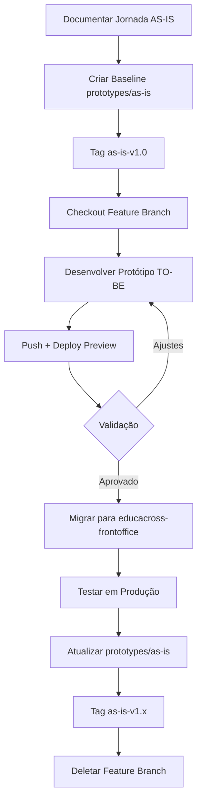

# Workflow de Prototipação - Git e Deploy

> **Guia Prático** - Como usar branches Git para gerenciar baseline AS-IS e protótipos TO-BE  
> **Data**: 3 de fevereiro de 2026  
> **Versão**: 1.0

---

## 📋 Índice

1. [Visão Geral](#-visão-geral)
2. [Estratégia de Branches](#-estratégia-de-branches)
3. [Workflow Completo](#-workflow-completo)
4. [Comandos Git](#-comandos-git)
5. [Deploy e Preview](#-deploy-e-preview)
6. [Boas Práticas](#-boas-práticas)
7. [Troubleshooting](#-troubleshooting)

---

## 🎯 Visão Geral

Este documento descreve o **workflow Git** para gerenciar:

- **Baseline AS-IS**: Réplica do estado atual em produção
- **Protótipos TO-BE**: Melhorias propostas em branches isoladas
- **Sincronização**: Migração de protótipos aprovados para produção

### Princípios Fundamentais

1. **AS-IS como Fonte da Verdade**: Branch `prototypes/as-is` sempre reflete produção
2. **Isolamento de Features**: Cada melhoria em sua própria branch
3. **Versionamento**: Tags para rastrear evolução do baseline
4. **Deploy Automático**: Preview URLs para cada protótipo

---

## 🌿 Estratégia de Branches

### Branch Principal: `prototypes/as-is`

**Propósito**: Baseline que replica estado atual de produção

```
prototypes/as-is
├── Tag: as-is-v1.0 (baseline inicial)
├── Tag: as-is-v1.1 (após Education System V2)
└── Tag: as-is-v1.2 (após Missions V3)
```

**Regras**:
- ✅ Apenas código que replica produção
- ✅ Atualizado após cada migração bem-sucedida
- ❌ Nunca conter código experimental
- ❌ Nunca fazer merge direto de features

### Feature Branches: `prototypes/feature/*`

**Propósito**: Protótipos de melhorias isoladas

```
prototypes/feature/
├── education-system-v2     # Wizard de livros
├── missions-v3             # Timeline de missões
├── missions-editor-v2      # Editor WYSIWYG
└── reports-v2              # Dashboards interativos
```

**Regras**:
- ✅ Partir sempre de `prototypes/as-is`
- ✅ Commits frequentes e descritivos
- ✅ Deploy automático em cada push
- ❌ Nunca fazer merge entre features
- ❌ Deletar após migração para produção

---

## 🔄 Workflow Completo

### Diagrama de Fluxo



### Etapas Detalhadas

#### 1️⃣ **Criar Baseline AS-IS** (Primeira vez)

```bash
cd Ambiente_de_Prototipacao_V5/

# Criar branch baseline
git checkout -b prototypes/as-is

# Desenvolver réplica das 4 jornadas documentadas
npm run dev  # Desenvolver localmente

# Commit baseline inicial
git add .
git commit -m "proto: create as-is baseline v1.0

- Education System Books (PROF-001)
- Education System Missions (PROF-002)
- Custom Missions (PROF-003)
- Mission Reports (ADMIN-001)

Baseline replica estado atual de produção.
Design System integrado via MCP."

# Tag versão
git tag -a as-is-v1.0 -m "AS-IS Baseline v1.0 - Initial prototype baseline"

# Push
git push origin prototypes/as-is --tags
```

#### 2️⃣ **Criar Protótipo TO-BE** (Nova Melhoria)

```bash
# Partir do baseline atualizado
git checkout prototypes/as-is
git pull origin prototypes/as-is

# Criar feature branch
git checkout -b prototypes/feature/education-system-v2

# Desenvolver wizard de seleção de livros
# ... código ...

# Commits incrementais
git add src/views/education-system/
git commit -m "proto: add book selection wizard - step 1 (filter)"

git add src/components/DSBookSelector.vue
git commit -m "proto: add book selection wizard - step 2 (preview)"

git add src/views/education-system/
git commit -m "proto: add book selection wizard - step 3 (confirmation)"

# Push para deploy preview
git push origin prototypes/feature/education-system-v2
```

**Deploy Automático**: GitHub Actions cria preview em `education-system-v2.vercel.app`

#### 3️⃣ **Validar e Iterar**

```bash
# Fazer ajustes baseado em feedback
git add .
git commit -m "proto: improve wizard UX - add loading states"
git push

# Novo deploy preview criado automaticamente
```

#### 4️⃣ **Migrar para Produção** (Após Aprovação)

```bash
# Mudar para repositório de produção
cd ../Ambiente-de-Prototipacao-V4/educacross-frontoffice/

# Criar branch de desenvolvimento
git checkout develop
git pull origin develop
git checkout -b feature/EC-1234-education-system-v2

# Copiar código do protótipo (adaptar conforme necessário)
# Ajustar imports, API calls, validações, etc.

# Commit para produção
git add .
git commit -m "feat(educationSystem): implement book selection wizard

JIRA: EC-1234
Prototype: prototypes/feature/education-system-v2

Changes:
- Add DSBookSelector component
- Add wizard flow (filter → preview → confirm)
- Integrate with existing Education System API
- Add unit tests

Closes EC-1234"

# Push e criar PR
git push origin feature/EC-1234-education-system-v2

# Abrir PR: feature/EC-1234 → develop → homolog → master
```

#### 5️⃣ **Atualizar Baseline AS-IS** (Pós-Deploy)

```bash
# Voltar para protótipos
cd ../../Ambiente_de_Prototipacao_V5/

# Checkout baseline
git checkout prototypes/as-is
git pull origin prototypes/as-is

# Replicar mudanças implementadas em produção
# Copiar código final de educacross-frontoffice
cp -r ../Ambiente-de-Prototipacao-V4/educacross-frontoffice/src/views/pages/teacher-context/educationSystem/ \
      src/views/education-system/

# Commit sincronização
git add .
git commit -m "proto: sync as-is with production v1.1

Migrated from production:
- Education System V2 with book wizard
- Component: DSBookSelector.vue
- Integrated: 2026-02-15

Production deploy: master@a1b2c3d
Feature branch: feature/EC-1234-education-system-v2"

# Atualizar versão
npm version minor  # 1.0.0 → 1.1.0

# Tag nova versão
git tag -a as-is-v1.1 -m "AS-IS Baseline v1.1 - Education System V2"

# Push
git push origin prototypes/as-is --tags

# Arquivar feature branch (opcional)
git branch -d prototypes/feature/education-system-v2
git push origin --delete prototypes/feature/education-system-v2
```

---

## 📝 Comandos Git

### Setup Inicial

```bash
# Clonar repositório
git clone https://github.com/fabioeducacross/Ambiente_de_Prototipacao_V5.git
cd Ambiente_de_Prototipacao_V5

# Criar baseline (primeira vez)
git checkout -b prototypes/as-is
git push -u origin prototypes/as-is
```

### Trabalho Diário

```bash
# Criar novo protótipo
git checkout prototypes/as-is
git pull
git checkout -b prototypes/feature/nome-da-melhoria

# Desenvolver
npm run dev

# Commit e push
git add .
git commit -m "proto: descrição da mudança"
git push origin prototypes/feature/nome-da-melhoria

# Ver preview URL nos logs do GitHub Actions
```

### Sincronização

```bash
# Atualizar baseline após migração
git checkout prototypes/as-is
git pull
# ... copiar código de produção ...
git add .
git commit -m "proto: sync with production vX.Y"
git tag -a as-is-vX.Y -m "Descrição"
git push origin prototypes/as-is --tags
```

### Limpeza

```bash
# Deletar feature branch local e remoto
git branch -d prototypes/feature/nome-da-melhoria
git push origin --delete prototypes/feature/nome-da-melhoria

# Listar tags
git tag -l "as-is-*"

# Ver histórico de baseline
git log prototypes/as-is --oneline --decorate
```

---

## 🚀 Deploy e Preview

### GitHub Actions (Vercel)

**Arquivo**: `.github/workflows/deploy-prototypes.yml`

```yaml
name: Deploy Prototypes

on:
  push:
    branches:
      - 'prototypes/**'

jobs:
  deploy:
    runs-on: ubuntu-latest
    steps:
      - uses: actions/checkout@v4
      
      - name: Setup Node.js
        uses: actions/setup-node@v4
        with:
          node-version: '20'
      
      - name: Install Dependencies
        run: npm ci
      
      - name: Build
        run: npm run build
      
      - name: Deploy to Vercel
        uses: amondnet/vercel-action@v25
        with:
          vercel-token: ${{ secrets.VERCEL_TOKEN }}
          vercel-org-id: ${{ secrets.VERCEL_ORG_ID }}
          vercel-project-id: ${{ secrets.VERCEL_PROJECT_ID }}
          alias-domains: |
            ${{ github.ref_name }}.prototypes.educacross.dev
```

### URLs de Preview

| Branch | URL Preview |
|--------|-------------|
| `prototypes/as-is` | https://as-is.prototypes.educacross.dev |
| `prototypes/feature/education-system-v2` | https://education-system-v2.prototypes.educacross.dev |
| `prototypes/feature/missions-v3` | https://missions-v3.prototypes.educacross.dev |

### Deploy Local (Teste)

```bash
# Build local
npm run build

# Preview
npm run preview

# Acesso: http://localhost:4173
```

---

## ✅ Boas Práticas

### Commits

**Formato**: `proto: descrição curta`

```bash
# ✅ Bom
git commit -m "proto: add book preview modal"
git commit -m "proto: improve wizard loading states"
git commit -m "proto: fix navigation bug in step 3"

# ❌ Ruim
git commit -m "updates"
git commit -m "fix bug"
git commit -m "changes"
```

### Branches

```bash
# ✅ Bom
prototypes/feature/education-system-v2
prototypes/feature/missions-timeline
prototypes/feature/wysiwyg-editor

# ❌ Ruim
feature/new-stuff
prototype
temp-branch
```

### Tags

```bash
# ✅ Bom
as-is-v1.0  # Baseline inicial
as-is-v1.1  # Após Education System V2
as-is-v1.2  # Após Missions V3

# ❌ Ruim
v1
baseline
final
```

### Pull Requests

**Título**: `[PROTO]: Nome da Melhoria`

**Body**:
```markdown
## Descrição

Protótipo de wizard de seleção de livros para Education System.

## Jornada Base

PROF-001: Education System Books

## Melhorias Implementadas

- ✅ Wizard passo-a-passo (filter → preview → confirm)
- ✅ Preview interativo de páginas
- ✅ Sistema de favoritos
- ✅ Histórico de últimos livros acessados

## Preview URL

https://education-system-v2.prototypes.educacross.dev

## Screenshots


## Checklist

- [x] Desenvolvido
- [x] Testado localmente
- [x] Preview deployado
- [ ] Feedback coletado
- [ ] Aprovado por PO
- [ ] Pronto para migração
```

---

## 🔧 Troubleshooting

### Problema: Branch desatualizada

```bash
# Atualizar feature branch com baseline
git checkout prototypes/feature/minha-feature
git fetch origin
git rebase origin/prototypes/as-is

# Resolver conflitos se houver
# ... editar arquivos ...
git add .
git rebase --continue

# Force push (cuidado!)
git push --force-with-lease
```

### Problema: Deploy preview falhou

```bash
# Ver logs no GitHub Actions
# Ou testar build local:
npm run build

# Se houver erro, corrigir e commit
git add .
git commit -m "proto: fix build error"
git push
```

### Problema: Tag já existe

```bash
# Deletar tag local e remota
git tag -d as-is-v1.1
git push origin --delete as-is-v1.1

# Criar novamente
git tag -a as-is-v1.1 -m "AS-IS v1.1"
git push origin as-is-v1.1
```

### Problema: Esqueci de partir do baseline

```bash
# Rebase para baseline
git checkout prototypes/feature/minha-feature
git rebase prototypes/as-is

# Ou criar nova branch corretamente
git checkout prototypes/as-is
git checkout -b prototypes/feature/minha-feature-v2
git cherry-pick <commits-da-branch-errada>
```

---

## 📊 CHANGELOG.md

Manter arquivo `CHANGELOG.md` na raiz:

```markdown
# Changelog - Protótipos Educacross

## [AS-IS v1.2] - 2026-03-30

### Implementado em Produção
- **Missions V3**: Timeline e ações em lote
- Deploy: master@x9y8z7w

### Baseline Atualizado
- src/views/missions/ atualizado
- Componente DSMissionTimeline integrado

---

## [AS-IS v1.1] - 2026-03-15

### Implementado em Produção
- **Education System V2**: Wizard de seleção de livros
- Deploy: master@a1b2c3d

### Baseline Atualizado
- src/views/education-system/ atualizado
- Componente DSBookSelector integrado

---

## [AS-IS v1.0] - 2026-02-03

### Baseline Inicial
- Réplica de 4 jornadas core:
  - PROF-001: Education System Books
  - PROF-002: Education System Missions
  - PROF-003: Custom Missions
  - ADMIN-001: Mission Reports
- Design System integrado via MCP
- Estrutura DDD: Index → Filters → List
```

---

## 📚 Referências

- **PLANO.md**: Planejamento completo do projeto
- **GitHub Flow**: https://guides.github.com/introduction/flow/
- **Semantic Versioning**: https://semver.org/
- **Vercel Deployment**: https://vercel.com/docs

---

**Última Atualização**: 3 de fevereiro de 2026  
**Versão**: 1.0  
**Status**: ✅ Pronto para uso
