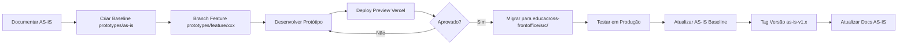
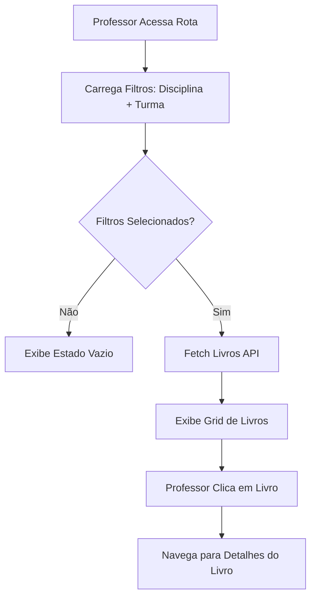

# Plano de Documentação e Prototipação - Educacross

> **Documento Mestre** - Consolidação de estratégia de documentação AS-IS e fluxo de prototipação TO-BE  
> **Data de Criação**: 2 de fevereiro de 2026  
> **Status**: 🟡 Planejamento Completo - Aguardando Implementação

---

## 📋 Índice

1. [Visão Geral](#-visão-geral)
2. [Arquitetura de Projetos](#-arquitetura-de-projetos)
3. [Workflow de Prototipação](#-workflow-de-prototipação)
4. [Sistema de Documentação](#-sistema-de-documentação)
5. [Automação e Scripts](#-automação-e-scripts)
6. [Integração do Design System](#-integração-do-design-system)
7. [Jornadas Prioritárias](#-jornadas-prioritárias)
8. [Roadmap de Implementação](#-roadmap-de-implementação)
9. [Referências Técnicas](#-referências-técnicas)

---

## 🎯 Visão Geral

### Objetivos Principais

1. **Documentar AS-IS** - Capturar estado atual das 50+ jornadas do educacross-frontoffice
2. **Prototipação TO-BE** - Criar protótipos de melhorias usando Design System
3. **Automação** - Scripts para análise de rotas, capturas de tela e geração de docs
4. **Versionamento** - Git branches para gerenciar AS-IS baseline e feature prototypes
5. **Wiki Técnico** - Docusaurus customizado com tema Vuexy para documentação viva

### Contexto dos Projetos

| Projeto | Propósito | Tecnologia | Localização |
|---------|-----------|------------|-------------|
| **educacross-frontoffice** | ⚠️ REFERÊNCIA APENAS - Não programar aqui | Vue 2.7 + DDD | `Ambiente-de-Prototipacao-V4/educacross-frontoffice/` |
| **Ambiente_de_Prototipacao_V5** | 🎯 Protótipos AS-IS e TO-BE | Vue 3.5 + Vite 7.2 + Design System MCP | `Ambiente_de_Prototipacao_V5/` |

---

## 🏗️ Arquitetura de Projetos

### educacross-frontoffice (REFERÊNCIA)

```
educacross-frontoffice/
├── src/
│   ├── views/pages/                     # 50+ jornadas existentes
│   │   ├── teacher-context/             # 11 jornadas professor
│   │   ├── admin-context/               # 6 jornadas admin
│   │   ├── student-context/             # 3 jornadas aluno
│   │   └── ...
│   ├── components/                      # Componentes legados
│   │   ├── selects/ESelect.vue          # 976 linhas - dropdown avançado
│   │   └── table/ListTable.vue          # 418 linhas - tabela paginada
│   ├── store/filters/useFilters.js      # 283 linhas - composable global
│   └── router/
│       ├── professor-routes.js          # 1810 linhas - 28 rotas
│       └── admin-routes/index.js        # 1633 linhas - 15 rotas
└── ...                                  # ⚠️ NÃO MODIFICAR - Somente consulta
```

### Estrutura de Documentação (Docusaurus)

```
docs/                                    # 🆕 A CRIAR
├── docusaurus.config.js                 # Config com tema Vuexy
├── src/
│   ├── css/custom.css                   # CSS vars (#7367F0, etc.)
│   └── components/                      # Componentes React customizados
├── docs/
│   ├── journeys/                        # Documentação AS-IS
│   │   ├── teacher/                     # 11 jornadas professor
│   │   │   ├── education-system-books.md
│   │   │   ├── custom-missions.md
│   │   │   └── ...
│   │   ├── admin/                       # 6 jornadas admin
│   │   ├── student/                     # 3 jornadas aluno
│   │   └── ...
│   ├── prototypes/                      # Documentação TO-BE
│   │   ├── education-system-v2.md
│   │   └── missions-v3.md
│   └── architecture/                    # Docs técnicos
│       ├── ddd-pattern.md
│       ├── useFilters.md
│       └── components.md
└── static/
    ├── img/screenshots/                 # Capturas Playwright
    └── img/diagrams/                    # Diagramas Mermaid
```

---

## 🔄 Workflow de Prototipação

### Estratégia de Git Branches

```
Ambiente_de_Prototipacao_V5/
├── Branch: prototypes/as-is (ou main)   # 📌 Baseline - Estado Inicial
│   ├── Contém: Réplica das telas de produção
│   ├── Atualização: Após migração para produção
│   └── Tags: as-is-v1.0, as-is-v1.1, etc.
│
├── Branch: prototypes/feature/education-system-v2  # 🚀 Melhorias propostas
│   ├── Base: prototypes/as-is
│   ├── Contém: Protótipo com wizard de seleção de livros
│   └── Deploy: Vercel preview URL
│
└── Branch: prototypes/feature/missions-v3  # 🚀 Melhorias propostas
    ├── Base: prototypes/as-is
    ├── Contém: Novo fluxo de criação de missões
    └── Deploy: Vercel preview URL
```

### Fluxo de Trabalho Completo



### Comandos Git do Workflow

#### 1. Criar Baseline AS-IS

```bash
cd Ambiente_de_Prototipacao_V5/

# Criar branch baseline
git checkout -b prototypes/as-is

# Desenvolver réplica das telas de produção
npm run dev

# Commit inicial
git add .
git commit -m "proto: create as-is baseline v1.0"
git tag as-is-v1.0
git push origin prototypes/as-is --tags
```

#### 2. Criar Protótipo de Melhoria (TO-BE)

```bash
# Partir do baseline
git checkout prototypes/as-is
git pull origin prototypes/as-is

# Criar feature branch
git checkout -b prototypes/feature/education-system-v2

# Desenvolver melhorias
# ... código ...

# Commits incrementais
git add .
git commit -m "proto: add book selection wizard step 1"
git commit -m "proto: add book selection wizard step 2"
git push origin prototypes/feature/education-system-v2

# Abrir PR para revisão
# Deploy automático via GitHub Actions → Vercel
```

#### 3. Pós-Aprovação: Migrar para Produção

```bash
# Após aprovação do protótipo
cd ../Ambiente-de-Prototipacao-V4/educacross-frontoffice/

# Criar branch de desenvolvimento
git checkout -b feature/EC-1234-education-system-v2

# Copiar código do protótipo
cp -r prototypes/src/views/education-system-v2/* src/views/pages/teacher-context/educationSystem/

# Adaptar para produção (ajustes de API, validações, etc.)
# ... desenvolvimento ...

# Commit para produção
git add .
git commit -m "feat(educationSystem): implement book selection wizard"
git push origin feature/EC-1234-education-system-v2

# Abrir PR para develop → homolog → master
```

#### 4. Atualizar AS-IS Baseline

```bash
cd Ambiente_de_Prototipacao_V5/

# Atualizar baseline com novo estado de produção
git checkout prototypes/as-is
git pull origin prototypes/as-is

# Replicar mudanças implementadas
# ... código ...

git add .
git commit -m "proto: sync as-is with production v1.1 - book wizard"
git tag as-is-v1.1
git push origin prototypes/as-is --tags

# Arquivar feature branch
git branch -d prototypes/feature/education-system-v2
git push origin --delete prototypes/feature/education-system-v2
```

### CHANGELOG.md do Protótipo

```markdown
# Changelog - Protótipos Educacross

## [AS-IS v1.1] - 2026-03-15

### Implementado em Produção
- **Education System v2**: Wizard de seleção de livros aprovado e migrado
- **Componente**: DSBookSelector.vue integrado via MCP

### Baseline Atualizado
- src/views/education-system/ atualizado para refletir produção

---

## [AS-IS v1.0] - 2026-02-02

### Baseline Inicial
- Réplica das 15 jornadas core do educacross-frontoffice
- Estrutura: Index.vue → Filters.vue → List.vue
- Componentes: ESelect, ListTable, useFilters()
```

---

## 📚 Sistema de Documentação

### Plataforma Escolhida: **Docusaurus** 🏆

**Score**: 95/100 | **Custo**: $0/ano | **Deploy**: GitHub Pages

#### Razões da Escolha

| Critério | Pontuação | Justificativa |
|----------|-----------|---------------|
| **Customização** | 20/20 | CSS/React total, perfeito para tema Vuexy |
| **Custo** | 20/20 | $0/ano hospedado no GitHub Pages |
| **Automação** | 18/20 | Playwright + GitHub Actions sem limitações |
| **Diagramas** | 18/20 | Mermaid.js nativo |
| **Busca** | 10/10 | Algolia DocSearch gratuito |
| **Performance** | 9/10 | Static site generation ultra rápido |

**Alternativas Avaliadas**: Wiki.js (85/100), BookStack (70/100), Outline (65/100), Notion (60/100), GitBook (55/100), Confluence (45/100)

### Setup Docusaurus com Tema Vuexy

#### Instalação

```bash
cd docs/

npx create-docusaurus@latest educacross-docs classic --typescript

cd educacross-docs/
npm install
```

#### Customização do Tema (src/css/custom.css)

```css
:root {
  /* Vuexy Color Palette */
  --primary: #7367F0;
  --success: #28C76F;
  --danger: #EA5455;
  --warning: #FF9F43;
  --info: #00CFE8;
  
  /* Docusaurus Overrides */
  --ifm-color-primary: #7367F0;
  --ifm-color-primary-dark: #5E55F0;
  --ifm-color-primary-darker: #5449EF;
  --ifm-color-primary-darkest: #3A2BE8;
  --ifm-color-primary-light: #8879F1;
  --ifm-color-primary-lighter: #9288F2;
  --ifm-color-primary-lightest: #B5ACF5;
  
  /* Success */
  --ifm-color-success: #28C76F;
  --ifm-color-success-dark: #24B864;
  
  /* Danger */
  --ifm-color-danger: #EA5455;
  --ifm-color-danger-dark: #E73C3D;
  
  /* Warning */
  --ifm-color-warning: #FF9F43;
  --ifm-color-warning-dark: #FF8F24;
  
  /* Info */
  --ifm-color-info: #00CFE8;
  --ifm-color-info-dark: #00B8D4;
  
  /* Typography */
  --ifm-font-family-base: 'Montserrat', sans-serif;
  --ifm-heading-font-family: 'Montserrat', sans-serif;
  
  /* Sidebar */
  --doc-sidebar-width: 280px;
  --ifm-navbar-height: 60px;
}

/* Badges */
.badge-primary { background: var(--primary); color: white; }
.badge-success { background: var(--success); color: white; }
.badge-danger { background: var(--danger); color: white; }
.badge-warning { background: var(--warning); color: white; }
.badge-info { background: var(--info); color: white; }

/* Cards */
.feature-card {
  border-radius: 8px;
  box-shadow: 0 4px 25px 0 rgba(0,0,0,0.1);
  transition: transform 0.3s ease;
}

.feature-card:hover {
  transform: translateY(-5px);
  box-shadow: 0 8px 30px 0 rgba(115,103,240,0.3);
}
```

#### Configuração (docusaurus.config.js)

```javascript
const config = {
  title: 'Educacross - Documentação Técnica',
  tagline: 'Jornadas de Usuário e Guias de Desenvolvimento',
  url: 'https://educacross.github.io',
  baseUrl: '/docs/',
  
  organizationName: 'educacross',
  projectName: 'docs',
  
  themeConfig: {
    navbar: {
      title: 'Educacross',
      logo: {
        alt: 'Educacross Logo',
        src: 'img/logo.svg',
      },
      items: [
        {
          type: 'doc',
          docId: 'journeys/intro',
          position: 'left',
          label: 'Jornadas',
        },
        {
          type: 'doc',
          docId: 'prototypes/intro',
          position: 'left',
          label: 'Protótipos',
        },
        {
          type: 'doc',
          docId: 'architecture/intro',
          position: 'left',
          label: 'Arquitetura',
        },
      ],
    },
    
    footer: {
      style: 'dark',
      copyright: `© ${new Date().getFullYear()} Educacross. Documentação gerada com Docusaurus.`,
    },
    
    // Algolia Search
    algolia: {
      appId: 'YOUR_APP_ID',
      apiKey: 'YOUR_API_KEY',
      indexName: 'educacross-docs',
    },
  },
  
  plugins: [
    [
      '@docusaurus/plugin-content-docs',
      {
        sidebarPath: require.resolve('./sidebars.js'),
        editUrl: 'https://github.com/educacross/docs/edit/main/',
      },
    ],
  ],
};
```

### Template de Documentação AS-IS

#### Exemplo: docs/journeys/teacher/education-system-books.md

```markdown
---
id: education-system-books
title: Sistema Educacional - Livros
sidebar_label: Livros
tags: [teacher, education-system, books]
---

# Sistema Educacional - Livros

## Visão Geral

Jornada para visualização e navegação nos livros do sistema educacional por professores.

| Propriedade | Valor |
|-------------|-------|
| **Contexto** | Professor |
| **Rota** | `/education-system/books` |
| **Componentes Principais** | Index.vue, List.vue, useEducationSystemBooks.js |
| **Filtros Globais** | Disciplina (subject), Turma (classe) |
| **Status** | ✅ Ativo |

---

## Estrutura de Arquivos

```
src/views/pages/teacher-context/educationSystem/books/
├── Index.vue                        # Orchestrator
├── List.vue                         # Tabela de livros
└── useEducationSystemBooks.js       # Composable (221 linhas)
```

---

## Fluxo de Usuário



---

## Screenshots

### Tela Principal


**Captura**: `npm run capture:screenshots -- --journey=education-system-books`

### Filtros


---

## Componentes Utilizados

### ESelect (Dropdown Avançado)

```vue
<ESelect
  v-model="subject"
  :options="subjects"
  label="name"
  track-by="id"
  placeholder="Selecione a disciplina"
/>
```

**Fonte**: `src/components/selects/ESelect.vue` (976 linhas)

### ListTableLocalSorting (Tabela Client-Side)

```vue
<ListTableLocalSorting
  :data-table="books"
  :table-columns="columns"
  :loading="loading"
  :per-page-default="12"
/>
```

**Fonte**: `src/components/table/ListTableLocalSorting.vue`

---

## Composable: useEducationSystemBooks

**Localização**: `src/views/pages/teacher-context/educationSystem/books/useEducationSystemBooks.js`

### State

```javascript
const books = computed({
  get: () => store.getters['EducationSystemBooks/books'],
  set: val => store.commit('EducationSystemBooks/books', val),
})

const loading = computed({
  get: () => store.getters['EducationSystemBooks/loading'],
  set: val => store.commit('EducationSystemBooks/loading', val),
})
```

### Methods

```javascript
const fetchData = async () => {
  loading.value = true
  const response = await getEducationSystemBooks({
    SubjectId: subject.value.id,
    EducationSystemId: educationSystemId.value,
    ClassId: classe.value.ClassId,
  })
  books.value = response.data.books
  loading.value = false
}
```

---

## Integração com useFilters()

```javascript
import useFilters from '@/store/filters/useFilters'

const { subject, subjects, classe, classes, educationSystemId } = useFilters()

watch([subject, classe], () => {
  if (subject.value?.id && classe.value?.ClassId) {
    fetchData()
  }
})
```

---

## API Endpoints

### GET /education-system/books

**Request**:
```json
{
  "SubjectId": 5,
  "EducationSystemId": 2,
  "ClassId": 123
}
```

**Response**:
```json
{
  "books": [
    {
      "id": 1,
      "title": "Matemática - 5º Ano",
      "coverUrl": "https://blob.educacross.com/books/cover-1.jpg",
      "pagesCount": 240,
      "chaptersCount": 12
    }
  ]
}
```

---

## Melhorias Propostas (TO-BE)

- [ ] **Wizard de Seleção**: Guia passo-a-passo para selecionar livro
- [ ] **Preview Interativo**: Visualizar páginas do livro antes de abrir
- [ ] **Favoritos**: Permitir marcar livros favoritos
- [ ] **Histórico**: Mostrar últimos livros acessados
- [ ] **Busca Avançada**: Filtro por capítulo, página, ou conteúdo

**Protótipo**: [Veja o protótipo TO-BE](/prototypes/education-system-v2)

---

## Rastreamento de Mudanças

| Versão | Data | Mudanças | Autor |
|--------|------|----------|-------|
| AS-IS v1.0 | 2026-02-02 | Documentação inicial | Equipe Docs |
| AS-IS v1.1 | 2026-03-15 | Wizard implementado | Equipe Dev |

---

## Referências

- [Design System - DSBookCard](https://storybook.educacross.com/?path=/story/cards-bookcard)
- [API Docs - Books Endpoint](https://apieducacrossmanager-test.azurewebsites.net/index.html)
- [Protótipo TO-BE - Education System v2](/prototypes/education-system-v2)
```

---

## 🤖 Automação e Scripts

### Script 1: analyze-routes.js

**Objetivo**: Extrair metadata de rotas do educacross-frontoffice

**Localização**: `scripts/analyze-routes.js`

```javascript
/**
 * Script para análise de rotas do educacross-frontoffice
 * Extrai: nome, path, componente, meta (title, resource, action)
 * Saída: JSON com metadata de todas as jornadas
 */
const fs = require('fs')
const path = require('path')

const routeFiles = [
  '../educacross-frontoffice/src/router/professor-routes.js',
  '../educacross-frontoffice/src/router/admin-routes/index.js',
  '../educacross-frontoffice/src/router/student-routes.js',
  // ... outros arquivos de rotas
]

const journeys = []

// Parser de AST para extrair routes
routeFiles.forEach(file => {
  const content = fs.readFileSync(path.resolve(__dirname, file), 'utf-8')
  
  // Regex para extrair rotas (simplificado)
  const routeRegex = /{[\s\S]*?path:\s*['"](.+?)['"][\s\S]*?name:\s*['"](.+?)['"][\s\S]*?component:\s*\(\)\s*=>\s*import\(['"](.+?)['"]\)[\s\S]*?}/g
  
  let match
  while ((match = routeRegex.exec(content)) !== null) {
    journeys.push({
      path: match[1],
      name: match[2],
      component: match[3],
      context: file.includes('professor') ? 'teacher' : 
               file.includes('admin') ? 'admin' : 
               file.includes('student') ? 'student' : 'unknown',
    })
  }
})

// Salvar JSON
fs.writeFileSync(
  path.resolve(__dirname, '../docs/data/journeys-metadata.json'),
  JSON.stringify(journeys, null, 2)
)

console.log(`✅ ${journeys.length} jornadas analisadas`)
```

**Uso**: `node scripts/analyze-routes.js`

---

### Script 2: capture-screenshots.js

**Objetivo**: Capturar screenshots das jornadas com Playwright

**Localização**: `scripts/capture-screenshots.js`

```javascript
/**
 * Script de captura de screenshots com Playwright
 * Executa login → navega pelas rotas → captura telas
 * Saída: PNG em docs/static/img/screenshots/
 */
const { chromium } = require('playwright')
const fs = require('fs')
const path = require('path')

const journeysMetadata = require('../docs/data/journeys-metadata.json')

const BASE_URL = 'https://educacross-test.com'
const SCREENSHOT_DIR = path.resolve(__dirname, '../docs/static/img/screenshots')

async function captureScreenshots() {
  const browser = await chromium.launch({ headless: true })
  const context = await browser.newContext({
    viewport: { width: 1920, height: 1080 },
  })
  const page = await context.newPage()

  // Login
  await page.goto(`${BASE_URL}/login`)
  await page.fill('#email', process.env.TEST_USER_EMAIL)
  await page.fill('#password', process.env.TEST_USER_PASSWORD)
  await page.click('button[type="submit"]')
  await page.waitForNavigation()

  console.log('✅ Login realizado')

  // Capturar cada jornada
  for (const journey of journeysMetadata) {
    try {
      console.log(`📸 Capturando: ${journey.name}`)
      
      await page.goto(`${BASE_URL}${journey.path}`)
      await page.waitForLoadState('networkidle')
      await page.waitForTimeout(2000) // Aguardar animações
      
      const screenshotPath = path.join(
        SCREENSHOT_DIR,
        journey.context,
        `${journey.name}.png`
      )
      
      // Criar diretório se não existir
      fs.mkdirSync(path.dirname(screenshotPath), { recursive: true })
      
      await page.screenshot({ path: screenshotPath, fullPage: true })
      
      console.log(`  ✅ Salvo: ${screenshotPath}`)
    } catch (error) {
      console.error(`  ❌ Erro: ${journey.name} - ${error.message}`)
    }
  }

  await browser.close()
  console.log('🎉 Capturas concluídas')
}

captureScreenshots()
```

**Uso**: `node scripts/capture-screenshots.js`

**Variáveis de Ambiente**:
```bash
TEST_USER_EMAIL=professor@educacross.com
TEST_USER_PASSWORD=senha123
```

---

### Script 3: generate-docs-pipeline.js

**Objetivo**: Pipeline unificado (análise + captura + markdown)

**Localização**: `scripts/generate-docs-pipeline.js`

```javascript
/**
 * Pipeline completo de geração de documentação
 * 1. Analisa rotas (analyze-routes.js)
 * 2. Captura screenshots (capture-screenshots.js)
 * 3. Gera arquivos markdown baseados em template
 */
const { execSync } = require('child_process')
const fs = require('fs')
const path = require('path')

const journeysMetadata = require('../docs/data/journeys-metadata.json')

console.log('🚀 Iniciando pipeline de documentação AS-IS\n')

// Passo 1: Análise de rotas
console.log('📊 Passo 1: Analisando rotas...')
execSync('node scripts/analyze-routes.js', { stdio: 'inherit' })

// Passo 2: Captura de screenshots
console.log('\n📸 Passo 2: Capturando screenshots...')
execSync('node scripts/capture-screenshots.js', { stdio: 'inherit' })

// Passo 3: Gerar markdown
console.log('\n📝 Passo 3: Gerando arquivos markdown...')

const template = fs.readFileSync(
  path.resolve(__dirname, '../docs/templates/journey-template.md'),
  'utf-8'
)

journeysMetadata.forEach(journey => {
  const markdown = template
    .replace(/{{NAME}}/g, journey.name)
    .replace(/{{PATH}}/g, journey.path)
    .replace(/{{CONTEXT}}/g, journey.context)
    .replace(/{{COMPONENT}}/g, journey.component)
    .replace(/{{SCREENSHOT}}/g, `../../static/img/screenshots/${journey.context}/${journey.name}.png`)
  
  const outputPath = path.resolve(
    __dirname,
    `../docs/docs/journeys/${journey.context}/${journey.name}.md`
  )
  
  fs.mkdirSync(path.dirname(outputPath), { recursive: true })
  fs.writeFileSync(outputPath, markdown)
  
  console.log(`  ✅ Gerado: ${outputPath}`)
})

console.log('\n🎉 Pipeline concluído! Documentação AS-IS atualizada.')
```

**Uso**: `node scripts/generate-docs-pipeline.js`

---

### Script 4: sync-prototype-to-as-is.js

**Objetivo**: Sincronizar protótipo aprovado de volta ao baseline AS-IS

**Localização**: `scripts/sync-prototype-to-as-is.js`

```javascript
/**
 * Script para sincronizar protótipo aprovado com baseline AS-IS
 * Uso: node scripts/sync-prototype-to-as-is.js --feature=education-system-v2
 */
const { execSync } = require('child_process')
const fs = require('fs')
const path = require('path')

const featureName = process.argv.find(arg => arg.startsWith('--feature='))?.split('=')[1]

if (!featureName) {
  console.error('❌ Erro: especifique --feature=nome-do-feature')
  process.exit(1)
}

console.log(`🔄 Sincronizando ${featureName} com AS-IS baseline\n`)

// 1. Checkout para as-is
execSync('git checkout prototypes/as-is', { stdio: 'inherit' })
execSync('git pull origin prototypes/as-is', { stdio: 'inherit' })

// 2. Merge do feature branch
try {
  execSync(`git merge prototypes/feature/${featureName} --no-ff -m "proto: sync ${featureName} to as-is"`, { stdio: 'inherit' })
} catch (error) {
  console.error('❌ Erro no merge. Resolva conflitos manualmente.')
  process.exit(1)
}

// 3. Atualizar versão no package.json
const packageJson = JSON.parse(fs.readFileSync('./package.json', 'utf-8'))
const [major, minor, patch] = packageJson.version.split('.').map(Number)
packageJson.version = `${major}.${minor + 1}.0`
fs.writeFileSync('./package.json', JSON.stringify(packageJson, null, 2))

const newVersion = packageJson.version

// 4. Commit e tag
execSync(`git add package.json`, { stdio: 'inherit' })
execSync(`git commit --amend --no-edit`, { stdio: 'inherit' })
execSync(`git tag as-is-v${newVersion}`, { stdio: 'inherit' })

// 5. Push
execSync('git push origin prototypes/as-is --tags', { stdio: 'inherit' })

// 6. Deletar feature branch remoto (opcional)
const deleteRemote = process.argv.includes('--delete-remote')
if (deleteRemote) {
  execSync(`git push origin --delete prototypes/feature/${featureName}`, { stdio: 'inherit' })
  console.log(`✅ Feature branch remoto deletado`)
}

console.log(`\n🎉 AS-IS baseline atualizado para v${newVersion}`)
console.log(`📦 Tag criada: as-is-v${newVersion}`)
console.log(`🔗 https://github.com/educacross/frontoffice/releases/tag/as-is-v${newVersion}`)
```

**Uso**: 
```bash
node scripts/sync-prototype-to-as-is.js --feature=education-system-v2 --delete-remote
```

---

## 🎨 Integração do Design System

### MCP (Model Context Protocol) - Aguardando Criação pelo Usuário

O usuário criará um MCP Server para expor os componentes do Storybook como código consumível.

**Estrutura Esperada do MCP**:

```
design-system-mcp/
├── server.js                        # MCP Server
├── components/
│   ├── DSButton.json               # Spec do botão
│   ├── DSCard.json                 # Spec do card
│   ├── DSSelect.json               # Spec do select
│   └── ...
└── README.md                        # Documentação de uso
```

### Plugin de Integração no Protótipo

**Localização**: `Ambiente_de_Prototipacao_V5/src/plugins/ds-mcp.js`

```javascript
/**
 * Plugin para integrar Design System via MCP
 * Registra componentes dinamicamente do Storybook
 */
import { createApp } from 'vue'
import axios from 'axios'

const DS_MCP_ENDPOINT = process.env.VUE_APP_DS_MCP_URL || 'http://localhost:3000'

export default {
  async install(app) {
    // Fetch componentes do MCP
    const { data: components } = await axios.get(`${DS_MCP_ENDPOINT}/components`)
    
    // Registrar cada componente
    components.forEach(component => {
      app.component(component.name, {
        name: component.name,
        props: component.props,
        template: component.template,
        // ... resto da definição
      })
    })
    
    console.log(`✅ ${components.length} componentes do Design System carregados via MCP`)
  },
}
```

**Uso no main.js**:

```javascript
import { createApp } from 'vue'
import App from './App.vue'
import dsMcpPlugin from './plugins/ds-mcp'

const app = createApp(App)

app.use(dsMcpPlugin)
app.mount('#app')
```

### Wrapper Genérico para Componentes MCP

**Localização**: `Ambiente_de_Prototipacao_V5/src/components/DSWrapper.vue`

```vue
<template>
  <component
    :is="componentName"
    v-bind="$attrs"
    v-on="$listeners"
  >
    <slot />
  </component>
</template>

<script>
export default {
  name: 'DSWrapper',
  props: {
    componentName: {
      type: String,
      required: true,
    },
  },
}
</script>
```

**Uso em Protótipos**:

```vue
<template>
  <div>
    <DSWrapper component-name="DSButton" variant="primary" @click="handleClick">
      Salvar
    </DSWrapper>
    
    <DSWrapper component-name="DSCard" title="Livros" :collapsible="true">
      <p>Conteúdo do card</p>
    </DSWrapper>
  </div>
</template>
```

---

## 📌 Jornadas Prioritárias

### 15 Jornadas Core para Documentação AS-IS

| # | Jornada | Contexto | Rota | Prioridade |
|---|---------|----------|------|------------|
| 1 | **Education System Books** | Professor | `/education-system/books` | 🔴 Alta |
| 2 | **Custom Missions** | Professor | `/custom-missions` | 🔴 Alta |
| 3 | **Events Management** | Professor | `/events` | 🔴 Alta |
| 4 | **Student Records** | Professor | `/records/students` | 🟡 Média |
| 5 | **Classes Records** | Professor | `/records/classes` | 🟡 Média |
| 6 | **Mission Reports** | Admin | `/reports/missions` | 🔴 Alta |
| 7 | **Student Access Report** | Admin | `/reports/student-access` | 🟡 Média |
| 8 | **Evidence Report** | Admin | `/reports/evidence` | 🟡 Média |
| 9 | **Skill Report** | Admin | `/reports/skills` | 🟡 Média |
| 10 | **High Five Missions** | Estudante | `/missions/high-five` | 🟡 Média |
| 11 | **Library Games** | Estudante | `/library/games` | 🟢 Baixa |
| 12 | **Library Books** | Estudante | `/library/books` | 🟢 Baixa |
| 13 | **School Ranking** | Network Manager | `/ranking/schools` | 🟡 Média |
| 14 | **Island Ranking** | Network Manager | `/ranking/islands` | 🟡 Média |
| 15 | **Writing Phases Students** | Auditor | `/writing-phases/students` | 🟢 Baixa |

### Critérios de Priorização

- 🔴 **Alta**: Jornadas mais usadas (>1000 acessos/dia)
- 🟡 **Média**: Jornadas regulares (100-1000 acessos/dia)
- 🟢 **Baixa**: Jornadas esporádicas (<100 acessos/dia)

### Roadmap de Documentação

**Sprint 1 (Semana 1-2)**: Jornadas Alta Prioridade
- [ ] Education System Books
- [ ] Custom Missions
- [ ] Events Management
- [ ] Mission Reports

**Sprint 2 (Semana 3-4)**: Jornadas Média Prioridade
- [ ] Student Records
- [ ] Classes Records
- [ ] Student Access Report
- [ ] Evidence Report
- [ ] Skill Report
- [ ] High Five Missions
- [ ] School Ranking
- [ ] Island Ranking

**Sprint 3 (Semana 5)**: Jornadas Baixa Prioridade
- [ ] Library Games
- [ ] Library Books
- [ ] Writing Phases Students

---

## 🗓️ Roadmap de Implementação

### Fase 1: Fundação (Semana 1) ✅

**Objetivo**: Preparar infraestrutura de documentação e prototipação

- [x] Criar .github/copilot-instructions.md com warning de referência
- [x] Comparar plataformas wiki (Docusaurus escolhido)
- [x] Criar docs/comparacao-plataformas-wiki.md
- [ ] **Setup Docusaurus** com tema Vuexy customizado
- [ ] **Configurar branches Git** em Ambiente_de_Prototipacao_V5
- [ ] Configurar Vercel para deploy de protótipos
- [ ] Escrever PROTOTYPES-WORKFLOW.md com workflow Git

**Entregáveis**:
- ✅ Plano consolidado (este documento)
- ⏳ Docusaurus rodando em localhost:3000
- ⏳ Ambiente_de_Prototipacao_V5 rodando em localhost:5173
- ⏳ GitHub Actions para deploy automático

---

### Fase 2: Automação (Semana 2) 🟡

**Objetivo**: Criar scripts para análise e captura

- [ ] Implementar `scripts/analyze-routes.js`
- [ ] Implementar `scripts/capture-screenshots.js` (Playwright)
- [ ] Implementar `scripts/generate-docs-pipeline.js`
- [ ] Testar pipeline completo com 1 jornada piloto
- [ ] Gerar `docs/data/journeys-metadata.json`

**Entregáveis**:
- ⏳ Script de análise gerando JSON correto
- ⏳ Screenshots capturados para 1 jornada
- ⏳ Markdown gerado automaticamente

---

### Fase 3: Documentação AS-IS - Sprint 1 (Semana 3-4) ⏳

**Objetivo**: Documentar 4 jornadas de alta prioridade

- [ ] **Education System Books** - Análise + Screenshots + Markdown
- [ ] **Custom Missions** - Análise + Screenshots + Markdown
- [ ] **Events Management** - Análise + Screenshots + Markdown
- [ ] **Mission Reports** - Análise + Screenshots + Markdown

**Entregáveis**:
- ⏳ 4 páginas de documentação publicadas
- ⏳ Diagramas Mermaid de fluxo de usuário
- ⏳ Screenshots de alta qualidade
- ⏳ Links para Design System Storybook

---

### Fase 4: Baseline AS-IS (Semana 5) ⏳

**Objetivo**: Criar baseline de protótipos replicando produção

- [ ] Criar branch `prototypes/as-is`
- [ ] Aguardar MCP do Design System (usuário criará)
- [ ] Integrar MCP no protótipo (`plugins/ds-mcp.js`)
- [ ] Replicar 4 jornadas documentadas no baseline
- [ ] Tag `as-is-v1.0` e push

**Entregáveis**:
- ⏳ Branch prototypes/as-is com 4 telas funcionais
- ⏳ Design System integrado via MCP
- ⏳ Deploy em Vercel: https://prototypes-as-is.vercel.app

---

### Fase 5: Prototipação TO-BE (Semana 6-8) ⏳

**Objetivo**: Criar protótipos de melhorias

- [ ] Feature branch: `prototypes/feature/education-system-v2`
- [ ] Desenvolver wizard de seleção de livros
- [ ] Feature branch: `prototypes/feature/missions-v3`
- [ ] Desenvolver fluxo simplificado de criação de missões
- [ ] Coletar feedback de stakeholders
- [ ] Ajustar protótipos baseado em feedback

**Entregáveis**:
- ⏳ 2 protótipos TO-BE funcionais
- ⏳ Deploy previews: https://proto-education-v2.vercel.app
- ⏳ Documentação TO-BE em Docusaurus

---

### Fase 6: Migração para Produção (Semana 9-10) ⏳

**Objetivo**: Implementar protótipos aprovados em produção

- [ ] Aprovar protótipos com Product Owner
- [ ] Criar feature branches em educacross-frontoffice
- [ ] Migrar código dos protótipos
- [ ] Testes de integração e QA
- [ ] Deploy para produção
- [ ] Atualizar AS-IS baseline com `sync-prototype-to-as-is.js`

**Entregáveis**:
- ⏳ 2 features em produção
- ⏳ AS-IS baseline atualizado (tag as-is-v1.1)
- ⏳ Documentação AS-IS atualizada

---

### Fase 7: Escala (Semana 11+) ⏳

**Objetivo**: Documentar restante das 50+ jornadas

- [ ] Documentar Sprint 2 (8 jornadas média prioridade)
- [ ] Documentar Sprint 3 (3 jornadas baixa prioridade)
- [ ] Automatizar manutenção de documentação
- [ ] Configurar CI/CD para atualização contínua
- [ ] Treinar equipe no workflow

**Entregáveis**:
- ⏳ 15 jornadas core documentadas
- ⏳ Pipeline de CI/CD funcionando
- ⏳ Equipe treinada

---

## 📚 Referências Técnicas

### Documentação Oficial

- **Vue 3**: https://vuejs.org/
- **Vite**: https://vitejs.dev/
- **Vue Router**: https://router.vuejs.org/
- **Docusaurus**: https://docusaurus.io/
- **Playwright**: https://playwright.dev/
- **Mermaid.js**: https://mermaid.js.org/

### Design System

- **Vuexy**: https://fabioeducacross.github.io/DesignSystem-Vuexy/
- **Storybook (interno)**: [URL a definir quando MCP estiver pronto]
- **Bootstrap Icons**: https://icons.getbootstrap.com/

### APIs

- **API Test**: https://apieducacrossmanager-test.azurewebsites.net/index.html
- **Blob Storage**: process.env.VUE_APP_BLOB_IMAGE

### Repositórios

- **educacross-frontoffice**: `Ambiente-de-Prototipacao-V4/educacross-frontoffice/`
- **Ambiente_de_Prototipacao_V5**: `Ambiente_de_Prototipacao_V5/`
- **Documentação Docusaurus**: [A criar em `docs/`]

### Arquitetura Patterns

- **DDD (Domain-Driven Design)**: Index.vue → Filters.vue → List.vue → composable
- **useFilters()**: Global filter state management (283 linhas)
- **ESelect**: Advanced dropdown component (976 linhas)
- **ListTable**: Server-side paginated table (418 linhas)

---

## ✅ Checklist de Validação

### Antes de Começar a Implementação

- [x] Plano documentado e revisado
- [x] Plataforma de documentação escolhida (Docusaurus)
- [x] Workflow de Git definido (AS-IS baseline + feature branches)
- [ ] Equipe alinhada sobre responsabilidades
- [ ] Ambiente de teste configurado (contas, credenciais)
- [ ] MCP do Design System criado pelo usuário

### Durante a Implementação

- [ ] Scripts testados com 1 jornada piloto antes de escalar
- [ ] Screenshots de alta qualidade (1920x1080, fullPage)
- [ ] Markdown gerado segue template padrão
- [ ] Componentes MCP integrados corretamente
- [ ] Protótipos deployados em preview URLs
- [ ] Feedback coletado de stakeholders

### Após Conclusão de Cada Fase

- [ ] Documentação AS-IS atualizada
- [ ] Tag de versão criada (as-is-vX.Y)
- [ ] CHANGELOG.md atualizado
- [ ] Equipe notificada das mudanças
- [ ] Retrospectiva da sprint realizada

---

## 📞 Contatos e Responsáveis

| Papel | Responsável | Contato |
|-------|-------------|---------|
| **Product Owner** | [Nome] | [email] |
| **Tech Lead** | [Nome] | [email] |
| **Documentação** | [Nome] | [email] |
| **Design System** | [Nome - criará MCP] | [email] |
| **DevOps** | [Nome] | [email] |

---

## 📝 Notas Finais

### Princípios a Seguir

1. **AS-IS Primeiro**: Documente o que existe antes de propor melhorias
2. **Automação**: Scripts devem reduzir trabalho manual repetitivo
3. **Versionamento**: Git branches para protótipos, tags para baseline
4. **Iteração**: Aprenda com jornada piloto antes de escalar
5. **Feedback**: Valide protótipos com usuários reais antes de implementar

### Riscos e Mitigações

| Risco | Impacto | Mitigação |
|-------|---------|-----------|
| MCP não criado pelo usuário | 🔴 Alto | Começar com documentação AS-IS enquanto aguarda |
| Screenshots quebradas | 🟡 Médio | Ter fallback de screenshots manuais |
| Protótipos não aprovados | 🟡 Médio | Validar wireframes antes de codificar |
| Falta de tempo da equipe | 🔴 Alto | Priorizar 15 jornadas core, escalar depois |

---

**Última Atualização**: 2 de fevereiro de 2026  
**Versão do Documento**: 1.0  
**Próxima Revisão**: Após conclusão da Fase 1
