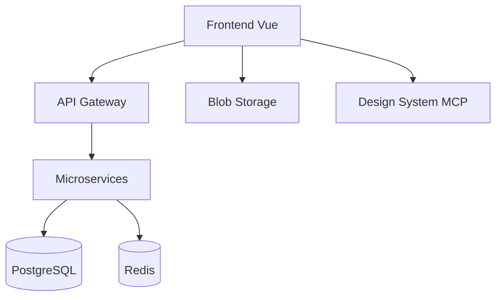
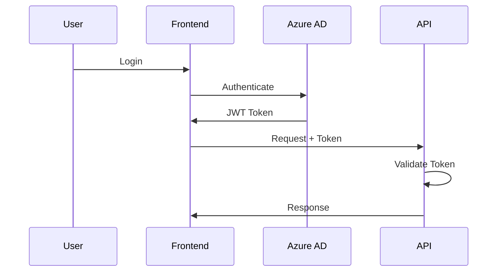
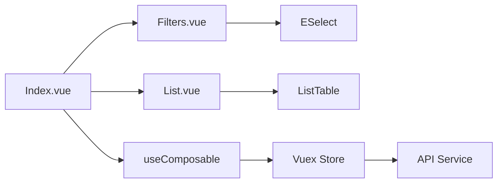

# Arquitetura Técnica 🏗️

Documentação dos padrões arquiteturais e técnicos do projeto Educacross.

## Visão Geral

Esta seção documenta a **arquitetura de referência** baseada no projeto `educacross-frontoffice`, incluindo:

- 📐 **Padrões DDD** - Domain-Driven Design
- 🧩 **Componentes Reutilizáveis** - ESelect, ListTable, etc.
- 🎯 **Composables** - useFilters(), useDomainName()
- 🛣️ **Roteamento** - Vue Router com lazy loading
- 🗄️ **Estado Global** - Vuex com modules

## Padrões Fundamentais

### 1. DDD - Domain-Driven Design

Todas as páginas seguem o padrão **Index → Filters → List → Composable**:

```
feature-name/
├── Index.vue              # Orchestrator principal
├── Filters.vue            # Componentes de filtro
├── List.vue               # Tabela de dados
└── useDomainName.js       # Composable com lógica de negócio
```

**Documentação Completa**: [DDD Pattern](./ddd-pattern.md) ⏳

---

### 2. Global Filters (useFilters)

**Composable crítico** que centraliza filtros globais:

```javascript
import useFilters from '@/store/filters/useFilters'

const {
  subject,      // Disciplina selecionada
  subjects,     // Lista de disciplinas
  classe,       // Turma selecionada
  classes,      // Lista de turmas
  institution,  // Instituição
  // ... outros filtros
} = useFilters()
```

**Documentação Completa**: [useFilters()](./use-filters.md) ⏳

---

### 3. Componentes Principais

#### ESelect - Dropdown Avançado

**Arquivo**: `src/components/selects/ESelect.vue` (976 linhas)

Dropdown customizado com:
- ✅ Single/Multiple selection
- ✅ Busca com debounce
- ✅ Paginação
- ✅ Estados de validação
- ✅ Variantes (primary, success, danger, etc.)

**Documentação Completa**: [ESelect Component](./components/eselect.md) ⏳

---

#### ListTable - Tabela Paginada

**Arquivo**: `src/components/table/ListTable.vue` (418 linhas)

Tabela server-side com:
- ✅ Paginação
- ✅ Ordenação
- ✅ Busca integrada
- ✅ Loading states
- ✅ Exportação Excel
- ✅ Slots customizáveis

**Documentação Completa**: [ListTable Component](./components/list-table.md) ⏳

---

#### ListTableLocalSorting - Tabela Client-Side

Para datasets pequenos (menos de 1000 registros):
- ✅ Sorting local
- ✅ Filtros client-side
- ✅ Performance otimizada

**Documentação Completa**: [ListTableLocalSorting](./components/list-table-local.md) ⏳

---

### 4. Vuex Modules

Organização por domínio:

```
store/
├── filters/               # Filtros globais (useFilters)
├── pageModules/           # Módulos de página
│   ├── educationSystem/
│   ├── missions/
│   └── reports/
└── account/               # Autenticação
```

**Padrão de Module**:

```javascript
export default {
  namespaced: true,
  state: { data: [], loading: false },
  mutations: {
    data(state, payload) { state.data = payload },
    loading(state, payload) { state.loading = payload },
  },
  getters: {
    data: state => state.data,
    loading: state => state.loading,
  },
}
```

**Documentação Completa**: [Vuex Patterns](./vuex-patterns.md) ⏳

---

### 5. Roteamento

**Lazy Loading** com contextos:

```javascript
// professor-routes.js (1810 linhas, 28 rotas)
{
  path: '/education-system/books',
  name: 'education-system-books',
  component: () => import('@/views/pages/teacher-context/educationSystem/books/Index.vue'),
  meta: {
    resource: 'EducationSystem',
    action: 'read',
  },
}
```

**Documentação Completa**: [Routing Strategy](./routing.md) ⏳

---

## Tech Stack

### Frontend

- **Vue.js**: 2.7 (produção) / 3.5 (protótipos)
- **Composition API**: Padrão moderno
- **Vue Router**: 3.6.5 / 4.x
- **Vuex**: 3.6.0 / 4.x
- **Bootstrap Vue**: 2.23.0
- **Vite**: 7.2 (protótipos)

### Design System

- **Vuexy**: Paleta de cores e componentes
- **Storybook**: [fabioeducacross.github.io/DesignSystem-Vuexy](https://fabioeducacross.github.io/DesignSystem-Vuexy/)
- **MCP Server**: Integração via Model Context Protocol ⏳

### APIs

- **Base URL**: `https://apieducacrossmanager-test.azurewebsites.net`
- **Autenticação**: JWT via Azure AD
- **Interceptors**: Token refresh automático
- **Blob Storage**: Assets e mídia

**Documentação Completa**: [API Integration](./api-integration.md) ⏳

---

## Guias de Desenvolvimento

### Para Novos Desenvolvedores

1. **[Quick Start](./quick-start.md)** ⏳ - Setup e primeiros passos
2. **[DDD Pattern](./ddd-pattern.md)** ⏳ - Estrutura de páginas
3. **[Component Library](./component-library.md)** ⏳ - Componentes disponíveis
4. **[Best Practices](./best-practices.md)** ⏳ - Convenções e padrões

### Para Arquitetos

1. **[System Design](./system-design.md)** ⏳ - Visão macro
2. **[State Management](./state-management.md)** ⏳ - Vuex estratégias
3. **[Performance](./performance.md)** ⏳ - Otimizações
4. **[Security](./security.md)** ⏳ - Autenticação e autorização

### Para QA

1. **[Testing Strategy](./testing-strategy.md)** ⏳ - Pirâmide de testes
2. **[E2E Tests](./e2e-tests.md)** ⏳ - Playwright
3. **[Accessibility](./accessibility.md)** ⏳ - WCAG compliance

---

## Diagramas de Arquitetura

### Visão Geral do Sistema



### Fluxo de Autenticação



### Arquitetura de Componentes



---

## Convenções de Código

### Nomenclatura

- **Componentes**: PascalCase (`ESelect.vue`, `ListTable.vue`)
- **Composables**: camelCase com prefixo `use` (`useFilters`, `useEducationSystemBooks`)
- **Arquivos**: kebab-case (`education-system-books.md`)
- **Variáveis**: camelCase (`subject`, `classe`, `loading`)

### Commits

```bash
feat(scope): descrição curta       # Nova funcionalidade
fix(scope): descrição curta        # Correção de bug
docs(scope): descrição curta       # Documentação
refactor(scope): descrição curta   # Refatoração
test(scope): descrição curta       # Testes
```

### Pull Requests

- **Branch**: `feature/EC-XXXX-description`
- **Base**: `develop` (produção) / `prototypes/as-is` (protótipos)
- **Título**: `[TIPO]: EC-XXXX: Descrição clara`
- **Body**: Template com checklist

---

## Referências Externas

### Documentação Oficial

- [Vue 3 Docs](https://vuejs.org/)
- [Vue Router](https://router.vuejs.org/)
- [Vuex](https://vuex.vuejs.org/)
- [Vite](https://vitejs.dev/)
- [Playwright](https://playwright.dev/)

### Design System

- [Vuexy Storybook](https://fabioeducacross.github.io/DesignSystem-Vuexy/)
- [Bootstrap Icons](https://icons.getbootstrap.com/)

### APIs

- [API Test Environment](https://apieducacrossmanager-test.azurewebsites.net/index.html)

---

**Última Atualização**: 3 de fevereiro de 2026  
**Documentos Pendentes**: 15  
**Status**: 🚧 Em construção
