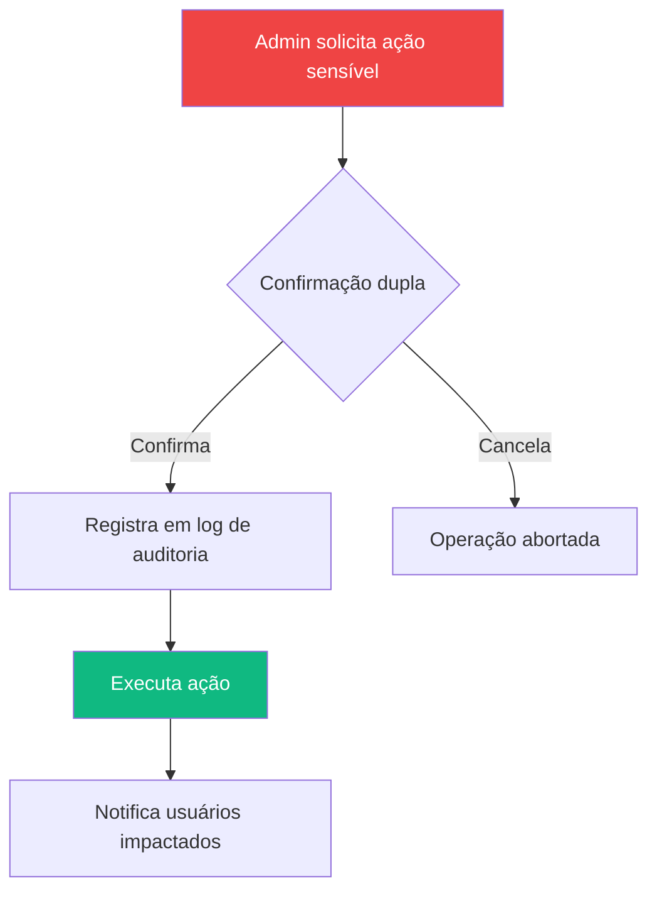
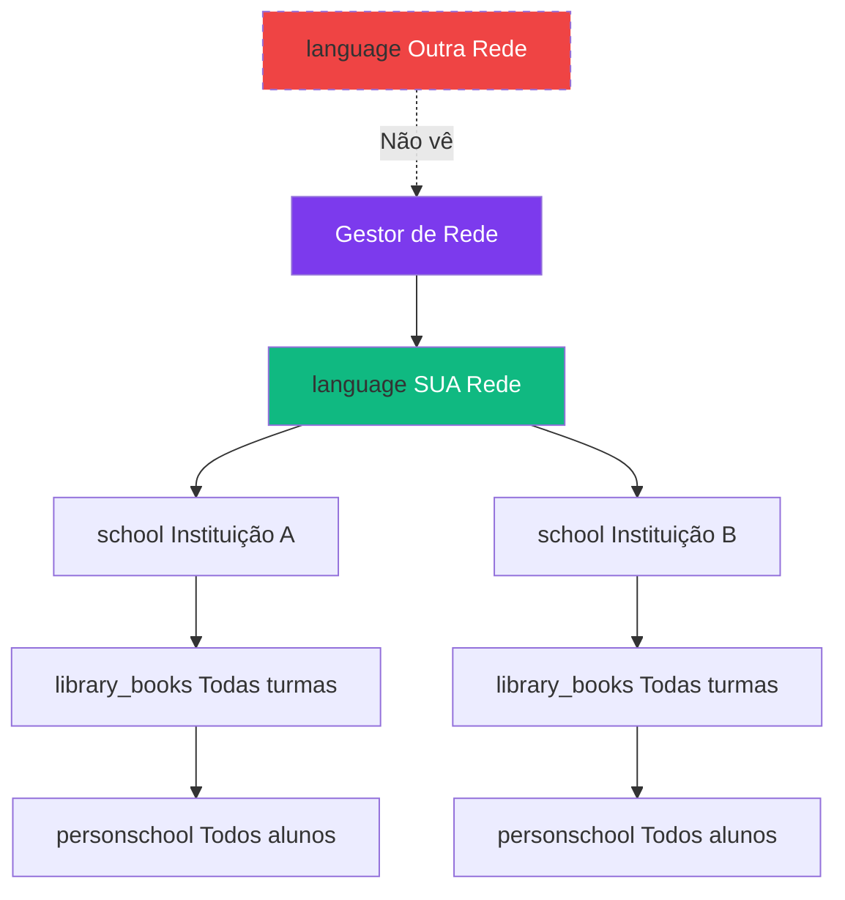
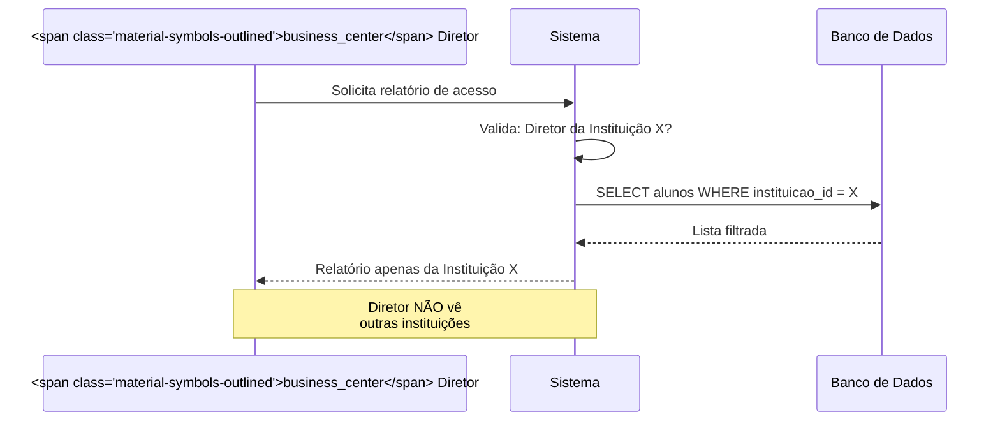
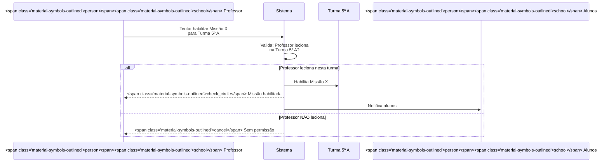

import { IconCheck, IconCircleRed, IconWarning, PriorityHigh, PriorityMedium, PriorityLow } from '@site/src/components/StatusIcons';
import { IconAdmin, IconTeacher, IconStudent, IconCoordinator, IconDirector, IconNetworkManager } from '@site/src/components/MaterialIcon';

# Controle de Acesso

Esta página documenta **quem pode fazer o quê** no Educacross, organizadas por perfil de usuário.

:::info Princípio de Menor Privilégio
Cada perfil tem **apenas as permissões necessárias** para realizar suas funções. Acesso adicional requer aprovação.
:::

---

## <span class="material-symbols-outlined">theater_comedy</span> Matriz de Permissões Global

### Visão Geral por Contexto

| Funcionalidade | <IconAdmin /> Admin | <IconNetworkManager /> Gestor Rede | <IconDirector /> Diretor | <IconCoordinator /> Coordenador | <IconTeacher /> Professor | <IconStudent /> Aluno |
|----------------|-----|------------|---------|--------------|-----------|-------|
| **Gestão de Usuários** | <span class="material-symbols-outlined">check_circle</span> Total | <span class="material-symbols-outlined">check_circle</span> Sua rede | <span class="material-symbols-outlined">check_circle</span> Sua instituição | <span class="material-symbols-outlined">cancel</span> Não | <span class="material-symbols-outlined">cancel</span> Não | <span class="material-symbols-outlined">cancel</span> Não |
| **Gestão de Turmas** | <span class="material-symbols-outlined">check_circle</span> Total | <span class="material-symbols-outlined">check_circle</span> Sua rede | <span class="material-symbols-outlined">check_circle</span> Sua instituição | <span class="material-symbols-outlined">check_circle</span> Sua instituição | <span class="material-symbols-outlined">cancel</span> Não | <span class="material-symbols-outlined">cancel</span> Não |
| **Habilitar Missões** | <span class="material-symbols-outlined">check_circle</span> Total | <span class="material-symbols-outlined">cancel</span> Não | <span class="material-symbols-outlined">cancel</span> Não | <span class="material-symbols-outlined">check_circle</span> Todas turmas | <span class="material-symbols-outlined">check_circle</span> Suas turmas | <span class="material-symbols-outlined">cancel</span> Não |
| **Realizar Missões** | <span class="material-symbols-outlined">cancel</span> Não | <span class="material-symbols-outlined">cancel</span> Não | <span class="material-symbols-outlined">cancel</span> Não | <span class="material-symbols-outlined">cancel</span> Não | <span class="material-symbols-outlined">cancel</span> Não | <span class="material-symbols-outlined">check_circle</span> Sim |
| **Ver Relatórios** | <span class="material-symbols-outlined">check_circle</span> Total | <span class="material-symbols-outlined">check_circle</span> Sua rede | <span class="material-symbols-outlined">check_circle</span> Sua instituição | <span class="material-symbols-outlined">check_circle</span> Sua instituição | <span class="material-symbols-outlined">check_circle</span> Suas turmas | <span class="material-symbols-outlined">cancel</span> Não |
| **Exportar Dados** | <span class="material-symbols-outlined">check_circle</span> Total | <span class="material-symbols-outlined">check_circle</span> Sua rede | <span class="material-symbols-outlined">check_circle</span> Sua instituição | <span class="material-symbols-outlined">check_circle</span> Sua instituição | <span class="material-symbols-outlined">check_circle</span> Suas turmas | <span class="material-symbols-outlined">cancel</span> Não |
| **Criar Missões Custom** | <span class="material-symbols-outlined">cancel</span> Não | <span class="material-symbols-outlined">cancel</span> Não | <span class="material-symbols-outlined">cancel</span> Não | <span class="material-symbols-outlined">check_circle</span> Sim | <span class="material-symbols-outlined">check_circle</span> Sim | <span class="material-symbols-outlined">cancel</span> Não |
| **Configurar Sistema** | <span class="material-symbols-outlined">check_circle</span> Total | <span class="material-symbols-outlined">cancel</span> Não | <span class="material-symbols-outlined">cancel</span> Não | <span class="material-symbols-outlined">cancel</span> Não | <span class="material-symbols-outlined">cancel</span> Não | <span class="material-symbols-outlined">cancel</span> Não |

---

<a id="administrador"></a>
## <IconAdmin /> Administrador

### Escopo de Acesso

<IconCheck /> **Acesso Total** - Sem restrições de rede, instituição ou turma

### Permissões

| ID | Permissão | Descrição | Prioridade |
|----|-----------|-----------|------------|
| **AC-001** | Criar/Editar/Deletar **qualquer usuário** | Incluindo outros admins | <PriorityHigh /> |
| **AC-002** | Gerenciar **todas as redes** | Criar, editar, inativar redes | <PriorityHigh /> |
| **AC-003** | Acessar **todos os dados** sem filtro | Sem restrição hierárquica | <PriorityHigh /> |
| **AC-004** | Configurar **parâmetros globais** do sistema | Ano letivo, períodos, etc. | <PriorityMedium /> |
| **AC-005** | Executar **operações em lote** | Importar/exportar dados massivos | <PriorityMedium /> |
| **AC-006** | Acessar **logs de auditoria** | Histórico de ações de todos usuários | <PriorityLow /> |

### Fluxo de Aprovação



:::danger Atenção
Ações de **Admin** devem ser registradas em **log de auditoria** para compliance (LGPD).
:::

---

<a id="gestor"></a>
<a id="gestor-de-rede"></a>
## <IconNetworkManager /> Gestor de Rede

### Escopo de Acesso

<IconCheck /> **Rede Específica** - Vê apenas dados da sua rede

### Permissões

| ID | Permissão | Descrição | Restrição |
|----|-----------|-----------|-----------|
| **AC-007** | Ver **todas instituições** da rede | Dashboard de rede | Apenas sua rede |
| **AC-008** | Ver **todos os alunos** da rede | Relatórios agregados | Apenas sua rede |
| **AC-009** | Criar/Editar **Diretores** | Atribuir diretores às instituições | Apenas sua rede |
| **AC-010** | Configurar **Sistemas de Ensino** | Definir currículos para a rede | Apenas sua rede |
| **AC-011** | Exportar **relatórios de rede** | Consolidado de todas instituições | Apenas sua rede |
| **AC-012** | Criar **instituições** dentro da rede | Adicionar novas escolas | Apenas sua rede |

### Hierarquia de Visibilidade



---

## <IconDirector /> Diretor

### Escopo de Acesso

<IconCheck /> **Instituição Específica** - Vê apenas dados da sua escola

### Permissões

| ID | Permissão | Descrição | Restrição |
|----|-----------|-----------|-----------|
| **AC-013** | Ver **todas turmas** da instituição | Dashboard de escola | Apenas sua escola |
| **AC-014** | Ver **todos os alunos** da instituição | Relatórios da escola | Apenas sua escola |
| **AC-015** | Criar/Editar **Coordenadores** | Atribuir coordenadores | Apenas sua escola |
| **AC-016** | Criar/Editar **Professores** | Gerenciar corpo docente | Apenas sua escola |
| **AC-017** | Criar/Editar **Turmas** | Organizar séries e turmas | Apenas sua escola |
| **AC-018** | Exportar **relatórios da escola** | Dados agregados | Apenas sua escola |
| **AC-019** | Ver **eventos e missões** de todas turmas | Visão geral pedagógica | Apenas sua escola |

### Caso de Uso: Relatório de Acesso



---

## <IconCoordinator /> Coordenador

### Escopo de Acesso

<IconCheck /> **Instituição Específica** - Mesma escola, foco pedagógico

### Permissões

| ID | Permissão | Descrição | Restrição |
|----|-----------|-----------|-----------|
| **AC-020** | Ver **todas turmas** da instituição | Acompanhamento pedagógico | Apenas sua escola |
| **AC-021** | **Habilitar missões** de qualquer turma | Gestão de conteúdo | Apenas sua escola |
| **AC-022** | Criar **Missões Custom** | Personalizar conteúdos | Apenas sua escola |
| **AC-023** | Ver **relatórios de desempenho** | Todas turmas da escola | Apenas sua escola |
| **AC-024** | Configurar **alertas personalizados** | Regras de acompanhamento | Apenas sua escola |
| **AC-025** | Exportar **relatórios pedagógicos** | Dados de aprendizagem | Apenas sua escola |

### Diferença: Coordenador vs. Diretor

| Aspecto | <IconDirector /> Diretor | <IconCoordinator /> Coordenador |
|---------|----------|--------------|
| **Foco** | Administrativo | Pedagógico |
| **Gestão de Usuários** | <span class="material-symbols-outlined">check_circle</span> Pode criar/editar | <span class="material-symbols-outlined">cancel</span> Não pode |
| **Gestão de Turmas** | <span class="material-symbols-outlined">check_circle</span> Pode criar/editar | <span class="material-symbols-outlined">cancel</span> Só visualiza |
| **Habilitar Missões** | <span class="material-symbols-outlined">cancel</span> Não habilita | <span class="material-symbols-outlined">check_circle</span> Habilita |
| **Criar Missões Custom** | <span class="material-symbols-outlined">cancel</span> Não cria | <span class="material-symbols-outlined">check_circle</span> Cria |
| **Relatórios** | <span class="material-symbols-outlined">check_circle</span> Administrativos + Pedagógicos | <span class="material-symbols-outlined">check_circle</span> Só pedagógicos |

---

<a id="professor"></a>
## <IconTeacher /> Professor

### Escopo de Acesso

<IconCheck /> **Turmas Atribuídas** - Apenas turmas em que leciona

### Permissões

| ID | Permissão | Descrição | Restrição |
|----|-----------|-----------|-----------|
| **AC-026** | Ver **apenas suas turmas** | Lista filtrada | Turmas onde leciona |
| **AC-027** | Ver **alunos das suas turmas** | Lista de alunos | Apenas suas turmas |
| **AC-028** | **Habilitar missões** das suas turmas | Liberar conteúdos | Apenas suas turmas |
| **AC-029** | Criar **Missões Custom** | Personalizar atividades | Apenas suas turmas |
| **AC-030** | Ver **progresso individual** dos alunos | Acompanhamento | Apenas suas turmas |
| **AC-031** | Ver **dashboard de turma** | Métricas agregadas | Apenas suas turmas |
| **AC-032** | Exportar **relatórios de turma** | Excel/PDF | Apenas suas turmas |
| **AC-033** | Ver **livros do sistema de ensino** | Catálogo de conteúdos | Da série das suas turmas |

### Fluxo de Habilitação de Missão



### Restrições Importantes

| ID | Restrição | Exemplo |
|----|-----------|---------|
| **AC-034** | Professor **não vê** turmas de outros professores | Turma 6º A → não aparece no menu |
| **AC-035** | Professor **não pode editar** dados de alunos | Nome, email, matrícula são read-only |
| **AC-036** | Professor **não pode criar turmas** | Apenas Diretor/Admin |
| **AC-037** | Professor **não pode atribuir** outros professores | Gestão é do Diretor |

---

<a id="aluno"></a>
## <IconStudent /> Aluno

### Escopo de Acesso

<IconCheck /> **Próprio Perfil** - Apenas seus dados e missões

### Permissões

| ID | Permissão | Descrição | Restrição |
|----|-----------|-----------|-----------|
| **AC-038** | Ver **missões habilitadas** | Apenas das suas turmas | Missões ativas para ele |
| **AC-039** | **Realizar missões** | Responder questões | Apenas habilitadas |
| **AC-040** | Ver **seu próprio progresso** | Dashboard pessoal | Só seus dados |
| **AC-041** | Ver **ranking da turma** | Gamificação | Apenas da sua turma |
| **AC-042** | Ver **suas medalhas e conquistas** | Perfil gamificado | Só suas conquistas |
| **AC-043** | Ver **biblioteca de livros** | Catálogo disponível | Da sua série |
| **AC-044** | Jogar **jogos educacionais** | Gamificação | Jogos liberados |

### Restrições Importantes

| ID | Restrição | Justificativa |
|----|-----------|---------------|
| **AC-045** | Aluno **não vê dados** de outros alunos | Privacidade (LGPD) |
| **AC-046** | Aluno **não pode editar** seu próprio cadastro | Evitar fraudes |
| **AC-047** | Aluno **não vê missões não habilitadas** | Evitar confusão |
| **AC-048** | Aluno **não pode refazer missão concluída** | Integridade do progresso |
| **AC-049** | Aluno **não acessa relatórios** | Foco no aprendizado |

### Fluxo de Acesso do Aluno

```mermaid
graph TD
    A[<span class="material-symbols-outlined">person</span>‍<span class="material-symbols-outlined">school</span> Aluno faz login] --> B{Tem missões<br/>habilitadas?}
    B -->|Sim| C[Exibe menu de missões]
    B -->|Não| D[Exibe mensagem:<br/>"Aguarde seu professor<br/>liberar missões"]
    
    C --> E[Aluno escolhe missão]
    E --> F[Inicia/Continua missão]
    F --> G[Responde questões]
    G --> H{Acertou?}
    
    H -->|Sim| I[+10 pontos]
    H -->|Não| J[+0 pontos]
    
    I --> K[Atualiza progresso]
    J --> K
    
    K --> L{Última questão?}
    L -->|Não| G
    L -->|Sim| M[<span class="material-symbols-outlined">check_circle</span> Missão concluída]
    
    style A fill:#EC4899,color:#fff
    style I fill:#10B981,color:#fff
    style J fill:#EF4444,color:#fff
    style M fill:#10B981,color:#fff
```

---

## <span class="material-symbols-outlined">lock</span> Regras de Segurança Adicionais

### Troca de Contexto

| Cenário | Regra | Exemplo |
|---------|-------|---------|
| **Múltiplos perfis** | Usuário escolhe perfil no login | Professor que também é Coordenador |
| **Troca de perfil** | Requer novo login | Mudar de Professor → Coordenador |
| **Sessão por perfil** | Uma sessão ativa por perfil | Não pode ter 2 abas com perfis diferentes |

### Auditoria

| ID | Regra | Dados Registrados |
|----|-------|-------------------|
| **AC-050** | Toda **troca de perfil** é auditada | Data/hora, usuário, perfil anterior/novo |
| **AC-051** | Ações **sensíveis** são auditadas | Deletar usuário, inativar turma, etc. |
| **AC-052** | **Tentativas de acesso negado** são registradas | IP, usuário, recurso tentado |

---

## <span class="material-symbols-outlined">link</span> Referências

- [Regras de Domínio](./domain-rules) - Hierarquia organizacional
- [Validações](./validation-rules) - Regras de dados
- [Estados e Transições](./state-transitions) - Fluxos de usuário

---

:::tip Princípio de Segurança
**"Negar por padrão, permitir explicitamente"** - Se uma permissão não está documentada aqui, ela NÃO existe.
:::
