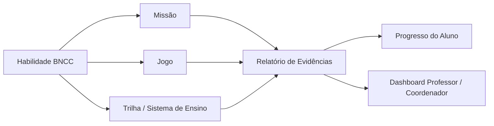

import { PriorityHigh, PriorityMedium } from '@site/src/components/StatusIcons';

# BNCC na Plataforma

A **Base Nacional Comum Curricular (BNCC)** é o documento normativo do MEC que define as aprendizagens essenciais para a Educação Básica no Brasil. No Educacross, a BNCC é o eixo central que conecta conteúdos, missões, jogos e relatórios à progressão pedagógica de cada aluno.

---

## O que é a BNCC

A BNCC estabelece **competências gerais** e **habilidades específicas** organizadas por:

| Dimensão | Descrição |
|----------|-----------|
| **Etapa** | Educação Infantil, Ensino Fundamental (Anos Iniciais / Anos Finais) e Ensino Médio |
| **Área do conhecimento** | Linguagens, Matemática, Ciências da Natureza, Ciências Humanas, Ensino Religioso |
| **Componente curricular** | Língua Portuguesa, Matemática, Ciências, Geografia, História, Arte, Educação Física |
| **Habilidade** | Unidade mínima avaliável, identificada por um código único (ex: `EF03LP07`) |

### Estrutura do código de habilidade

```
EF  03  LP  07
│   │   │   └── Número sequencial da habilidade dentro do componente/ano
│   │   └────── Componente curricular (LP = Língua Portuguesa, MA = Matemática, CI = Ciências…)
│   └────────── Ano escolar (01 a 09 para EF; EM para Ensino Médio)
└────────────── Etapa (EF = Ensino Fundamental)
```

> **Exemplo real:** `EF06MA14` → Ensino Fundamental, 6º ano, Matemática, habilidade 14 *(Reconhecer que as medidas de comprimento, massa, capacidade, temperatura e área são representadas por números racionais)*.

---

## Como o Educacross usa a BNCC

A plataforma adota a BNCC como **taxonomia pedagógica** em todas as camadas:



### Por funcionalidade

| Funcionalidade | Como usa a BNCC |
|----------------|-----------------|
| **Missões** | Cada missão é etiquetada com uma ou mais habilidades BNCC. O professor filtra por habilidade ao criar missões. |
| **Jogos** | Jogos possuem `bnccSkills[]` no catálogo. Professor filtra por habilidade antes de aplicar em sala. |
| **Trilhas (Sistema de Ensino)** | Conteúdos organizados por componente curricular e ano, alinhados às habilidades da BNCC. |
| **Relatório de Evidências** | Filtro por Matriz/Currículo (`BNCC 2019 – Matemática`, `BNCC 2020 – Língua Portuguesa` etc.). |
| **Relatório de Habilidades** | Exibe porcentagem de domínio de cada habilidade BNCC por turma/aluno. |
| **Materiais de Apoio** | Inclui "Catálogo de Habilidades BNCC" (PDF) como referência rápida para professores. |
| **Formação Continuada** | Cursos como "BNCC na Prática – 40h" vinculam certificação ao domínio técnico do documento. |

---

## Regras de negócio

| ID | Regra | Prioridade |
|----|-------|------------|
| **RB-BNCC-001** | Toda missão deve ter **ao menos uma** habilidade BNCC associada | <PriorityHigh /> |
| **RB-BNCC-002** | Habilidades são atribuídas no momento da criação da missão e **não podem ser removidas** após a primeira entrega de aluno | <PriorityHigh /> |
| **RB-BNCC-003** | Relatórios de habilidades exibem apenas as habilidades com **ao menos uma missão concluída** por qualquer aluno da turma | <PriorityMedium /> |
| **RB-BNCC-004** | A Matriz/Currículo de uma missão pode ser da BNCC nacional **ou de currículo customizado** da rede (ex: Currículo da Cidade – SP) | <PriorityMedium /> |
| **RB-BNCC-005** | O alinhamento BNCC de jogos é definido pelo curador de conteúdo e **não pode ser editado pelo professor** | <PriorityHigh /> |

---

## Currículos customizados

Além da BNCC federal, redes de ensino parceiras podem operar com **currículos próprios** alinhados à BNCC. A plataforma suporta múltiplas matrizes por rede:

- BNCC (padrão nacional)
- Currículo da Cidade – São Paulo
- Currículo Escola João Pessoa (Letrar+JP / Super Ensino JP)
- Currículo de Manaus (Alfabetiza Manaus / Super Ensino Manaus)

> No FrontOffice, os seletores de Matriz/Currículo nos relatórios refletem exatamente essa multitaxonomia (ver [`EvidenceReport.vue`](/docs/prototypes) e [`SkillReport.vue`](/docs/prototypes)).

---

## Onde encontrar nas jornadas

- [Criar Missão](/docs/journeys/teacher/education-system-missions) — seleção de habilidades BNCC
- [Relatório de Evidências](/docs/journeys/teacher/student-progress-tracking) — filtro por BNCC
- [Relatório de Habilidades](/docs/journeys/teacher/student-progress-tracking) — progresso por habilidade
- [Meus Jogos](/docs/journeys/teacher/my-games) — filtro por habilidade BNCC no catálogo
- [Formação Continuada](/docs/journeys/teacher/professional-development) — cursos BNCC

---

## Referências externas

- [BNCC no site do MEC](http://basenacionalcomum.mec.gov.br/)
- [Consulta de habilidades — BNCC digital](http://basenacionalcomum.mec.gov.br/implementacao/praticas/caderno-de-praticas/educacao-infantil)
