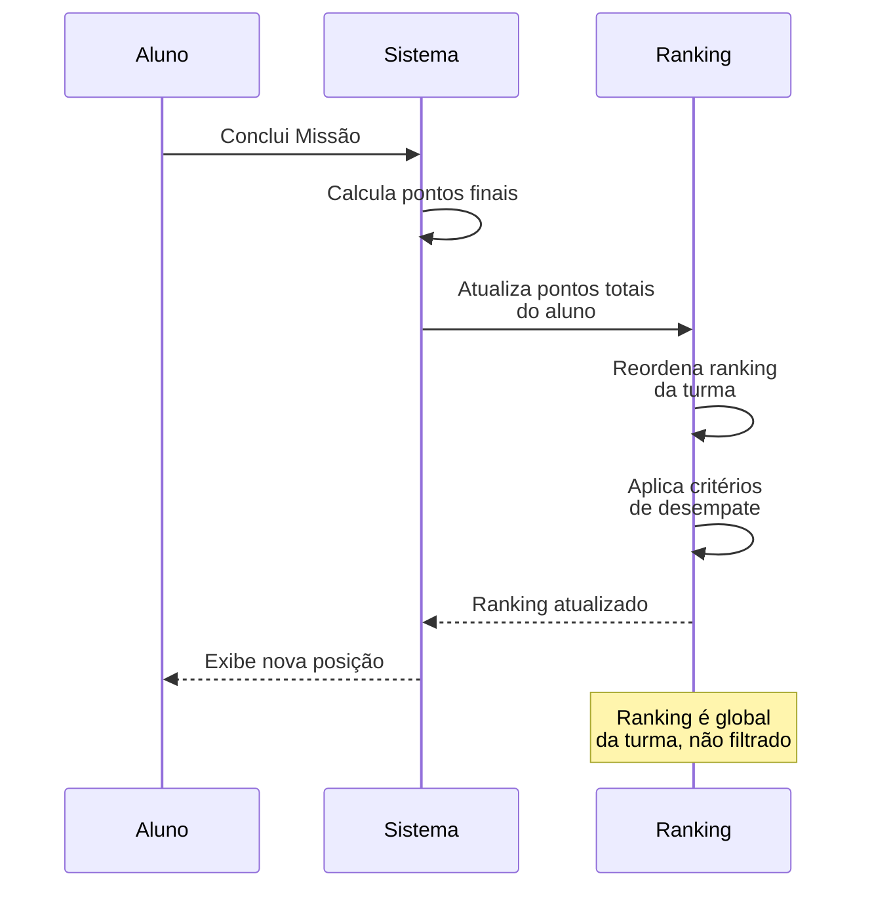
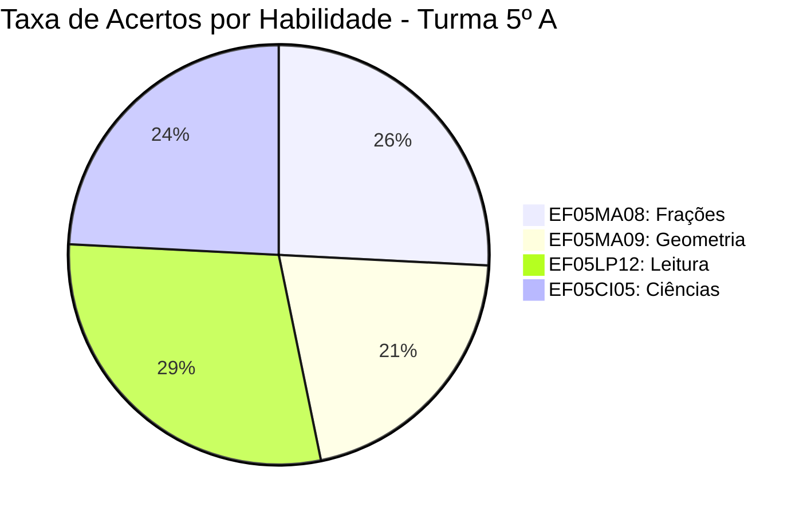
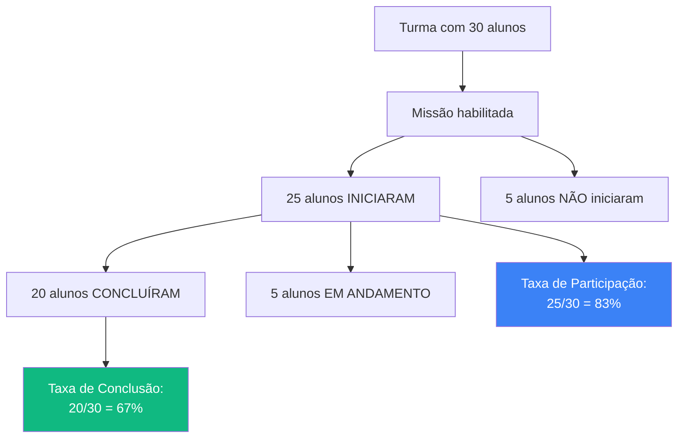

import { IconCheck, IconWarning, PriorityHigh, PriorityMedium } from '@site/src/components/StatusIcons';

# Cálculos e Fórmulas

Esta página documenta **como o sistema calcula** pontuações, médias, rankings e outras métricas.

:::info Objetivo
Garantir **transparência** e **consistência** nos cálculos exibidos para usuários.
:::

---

## 🎯 Pontuação de Missões

### Fórmula Básica de Pontos

```
Pontos da Questão = Resposta Correta ? 10 : 0
Pontos Totais da Missão = Soma de Pontos de Todas Questões
```

### Exemplo Prático

| Questão | Resposta do Aluno | Resposta Correta | Pontos |
|---------|-------------------|------------------|--------|
| Q1 | A | A | 10 |
| Q2 | B | C | 0 |
| Q3 | D | D | 10 |
| Q4 | A | A | 10 |
| Q5 | B | B | 10 |
| **Total** | - | - | **40 pontos** |

**% de Acertos** = `(4 acertos / 5 questões) × 100 = 80%`

### Regras de Pontuação

| ID | Regra | Descrição | Prioridade |
|----|-------|-----------|------------|
| **CALC-001** | Cada questão vale **10 pontos fixos** | Sem variação de peso | <PriorityHigh /> |
| **CALC-002** | **Não há penalidade** por erro | 0 pontos, não negativos | <PriorityHigh /> |
| **CALC-003** | Questão **não respondida** = 0 pontos | Igual a erro | <PriorityMedium /> |
| **CALC-004** | Pontuação é **definitiva** ao concluir missão | Não pode alterar depois | <PriorityHigh /> |

---

## 🏆 Sistema de Ranking

### Fórmula de Ranking

```
Posição no Ranking = ORDEM DECRESCENTE por:
  1. Pontos Totais (maior → menor)
  2. Número de Missões Concluídas (maior → menor)
  3. Tempo Médio de Conclusão (menor → maior)
  4. Data do último acesso (mais recente → mais antigo)
```

### Exemplo de Ranking

| Posição | Aluno | Pontos Totais | Missões Concluídas | Tempo Médio | Último Acesso |
|---------|-------|---------------|-------------------|-------------|---------------|
| 1º 🥇 | Maria | 580 | 6 | 12min | 05/02/2026 |
| 2º 🥈 | João | 580 | 6 | 15min | 04/02/2026 |
| 3º 🥉 | Ana | 550 | 6 | 10min | 03/02/2026 |
| 4º | Pedro | 550 | 5 | 8min | 05/02/2026 |

**Critérios de Desempate:**
- Maria e João têm mesmos pontos e missões → Maria ganha por tempo menor
- Ana e Pedro têm mesmos pontos → Ana ganha por mais missões concluídas

### Regras de Ranking

| ID | Regra | Descrição |
|----|-------|-----------|
| **CALC-005** | Ranking é **por turma** | Alunos não competem entre turmas |
| **CALC-006** | Ranking é **recalculado em tempo real** | Atualiza a cada missão concluída |
| **CALC-007** | Ranking considera **apenas missões concluídas** | Em andamento não contam |
| **CALC-008** | Empate é resolvido por **4 critérios** | Ver fórmula acima |

### Fluxo de Atualização de Ranking



---

## 📊 Progresso e Médias

### Progresso Individual do Aluno

```
Progresso = (Missões Concluídas / Missões Habilitadas) × 100
```

**Exemplo:**
- Missões habilitadas para a turma: 10
- Missões concluídas pelo aluno: 7
- **Progresso: 70%**

### Progresso da Turma (Dashboard Professor)

```
Progresso Médio da Turma = Soma(Progresso de cada aluno) / Total de alunos
```

**Exemplo:**

| Aluno | Progresso Individual |
|-------|---------------------|
| Ana | 100% (10/10) |
| João | 80% (8/10) |
| Maria | 60% (6/10) |
| Pedro | 90% (9/10) |
| **Média da Turma** | **82,5%** |

### Regras de Progresso

| ID | Regra | Descrição |
|----|-------|-----------|
| **CALC-009** | Progresso é **%** de missões habilitadas | Não considera missões não liberadas |
| **CALC-010** | Progresso 100% = **todas habilitadas concluídas** | Não significa todas missões do sistema |
| **CALC-011** | Progresso da turma é **média aritmética** | Cada aluno tem peso igual |

---

## 🎓 Taxa de Acertos por Habilidade

### Fórmula de Acertos por Tag BNCC

```
Acertos na Habilidade X = (Questões corretas com Tag X / Total questões com Tag X) × 100
```

**Exemplo - Habilidade: EF05MA08 (Frações)**

| Missão | Questões EF05MA08 | Acertos | Erros |
|--------|-------------------|---------|-------|
| Missão 1 | Q1, Q3 | Q1 ✅ | Q3 ❌ |
| Missão 2 | Q2, Q5 | Q2 ✅, Q5 ✅ | - |
| Missão 3 | Q4 | Q4 ✅ | - |

**Cálculo:**
- Total de questões EF05MA08: 5
- Acertos: 4
- **Taxa de Acertos: 80%**

### Dashboard de Habilidades (Professor)



### Regras de Cálculo de Habilidades

| ID | Regra | Descrição |
|----|-------|-----------|
| **CALC-012** | Uma questão pode ter **múltiplas tags BNCC** | Conta para cada habilidade |
| **CALC-013** | Taxa de acertos é **por turma** | Média de todos alunos |
| **CALC-014** | Considera apenas **missões concluídas** | Em andamento não entra |

---

## ⏱️ Tempo Médio de Conclusão

### Fórmula de Tempo

```
Tempo de Missão = Data/Hora Conclusão - Data/Hora Início

Tempo Médio do Aluno = Soma(Tempo de cada missão) / Missões concluídas

Tempo Médio da Turma = Soma(Tempo médio de cada aluno) / Total de alunos
```

**Exemplo:**

| Aluno | Missão 1 | Missão 2 | Missão 3 | Tempo Médio |
|-------|----------|----------|----------|-------------|
| Ana | 10min | 12min | 15min | 12,3min |
| João | 20min | 18min | 22min | 20min |
| Maria | 8min | 10min | 9min | 9min |
| **Média Turma** | - | - | - | **13,8min** |

### Regras de Tempo

| ID | Regra | Descrição |
|----|-------|-----------|
| **CALC-015** | Tempo parado **não conta** | Se ficar 30min inativo, pausa automática |
| **CALC-016** | Tempo máximo por missão: **2 horas** | Após isso, encerra automaticamente |
| **CALC-017** | Tempo é **arredondado** para minutos | Ex: 12min 45s → 13min |

---

## 📈 Taxa de Participação

### Fórmula de Participação

```
Taxa de Participação = (Alunos que INICIARAM missão / Total de alunos da turma) × 100
```

**Exemplo - Missão de Frações:**
- Total de alunos: 30
- Alunos que iniciaram: 25
- **Taxa de Participação: 83,3%**

### Diferença: Participação vs. Conclusão

| Métrica | Descrição | Exemplo |
|---------|-----------|---------|
| **Participação** | % que iniciou (qualquer progresso) | 25 iniciaram / 30 alunos = 83% |
| **Conclusão** | % que terminou (100% da missão) | 20 concluíram / 30 alunos = 67% |

### Fluxo de Cálculo



### Regras de Participação

| ID | Regra | Descrição |
|----|-------|-----------|
| **CALC-018** | Participação = **pelo menos 1 questão respondida** | Iniciar e sair conta |
| **CALC-019** | Conclusão = **todas questões respondidas** | Não importa acertos |
| **CALC-020** | Aluno inativo **não conta** no denominador | Apenas alunos ativos |

---

## 🎖️ Sistema de Medalhas

### Critérios de Medalhas

| Medalha | Critério | Cálculo | Frequência |
|---------|----------|---------|------------|
| 🥇 **Mestre da Semana** | Mais pontos em 7 dias | MAX(pontos) na semana | Semanal |
| 🔥 **Streak** | Dias consecutivos com atividade | Contagem de dias | Diária |
| ⭐ **100% Perfeito** | 100% acertos em missão | Acertos = Total questões | Por missão |
| ⚡ **Relâmpago** | Concluir missão < 5min | Tempo < 5min | Por missão |
| 🎯 **10 Missões** | Completar 10 missões | COUNT(missões) = 10 | Cumulativo |

### Fórmula de Streak

```
Streak = Contagem de dias CONSECUTIVOS com pelo menos 1 questão respondida

Quebra de Streak = Passar 1 dia completo sem atividade (00:00 às 23:59)
```

**Exemplo:**
- Dia 1 (01/02): Respondeu 3 questões → Streak = 1
- Dia 2 (02/02): Respondeu 1 questão → Streak = 2
- Dia 3 (03/02): **Não acessou** → Streak = 0 (resetou)
- Dia 4 (04/02): Respondeu 5 questões → Streak = 1 (recomeçou)

### Regras de Medalhas

| ID | Regra | Descrição |
|----|-------|-----------|
| **CALC-021** | Medalhas são **pessoais** | Não competitivas |
| **CALC-022** | Medalha **Streak** reseta a 00:00** | Timezone do sistema |
| **CALC-023** | Medalhas **não podem ser perdidas** | Uma vez ganha, é permanente (exceto Streak) |

---

## 📊 Relatórios - Cálculos Agregados

### Média de Desempenho por Instituição

```
Desempenho da Instituição = (Soma de pontos de todos alunos / Total máximo possível) × 100

Total máximo possível = Nº de alunos × Nº de missões habilitadas × 10 pontos por questão × Nº de questões por missão
```

**Exemplo - Escola ABC:**
- 100 alunos
- 5 missões habilitadas (média de 10 questões cada)
- Pontos máximos possíveis: 100 × 5 × 10 × 10 = **50.000 pontos**
- Pontos obtidos: **35.000 pontos**
- **Desempenho: 70%**

### Taxa de Engajamento da Rede

```
Engajamento = (Alunos com atividade nos últimos 7 dias / Total de alunos ativos) × 100
```

### Regras de Relatórios

| ID | Regra | Descrição |
|----|-------|-----------|
| **CALC-024** | Relatórios consideram **apenas alunos ativos** | Inativos não entram na base |
| **CALC-025** | Médias são **aritméticas** | Todos alunos têm peso igual |
| **CALC-026** | Dados são **agregados por hierarquia** | Rede > Instituição > Turma > Aluno |

---

## 🔢 Arredondamentos e Precisão

### Regras de Arredondamento

| Tipo de Valor | Casas Decimais | Arredondamento | Exemplo |
|---------------|----------------|----------------|---------|
| **Pontos** | 0 | Inteiro | 85 pontos |
| **% de Acertos** | 1 | Aritmético | 85,5% |
| **Tempo** | 0 | Para cima (minutos) | 12min 30s → 13min |
| **Média da turma** | 1 | Aritmético | 82,7% |

### Exemplo de Arredondamento

```
Cálculo: 82,7345% de acertos
         ↓
Arredonda para 1 casa decimal
         ↓
Exibe: 82,7%
```

### Regras de Precisão

| ID | Regra | Descrição |
|----|-------|-----------|
| **CALC-027** | **Pontos sempre inteiros** | Sem valores decimais |
| **CALC-028** | **Percentuais com 1 casa decimal** | Ex: 85,5% |
| **CALC-029** | **Tempo em minutos inteiros** | Arredonda para cima |

---

## 🎯 Casos Especiais

### Divisão por Zero

```javascript
// Exemplo: Turma sem alunos
if (total_alunos === 0) {
  progresso_turma = 0 // ou "N/A"
}
```

### Missão Sem Questões

```javascript
// Caso: Missão custom criada mas sem questões ainda
if (total_questoes === 0) {
  pontos_maximos = 0
  mensagem = "Missão incompleta - adicione questões"
}
```

### Aluno Sem Missões Concluídas

| Cenário | Valor Exibido |
|---------|---------------|
| Progresso | 0% |
| Pontos Totais | 0 pontos |
| Posição no Ranking | Última posição da turma |
| Tempo Médio | N/A ou "-" |

---

## 🔗 Referências

- [Regras de Domínio](./domain-rules) - Entidades envolvidas
- [Estados e Transições](./state-transitions) - Quando cálculos são disparados
- [Jornada: Missões](../journeys/student/missions) - Contexto de uso

---

:::tip Transparência de Cálculos
**Sempre exiba a fórmula ao usuário** quando possível:
- Tooltip ao passar o mouse sobre "82,5%" → "Média: (100 + 80 + 60 + 90) / 4 alunos"
- Botão "ℹ️ Como é calculado?" → Modal explicativo
- Ícone de ajuda ao lado de métricas complexas
:::
