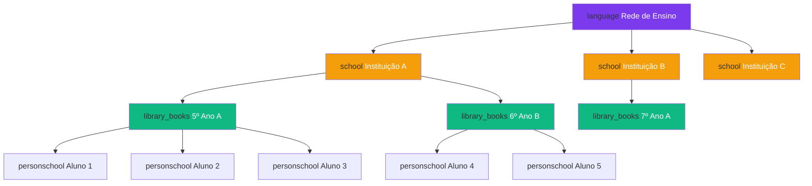
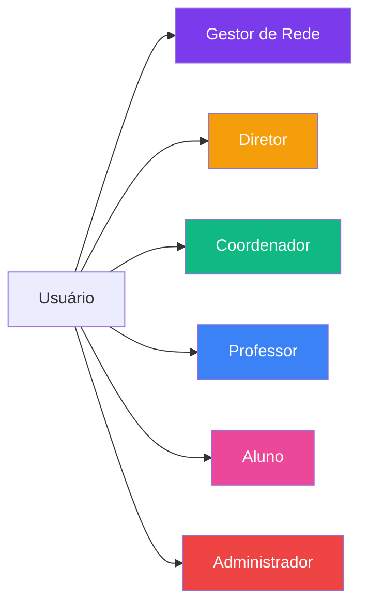
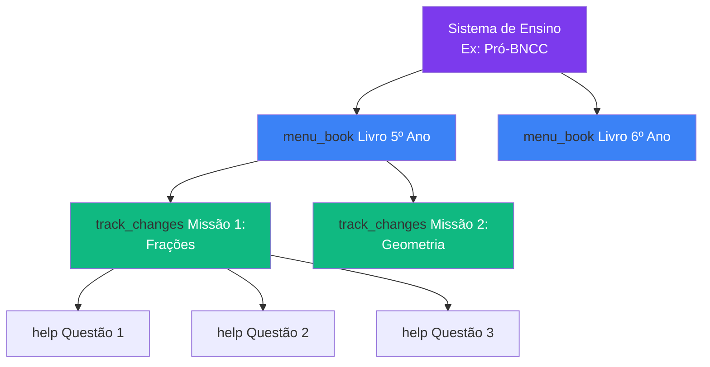
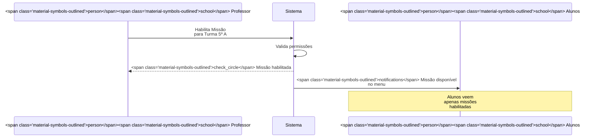
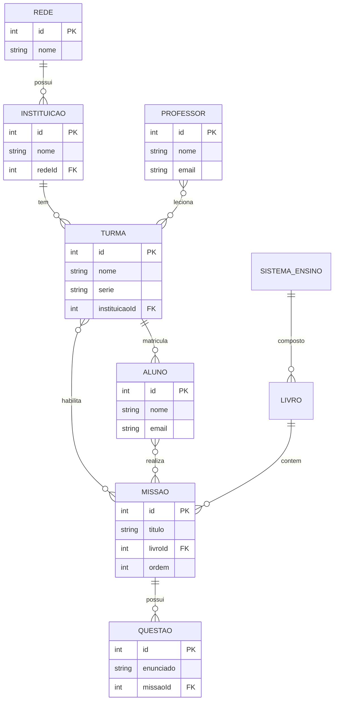

import { IconCheck, IconCircleRed, IconWarning, PriorityHigh, PriorityMedium } from '@site/src/components/StatusIcons';
import { IconAdmin, IconTeacher, IconStudent, IconCoordinator, IconDirector, IconNetworkManager } from '@site/src/components/MaterialIcon';

# Regras de Domínio

Esta página documenta as **regras fundamentais** que definem como o Educacross funciona: relacionamentos entre entidades, hierarquias e conceitos-chave.

---

## construction Hierarquia Organizacional

### Estrutura de Rede

### Regras de Hierarquia

| ID | Regra | Prioridade | Impacto |
|----|-------|------------|---------|
| **RD-001** | Uma **Rede** pode ter N instituições | <PriorityHigh /> | Estrutura base do sistema |
| **RD-002** | Uma **Instituição** pertence a apenas 1 rede | <PriorityHigh /> | Evita ambiguidade de gestão |
| **RD-003** | Uma **Turma** pertence a apenas 1 instituição | <PriorityHigh /> | Organização lógica |
| **RD-004** | Um **Aluno** pode estar em múltiplas turmas | <PriorityMedium /> | Permite turmas de reforço |
| **RD-005** | Um **Professor** pode lecionar em múltiplas turmas | <PriorityHigh /> | Realidade escolar |
| **RD-006** | Um **Gestor** pode gerenciar múltiplas instituições | <PriorityMedium /> | Estruturas de rede |

---

## group Perfis de Usuário

### Tipos de Perfil

### Regras de Perfil

| ID | Regra | Descrição |
|----|-------|-----------|
| **RD-007** | Um usuário pode ter **múltiplos perfis** | Ex: Professor que também é Coordenador |
| **RD-008** | Perfil **Aluno** não pode coexistir com outros perfis | Separação clara de contextos |
| **RD-009** | Mudança de perfil requer **aprovação** | Processo de aceitar/recusar perfil |
| **RD-010** | Perfil **inativo** bloqueia acesso ao sistema | Mas dados são preservados |
| **RD-011** | **Administrador** tem acesso irrestrito | Perfil técnico, não pedagógico |

:::warning Atenção
**RD-008** é crítica: um Aluno nunca pode ter simultaneamente perfil de Professor ou Gestor no mesmo sistema.
:::

---

## library_books Sistema de Ensino e Conteúdos

### Estrutura de Conteúdo

### Regras de Conteúdo

| ID | Regra | Descrição | Exemplo |
|----|-------|-----------|---------|
| **RD-012** | Um **Sistema de Ensino** é composto por N livros | Hierarquia fixa | Pró-BNCC tem 10 livros |
| **RD-013** | Um **Livro** pertence a 1 sistema e 1 série | Organização curricular | Livro de Matemática 5º Ano |
| **RD-014** | Uma **Missão** pertence a 1 livro | Estrutura rígida | Missão de Frações está no Livro 5º Ano |
| **RD-015** | Uma **Missão** contém N questões (mín: 5) | Validação de qualidade | Missão deve ter pelo menos 5 questões |
| **RD-016** | Missão **custom** pode misturar questões de diferentes livros | Flexibilidade para professor | Professor cria missão personalizada |

---

## track_changes Habilitação e Visibilidade

### Fluxo de Habilitação

### Regras de Habilitação

| ID | Regra | Impacto na UX |
|----|-------|---------------|
| **RD-017** | Alunos **só veem missões habilitadas** para sua turma | Menu filtrado automaticamente |
| **RD-018** | Professor só pode habilitar missões **de livros compatíveis** com a série da turma | Botão "Habilitar" desabilitado se incompatível |
| **RD-019** | Missão habilitada **não pode ser desabilitada** | Ação irreversível (evita perda de progresso) |
| **RD-020** | Aluno pode **iniciar missão habilitada** a qualquer momento | Sem restrições de horário |
| **RD-021** | Progresso de missão é **individual por aluno** | Cada aluno tem seu próprio status |

:::tip Caso de Uso
**Cenário**: Professor habilita "Missão de Frações" para Turma 5º A.
- check_circle Todos os 30 alunos da turma veem a missão
- check_circle Aluno A pode estar na questão 3, Aluno B na questão 1
- cancel Alunos de outras turmas NÃO veem a missão
:::

---

## sync Relacionamentos entre Entidades

### Cardinalidades

| Relacionamento | Tipo | Descrição |
|----------------|------|-----------|
| Rede → Instituições | 1:N | Uma rede tem várias instituições |
| Instituição → Turmas | 1:N | Uma instituição tem várias turmas |
| Turma → Alunos | N:M | Alunos podem estar em múltiplas turmas |
| Professor → Turmas | N:M | Professor leciona em múltiplas turmas |
| Turma → Missões Habilitadas | N:M | Turma pode ter várias missões, missão pode estar em várias turmas |
| Aluno → Missões | N:M | Aluno acessa missões habilitadas para suas turmas |
| Sistema de Ensino → Livros | 1:N | Sistema tem vários livros |
| Livro → Missões | 1:N | Livro tem várias missões |
| Missão → Questões | 1:N | Missão tem várias questões |

### Diagrama ER Simplificado

---

## balance Regras de Consistência

### Validações de Integridade

| ID | Regra | Exemplo de Violação |
|----|-------|---------------------|
| **RD-022** | Não pode deletar Instituição com turmas ativas | <IconCircleRed /> Escola com 5 turmas em andamento |
| **RD-023** | Não pode deletar Turma com alunos matriculados | <IconCircleRed /> Turma com 30 alunos ativos |
| **RD-024** | Não pode deletar Missão habilitada | <IconCircleRed /> Missão que alunos já começaram |
| **RD-025** | Não pode alterar série da turma se tiver missões habilitadas | <IconCircleRed /> Mudar turma de 5º para 6º ano |
| **RD-026** | Aluno inativado perde acesso mas dados são preservados | <IconWarning /> Aluno transferido mantém histórico |

:::danger Regras Críticas de Integridade
As regras **RD-022 a RD-026** são **destrutivas** e devem exibir confirmação dupla na interface antes de qualquer ação.
:::

---

## school Séries e Ano Letivo

### Estrutura de Séries

| Série | Faixa Etária | Sistema de Ensino Compatível |
|-------|--------------|------------------------------|
| 1º Ano EF | 6-7 anos | Pró-BNCC, Sistema Anglo |
| 2º Ano EF | 7-8 anos | Pró-BNCC, Sistema Anglo |
| 3º Ano EF | 8-9 anos | Pró-BNCC, Sistema Anglo |
| 4º Ano EF | 9-10 anos | Pró-BNCC, Sistema Anglo, SAS |
| 5º Ano EF | 10-11 anos | Pró-BNCC, Sistema Anglo, SAS |
| 6º Ano EF | 11-12 anos | Todos os sistemas |
| ... | ... | ... |

### Regras de Série

| ID | Regra | Descrição |
|----|-------|-----------|
| **RD-027** | Turma deve ter **série definida** | Obrigatório para vincular conteúdos |
| **RD-028** | Missões são filtradas por **compatibilidade de série** | Só aparecem missões da série correta |
| **RD-029** | Ano letivo é definido por **período** (data início/fim) | Ex: 2024 começa em 01/02/2024 |
| **RD-030** | Aluno pode **progressir automaticamente** de série no novo ano letivo | Configurável pela rede |

---

## bar_chart Métricas e Agregações

### Regras de Agregação

| ID | Regra | Escopo |
|----|-------|--------|
| **RD-031** | Progresso da turma = **média** dos progressos individuais | Dashboard do Professor |
| **RD-032** | Taxa de participação = **alunos que iniciaram missão** / total de alunos | Relatório de Engajamento |
| **RD-033** | Desempenho por habilidade = **% de acertos** por tag BNCC | Relatório de Aprendizagem |
| **RD-034** | Ranking é calculado por **pontos totais** (não por % de acertos) | Gamificação |

---

## link Referências

- [Controle de Acesso](./access-control) - Quem pode fazer o quê
- [Validações](./validation-rules) - Regras de preenchimento
- [Estados e Transições](./state-transitions) - Como objetos mudam de estado

---

:::tip Dúvidas sobre Regras de Domínio?
Entre em contato com o time de produto ou consulte as [jornadas documentadas](../journeys/).
:::
