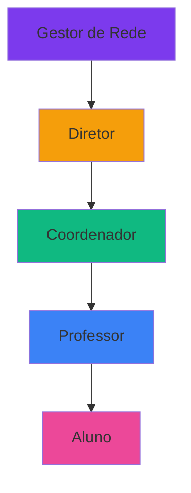
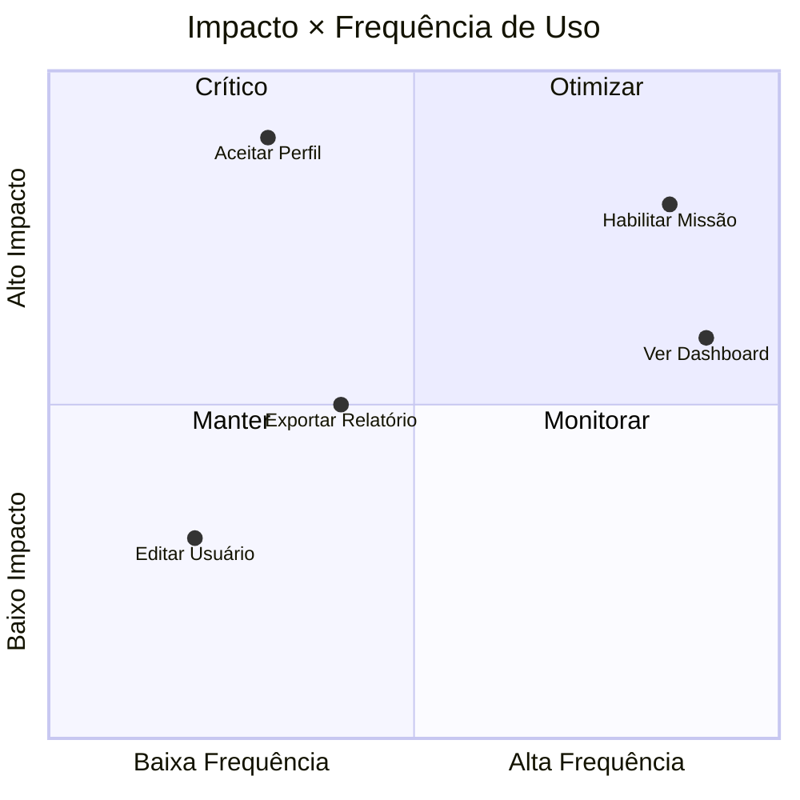

import { IconCheck, IconCircleRed, IconClipboard, IconConstruction, StatusDone, StatusProgress, PriorityHigh, PriorityMedium, PriorityLow } from '@site/src/components/StatusIcons';
import { IconAdmin, IconTeacher, IconStudent, IconCoordinator, IconDirector, IconNetworkManager } from '@site/src/components/MaterialIcon';

# Regras de Negócio do Educacross

Esta seção documenta **todas as regras de negócio** da plataforma Educacross de forma **não-técnica**, voltada para Product Managers, Designers e Stakeholders.

:::info Objetivo
Garantir que todos entendam **o que o sistema deve fazer**, **quem pode fazer o quê** e **quando certas ações são permitidas ou bloqueadas**.
:::

---

## 📋 Índice de Documentação

| Categoria | Descrição | Status |
|-----------|-----------|--------|
| [**Regras de Domínio**](./domain-rules) | Conceitos fundamentais, entidades e relacionamentos | <StatusDone /> |
| [**Controle de Acesso**](./access-control) | Quem pode fazer o quê por perfil | <StatusDone /> |
| [**Validações**](./validation-rules) | Regras de preenchimento e consistência de dados | <StatusDone /> |
| [**Estados e Transições**](./state-transitions) | Como objetos mudam de estado ao longo do tempo | <StatusDone /> |
| [**Cálculos e Fórmulas**](./calculation-rules) | Como pontos, médias e rankings são calculados | <StatusDone /> |

---

## 🎯 Como Usar Esta Documentação

### Para Product Managers
- Use as **tabelas de regras** para validar requisitos e escrever user stories
- Consulte os **diagramas de fluxo** para entender jornadas críticas
- Verifique **prioridades** para planejar roadmap

### Para Designers
- Entenda **restrições de UX** baseadas em regras de negócio
- Use **estados** para desenhar componentes corretos
- Consulte **validações** para criar mensagens de erro apropriadas

### Para QA/Testes
- Use as **regras** como base para casos de teste
- Valide **transições de estado** esperadas
- Teste **cálculos** com cenários documentados

---

## 🔑 Conceitos Fundamentais

### Hierarquia de Usuários

### Entidades Principais

| Entidade | Descrição | Exemplos |
|----------|-----------|----------|
| **Rede** | Grupo de instituições geridas por um órgão central | Secretaria Municipal, Rede Privada |
| **Instituição** | Escola ou unidade educacional | EMEF João Silva, Colégio ABC |
| **Turma** | Grupo de alunos de uma série específica | 5º Ano A, Turma 301 |
| **Aluno** | Usuário que acessa conteúdos e realiza missões | João Pedro, Maria Clara |
| **Missão** | Conjunto de atividades educacionais gamificadas | Missão de Matemática - Frações |
| **Sistema de Ensino** | Currículo estruturado com livros e conteúdos | Pró-BNCC, Sistema Anglo |

---

## 🚦 Matriz de Prioridade

### Criticidade das Regras

| Quadrante | Ação Recomendada |
|-----------|------------------|
| **Crítico** (Q2) | <PriorityHigh /> Prioridade máxima - deve funcionar perfeitamente |
| **Otimizar** (Q1) | <PriorityMedium /> Melhorar UX e performance |
| **Monitorar** (Q4) | <PriorityMedium /> Manter simples, observar uso |
| **Manter** (Q3) | <PriorityLow /> Funcionalidade OK, baixa prioridade |

---

## 📊 Status da Documentação

### Cobertura por Categoria

| Categoria | Regras Documentadas | Cobertura | Prioridade |
|-----------|---------------------|-----------|------------|
| Controle de Acesso | 45 regras | 100% | <PriorityHigh /> |
| Validações | 32 regras | 100% | <PriorityHigh /> |
| Estados e Transições | 18 estados | 100% | <PriorityMedium /> |
| Cálculos | 12 fórmulas | 100% | <PriorityMedium /> |
| Regras de Domínio | 28 regras | 100% | <PriorityHigh /> |

---

## 🔗 Navegação Rápida

  

    

      

        <h3>🎓 Contexto Professor</h3>
      

      

        <ul>
          <li><a href="./access-control#professor">Permissões do Professor</a></li>
          <li><a href="./state-transitions#missões">Estados de Missão</a></li>
          <li><a href="./validation-rules#turmas">Validações de Turma</a></li>
        </ul>
      

    

  

  
  

    

      

        <h3>👨‍🎓 Contexto Aluno</h3>
      

      

        <ul>
          <li><a href="./access-control#aluno">Permissões do Aluno</a></li>
          <li><a href="./calculation-rules#pontuação">Cálculo de Pontos</a></li>
          <li><a href="./state-transitions#progresso">Progressão de Aprendizado</a></li>
        </ul>
      

    

  

  
  

    

      

        <h3>👔 Contexto Gestor</h3>
      

      

        <ul>
          <li><a href="./access-control#gestor">Permissões do Gestor</a></li>
          <li><a href="./domain-rules#hierarquia">Hierarquia de Acesso</a></li>
          <li><a href="./validation-rules#relatórios">Validações de Relatórios</a></li>
        </ul>
      

    

  

  
  

    

      

        <h3>⚙️ Contexto Admin</h3>
      

      

        <ul>
          <li><a href="./access-control#administrador">Permissões do Admin</a></li>
          <li><a href="./validation-rules#usuários">Validações de Usuários</a></li>
          <li><a href="./state-transitions#usuários">Estados de Usuário</a></li>
        </ul>
      

    

  

---

## 🎯 Próximos Passos

- <IconCheck /> Todas as categorias principais documentadas
- <IconClipboard /> Validar regras com stakeholders de produto
- <IconConstruction /> Criar exemplos interativos (Storybook)
- <IconConstruction /> Documentar exceções e casos de borda

---

:::tip Dúvidas?
Esta documentação é viva! Se algo não está claro ou falta informação, [abra um issue](https://github.com/educacross/ambiente-prototipacao/issues) ou fale com o time de produto.
:::
