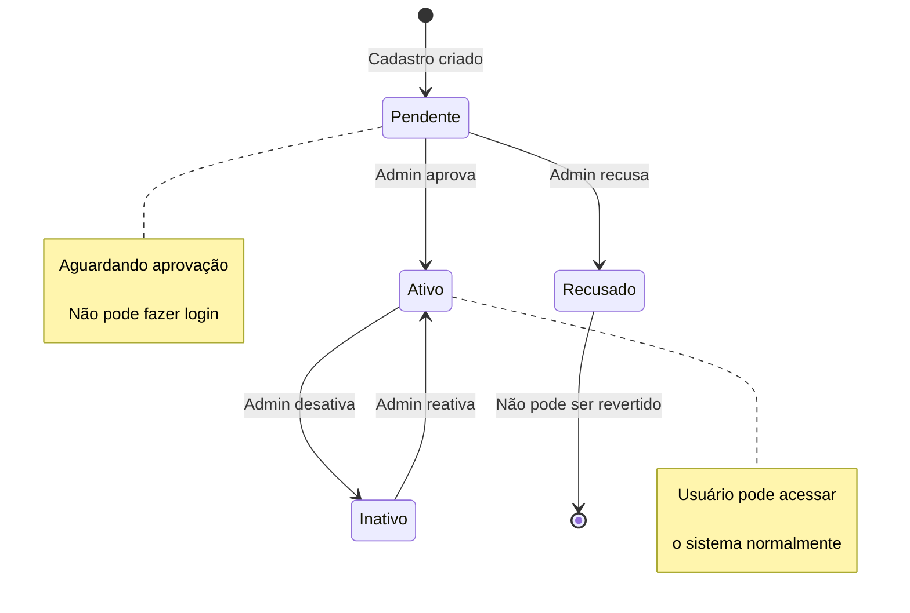
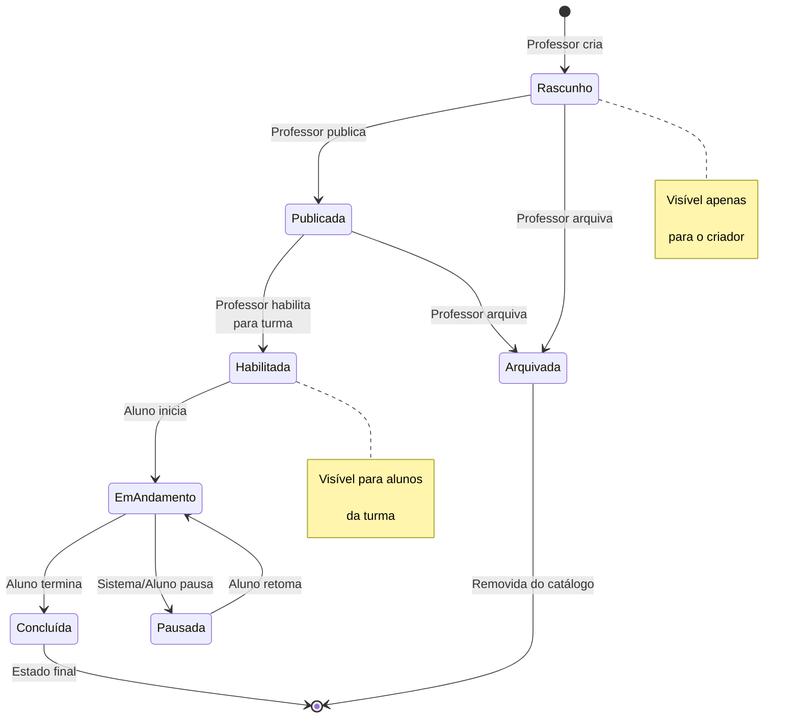
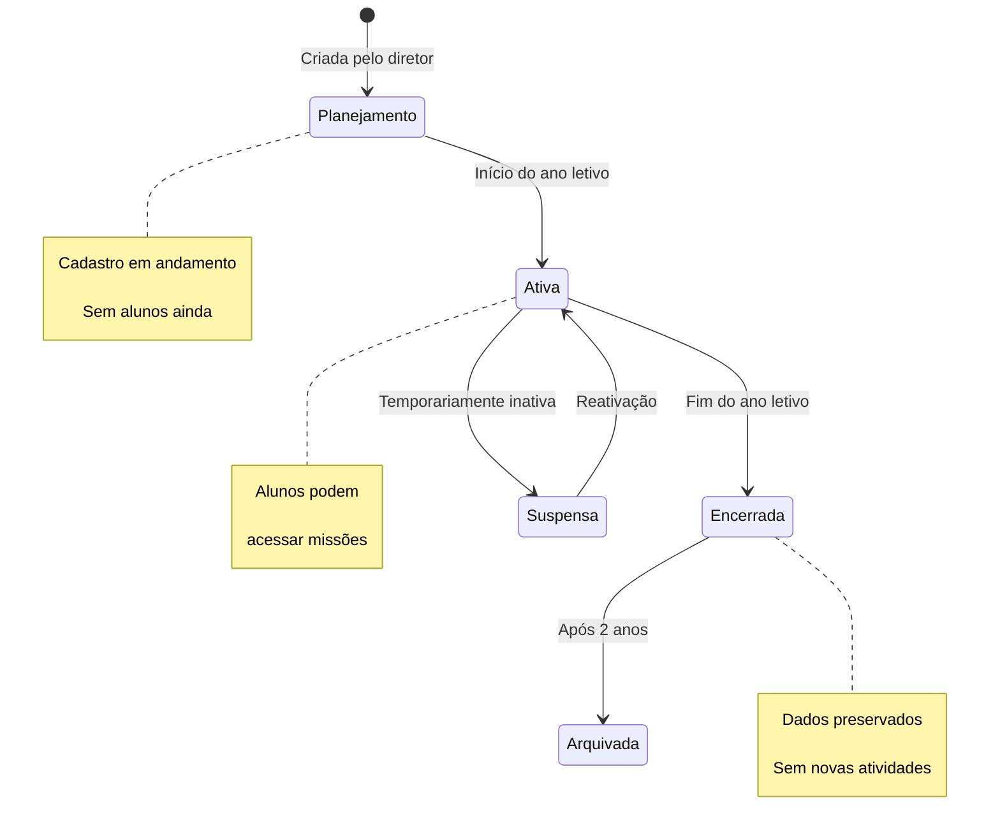
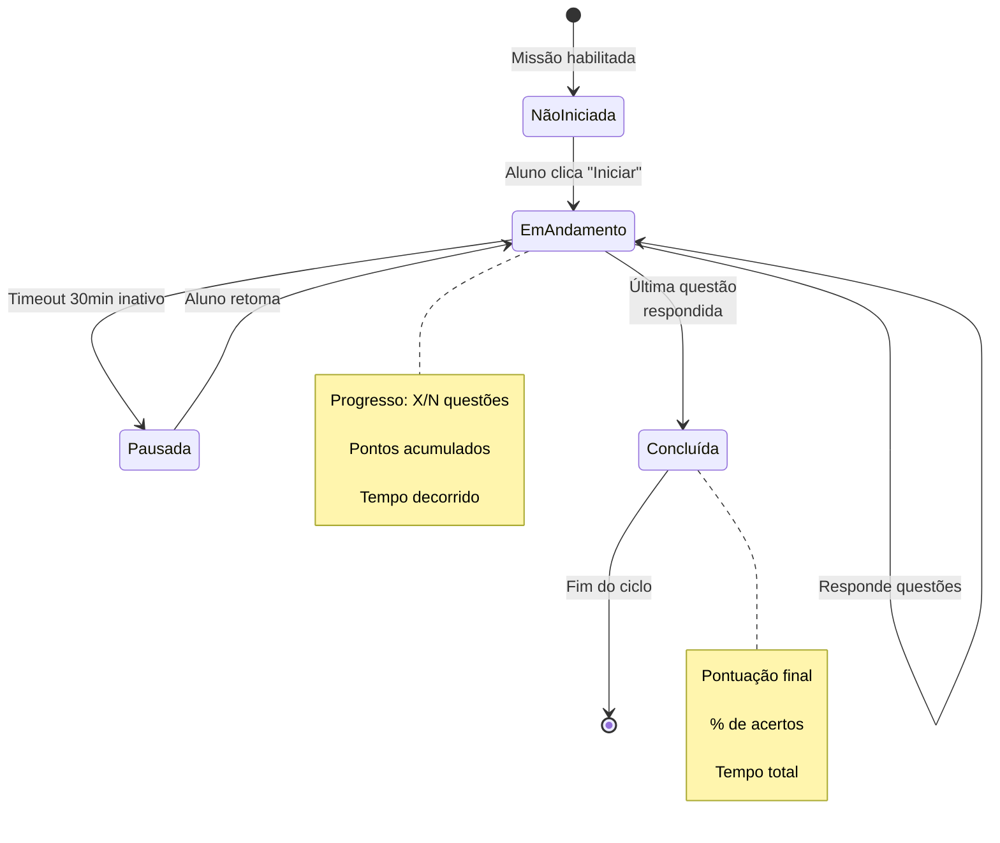
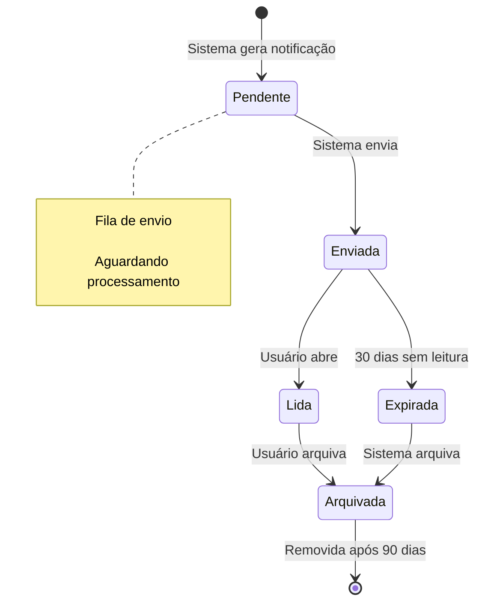
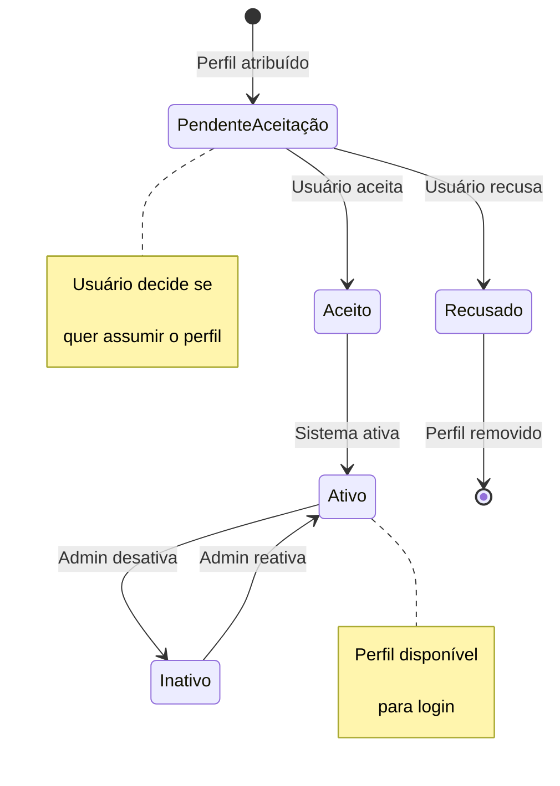
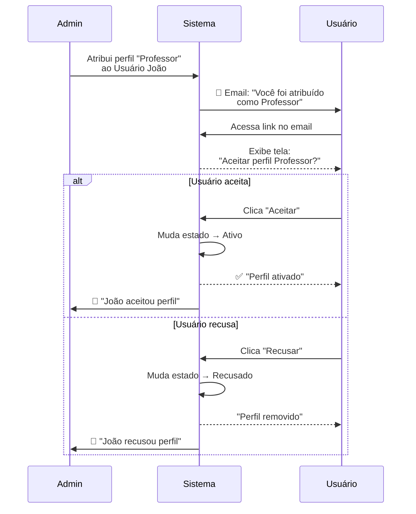
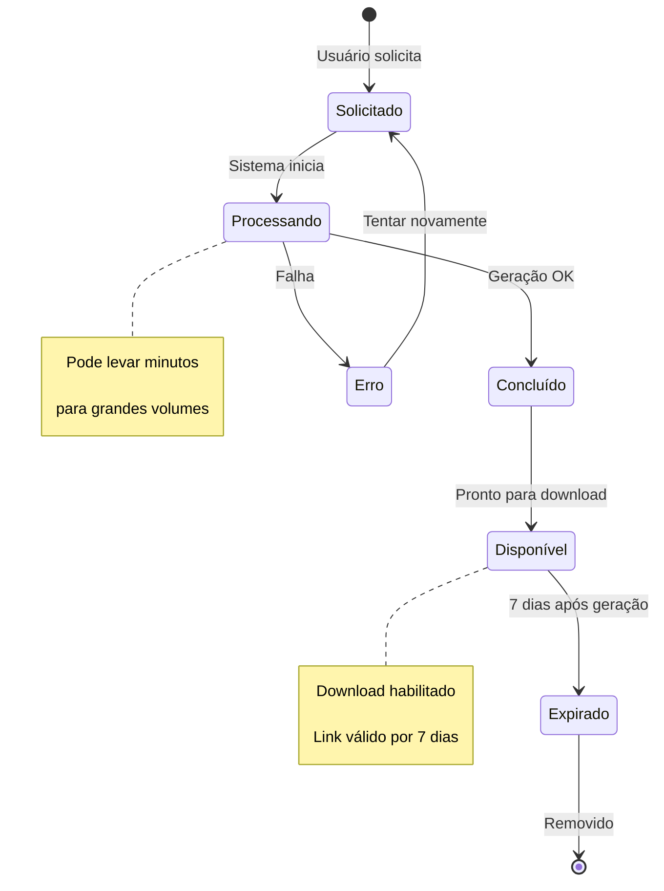

import { IconCheck, IconCircleRed, IconWarning, IconConstruction, PriorityHigh, PriorityMedium } from '@site/src/components/StatusIcons';
import { IconAdmin, IconTeacher, IconStudent } from '@site/src/components/MaterialIcon';

# Estados e Transições

Esta página documenta **como objetos mudam de estado** ao longo do tempo, quais transições são permitidas e quais ações disparam mudanças.

:::info Objetivo
Garantir que **estados sejam consistentes** e que transições inválidas sejam bloqueadas antes de causar problemas.
:::

---

## 👤 Estados de Usuário

### Diagrama de Estados

### Tabela de Transições

| Estado Atual | Próximo Estado | Quem Pode Executar | Regra | Reversível? |
|--------------|----------------|--------------------| ------|-------------|
| **Pendente** | Ativo | <IconAdmin /> Admin | Aprovação manual | Sim → Inativo |
| **Pendente** | Recusado | <IconAdmin /> Admin | Rejeição com motivo | ❌ Não |
| **Ativo** | Inativo | <IconAdmin /> Admin | Desativação temporária | ✅ Sim |
| **Inativo** | Ativo | <IconAdmin /> Admin | Reativação | ✅ Sim |

### Regras de Estado

| ID | Regra | Descrição | Impacto |
|----|-------|-----------|---------|
| **EST-001** | Usuário **Pendente** não pode fazer login | Bloqueio até aprovação | Exibe: "Aguardando aprovação" |
| **EST-002** | Usuário **Inativo** perde acesso imediato | Sessão é encerrada | Exibe: "Conta desativada" |
| **EST-003** | Usuário **Recusado** nunca pode ser ativado | Estado final | Cadastro deve ser refeito |
| **EST-004** | Mudança de estado gera **notificação** | Email automático | Usuário é informado |

---

## 📚 Estados de Missão

### Diagrama de Ciclo de Vida

### Tabela de Transições de Missão

| Estado Atual | Próximo Estado | Quem Pode | Condições | Reversível? |
|--------------|----------------|-----------|-----------|-------------|
| **Rascunho** | Publicada | <IconTeacher /> Professor | Mín. 5 questões | ✅ Sim |
| **Publicada** | Habilitada | <IconTeacher /> Professor | Turma ativa | ❌ Não pode desabilitar |
| **Habilitada** | Em Andamento | <IconStudent /> Aluno | Clicar em "Iniciar" | ✅ Pode pausar |
| **Em Andamento** | Pausada | Sistema/Aluno | Timeout ou pausa manual | ✅ Pode retomar |
| **Em Andamento** | Concluída | Sistema | Última questão respondida | ❌ Não |
| **Rascunho/Publicada** | Arquivada | <IconTeacher /> Professor | Confirmação | ⚠️ Difícil reverter |

### Regras de Estado de Missão

| ID | Regra | Descrição | Exemplo |
|----|-------|-----------|---------|
| **EST-005** | Missão **Rascunho** não aparece para alunos | Visibilidade restrita | Só o criador vê |
| **EST-006** | Missão **Habilitada** não pode ser editada | Integridade do conteúdo | Bloqueio de edição |
| **EST-007** | Missão **Em Andamento** salva progresso automaticamente | A cada resposta | Evita perda de dados |
| **EST-008** | Missão **Concluída** é estado final | Não pode refazer | Botão "Refazer" desabilitado |
| **EST-009** | Missão **Arquivada** some do catálogo | Não aparece em buscas | Só via relatórios |

---

## 🏫 Estados de Turma

### Diagrama de Estados

### Tabela de Transições de Turma

| Estado Atual | Próximo Estado | Quem Pode | Regra | Impacto |
|--------------|----------------|-----------|-------|---------|
| **Planejamento** | Ativa | Diretor/Admin | Definir data de início | Alunos ganham acesso |
| **Ativa** | Suspensa | Diretor/Admin | Motivo obrigatório | Alunos perdem acesso temporário |
| **Suspensa** | Ativa | Diretor/Admin | Resolver pendência | Alunos recuperam acesso |
| **Ativa** | Encerrada | Sistema | Data fim atingida | Alunos só visualizam dados |
| **Encerrada** | Arquivada | Sistema | Após 2 anos | Dados migram para arquivo histórico |

### Regras de Estado de Turma

| ID | Regra | Descrição |
|----|-------|-----------|
| **EST-010** | Turma **Planejamento** não permite habilitar missões | Deve estar ativa primeiro |
| **EST-011** | Turma **Suspensa** bloqueia acesso de alunos | Professores ainda veem dados |
| **EST-012** | Turma **Encerrada** é read-only | Nenhuma edição permitida |
| **EST-013** | Turma **Arquivada** só acessível via relatórios | Não aparece em listas normais |

---

## 🎯 Estados de Progresso do Aluno

### Diagrama de Progresso em Missão

### Transições de Progresso

| Estado Atual | Próximo Estado | Gatilho | Dados Salvos | Reversível? |
|--------------|----------------|---------|--------------|-------------|
| **Não Iniciada** | Em Andamento | Clicar "Iniciar Missão" | Timestamp início | ✅ Sim |
| **Em Andamento** | Em Andamento | Responder questão | Respostas + pontos | ✅ Sim |
| **Em Andamento** | Pausada | 30 min inativo | Progresso preservado | ✅ Sim |
| **Pausada** | Em Andamento | Clicar "Continuar" | Carrega progresso salvo | ✅ Sim |
| **Em Andamento** | Concluída | Responder última questão | Pontuação final | ❌ Não |

### Regras de Progresso

| ID | Regra | Descrição | Exemplo |
|----|-------|-----------|---------|
| **EST-014** | Progresso é **salvo automaticamente** a cada resposta | Evita perda de dados | Aluno responde Q3 → salvo instantaneamente |
| **EST-015** | Missão **pausada** pode ser retomada em até 7 dias | Após 7 dias, perde progresso | Pausou 02/02 → até 09/02 pode retomar |
| **EST-016** | Missão **concluída** não pode ser refeita | Estado final | Botão "Refazer" não existe |
| **EST-017** | **Pontuação** é calculada ao concluir | Soma de acertos × peso | Ver [Cálculos](./calculation-rules) |

---

## 🔔 Estados de Notificação

### Ciclo de Vida de Notificação

### Regras de Notificações

| ID | Regra | Descrição |
|----|-------|-----------|
| **EST-018** | Notificação **não lida** aparece com badge vermelho | Contador de não lidas |
| **EST-019** | Notificação **expirada** some automaticamente | Após 30 dias sem leitura |
| **EST-020** | Notificação **arquivada** só acessível via histórico | Link "Ver arquivadas" |

---

## 🎓 Estados de Perfil

### Diagrama de Aprovação de Perfil

### Fluxo de Aceitar/Recusar Perfil

### Regras de Perfil

| ID | Regra | Descrição |
|----|-------|-----------|
| **EST-021** | Perfil **Pendente** não pode fazer login com esse perfil | Bloqueio até aceitar |
| **EST-022** | Perfil **Recusado** é removido permanentemente | Não pode reverter |
| **EST-023** | Perfil **Ativo** permite login imediato | Sem delay |
| **EST-024** | Perfil **Inativo** bloqueia acesso mas preserva dados | Pode reativar |

---

## 📊 Estados de Relatório

### Ciclo de Geração de Relatório

### Regras de Relatórios

| ID | Regra | Descrição | Timeout |
|----|-------|-----------|---------|
| **EST-025** | Relatório **Processando** exibe barra de progresso | Feedback visual | Máx. 5 min |
| **EST-026** | Relatório **Erro** permite nova tentativa | Botão "Tentar novamente" | 3 tentativas |
| **EST-027** | Relatório **Disponível** expira em 7 dias | Link de download temporário | 7 dias |

---

## 🔗 Referências

- [Regras de Domínio](./domain-rules) - Entidades base
- [Controle de Acesso](./access-control) - Quem pode mudar estados
- [Validações](./validation-rules) - Condições para transições

---

:::tip Princípio de Design
**Estados devem ser explícitos na interface**:
- Use badges coloridos (Ativo = verde, Pendente = amarelo, Inativo = cinza)
- Desabilite ações inválidas (botão "Editar" desabilitado para missão habilitada)
- Exiba mensagens claras ao tentar transições bloqueadas
:::
