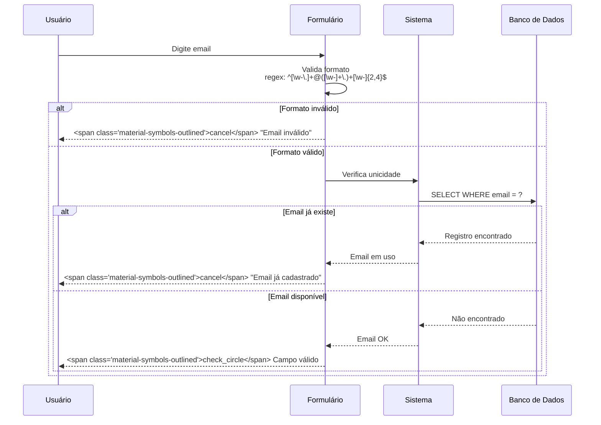
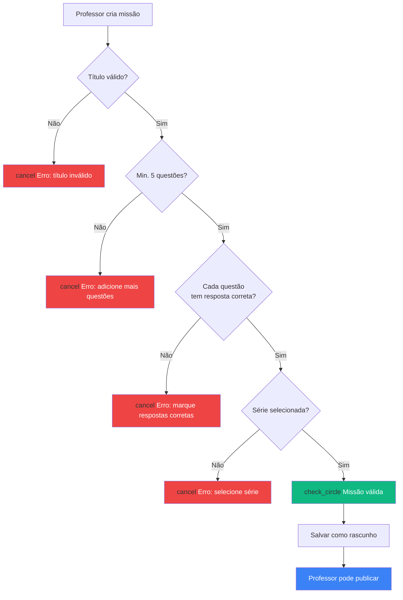
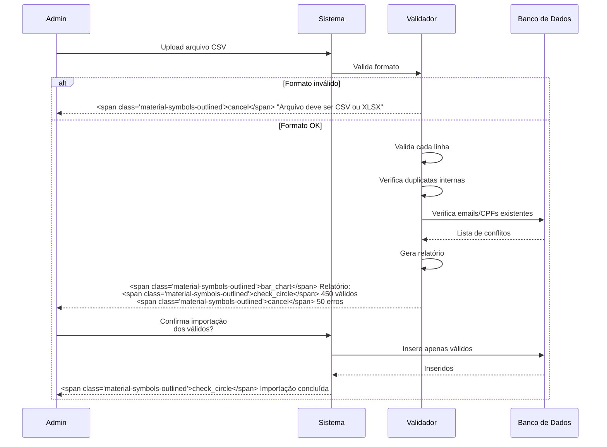

import { IconCheck, IconCircleRed, IconWarning, PriorityHigh, PriorityMedium, PriorityLow } from '@site/src/components/StatusIcons';

# Validações de Dados

Esta página documenta **todas as regras de validação** de campos, formulários e operações do Educacross.

:::info Objetivo
Garantir **integridade dos dados** e **boa experiência de usuário** com mensagens de erro claras.
:::

---

## <span class="material-symbols-outlined">person</span> Validações de Usuários

### Cadastro de Usuário

| Campo | Validação | Mensagem de Erro | Prioridade |
|-------|-----------|------------------|------------|
| **Nome Completo** | Obrigatório, mín. 3 caracteres, máx. 100 | "Nome deve ter entre 3 e 100 caracteres" | <PriorityHigh /> |
| **Email** | Obrigatório, formato válido, único no sistema | "Email inválido" ou "Email já cadastrado" | <PriorityHigh /> |
| **CPF** | Formato válido (11 dígitos), único no sistema | "CPF inválido" ou "CPF já cadastrado" | <PriorityHigh /> |
| **Data de Nascimento** | Obrigatório, não pode ser futura, mín. 3 anos | "Data inválida" ou "Idade mínima: 3 anos" | <PriorityMedium /> |
| **Telefone** | Opcional, formato (XX) XXXXX-XXXX | "Telefone inválido" | <PriorityLow /> |
| **Senha** | Mín. 8 caracteres, 1 maiúscula, 1 número | "Senha fraca. Use 8+ caracteres, maiúscula e número" | <PriorityHigh /> |

### Fluxo de Validação de Email



### Validações de CPF

| Regra | Descrição | Exemplo de Erro |
|-------|-----------|-----------------|
| **Formato** | Exatamente 11 dígitos numéricos | "123.456" → <span class="material-symbols-outlined">cancel</span> Incompleto |
| **Dígitos Verificadores** | Cálculo correto dos 2 últimos dígitos | "111.111.111-11" → <span class="material-symbols-outlined">cancel</span> Inválido |
| **Unicidade** | Não pode haver 2 usuários com mesmo CPF | Cadastro duplicado → <span class="material-symbols-outlined">cancel</span> Bloqueado |
| **Opcional para Alunos < 10 anos** | CPF não obrigatório | Aluno de 6 anos → <span class="material-symbols-outlined">check_circle</span> Pode deixar vazio |

---

## <span class="material-symbols-outlined">school</span> Validações de Instituições e Turmas

### Cadastro de Instituição

| Campo | Validação | Mensagem de Erro |
|-------|-----------|------------------|
| **Nome da Escola** | Obrigatório, mín. 3, máx. 200 caracteres | "Nome da escola deve ter entre 3 e 200 caracteres" |
| **INEP** | Opcional, 8 dígitos, único se preenchido | "Código INEP inválido" ou "INEP já cadastrado" |
| **Endereço** | Obrigatório, mín. 10 caracteres | "Endereço muito curto" |
| **Rede** | Obrigatório, deve existir no sistema | "Selecione uma rede válida" |
| **Município/Estado** | Obrigatório | "Município e estado são obrigatórios" |

### Cadastro de Turma

| Campo | Validação | Mensagem de Erro | Impacto |
|-------|-----------|------------------|---------|
| **Nome da Turma** | Obrigatório, mín. 2, máx. 50 caracteres | "Nome da turma inválido" | Identificação |
| **Série** | Obrigatório, deve ser uma das séries válidas | "Selecione uma série válida" | Filtra conteúdos |
| **Instituição** | Obrigatório, instituição ativa | "Instituição inválida" | Hierarquia |
| **Ano Letivo** | Obrigatório, ano atual ou futuro | "Ano letivo não pode ser passado" | Organização temporal |
| **Turno** | Opcional (Matutino, Vespertino, Noturno, Integral) | "Selecione um turno válido" | Organização |

### Regras de Consistência

| ID | Regra | Validação | Exemplo |
|----|-------|-----------|---------|
| **VAL-001** | Não pode haver **turmas duplicadas** | Nome + Série + Ano na mesma instituição | "5º Ano A - 2024" na Escola X → <span class="material-symbols-outlined">cancel</span> já existe |
| **VAL-002** | Turma deve ter **pelo menos 1 aluno** para ativar | Contagem mínima | Turma vazia → <IconWarning /> Alerta |
| **VAL-003** | Série deve ser **compatível** com idade dos alunos | Validação de faixa etária | Aluno de 6 anos no 9º ano → <span class="material-symbols-outlined">cancel</span> Bloqueado |

---

## <span class="material-symbols-outlined">library_books</span> Validações de Conteúdos

### Cadastro de Missão Custom

| Campo | Validação | Mensagem de Erro |
|-------|-----------|------------------|
| **Título** | Obrigatório, mín. 5, máx. 150 caracteres | "Título da missão deve ter entre 5 e 150 caracteres" |
| **Descrição** | Opcional, máx. 500 caracteres | "Descrição muito longa (máx. 500 caracteres)" |
| **Questões** | Obrigatório, mín. 5 questões | "Missão deve ter no mínimo 5 questões" |
| **Série** | Obrigatório, série válida | "Selecione uma série válida" |
| **Disciplina** | Obrigatório | "Selecione uma disciplina" |

### Validação de Questões

| Regra | Descrição | Exemplo de Erro |
|-------|-----------|-----------------|
| **Enunciado obrigatório** | Mín. 10 caracteres | "Enunciado muito curto" |
| **Mínimo 2 alternativas** | Questão objetiva | "Adicione pelo menos 2 alternativas" |
| **Máximo 5 alternativas** | Limite de opções | "Máximo de 5 alternativas por questão" |
| **1 resposta correta obrigatória** | Deve marcar a correta | "Marque a resposta correta" |
| **Alternativas únicas** | Não pode haver textos duplicados | "Alternativa 'A' e 'B' são iguais" |

### Fluxo de Validação de Missão



---

## <span class="material-symbols-outlined">track_changes</span> Validações de Operações

### Habilitação de Missão

| Regra | Validação | Mensagem |
|-------|-----------|----------|
| **VAL-004** | Professor deve **lecionar na turma** | "Você não tem permissão para habilitar missões nesta turma" |
| **VAL-005** | Missão deve ser **da série da turma** | "Esta missão não é compatível com a série da turma" |
| **VAL-006** | Missão não pode estar **já habilitada** | "Missão já foi habilitada para esta turma" |
| **VAL-007** | Turma deve estar **ativa** | "Não é possível habilitar missões para turmas inativas" |

### Importação em Lote (CSV/Excel)

| Validação | Descrição | Ação |
|-----------|-----------|------|
| **Formato do arquivo** | Deve ser .csv ou .xlsx | Rejeitar upload se formato errado |
| **Colunas obrigatórias** | Nome, Email, CPF (para alguns perfis) | Listar colunas faltantes |
| **Máximo 500 linhas** | Limite por upload | "Divida o arquivo em lotes menores" |
| **Duplicatas no arquivo** | Mesmos emails repetidos | Relatório de linhas duplicadas |
| **Validação linha por linha** | Cada registro é validado | Relatório: linhas OK vs. linhas com erro |

### Fluxo de Importação



---

## <span class="material-symbols-outlined">bar_chart</span> Validações de Relatórios

### Filtros de Relatório

| Filtro | Validação | Mensagem de Erro |
|--------|-----------|------------------|
| **Data Início/Fim** | Data início ≤ Data fim | "Data de início não pode ser posterior à data final" |
| **Período máximo** | Máximo 1 ano entre datas | "Período máximo: 1 ano" |
| **Turma** | Deve pertencer à instituição do usuário | "Turma não encontrada ou sem permissão" |
| **Aluno** | Deve estar na turma selecionada | "Aluno não pertence a esta turma" |

### Exportação de Dados

| Regra | Validação | Limite |
|-------|-----------|--------|
| **VAL-008** | Máximo 10.000 registros por exportação | "Refine os filtros para reduzir resultados" |
| **VAL-009** | Formatos permitidos: Excel, PDF, CSV | "Formato não suportado" |
| **VAL-010** | Exportação gera log de auditoria | Registra usuário, data, filtros |

---

## <span class="material-symbols-outlined">lock</span> Validações de Segurança

### Senha

| Critério | Regra | Exemplo |
|----------|-------|---------|
| **Comprimento** | Mínimo 8 caracteres | "senha123" → <span class="material-symbols-outlined">cancel</span> 9 chars OK, mas falta complexidade |
| **Maiúscula** | Pelo menos 1 letra maiúscula | "senha123" → <span class="material-symbols-outlined">cancel</span> |
| **Número** | Pelo menos 1 número | "SenhaForte" → <span class="material-symbols-outlined">cancel</span> |
| **Caractere especial** | Opcional, mas recomendado | "Senha123!" → <span class="material-symbols-outlined">check_circle</span> |
| **Não pode ser igual ao email** | Prevenir senhas óbvias | Email: joao@escola.com, Senha: joao@escola.com → <span class="material-symbols-outlined">cancel</span> |

### Força de Senha (Visual)

```mermaid
graph LR
    A[senha] --> B[<IconCircleRed /> Muito Fraca]
    C[senha123] --> D[<IconCircleRed /> Fraca]
    E[Senha123] --> F[<IconWarning /> Média]
    G[Senha123!] --> H[<IconCheck /> Forte]
    I[S3nh@F0rt3!2024] --> J[<IconCheck /> Muito Forte]
    
    style B fill:#EF4444,color:#fff
    style D fill:#F59E0B,color:#fff
    style F fill:#FCD34D
    style H fill:#10B981,color:#fff
    style J fill:#059669,color:#fff
```

### Tentativas de Login

| Regra | Descrição | Ação |
|-------|-----------|------|
| **VAL-011** | Máximo 5 tentativas incorretas em 15 minutos | Bloquear temporariamente |
| **VAL-012** | Bloqueio de 30 minutos após 5 falhas | Mensagem: "Conta bloqueada temporariamente" |
| **VAL-013** | Após 10 falhas, bloquear até admin liberar | Notificar admin por email |

---

## <span class="material-symbols-outlined">smartphone</span> Validações de Campos Específicos

### Telefone

| Formato | Validação | Exemplo |
|---------|-----------|---------|
| **Celular** | (XX) 9XXXX-XXXX | (11) 98765-4321 <span class="material-symbols-outlined">check_circle</span> |
| **Fixo** | (XX) XXXX-XXXX | (11) 3456-7890 <span class="material-symbols-outlined">check_circle</span> |
| **Internacional** | Opcional, formato livre | +55 11 98765-4321 <span class="material-symbols-outlined">check_circle</span> |

### CEP

| Validação | Regra | Exemplo |
|-----------|-------|---------|
| **Formato** | XXXXX-XXX | 12345-678 <span class="material-symbols-outlined">check_circle</span> |
| **Busca automática** | API ViaCEP para autocomplete | CEP válido → preenche endereço |
| **CEP inválido** | Não encontrado na API | Permitir continuar manualmente |

---

## <span class="material-symbols-outlined">palette</span> Padrões de Mensagens de Erro

### Tipos de Mensagem

| Tipo | Cor | Ícone | Uso |
|------|-----|-------|-----|
| **Erro Crítico** | Vermelho | <IconCircleRed /> | Campo obrigatório vazio, formato inválido |
| **Aviso** | Amarelo | <IconWarning /> | Valor não recomendado mas aceito |
| **Sucesso** | Verde | <IconCheck /> | Validação passou |
| **Info** | Azul | ℹ | Dica de preenchimento |

### Exemplo de Formulário com Validação

```mermaid
flowchart TD
    A[Usuário preenche formulário] --> B{Valida em tempo real}
    
    B -->|Campo vazio| C[<IconCircleRed /> "Campo obrigatório"]
    B -->|Email inválido| D[<IconCircleRed /> "Email inválido"]
    B -->|Senha fraca| E[<IconWarning /> "Senha fraca - recomendamos 10+ caracteres"]
    B -->|Tudo OK| F[<IconCheck /> Campos válidos]
    
    F --> G[Botão Salvar habilitado]
    C --> H[Botão Salvar desabilitado]
    D --> H
    
    style C fill:#EF4444,color:#fff
    style D fill:#EF4444,color:#fff
    style E fill:#F59E0B,color:#fff
    style F fill:#10B981,color:#fff
```

---

## <span class="material-symbols-outlined">link</span> Referências

- [Regras de Domínio](./domain-rules) - Entidades e relacionamentos
- [Controle de Acesso](./access-control) - Permissões
- [Estados e Transições](./state-transitions) - Fluxos de estado

---

:::tip Boas Práticas
- **Valide no front e no back**: Front para UX, back para segurança
- **Mensagens claras**: "CPF inválido" é melhor que "Erro no campo CPF"
- **Validação em tempo real**: Valide ao sair do campo (onBlur)
- **Destaque erros visualmente**: Borda vermelha + mensagem abaixo do campo
:::
