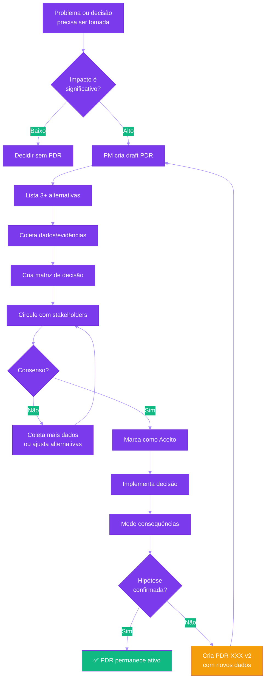

# 🎯 Product Decision Records (PDRs)

Registro histórico de decisões importantes de produto e suas justificativas.

:::info Por Que PDRs?
**PDRs** (inspirados em ADRs - Architecture Decision Records) capturam:
- **Contexto** da decisão no momento
- **Alternativas consideradas** e seus trade-offs
- **Justificativa** baseada em dados
- **Consequências esperadas** e como medir

Isso evita refazer debates já resolvidos e fornece contexto para novos membros do time.
:::

---

## 🚀 Como Usar

### Para Product Managers
1. Use o [Template PDR](./template.md) quando tomar **decisões impactantes**
2. Liste pelo menos 3 alternativas consideradas
3. Documente trade-offs e justificativa com dados
4. Marque como "Aceito" após consenso com stakeholders

### Quando Criar um PDR?

Crie PDR para decisões que:
- ✅ Impactam múltiplas features ou o produto inteiro
- ✅ São difíceis de reverter (alto custo de mudança)
- ✅ Têm trade-offs significativos
- ✅ Afetam experiência do usuário core
- ✅ Mudam regras de negócio fundamentais
- ❌ Não crie PDR para decisões triviais (ex: cor de botão, wording de label)

### Para Desenvolvedores
- PDRs explicam **por quê** certas regras existem
- Consulte antes de propor mudanças em lógica de negócio
- Use PDRs como referência em code reviews

### Para Novos Membros
- Leia PDRs para entender decisões passadas
- Evite reabrir debates já resolvidos
- Se discordar, proponha novo PDR com novos dados

---

## 📚 Template e Exemplos

  

    
📝

    

      <h3>Template PDR</h3>
      
Use este template para criar novos PDRs

      <a href="./template" className="card-link">
        Ver Template arrow_forward
      </a>
    

  

  

    
🏆

    

      <h3>PDR-001: Ranking por Turma</h3>
      
Por que ranking é apenas por turma, nunca nacional

      <a href="./template#exemplo-1-pdr-001---ranking-por-turma" className="card-link">
        Ver Exemplo arrow_forward
      </a>
    

  

  

    
🔒

    

      <h3>PDR-002: Missões Não Desabilitáveis</h3>
      
Por que professores não podem desabilitar missões de gestores

      <a href="./template#exemplo-2-pdr-002---missões-não-podem-ser-desabilitadas" className="card-link">
        Ver Exemplo arrow_forward
      </a>
    

  

  

    
🎖️

    

      <h3>PDR-003: Medalhas com Nota Mínima</h3>
      
Por que medalhas exigem 70% de acerto mínimo

      <a href="./template#exemplo-3-pdr-003---nota-mínima-para-conquista-de-medalhas" className="card-link">
        Ver Exemplo arrow_forward
      </a>
    

  

---

## 📋 Lista de PDRs por Status

### ✅ Aceitos (Ativos)

| ID | Título | Data | Autor | Impacto |
|----|--------|------|-------|---------|
| [PDR-001](./template#exemplo-1-pdr-001---ranking-por-turma) | Ranking por Turma | 2025-02-10 | Time Produto | Alto |
| [PDR-002](./template#exemplo-2-pdr-002---missões-não-podem-ser-desabilitadas) | Missões Não Desabilitáveis | 2025-02-12 | Time Produto | Alto |
| [PDR-003](./template#exemplo-3-pdr-003---nota-mínima-para-conquista-de-medalhas) | Medalhas com Nota Mínima 70% | 2025-02-15 | Time Produto | Médio |

---

### 🚧 Em Discussão

_Nenhum PDR em discussão no momento_

---

### ❌ Rejeitados

_Adicione PDRs rejeitados aqui para referência histórica_

---

### 🔄 Substituídos

_Adicione PDRs que foram substituídos por decisões posteriores_

---

## 📊 PDRs por Categoria

### 🎮 Gamificação
- [PDR-001: Ranking por Turma](./template#exemplo-1-pdr-001---ranking-por-turma)
- [PDR-003: Medalhas com Nota Mínima](./template#exemplo-3-pdr-003---nota-mínima-para-conquista-de-medalhas)

### 👥 Controle de Acesso
- [PDR-002: Missões Não Desabilitáveis](./template#exemplo-2-pdr-002---missões-não-podem-ser-desabilitadas)

### 📚 Conteúdo Pedagógico
_Adicione PDRs relacionados a conteúdo BNCC aqui_

### 📊 Analytics e Métricas
_Adicione PDRs relacionados a métricas e dashboards aqui_

### 🛠️ Arquitetura de Produto
_Adicione PDRs sobre estrutura do produto aqui_

---

## 🔗 Recursos Relacionados

- [**Regras de Negócio**](../business-rules/) - Regras implementadas (PDRs explicam o "por quê")
- [**PRDs**](../prds/) - Especificações de features (PDRs referenciados em PRDs)
- [**Product Vision & Strategy**](../product-strategy/vision.md) - Direção estratégica (PDRs devem alinhar)

---

## 🎓 Boas Práticas

:::tip Dicas para Escrever PDRs Eficazes

### 1. Use Dados, Não Opiniões
❌ "Achamos melhor..."  
✅ "73% dos alunos relataram desmotivação com ranking nacional"

### 2. Liste Pelo Menos 3 Alternativas
Mostre que considerou múltiplas opções, não apenas 2 (sua favorita vs strawman).

### 3. Seja Honesto sobre Trade-offs
Toda decisão tem trade-offs. Documente o que estamos sacrificando.

### 4. Defina Condições de Reversão
"Se X acontecer, vamos reverter em Y prazo". Isso reduz medo de decidir.

### 5. Conecte à Estratégia
Toda decisão deve alinhar com [Product Vision](../product-strategy/vision.md).

### 6. Atualize se Contexto Mudar
Se novos dados surgem, crie PDR-XXX-v2 ou marque original como "Substituído".

:::

---

## 📊 Fluxo de Decisão

---

## 📈 Métricas de Qualidade dos PDRs

| Métrica | Meta | Atual |
|---------|------|-------|
| **PDRs criados por quarter** | 5-10 | - |
| **Decisões revertidas** | < 10% | - |
| **Stakeholders consultados** | 100% | - |
| **Decisões com dados quantitativos** | > 80% | - |

---

## 🧭 Quando NÃO Criar PDR

**Não perca tempo documentando:**
- ✗ Decisões triviais (cor de botão, wording)
- ✗ Decisões facilmente reversíveis (< 1 dia de work)
- ✗ Decisões puramente técnicas (escolha de biblioteca)
- ✗ Experimentos A/B (documente resultado, não a decisão de experimentar)

**Mas SEMPRE documente:**
- ✓ Mudanças em regras de negócio core
- ✓ Decisões que impactam múltiplas squads
- ✓ Trade-offs entre UX e performance
- ✓ "Vamos NÃO fazer X" (anti-features)

---

## 🔍 Busca de PDRs

Use as tags abaixo para filtrar PDRs:

**Por Impacto:**
- [#alto-impacto](#) - Decisões críticas para o produto
- [#médio-impacto](#) - Decisões importantes mas não críticas
- [#baixo-impacto](#) - Decisões documentadas para histórico

**Por Área:**
- [#gamification](#) - Ranking, medalhas, pontos
- [#access-control](#) - Permissões, perfis, hierarquia
- [#content](#) - BNCC, missões, questões
- [#analytics](#) - Dashboards, métricas, relatórios
- [#ux](#) - Experiência do usuário

**Por Status:**
- [#aceito](#) - Decisões ativas
- [#em-discussao](#) - Ainda sendo debatidas
- [#rejeitado](#) - Não implementadas
- [#substituido](#) - Substituídas por decisão posterior

---

## 📞 Contato

**Dúvidas sobre PDRs?**  
Entre em contato com o Time de Produto.

**Quer propor revisão de uma decisão?**  
Traga novos dados e proponha PDR-XXX-v2.

---

**Última atualização:** Fevereiro 2026  
**Mantido por:** Time de Produto
