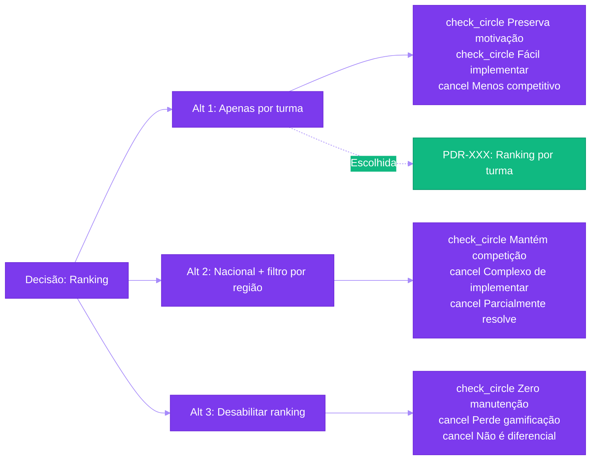

import { IconCheck, IconWarning, IconConstruction } from '@site/src/components/StatusIcons';

# PDR Template - Product Decision Record

Use este template para documentar **decisões importantes de produto** e seu contexto.

:::info Por Que PDRs?
PDRs capturam o **"por quê"** de decisões críticas, evitando que o time refaça debates já resolvidos e fornecendo contexto histórico para novos membros.
:::

---

## <span class="material-symbols-outlined">assignment</span> Metadados

| Campo | Valor |
|-------|-------|
| **ID** | PDR-XXX |
| **Título** | [Título curto e descritivo da decisão] |
| **Autor** | [Nome do PM] |
| **Data da Decisão** | YYYY-MM-DD |
| **Status** | <IconConstruction /> Proposto / <IconWarning /> Em Discussão / <IconCheck /> Aceito / Rejeitado / Depreciado / Substituído por PDR-YYY |
| **Stakeholders** | @pessoa1, @pessoa2, @pessoa3 |
| **Contexto** | [Feature/Épico/Problema relacionado] |
| **Impacto** | <span style={{color: '#DC2626'}}>Alto</span> / <span style={{color: '#F59E0B'}}>Médio</span> / <span style={{color: '#10B981'}}>Baixo</span> |

---

## <span class="material-symbols-outlined">track_changes</span> 1. Contexto e Problema

### 1.1 Qual é a Decisão?

**Resumo em uma frase:**

_"Decidimos que [X] em vez de [Y] para resolver [problema Z]."_

**Exemplo:**
```
Decidimos que o ranking de alunos será exibido apenas por turma (nunca nacional) 
para preservar a motivação de alunos de escolas com baixo desempenho.
```

---

### 1.2 Qual Problema Estamos Resolvendo?

**Contexto do problema:**

_"Observamos que [situação X] estava causando [problema Y], com evidências de [dados Z]."_

**Exemplo:**
```
Observamos que o ranking nacional desmotivava alunos de escolas públicas periféricas:
- 73% dos alunos dessas escolas nunca apareciam no top 100 nacional
- NPS dessas escolas era 20 pontos menor que média (35 vs 55)
- 5 escolas pediram para desabilitar ranking, ameaçando cancelar
- Entrevistas qualitativas: "não adianta me esforçar, nunca vou competir com colégio particular"
```

---

### 1.3 Por Que Precisamos Decidir Isso Agora?

**Urgência:**

- [ ] Bloqueador para lançamento de feature
- [ ] Impacto em experiência do usuário ativo
- [ ] Risco de churn de clientes
- [ ] Decisão de arquitetura com custo alto de reversão
- [ ] Janela de oportunidade (ex: volta às aulas)
- [ ] Outro: _[descrever]_

**Exemplo:**
```
<span class="material-symbols-outlined">check</span> Impacto em experiência do usuário ativo
<span class="material-symbols-outlined">check</span> Risco de churn de clientes (5 escolas ameaçaram cancelar)
```

---

## <span class="material-symbols-outlined">help</span> 2. Alternativas Consideradas

### Alternativa 1: [Nome da Alternativa]

**Descrição:**

_Como essa alternativa funciona?_

**Prós:**
- <span class="material-symbols-outlined">check_circle</span> Vantagem 1
- <span class="material-symbols-outlined">check_circle</span> Vantagem 2
- <span class="material-symbols-outlined">check_circle</span> Vantagem 3

**Contras:**
- <span class="material-symbols-outlined">cancel</span> Desvantagem 1
- <span class="material-symbols-outlined">cancel</span> Desvantagem 2
- <span class="material-symbols-outlined">cancel</span> Desvantagem 3

**Esforço de implementação:**  
<span class="material-symbols-outlined" class="ms-success">circle</span> Baixo / <span class="material-symbols-outlined" class="ms-warning">circle</span> Médio / <span class="material-symbols-outlined" class="ms-danger">circle</span> Alto

---

### Alternativa 2: [Nome da Alternativa]

**Descrição:**

_Como essa alternativa funciona?_

**Prós:**
- <span class="material-symbols-outlined">check_circle</span> Vantagem 1
- <span class="material-symbols-outlined">check_circle</span> Vantagem 2

**Contras:**
- <span class="material-symbols-outlined">cancel</span> Desvantagem 1
- <span class="material-symbols-outlined">cancel</span> Desvantagem 2

**Esforço de implementação:**  
<span class="material-symbols-outlined" class="ms-success">circle</span> Baixo / <span class="material-symbols-outlined" class="ms-warning">circle</span> Médio / <span class="material-symbols-outlined" class="ms-danger">circle</span> Alto

---

### Alternativa 3: [Nome da Alternativa]

**Descrição:**

_Como essa alternativa funciona?_

**Prós:**
- <span class="material-symbols-outlined">check_circle</span> Vantagem 1

**Contras:**
- <span class="material-symbols-outlined">cancel</span> Desvantagem 1

**Esforço de implementação:**  
<span class="material-symbols-outlined" class="ms-success">circle</span> Baixo / <span class="material-symbols-outlined" class="ms-warning">circle</span> Médio / <span class="material-symbols-outlined" class="ms-danger">circle</span> Alto

---

## <span class="material-symbols-outlined">bar_chart</span> 3. Análise Comparativa

### Matriz de Decisão

| Critério | Peso | Alt 1 | Alt 2 | Alt 3 |
|----------|------|-------|-------|-------|
| **Impacto na Métrica Primária** | 40% | 8/10 | 6/10 | 4/10 |
| **Esforço de Implementação** | 20% | 7/10 | 5/10 | 9/10 |
| **Reversibilidade** | 15% | 9/10 | 6/10 | 8/10 |
| **Alinhamento com Visão** | 15% | 9/10 | 7/10 | 5/10 |
| **Risco Técnico** | 10% | 8/10 | 5/10 | 7/10 |
| **TOTAL PONDERADO** | 100% | **7.9** | **6.1** | **6.2** |

---

### Visualização da Comparação



---

## <span class="material-symbols-outlined">check_circle</span> 4. Decisão Tomada

### 4.1 Qual Alternativa Escolhemos?

**Alternativa escolhida:** [Nome da Alternativa X]

**Por que esta e não as outras:**

_"Escolhemos [X] porque [justificativa baseada em dados/estratégia/visão]. Apesar de [tradeoff Y], acreditamos que [benefício Z] supera os contras."_

**Exemplo:**
```
Escolhemos Alt 1 (Ranking apenas por turma) porque:
1. Preserva motivação de 73% dos alunos que estavam desmotivados
2. Reduz risco de churn de clientes (5 escolas ameaçaram cancelar)
3. Alinha com nossa visão de "educação inclusiva" - competir de forma justa
4. Custo de implementação é baixo (2 dias de dev)

Apesar de reduzir competição entre escolas, acreditamos que motivação > competição 
para nossa persona principal (aluno de escola pública).
```

---

### 4.2 Trade-offs Aceitos

**O que estamos sacrificando:**

- <span class="material-symbols-outlined">warning</span> Trade-off 1: [Descrição]
- <span class="material-symbols-outlined">warning</span> Trade-off 2: [Descrição]

**Por que vale a pena:**

_"Aceitamos esses trade-offs porque [justificativa]."_

---

## <span class="material-symbols-outlined">trending_up</span> 5. Consequências Esperadas

### 5.1 Impacto Positivo

**O que esperamos melhorar:**

| Métrica | Baseline | Projeção | Prazo |
|---------|----------|----------|-------|
| [Métrica 1] | [valor atual] | [valor esperado] | [quando medir] |
| [Métrica 2] | [valor atual] | [valor esperado] | [quando medir] |

**Exemplo:**
| Métrica | Baseline | Projeção | Prazo |
|---------|----------|----------|-------|
| NPS escolas públicas | 35 | 50 | 3 meses |
| Churn risk (escolas ameaçando cancelar) | 5 escolas | 0 | Imediato |
| Engajamento semanal (WAU) | 58% | 65% | 2 meses |

---

### 5.2 Riscos e Mitigação

| Risco | Probabilidade | Impacto | Mitigação |
|-------|---------------|---------|-----------|
| [Risco 1] | Alta/Média/Baixa | Alto/Médio/Baixo | [Como vamos mitigar] |
| [Risco 2] | Alta/Média/Baixa | Alto/Médio/Baixo | [Como vamos mitigar] |

**Exemplo:**
| Risco | Probabilidade | Impacto | Mitigação |
|-------|---------------|---------|-----------|
| Escolas particulares reclamam de "perda de competitividade" | Média | Médio | Feature flag: permitir escola particular habilitar ranking regional opcionalmente |
| Alunos top nacional se desmotivam | Baixa | Baixo | Manter ranking de missões específicas (mantém competição em eventos) |

---

### 5.3 Plano de Reversão

**Como reverter se a decisão falhar:**

_"Se [condição X ocorrer], vamos [ação de reversão Y] em [prazo Z]."_

**Exemplo:**
```
Se após 3 meses:
- NPS escolas públicas não melhorar (continuar < 40)
- E WAU geral cair > 10%

Então vamos:
1. Reativar ranking nacional como opt-in (escola escolhe)
2. Criar "ligas" (escolas competem dentro de clusters similares)
3. Tempo de reversão: 1 sprint (2 semanas)
```

**Custo de reversão:**  
<span class="material-symbols-outlined" class="ms-success">circle</span> Baixo / <span class="material-symbols-outlined" class="ms-warning">circle</span> Médio / <span class="material-symbols-outlined" class="ms-danger">circle</span> Alto

---

## <span class="material-symbols-outlined">link</span> 6. Impacto em Outras Partes do Produto

### 6.1 Funcionalidades Afetadas

- [ ] [Feature X] - precisa ser ajustada
- [ ] [Feature Y] - não é mais necessária
- [ ] [Feature Z] - fica bloqueada até implementar

### 6.2 Regras de Negócio Criadas/Alteradas

**Novas regras:**
- [RD-XXX](../business-rules/domain-rules.md#rd-xxx): [Descrição da regra]
- [AC-YYY](../business-rules/access-control.md#ac-yyy): [Descrição da regra]

**Regras depreciadas:**
- ~~RD-ZZZ~~: [Por que foi removida]

---

### 6.3 Impacto em PRDs

**PRDs afetados:**
- [PRD-AAA](../prds/prd-aaa.md): Seção X precisa ser atualizada
- [PRD-BBB](../prds/prd-bbb.md): Requisito RF-05 não é mais necessário

---

## <span class="material-symbols-outlined">group</span> 7. Stakeholders e Discussão

### 7.1 Quem Participou da Decisão?

| Nome | Papel | Posição |
|------|-------|---------|
| [Nome 1] | PM Lead | <span class="material-symbols-outlined">check_circle</span> A favor |
| [Nome 2] | Tech Lead | <span class="material-symbols-outlined">check_circle</span> A favor |
| [Nome 3] | Designer | <span class="material-symbols-outlined">warning</span> Neutro |
| [Nome 4] | Customer Success | <span class="material-symbols-outlined">check_circle</span> A favor |

---

### 7.2 Objeções e Como Foram Resolvidas

**Objeção 1:** _"[Stakeholder X] acredita que [argumento Y]"_

**Resposta:** _"Concordamos parcialmente, mas [contra-argumento Z com dados]"_

**Resolução:** <span class="material-symbols-outlined">check_circle</span> Resolvida / <span class="material-symbols-outlined">hourglass_empty</span> Pendente / <span class="material-symbols-outlined">cancel</span> Não resolvida

---

**Objeção 2:** _"[...]"_

**Resposta:** _"[...]"_

**Resolução:** <span class="material-symbols-outlined">check_circle</span> Resolvida / <span class="material-symbols-outlined">hourglass_empty</span> Pendente / <span class="material-symbols-outlined">cancel</span> Não resolvida

---

## <span class="material-symbols-outlined">library_books</span> 8. Referências e Fontes

**Dados que embasaram a decisão:**

- [Pesquisa de Usuários](link): _"73% dos alunos de escolas públicas nunca apareciam no top 100"_
- [Dados de Produto](link): _"NPS escolas públicas: 35 vs 55 (média)"_
- [Tickets de Suporte](link): _"5 escolas pediram para desabilitar ranking"_
- [Benchmarking](link): _"Duolingo usa ligas por nível, não ranking global"_
- [Artigo/Paper](link): _"Competição desmotiva quando gap é muito grande (Dweck, 2006)"_

**Documentos relacionados:**
- [Jornada do Aluno](../journeys/student/missions-ranking.md)
- [Persona: Aluno Escola Pública](../personas/aluno.md)
- [PRD: Sistema de Ranking](../prds/prd-ranking.md)

---

## <span class="material-symbols-outlined">sync</span> 9. Histórico de Alterações

| Data | Autor | Mudança | Motivo |
|------|-------|---------|--------|
| YYYY-MM-DD | [Nome] | Status alterado para "Aceito" | Aprovação do comitê |
| YYYY-MM-DD | [Nome] | Adicionado Alt 3 | Sugestão do Tech Lead |
| YYYY-MM-DD | [Nome] | Criação do PDR | - |

---

## <span class="material-symbols-outlined">assignment</span> 10. Checklist de Qualidade

**Este PDR está completo quando:**

- [ ] Todas as seções estão preenchidas (não há "TODO")
- [ ] Pelo menos 3 alternativas foram consideradas
- [ ] Decisão tem respaldo de dados quantitativos OU qualitativos
- [ ] Trade-offs estão explicitados
- [ ] Plano de reversão está definido
- [ ] Stakeholders-chave aprovaram
- [ ] Regras de negócio foram criadas/atualizadas
- [ ] PRDs relacionados foram atualizados

---

:::tip Como Usar Este Template
1. **Copie este arquivo** e renomeie para `pdr-xxx-titulo-decisao.md`
2. **Preencha o contexto e problema** com dados concretos
3. **Liste pelo menos 3 alternativas** (não seja tendencioso!)
4. **Crie matriz de decisão** com critérios mensuráveis
5. **Documente a decisão** e justificativa com dados
6. **Defina consequências esperadas** e como medir
7. **Circule para stakeholders** antes de marcar como "Aceito"
8. **Atualize PDR** se a decisão for revisitada no futuro
:::

---

**Template versão:** 1.0  
**Última atualização:** Fevereiro 2026  
**Mantido por:** Time de Produto

---

## <span class="material-symbols-outlined">push_pin</span> Exemplos de PDRs Reais

<details>
<summary><strong>Exemplo 1: PDR-001 - Ranking por Turma</strong></summary>

### Metadados
- **ID:** PDR-001
- **Status:** <IconCheck /> Aceito
- **Data:** 2025-02-10

### Decisão
Decidimos que o ranking de alunos será exibido apenas por turma (nunca nacional/regional).

### Alternativas
1. **Ranking apenas por turma** (escolhida) - preserva motivação
2. **Ranking nacional + filtro regional** - mantém competição mas é complexo
3. **Desabilitar ranking completamente** - elimina problema mas perde gamificação

### Justificativa
73% dos alunos de escolas públicas nunca apareciam no top 100 nacional, causando desmotivação.  
NPS dessas escolas: 35 vs 55 (média).  
5 escolas ameaçaram cancelar se não mudássemos.

### Impacto Esperado
- NPS escolas públicas: 35 → 50 (meta em 3 meses)
- Reduzir churn risk de 5 escolas para 0

### Referência
[Ver regra RD-012](../business-rules/domain-rules.md#rd-012)

</details>

<details>
<summary><strong>Exemplo 2: PDR-002 - Missões Não Podem Ser Desabilitadas</strong></summary>

### Metadados
- **ID:** PDR-002
- **Status:** <IconCheck /> Aceito
- **Data:** 2025-02-12

### Decisão
Decidimos que professores NÃO podem desabilitar missões criadas por gestores de rede.

### Alternativas
1. **Bloquear desabilitação** (escolhida) - garante currículo uniforme
2. **Permitir desabilitar com justificativa** - flexível mas causa fragmentação
3. **Permitir desabilitar livremente** - autonomia mas perde controle pedagógico

### Justificativa
Gestores de rede precisam garantir cumprimento do currículo BNCC uniforme.  
Se professores puderem desabilitar, perde-se rastreabilidade de cobertura curricular.  
87% dos gestores consultados consideram isso "crítico".

### Trade-offs Aceitos
- <span class="material-symbols-outlined">warning</span> Professores com turmas atípicas (inclusão, reforço) ficam sem flexibilidade
- **Mitigação:** Permitir criar missões custom como complemento

### Referência
[Ver regra EST-010](../business-rules/state-transitions.md#est-010)

</details>

<details>
<summary><strong>Exemplo 3: PDR-003 - Nota Mínima para Conquista de Medalhas</strong></summary>

### Metadados
- **ID:** PDR-003
- **Status:** <IconCheck /> Aceito
- **Data:** 2025-02-15

### Decisão
Alunos só ganham medalhas se atingirem nota mínima de 70% na missão.

### Alternativas
1. **Nota mínima 70%** (escolhida) - equilibra reconhecimento e exigência
2. **Nota mínima 50%** - mais inclusivo mas devalua medalha
3. **Sem nota mínima (só completar)** - máxima inclusão mas perde significado

### Justificativa
Medalhas precisam ter valor percebido para funcionar como motivador.  
Pesquisa qualitativa: alunos dizem "se qualquer um ganha, não tem graça".  
Benchmarking: Khan Academy usa 70%, Duolingo usa 80%.

### Impacto Esperado
- Taxa de retenção de missões: 65% → 75% (alunos se esforçam mais para obter medalha)
- Perceived value de medalhas (NPS feature): > 60

### Referência
[Ver regra CALC-007](../business-rules/calculation-rules.md#calc-007)

</details>

