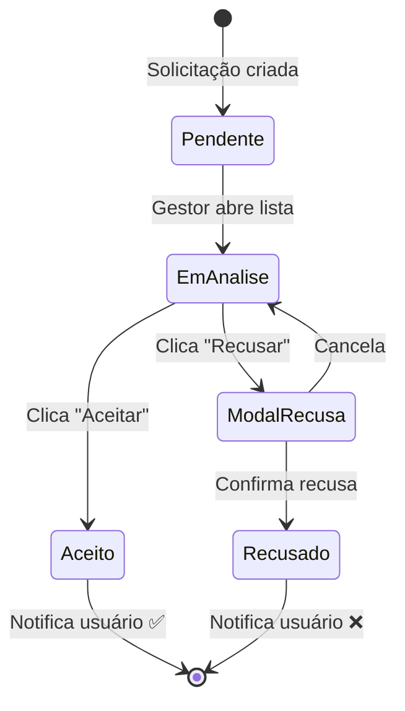
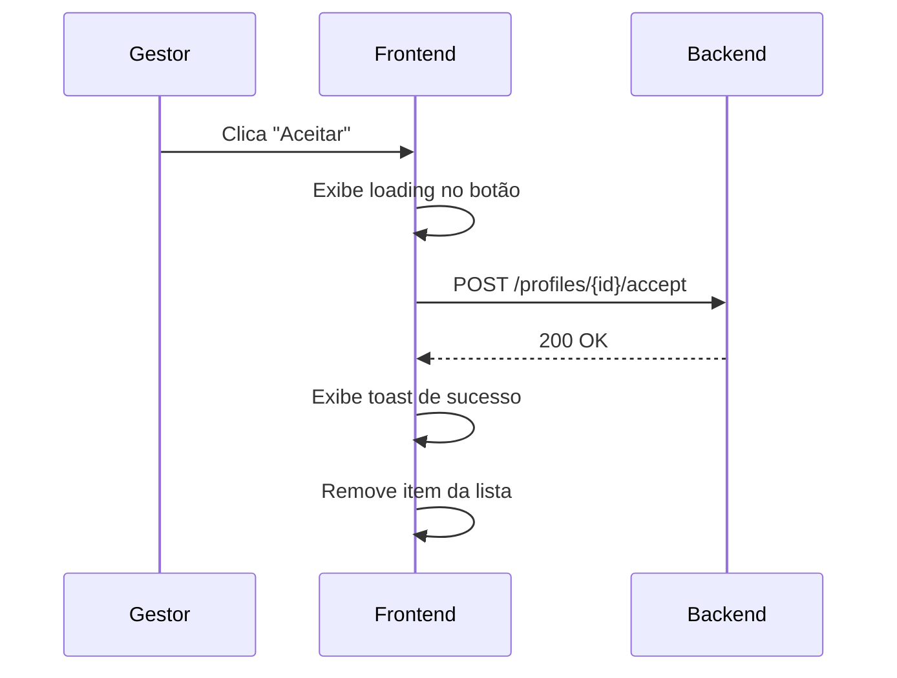
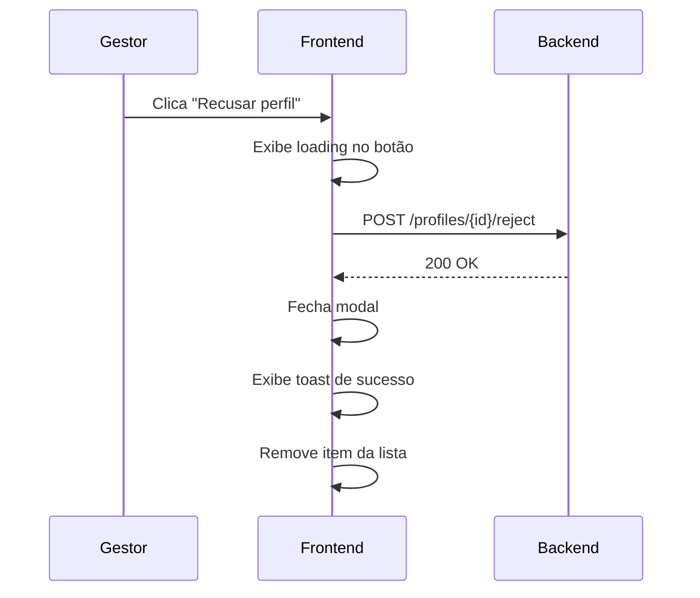

# Fluxo: Aceitar/Recusar Perfil

## Visão Geral

| Atributo | Valor |
|----------|-------|
| **ID** | FLX-001 |
| **Persona** | [Gestor/Admin](../personas/gestor) |
| **Frequência** | Diária |
| **Prioridade** | 🔴 Alta |
| **Status** | ✅ Documentado |

---

## Contexto

### Gatilho
Um novo usuário (professor ou responsável) solicita acesso à plataforma vinculado a uma escola.

### Pré-condições
- Usuário completou cadastro
- Escola está ativa no sistema
- Gestor tem permissão de aprovação

### Resultado Esperado
- **Aceitar**: Usuário ganha acesso e é notificado
- **Recusar**: Solicitação é arquivada, usuário notificado do motivo

---

## Diagrama de Estados



---

## Fluxo Detalhado

### 1. Lista de Perfis Pendentes

O gestor acessa a lista de perfis aguardando aprovação.

**Informações exibidas:**
- Nome do solicitante
- Tipo de perfil (Professor, Responsável)
- Escola vinculada
- Data da solicitação

**Ações disponíveis:**
- ✅ Aceitar perfil
- ❌ Recusar perfil
- 👁️ Ver detalhes

---

### 2. Modal de Confirmação - Aceitar

Ao clicar em "Aceitar", exibe confirmação simples:

```
✅ Confirmar aprovação?

Perfil: Professor
Nome: Maria Silva
Escola: Escola Devs

[Cancelar] [Aceitar perfil]
```

---

### 3. Modal de Confirmação - Recusar

Ao clicar em "Recusar", exibe modal de confirmação com destaque de ação destrutiva:


#### Anatomia do Modal

| Elemento | Descrição | Componente |
|----------|-----------|------------|
| Ícone | Triângulo de alerta laranja | `warning-icon` |
| Título | "Deseja **recusar** esse perfil?" | `modal-title` com `text-danger` |
| Info | Perfil + Escola | `profile-info` |
| Ação secundária | "Cancelar" | `btn-outline-danger` |
| Ação primária | "Recusar perfil" | `btn-danger` |

#### Código do Componente

```html
<!-- HTML/Vanilla -->
<div class="modal-container">
  <span class="warning-icon">⚠️</span>
  <h1 class="modal-title">
    Deseja <span class="text-danger">recusar</span> esse perfil?
  </h1>
  <div class="profile-info">
    <p>Perfil: <span class="text-primary">Professor</span></p>
    <p>Escola: <span class="text-primary">Escola Devs</span></p>
  </div>
  <div class="actions-container">
    <button class="btn btn-outline-danger" onclick="onCancel()">Cancelar</button>
    <button class="btn btn-danger" onclick="onReject()">Recusar perfil</button>
  </div>
</div>
```

**Referência Storybook:** [AcceptOrRejectAccess → Recusar Perfil](https://fabioeducacross.github.io/DesignSystem-Vuexy/?path=/story/front-office-modals-acceptorrejectaccess--recusar-perfil)

---

## Regras de Negócio

| Regra | Descrição | Validação |
|-------|-----------|-----------|
| RN-001 | Apenas gestores podem aprovar/recusar | Backend valida role |
| RN-002 | Não pode aprovar perfil de escola diferente | Filtro por `institutionId` |
| RN-003 | Recusa deve ter motivo (futuro) | Campo obrigatório |
| RN-004 | Usuário recusado pode solicitar novamente após 30 dias | `cooldownPeriod` |

---

## Estados de Loading

### Aceitar Perfil (Loading)



### Recusar Perfil (Loading)



**Referência Storybook:** [AcceptOrRejectAccess → Recusar Perfil (Loading)](https://fabioeducacross.github.io/DesignSystem-Vuexy/?path=/story/front-office-modals-acceptorrejectaccess--recusar-perfil-loading)

---

## API

### Aceitar Perfil

```http
POST /api/v1/profiles/{profileId}/accept
Authorization: Bearer {token}

Response: 200 OK
{
  "success": true,
  "message": "Perfil aprovado com sucesso"
}
```

### Recusar Perfil

```http
POST /api/v1/profiles/{profileId}/reject
Authorization: Bearer {token}
Content-Type: application/json

{
  "reason": "Dados incompletos" // futuro
}

Response: 200 OK
{
  "success": true,
  "message": "Perfil recusado"
}
```

---

## Oportunidades de Melhoria (TO-BE)

1. **Campo de motivo obrigatório** — Registrar por que recusou
2. **Aprovação em lote** — Selecionar múltiplos e aprovar de uma vez
3. **Filtros avançados** — Por escola, data, tipo de perfil
4. **Notificação push** — Alertar gestor de pendências > 24h
5. **Auditoria** — Log de quem aprovou/recusou e quando

---

## Componentes Relacionados

| Componente | Storybook | Uso |
|------------|-----------|-----|
| Modal AcceptOrReject | [Link](https://fabioeducacross.github.io/DesignSystem-Vuexy/?path=/docs/front-office-modals-acceptorrejectaccess--documentation) | Container do fluxo |
| Button Danger | [Link](https://fabioeducacross.github.io/DesignSystem-Vuexy/?path=/docs/vuexy-atoms-buttons--docs) | Ação destrutiva |
| Toast | [Link](https://fabioeducacross.github.io/DesignSystem-Vuexy/) | Feedback de sucesso/erro |
| ListTable | [Link](https://fabioeducacross.github.io/DesignSystem-Vuexy/) | Lista de perfis pendentes |

---

## Referências

- [Persona: Gestor](../personas/gestor)
- [Jornadas Admin](../journeys/admin/)
- [Design System Completo](https://fabioeducacross.github.io/DesignSystem-Vuexy/)

