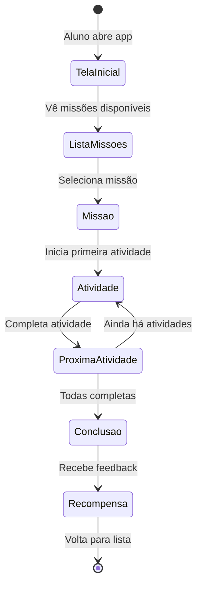

import { IconSparkle } from '@site/src/components/MaterialIcon';

import { PriorityHigh, StatusPlanned } from '@site/src/components/StatusIcons';

# Fluxo: Completar Missão

## Visão Geral

| Atributo | Valor |
|----------|-------|
| **ID** | FLX-003 |
| **Persona** | [Aluno](../personas/aluno) |
| **Frequência** | Diária |
| **Prioridade** | <PriorityHigh /> |
| **Status** | <StatusPlanned /> |

---

## Contexto

### Gatilho
Aluno deseja realizar uma missão disponibilizada pelo professor.

### Pré-condições
- Aluno logado
- Missão habilitada pelo professor
- Dispositivo compatível (tablet, celular, computador)

### Resultado Esperado
- Aluno completa atividades da missão
- Progresso é registrado
- Recompensas são entregues

---

## Diagrama de Estados

---

## Elementos de Gamificação

| Momento | Elemento | Feedback |
|---------|----------|----------|
| Início | Animação de entrada | "Vamos lá!" |
| Acerto | Som + visual | <IconSparkle /> +10 pontos |
| Erro | Feedback gentil | "Tente de novo!" |
| Conclusão | Celebração | 🎉 Confetti + medalha |

---

## Próximos Passos

- Capturar screenshots do fluxo atual
- Documentar componentes de gamificação
- Mapear pontos de melhoria de UX

---

## Referências

- [Persona: Aluno](../personas/aluno)
- [Jornadas do Estudante](../journeys/student/)

