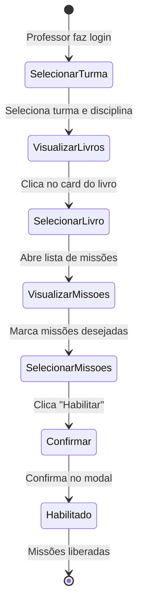

import { PriorityHigh, StatusProgress } from '@site/src/components/StatusIcons';

# Fluxo: Habilitar Missões

## Visão Geral

| Atributo | Valor |
|----------|-------|
| **ID** | FLX-002 |
| **Persona** | [Professor](../personas/professor) |
| **Frequência** | Diária |
| **Prioridade** | <PriorityHigh /> |
| **Status** | <StatusProgress /> |

---

## Contexto

### Gatilho
Professor deseja liberar missões de um livro para que os alunos possam realizá-las.

### Pré-condições
- Professor logado e vinculado a uma turma
- Livro disponível no sistema de ensino da escola
- Missões existem no livro selecionado

### Resultado Esperado
- Missões ficam visíveis e acessíveis para os alunos da turma
- Professor pode acompanhar o progresso

---

## Diagrama de Estados



---

## Fluxo Detalhado

### 1. Visualizar Livros do Sistema

Professor acessa a tela de livros do sistema de ensino.

**Filtros disponíveis:**
- Turma
- Disciplina
- Sistema de ensino

**Informações por livro:**
- Capa/thumbnail
- Título
- Quantidade de missões
- Progresso da turma

---

### 2. Selecionar Missões

Ao clicar no livro, abre a lista de missões.

**Informações por missão:**
- Nome da missão
- Tipo (leitura, quiz, atividade)
- Status (habilitada/não habilitada)
- Progresso da turma (se habilitada)

**Ações:**
- Checkbox para selecionar missões
- Botão "Habilitar selecionadas"
- Botão "Habilitar todas"

---

### 3. Modal de Confirmação

```
Habilitar missões?

Você está prestes a habilitar 5 missões para a turma 4º Ano A.

[Cancelar] [Confirmar]
```

---

## Regras de Negócio

### Regras de acesso e visibilidade

| Regra | Descrição |
|-------|-----------|
| RN-001 | Professor só pode habilitar missões de turmas que leciona |
| RN-002 | Alunos só veem missões habilitadas/enviadas para sua turma |
| RN-003 | Livro e missão precisam pertencer ao sistema de ensino ativo da escola/turma |
| RN-004 | `N` da coluna Alunos representa o total real da turma no momento da consulta |

### Regras de status da missão (lista por turma)

| Regra | Descrição |
|-------|-----------|
| RN-005 | Estado inicial da missão é **Não enviada** (`#FFB443`) |
| RN-006 | Após primeiro clique de habilitar, missão evolui para **Iniciada** (`#8BC728`) ou **Não iniciada** (`#FFB443`) conforme período |
| RN-007 | Missão em **Finalizada** (`#7F6CC3`) pode iniciar novo ciclo de envio |
| RN-008 | Colunas Início/Fim exibem `-` quando não houver período definido |

### Regras de ações (Enviar/Pausar)

| Regra | Descrição |
|-------|-----------|
| RN-009 | Após habilitar, ações disponíveis são **Enviar** (vincular) e **Pausar** (desvincular) |
| RN-010 | Botão **Enviar** só habilita quando existir ao menos 1 aluno elegível para envio |
| RN-011 | Botão **Pausar** só habilita quando existir ao menos 1 aluno elegível para pausa |
| RN-012 | Botões desabilitados exibem tooltip: "Não há alunos para enviar" / "Não há alunos para pausar" |

### Regras do drawer lateral (operação em lote)

| Regra | Descrição |
|-------|-----------|
| RN-013 | Drawer abre em modo único por ação: `send` (Enviar) ou `pause` (Pausar) |
| RN-014 | Modo `send` lista apenas alunos não vinculados; modo `pause` lista apenas vinculados |
| RN-015 | Filtro por nome atua em tempo real sobre a lista elegível do modo atual |
| RN-016 | Checkbox de cabeçalho seleciona todos os alunos elegíveis atualmente visíveis (respeita filtro) |
| RN-017 | Botão de confirmação do drawer habilita somente com ao menos 1 aluno selecionado e elegível |
| RN-018 | Alterações em lote atualizam imediatamente `X de N`, status e ações na linha da missão |

### Regras de período

| Regra | Descrição |
|-------|-----------|
| RN-019 | Opção **Definir período** exibe campo de data fim no drawer |
| RN-020 | Data fim é obrigatória quando Definir período estiver marcado |
| RN-021 | Data início pode ser definida como data de envio/habilitação (regra default) |
| RN-022 | Se período ainda não iniciou, status visual esperado é **Não iniciada** |

---

## Oportunidades de Melhoria (TO-BE)

1. **Ações rápidas no card** — Habilitar direto do grid de livros
2. **Habilitação em lote** — Selecionar múltiplos livros/missões
3. **Agendamento** — Definir data/hora para liberar missão
4. **Templates** — Salvar configurações de habilitação favoritas

---

## Referências

- [Persona: Professor](../personas/professor)
- [Jornada: Education System Books](../journeys/teacher/education-system-books)
- [Protótipo: Missions V2](../prototypes/)

