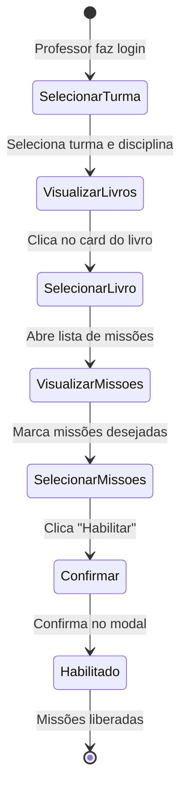

import { PriorityHigh, StatusProgress } from '@site/src/components/StatusIcons';

# Fluxo: Habilitar Missões

## Visão Geral

| Atributo | Valor |
|----------|-------|
| **ID** | FLX-002 |
| **Persona** | [Professor](../personas/professor) |
| **Frequência** | Diária |
| **Prioridade** | <PriorityHigh /> |
| **Status** | <StatusProgress /> |

---

## Contexto

### Gatilho
Professor deseja liberar missões de um livro para que os alunos possam realizá-las.

### Pré-condições
- Professor logado e vinculado a uma turma
- Livro disponível no sistema de ensino da escola
- Missões existem no livro selecionado

### Resultado Esperado
- Missões ficam visíveis e acessíveis para os alunos da turma
- Professor pode acompanhar o progresso

---

## Diagrama de Estados



---

## Fluxo Detalhado

### 1. Visualizar Livros do Sistema

Professor acessa a tela de livros do sistema de ensino.

**Filtros disponíveis:**
- Turma
- Disciplina
- Sistema de ensino

**Informações por livro:**
- Capa/thumbnail
- Título
- Quantidade de missões
- Progresso da turma

---

### 2. Selecionar Missões

Ao clicar no livro, abre a lista de missões.

**Informações por missão:**
- Nome da missão
- Tipo (leitura, quiz, atividade)
- Status (habilitada/não habilitada)
- Progresso da turma (se habilitada)

**Ações:**
- Checkbox para selecionar missões
- Botão "Habilitar selecionadas"
- Botão "Habilitar todas"

---

### 3. Modal de Confirmação

```
Habilitar missões?

Você está prestes a habilitar 5 missões para a turma 4º Ano A.

[Cancelar] [Confirmar]
```

---

## Regras de Negócio

| Regra | Descrição |
|-------|-----------|
| RN-001 | Professor só pode habilitar missões de turmas que leciona |
| RN-002 | Missão já habilitada não pode ser "desabilitada" |
| RN-003 | Alunos só veem missões habilitadas |
| RN-004 | Progresso é zerado se missão for habilitada novamente (futuro) |

---

## Oportunidades de Melhoria (TO-BE)

1. **Ações rápidas no card** — Habilitar direto do grid de livros
2. **Habilitação em lote** — Selecionar múltiplos livros/missões
3. **Agendamento** — Definir data/hora para liberar missão
4. **Templates** — Salvar configurações de habilitação favoritas

---

## Referências

- [Persona: Professor](../personas/professor)
- [Jornada: Education System Books](../journeys/teacher/education-system-books)
- [Protótipo: Missions V2](../prototypes/)

