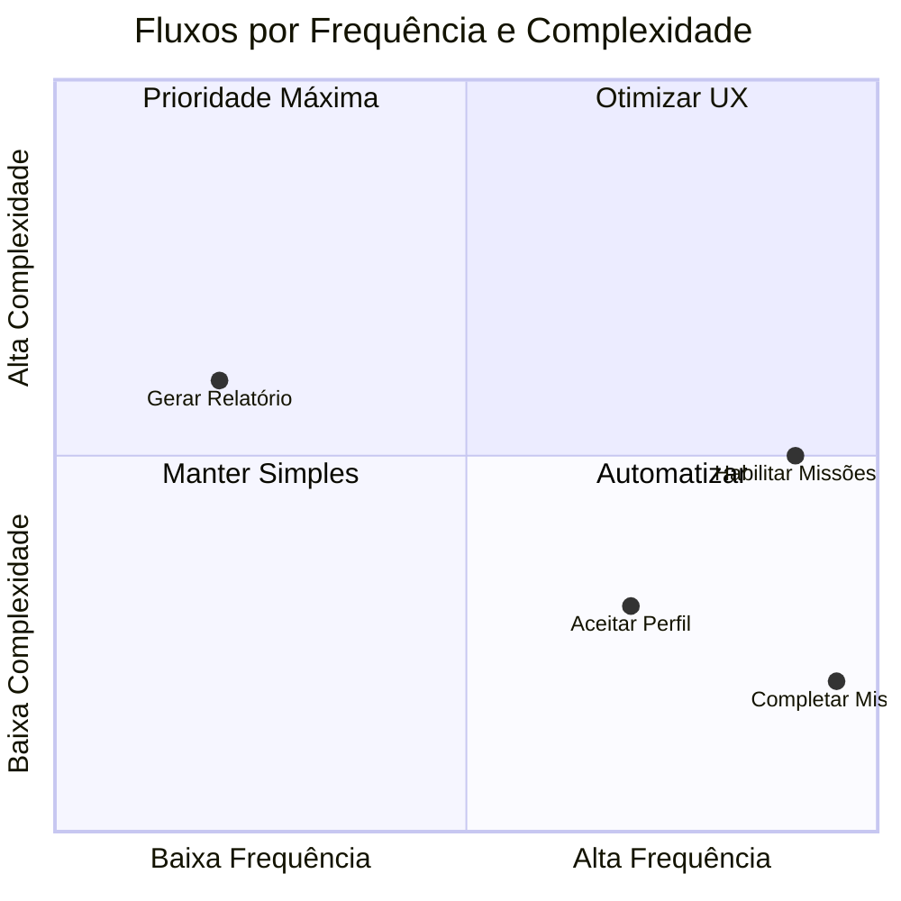
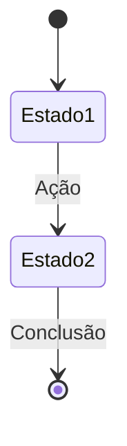

import { IconCircleRed, IconCircleYellow, IconCheck, IconConstruction, IconClipboard, StatusDone, StatusProgress, StatusPlanned, PriorityHigh, PriorityMedium } from '@site/src/components/StatusIcons';

# Fluxos Críticos

Esta seção documenta os fluxos de usuário mais importantes da plataforma, com foco em:

- **Contexto** — Quando e por que o fluxo acontece
- **Atores** — Quem participa do fluxo
- **Estados** — Telas e transições
- **Regras de negócio** — Validações e condições
- **Evidências visuais** — Screenshots e protótipos

---

## Lista de Fluxos

| ID | Fluxo | Persona | Prioridade | Status |
|----|-------|---------|------------|--------|
| FLX-001 | [Aceitar/Recusar Perfil](./aceitar-recusar-perfil) | Gestor | <PriorityHigh /> | <StatusDone /> |
| FLX-002 | [Habilitar Missões](./habilitar-missoes) | Professor | <PriorityHigh /> | <StatusProgress /> |
| FLX-003 | [Completar Missão](./completar-missao) | Aluno | <PriorityHigh /> | <StatusPlanned /> |
| FLX-004 | [Gerar Relatório](./gerar-relatorio) | Gestor/Professor | <PriorityMedium /> | <StatusPlanned /> |

---

## Matriz Fluxo × Persona

---

## Estrutura de Documentação

Cada fluxo segue este template:

### 1. Contexto
- Gatilho: O que inicia o fluxo
- Pré-condições: O que precisa estar pronto
- Resultado esperado: O que muda após o fluxo

### 2. Diagrama de Estados

### 3. Telas e Componentes
- Screenshots AS-IS (estado atual)
- Componentes utilizados (links para Storybook)
- Mockups TO-BE (melhorias propostas)

### 4. Regras de Negócio
- Validações
- Mensagens de erro
- Casos de borda

### 5. API
- Endpoints envolvidos
- Payloads de exemplo
- Códigos de resposta

---

## Próximos Passos

- Documentar [Fluxo de Habilitar Missões](./habilitar-missoes)
- Capturar screenshots reais do ambiente de produção
- Validar fluxos com usuários reais

