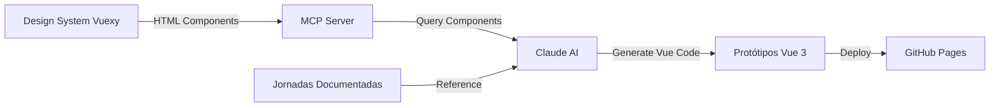

import {
  IconBookOpen,
  IconBooks,
  IconCheck,
  IconLink,
  IconPalette,
  IconRocket,
  IconTarget
} from '@site/src/components/MaterialIcon';

# Ambiente de Prototipação V5

Bem-vindo ao **Ambiente de Prototipação V5** - a documentação oficial para jornadas educacionais e design system da Educacross.

## <IconTarget /> Objetivo

Este ambiente foi criado para:

- **Documentar** 50+ jornadas de usuário do sistema Educacross
- **Prototipar** novas funcionalidades usando Vue 3 + Design System Vuexy
- **Catalogar** componentes do Design System HTML-based
- **Integrar** via MCP (Model Context Protocol) para desenvolvimento assistido por IA

## 🏗️ Arquitetura

### Tecnologias

- **Frontend**: Vue 3 + Vite
- **Documentação**: Docusaurus 3
- **Design System**: Vuexy (HTML-based, framework-agnostic)
- **IA**: Claude Sonnet 4.5 / Opus 4.5
- **Integração**: Model Context Protocol (MCP)

## <IconBooks /> Estrutura da Documentação

Esta documentação está organizada em seções:

### [Começar](/docs/getting-started/intro)
Guias de instalação e configuração do ambiente.

### [Jornadas](/docs/journeys)
Documentação completa de todas as jornadas de usuário (AS-IS e TO-BE).

### [Protótipos](/docs/prototypes)
Instruções para criar e testar protótipos interativos.

### [Design System](https://fabioeducacross.github.io/DesignSystem-Vuexy)
Catálogo de componentes Vuexy (link externo ao Storybook).

## <IconPalette /> Design System Vuexy

O Design System utilizado é baseado no template Vuexy, renderizado como **HTML puro** no Storybook:

- <IconCheck /> Framework-agnostic (funciona com Vue, React, Angular, etc.)
- <IconCheck /> Componentes HTML + CSS + JavaScript vanilla
- <IconCheck /> Paleta de cores customizada:
  - **Primary**: `#7367F0` (roxo)
  - **Success**: `#28C76F` (verde)
  - **Warning**: `#FF9F43` (laranja)
  - **Danger**: `#EA5455` (vermelho)
  - **Info**: `#00CFE8` (ciano)

Acesse o Storybook: https://fabioeducacross.github.io/DesignSystem-Vuexy

## <IconRocket /> Workflow de Desenvolvimento

Como **vibecoder designer**, você trabalha com Claude AI para gerar código:

1. **Descrever** a funcionalidade desejada em português
2. **Claude gera** código Vue 3 usando componentes do DS
3. **Revisar visualmente** o resultado no navegador
4. **Iterar** até atingir o resultado esperado

Não é necessário entender Vue ou React - o Claude cuida do código!

## <IconLink /> Links Úteis

- [Repositório GitHub](https://github.com/fabioeducacross/Ambiente_de_Prototipacao_V5)
- [Design System Storybook](https://fabioeducacross.github.io/DesignSystem-Vuexy)
- [Educacross](https://educacross.com.br)

## <IconBookOpen /> Próximos Passos

1. Explore a [lista de jornadas](/docs/journeys)
2. Veja o [template de jornada](/docs/templates/journey-template)
3. Aprenda a criar protótipos (documentação em breve)
4. Configure o [ambiente de desenvolvimento](/docs/getting-started/setup)
