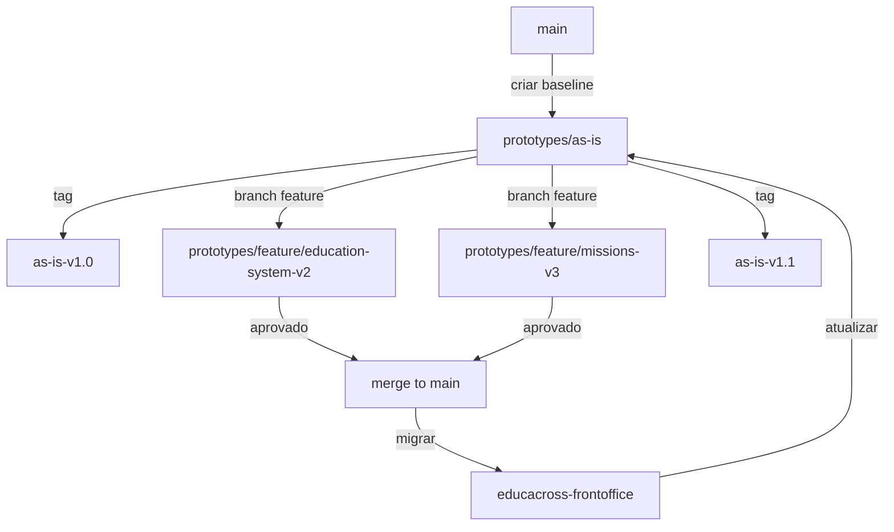

import {
  IconBooks,
  IconChart,
  IconCheck,
  IconEdit,
  IconLink,
  IconRefresh,
  IconRocket,
  IconTarget
} from '@site/src/components/MaterialIcon';


# Workflow de Prototipação

Metodologia completa para criar protótipos validados com Git branches e deploy automatizado.

## <IconTarget /> Objetivos

1. **Documentar AS-IS** - Capturar estado atual das jornadas
2. **Criar Baseline** - Branch `prototypes/as-is` com réplicas funcionais
3. **Prototipar TO-BE** - Branches de feature com melhorias propostas
4. **Validar** - Deploy preview em Vercel para testes
5. **Migrar** - Código aprovado volta para educacross-frontoffice

## <span class="material-symbols-outlined">construction</span> Estratégia de Git Branches



### Estrutura de Branches

| Branch | Propósito | Base | Deploy |
|--------|-----------|------|--------|
| `main` | Código atual do protótipo | - | GitHub Pages |
| `prototypes/as-is` | Baseline - Réplica das telas produção | `main` | Manual |
| `prototypes/feature/*` | Protótipos de melhorias | `prototypes/as-is` | Vercel Preview |

## <IconRefresh /> Fluxo de Trabalho Completo

### Fase 1: Documentar AS-IS

**Objetivo**: Capturar estado atual no Docusaurus

```bash
# 1. Analisar rota no educacross-frontoffice
cd educacross-frontoffice
cat src/router/professor-routes.js | grep "education-system"

# 2. Localizar componente
code src/views/pages/teacher-context/educationSystem/books/Index.vue

# 3. Documentar no template
cd ../Ambiente_de_Prototipacao_V5
cp documentation/docs/templates/journey-template.md \
   documentation/docs/journeys/teacher/education-system-books.md

# 4. Preencher template
# - Fluxograma AS-IS
# - Pontos de dor
# - Screenshots (Playwright)
```

### Fase 2: Criar Baseline AS-IS

**Objetivo**: Branch com réplica funcional das telas atuais

```bash
# 1. Criar branch baseline
git checkout -b prototypes/as-is

# 2. Desenvolver réplica da tela
npm run dev
# Abrir http://localhost:5173
# Criar src/views/teacher/EducationSystemBooks.vue

# 3. Replicar funcionalidade básica
# - Layout 2 colunas
# - Lista de livros
# - Filtros de classe/disciplina
# - Navegação básica

# 4. Commit e tag
git add .
git commit -m "proto: create as-is baseline for education-system-books"
git tag as-is-v1.0
git push origin prototypes/as-is --tags
```

### Fase 3: Prototipar TO-BE

**Objetivo**: Branch de feature com melhorias propostas

```bash
# 1. Criar branch feature
git checkout prototypes/as-is
git checkout -b prototypes/feature/education-system-v2

# 2. Implementar melhorias
# Exemplo: Wizard de seleção de livros
npm run dev

# 3. Desenvolver protótipo
# - Adicionar wizard multi-step
# - Melhorar UX de filtros
# - Cards com preview
# - Animações de transição

# 4. Commit incremental
git add .
git commit -m "proto(education-system): add multi-step wizard for book selection"

# 5. Push para Vercel deploy
git push origin prototypes/feature/education-system-v2
# Vercel automaticamente cria preview URL
```

### Fase 4: Validar com Stakeholders

**Objetivo**: Testar protótipo com usuários e stakeholders

```bash
# 1. Obter preview URL
# https://ambiente-v5-git-education-system-v2.vercel.app

# 2. Compartilhar para feedback
# - Enviar link para professores testarem
# - Coletar feedback via formulário
# - Anotar pontos de dor encontrados

# 3. Iterar com base no feedback
git checkout prototypes/feature/education-system-v2
# Fazer ajustes
git commit -m "proto(education-system): adjust wizard based on feedback"
git push
```

### Fase 5: Aprovar e Migrar

**Objetivo**: Migrar código aprovado para produção

```bash
# 1. Merge para main
git checkout main
git merge prototypes/feature/education-system-v2 --squash
git commit -m "feat(education-system): implement v2 wizard flow"
git push origin main

# 2. Migrar para educacross-frontoffice
cd ../educacross-frontoffice
# Copiar componentes e adaptar para Vue 2.7
# Testar em ambiente de homologação

# 3. Após deploy em produção, atualizar baseline
cd ../Ambiente_de_Prototipacao_V5
git checkout prototypes/as-is
# Atualizar protótipo AS-IS com nova versão
git tag as-is-v1.1
git push --tags

# 4. Atualizar documentação
# Atualizar docs/journeys/teacher/education-system-books.md
# com novo fluxo AS-IS
```

## <IconRocket /> Deploy Automatizado

### Vercel Setup

**Configuração inicial:**

1. Conectar repositório ao Vercel
2. Configurar build settings:

```json
{
  "buildCommand": "npm run build",
  "outputDirectory": "dist",
  "framework": "vite"
}
```

3. Configurar branches:
   - `main` → Production (GitHub Pages)
   - `prototypes/*` → Preview Deployments

### Preview URLs

Cada branch de feature gera automaticamente:

```
https://ambiente-v5-git-[branch-name]-educacross.vercel.app
```

**Exemplos:**
- `prototypes/feature/education-system-v2` → 
  `https://ambiente-v5-git-education-system-v2-educacross.vercel.app`
- `prototypes/feature/missions-v3` →
  `https://ambiente-v5-git-missions-v3-educacross.vercel.app`

## <IconEdit /> Convenções de Commit

### Pattern

```
<tipo>(<escopo>): <descrição>

[corpo opcional]

[footer opcional]
```

### Tipos

- `proto:` - Criação/atualização de protótipos
- `docs:` - Documentação AS-IS/TO-BE
- `feat:` - Nova feature (após aprovação)
- `fix:` - Correção de bug
- `refactor:` - Refatoração de código
- `test:` - Adição de testes
- `chore:` - Tarefas de manutenção

### Exemplos

```bash
# Baseline AS-IS
git commit -m "proto: create as-is baseline v1.0"

# Feature prototype
git commit -m "proto(education-system): add wizard for book selection"

# Documentação
git commit -m "docs(journeys): document education-system-books as-is flow"

# Ajuste pós-feedback
git commit -m "proto(missions): improve filter UX based on teacher feedback"

# Aprovação e migração
git commit -m "feat(education-system): implement v2 wizard flow

Migrated from prototype branch prototypes/feature/education-system-v2.
Tested with 10 teachers, 95% approval rate.

Closes #42"
```

## <span class="material-symbols-outlined">science</span> Testando Protótipos

### Testes Locais

```bash
# Dev server
npm run dev
# http://localhost:5173

# Build preview
npm run build
npm run preview
# http://localhost:4173
```

### Testes com Usuários

**Checklist:**
- [ ] Criar lista de tarefas para usuários executarem
- [ ] Gravar sessões (loom.com ou similar)
- [ ] Formulário de feedback pós-teste
- [ ] Métricas: tempo de conclusão, taxa de sucesso, NPS

**Template de Teste:**

```markdown
## Teste de Usabilidade - [Nome da Jornada]

**Protótipo**: [URL Vercel preview]
**Participante**: [Perfil do usuário]
**Data**: [YYYY-MM-DD]

### Tarefas
1. [ ] Acessar sistema educacional
2. [ ] Selecionar um livro de Matemática
3. [ ] Visualizar missões do livro
4. [ ] Avaliar clareza das instruções

### Observações
- [Anotar dificuldades encontradas]
- [Comentários espontâneos]
- [Sugestões de melhoria]

### Métricas
- Tempo de conclusão: [X minutos]
- Taxa de sucesso: [X%]
- NPS: [0-10]
```

## <IconChart /> Versionamento AS-IS

### Tags Semânticas

```bash
# Baseline inicial
git tag as-is-v1.0

# Pequenas atualizações (bugfixes)
git tag as-is-v1.1

# Mudanças funcionais (novas features migradas)
git tag as-is-v2.0

# Listar versões
git tag -l "as-is-*"
```

### Changelog

Manter arquivo `CHANGELOG.md` no branch `prototypes/as-is`:

```markdown
# Changelog - AS-IS Baseline

## [v1.1] - 2026-02-15
### Adicionado
- Wizard de seleção de livros (migrado de prototypes/feature/education-system-v2)

### Alterado
- Layout de filtros agora usa grid responsivo
- Cards de livros com hover effect

### Removido
- Filtro de "ano letivo" (substituído por seletor de período)

## [v1.0] - 2026-02-03
### Adicionado
- Baseline inicial com réplica das telas de produção
- Jornadas: education-system-books, custom-missions, class-management
```

## <IconLink /> Recursos

- [Git Branching Model](https://nvie.com/posts/a-successful-git-branching-model/)
- [Vercel Preview Deployments](https://vercel.com/docs/concepts/deployments/preview-deployments)
- [Conventional Commits](https://www.conventionalcommits.org/)
- [Semantic Versioning](https://semver.org/)

## <IconCheck /> Checklist de Protótipo Completo

Antes de considerar um protótipo pronto para validação:

### Desenvolvimento
- [ ] Branch criada a partir de `prototypes/as-is`
- [ ] Código segue padrões DDD (Index.vue + composable)
- [ ] Usa Design System Vuexy consistentemente
- [ ] Responsivo (mobile/tablet/desktop)
- [ ] Sem erros no console
- [ ] Build de produção bem-sucedido

### Documentação
- [ ] Jornada documentada em `/docs/journeys/`
- [ ] Fluxograma AS-IS atualizado
- [ ] Fluxograma TO-BE criado
- [ ] Pontos de dor listados
- [ ] Screenshots adicionados

### Deploy
- [ ] Push para GitHub
- [ ] Vercel preview URL gerada
- [ ] URL compartilhada com stakeholders
- [ ] Feedback coletado e documentado

### Qualidade
- [ ] Testado com pelo menos 3 usuários
- [ ] Taxa de sucesso > 80%
- [ ] NPS > 7
- [ ] Feedback positivo majoritário

## <span class="material-symbols-outlined">sos</span> Troubleshooting

### Branch não aparece no Vercel

```bash
# Verificar se branch foi pushed
git branch -r | grep prototypes/feature

# Force push se necessário
git push -f origin prototypes/feature/[nome]
```

### Conflitos ao merge

```bash
# Rebase antes de merge
git checkout prototypes/feature/[nome]
git rebase prototypes/as-is

# Resolver conflitos
git add .
git rebase --continue
```

### Build falha no Vercel

```bash
# Testar build localmente primeiro
npm run build

# Verificar logs no Vercel dashboard
# Geralmente: dependências faltando ou env vars
```

## <IconBooks /> Próximos Passos

1. Crie seu primeiro baseline: [Documentação AS-IS](/docs/journeys)
2. Experimente o workflow: [Criar protótipo](/docs/prototypes)
3. Configure Vercel: [Guia de Deploy](/docs/getting-started/setup#deploy)
