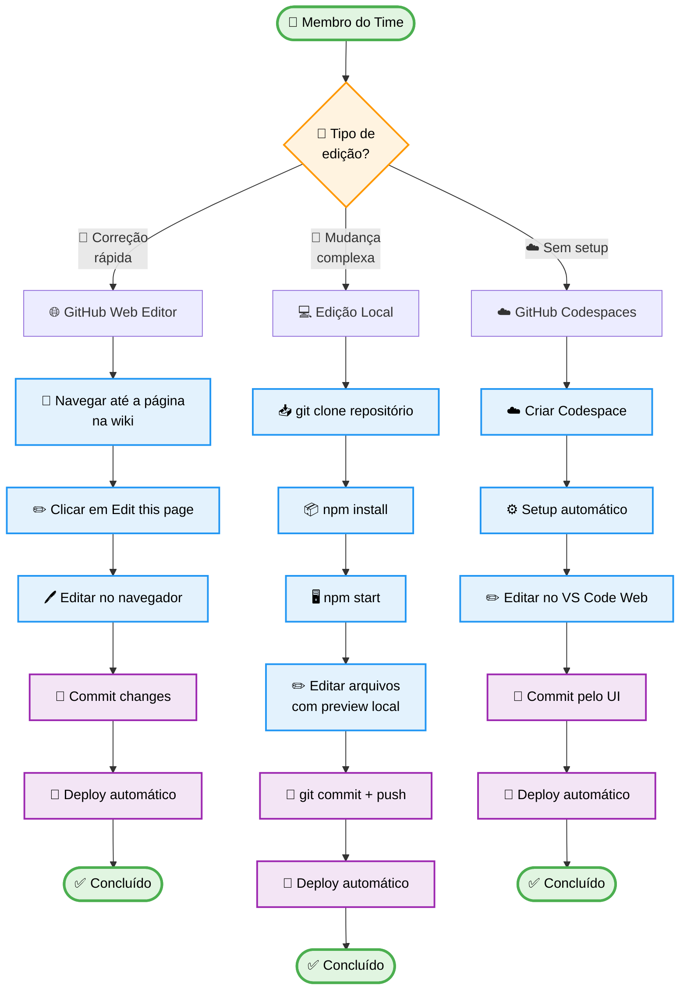
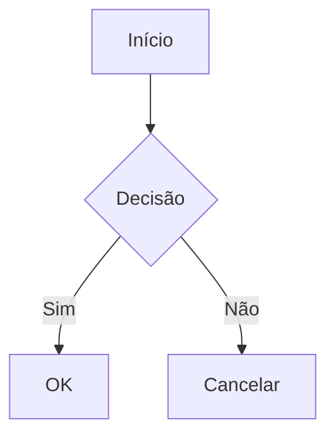

# 📝 Como Editar a Documentação

Este guia mostra as diferentes formas de editar a documentação do Ambiente de Prototipação.

## 🗺️ Fluxo de Edição



## 🚀 Método 1: Edição Direta no GitHub (Mais Fácil)

**Ideal para:** Correções rápidas, ajustes de texto, atualização de informações

### Passo a Passo

1. **Navegue até a página** que deseja editar na wiki
2. **Role até o final** da página
3. **Clique no botão** <kbd>✏️ Edit this page</kbd>
4. Você será redirecionado para o **GitHub Web Editor**
5. **Faça as alterações** diretamente no editor online
6. **Adicione uma mensagem** de commit descritiva:
   ```
   docs: atualiza jornada PROF-001 com novos pain points
   ```
7. **Escolha uma opção:**
   - ✅ **"Commit directly to main"** - Para mudanças pequenas e diretas
   - 🔀 **"Create a new branch and start a pull request"** - Para mudanças que precisam revisão

8. Clique em **"Commit changes"**

### Vantagens ✨

- ✅ Não precisa clonar repositório
- ✅ Não precisa instalar nada
- ✅ Edição visual com preview
- ✅ Funciona direto no navegador

### Quando Usar

- Corrigir typos e erros de português
- Atualizar informações de status
- Adicionar novos pain points
- Ajustar métricas e KPIs
- Atualizar links e referências

---

## 💻 Método 2: Edição Local (Para Mudanças Complexas)

**Ideal para:** Adicionar novas jornadas, reestruturar documentos, testar diagramas Mermaid

### Pré-requisitos

- Git instalado
- Node.js 18+ instalado
- VS Code (recomendado)

### Passo a Passo

1. **Clone o repositório**
   ```bash
   git clone https://github.com/fabioeducacross/Ambiente_de_Prototipacao_V5.git
   cd Ambiente_de_Prototipacao_V5/documentation
   ```

2. **Instale as dependências**
   ```bash
   npm install
   ```

3. **Inicie o servidor de desenvolvimento**
   ```bash
   npm start
   ```
   A documentação abrirá em `http://localhost:3000`

4. **Edite os arquivos** em `documentation/docs/`
   - Jornadas: `docs/journeys/`
   - Protótipos: `docs/prototypes/`
   - Guias: `docs/guides/`

5. **Visualize as mudanças** em tempo real no navegador

6. **Commit e push**
   ```bash
   git add .
   git commit -m "docs: adiciona jornada PROF-003"
   git push origin main
   ```

### Vantagens ✨

- ✅ Preview em tempo real
- ✅ Validação de Markdown
- ✅ Autocomplete no VS Code
- ✅ Teste de diagramas Mermaid
- ✅ Busca e replace em múltiplos arquivos

---

## 🎨 Método 3: GitHub Codespaces (Recomendado para Times)

**Ideal para:** Colaboração em tempo real, sem configuração local

### Passo a Passo

1. Acesse o repositório no GitHub
2. Clique em **Code** → **Codespaces** → **Create codespace on main**
3. Aguarde o ambiente inicializar
4. No terminal integrado, execute:
   ```bash
   cd documentation
   npm install
   npm start
   ```
5. Edite e visualize mudanças no navegador integrado
6. Commit pelo Source Control do VS Code Web

### Vantagens ✨

- ✅ Ambiente completo na nuvem
- ✅ Sem setup local
- ✅ Mesmo ambiente para todos
- ✅ 60 horas grátis/mês por usuário

---

## 📐 Guia de Sintaxe Markdown

### Cabeçalhos
```markdown
# H1 - Título Principal
## H2 - Seção
### H3 - Subseção
```

### Listas
```markdown
- Item não ordenado
- Outro item

1. Item ordenado
2. Segundo item
```

### Tabelas
```markdown
| Coluna 1 | Coluna 2 |
|----------|----------|
| Valor A  | Valor B  |
```

### Links
```markdown
[Texto do Link](https://exemplo.com)
[Link Interno](../outro-doc)
```

### Imagens
```markdown

```

### Alertas Coloridos
```markdown
:::tip Dica
Use isso para dicas úteis
:::

:::warning Atenção
Informações importantes
:::

:::danger Cuidado
Avisos críticos
:::

:::info Info
Informações adicionais
:::
```

### Código
````markdown
```javascript
const exemplo = 'código inline'
```
````

### Diagramas Mermaid
````markdown

````

---

## 🎯 Boas Práticas

### Mensagens de Commit

Use o padrão:
```
<tipo>: <descrição curta>

<descrição detalhada opcional>
```

**Tipos:**
- `docs:` - Alterações na documentação
- `feat:` - Nova jornada ou seção
- `fix:` - Correção de erro
- `style:` - Formatação, typos
- `refactor:` - Reestruturação sem mudar conteúdo

**Exemplos:**
```bash
docs: atualiza pain points da jornada PROF-001
feat: adiciona jornada PROF-005 de relatórios
fix: corrige links quebrados na seção de protótipos
```

### Estrutura de Arquivos

```
docs/
├── journeys/           # Jornadas de usuário
│   ├── teacher/        # Contexto Professor
│   ├── admin/          # Contexto Admin
│   └── student/        # Contexto Aluno
├── prototypes/         # Documentação de protótipos
├── guides/             # Guias como este
└── intro.md            # Página inicial
```

### Nomes de Arquivos

- Use **kebab-case**: `education-system-books.md`
- Não use espaços ou caracteres especiais
- Prefira nomes descritivos

### Diagramas Mermaid

- Use emojis para contexto visual: 🏠 📋 📚 👀 🤔 ⚙️
- Defina cores com `classDef`:
  ```mermaid
  classDef action fill:#e3f2fd,stroke:#2196f3
  class MeuNo action
  ```
- Quebre textos longos com `<br/>`

---

## 🆘 Problemas Comuns

### O diagrama Mermaid não aparece

**Causa:** Sintaxe incorreta
**Solução:** 
1. Verifique se há erro no console do navegador
2. Valide a sintaxe em [mermaid.live](https://mermaid.live)
3. Certifique-se que o bloco começa com ` ```mermaid `

### Imagem não carrega

**Causa:** Caminho incorreto
**Solução:**
- Imagens devem estar em `/documentation/static/img/`
- No Markdown, use `/img/nome.png` (sem `static/`)

### Mudanças não aparecem no site

**Causa:** Cache do navegador
**Solução:**
1. Hard refresh: <kbd>Ctrl</kbd> + <kbd>Shift</kbd> + <kbd>R</kbd>
2. Limpe o cache do Docusaurus: `npm run clear`

---

## 📞 Suporte

- **Dúvidas sobre Markdown:** [Guia Docusaurus](https://docusaurus.io/docs/markdown-features)
- **Diagramas Mermaid:** [Documentação Mermaid](https://mermaid.js.org/intro/)
- **Issues no GitHub:** [Criar Issue](https://github.com/fabioeducacross/Ambiente_de_Prototipacao_V5/issues/new)

---

**Última atualização:** 03/02/2026 | **Versão:** 1.0
