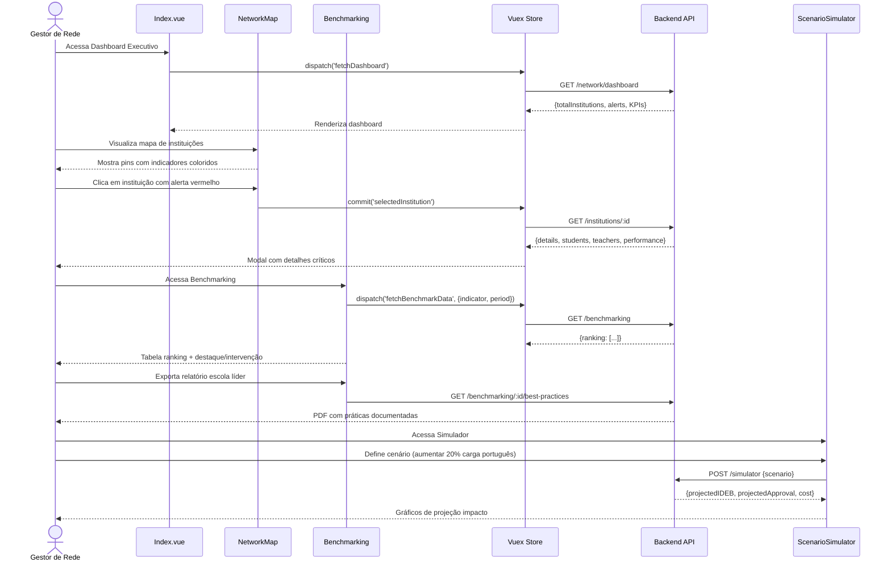

# ADMIN-005: Network Management (Gestão de Rede)

:::info Contexto
**Jornada**: Admin/Coordenação  
**Prioridade**: Baixa  
**Complexidade**: Alta  
**Status**: ✅ Documentado (AS-IS Baseline)
:::

## 1. Visão Geral

### Problema

Gestores de rede de ensino (secretarias municipais/estaduais, grupos educacionais) precisam configurar e gerenciar múltiplas instituições de forma centralizada, mas enfrentam dificuldades para ter visão consolidada de todas escolas da rede, configurar parâmetros pedagógicos padronizados entre instituições, redistribuir recursos (professores, alunos, materiais) entre escolas, monitorar indicadores de qualidade em tempo real, identificar instituições com desempenho crítico para intervenção, e garantir equidade de condições entre escolas da rede.

**Dores principais**:
- Falta de dashboard consolidado da rede com KPIs em tempo real
- Impossibilidade de padronizar calendário escolar, sistema de avaliação, currículo entre instituições
- Dificuldade para redistribuir professores entre escolas conforme demanda
- Ausência de alertas automáticos para instituições com indicadores críticos
- Falta de comparação benchmarking entre escolas da rede
- Impossibilidade de alocar recursos (materiais, tecnologias) de forma estratégica
- Dificuldade para documentar boas práticas e replicar entre instituições
- Ausência de ferramenta para audit trail de todas configurações e mudanças
- Falta de relatórios executivos consolidados para tomada de decisão
- Dificuldade para projetar cenários e simular impacto de decisões estratégicas

### Solução AS-IS

Sistema de gestão de rede com:
- **Dashboard Executivo** com KPIs consolidados de toda rede em tempo real
- **Mapa de Instituições** geográfico com indicadores por escola
- **Configuração Centralizada** de parâmetros pedagógicos (calendário, avaliação, currículo)
- **Gestão de Recursos Humanos** (alocação professores, coordenadores por instituição)
- **Alocação de Recursos Materiais** (equipamentos, materiais didáticos, tecnologias)
- **Sistema de Alertas** automáticos para indicadores críticos (evasão, desempenho)
- **Benchmarking entre Escolas** com rankings e identificação de outliers
- **Biblioteca de Boas Práticas** documentando casos de sucesso para replicação
- **Audit Trail Completo** rastreando todas configurações e mudanças
- **Simulador de Cenários** para projetar impacto de decisões estratégicas

## 2. Rotas e Navegação

```typescript
// src/router/admin-routes/network-management-routes.js
export default [
  {
    path: '/admin/network',
    name: 'admin-network',
    component: () => import('@/views/pages/admin-context/network/Index.vue'),
    meta: {
      resource: 'NetworkManagement',
      action: 'read',
      breadcrumb: [
        { text: 'Início', to: '/' },
        { text: 'Gestão de Rede', active: true }
      ]
    }
  },
  {
    path: '/admin/network/institutions',
    name: 'admin-institutions',
    component: () => import('@/views/pages/admin-context/network/Institutions.vue'),
    meta: {
      resource: 'NetworkManagement',
      action: 'read'
    }
  },
  {
    path: '/admin/network/institution/:institutionId',
    name: 'admin-institution-details',
    component: () => import('@/views/pages/admin-context/network/InstitutionDetails.vue'),
    meta: {
      resource: 'NetworkManagement',
      action: 'read'
    }
  },
  {
    path: '/admin/network/configuration',
    name: 'admin-network-config',
    component: () => import('@/views/pages/admin-context/network/Configuration.vue'),
    meta: {
      resource: 'NetworkManagement',
      action: 'write'
    }
  },
  {
    path: '/admin/network/resources',
    name: 'admin-resource-allocation',
    component: () => import('@/views/pages/admin-context/network/ResourceAllocation.vue'),
    meta: {
      resource: 'NetworkManagement',
      action: 'write'
    }
  },
  {
    path: '/admin/network/benchmarking',
    name: 'admin-benchmarking',
    component: () => import('@/views/pages/admin-context/network/Benchmarking.vue'),
    meta: {
      resource: 'NetworkManagement',
      action: 'read'
    }
  },
  {
    path: '/admin/network/simulator',
    name: 'admin-scenario-simulator',
    component: () => import('@/views/pages/admin-context/network/ScenarioSimulator.vue'),
    meta: {
      resource: 'NetworkManagement',
      action: 'read'
    }
  }
]
```

**Fluxo de navegação**:
1. Gestor de rede acessa Dashboard Executivo
2. Visualiza mapa com todas instituições e indicadores (aprovação, evasão, IDEB)
3. Clica em instituição específica → Vê detalhes completos (alunos, professores, turmas, desempenho)
4. Identifica escola com evasão alta (alerta vermelho) → Drilla para ver alunos em risco
5. Acessa "Configuração" → Define calendário escolar unificado para toda rede
6. Acessa "Recursos" → Realoca 3 professores de escola com ociosidade para escola com déficit
7. Acessa "Benchmarking" → Compara desempenho matemática entre escolas, identifica top 3
8. Exporta relatório executivo com práticas de escola líder para replicar
9. Acessa "Simulador" → Simula impacto de aumentar 20% carga horária português em toda rede
10. Dashboard atualiza projeções de IDEB em tempo real

## 3. Arquitetura de Componentes

### Estrutura de Pastas

```
src/views/pages/admin-context/network/
├── Index.vue                      # Dashboard executivo
├── Institutions.vue               # Lista de instituições
├── InstitutionDetails.vue         # Detalhes de instituição
├── Configuration.vue              # Configuração centralizada
├── ResourceAllocation.vue         # Alocação de recursos
├── Benchmarking.vue               # Benchmarking entre escolas
├── ScenarioSimulator.vue          # Simulador de cenários
├── useNetworkManagement.js        # Composable de domínio
├── components/
│   ├── NetworkMap.vue             # Mapa geográfico de instituições
│   ├── KPICard.vue                # Card de indicador consolidado
│   ├── InstitutionCard.vue        # Card de instituição
│   ├── AlertsPanel.vue            # Painel de alertas críticos
│   ├── ConfigurationForm.vue      # Formulário de configuração
│   ├── TeacherAllocation.vue      # Alocação de professores
│   ├── MaterialAllocation.vue     # Alocação de materiais
│   ├── BenchmarkTable.vue         # Tabela de benchmarking
│   ├── BestPracticeCard.vue       # Card de boa prática
│   ├── SimulatorControls.vue      # Controles do simulador
│   ├── ImpactProjection.vue       # Projeção de impacto
│   └── AuditTrail.vue             # Trilha de auditoria
└── charts/
    ├── NetworkOverview.vue        # Gráfico visão geral rede
    ├── InstitutionComparison.vue  # Comparação entre instituições
    ├── ResourceDistribution.vue   # Distribuição de recursos
    └── TrendAnalysis.vue          # Análise de tendências
```

### Responsabilidades dos Componentes

#### Index.vue (Dashboard Executivo)
```vue
<template>
  <section>
    <!-- Hero com Totalizadores -->
    <b-row class="mb-3">
      <b-col cols="12" md="3">
        <KPICard
          title="Instituições"
          :value="totalInstitutions"
          icon="school"
          variant="primary"
        />
      </b-col>
      <b-col cols="12" md="3">
        <KPICard
          title="Alunos"
          :value="totalStudents"
          icon="people"
          variant="success"
        />
      </b-col>
      <b-col cols="12" md="3">
        <KPICard
          title="Professores"
          :value="totalTeachers"
          icon="person"
          variant="info"
        />
      </b-col>
      <b-col cols="12" md="3">
        <KPICard
          title="Taxa Aprovação"
          :value="`${approvalRate}%`"
          icon="trending_up"
          :variant="approvalRate >= 90 ? 'success' : 'warning'"
          :badge="approvalRateTrend"
        />
      </b-col>
    </b-row>

    <!-- Alertas Críticos -->
    <AlertsPanel
      v-if="criticalAlerts.length > 0"
      :alerts="criticalAlerts"
      class="mb-3"
    />

    <!-- Mapa de Instituições -->
    <b-card class="mb-3">
      <h5 class="mb-3">Mapa da Rede</h5>
      <NetworkMap
        :institutions="institutions"
        :selected="selectedInstitution"
        @select="selectInstitution"
      />
    </b-card>

    <!-- Tabs -->
    <b-tabs content-class="mt-3" pills>
      <b-tab title="Visão Geral" active>
        <b-row>
          <!-- Gráfico de Visão Geral -->
          <b-col cols="12" md="8" class="mb-3">
            <b-card>
              <h6>Desempenho da Rede</h6>
              <NetworkOverview :data="networkData" />
            </b-card>
          </b-col>

          <!-- Top Instituições -->
          <b-col cols="12" md="4" class="mb-3">
            <b-card>
              <h6>Top 5 Instituições</h6>
              <b-list-group>
                <b-list-group-item
                  v-for="inst in topInstitutions"
                  :key="inst.id"
                  class="d-flex justify-content-between align-items-center"
                >
                  <div>
                    <strong>{{ inst.name }}</strong>
                    <br>
                    <small class="text-muted">{{ inst.city }}</small>
                  </div>
                  <b-badge variant="success">{{ inst.score }}</b-badge>
                </b-list-group-item>
              </b-list-group>
            </b-card>
          </b-col>
        </b-row>
      </b-tab>

      <b-tab title="Instituições" :badge="totalInstitutions">
        <Institutions />
      </b-tab>

      <b-tab title="Configuração">
        <Configuration />
      </b-tab>

      <b-tab title="Recursos">
        <ResourceAllocation />
      </b-tab>

      <b-tab title="Benchmarking">
        <Benchmarking />
      </b-tab>

      <b-tab title="Simulador">
        <ScenarioSimulator />
      </b-tab>

      <b-tab title="Auditoria">
        <AuditTrail />
      </b-tab>
    </b-tabs>
  </section>
</template>

<script>
import KPICard from './components/KPICard.vue'
import AlertsPanel from './components/AlertsPanel.vue'
import NetworkMap from './components/NetworkMap.vue'
import NetworkOverview from './charts/NetworkOverview.vue'
import Institutions from './Institutions.vue'
import Configuration from './Configuration.vue'
import ResourceAllocation from './ResourceAllocation.vue'
import Benchmarking from './Benchmarking.vue'
import ScenarioSimulator from './ScenarioSimulator.vue'
import AuditTrail from './components/AuditTrail.vue'
import store from '@/store'
import moduleNetwork from '@/store/pageModules/network/module-network-management.js'
import { defineComponent, computed, onMounted, onUnmounted } from '@vue/composition-api'
import useNetworkManagement from './useNetworkManagement.js'

export default defineComponent({
  name: 'NetworkManagementIndex',
  components: {
    KPICard,
    AlertsPanel,
    NetworkMap,
    NetworkOverview,
    Institutions,
    Configuration,
    ResourceAllocation,
    Benchmarking,
    ScenarioSimulator,
    AuditTrail
  },
  setup() {
    store.registerModule('networkManagement', moduleNetwork)

    const {
      totalInstitutions,
      totalStudents,
      totalTeachers,
      approvalRate,
      approvalRateTrend,
      criticalAlerts,
      institutions,
      networkData,
      topInstitutions,
      selectedInstitution
    } = useNetworkManagement()

    const selectInstitution = (institution) => {
      store.commit('networkManagement/selectedInstitution', institution)
    }

    onMounted(() => {
      store.dispatch('networkManagement/fetchDashboard')
      store.dispatch('networkManagement/fetchInstitutions')
    })

    onUnmounted(() => {
      store.commit('networkManagement/reset')
      store.unregisterModule('networkManagement')
    })

    return {
      totalInstitutions,
      totalStudents,
      totalTeachers,
      approvalRate,
      approvalRateTrend,
      criticalAlerts,
      institutions,
      networkData,
      topInstitutions,
      selectedInstitution,
      selectInstitution
    }
  }
})
</script>
```

#### Benchmarking.vue (Comparação entre Escolas)
```vue
<template>
  <div>
    <!-- Filtros -->
    <b-card class="mb-3">
      <b-row>
        <b-col cols="12" md="4">
          <b-form-group label="Indicador">
            <ESelect
              v-model="selectedIndicator"
              :options="indicators"
              label="name"
              track-by="id"
            />
          </b-form-group>
        </b-col>
        <b-col cols="12" md="4">
          <b-form-group label="Período">
            <ESelect
              v-model="selectedPeriod"
              :options="periods"
              label="name"
              track-by="id"
            />
          </b-form-group>
        </b-col>
        <b-col cols="12" md="4">
          <b-form-group label="Região">
            <ESelect
              v-model="selectedRegion"
              :options="regions"
              label="name"
              track-by="id"
            />
          </b-form-group>
        </b-col>
      </b-row>
    </b-card>

    <!-- Tabela de Benchmarking -->
    <b-card class="mb-3">
      <div class="d-flex justify-content-between align-items-center mb-3">
        <h5 class="mb-0">Ranking de Instituições</h5>
        <b-button variant="primary" @click="exportReport">
          <span class="material-symbols-outlined">download</span>
          Exportar
        </b-button>
      </div>

      <BenchmarkTable
        :data="benchmarkData"
        :indicator="selectedIndicator"
        :loading="loading"
      />
    </b-card>

    <!-- Análise de Outliers -->
    <b-row>
      <b-col cols="12" md="6" class="mb-3">
        <b-card>
          <h6 class="text-success">Destaque Positivo</h6>
          <InstitutionCard
            v-if="topPerformer"
            :institution="topPerformer"
            variant="success"
          />
          <BestPracticeCard
            v-if="topPerformer?.bestPractice"
            :practice="topPerformer.bestPractice"
            class="mt-3"
          />
        </b-card>
      </b-col>

      <b-col cols="12" md="6" class="mb-3">
        <b-card>
          <h6 class="text-danger">Necessita Intervenção</h6>
          <InstitutionCard
            v-if="lowPerformer"
            :institution="lowPerformer"
            variant="danger"
          />
          <div v-if="lowPerformer" class="mt-3">
            <b-button
              variant="outline-primary"
              block
              @click="createActionPlan(lowPerformer)"
            >
              <span class="material-symbols-outlined">assignment</span>
              Criar Plano de Ação
            </b-button>
          </div>
        </b-card>
      </b-col>
    </b-row>

    <!-- Gráfico de Comparação -->
    <b-card>
      <h6>Comparação Visual</h6>
      <InstitutionComparison :data="comparisonData" />
    </b-card>
  </div>
</template>

<script>
import ESelect from '@/components/selects/ESelect.vue'
import BenchmarkTable from './components/BenchmarkTable.vue'
import InstitutionCard from './components/InstitutionCard.vue'
import BestPracticeCard from './components/BestPracticeCard.vue'
import InstitutionComparison from './charts/InstitutionComparison.vue'
import useNetworkManagement from './useNetworkManagement.js'
import { ref } from '@vue/composition-api'

export default {
  components: {
    ESelect,
    BenchmarkTable,
    InstitutionCard,
    BestPracticeCard,
    InstitutionComparison
  },
  setup() {
    const {
      indicators,
      periods,
      regions,
      selectedIndicator,
      selectedPeriod,
      selectedRegion,
      benchmarkData,
      topPerformer,
      lowPerformer,
      comparisonData,
      loading
    } = useNetworkManagement()

    const exportReport = () => {
      // Exporta relatório de benchmarking
    }

    const createActionPlan = (institution) => {
      // Cria plano de ação para instituição
    }

    return {
      indicators,
      periods,
      regions,
      selectedIndicator,
      selectedPeriod,
      selectedRegion,
      benchmarkData,
      topPerformer,
      lowPerformer,
      comparisonData,
      loading,
      exportReport,
      createActionPlan
    }
  }
}
</script>
```

## 4. Módulo Vuex

```javascript
// src/store/pageModules/network/module-network-management.js
import {
  getDashboard,
  getInstitutions,
  getInstitutionDetails,
  getBenchmarkData,
  getConfiguration,
  getResourceAllocation,
  simulateScenario
} from '@/services/admin-context/NetworkManagementService'

export default {
  namespaced: true,
  
  state: {
    dashboard: null,
    institutions: [],
    selectedInstitution: null,
    benchmarkData: [],
    configuration: null,
    resources: [],
    alerts: [],
    auditLog: [],
    loading: false
  },

  mutations: {
    dashboard(state, payload) {
      state.dashboard = payload
    },
    institutions(state, payload) {
      state.institutions = payload
    },
    selectedInstitution(state, payload) {
      state.selectedInstitution = payload
    },
    benchmarkData(state, payload) {
      state.benchmarkData = payload
    },
    configuration(state, payload) {
      state.configuration = payload
    },
    resources(state, payload) {
      state.resources = payload
    },
    alerts(state, payload) {
      state.alerts = payload
    },
    auditLog(state, payload) {
      state.auditLog = payload
    },
    loading(state, payload) {
      state.loading = payload
    },
    reset(state) {
      state.dashboard = null
      state.institutions = []
      state.selectedInstitution = null
      state.benchmarkData = []
      state.configuration = null
      state.resources = []
      state.alerts = []
      state.auditLog = []
      state.loading = false
    }
  },

  getters: {
    dashboard: state => state.dashboard,
    institutions: state => state.institutions,
    selectedInstitution: state => state.selectedInstitution,
    benchmarkData: state => state.benchmarkData,
    configuration: state => state.configuration,
    resources: state => state.resources,
    alerts: state => state.alerts,
    auditLog: state => state.auditLog,
    loading: state => state.loading,

    // Computed: Total de instituições
    totalInstitutions: state => state.institutions.length,

    // Computed: Total de alunos na rede
    totalStudents: state => 
      state.institutions.reduce((sum, inst) => sum + (inst.studentsCount || 0), 0),

    // Computed: Total de professores na rede
    totalTeachers: state =>
      state.institutions.reduce((sum, inst) => sum + (inst.teachersCount || 0), 0),

    // Computed: Taxa de aprovação média da rede
    approvalRate: state => {
      if (!state.dashboard?.approvalRate) return 0
      return parseFloat(state.dashboard.approvalRate.toFixed(1))
    },

    // Computed: Tendência da taxa de aprovação
    approvalRateTrend: state => {
      if (!state.dashboard?.approvalRateTrend) return null
      const trend = state.dashboard.approvalRateTrend
      if (trend > 0) return `+${trend}%`
      if (trend < 0) return `${trend}%`
      return '0%'
    },

    // Computed: Alertas críticos (evasão, desempenho)
    criticalAlerts: state => {
      return state.alerts.filter(alert => alert.severity === 'critical' || alert.severity === 'high')
    },

    // Computed: Top 5 instituições por desempenho
    topInstitutions: state => {
      return [...state.institutions]
        .sort((a, b) => (b.performanceScore || 0) - (a.performanceScore || 0))
        .slice(0, 5)
        .map(inst => ({
          ...inst,
          score: inst.performanceScore?.toFixed(1) || 'N/A'
        }))
    },

    // Computed: Instituições com alertas críticos
    institutionsAtRisk: state => {
      const criticalInstitutionIds = state.alerts
        .filter(a => a.severity === 'critical')
        .map(a => a.institutionId)
      return state.institutions.filter(i => criticalInstitutionIds.includes(i.id))
    },

    // Computed: Melhor desempenho (benchmarking)
    topPerformer: state => {
      if (!state.benchmarkData || state.benchmarkData.length === 0) return null
      return state.benchmarkData[0]
    },

    // Computed: Pior desempenho (necessita intervenção)
    lowPerformer: state => {
      if (!state.benchmarkData || state.benchmarkData.length === 0) return null
      return state.benchmarkData[state.benchmarkData.length - 1]
    },

    // Computed: Distribuição de recursos por tipo
    resourcesByType: state => {
      const grouped = {}
      state.resources.forEach(resource => {
        if (!grouped[resource.type]) {
          grouped[resource.type] = []
        }
        grouped[resource.type].push(resource)
      })
      return grouped
    }
  },

  actions: {
    async fetchDashboard({ commit }) {
      commit('loading', true)
      try {
        const response = await getDashboard()
        commit('dashboard', response.data)
        commit('alerts', response.data.alerts || [])
      } catch (error) {
        console.error('Erro ao buscar dashboard:', error)
      } finally {
        commit('loading', false)
      }
    },

    async fetchInstitutions({ commit }) {
      try {
        const response = await getInstitutions()
        commit('institutions', response.data.institutions)
      } catch (error) {
        console.error('Erro ao buscar instituições:', error)
      }
    },

    async fetchBenchmarkData({ commit }, params) {
      commit('loading', true)
      try {
        const response = await getBenchmarkData(params)
        commit('benchmarkData', response.data.ranking)
      } catch (error) {
        console.error('Erro ao buscar benchmark:', error)
      } finally {
        commit('loading', false)
      }
    }
  }
}
```

## 5. Services (API Layer)

```javascript
// src/services/admin-context/NetworkManagementService.js
import { axiosIns } from '@axios'

/**
 * Busca dashboard executivo da rede
 * @returns {Promise<{data: Object}>}
 */
export const getDashboard = () => {
  return axiosIns.get('/admin/network/dashboard')
}

/**
 * Busca lista de instituições da rede
 * @param {Object} params - Filtros de busca
 * @returns {Promise<{data: Object}>}
 */
export const getInstitutions = (params) => {
  return axiosIns.get('/admin/network/institutions', { params })
}

/**
 * Busca detalhes de uma instituição
 * @param {number} institutionId - ID da instituição
 * @returns {Promise<{data: Object}>}
 */
export const getInstitutionDetails = (institutionId) => {
  return axiosIns.get(`/admin/network/institutions/${institutionId}`)
}

/**
 * Busca dados de benchmarking
 * @param {Object} params - Parâmetros (indicador, período, região)
 * @returns {Promise<{data: Object}>}
 */
export const getBenchmarkData = (params) => {
  return axiosIns.get('/admin/network/benchmarking', { params })
}

/**
 * Busca configurações da rede
 * @returns {Promise<{data: Object}>}
 */
export const getConfiguration = () => {
  return axiosIns.get('/admin/network/configuration')
}

/**
 * Busca alocação de recursos
 * @returns {Promise<{data: Object}>}
 */
export const getResourceAllocation = () => {
  return axiosIns.get('/admin/network/resources')
}

/**
 * Simula cenário estratégico
 * @param {Object} scenario - Parâmetros do cenário
 * @returns {Promise<{data: Object}>}
 */
export const simulateScenario = (scenario) => {
  return axiosIns.post('/admin/network/simulator', scenario)
}
```

## 6. Composable de Domínio

```javascript
// src/views/pages/admin-context/network/useNetworkManagement.js
import store from '@/store'
import { computed } from '@vue/composition-api'

const moduleName = 'networkManagement'

export default function useNetworkManagement() {
  const dashboard = computed(
    () => store.getters[`${moduleName}/dashboard`]
  )

  const totalInstitutions = computed(
    () => store.getters[`${moduleName}/totalInstitutions`]
  )

  const totalStudents = computed(
    () => store.getters[`${moduleName}/totalStudents`]
  )

  const totalTeachers = computed(
    () => store.getters[`${moduleName}/totalTeachers`]
  )

  const approvalRate = computed(
    () => store.getters[`${moduleName}/approvalRate`]
  )

  const approvalRateTrend = computed(
    () => store.getters[`${moduleName}/approvalRateTrend`]
  )

  const criticalAlerts = computed(
    () => store.getters[`${moduleName}/criticalAlerts`]
  )

  const institutions = computed(
    () => store.getters[`${moduleName}/institutions`]
  )

  const selectedInstitution = computed(
    () => store.getters[`${moduleName}/selectedInstitution`]
  )

  const topInstitutions = computed(
    () => store.getters[`${moduleName}/topInstitutions`]
  )

  const institutionsAtRisk = computed(
    () => store.getters[`${moduleName}/institutionsAtRisk`]
  )

  const benchmarkData = computed(
    () => store.getters[`${moduleName}/benchmarkData`]
  )

  const topPerformer = computed(
    () => store.getters[`${moduleName}/topPerformer`]
  )

  const lowPerformer = computed(
    () => store.getters[`${moduleName}/lowPerformer`]
  )

  const resourcesByType = computed(
    () => store.getters[`${moduleName}/resourcesByType`]
  )

  const networkData = computed(
    () => dashboard.value?.networkData || {}
  )

  const comparisonData = computed(
    () => dashboard.value?.comparisonData || []
  )

  const loading = computed(
    () => store.getters[`${moduleName}/loading`]
  )

  // Filtros para benchmarking
  const indicators = computed(() => [
    { id: 'approval', name: 'Taxa de Aprovação' },
    { id: 'dropout', name: 'Taxa de Evasão' },
    { id: 'ideb', name: 'IDEB' },
    { id: 'learning', name: 'Aprendizagem' }
  ])

  const periods = computed(() => [
    { id: 'current', name: 'Período Atual' },
    { id: 'last_semester', name: 'Último Semestre' },
    { id: 'last_year', name: 'Último Ano' }
  ])

  const regions = computed(() => [
    { id: 'all', name: 'Todas as Regiões' },
    { id: 'north', name: 'Norte' },
    { id: 'northeast', name: 'Nordeste' },
    { id: 'center', name: 'Centro-Oeste' },
    { id: 'southeast', name: 'Sudeste' },
    { id: 'south', name: 'Sul' }
  ])

  const selectedIndicator = computed({
    get: () => store.state[moduleName]?.selectedIndicator || indicators.value[0],
    set: val => store.commit(`${moduleName}/selectedIndicator`, val)
  })

  const selectedPeriod = computed({
    get: () => store.state[moduleName]?.selectedPeriod || periods.value[0],
    set: val => store.commit(`${moduleName}/selectedPeriod`, val)
  })

  const selectedRegion = computed({
    get: () => store.state[moduleName]?.selectedRegion || regions.value[0],
    set: val => store.commit(`${moduleName}/selectedRegion`, val)
  })

  return {
    moduleName,
    dashboard,
    totalInstitutions,
    totalStudents,
    totalTeachers,
    approvalRate,
    approvalRateTrend,
    criticalAlerts,
    institutions,
    selectedInstitution,
    topInstitutions,
    institutionsAtRisk,
    benchmarkData,
    topPerformer,
    lowPerformer,
    resourcesByType,
    networkData,
    comparisonData,
    loading,
    indicators,
    periods,
    regions,
    selectedIndicator,
    selectedPeriod,
    selectedRegion
  }
}
```

## 7. Fluxo de Usuário



## 8. Estados da Interface

### Estado 1: Dashboard Executivo
```typescript
{
  dashboard: {
    totalInstitutions: 45,
    totalStudents: 12500,
    totalTeachers: 850,
    approvalRate: 87.5,
    approvalRateTrend: +3.2,
    alerts: [
      {
        id: 1,
        institutionId: 23,
        institutionName: 'Escola Municipal São José',
        severity: 'critical',
        type: 'dropout',
        message: 'Taxa de evasão acima de 15%',
        value: 18.5
      }
    ]
  }
}
```

### Estado 2: Benchmarking
```typescript
{
  benchmarkData: [
    {
      id: 5,
      name: 'Escola Estadual Pedro Álvares',
      rank: 1,
      approvalRate: 95.2,
      performanceScore: 9.1,
      bestPractice: {
        title: 'Tutoria Individual',
        description: 'Programa de tutoria 1:1 para alunos com dificuldade',
        impact: 'Redução de 40% na evasão'
      }
    },
    // ... outras escolas
  ]
}
```

## 9. API Endpoints

### GET /admin/network/dashboard
**Response**:
```json
{
  "totalInstitutions": 45,
  "totalStudents": 12500,
  "totalTeachers": 850,
  "approvalRate": 87.5,
  "approvalRateTrend": 3.2,
  "alerts": [...],
  "networkData": {...}
}
```

### GET /admin/network/benchmarking
**Query Params**: `indicator`, `period`, `region`
**Response**:
```json
{
  "ranking": [
    {
      "id": 5,
      "name": "Escola Estadual Pedro Álvares",
      "rank": 1,
      "approvalRate": 95.2,
      "bestPractice": {...}
    }
  ]
}
```

## 10. Screenshots (AS-IS)


*Dashboard executivo com mapa e KPIs consolidados*


*Comparação de desempenho entre instituições*

## 11. Melhorias TO-BE

### 1. IA Preditiva de Risco
**TO-BE**: IA analisa histórico completo da rede + variáveis socioeconômicas → prevê com 90% acurácia quais escolas entrarão em risco nos próximos 6 meses, alerta preventivo automático

### 2. Otimizador Automático de Recursos
**TO-BE**: Algoritmo de otimização aloca automaticamente professores, materiais, tecnologias entre escolas maximizando impacto global da rede, sugestões semanais de realocação

### 3. Marketplace de Boas Práticas
**TO-BE**: Plataforma colaborativa onde escolas compartilham práticas bem-sucedidas com templates, vídeos, materiais prontos para replicar, gamificação para incentivo

### 4. Simulador com IA Generativa
**TO-BE**: IA generativa cria cenários complexos automaticamente (Ex: "Simule impacto de pandemia + inflação 10% em 2 anos"), projeções multivariaveis em tempo real

### 5. Digital Twin da Rede
**TO-BE**: Gêmeo digital completo da rede replicando todos processos em tempo real, permite testar estratégias em ambiente virtual antes de implementar no mundo real

## 12. Testes Recomendados

### Testes Unitários
```javascript
describe('useNetworkManagement', () => {
  it('deve calcular total de alunos corretamente', () => {
    const mockInstitutions = [
      { id: 1, studentsCount: 500 },
      { id: 2, studentsCount: 300 },
      { id: 3, studentsCount: 700 }
    ]
    store.commit('networkManagement/institutions', mockInstitutions)
    
    const { totalStudents } = useNetworkManagement()
    expect(totalStudents.value).toBe(1500)
  })

  it('deve filtrar alertas críticos', () => {
    const mockAlerts = [
      { severity: 'critical', message: 'Evasão alta' },
      { severity: 'low', message: 'Info' },
      { severity: 'high', message: 'Desempenho baixo' }
    ]
    store.commit('networkManagement/alerts', mockAlerts)
    
    const { criticalAlerts } = useNetworkManagement()
    expect(criticalAlerts.value).toHaveLength(2)
  })

  it('deve ordenar top instituições por score', () => {
    const mockInstitutions = [
      { id: 1, performanceScore: 7.5 },
      { id: 2, performanceScore: 9.2 },
      { id: 3, performanceScore: 8.1 }
    ]
    store.commit('networkManagement/institutions', mockInstitutions)
    
    const { topInstitutions } = useNetworkManagement()
    expect(topInstitutions.value[0].id).toBe(2)
    expect(topInstitutions.value[0].score).toBe('9.2')
  })
})
```

## 13. Métricas de Sucesso

### KPIs (AS-IS)
- **Tempo Resposta Alertas**: 72h
- **Taxa Replicação Boas Práticas**: 10%
- **Otimização Alocação Recursos**: Manual
- **Decisões Baseadas em Dados**: 40%

### Metas TO-BE
- **Tempo Resposta**: 4h (-94%)
- **Replicação Práticas**: 60% (+500%)
- **Otimização**: Automática com IA
- **Decisões Data-Driven**: 95% (+138%)
- **Redução Inequidade**: -30%

---

## Dependências Relacionadas

- **[ADMIN-002: Student Access Report](./student-access-report.md)** - Alertas de engajamento consolidados
- **[ADMIN-006: User Management](./user-management.md)** - Gestão de usuários da rede

---

:::tip Próximos Passos
1. Implementar IA preditiva de risco com 6 meses antecedência
2. Desenvolver otimizador automático de recursos com algoritmo genético
3. Criar marketplace colaborativo de boas práticas com gamificação
4. Implementar simulador com IA generativa de cenários complexos
5. Construir digital twin completo da rede para testes virtuais
6. Integrar alertas críticos com sistema de notificação multicanal
:::
