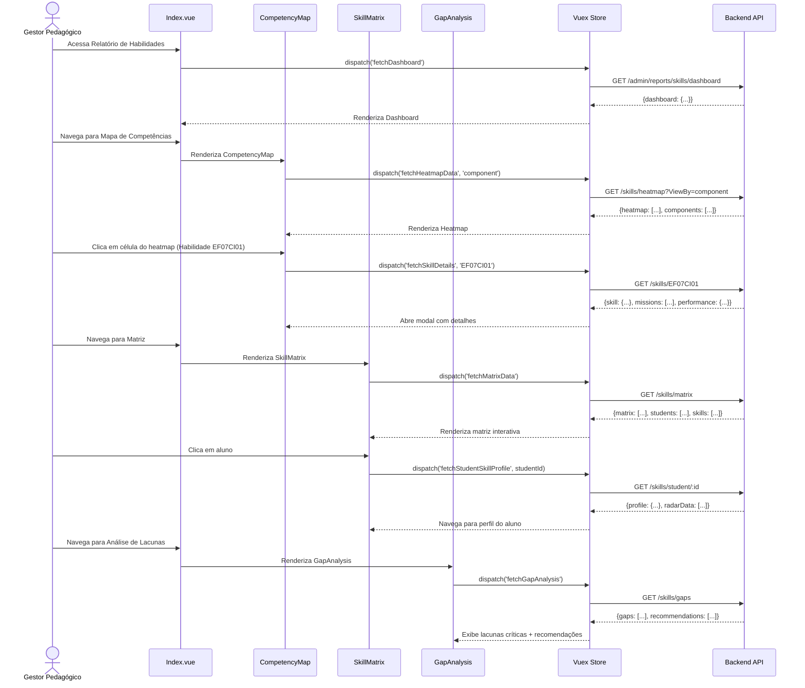

# ADMIN-004: Relatório de Desenvolvimento de Habilidades (Skill Report)

:::info Contexto
**Jornada**: Administrador (Coordenador, Gestor, Gerente de Rede)  
**Prioridade**: Média  
**Complexidade**: Alta  
**Status**: ✅ Documentado (AS-IS Baseline)
:::

## 1. Visão Geral

### Problema

Coordenadores pedagógicos e gestores educacionais precisam acompanhar o desenvolvimento de habilidades e competências dos alunos de forma granular, mapeando quais habilidades da BNCC foram trabalhadas, o nível de proficiência alcançado, e identificar lacunas para intervenção pedagógica direcionada, mas não possuem ferramentas que consolidem dados de múltiplas missões e avaliações em um mapa de competências acionável.

**Dores principais**:
- Dados de habilidades dispersos em missões, avaliações e atividades isoladas
- Impossibilidade de visualizar domínio de habilidades BNCC por aluno/turma/instituição
- Dificuldade para identificar habilidades com baixo desempenho (lacunas de aprendizagem)
- Falta de rastreabilidade: Quais missões trabalharam determinada habilidade?
- Ausência de comparação: Como a turma está em relação à rede?
- Relatórios manuais e demorados para prestação de contas educacionais
- Impossibilidade de planejar intervenções baseadas em dados de competências

### Solução AS-IS

Sistema de análise de desenvolvimento de habilidades com:
- **Mapa de Competências** visual (heatmap de domínio por habilidade)
- **Dashboard de Proficiência** com KPIs de desenvolvimento
- **Matriz de Habilidades × Alunos** (quem domina o quê)
- **Análise de Lacunas** (habilidades críticas com baixo desempenho)
- **Rastreabilidade** (quais missões/avaliações trabalharam cada habilidade)
- **Comparação Contextual** (aluno vs turma vs rede)
- **Recomendações Pedagógicas** baseadas em padrões identificados
- **Exportação de Relatórios BNCC** para prestação de contas

## 2. Rotas e Navegação

```typescript
// src/router/admin-routes/skill-routes.js
export default [
  {
    path: '/admin/reports/skills',
    name: 'admin-skill-report',
    component: () => import('@/views/pages/admin-context/reports/skills/Index.vue'),
    meta: {
      resource: 'SkillReport',
      action: 'read',
      breadcrumb: [
        { text: 'Início', to: '/' },
        { text: 'Relatórios', to: '/admin/reports' },
        { text: 'Habilidades', active: true }
      ]
    }
  },
  {
    path: '/admin/reports/skills/student/:studentId',
    name: 'admin-student-skill-profile',
    component: () => import('@/views/pages/admin-context/reports/skills/StudentSkillProfile.vue'),
    meta: {
      resource: 'SkillReport',
      action: 'read'
    }
  },
  {
    path: '/admin/reports/skills/skill/:skillCode',
    name: 'admin-skill-details',
    component: () => import('@/views/pages/admin-context/reports/skills/SkillDetails.vue'),
    meta: {
      resource: 'SkillReport',
      action: 'read'
    }
  }
]
```

**Fluxo de navegação**:
1. Gestor acessa menu Relatórios → Desenvolvimento de Habilidades
2. Visualiza dashboard com métricas gerais de proficiência
3. Filtra por instituição, turma, disciplina, componente curricular, período
4. Navega entre abas: Dashboard, Mapa de Competências, Matriz, Lacunas, Comparativo
5. Clica em habilidade → Abre detalhes (missões que trabalharam, desempenho, distribuição)
6. Clica em aluno → Abre perfil completo de competências (radar chart, lista detalhada)
7. Identifica lacunas → Recebe recomendações de intervenção
8. Exporta relatório BNCC para documentação pedagógica

## 3. Arquitetura de Componentes

### Estrutura de Pastas

```
src/views/pages/admin-context/reports/skills/
├── Index.vue                      # Orquestrador principal
├── Dashboard.vue                  # Dashboard com KPIs de proficiência
├── Filters.vue                    # Filtros (instituição, turma, componente)
├── CompetencyMap.vue              # Heatmap de domínio de habilidades
├── SkillMatrix.vue                # Matriz habilidades × alunos
├── GapAnalysis.vue                # Análise de lacunas críticas
├── Comparative.vue                # Comparação aluno/turma/rede
├── SkillDetails.vue               # Detalhes de uma habilidade específica
├── StudentSkillProfile.vue        # Perfil completo do aluno
├── useSkillReport.js             # Composable de domínio
├── components/
│   ├── ProficiencyKPI.vue        # Card de KPI de proficiência
│   ├── SkillCard.vue             # Card de habilidade com código BNCC
│   ├── CompetencyHeatmap.vue     # Heatmap de competências
│   ├── SkillMatrixTable.vue      # Tabela matriz interativa
│   ├── GapAlert.vue              # Alerta de lacuna crítica
│   ├── ProficiencyLevelBadge.vue # Badge de nível (Inicial, Básico, Proficiente, Avançado)
│   ├── SkillRadarChart.vue       # Radar chart de habilidades do aluno
│   ├── ComparisonChart.vue       # Gráfico de barras comparativo
│   ├── InterventionPanel.vue     # Painel de recomendações
│   └── ExportBNCCModal.vue       # Modal de exportação BNCC
└── charts/
    ├── ProficiencyDistribution.vue # Histograma de distribuição de proficiência
    ├── SkillProgressLine.vue      # Linha de evolução de habilidade ao longo do tempo
    └── ComponentBarChart.vue      # Barras de proficiência por componente curricular
```

### Responsabilidades dos Componentes

#### Index.vue (Orquestrador)
```vue
<template>
  <section>
    <Filters />
    <b-tabs content-class="mt-3" pills>
      <b-tab title="Dashboard" active>
        <Dashboard />
      </b-tab>
      
      <b-tab title="Mapa de Competências">
        <CompetencyMap />
      </b-tab>
      
      <b-tab title="Matriz" :badge="totalSkills">
        <SkillMatrix />
      </b-tab>
      
      <b-tab title="Análise de Lacunas" :badge="criticalGapsCount">
        <GapAnalysis />
      </b-tab>
      
      <b-tab title="Comparativo">
        <Comparative />
      </b-tab>
    </b-tabs>
  </section>
</template>

<script>
import Filters from './Filters.vue'
import Dashboard from './Dashboard.vue'
import CompetencyMap from './CompetencyMap.vue'
import SkillMatrix from './SkillMatrix.vue'
import GapAnalysis from './GapAnalysis.vue'
import Comparative from './Comparative.vue'
import store from '@/store'
import moduleSkillReport from '@/store/pageModules/reports/module-skill-report.js'
import { defineComponent, computed, onMounted, onUnmounted } from '@vue/composition-api'

export default defineComponent({
  name: 'SkillReportIndex',
  components: {
    Filters, Dashboard, CompetencyMap, 
    SkillMatrix, GapAnalysis, Comparative
  },
  setup() {
    store.registerModule('skillReport', moduleSkillReport)

    const totalSkills = computed(() => store.getters['skillReport/skills']?.length || 0)
    const criticalGapsCount = computed(
      () => store.getters['skillReport/criticalGaps']?.length || 0
    )

    onMounted(() => {
      store.dispatch('skillReport/fetchDashboard')
    })

    onUnmounted(() => {
      store.commit('skillReport/reset')
      store.unregisterModule('skillReport')
    })

    return { totalSkills, criticalGapsCount }
  }
})
</script>
```

#### CompetencyMap.vue (Mapa de Competências)
```vue
<template>
  <div>
    <!-- Seletor de Visualização -->
    <div class="d-flex justify-content-between align-items-center mb-3">
      <div>
        <h4>Mapa de Competências</h4>
        <p class="text-muted">
          Visualize o domínio de habilidades em formato de heatmap
        </p>
      </div>
      
      <b-button-group>
        <b-button 
          :variant="viewBy === 'component' ? 'primary' : 'outline-primary'"
          @click="setViewBy('component')"
        >
          Por Componente
        </b-button>
        <b-button 
          :variant="viewBy === 'axis' ? 'primary' : 'outline-primary'"
          @click="setViewBy('axis')"
        >
          Por Eixo Temático
        </b-button>
        <b-button 
          :variant="viewBy === 'skill' ? 'primary' : 'outline-primary'"
          @click="setViewBy('skill')"
        >
          Por Habilidade
        </b-button>
      </b-button-group>
    </div>

    <!-- Legenda de Proficiência -->
    <b-card class="mb-3">
      <div class="d-flex align-items-center">
        <span class="mr-3"><strong>Legenda de Proficiência:</strong></span>
        <div class="d-flex">
          <div class="proficiency-legend-item">
            <div class="proficiency-color" style="background: #EA5455;"></div>
            <span>Inicial (0-25%)</span>
          </div>
          <div class="proficiency-legend-item">
            <div class="proficiency-color" style="background: #FF9F43;"></div>
            <span>Básico (26-50%)</span>
          </div>
          <div class="proficiency-legend-item">
            <div class="proficiency-color" style="background: #00CFE8;"></div>
            <span>Proficiente (51-75%)</span>
          </div>
          <div class="proficiency-legend-item">
            <div class="proficiency-color" style="background: #28C76F;"></div>
            <span>Avançado (76-100%)</span>
          </div>
        </div>
      </div>
    </b-card>

    <!-- Heatmap -->
    <b-card v-if="!loading" class="heatmap-container">
      <CompetencyHeatmap
        :data="heatmapData"
        :view-by="viewBy"
        @cell-click="handleCellClick"
      />
    </b-card>

    <!-- Loading State -->
    <b-card v-else>
      <b-skeleton-wrapper :loading="loading">
        <template #loading>
          <b-skeleton height="400px" />
        </template>
      </b-skeleton-wrapper>
    </b-card>

    <!-- Resumo por Componente -->
    <b-row class="mt-3">
      <b-col 
        v-for="component in componentSummary" 
        :key="component.id"
        cols="12" 
        md="4"
      >
        <b-card>
          <h5>{{ component.name }}</h5>
          <div class="proficiency-bars">
            <div 
              v-for="level in ['Inicial', 'Básico', 'Proficiente', 'Avançado']"
              :key="level"
              class="proficiency-bar-item"
            >
              <span class="level-label">{{ level }}</span>
              <b-progress 
                :value="component.distribution[level]" 
                :variant="getLevelVariant(level)"
                show-value
                height="20px"
              />
            </div>
          </div>
        </b-card>
      </b-col>
    </b-row>

    <!-- Modal de Detalhes da Habilidade -->
    <b-modal
      ref="skillDetailsModalRef"
      size="xl"
      title="Detalhes da Habilidade"
      hide-footer
    >
      <SkillDetailsPanel
        v-if="selectedSkillCode"
        :skill-code="selectedSkillCode"
      />
    </b-modal>
  </div>
</template>

<script>
import CompetencyHeatmap from './components/CompetencyHeatmap.vue'
import SkillDetailsPanel from './components/SkillDetailsPanel.vue'
import useSkillReport from './useSkillReport.js'
import { ref } from '@vue/composition-api'

export default {
  components: { CompetencyHeatmap, SkillDetailsPanel },
  setup() {
    const skillDetailsModalRef = ref(null)
    const selectedSkillCode = ref(null)
    const viewBy = ref('component')
    
    const {
      heatmapData,
      componentSummary,
      loading,
      fetchHeatmapData
    } = useSkillReport()

    const setViewBy = async (view) => {
      viewBy.value = view
      await fetchHeatmapData(view)
    }

    const handleCellClick = (cellData) => {
      selectedSkillCode.value = cellData.skillCode
      skillDetailsModalRef.value.show()
    }

    const getLevelVariant = (level) => {
      const variants = {
        'Inicial': 'danger',
        'Básico': 'warning',
        'Proficiente': 'info',
        'Avançado': 'success'
      }
      return variants[level]
    }

    return {
      skillDetailsModalRef,
      selectedSkillCode,
      viewBy,
      heatmapData,
      componentSummary,
      loading,
      setViewBy,
      handleCellClick,
      getLevelVariant
    }
  }
}
</script>

<style scoped>
.proficiency-legend-item {
  display: flex;
  align-items: center;
  margin-right: 1.5rem;
}

.proficiency-color {
  width: 20px;
  height: 20px;
  border-radius: 4px;
  margin-right: 0.5rem;
}

.heatmap-container {
  overflow-x: auto;
}

.proficiency-bars {
  margin-top: 1rem;
}

.proficiency-bar-item {
  display: flex;
  align-items: center;
  margin-bottom: 0.5rem;
}

.level-label {
  width: 100px;
  font-size: 0.875rem;
}
</style>
```

#### SkillMatrix.vue (Matriz Habilidades × Alunos)
```vue
<template>
  <div>
    <div class="d-flex justify-content-between align-items-center mb-3">
      <div>
        <h4>Matriz de Habilidades × Alunos</h4>
        <p class="text-muted">
          Visualize o domínio de cada habilidade por aluno
        </p>
      </div>

      <b-button variant="outline-primary" @click="exportMatrix">
        <span class="material-symbols-outlined">download</span>
        Exportar Matriz
      </b-button>
    </div>

    <!-- Filtro de Habilidades -->
    <b-card class="mb-3">
      <b-form-group label="Filtrar Habilidades:">
        <ESelect
          v-model="selectedComponent"
          :options="components"
          label="name"
          track-by="id"
          placeholder="Selecione um componente curricular"
          @input="handleComponentChange"
        />
      </b-form-group>
    </b-card>

    <!-- Tabela Matriz -->
    <SkillMatrixTable
      :loading="loading"
      :students="students"
      :skills="filteredSkills"
      :matrix-data="matrixData"
      @student-click="viewStudentProfile"
      @skill-click="viewSkillDetails"
    />

    <!-- Resumo Estatístico -->
    <b-row class="mt-3">
      <b-col cols="12" md="3">
        <b-card>
          <div class="text-center">
            <h2 class="text-success">{{ averageProficiency }}%</h2>
            <p class="text-muted">Proficiência Média</p>
          </div>
        </b-card>
      </b-col>
      <b-col cols="12" md="3">
        <b-card>
          <div class="text-center">
            <h2 class="text-info">{{ skillsAbove75 }}</h2>
            <p class="text-muted">Habilidades com maior que 75%</p>
          </div>
        </b-card>
      </b-col>
      <b-col cols="12" md="3">
        <b-card>
          <div class="text-center">
            <h2 class="text-warning">{{ skillsBelow50 }}</h2>
            <p class="text-muted">Habilidades com menor que 50%</p>
          </div>
        </b-card>
      </b-col>
      <b-col cols="12" md="3">
        <b-card>
          <div class="text-center">
            <h2 class="text-primary">{{ studentsWithGaps }}</h2>
            <p class="text-muted">Alunos com Lacunas</p>
          </div>
        </b-card>
      </b-col>
    </b-row>
  </div>
</template>

<script>
import SkillMatrixTable from './components/SkillMatrixTable.vue'
import ESelect from '@/components/selects/ESelect.vue'
import useSkillReport from './useSkillReport.js'
import router from '@/router'
import { ref, computed, watch } from '@vue/composition-api'

export default {
  components: { SkillMatrixTable, ESelect },
  setup() {
    const selectedComponent = ref(null)
    
    const {
      students,
      skills,
      matrixData,
      components,
      loading,
      averageProficiency,
      skillsAbove75,
      skillsBelow50,
      studentsWithGaps,
      fetchMatrixData,
      exportMatrix
    } = useSkillReport()

    const filteredSkills = computed(() => {
      if (!selectedComponent.value) return skills.value
      return skills.value.filter(
        skill => skill.componentId === selectedComponent.value.id
      )
    })

    const handleComponentChange = () => {
      fetchMatrixData()
    }

    const viewStudentProfile = (studentId) => {
      router.push({
        name: 'admin-student-skill-profile',
        params: { studentId }
      })
    }

    const viewSkillDetails = (skillCode) => {
      router.push({
        name: 'admin-skill-details',
        params: { skillCode }
      })
    }

    watch(selectedComponent, handleComponentChange)

    return {
      selectedComponent,
      students,
      filteredSkills,
      matrixData,
      components,
      loading,
      averageProficiency,
      skillsAbove75,
      skillsBelow50,
      studentsWithGaps,
      handleComponentChange,
      viewStudentProfile,
      viewSkillDetails,
      exportMatrix
    }
  }
}
</script>
```

## 4. Módulo Vuex

```javascript
// src/store/pageModules/reports/module-skill-report.js
import {
  getSkillDashboard,
  getSkillHeatmap,
  getSkillMatrix,
  getGapAnalysis,
  getComparativeData,
  getSkillDetails,
  getStudentSkillProfile,
  exportSkillReport
} from '@/services/admin-context/SkillReportService'

export default {
  namespaced: true,
  
  state: {
    dashboard: null,
    heatmapData: null,
    matrixData: null,
    students: [],
    skills: [],
    components: [],
    gapAnalysis: null,
    comparativeData: null,
    currentSkillDetails: null,
    currentStudentProfile: null,
    loading: false,
    params: {
      InstitutionId: null,
      ClassId: null,
      SubjectId: null,
      ComponentId: null,
      StartDate: null,
      EndDate: null,
      MinProficiency: null, // Filtro de proficiência mínima
      ViewBy: 'component' // 'component' | 'axis' | 'skill'
    }
  },

  mutations: {
    dashboard(state, payload) {
      state.dashboard = payload
    },
    heatmapData(state, payload) {
      state.heatmapData = payload
    },
    matrixData(state, payload) {
      state.matrixData = payload
    },
    students(state, payload) {
      state.students = payload
    },
    skills(state, payload) {
      state.skills = payload
    },
    components(state, payload) {
      state.components = payload
    },
    gapAnalysis(state, payload) {
      state.gapAnalysis = payload
    },
    comparativeData(state, payload) {
      state.comparativeData = payload
    },
    currentSkillDetails(state, payload) {
      state.currentSkillDetails = payload
    },
    currentStudentProfile(state, payload) {
      state.currentStudentProfile = payload
    },
    loading(state, payload) {
      state.loading = payload
    },
    setParams(state, payload) {
      state.params = { ...state.params, ...payload }
    },
    reset(state) {
      state.dashboard = null
      state.heatmapData = null
      state.matrixData = null
      state.students = []
      state.skills = []
      state.components = []
      state.gapAnalysis = null
      state.comparativeData = null
      state.currentSkillDetails = null
      state.currentStudentProfile = null
      state.loading = false
      state.params = {
        InstitutionId: null,
        ClassId: null,
        SubjectId: null,
        ComponentId: null,
        StartDate: null,
        EndDate: null,
        MinProficiency: null,
        ViewBy: 'component'
      }
    }
  },

  getters: {
    dashboard: state => state.dashboard,
    heatmapData: state => state.heatmapData,
    matrixData: state => state.matrixData,
    students: state => state.students,
    skills: state => state.skills,
    components: state => state.components,
    gapAnalysis: state => state.gapAnalysis,
    comparativeData: state => state.comparativeData,
    currentSkillDetails: state => state.currentSkillDetails,
    currentStudentProfile: state => state.currentStudentProfile,
    loading: state => state.loading,
    params: state => state.params,

    // Computed: Lacunas críticas (proficiência < 50%)
    criticalGaps: state => {
      if (!state.gapAnalysis) return []
      return state.gapAnalysis.gaps.filter(gap => gap.proficiency < 50)
    },

    // Computed: Proficiência média geral
    averageProficiency: state => {
      if (!state.dashboard) return 0
      return state.dashboard.overallProficiency.toFixed(1)
    },

    // Computed: Habilidades acima de 75%
    skillsAbove75: state => {
      if (!state.skills) return 0
      return state.skills.filter(skill => skill.proficiency >= 75).length
    },

    // Computed: Habilidades abaixo de 50%
    skillsBelow50: state => {
      if (!state.skills) return 0
      return state.skills.filter(skill => skill.proficiency < 50).length
    },

    // Computed: Alunos com lacunas significativas
    studentsWithGaps: state => {
      if (!state.students) return 0
      return state.students.filter(
        student => student.gapCount > 0
      ).length
    },

    // Computed: Resumo por componente curricular
    componentSummary: state => {
      if (!state.components || !state.skills) return []
      
      return state.components.map(component => {
        const componentSkills = state.skills.filter(
          skill => skill.componentId === component.id
        )
        
        const distribution = {
          'Inicial': 0,
          'Básico': 0,
          'Proficiente': 0,
          'Avançado': 0
        }
        
        componentSkills.forEach(skill => {
          if (skill.proficiency <= 25) distribution['Inicial']++
          else if (skill.proficiency <= 50) distribution['Básico']++
          else if (skill.proficiency <= 75) distribution['Proficiente']++
          else distribution['Avançado']++
        })
        
        // Converter para percentuais
        const total = componentSkills.length
        Object.keys(distribution).forEach(key => {
          distribution[key] = ((distribution[key] / total) * 100).toFixed(1)
        })
        
        return {
          ...component,
          distribution
        }
      })
    }
  },

  actions: {
    async fetchDashboard({ commit, state }) {
      commit('loading', true)
      try {
        const response = await getSkillDashboard({
          InstitutionId: state.params.InstitutionId,
          ClassId: state.params.ClassId,
          SubjectId: state.params.SubjectId,
          StartDate: state.params.StartDate,
          EndDate: state.params.EndDate
        })
        commit('dashboard', response.data)
      } catch (error) {
        console.error('Erro ao buscar dashboard:', error)
      } finally {
        commit('loading', false)
      }
    },

    async fetchHeatmapData({ commit, state }, viewBy) {
      commit('loading', true)
      try {
        const response = await getSkillHeatmap({
          ...state.params,
          ViewBy: viewBy || state.params.ViewBy
        })
        commit('heatmapData', response.data)
        commit('components', response.data.components)
      } catch (error) {
        console.error('Erro ao buscar heatmap:', error)
      } finally {
        commit('loading', false)
      }
    },

    async fetchMatrixData({ commit, state }) {
      commit('loading', true)
      try {
        const response = await getSkillMatrix(state.params)
        commit('matrixData', response.data.matrix)
        commit('students', response.data.students)
        commit('skills', response.data.skills)
      } catch (error) {
        console.error('Erro ao buscar matriz:', error)
      } finally {
        commit('loading', false)
      }
    },

    async fetchGapAnalysis({ commit, state }) {
      commit('loading', true)
      try {
        const response = await getGapAnalysis(state.params)
        commit('gapAnalysis', response.data)
      } catch (error) {
        console.error('Erro ao buscar análise de lacunas:', error)
      } finally {
        commit('loading', false)
      }
    },

    async fetchComparativeData({ commit, state }) {
      commit('loading', true)
      try {
        const response = await getComparativeData(state.params)
        commit('comparativeData', response.data)
      } catch (error) {
        console.error('Erro ao buscar dados comparativos:', error)
      } finally {
        commit('loading', false)
      }
    },

    async fetchSkillDetails({ commit }, skillCode) {
      commit('loading', true)
      try {
        const response = await getSkillDetails(skillCode)
        commit('currentSkillDetails', response.data)
      } catch (error) {
        console.error('Erro ao buscar detalhes da habilidade:', error)
      } finally {
        commit('loading', false)
      }
    },

    async fetchStudentSkillProfile({ commit }, studentId) {
      commit('loading', true)
      try {
        const response = await getStudentSkillProfile(studentId)
        commit('currentStudentProfile', response.data)
      } catch (error) {
        console.error('Erro ao buscar perfil do aluno:', error)
      } finally {
        commit('loading', false)
      }
    }
  }
}
```

## 5. Services (API Layer)

```javascript
// src/services/admin-context/SkillReportService.js
import { axiosIns } from '@axios'

/**
 * Busca dashboard de desenvolvimento de habilidades
 * @param {Object} params - Parâmetros de filtro
 * @param {number} [params.InstitutionId] - ID da instituição
 * @param {number} [params.ClassId] - ID da turma
 * @param {number} [params.SubjectId] - ID da disciplina
 * @param {string} [params.StartDate] - Data inicial (YYYY-MM-DD)
 * @param {string} [params.EndDate] - Data final (YYYY-MM-DD)
 * @returns {Promise<{data: Object}>}
 */
export const getSkillDashboard = (params) => {
  return axiosIns.get('/admin/reports/skills/dashboard', { params })
}

/**
 * Busca dados para heatmap de competências
 * @param {Object} params - Parâmetros de filtro e visualização
 * @param {string} params.ViewBy - Agrupamento ('component'|'axis'|'skill')
 * @returns {Promise<{data: Object}>}
 */
export const getSkillHeatmap = (params) => {
  return axiosIns.get('/admin/reports/skills/heatmap', { params })
}

/**
 * Busca matriz de habilidades × alunos
 * @param {Object} params - Parâmetros de filtro
 * @returns {Promise<{data: {matrix: Array, students: Array, skills: Array}}>}
 */
export const getSkillMatrix = (params) => {
  return axiosIns.get('/admin/reports/skills/matrix', { params })
}

/**
 * Busca análise de lacunas de aprendizagem
 * @param {Object} params - Parâmetros de filtro
 * @returns {Promise<{data: Object}>}
 */
export const getGapAnalysis = (params) => {
  return axiosIns.get('/admin/reports/skills/gaps', { params })
}

/**
 * Busca dados comparativos (aluno vs turma vs rede)
 * @param {Object} params - Parâmetros de filtro
 * @returns {Promise<{data: Object}>}
 */
export const getComparativeData = (params) => {
  return axiosIns.get('/admin/reports/skills/comparative', { params })
}

/**
 * Busca detalhes de uma habilidade específica
 * @param {string} skillCode - Código BNCC da habilidade (ex: EF07CI01)
 * @returns {Promise<{data: Object}>}
 */
export const getSkillDetails = (skillCode) => {
  return axiosIns.get(`/admin/reports/skills/${skillCode}`)
}

/**
 * Busca perfil completo de habilidades de um aluno
 * @param {number} studentId - ID do aluno
 * @returns {Promise<{data: Object}>}
 */
export const getStudentSkillProfile = (studentId) => {
  return axiosIns.get(`/admin/reports/skills/student/${studentId}`)
}

/**
 * Exporta relatório de habilidades BNCC
 * @param {Object} options - Opções de exportação
 * @param {string} options.format - Formato (pdf|xlsx|csv)
 * @param {string} options.reportType - Tipo (dashboard|matrix|gaps|bncc-official)
 * @param {Object} options.filters - Filtros aplicados
 * @returns {Promise<Blob>}
 */
export const exportSkillReport = (options) => {
  return axiosIns.post(
    '/admin/reports/skills/export',
    options,
    { responseType: 'blob' }
  )
}
```

## 6. Composable de Domínio

```javascript
// src/views/pages/admin-context/reports/skills/useSkillReport.js
import store from '@/store'
import useFilters from '@/store/filters/useFilters'
import { computed } from '@vue/composition-api'

const moduleName = 'skillReport'
const { institution, classe, subject } = useFilters()

/**
 * Composable para gerenciar relatório de habilidades
 * @returns {Object} Interface de gerenciamento do relatório
 */
export default function useSkillReport() {
  // State
  const dashboard = computed({
    get: () => store.getters[`${moduleName}/dashboard`],
    set: val => store.commit(`${moduleName}/dashboard`, val)
  })

  const heatmapData = computed({
    get: () => store.getters[`${moduleName}/heatmapData`],
    set: val => store.commit(`${moduleName}/heatmapData`, val)
  })

  const matrixData = computed({
    get: () => store.getters[`${moduleName}/matrixData`],
    set: val => store.commit(`${moduleName}/matrixData`, val)
  })

  const students = computed({
    get: () => store.getters[`${moduleName}/students`],
    set: val => store.commit(`${moduleName}/students`, val)
  })

  const skills = computed({
    get: () => store.getters[`${moduleName}/skills`],
    set: val => store.commit(`${moduleName}/skills`, val)
  })

  const components = computed({
    get: () => store.getters[`${moduleName}/components`],
    set: val => store.commit(`${moduleName}/components`, val)
  })

  const gapAnalysis = computed({
    get: () => store.getters[`${moduleName}/gapAnalysis`],
    set: val => store.commit(`${moduleName}/gapAnalysis`, val)
  })

  const comparativeData = computed({
    get: () => store.getters[`${moduleName}/comparativeData`],
    set: val => store.commit(`${moduleName}/comparativeData`, val)
  })

  const loading = computed({
    get: () => store.getters[`${moduleName}/loading`],
    set: val => store.commit(`${moduleName}/loading`, val)
  })

  const params = computed(() => store.getters[`${moduleName}/params`])

  // Computed getters
  const criticalGaps = computed(
    () => store.getters[`${moduleName}/criticalGaps`]
  )

  const averageProficiency = computed(
    () => store.getters[`${moduleName}/averageProficiency`]
  )

  const skillsAbove75 = computed(
    () => store.getters[`${moduleName}/skillsAbove75`]
  )

  const skillsBelow50 = computed(
    () => store.getters[`${moduleName}/skillsBelow50`]
  )

  const studentsWithGaps = computed(
    () => store.getters[`${moduleName}/studentsWithGaps`]
  )

  const componentSummary = computed(
    () => store.getters[`${moduleName}/componentSummary`]
  )

  // Methods
  const fetchDashboard = async () => {
    await store.dispatch(`${moduleName}/fetchDashboard`)
  }

  const fetchHeatmapData = async (viewBy) => {
    await store.dispatch(`${moduleName}/fetchHeatmapData`, viewBy)
  }

  const fetchMatrixData = async () => {
    await store.dispatch(`${moduleName}/fetchMatrixData`)
  }

  const fetchGapAnalysis = async () => {
    await store.dispatch(`${moduleName}/fetchGapAnalysis`)
  }

  const fetchComparativeData = async () => {
    await store.dispatch(`${moduleName}/fetchComparativeData`)
  }

  const fetchSkillDetails = async (skillCode) => {
    await store.dispatch(`${moduleName}/fetchSkillDetails`, skillCode)
  }

  const fetchStudentSkillProfile = async (studentId) => {
    await store.dispatch(`${moduleName}/fetchStudentSkillProfile`, studentId)
  }

  const exportMatrix = async () => {
    try {
      const blob = await exportSkillReport({
        format: 'xlsx',
        reportType: 'matrix',
        filters: params.value
      })
      
      const url = window.URL.createObjectURL(blob)
      const link = document.createElement('a')
      link.href = url
      link.download = `matriz-habilidades-${new Date().toISOString()}.xlsx`
      link.click()
      window.URL.revokeObjectURL(url)
    } catch (error) {
      console.error('Erro ao exportar matriz:', error)
    }
  }

  return {
    moduleName,
    // State
    dashboard,
    heatmapData,
    matrixData,
    students,
    skills,
    components,
    gapAnalysis,
    comparativeData,
    loading,
    params,
    // Computed
    criticalGaps,
    averageProficiency,
    skillsAbove75,
    skillsBelow50,
    studentsWithGaps,
    componentSummary,
    // Methods
    fetchDashboard,
    fetchHeatmapData,
    fetchMatrixData,
    fetchGapAnalysis,
    fetchComparativeData,
    fetchSkillDetails,
    fetchStudentSkillProfile,
    exportMatrix,
    // Global filters
    institution,
    classe,
    subject
  }
}
```

## 7. Fluxo de Usuário



## 8. Estados da Interface

### Estado 1: Dashboard - Visão Geral
```typescript
{
  dashboard: {
    overallProficiency: 68.5, // % médio
    proficiencyTrend: 3.2, // % change vs período anterior
    totalSkillsTracked: 45,
    skillsByLevel: {
      inicial: 8,
      basico: 12,
      proficiente: 18,
      avancado: 7
    },
    topSkills: [
      {
        code: 'EF07CI01',
        name: 'Discutir a aplicação do conhecimento científico...',
        proficiency: 85.2,
        componentName: 'Ciências da Natureza'
      }
    ],
    criticalGaps: [
      {
        code: 'EF07MA15',
        name: 'Resolver e elaborar problemas que envolvam...',
        proficiency: 32.5,
        componentName: 'Matemática',
        affectedStudents: 22
      }
    ],
    proficiencyByComponent: [
      { component: 'Matemática', proficiency: 62.3 },
      { component: 'Língua Portuguesa', proficiency: 71.8 },
      { component: 'Ciências', proficiency: 75.1 }
    ]
  }
}
```
**UI**: 
- 4 KPI cards: Proficiência Média (com trend), Habilidades Rastreadas, Lacunas Críticas (count), Alunos com Lacunas
- Gráfico de pizza: Distribuição por nível de proficiência
- Card "Top 5 Habilidades": Lista com código BNCC, nome, proficiência em progress bar
- Card "Lacunas Críticas": Lista com alerta vermelho, código, proficiência baixa, alunos afetados
- Gráfico de barras horizontal: Proficiência média por componente curricular

### Estado 2: Mapa de Competências - Heatmap por Componente
```typescript
{
  heatmapData: {
    viewBy: 'component',
    components: [
      {
        id: 1,
        name: 'Matemática',
        skills: [
          {
            code: 'EF07MA01',
            name: 'Resolver e elaborar problemas com números inteiros...',
            proficiency: 72.5,
            level: 'Proficiente',
            studentsCount: 30
          }
        ]
      }
    ]
  }
}
```
**UI - Heatmap Visual**:
- Legenda de cores: Vermelho (0-25%), Laranja (26-50%), Ciano (51-75%), Verde (76-100%)
- Grid estruturado:
  - Linhas: Habilidades (código BNCC + nome truncado com tooltip)
  - Colunas: Componentes Curriculares ou Eixos Temáticos
  - Células: Cor de acordo com proficiência média
  - Hover: Tooltip com código, nome completo, proficiência exata, nº alunos
  - Clique: Abre modal com detalhes da habilidade
- Cards de resumo abaixo: Distribuição de proficiência por componente (4 progress bars por card)

### Estado 3: Matriz de Habilidades × Alunos
```typescript
{
  matrixData: [
    {
      studentId: 123,
      studentName: 'Ana Silva',
      skills: {
        'EF07MA01': { proficiency: 85, level: 'Avançado' },
        'EF07MA02': { proficiency: 60, level: 'Proficiente' },
        'EF07CI01': { proficiency: 45, level: 'Básico' }
      },
      averageProficiency: 63.3,
      gapCount: 5
    }
  ],
  students: [...],
  skills: [
    {
      code: 'EF07MA01',
      name: 'Resolver e elaborar problemas...',
      componentId: 1,
      componentName: 'Matemática'
    }
  ]
}
```
**UI - Tabela Interativa**:
- Header fixo com nomes de habilidades (códigos BNCC na vertical)
- Primeira coluna: Nome do aluno + avatar pequeno
- Células da matriz:
  - Badge colorido por nível (verde avançado, ciano proficiente, laranja básico, vermelho inicial)
  - Valor de proficiência em tooltip
  - Hover: Highlight linha e coluna
  - Clique na célula: Expande detalhes (missões que trabalharam, evolução temporal)
- Clique no aluno (linha): Navega para perfil completo
- Clique na habilidade (coluna): Abre detalhes da habilidade
- Filtros no topo: Componente curricular (ESelect)
- Scroll horizontal e vertical para matrizes grandes

### Estado 4: Análise de Lacunas
```typescript
{
  gapAnalysis: {
    criticalGaps: [
      {
        code: 'EF07MA15',
        name: 'Resolver e elaborar problemas que envolvam...',
        componentName: 'Matemática',
        proficiency: 32.5,
        affectedStudents: 22,
        studentsIds: [1, 2, 3, ...],
        missionsWorked: [
          { id: 10, title: 'Missão Números', completionRate: 65 }
        ],
        recommendations: [
          {
            type: 'intervention',
            priority: 'high',
            title: 'Reforço em Resolução de Problemas',
            description: 'Criar missões focadas em aplicação prática...',
            estimatedImpact: '+25% proficiência',
            suggestedMissions: [
              { id: 50, title: 'Problemas do Cotidiano' }
            ]
          }
        ]
      }
    ],
    totalGaps: 12,
    criticalCount: 5,
    affectedStudentsTotal: 28
  }
}
```
**UI - Análise de Lacunas**:
- Card de alerta no topo (se criticalCount maior que 0): "5 Lacunas Críticas Identificadas" (vermelho, ícone warning)
- Lista de lacunas críticas (cards expansíveis):
  - Header: Código BNCC + Nome da habilidade
  - Badge de proficiência (vermelho menor que 50%)
  - Ícone de grupo + "22 alunos afetados"
  - Botão "Ver Alunos" (expande lista com avatares + nomes)
  - Seção "Missões Trabalhadas": Lista de missões que abordaram a habilidade (com taxa de conclusão)
  - Seção "Recomendações de Intervenção":
    - Cards com prioridade (alta/média/baixa)
    - Título da intervenção
    - Descrição da ação sugerida
    - Impacto estimado
    - Missões sugeridas (links clicáveis para habilitar)
    - Botão "Implementar Intervenção" (abre modal de planejamento)

### Estado 5: Comparativo - Aluno vs Turma vs Rede
```typescript
{
  comparativeData: {
    studentId: 123,
    studentName: 'Ana Silva',
    studentProficiency: 63.3,
    classProficiency: 68.5,
    networkProficiency: 70.2,
    skillsComparison: [
      {
        code: 'EF07MA01',
        name: 'Resolver problemas com números inteiros',
        studentProficiency: 85,
        classProficiency: 72,
        networkProficiency: 75,
        percentile: 85 // Aluno está no percentil 85
      }
    ],
    strengthAreas: [
      {
        component: 'Ciências',
        studentProficiency: 82,
        classProficiency: 75
      }
    ],
    improvementAreas: [
      {
        component: 'Matemática',
        studentProficiency: 58,
        classProficiency: 72
      }
    ]
  }
}
```
**UI - Comparativo**:
- Seletor de aluno no topo (ESelect com busca)
- Card de resumo: 3 colunas com badges grandes (Aluno | Turma | Rede), valores de proficiência média
- Gráfico de barras agrupadas: Comparação por componente curricular
  - 3 barras por componente: Aluno (azul), Turma (verde), Rede (cinza)
- Tabela detalhada de habilidades:
  - Colunas: Código BNCC, Nome, Aluno, Turma, Rede, Percentil
  - Badge de destaque: Verde se aluno > turma+5%, Vermelho se aluno < turma-5%
- Seção "Áreas de Destaque": Cards com componentes onde aluno está acima da média da turma
- Seção "Áreas para Melhoria": Cards com componentes onde aluno está abaixo, com sugestões

### Estado 6: Detalhes da Habilidade
```typescript
{
  currentSkillDetails: {
    code: 'EF07MA01',
    name: 'Resolver e elaborar problemas que envolvam operações com números inteiros e suas propriedades',
    description: 'Objetivo de aprendizagem da BNCC...',
    component: 'Matemática',
    thematicAxis: 'Números',
    yearLevel: '7º Ano',
    overallProficiency: 72.5,
    studentsProficientCount: 22,
    totalStudents: 30,
    proficiencyDistribution: [
      { level: 'Inicial', count: 2, percentage: 6.7 },
      { level: 'Básico', count: 6, percentage: 20 },
      { level: 'Proficiente', count: 15, percentage: 50 },
      { level: 'Avançado', count: 7, percentage: 23.3 }
    ],
    missionsWorked: [
      {
        id: 10,
        title: 'Missão Números Inteiros',
        completionRate: 85,
        averageScore: 7.5,
        studentsCompleted: 26
      }
    ],
    evolutionOverTime: [
      { month: '2024-01', proficiency: 65 },
      { month: '2024-02', proficiency: 72.5 }
    ]
  }
}
```
**UI - Modal/Page de Detalhes**:
- Header: Código BNCC em badge + Nome completo da habilidade
- Descrição completa da BNCC (colapsável)
- Metadados: Componente, Eixo Temático, Ano
- Card de proficiência: Valor atual + progress bar + trend
- Gráfico de pizza: Distribuição de alunos por nível de proficiência
- Seção "Missões que Trabalharam Esta Habilidade":
  - Lista de cards de missões
  - Cada card: Título, taxa de conclusão, nota média, alunos que completaram
  - Botão "Visualizar Missão"
- Gráfico de linha: Evolução da proficiência ao longo do tempo (últimos 6 meses)
- Seção "Alunos Detalhados":
  - Tabela: Nome, Proficiência Atual, Nível, Última Avaliação, Trend (↑↓→)
  - Filtro rápido por nível

### Estado 7: Perfil de Habilidades do Aluno
```typescript
{
  currentStudentProfile: {
    studentId: 123,
    studentName: 'Ana Silva',
    studentAvatar: 'https://...',
    class: '7º Ano A',
    overallProficiency: 63.3,
    radarData: {
      components: ['Matemática', 'Língua Portuguesa', 'Ciências', 'História', 'Geografia'],
      values: [62, 75, 68, 70, 58]
    },
    skillsByComponent: [
      {
        component: 'Matemática',
        skills: [
          {
            code: 'EF07MA01',
            name: 'Resolver problemas com números inteiros',
            proficiency: 85,
            level: 'Avançado',
            lastAssessed: '2024-02-01'
          }
        ]
      }
    ],
    gaps: [
      {
        code: 'EF07CI05',
        name: 'Discutir o uso de diferentes tipos de combustível...',
        proficiency: 35,
        componentName: 'Ciências'
      }
    ],
    recommendations: [
      {
        title: 'Reforço em Ciências - Energia',
        description: 'Aluno apresenta dificuldade em conceitos de energia...',
        suggestedMissions: [...]
      }
    ]
  }
}
```
**UI - Perfil do Aluno**:
- Header: Avatar grande + Nome + Turma + Badge de proficiência média
- Radar Chart central: Proficiência por componente curricular (5-7 eixos)
- Tabs:
  - **Tab "Visão Geral"**: Radar + cards de resumo (habilidades dominadas, em desenvolvimento, lacunas)
  - **Tab "Por Componente"**: Accordion com lista de habilidades agrupadas por componente
    - Cada habilidade: Código, nome, badge de nível, progress bar de proficiência, data da última avaliação
  - **Tab "Lacunas Identificadas"**: Lista de habilidades com proficiência menor que 50%
    - Alerta por lacuna com recomendações específicas
  - **Tab "Evolução Temporal"**: Gráfico de linha com proficiência ao longo do tempo (últimos 12 meses)
- Botão flutuante: "Gerar Relatório Individual" (exporta PDF com perfil completo)

## 9. API Endpoints

### GET /admin/reports/skills/dashboard
**Request Params**: `?InstitutionId=12&ClassId=34&StartDate=2024-01-01&EndDate=2024-02-03`

**Response**:
```json
{
  "overallProficiency": 68.5,
  "proficiencyTrend": 3.2,
  "totalSkillsTracked": 45,
  "skillsByLevel": {
    "inicial": 8,
    "basico": 12,
    "proficiente": 18,
    "avancado": 7
  },
  "topSkills": [
    {
      "code": "EF07CI01",
      "name": "Discutir a aplicação do conhecimento científico e tecnológico na vida cotidiana",
      "proficiency": 85.2,
      "componentName": "Ciências da Natureza",
      "componentId": 3
    }
  ],
  "criticalGaps": [
    {
      "code": "EF07MA15",
      "name": "Resolver e elaborar problemas que envolvam as operações com números racionais",
      "proficiency": 32.5,
      "componentName": "Matemática",
      "componentId": 1,
      "affectedStudents": 22
    }
  ],
  "proficiencyByComponent": [
    {
      "componentId": 1,
      "componentName": "Matemática",
      "proficiency": 62.3,
      "skillsCount": 15
    }
  ]
}
```

### GET /admin/reports/skills/heatmap
**Request Params**: `?ViewBy=component&ClassId=34&SubjectId=5`

**Response**:
```json
{
  "viewBy": "component",
  "components": [
    {
      "id": 1,
      "name": "Matemática",
      "axes": [
        {
          "id": 10,
          "name": "Números",
          "skills": [
            {
              "code": "EF07MA01",
              "name": "Resolver e elaborar problemas que envolvam operações com números inteiros...",
              "proficiency": 72.5,
              "level": "Proficiente",
              "studentsCount": 30,
              "proficientCount": 22,
              "color": "#00CFE8"
            }
          ]
        }
      ]
    }
  ]
}
```

### GET /admin/reports/skills/matrix
**Request Params**: `?ClassId=34&ComponentId=1`

**Response**:
```json
{
  "students": [
    {
      "id": 123,
      "name": "Ana Silva",
      "avatar": "https://...",
      "averageProficiency": 63.3,
      "gapCount": 5
    }
  ],
  "skills": [
    {
      "code": "EF07MA01",
      "name": "Resolver e elaborar problemas com números inteiros",
      "componentId": 1,
      "componentName": "Matemática"
    }
  ],
  "matrix": [
    {
      "studentId": 123,
      "studentName": "Ana Silva",
      "skills": {
        "EF07MA01": {
          "proficiency": 85,
          "level": "Avançado",
          "lastAssessed": "2024-02-01T10:30:00Z"
        },
        "EF07MA02": {
          "proficiency": 60,
          "level": "Proficiente",
          "lastAssessed": "2024-01-28T14:20:00Z"
        }
      }
    }
  ]
}
```

### GET /admin/reports/skills/gaps
**Request Params**: `?ClassId=34&MinProficiency=50`

**Response**:
```json
{
  "criticalGaps": [
    {
      "code": "EF07MA15",
      "name": "Resolver e elaborar problemas que envolvam as operações com números racionais",
      "componentName": "Matemática",
      "proficiency": 32.5,
      "affectedStudents": 22,
      "studentsIds": [1, 2, 3],
      "missionsWorked": [
        {
          "id": 10,
          "title": "Missão Números Racionais",
          "completionRate": 65,
          "averageScore": 5.8
        }
      ],
      "recommendations": [
        {
          "type": "intervention",
          "priority": "high",
          "title": "Reforço em Operações com Racionais",
          "description": "Criar missões práticas focadas em aplicação de frações e decimais no cotidiano. Considerar uso de manipulativos virtuais.",
          "estimatedImpact": "+25% proficiência",
          "suggestedMissions": [
            {
              "id": 50,
              "title": "Frações na Cozinha"
            }
          ]
        }
      ]
    }
  ],
  "totalGaps": 12,
  "criticalCount": 5,
  "affectedStudentsTotal": 28
}
```

### GET /admin/reports/skills/comparative
**Request Params**: `?StudentId=123&ClassId=34`

**Response**:
```json
{
  "studentId": 123,
  "studentName": "Ana Silva",
  "studentProficiency": 63.3,
  "classProficiency": 68.5,
  "networkProficiency": 70.2,
  "skillsComparison": [
    {
      "code": "EF07MA01",
      "name": "Resolver problemas com números inteiros",
      "studentProficiency": 85,
      "classProficiency": 72,
      "networkProficiency": 75,
      "percentile": 85,
      "status": "above_average"
    }
  ],
  "strengthAreas": [
    {
      "componentId": 3,
      "componentName": "Ciências",
      "studentProficiency": 82,
      "classProficiency": 75,
      "difference": 7
    }
  ],
  "improvementAreas": [
    {
      "componentId": 1,
      "componentName": "Matemática",
      "studentProficiency": 58,
      "classProficiency": 72,
      "difference": -14
    }
  ]
}
```

### GET /admin/reports/skills/:skillCode
**Response**:
```json
{
  "code": "EF07MA01",
  "name": "Resolver e elaborar problemas que envolvam operações com números inteiros e suas propriedades",
  "description": "Esta habilidade consiste em utilizar os números inteiros e suas propriedades para resolver e elaborar situações-problema...",
  "componentId": 1,
  "componentName": "Matemática",
  "thematicAxisId": 10,
  "thematicAxisName": "Números",
  "yearLevel": "7º Ano",
  "overallProficiency": 72.5,
  "studentsProficientCount": 22,
  "totalStudents": 30,
  "proficiencyDistribution": [
    {
      "level": "Inicial",
      "count": 2,
      "percentage": 6.7,
      "students": [{ "id": 1, "name": "João" }]
    }
  ],
  "missionsWorked": [
    {
      "id": 10,
      "title": "Missão Números Inteiros",
      "completionRate": 85,
      "averageScore": 7.5,
      "studentsCompleted": 26,
      "createdAt": "2024-01-15"
    }
  ],
  "evolutionOverTime": [
    {
      "month": "2024-01",
      "proficiency": 65,
      "assessmentsCount": 3
    },
    {
      "month": "2024-02",
      "proficiency": 72.5,
      "assessmentsCount": 5
    }
  ]
}
```

### GET /admin/reports/skills/student/:studentId
**Response**:
```json
{
  "studentId": 123,
  "studentName": "Ana Silva",
  "studentAvatar": "https://...",
  "classId": 34,
  "className": "7º Ano A",
  "overallProficiency": 63.3,
  "radarData": {
    "components": ["Matemática", "Língua Portuguesa", "Ciências", "História", "Geografia"],
    "values": [62, 75, 68, 70, 58]
  },
  "skillsByComponent": [
    {
      "componentId": 1,
      "componentName": "Matemática",
      "averageProficiency": 62,
      "skills": [
        {
          "code": "EF07MA01",
          "name": "Resolver problemas com números inteiros",
          "proficiency": 85,
          "level": "Avançado",
          "lastAssessed": "2024-02-01T10:30:00Z",
          "missionsCompleted": 3
        }
      ]
    }
  ],
  "gaps": [
    {
      "code": "EF07CI05",
      "name": "Discutir o uso de diferentes tipos de combustível e máquinas térmicas",
      "proficiency": 35,
      "level": "Básico",
      "componentName": "Ciências"
    }
  ],
  "recommendations": [
    {
      "priority": "high",
      "title": "Reforço em Ciências - Energia e Máquinas Térmicas",
      "description": "Aluno apresenta dificuldade em conceitos relacionados a energia. Sugerido trabalho com experimentos práticos.",
      "suggestedMissions": [
        {
          "id": 60,
          "title": "Experimento: Motor Simples"
        }
      ]
    }
  ],
  "evolutionOverTime": [
    {
      "date": "2024-01",
      "overallProficiency": 58
    },
    {
      "date": "2024-02",
      "overallProficiency": 63.3
    }
  ]
}
```

### POST /admin/reports/skills/export
**Request**:
```json
{
  "format": "pdf",
  "reportType": "bncc-official",
  "includeCharts": true,
  "includeRecommendations": true,
  "filters": {
    "InstitutionId": 12,
    "ClassId": 34,
    "StartDate": "2024-01-01",
    "EndDate": "2024-02-03"
  }
}
```

**Response**: Blob (PDF/XLSX/CSV file)
**Headers**: 
```
Content-Type: application/pdf
Content-Disposition: attachment; filename="relatorio-habilidades-bncc-7ano-2024-02-03.pdf"
```

## 10. Screenshots (AS-IS)

### Dashboard - Visão Geral

*KPIs de proficiência, distribuição por nível, lacunas críticas*

### Mapa de Competências - Heatmap

*Heatmap visual de domínio de habilidades*

### Matriz Habilidades × Alunos

*Matriz interativa com badges de nível*

### Análise de Lacunas

*Lacunas críticas com recomendações*

### Comparativo - Aluno vs Turma

*Gráfico comparativo por componente*

### Perfil de Habilidades do Aluno

*Radar chart + lista detalhada de habilidades*

## 11. Melhorias TO-BE

### Problema 1: Mapeamento Manual de Habilidades BNCC nas Missões
**AS-IS**: Professor precisa indicar manualmente quais habilidades cada missão trabalha.

**TO-BE**:
- **IA de Mapeamento Automático**:
  - Sistema analisa conteúdo da missão (texto, imagens, vídeos, perguntas)
  - Sugere habilidades BNCC automaticamente com nível de confiança (0-100%)
  - Professor revisa e aprova ou ajusta
  - Histórico de aprovações treina modelo (feedback loop)
- **Banco de Conhecimento**:
  - Base de missões pré-categorizadas
  - Busca por similaridade: "Missões similares trabalharam EF07MA01, EF07MA05"
- **Validação Colaborativa**:
  - Rede de professores vota em mapeamentos corretos
  - Consenso: Se 3+ professores confirmam, mapeamento se torna oficial

### Problema 2: Recomendações Genéricas sem Personalização
**AS-IS**: Sistema sugere "Reforço em Matemática" sem especificar como ou com quem.

**TO-BE**:
- **Recomendações Personalizadas por Perfil de Aprendizagem**:
  - IA identifica estilo de aprendizagem do aluno (visual, auditivo, cinestésico)
  - Recomenda missões compatíveis: "Aluno Ana é visual, sugerimos 'Gráficos Coloridos'"
  - Considera histórico de engajamento: "Aluno prefere missões gamificadas curtas"
- **Agrupamento Inteligente para Intervenções**:
  - Sistema agrupa alunos por lacuna similar + nível de proficiência
  - Sugere formação de grupos de estudo ou atividades em duplas
  - "Agrupar Ana (baixa em EF07MA15) com Carlos (proficiente) para tutoria peer-to-peer"
- **Cronograma de Intervenção Automático**:
  - Sistema gera plano de ação com datas e marcos
  - "Semana 1: Revisão de conceitos, Semana 2: Atividades práticas, Semana 3: Avaliação"
  - Notificações automáticas para professor e coordenação

### Problema 3: Falta de Predição de Resultados Futuros
**AS-IS**: Sistema mostra desempenho histórico, mas não projeta futuro.

**TO-BE**:
- **Modelo Preditivo de Proficiência**:
  - IA prevê proficiência futura baseada em trajetória atual
  - "Com ritmo atual, aluno atingirá 75% em EF07MA15 em 6 semanas"
  - Gráfico de linha projetada (pontilhada) no futuro
- **Alertas de Risco de Não-Atingir Metas**:
  - Sistema detecta se aluno está em rota de não atingir proficiência mínima
  - "Alerta: João tem 30% de chance de não dominar EF07CI05 até fim do bimestre"
  - Sugestão de intervenção antecipada
- **Simulação de Cenários**:
  - Gestor pode simular: "E se implementarmos 2h/semana de reforço?"
  - Sistema projeta novo resultado: "Proficiência esperada sobe para 68%"

### Problema 4: Desconexão entre Habilidades e Impacto Real
**AS-IS**: Sistema mostra proficiência numérica, mas não explica significado prático.

**TO-BE**:
- **Tradução de Proficiência para Capacidades Práticas**:
  - Ao invés de "72% em EF07MA01", mostrar "Aluno consegue resolver problemas simples com inteiros, mas tem dificuldade em situações complexas"
  - Exemplos concretos: "Consegue calcular troco, mas erra em problemas com temperatura negativa"
- **Conexão com Vida Real e Continuidade de Aprendizagem**:
  - Sistema mostra como habilidade impacta futuro
  - "Domínio de EF07MA15 é pré-requisito para EF08MA02 no 8º ano e conceitos de álgebra no EM"
  - Mapa de dependências de habilidades (grafo interativo)
- **Dashboard para Responsáveis (Pais)**:
  - Linguagem não-técnica: "Seu filho está indo bem em Ciências (80%), mas precisa de apoio em Matemática (58%)"
  - Sugestões de apoio em casa: "Ajude praticando frações em receitas de culinária"

### Problema 5: Relatórios Estáticos sem Colaboração
**AS-IS**: Relatório exportado é PDF final, sem interação ou acompanhamento.

**TO-BE**:
- **Relatório Vivo e Colaborativo**:
  - Link web compartilhável com atualização em tempo real
  - Comentários entre gestores, coordenadores e professores
  - "Coord. Maria: Vamos focar nesta lacuna na próxima reunião pedagógica"
- **Histórico de Decisões Pedagógicas**:
  - Registro de intervenções aplicadas com data e responsável
  - Tracking de efetividade: "Intervenção X resultou em +15% proficiência após 4 semanas"
  - Aprendizado organizacional: "Missões gamificadas têm 2x mais impacto em lacunas de Matemática"
- **Integração com Planejamento Pedagógico**:
  - Sistema sugere ajustes no plano de ensino
  - "Considerando lacunas identificadas, sugerimos aumentar tempo de 'Números' de 4 para 6 aulas"
  - Sincronização com calendário escolar

## 12. Testes Recomendados

### Testes Unitários

#### useSkillReport Composable
```javascript
import useSkillReport from './useSkillReport'
import store from '@/store'

describe('useSkillReport', () => {
  beforeEach(() => {
    store.registerModule('skillReport', moduleSkillReport)
  })

  afterEach(() => {
    store.unregisterModule('skillReport')
  })

  it('deve calcular proficiência média corretamente', () => {
    const mockDashboard = {
      overallProficiency: 68.5
    }
    store.commit('skillReport/dashboard', mockDashboard)
    
    const { averageProficiency } = useSkillReport()
    expect(averageProficiency.value).toBe('68.5')
  })

  it('deve filtrar lacunas críticas (menor que 50%)', () => {
    const mockGaps = {
      gaps: [
        { code: 'EF07MA01', proficiency: 35 },
        { code: 'EF07MA02', proficiency: 65 },
        { code: 'EF07CI01', proficiency: 42 }
      ]
    }
    store.commit('skillReport/gapAnalysis', mockGaps)
    
    const { criticalGaps } = useSkillReport()
    expect(criticalGaps.value).toHaveLength(2)
    expect(criticalGaps.value[0].proficiency).toBeLessThan(50)
  })

  it('deve contar habilidades acima de 75%', () => {
    const mockSkills = [
      { code: 'EF07MA01', proficiency: 85 },
      { code: 'EF07MA02', proficiency: 65 },
      { code: 'EF07CI01', proficiency: 78 }
    ]
    store.commit('skillReport/skills', mockSkills)
    
    const { skillsAbove75 } = useSkillReport()
    expect(skillsAbove75.value).toBe(2)
  })
})
```

#### Vuex Getters - Component Summary
```javascript
describe('skillReport Vuex Module - componentSummary', () => {
  it('deve calcular distribuição de proficiência por componente', () => {
    const state = {
      components: [
        { id: 1, name: 'Matemática' }
      ],
      skills: [
        { componentId: 1, proficiency: 20 }, // Inicial
        { componentId: 1, proficiency: 40 }, // Básico
        { componentId: 1, proficiency: 60 }, // Proficiente
        { componentId: 1, proficiency: 85 }  // Avançado
      ]
    }
    
    const summary = moduleSkillReport.getters.componentSummary(state)
    
    expect(summary[0].distribution.Inicial).toBe('25.0')
    expect(summary[0].distribution.Básico).toBe('25.0')
    expect(summary[0].distribution.Proficiente).toBe('25.0')
    expect(summary[0].distribution.Avançado).toBe('25.0')
  })
})
```

### Testes de Integração

#### CompetencyMap - Heatmap Cell Click
```javascript
import { mount } from '@vue/test-utils'
import CompetencyMap from './CompetencyMap.vue'
import store from '@/store'

describe('CompetencyMap - Interaction', () => {
  it('deve abrir modal ao clicar em célula do heatmap', async () => {
    const wrapper = mount(CompetencyMap, { store })

    // Simular clique em célula
    await wrapper.findComponent(CompetencyHeatmap).vm.$emit('cell-click', {
      skillCode: 'EF07MA01'
    })
    await wrapper.vm.$nextTick()

    expect(wrapper.vm.selectedSkillCode).toBe('EF07MA01')
    expect(wrapper.vm.$refs.skillDetailsModalRef.show).toHaveBeenCalled()
  })
})
```

#### SkillMatrix - Navigation
```javascript
describe('SkillMatrix - Student Profile Navigation', () => {
  it('deve navegar para perfil do aluno ao clicar', async () => {
    const wrapper = mount(SkillMatrix, { store, router })

    await wrapper.findComponent(SkillMatrixTable).vm.$emit('student-click', 123)

    expect(router.push).toHaveBeenCalledWith({
      name: 'admin-student-skill-profile',
      params: { studentId: 123 }
    })
  })
})
```

## 13. Métricas de Sucesso

### KPIs de Uso (AS-IS)
- **Acesso ao Relatório**: 25% dos gestores acessam mensalmente
- **Tempo Médio de Análise**: 30 minutos por sessão
- **Taxa de Identificação de Lacunas**: 40% das lacunas críticas são identificadas em até 45 dias
- **Ações de Intervenção**: 20% das lacunas identificadas resultam em intervenção documentada
- **Uso de Matriz**: 15% dos gestores exploram matriz de habilidades × alunos

### Metas TO-BE
- **Acesso ao Relatório**: 80% dos gestores semanalmente (aumento de 220%)
- **Tempo Médio de Análise**: 15 minutos (redução de 50%, mais eficiência com IA)
- **Taxa de Identificação de Lacunas**: 95% em até 7 dias (melhoria de 514%)
- **Ações de Intervenção**: 70% das lacunas com intervenção implementada (aumento de 250%)
- **Uso de Matriz**: 60% exploram matriz regularmente (aumento de 300%)
- **Assertividade de Intervenções**: 75% das intervenções resultam em +15% proficiência (nova métrica com IA)
- **Engajamento Docente**: 80% dos professores ajustam planejamento baseado em relatório (nova métrica)

### Indicadores de Impacto TO-BE
- **Melhoria de Proficiência Geral**: +18% em habilidades com lacunas identificadas após 3 meses
- **Redução de Lacunas Críticas**: -45% em número de habilidades com menor que 50% proficiência
- **Alinhamento BNCC**: 90% das habilidades BNCC do ano escolar trabalhadas e avaliadas (vs 65% AS-IS)
- **Personalização**: 85% das intervenções são personalizadas por perfil de aprendizagem (vs 0% AS-IS)
- **NPS de Gestores**: Subir de 6.8 para 9.0
- **ROI de Intervenções**: 3x retorno (R$1 investido em intervenção → R$3 em melhoria de resultados educacionais)

---

## Dependências Relacionadas

- **[ADMIN-001: Mission Reports](./mission-reports.md)** - Missões geram dados de proficiência em habilidades
- **[ADMIN-002: Student Access Report](./student-access-report.md)** - Correlação entre acesso e desenvolvimento
- **[ADMIN-003: Evidence Report](./evidence-report.md)** - Evidências demonstram domínio de habilidades
- **[PROF-002: Education System Missions](../teacher/education-system-missions.md)** - Missões mapeadas para habilidades BNCC
- **[PROF-005: Student Records](../teacher/student-records.md)** - Habilidades aparecem no perfil do aluno
- **[Architecture: DDD Pattern](../../architecture/intro.md)** - Padrão arquitetural seguido
- **[API Documentation](#)** - Especificação completa dos endpoints
- **[Design System: Vuexy](https://fabioeducacross.github.io/DesignSystem-Vuexy/)** - Componentes e paleta de cores
- **[Prototypes TO-BE](../../prototypes/intro.md)** - Protótipos das melhorias propostas

---

:::tip Próximos Passos
1. Validar mapeamento de habilidades BNCC com coordenadores pedagógicos
2. Desenvolver modelo de IA para mapeamento automático de habilidades em missões
3. Criar protótipo de predição de proficiência futura
4. Implementar sistema de recomendações personalizadas por perfil de aprendizagem
5. Testar radar chart de competências com gestores e professores
6. Integrar com sistema de planejamento pedagógico (TO-BE)
:::
