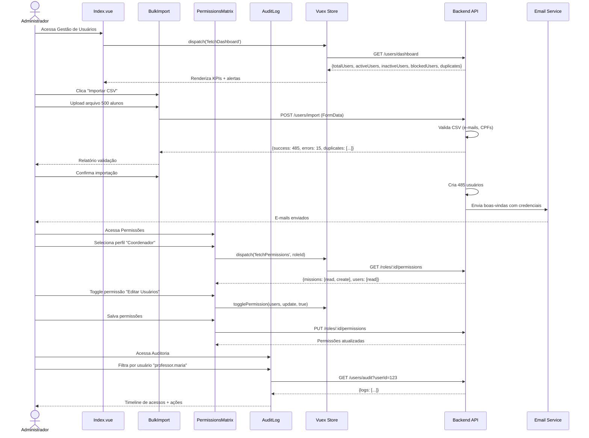

# ADMIN-006: User Management (Gestão de Usuários)

:::info Contexto
**Jornada**: Admin/Coordenação  
**Prioridade**: Baixa  
**Complexidade**: Alta  
**Status**: ✅ Documentado (AS-IS Baseline)
:::

## 1. Visão Geral

### Problema

Administradores de rede precisam gerenciar milhares de usuários (professores, alunos, coordenadores, responsáveis) com diferentes perfis de acesso, mas enfrentam dificuldades para cadastrar e provisionar usuários em massa, configurar permissões granulares por funcionalidade, gerenciar ciclo de vida de usuários (criação, suspensão, reativação, exclusão), garantir conformidade com LGPD e políticas de privacidade, auditar acessos e ações de usuários para compliance, resetar senhas e desbloquear contas de forma segura, sincronizar usuários com sistemas externos (AD, Google Workspace), e identificar contas inativas ou duplicadas para limpeza.

**Dores principais**:
- Falta de interface centralizada para gerenciar todos usuários da rede
- Impossibilidade de cadastro em massa via CSV/Excel (onboarding escolas)
- Ausência de configuração granular de permissões por funcionalidade (matriz RBAC)
- Dificuldade para gerenciar ciclo de vida completo do usuário
- Falta de auditoria de acessos e ações para compliance LGPD
- Processos manuais de reset senha e desbloqueio de contas
- Impossibilidade de sincronizar com AD/LDAP ou Google Workspace automaticamente
- Ausência de detecção de contas duplicadas ou inativas para limpeza
- Falta de relatórios de uso por usuário/perfil para otimização de licenças
- Dificuldade para delegar gestão de usuários por instituição mantendo governança

### Solução AS-IS

Sistema de gestão de usuários com:
- **Dashboard de Usuários** com totalizadores por perfil e status
- **Cadastro Individual e em Massa** via CSV/Excel com validação automática
- **Matriz RBAC Granular** (Role-Based Access Control) por funcionalidade
- **Gestão de Ciclo de Vida** (criação, ativação, suspensão, exclusão, reativação)
- **Auditoria Completa** de acessos, ações, mudanças de permissões (LGPD compliance)
- **Self-Service de Senha** com reset seguro via e-mail/SMS
- **Sincronização Automática** com AD/LDAP, Google Workspace, Azure AD
- **Detecção de Duplicatas** e contas inativas com sugestões de limpeza
- **Relatórios de Uso** por usuário, perfil, funcionalidade para otimização
- **Delegação Hierárquica** de gestão por instituição com governança centralizada

## 2. Rotas e Navegação

```typescript
// src/router/admin-routes/user-management-routes.js
export default [
  {
    path: '/admin/users',
    name: 'admin-users',
    component: () => import('@/views/pages/admin-context/users/Index.vue'),
    meta: {
      resource: 'UserManagement',
      action: 'read',
      breadcrumb: [
        { text: 'Início', to: '/' },
        { text: 'Gestão de Usuários', active: true }
      ]
    }
  },
  {
    path: '/admin/users/create',
    name: 'admin-user-create',
    component: () => import('@/views/pages/admin-context/users/UserForm.vue'),
    meta: {
      resource: 'UserManagement',
      action: 'write'
    }
  },
  {
    path: '/admin/users/:userId',
    name: 'admin-user-details',
    component: () => import('@/views/pages/admin-context/users/UserDetails.vue'),
    meta: {
      resource: 'UserManagement',
      action: 'read'
    }
  },
  {
    path: '/admin/users/:userId/edit',
    name: 'admin-user-edit',
    component: () => import('@/views/pages/admin-context/users/UserForm.vue'),
    meta: {
      resource: 'UserManagement',
      action: 'write'
    }
  },
  {
    path: '/admin/users/import',
    name: 'admin-users-import',
    component: () => import('@/views/pages/admin-context/users/BulkImport.vue'),
    meta: {
      resource: 'UserManagement',
      action: 'write'
    }
  },
  {
    path: '/admin/users/permissions',
    name: 'admin-permissions',
    component: () => import('@/views/pages/admin-context/users/PermissionsMatrix.vue'),
    meta: {
      resource: 'UserManagement',
      action: 'write'
    }
  },
  {
    path: '/admin/users/audit',
    name: 'admin-users-audit',
    component: () => import('@/views/pages/admin-context/users/AuditLog.vue'),
    meta: {
      resource: 'UserManagement',
      action: 'read'
    }
  },
  {
    path: '/admin/users/sync',
    name: 'admin-users-sync',
    component: () => import('@/views/pages/admin-context/users/ExternalSync.vue'),
    meta: {
      resource: 'UserManagement',
      action: 'write'
    }
  }
]
```

**Fluxo de navegação**:
1. Admin acessa Dashboard de Gestão de Usuários
2. Visualiza totalizadores (total usuários, ativos, inativos, bloqueados) por perfil
3. Clica "Importar CSV" → Faz upload CSV com 500 novos alunos
4. Sistema valida automaticamente (e-mails duplicados, CPFs inválidos) → Relatório de validação
5. Confirma importação → 485 usuários criados com sucesso (15 rejeitados por duplicatas)
6. Sistema envia e-mails de boas-vindas automaticamente com credenciais temporárias
7. Acessa "Permissões" → Configura matriz RBAC para perfil "Coordenador Pedagógico"
8. Define permissões granulares: pode criar missões ✅, pode editar usuários ✅, pode excluir turmas ❌
9. Acessa "Auditoria" → Filtra logs de acesso do usuário "professor.maria@escola.com" últimos 30 dias
10. Identifica login suspeito de IP estrangeiro → Bloqueia usuário e força reset de senha

## 3. Arquitetura de Componentes

### Estrutura de Pastas

```
src/views/pages/admin-context/users/
├── Index.vue                      # Dashboard de usuários
├── UserForm.vue                   # Formulário criar/editar
├── UserDetails.vue                # Detalhes do usuário
├── BulkImport.vue                 # Importação em massa
├── PermissionsMatrix.vue          # Matriz de permissões RBAC
├── AuditLog.vue                   # Log de auditoria
├── ExternalSync.vue               # Sincronização externa
├── useUserManagement.js           # Composable de domínio
├── components/
│   ├── UserCard.vue               # Card de usuário
│   ├── UserStatusBadge.vue        # Badge de status
│   ├── RoleSelector.vue           # Seletor de perfil
│   ├── PermissionToggle.vue       # Toggle de permissão
│   ├── BulkActions.vue            # Ações em massa
│   ├── ImportValidator.vue        # Validador de importação
│   ├── PasswordResetModal.vue     # Modal reset senha
│   ├── SuspendUserModal.vue       # Modal suspender usuário
│   ├── DuplicateDetector.vue      # Detector de duplicatas
│   ├── InactivityAlert.vue        # Alerta de inatividade
│   ├── SyncStatus.vue             # Status de sincronização
│   └── AuditTimeline.vue          # Timeline de auditoria
└── charts/
    ├── UsersByRole.vue            # Usuários por perfil
    ├── ActivityHeatmap.vue        # Mapa de calor de atividade
    └── UsageMetrics.vue           # Métricas de uso
```

### Responsabilidades dos Componentes

#### Index.vue (Dashboard de Usuários)
```vue
<template>
  <section>
    <!-- KPIs de Usuários -->
    <b-row class="mb-3">
      <b-col cols="12" md="3">
        <b-card class="text-center">
          <h2 class="mb-0 text-primary">{{ totalUsers }}</h2>
          <p class="text-muted mb-0">Total de Usuários</p>
        </b-card>
      </b-col>
      <b-col cols="12" md="3">
        <b-card class="text-center">
          <h2 class="mb-0 text-success">{{ activeUsers }}</h2>
          <p class="text-muted mb-0">Ativos</p>
        </b-card>
      </b-col>
      <b-col cols="12" md="3">
        <b-card class="text-center">
          <h2 class="mb-0 text-warning">{{ inactiveUsers }}</h2>
          <p class="text-muted mb-0">Inativos (>90 dias)</p>
        </b-card>
      </b-col>
      <b-col cols="12" md="3">
        <b-card class="text-center">
          <h2 class="mb-0 text-danger">{{ blockedUsers }}</h2>
          <p class="text-muted mb-0">Bloqueados</p>
        </b-card>
      </b-col>
    </b-row>

    <!-- Ações Rápidas -->
    <b-card class="mb-3">
      <div class="d-flex justify-content-between align-items-center">
        <h5 class="mb-0">Gestão de Usuários</h5>
        <div>
          <b-button variant="outline-primary" class="mr-2" @click="openImport">
            <span class="material-symbols-outlined">upload_file</span>
            Importar CSV
          </b-button>
          <b-button variant="primary" @click="createUser">
            <span class="material-symbols-outlined">person_add</span>
            Novo Usuário
          </b-button>
        </div>
      </div>
    </b-card>

    <!-- Alertas de Inatividade -->
    <InactivityAlert
      v-if="inactiveUsersCount > 0"
      :count="inactiveUsersCount"
      class="mb-3"
      @view="viewInactiveUsers"
    />

    <!-- Duplicatas Detectadas -->
    <DuplicateDetector
      v-if="duplicatesCount > 0"
      :count="duplicatesCount"
      class="mb-3"
      @review="reviewDuplicates"
    />

    <!-- Tabs -->
    <b-tabs content-class="mt-3" pills>
      <b-tab title="Todos" active>
        <!-- Filtros -->
        <b-card class="mb-3">
          <b-row>
            <b-col cols="12" md="3">
              <b-form-group label="Perfil">
                <ESelect
                  v-model="selectedRole"
                  :options="roles"
                  label="name"
                  track-by="id"
                  :clearable="true"
                  placeholder="Todos os perfis"
                />
              </b-form-group>
            </b-col>
            <b-col cols="12" md="3">
              <b-form-group label="Status">
                <ESelect
                  v-model="selectedStatus"
                  :options="statuses"
                  label="name"
                  track-by="id"
                  :clearable="true"
                  placeholder="Todos os status"
                />
              </b-form-group>
            </b-col>
            <b-col cols="12" md="3">
              <b-form-group label="Instituição">
                <ESelect
                  v-model="selectedInstitution"
                  :options="institutions"
                  label="name"
                  track-by="id"
                  :clearable="true"
                  placeholder="Todas as instituições"
                />
              </b-form-group>
            </b-col>
            <b-col cols="12" md="3">
              <b-form-group label="Buscar">
                <b-form-input
                  v-model="searchQuery"
                  placeholder="Nome, e-mail ou CPF"
                />
              </b-form-group>
            </b-col>
          </b-row>
        </b-card>

        <!-- Ações em Massa -->
        <BulkActions
          v-if="selectedUsers.length > 0"
          :selected-count="selectedUsers.length"
          @activate="activateSelected"
          @suspend="suspendSelected"
          @delete="deleteSelected"
          class="mb-3"
        />

        <!-- Tabela de Usuários -->
        <ListTable
          ref="userTableRef"
          :data-table="users"
          :table-columns="userColumns"
          :loading="loading"
          :total-data="totalUsersCount"
          search-placeholder="Buscar usuários"
          @change="handleTableChange"
        >
          <!-- Status -->
          <template #cell(status)="{ item }">
            <UserStatusBadge :status="item.status" />
          </template>

          <!-- Último Acesso -->
          <template #cell(lastAccess)="{ item }">
            <span v-if="item.lastAccessAt">
              {{ formatDate(item.lastAccessAt) }}
            </span>
            <span v-else class="text-muted">Nunca</span>
          </template>

          <!-- Ações -->
          <template #cell(actions)="{ item }">
            <b-dropdown variant="link" no-caret>
              <template #button-content>
                <span class="material-symbols-outlined">more_vert</span>
              </template>
              <b-dropdown-item @click="viewUser(item)">
                <span class="material-symbols-outlined">visibility</span>
                Ver Detalhes
              </b-dropdown-item>
              <b-dropdown-item @click="editUser(item)">
                <span class="material-symbols-outlined">edit</span>
                Editar
              </b-dropdown-item>
              <b-dropdown-item @click="resetPassword(item)">
                <span class="material-symbols-outlined">lock_reset</span>
                Resetar Senha
              </b-dropdown-item>
              <b-dropdown-divider />
              <b-dropdown-item
                v-if="item.status === 'active'"
                @click="suspendUser(item)"
                variant="warning"
              >
                <span class="material-symbols-outlined">block</span>
                Suspender
              </b-dropdown-item>
              <b-dropdown-item
                v-else
                @click="activateUser(item)"
                variant="success"
              >
                <span class="material-symbols-outlined">check_circle</span>
                Ativar
              </b-dropdown-item>
            </b-dropdown>
          </template>
        </ListTable>
      </b-tab>

      <b-tab title="Permissões">
        <PermissionsMatrix />
      </b-tab>

      <b-tab title="Auditoria">
        <AuditLog />
      </b-tab>

      <b-tab title="Sincronização">
        <ExternalSync />
      </b-tab>

      <b-tab title="Métricas">
        <b-row>
          <b-col cols="12" md="6" class="mb-3">
            <b-card>
              <h6>Usuários por Perfil</h6>
              <UsersByRole :data="usersByRole" />
            </b-card>
          </b-col>
          <b-col cols="12" md="6" class="mb-3">
            <b-card>
              <h6>Atividade por Hora</h6>
              <ActivityHeatmap :data="activityData" />
            </b-card>
          </b-col>
          <b-col cols="12" class="mb-3">
            <b-card>
              <h6>Métricas de Uso</h6>
              <UsageMetrics :data="usageData" />
            </b-card>
          </b-col>
        </b-row>
      </b-tab>
    </b-tabs>

    <!-- Modals -->
    <PasswordResetModal ref="resetModalRef" @reset="handlePasswordReset" />
    <SuspendUserModal ref="suspendModalRef" @suspend="handleSuspend" />
  </section>
</template>

<script>
import ESelect from '@/components/selects/ESelect.vue'
import ListTable from '@/components/table/ListTable.vue'
import UserStatusBadge from './components/UserStatusBadge.vue'
import BulkActions from './components/BulkActions.vue'
import InactivityAlert from './components/InactivityAlert.vue'
import DuplicateDetector from './components/DuplicateDetector.vue'
import PermissionsMatrix from './PermissionsMatrix.vue'
import AuditLog from './AuditLog.vue'
import ExternalSync from './ExternalSync.vue'
import UsersByRole from './charts/UsersByRole.vue'
import ActivityHeatmap from './charts/ActivityHeatmap.vue'
import UsageMetrics from './charts/UsageMetrics.vue'
import PasswordResetModal from './components/PasswordResetModal.vue'
import SuspendUserModal from './components/SuspendUserModal.vue'
import store from '@/store'
import moduleUsers from '@/store/pageModules/users/module-user-management.js'
import { defineComponent, ref, computed, onMounted, onUnmounted } from '@vue/composition-api'
import useUserManagement from './useUserManagement.js'

export default defineComponent({
  name: 'UserManagementIndex',
  components: {
    ESelect,
    ListTable,
    UserStatusBadge,
    BulkActions,
    InactivityAlert,
    DuplicateDetector,
    PermissionsMatrix,
    AuditLog,
    ExternalSync,
    UsersByRole,
    ActivityHeatmap,
    UsageMetrics,
    PasswordResetModal,
    SuspendUserModal
  },
  setup() {
    store.registerModule('userManagement', moduleUsers)

    const {
      totalUsers,
      activeUsers,
      inactiveUsers,
      blockedUsers,
      inactiveUsersCount,
      duplicatesCount,
      users,
      totalUsersCount,
      loading,
      usersByRole,
      activityData,
      usageData,
      roles,
      statuses,
      institutions,
      selectedRole,
      selectedStatus,
      selectedInstitution,
      searchQuery
    } = useUserManagement()

    const userTableRef = ref(null)
    const resetModalRef = ref(null)
    const suspendModalRef = ref(null)
    const selectedUsers = ref([])

    const userColumns = [
      { key: 'name', label: 'Nome', sortable: true },
      { key: 'email', label: 'E-mail', sortable: true },
      { key: 'role', label: 'Perfil', sortable: true },
      { key: 'institution', label: 'Instituição' },
      { key: 'status', label: 'Status', sortable: true },
      { key: 'lastAccess', label: 'Último Acesso', sortable: true },
      { key: 'actions', label: 'Ações' }
    ]

    const handleTableChange = ({ currentPage, perPage, sortBy, isSortDirDesc, searchQuery }) => {
      store.commit('userManagement/setParams', {
        Search: searchQuery,
        OrderBy: sortBy,
        Ascending: `${!isSortDirDesc}`,
        Page: currentPage,
        PageSize: perPage
      })
      store.dispatch('userManagement/fetchUsers')
    }

    const formatDate = (date) => {
      return new Date(date).toLocaleDateString('pt-BR')
    }

    const openImport = () => {
      // Navega para importação
    }

    const createUser = () => {
      // Navega para criação
    }

    const viewInactiveUsers = () => {
      selectedStatus.value = statuses.value.find(s => s.id === 'inactive')
    }

    const reviewDuplicates = () => {
      // Abre modal de duplicatas
    }

    const resetPassword = (user) => {
      resetModalRef.value.open(user)
    }

    const suspendUser = (user) => {
      suspendModalRef.value.open(user)
    }

    onMounted(() => {
      store.dispatch('userManagement/fetchDashboard')
      store.dispatch('userManagement/fetchUsers')
    })

    onUnmounted(() => {
      store.commit('userManagement/reset')
      store.unregisterModule('userManagement')
    })

    return {
      totalUsers,
      activeUsers,
      inactiveUsers,
      blockedUsers,
      inactiveUsersCount,
      duplicatesCount,
      users,
      totalUsersCount,
      loading,
      usersByRole,
      activityData,
      usageData,
      roles,
      statuses,
      institutions,
      selectedRole,
      selectedStatus,
      selectedInstitution,
      searchQuery,
      userTableRef,
      resetModalRef,
      suspendModalRef,
      selectedUsers,
      userColumns,
      handleTableChange,
      formatDate,
      openImport,
      createUser,
      viewInactiveUsers,
      reviewDuplicates,
      resetPassword,
      suspendUser
    }
  }
})
</script>
```

#### PermissionsMatrix.vue (Matriz RBAC)
```vue
<template>
  <div>
    <!-- Seletor de Perfil -->
    <b-card class="mb-3">
      <b-form-group label="Configurar Permissões para o Perfil">
        <ESelect
          v-model="selectedRole"
          :options="roles"
          label="name"
          track-by="id"
        />
      </b-form-group>
    </b-card>

    <!-- Matriz de Permissões -->
    <b-card v-if="selectedRole">
      <h5 class="mb-3">Permissões do Perfil: {{ selectedRole.name }}</h5>

      <b-table-simple responsive>
        <b-thead>
          <b-tr>
            <b-th>Funcionalidade</b-th>
            <b-th class="text-center">Visualizar</b-th>
            <b-th class="text-center">Criar</b-th>
            <b-th class="text-center">Editar</b-th>
            <b-th class="text-center">Excluir</b-th>
          </b-tr>
        </b-thead>
        <b-tbody>
          <b-tr v-for="resource in resources" :key="resource.id">
            <b-td>
              <strong>{{ resource.name }}</strong>
              <br>
              <small class="text-muted">{{ resource.description }}</small>
            </b-td>
            <b-td class="text-center">
              <PermissionToggle
                :value="hasPermission(resource.id, 'read')"
                @input="togglePermission(resource.id, 'read', $event)"
              />
            </b-td>
            <b-td class="text-center">
              <PermissionToggle
                :value="hasPermission(resource.id, 'create')"
                @input="togglePermission(resource.id, 'create', $event)"
                :disabled="!hasPermission(resource.id, 'read')"
              />
            </b-td>
            <b-td class="text-center">
              <PermissionToggle
                :value="hasPermission(resource.id, 'update')"
                @input="togglePermission(resource.id, 'update', $event)"
                :disabled="!hasPermission(resource.id, 'read')"
              />
            </b-td>
            <b-td class="text-center">
              <PermissionToggle
                :value="hasPermission(resource.id, 'delete')"
                @input="togglePermission(resource.id, 'delete', $event)"
                :disabled="!hasPermission(resource.id, 'read')"
              />
            </b-td>
          </b-tr>
        </b-tbody>
      </b-table-simple>

      <div class="mt-3 text-right">
        <b-button variant="outline-secondary" class="mr-2" @click="resetPermissions">
          Restaurar Padrão
        </b-button>
        <b-button variant="primary" @click="savePermissions">
          Salvar Permissões
        </b-button>
      </div>
    </b-card>
  </div>
</template>

<script>
import ESelect from '@/components/selects/ESelect.vue'
import PermissionToggle from './components/PermissionToggle.vue'
import useUserManagement from './useUserManagement.js'

export default {
  components: { ESelect, PermissionToggle },
  setup() {
    const { roles, selectedRole, resources, hasPermission, togglePermission, savePermissions, resetPermissions } = useUserManagement()

    return {
      roles,
      selectedRole,
      resources,
      hasPermission,
      togglePermission,
      savePermissions,
      resetPermissions
    }
  }
}
</script>
```

## 4. Módulo Vuex

```javascript
// src/store/pageModules/users/module-user-management.js
import {
  getDashboard,
  getUsers,
  getUserDetails,
  getPermissions,
  getAuditLog,
  importUsers,
  syncExternalUsers
} from '@/services/admin-context/UserManagementService'

export default {
  namespaced: true,
  
  state: {
    dashboard: null,
    users: [],
    currentUser: null,
    permissions: {},
    auditLog: [],
    syncStatus: null,
    duplicates: [],
    params: {
      Search: '',
      OrderBy: 'name',
      Ascending: 'true',
      Page: 1,
      PageSize: 20
    },
    loading: false
  },

  mutations: {
    dashboard(state, payload) {
      state.dashboard = payload
    },
    users(state, payload) {
      state.users = payload
    },
    currentUser(state, payload) {
      state.currentUser = payload
    },
    permissions(state, payload) {
      state.permissions = payload
    },
    auditLog(state, payload) {
      state.auditLog = payload
    },
    syncStatus(state, payload) {
      state.syncStatus = payload
    },
    duplicates(state, payload) {
      state.duplicates = payload
    },
    setParams(state, payload) {
      state.params = { ...state.params, ...payload }
    },
    loading(state, payload) {
      state.loading = payload
    },
    reset(state) {
      state.dashboard = null
      state.users = []
      state.currentUser = null
      state.permissions = {}
      state.auditLog = []
      state.syncStatus = null
      state.duplicates = []
      state.params = {
        Search: '',
        OrderBy: 'name',
        Ascending: 'true',
        Page: 1,
        PageSize: 20
      }
      state.loading = false
    }
  },

  getters: {
    dashboard: state => state.dashboard,
    users: state => state.users,
    currentUser: state => state.currentUser,
    permissions: state => state.permissions,
    auditLog: state => state.auditLog,
    syncStatus: state => state.syncStatus,
    duplicates: state => state.duplicates,
    params: state => state.params,
    loading: state => state.loading,

    // Computed: Total de usuários
    totalUsers: state => state.dashboard?.totalUsers || 0,

    // Computed: Usuários ativos
    activeUsers: state => state.dashboard?.activeUsers || 0,

    // Computed: Usuários inativos (>90 dias sem acesso)
    inactiveUsers: state => state.dashboard?.inactiveUsers || 0,

    // Computed: Usuários bloqueados
    blockedUsers: state => state.dashboard?.blockedUsers || 0,

    // Computed: Total de usuários retornados na query
    totalUsersCount: state => state.dashboard?.totalCount || 0,

    // Computed: Contagem de usuários inativos para alerta
    inactiveUsersCount: state => {
      if (!state.dashboard?.inactiveUsers) return 0
      return state.dashboard.inactiveUsers
    },

    // Computed: Contagem de duplicatas detectadas
    duplicatesCount: state => state.duplicates.length,

    // Computed: Usuários por perfil (para gráfico)
    usersByRole: state => {
      if (!state.dashboard?.usersByRole) return []
      return state.dashboard.usersByRole
    },

    // Computed: Dados de atividade por hora (heatmap)
    activityData: state => state.dashboard?.activityData || [],

    // Computed: Métricas de uso
    usageData: state => state.dashboard?.usageData || {},

    // Computed: Usuários com permissões específicas
    usersWithPermission: state => (resource, action) => {
      return state.users.filter(user => {
        const rolePermissions = state.permissions[user.roleId]
        if (!rolePermissions) return false
        return rolePermissions[resource]?.includes(action)
      })
    },

    // Computed: Verificar se perfil tem permissão
    hasRolePermission: state => (roleId, resource, action) => {
      const rolePermissions = state.permissions[roleId]
      if (!rolePermissions) return false
      return rolePermissions[resource]?.includes(action) || false
    }
  },

  actions: {
    async fetchDashboard({ commit }) {
      commit('loading', true)
      try {
        const response = await getDashboard()
        commit('dashboard', response.data)
        commit('duplicates', response.data.duplicates || [])
      } catch (error) {
        console.error('Erro ao buscar dashboard:', error)
      } finally {
        commit('loading', false)
      }
    },

    async fetchUsers({ commit, state }) {
      commit('loading', true)
      try {
        const response = await getUsers(state.params)
        commit('users', response.data.users)
        commit('dashboard', {
          ...state.dashboard,
          totalCount: response.data.totalCount
        })
      } catch (error) {
        console.error('Erro ao buscar usuários:', error)
      } finally {
        commit('loading', false)
      }
    },

    async fetchPermissions({ commit }, roleId) {
      try {
        const response = await getPermissions(roleId)
        commit('permissions', {
          ...state.permissions,
          [roleId]: response.data.permissions
        })
      } catch (error) {
        console.error('Erro ao buscar permissões:', error)
      }
    }
  }
}
```

## 5. Services (API Layer)

```javascript
// src/services/admin-context/UserManagementService.js
import { axiosIns } from '@axios'

/**
 * Busca dashboard de usuários
 * @returns {Promise<{data: Object}>}
 */
export const getDashboard = () => {
  return axiosIns.get('/admin/users/dashboard')
}

/**
 * Busca lista de usuários com paginação
 * @param {Object} params - Parâmetros de busca
 * @returns {Promise<{data: Object}>}
 */
export const getUsers = (params) => {
  return axiosIns.get('/admin/users', { params })
}

/**
 * Busca detalhes de um usuário
 * @param {number} userId - ID do usuário
 * @returns {Promise<{data: Object}>}
 */
export const getUserDetails = (userId) => {
  return axiosIns.get(`/admin/users/${userId}`)
}

/**
 * Busca permissões de um perfil
 * @param {number} roleId - ID do perfil
 * @returns {Promise<{data: Object}>}
 */
export const getPermissions = (roleId) => {
  return axiosIns.get(`/admin/users/roles/${roleId}/permissions`)
}

/**
 * Busca log de auditoria
 * @param {Object} params - Filtros de auditoria
 * @returns {Promise<{data: Object}>}
 */
export const getAuditLog = (params) => {
  return axiosIns.get('/admin/users/audit', { params })
}

/**
 * Importa usuários em massa via CSV
 * @param {FormData} formData - Arquivo CSV
 * @returns {Promise<{data: Object}>}
 */
export const importUsers = (formData) => {
  return axiosIns.post('/admin/users/import', formData, {
    headers: { 'Content-Type': 'multipart/form-data' }
  })
}

/**
 * Sincroniza usuários com sistema externo
 * @param {Object} syncConfig - Configuração de sincronização
 * @returns {Promise<{data: Object}>}
 */
export const syncExternalUsers = (syncConfig) => {
  return axiosIns.post('/admin/users/sync', syncConfig)
}
```

## 6. Composable de Domínio

```javascript
// src/views/pages/admin-context/users/useUserManagement.js
import store from '@/store'
import { computed } from '@vue/composition-api'

const moduleName = 'userManagement'

export default function useUserManagement() {
  const dashboard = computed(
    () => store.getters[`${moduleName}/dashboard`]
  )

  const totalUsers = computed(
    () => store.getters[`${moduleName}/totalUsers`]
  )

  const activeUsers = computed(
    () => store.getters[`${moduleName}/activeUsers`]
  )

  const inactiveUsers = computed(
    () => store.getters[`${moduleName}/inactiveUsers`]
  )

  const blockedUsers = computed(
    () => store.getters[`${moduleName}/blockedUsers`]
  )

  const inactiveUsersCount = computed(
    () => store.getters[`${moduleName}/inactiveUsersCount`]
  )

  const duplicatesCount = computed(
    () => store.getters[`${moduleName}/duplicatesCount`]
  )

  const users = computed(
    () => store.getters[`${moduleName}/users`]
  )

  const totalUsersCount = computed(
    () => store.getters[`${moduleName}/totalUsersCount`]
  )

  const usersByRole = computed(
    () => store.getters[`${moduleName}/usersByRole`]
  )

  const activityData = computed(
    () => store.getters[`${moduleName}/activityData`]
  )

  const usageData = computed(
    () => store.getters[`${moduleName}/usageData`]
  )

  const loading = computed(
    () => store.getters[`${moduleName}/loading`]
  )

  // Opções para filtros
  const roles = computed(() => [
    { id: 'teacher', name: 'Professor' },
    { id: 'student', name: 'Aluno' },
    { id: 'coordinator', name: 'Coordenador' },
    { id: 'manager', name: 'Gestor' },
    { id: 'responsible', name: 'Responsável' }
  ])

  const statuses = computed(() => [
    { id: 'active', name: 'Ativo' },
    { id: 'inactive', name: 'Inativo' },
    { id: 'blocked', name: 'Bloqueado' },
    { id: 'pending', name: 'Pendente' }
  ])

  const institutions = computed(() => [
    // Carregado do store ou API
  ])

  const selectedRole = computed({
    get: () => store.state[moduleName]?.selectedRole || null,
    set: val => store.commit(`${moduleName}/selectedRole`, val)
  })

  const selectedStatus = computed({
    get: () => store.state[moduleName]?.selectedStatus || null,
    set: val => store.commit(`${moduleName}/selectedStatus`, val)
  })

  const selectedInstitution = computed({
    get: () => store.state[moduleName]?.selectedInstitution || null,
    set: val => store.commit(`${moduleName}/selectedInstitution`, val)
  })

  const searchQuery = computed({
    get: () => store.state[moduleName]?.params?.Search || '',
    set: val => store.commit(`${moduleName}/setParams`, { Search: val })
  })

  // Recursos para matriz de permissões
  const resources = computed(() => [
    { id: 'missions', name: 'Missões', description: 'Criar e gerenciar missões' },
    { id: 'classes', name: 'Turmas', description: 'Gerenciar turmas e alunos' },
    { id: 'reports', name: 'Relatórios', description: 'Acessar relatórios' },
    { id: 'users', name: 'Usuários', description: 'Gerenciar usuários' }
  ])

  const hasPermission = (resourceId, action) => {
    if (!selectedRole.value) return false
    return store.getters[`${moduleName}/hasRolePermission`](
      selectedRole.value.id,
      resourceId,
      action
    )
  }

  const togglePermission = (resourceId, action, value) => {
    // Toggle permission logic
  }

  const savePermissions = async () => {
    // Save permissions logic
  }

  const resetPermissions = () => {
    // Reset to default permissions
  }

  return {
    moduleName,
    dashboard,
    totalUsers,
    activeUsers,
    inactiveUsers,
    blockedUsers,
    inactiveUsersCount,
    duplicatesCount,
    users,
    totalUsersCount,
    usersByRole,
    activityData,
    usageData,
    loading,
    roles,
    statuses,
    institutions,
    selectedRole,
    selectedStatus,
    selectedInstitution,
    searchQuery,
    resources,
    hasPermission,
    togglePermission,
    savePermissions,
    resetPermissions
  }
}
```

## 7. Fluxo de Usuário



## 8. Estados da Interface

### Estado 1: Dashboard
```typescript
{
  dashboard: {
    totalUsers: 5240,
    activeUsers: 4850,
    inactiveUsers: 320,
    blockedUsers: 70,
    usersByRole: [
      { role: 'Professor', count: 450 },
      { role: 'Aluno', count: 4200 },
      { role: 'Coordenador', count: 45 }
    ],
    duplicates: [
      { id: 1, name: 'João Silva', email: 'joao@escola.com', duplicateOf: 234 }
    ]
  }
}
```

## 9. API Endpoints

### GET /admin/users/dashboard
**Response**:
```json
{
  "totalUsers": 5240,
  "activeUsers": 4850,
  "inactiveUsers": 320,
  "blockedUsers": 70,
  "usersByRole": [...],
  "duplicates": [...]
}
```

### POST /admin/users/import
**Request**: FormData with CSV file
**Response**:
```json
{
  "success": 485,
  "errors": 15,
  "duplicates": [...],
  "errorDetails": [...]
}
```

## 10. Screenshots (AS-IS)


*Dashboard de usuários com KPIs*


*Matriz de permissões granulares*

## 11. Melhorias TO-BE

### 1. IA de Detecção de Anomalias
**TO-BE**: IA analisa padrões de acesso → detecta anomalias (login horário incomum, IP suspeito, ações fora do perfil) → bloqueia automaticamente + alerta admin

### 2. Provisionamento Zero-Touch
**TO-BE**: Integração profunda com sistemas RH → quando funcionário contratado, usuário criado automaticamente com perfil correto, quando demitido, usuário desativado em todos sistemas (Single Sign-On reverso)

### 3. Self-Service Portal Avançado
**TO-BE**: Portal completo para usuários gerenciarem próprio perfil (foto, preferências, notificações), solicitarem mudanças de permissões com workflow aprovação, visualizarem próprio audit trail para transparência

### 4. IA de Recomendação de Permissões
**TO-BE**: IA analisa uso real de funcionalidades por perfil → recomenda ajustes de permissões (Ex: 80% Coordenadores nunca usam funcionalidade X → sugere remover permissão para reduzir superfície de ataque)

### 5. Blockchain para Audit Trail
**TO-BE**: Logs de auditoria gravados em blockchain imutável (compliance LGPD total), impossível alterar histórico, certificação legal de logs para processos judiciais

## 12. Testes Recomendados

### Testes Unitários
```javascript
describe('useUserManagement', () => {
  it('deve calcular total de usuários inativos corretamente', () => {
    const mockDashboard = { inactiveUsers: 320 }
    store.commit('userManagement/dashboard', mockDashboard)
    
    const { inactiveUsersCount } = useUserManagement()
    expect(inactiveUsersCount.value).toBe(320)
  })

  it('deve verificar permissão corretamente', () => {
    const mockPermissions = {
      coordinator: {
        missions: ['read', 'create'],
        users: ['read']
      }
    }
    store.commit('userManagement/permissions', mockPermissions)
    
    const hasPermission = store.getters['userManagement/hasRolePermission']
    expect(hasPermission('coordinator', 'missions', 'create')).toBe(true)
    expect(hasPermission('coordinator', 'users', 'delete')).toBe(false)
  })
})
```

## 13. Métricas de Sucesso

### KPIs (AS-IS)
- **Tempo Provisionamento Usuário**: 2h
- **Requisições Reset Senha/Mês**: 450
- **Usuários Duplicados**: 3%
- **Compliance Auditoria**: 70%

### Metas TO-BE
- **Tempo Provisionamento**: 5min (-98%)
- **Requisições Reset**: 50 (-89%)
- **Duplicados**: 0% (-100%)
- **Compliance**: 100% (+43%)
- **Anomalias Detectadas**: 95%

---

## Dependências Relacionadas

- **[ADMIN-005: Network Management](./network-management.md)** - Gestão de usuários por instituição
- **[PROF-010: Parent Communication](../teacher/parent-communication.md)** - Gestão de responsáveis

---

:::tip Próximos Passos
1. Implementar IA de detecção de anomalias com 95% acurácia
2. Desenvolver provisionamento zero-touch com integração RH profunda
3. Criar self-service portal avançado com workflow de aprovação
4. Implementar IA de recomendação de permissões baseada em uso real
5. Integrar blockchain para audit trail imutável (compliance LGPD total)
6. Adicionar autenticação biométrica e MFA obrigatório para perfis críticos
:::
