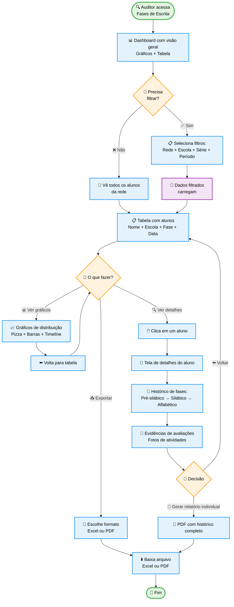
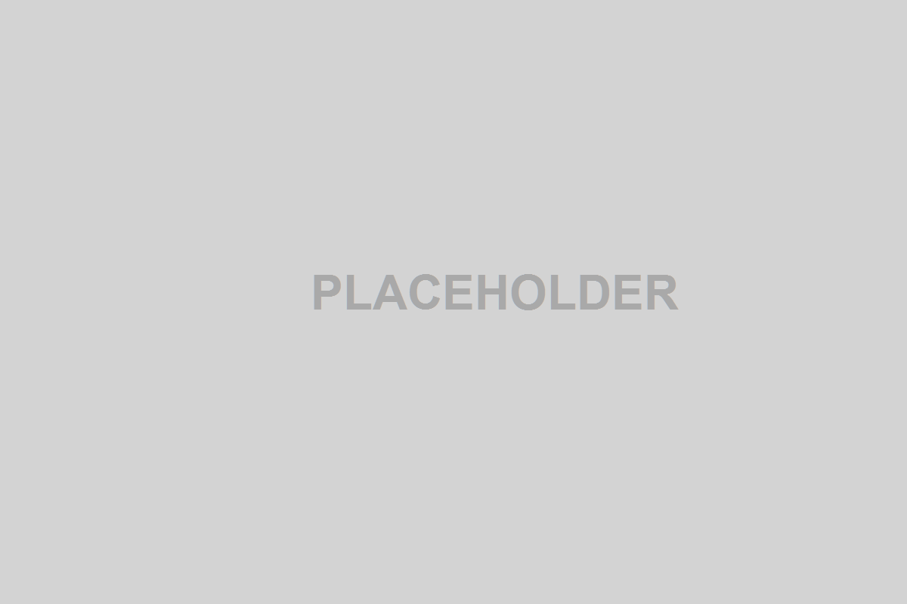

# AUDITOR-001: Writing Phases Students (Auditoria de Fases de Escrita)

:::info Contexto
**Jornada**: Auditor  
**Prioridade**: Baixa  
**Complexidade**: Média  
**Status**: ✅ Documentado (AS-IS Baseline)
:::

## 1. Visão Geral

### Problema

Auditores precisam validar a evolução da alfabetização dos estudantes através das fases de escrita, mas enfrentam: dificuldade para visualizar progresso individual e coletivo em larga escala, ausência de filtros para identificar alunos em risco, falta de comparativos entre escolas e redes, impossibilidade de exportar dados para análises externas, dificuldade para cruzar fases de escrita com outras métricas (frequência, desempenho), ausência de histórico longitudinal (evolução ao longo de anos), e relatórios genéricos que não permitem drill-down.

**Dores principais**:
- "Como identificar rapidamente alunos pré-silábicos no 3º ano?"
- "Qual a distribuição de fases de escrita na rede X?"
- "Quais escolas têm mais alunos em fases críticas?"
- "Como comparar evolução entre semestres?"
- "Preciso exportar isso para apresentar ao secretário de educação"

### Solução AS-IS

Dashboard de auditoria com:
- **Visão Consolidada** de todos os alunos da rede com sua fase de escrita atual
- **Filtros Avançados** por rede, escola, série, turma, período
- **Distribuição Visual** via gráficos de pizza e barras (fases por escola/série)
- **Timeline de Evolução** mostrando mudanças de fase ao longo do tempo
- **Alertas de Risco** destacando alunos abaixo do esperado para a idade
- **Exportação Excel/PDF** com todos os dados filtrados
- **Drill-down** para ver detalhes individuais e evidências de avaliação

## 2. Rotas e Navegação

```typescript
// src/router/auditor-routes.js
{
  path: '/auditor/writing-phases',
  name: 'auditor-writing-phases',
  component: () => import('@/views/pages/auditor-context/WritingPhases.vue'),
  meta: {
    resource: 'Auditor',
    action: 'read',
    breadcrumb: [
      { text: 'Início', to: '/auditor' },
      { text: 'Fases de Escrita', active: true }
    ]
  }
},
{
  path: '/auditor/writing-phases/student/:studentId',
  name: 'auditor-student-detail',
  component: () => import('@/views/pages/auditor-context/WritingPhaseDetail.vue'),
  meta: {
    resource: 'Auditor',
    action: 'read'
  }
}
```

## 3. Fluxo de Usuário



## 4. Screenshots AS-IS

### Dashboard Principal


**Elementos**: Cards com métricas (total alunos, distribuição por fase), gráficos (pizza + barras), filtros no topo, tabela de alunos

### Tabela de Alunos


**Elementos**: Tabela com colunas (Nome, Escola, Série, Turma, Fase Atual, Data Avaliação), badges coloridos para cada fase, botão de detalhes

### Detalhes do Aluno



**Elementos**: Header com nome e foto, timeline de evolução de fases, cards com evidências de avaliação (fotos), observações do professor

### Exportação de Relatório


**Elementos**: Modal com opções de exportação (Excel, PDF), preview do relatório, botões de download

## 5. Estrutura de Componentes

```
src/views/pages/auditor-context/
├── WritingPhases.vue                    # View principal
│   ├── <WritingPhasesFilters>           # Filtros de rede, escola, série
│   ├── <WritingPhasesMetrics>           # Cards com métricas gerais
│   ├── <WritingPhasesCharts>            # Gráficos de distribuição
│   └── <ListTable>                      # Tabela de alunos
│
└── WritingPhaseDetail.vue               # Detalhes do aluno
    ├── <StudentHeader>                  # Header com foto e nome
    ├── <PhaseTimeline>                  # Timeline de evolução
    ├── <EvidenceGallery>                # Galeria de evidências
    └── <ExportReportModal>              # Modal de exportação
```

## 6. Regras de Negócio

### Classificação de Fases de Escrita

```typescript
// Baseado na teoria de Emilia Ferreiro e Ana Teberosky
const WRITING_PHASES = {
  PRE_SYLLABIC: {
    id: 1,
    name: 'Pré-silábica',
    description: 'Não estabelece relação entre grafemas e fonemas',
    color: '#EA5455', // danger (vermelho)
    expected: ['1º ano', '2º ano início']
  },
  SYLLABIC_WITHOUT_VALUE: {
    id: 2,
    name: 'Silábica sem valor sonoro',
    description: 'Uma letra para cada sílaba, sem correspondência sonora',
    color: '#FF9F43', // warning (laranja)
    expected: ['2º ano']
  },
  SYLLABIC_WITH_VALUE: {
    id: 3,
    name: 'Silábica com valor sonoro',
    description: 'Uma letra para cada sílaba, com correspondência sonora',
    color: '#FDAC41', // warning
    expected: ['2º ano final', '3º ano início']
  },
  SYLLABIC_ALPHABETIC: {
    id: 4,
    name: 'Silábico-alfabética',
    description: 'Mistura hipótese silábica e alfabética',
    color: '#28C76F', // success (verde claro)
    expected: ['3º ano']
  },
  ALPHABETIC: {
    id: 5,
    name: 'Alfabética',
    description: 'Compreende o sistema alfabético, pode ter erros ortográficos',
    color: '#1E7E34', // success dark (verde escuro)
    expected: ['3º ano final', '4º ano+']
  }
}
```

### Alertas de Risco

```typescript
// Identificar alunos em situação crítica
const RISK_RULES = [
  {
    condition: (student) => {
      return student.grade === '3º ano' && 
             student.phase.id <= 2 // Pré-silábica ou Silábica sem valor
    },
    severity: 'HIGH',
    message: 'Aluno com atraso significativo na alfabetização',
    action: 'Requer intervenção urgente'
  },
  {
    condition: (student) => {
      return student.grade === '4º ano' && 
             student.phase.id <= 3 // Até Silábica com valor
    },
    severity: 'MEDIUM',
    message: 'Aluno abaixo do esperado para a série',
    action: 'Recomenda-se reforço'
  },
  {
    condition: (student) => {
      return student.phase.updatedAt < new Date(Date.now() - 180 * 24 * 60 * 60 * 1000) // 6 meses
    },
    severity: 'LOW',
    message: 'Fase de escrita não atualizada há mais de 6 meses',
    action: 'Solicitar reavaliação'
  }
]
```

### Cálculo de Métricas

```typescript
// Métricas exibidas no dashboard
const calculateMetrics = (students) => {
  return {
    total: students.length,
    
    // Distribuição por fase
    distribution: WRITING_PHASES.map(phase => ({
      phase: phase.name,
      count: students.filter(s => s.phase.id === phase.id).length,
      percentage: (students.filter(s => s.phase.id === phase.id).length / students.length * 100).toFixed(1)
    })),
    
    // Alunos em risco
    atRisk: students.filter(s => 
      RISK_RULES.some(rule => rule.condition(s))
    ).length,
    
    // Taxa de alfabetização (fases 4 e 5)
    literacyRate: (
      students.filter(s => s.phase.id >= 4).length / students.length * 100
    ).toFixed(1),
    
    // Evolução positiva (alunos que mudaram para fase superior nos últimos 6 meses)
    positiveEvolution: students.filter(s => {
      if (s.history.length < 2) return false
      const current = s.history[s.history.length - 1]
      const previous = s.history[s.history.length - 2]
      return current.phase.id > previous.phase.id
    }).length
  }
}
```

## 7. API Endpoints

### GET /api/auditor/writing-phases

**Query Params**:
- `networkGroupId` (opcional)
- `institutionId` (opcional)
- `grade` (opcional)
- `period` (opcional: '2024-1', '2024-2')

**Response**:
```json
{
  "students": [
    {
      "id": 12345,
      "name": "Maria Silva",
      "school": "EMEF João Paulo II",
      "grade": "3º ano",
      "class": "3A",
      "currentPhase": {
        "id": 4,
        "name": "Silábico-alfabética",
        "color": "#28C76F"
      },
      "evaluationDate": "2024-11-15",
      "teacher": "Prof. Ana Costa",
      "atRisk": false,
      "history": [
        {
          "phase": { "id": 2, "name": "Silábica sem valor" },
          "date": "2024-03-10"
        },
        {
          "phase": { "id": 3, "name": "Silábica com valor" },
          "date": "2024-07-20"
        },
        {
          "phase": { "id": 4, "name": "Silábico-alfabética" },
          "date": "2024-11-15"
        }
      ]
    }
  ],
  "metrics": {
    "total": 1250,
    "atRisk": 87,
    "literacyRate": "73.2",
    "distribution": [
      { "phase": "Pré-silábica", "count": 50, "percentage": "4.0" },
      { "phase": "Silábica sem valor", "count": 120, "percentage": "9.6" },
      { "phase": "Silábica com valor", "count": 165, "percentage": "13.2" },
      { "phase": "Silábico-alfabética", "count": 380, "percentage": "30.4" },
      { "phase": "Alfabética", "count": 535, "percentage": "42.8" }
    ]
  }
}
```

### POST /api/auditor/writing-phases/export

**Request**:
```json
{
  "format": "excel", // ou "pdf"
  "filters": {
    "networkGroupId": 5,
    "grade": "3º ano",
    "period": "2024-2"
  },
  "includeEvidence": false
}
```

**Response**:
```json
{
  "downloadUrl": "https://blob.educacross.com/exports/writing-phases-20240204.xlsx",
  "expiresAt": "2024-02-05T23:59:59Z"
}
```

## 8. Composable (useWritingPhases)

```javascript
// src/store/auditor-context/useWritingPhases.js
import store from '@/store'
import { computed } from '@vue/composition-api'

const moduleName = 'WritingPhases'

export default function useWritingPhases() {
  const students = computed({
    get: () => store.getters[`${moduleName}/students`],
    set: val => store.commit(`${moduleName}/students`, val)
  })
  
  const metrics = computed({
    get: () => store.getters[`${moduleName}/metrics`],
    set: val => store.commit(`${moduleName}/metrics`, val)
  })
  
  const loading = computed({
    get: () => store.getters[`${moduleName}/loading`],
    set: val => store.commit(`${moduleName}/loading`, val)
  })
  
  const fetchData = async (filters) => {
    loading.value = true
    try {
      const response = await getWritingPhasesData(filters)
      students.value = response.data.students
      metrics.value = response.data.metrics
    } finally {
      loading.value = false
    }
  }
  
  const exportData = async (format, filters) => {
    const response = await exportWritingPhases(format, filters)
    window.open(response.data.downloadUrl, '_blank')
  }
  
  return {
    moduleName,
    students,
    metrics,
    loading,
    fetchData,
    exportData
  }
}
```

## 9. Melhorias TO-BE

1. **IA para Diagnóstico Automático** 🤖
   - Upload de foto de atividade de escrita
   - IA identifica fase de escrita automaticamente
   - Professor valida e confirma diagnóstico

2. **Comparativos Longitudinais** 📊
   - Gráficos de evolução ano a ano (2022 vs 2023 vs 2024)
   - Benchmarking entre redes municipais
   - Identificação de melhores práticas

3. **Alertas Proativos** 🔔
   - Notificação automática quando aluno regride de fase
   - Alertas de alunos não avaliados há X meses
   - Sugestões de intervenção baseadas em dados

4. **Relatórios Narrativos Automáticos** 📝
   - IA gera texto descritivo das métricas
   - Insights automáticos ("73% dos alunos pré-silábicos estão na Escola X")
   - Exportação em formato de apresentação executiva

5. **Integração com Diário de Classe** 📚
   - Fase de escrita visível no diário do professor
   - Atualização em tempo real
   - Histórico sincronizado com frequência e notas

## 10. Referências

- [Teoria de Emilia Ferreiro - Psicogênese da Língua Escrita](https://books.google.com.br/books?id=psicogenese)
- [BNCC - Alfabetização](http://basenacionalcomum.mec.gov.br/)
- [API Docs - Writing Phases](https://apieducacrossmanager-test.azurewebsites.net/index.html)
- [Student Records (jornada relacionada)](../teacher/student-records.md)

---

**Última atualização**: 2026-02-04  
**Versão**: AS-IS v1.0  
**Status**: 📝 Documentado - Aguardando Protótipo TO-BE
