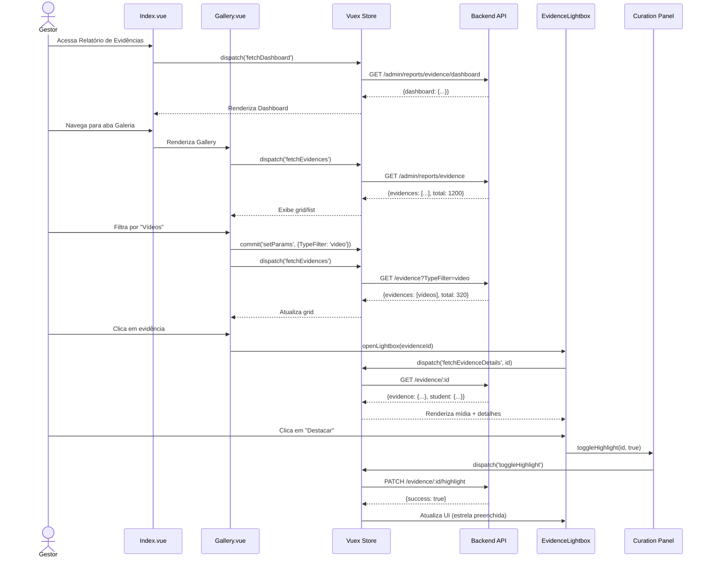

import { IconCheck } from '@site/src/components/MaterialIcon';

# ADMIN-003: Relatório de Evidências de Aprendizagem (Evidence Report)

:::info Contexto
**Jornada**: Administrador (Coordenador, Gestor, Gerente de Rede)  
**Prioridade**: Média  
**Complexidade**: Média-Alta  
**Status**: <IconCheck /> Documentado (AS-IS Baseline)
:::

## 1. Visão Geral

### Problema

Coordenadores e gestores precisam acompanhar e validar as evidências de aprendizagem produzidas pelos alunos (fotos, vídeos, textos, desenhos) para documentação pedagógica, avaliação de metodologias ativas e prestação de contas, mas não possuem ferramentas consolidadas para visualizar, filtrar, analisar e exportar esse material de forma organizada.

**Dores principais**:
- Evidências dispersas em múltiplas turmas, disciplinas e missões
- Impossibilidade de visualizar volume e qualidade de produção por instituição/turma
- Dificuldade para identificar alunos que não produzem evidências (potencial evasão)
- Falta de curadoria: Impossível destacar trabalhos exemplares para showcase
- Ausência de análise temporal: Quando e quanto os alunos produzem
- Exportação manual e demorada para relatórios de gestão ou portfólios
- Não há métricas sobre tipos de evidências mais utilizados

### Solução AS-IS

Sistema de análise e curadoria de evidências com:
- **Dashboard de produção** com KPIs de evidências consolidados (volume, tipos, alunos produtores)
- **Galeria de evidências** com filtros avançados (instituição, turma, disciplina, missão, tipo, período)
- **Visualização rica** de mídia (grid, lightbox, player de vídeo)
- **Análise de participação** (quem produz, quem não produz, distribuição por aluno)
- **Curadoria**: Destacar evidências exemplares, adicionar comentários pedagógicos
- **Análise temporal** (volume de produção ao longo do tempo, sazonalidade)
- **Exportação** de portfólios digitais e relatórios para gestão

## 2. Rotas e Navegação

```typescript
// src/router/admin-routes/evidence-routes.js
export default [
  {
    path: '/admin/reports/evidence',
    name: 'admin-evidence-report',
    component: () => import('@/views/pages/admin-context/reports/evidence/Index.vue'),
    meta: {
      resource: 'EvidenceReport',
      action: 'read',
      breadcrumb: [
        { text: 'Início', to: '/' },
        { text: 'Relatórios', to: '/admin/reports' },
        { text: 'Evidências', active: true }
      ]
    }
  },
  {
    path: '/admin/reports/evidence/:evidenceId',
    name: 'admin-evidence-details',
    component: () => import('@/views/pages/admin-context/reports/evidence/EvidenceDetails.vue'),
    meta: {
      resource: 'EvidenceReport',
      action: 'read'
    }
  },
  {
    path: '/admin/reports/evidence/student/:studentId',
    name: 'admin-student-evidence-portfolio',
    component: () => import('@/views/pages/admin-context/reports/evidence/StudentPortfolio.vue'),
    meta: {
      resource: 'EvidenceReport',
      action: 'read'
    }
  }
]
```

**Fluxo de navegação**:
1. Gestor acessa menu Relatórios → Evidências de Aprendizagem
2. Visualiza dashboard com métricas gerais de produção
3. Filtra por instituição, turma, disciplina, missão, tipo de evidência, período
4. Navega entre abas: Dashboard, Galeria, Participação, Análise Temporal, Curadoria
5. Clica em evidência → Abre lightbox/player com detalhes e opções de curadoria
6. Visualiza portfólio de aluno específico → Timeline de todas as evidências produzidas
7. Exporta relatório ou portfólio digital

## 3. Arquitetura de Componentes

### Estrutura de Pastas

```
src/views/pages/admin-context/reports/evidence/
├── Index.vue                      # Orquestrador principal
├── Dashboard.vue                  # Dashboard com KPIs e gráficos
├── Filters.vue                    # Filtros (instituição, turma, tipo, período)
├── Gallery.vue                    # Galeria de evidências (grid/list)
├── Participation.vue              # Análise de participação
├── TemporalAnalysis.vue           # Análise temporal
├── Curation.vue                   # Curadoria (destacados)
├── EvidenceDetails.vue            # Modal/Page de detalhes da evidência
├── StudentPortfolio.vue           # Portfólio completo do aluno
├── useEvidenceReport.js          # Composable de domínio
├── components/
│   ├── EvidenceKPI.vue           # Card de KPI de evidências
│   ├── EvidenceCard.vue          # Card de evidência (thumbnail + info)
│   ├── EvidenceLightbox.vue      # Lightbox para visualização
│   ├── VideoPlayer.vue           # Player de vídeo com controles
│   ├── EvidenceTypeFilter.vue    # Filtro visual por tipo (foto/vídeo/texto/áudio)
│   ├── ParticipationChart.vue    # Gráfico de participação
│   ├── StudentEvidenceList.vue   # Lista de alunos com contadores
│   ├── CurationPanel.vue         # Painel de curadoria (destacar, comentar)
│   ├── TagSelector.vue           # Seletor de tags pedagógicas
│   └── ExportPortfolioModal.vue  # Modal de exportação de portfólio
└── charts/
    ├── VolumeOverTimeChart.vue   # Linha de volume ao longo do tempo
    ├── TypeDistributionPie.vue   # Pizza de distribuição por tipo
    └── ParticipationHistogram.vue # Histograma de evidências por aluno
```

### Responsabilidades dos Componentes

#### Index.vue (Orquestrador)
```vue
<template>
  <section>
    <Filters />
    <b-tabs content-class="mt-3" pills>
      <b-tab title="Dashboard" active>
        <Dashboard />
      </b-tab>
      
      <b-tab title="Galeria" :badge="totalEvidences">
        <Gallery />
      </b-tab>
      
      <b-tab title="Participação">
        <Participation />
      </b-tab>
      
      <b-tab title="Análise Temporal">
        <TemporalAnalysis />
      </b-tab>
      
      <b-tab title="Curadoria" :badge="highlightedCount">
        <Curation />
      </b-tab>
    </b-tabs>
  </section>
</template>

<script>
import Filters from './Filters.vue'
import Dashboard from './Dashboard.vue'
import Gallery from './Gallery.vue'
import Participation from './Participation.vue'
import TemporalAnalysis from './TemporalAnalysis.vue'
import Curation from './Curation.vue'
import store from '@/store'
import moduleEvidence from '@/store/pageModules/reports/module-evidence-report.js'
import { defineComponent, computed, onMounted, onUnmounted } from '@vue/composition-api'

export default defineComponent({
  name: 'EvidenceReportIndex',
  components: {
    Filters, Dashboard, Gallery, 
    Participation, TemporalAnalysis, Curation
  },
  setup() {
    store.registerModule('evidenceReport', moduleEvidence)

    const totalEvidences = computed(() => store.getters['evidenceReport/totalData'])
    const highlightedCount = computed(
      () => store.getters['evidenceReport/highlightedEvidences']?.length || 0
    )

    onMounted(() => {
      store.dispatch('evidenceReport/fetchDashboard')
    })

    onUnmounted(() => {
      store.commit('evidenceReport/reset')
      store.unregisterModule('evidenceReport')
    })

    return { totalEvidences, highlightedCount }
  }
})
</script>
```

#### Gallery.vue (Galeria de Evidências)
```vue
<template>
  <div>
    <!-- Controles de Visualização -->
    <div class="d-flex justify-content-between align-items-center mb-2">
      <b-button-group>
        <b-button 
          :variant="viewMode === 'grid' ? 'primary' : 'outline-primary'"
          @click="setViewMode('grid')"
        >
          <span class="material-symbols-outlined">grid_view</span>
          Grid
        </b-button>
        <b-button 
          :variant="viewMode === 'list' ? 'primary' : 'outline-primary'"
          @click="setViewMode('list')"
        >
          <span class="material-symbols-outlined">view_list</span>
          Lista
        </b-button>
      </b-button-group>

      <div class="d-flex align-items-center">
        <EvidenceTypeFilter v-model="typeFilter" class="mr-2" />
        <b-dropdown text="Ordenar" variant="outline-secondary">
          <b-dropdown-item @click="setSortBy('date_desc')">
            Mais Recentes
          </b-dropdown-item>
          <b-dropdown-item @click="setSortBy('date_asc')">
            Mais Antigas
          </b-dropdown-item>
          <b-dropdown-item @click="setSortBy('student_name')">
            Nome do Aluno
          </b-dropdown-item>
          <b-dropdown-item @click="setSortBy('mission')">
            Missão
          </b-dropdown-item>
        </b-dropdown>
      </div>
    </div>

    <!-- Grid View -->
    <div v-if="viewMode === 'grid'" class="evidence-grid">
      <EvidenceCard
        v-for="evidence in evidences"
        :key="evidence.id"
        :evidence="evidence"
        @click="openLightbox(evidence.id)"
      />
    </div>

    <!-- List View -->
    <ListTable
      v-else
      :loading="loading"
      :table-columns="tableColumns"
      :data-table="evidences"
      :total-data="totalData"
      @change="handleTableChange"
    >
      <template #cell(thumbnail)="{ item }">
        
      </template>

      <template #cell(type)="{ item }">
        <b-badge :variant="getTypeVariant(item.type)">
          <span class="material-symbols-outlined">{{ getTypeIcon(item.type) }}</span>
          {{ $t(`evidenceType.${item.type}`) }}
        </b-badge>
      </template>

      <template #cell(actions)="{ item }">
        <b-button 
          size="sm" 
          variant="outline-primary"
          @click="openLightbox(item.id)"
        >
          <span class="material-symbols-outlined">visibility</span>
        </b-button>
        <b-button 
          size="sm" 
          :variant="item.isHighlighted ? 'warning' : 'outline-secondary'"
          @click="toggleHighlight(item.id)"
        >
          <span class="material-symbols-outlined">
            {{ item.isHighlighted ? 'star' : 'star_border' }}
          </span>
        </b-button>
      </template>
    </ListTable>

    <!-- Paginação -->
    <b-pagination
      v-model="currentPage"
      :total-rows="totalData"
      :per-page="perPage"
      align="center"
      @change="handlePageChange"
    />

    <!-- Lightbox -->
    <EvidenceLightbox
      ref="lightboxRef"
      :evidence-id="selectedEvidenceId"
      @close="closeLightbox"
      @highlight="handleHighlight"
      @comment="handleComment"
    />
  </div>
</template>

<script>
import EvidenceCard from './components/EvidenceCard.vue'
import EvidenceTypeFilter from './components/EvidenceTypeFilter.vue'
import EvidenceLightbox from './components/EvidenceLightbox.vue'
import ListTable from '@/components/table/ListTable.vue'
import useEvidenceReport from './useEvidenceReport.js'
import { ref, watch } from '@vue/composition-api'

export default {
  components: { 
    EvidenceCard, EvidenceTypeFilter, 
    EvidenceLightbox, ListTable 
  },
  setup() {
    const lightboxRef = ref(null)
    const selectedEvidenceId = ref(null)
    const viewMode = ref('grid')
    
    const {
      evidences,
      loading,
      totalData,
      currentPage,
      perPage,
      typeFilter,
      setViewMode,
      setSortBy,
      fetchEvidences,
      toggleHighlight,
      setTypeFilter
    } = useEvidenceReport()

    const tableColumns = [
      { key: 'thumbnail', label: '' },
      { key: 'studentName', label: 'Aluno', sortable: true },
      { key: 'missionTitle', label: 'Missão', sortable: true },
      { key: 'type', label: 'Tipo', sortable: true },
      { key: 'createdAt', label: 'Data', sortable: true },
      { key: 'actions', label: 'Ações' }
    ]

    const openLightbox = (evidenceId) => {
      selectedEvidenceId.value = evidenceId
      lightboxRef.value.show()
    }

    const closeLightbox = () => {
      selectedEvidenceId.value = null
    }

    const handleHighlight = async (evidenceId, highlighted) => {
      await toggleHighlight(evidenceId, highlighted)
    }

    const handleComment = async (evidenceId, comment) => {
      // Implementar adição de comentário
    }

    const handleTableChange = ({ currentPage, perPage, sortBy, isSortDirDesc }) => {
      fetchEvidences({
        Page: currentPage,
        PageSize: perPage,
        OrderBy: sortBy,
        Ascending: !isSortDirDesc
      })
    }

    const handlePageChange = (page) => {
      currentPage.value = page
      fetchEvidences()
    }

    const getTypeVariant = (type) => {
      const variants = {
        image: 'success',
        video: 'primary',
        audio: 'info',
        text: 'secondary'
      }
      return variants[type] || 'secondary'
    }

    const getTypeIcon = (type) => {
      const icons = {
        image: 'image',
        video: 'videocam',
        audio: 'mic',
        text: 'description'
      }
      return icons[type] || 'attachment'
    }

    watch(typeFilter, () => {
      fetchEvidences()
    })

    return {
      lightboxRef,
      selectedEvidenceId,
      viewMode,
      evidences,
      loading,
      totalData,
      currentPage,
      perPage,
      typeFilter,
      tableColumns,
      setViewMode,
      setSortBy,
      openLightbox,
      closeLightbox,
      handleHighlight,
      handleComment,
      handleTableChange,
      handlePageChange,
      toggleHighlight,
      getTypeVariant,
      getTypeIcon
    }
  }
}
</script>

<style scoped>
.evidence-grid {
  display: grid;
  grid-template-columns: repeat(auto-fill, minmax(250px, 1fr));
  gap: 1.5rem;
}

.evidence-thumbnail {
  width: 60px;
  height: 60px;
  object-fit: cover;
  border-radius: 8px;
  cursor: pointer;
  transition: transform 0.2s;
}

.evidence-thumbnail:hover {
  transform: scale(1.1);
}
</style>
```

## 4. Módulo Vuex

```javascript
// src/store/pageModules/reports/module-evidence-report.js
import {
  getEvidenceDashboard,
  getEvidenceList,
  getEvidenceDetails,
  getParticipationAnalysis,
  getTemporalAnalysis,
  toggleEvidenceHighlight,
  addEvidenceComment,
  exportEvidencePortfolio
} from '@/services/admin-context/EvidenceReportService'

export default {
  namespaced: true,
  
  state: {
    dashboard: null,
    evidences: [],
    currentEvidence: null,
    participationData: null,
    temporalData: null,
    highlightedEvidences: [],
    loading: false,
    viewMode: 'grid', // 'grid' | 'list'
    params: {
      Page: 1,
      PageSize: 24, // Para grid, múltiplo de 6
      OrderBy: 'createdAt',
      Ascending: false,
      Search: '',
      TypeFilter: null, // null | 'image' | 'video' | 'audio' | 'text'
      InstitutionId: null,
      ClassId: null,
      SubjectId: null,
      MissionId: null,
      StudentId: null,
      StartDate: null,
      EndDate: null,
      IsHighlighted: null // null | true (apenas destacados)
    },
    totalData: 0
  },

  mutations: {
    dashboard(state, payload) {
      state.dashboard = payload
    },
    evidences(state, payload) {
      state.evidences = payload
    },
    currentEvidence(state, payload) {
      state.currentEvidence = payload
    },
    participationData(state, payload) {
      state.participationData = payload
    },
    temporalData(state, payload) {
      state.temporalData = payload
    },
    highlightedEvidences(state, payload) {
      state.highlightedEvidences = payload
    },
    loading(state, payload) {
      state.loading = payload
    },
    viewMode(state, payload) {
      state.viewMode = payload
    },
    setParams(state, payload) {
      state.params = { ...state.params, ...payload }
    },
    totalData(state, payload) {
      state.totalData = payload
    },
    updateEvidenceHighlight(state, { evidenceId, isHighlighted }) {
      const evidence = state.evidences.find(e => e.id === evidenceId)
      if (evidence) {
        evidence.isHighlighted = isHighlighted
      }
      if (isHighlighted) {
        state.highlightedEvidences.push(evidenceId)
      } else {
        state.highlightedEvidences = state.highlightedEvidences.filter(
          id => id !== evidenceId
        )
      }
    },
    reset(state) {
      state.dashboard = null
      state.evidences = []
      state.currentEvidence = null
      state.participationData = null
      state.temporalData = null
      state.highlightedEvidences = []
      state.loading = false
      state.viewMode = 'grid'
      state.params = {
        Page: 1,
        PageSize: 24,
        OrderBy: 'createdAt',
        Ascending: false,
        Search: '',
        TypeFilter: null,
        InstitutionId: null,
        ClassId: null,
        SubjectId: null,
        MissionId: null,
        StudentId: null,
        StartDate: null,
        EndDate: null,
        IsHighlighted: null
      }
      state.totalData = 0
    }
  },

  getters: {
    dashboard: state => state.dashboard,
    evidences: state => state.evidences,
    currentEvidence: state => state.currentEvidence,
    participationData: state => state.participationData,
    temporalData: state => state.temporalData,
    highlightedEvidences: state => state.highlightedEvidences,
    loading: state => state.loading,
    viewMode: state => state.viewMode,
    params: state => state.params,
    totalData: state => state.totalData,

    // Computed: Evidências por tipo
    evidencesByType: state => {
      return state.evidences.reduce((acc, evidence) => {
        acc[evidence.type] = (acc[evidence.type] || 0) + 1
        return acc
      }, {})
    },

    // Computed: Taxa de produção (alunos que produziram / total)
    productionRate: state => {
      if (!state.participationData) return 0
      const { studentsWithEvidence, totalStudents } = state.participationData
      return ((studentsWithEvidence / totalStudents) * 100).toFixed(1)
    },

    // Computed: Alunos sem evidências
    studentsWithoutEvidence: state => {
      if (!state.participationData) return []
      return state.participationData.students.filter(s => s.evidenceCount === 0)
    }
  },

  actions: {
    async fetchDashboard({ commit, state }) {
      commit('loading', true)
      try {
        const response = await getEvidenceDashboard({
          InstitutionId: state.params.InstitutionId,
          ClassId: state.params.ClassId,
          StartDate: state.params.StartDate,
          EndDate: state.params.EndDate
        })
        commit('dashboard', response.data)
      } catch (error) {
        console.error('Erro ao buscar dashboard:', error)
      } finally {
        commit('loading', false)
      }
    },

    async fetchEvidences({ commit, state }) {
      commit('loading', true)
      try {
        const response = await getEvidenceList(state.params)
        commit('evidences', response.data.evidences)
        commit('totalData', response.data.total)
      } catch (error) {
        console.error('Erro ao buscar evidências:', error)
        commit('evidences', [])
        commit('totalData', 0)
      } finally {
        commit('loading', false)
      }
    },

    async fetchEvidenceDetails({ commit }, evidenceId) {
      commit('loading', true)
      try {
        const response = await getEvidenceDetails(evidenceId)
        commit('currentEvidence', response.data)
      } catch (error) {
        console.error('Erro ao buscar detalhes:', error)
      } finally {
        commit('loading', false)
      }
    },

    async fetchParticipationAnalysis({ commit, state }) {
      commit('loading', true)
      try {
        const response = await getParticipationAnalysis({
          InstitutionId: state.params.InstitutionId,
          ClassId: state.params.ClassId,
          StartDate: state.params.StartDate,
          EndDate: state.params.EndDate
        })
        commit('participationData', response.data)
      } catch (error) {
        console.error('Erro ao buscar análise de participação:', error)
      } finally {
        commit('loading', false)
      }
    },

    async fetchTemporalAnalysis({ commit, state }) {
      commit('loading', true)
      try {
        const response = await getTemporalAnalysis({
          InstitutionId: state.params.InstitutionId,
          ClassId: state.params.ClassId,
          StartDate: state.params.StartDate,
          EndDate: state.params.EndDate
        })
        commit('temporalData', response.data)
      } catch (error) {
        console.error('Erro ao buscar análise temporal:', error)
      } finally {
        commit('loading', false)
      }
    },

    async toggleHighlight({ commit }, { evidenceId, isHighlighted }) {
      try {
        await toggleEvidenceHighlight(evidenceId, isHighlighted)
        commit('updateEvidenceHighlight', { evidenceId, isHighlighted })
      } catch (error) {
        console.error('Erro ao destacar evidência:', error)
      }
    }
  }
}
```

## 5. Services (API Layer)

```javascript
// src/services/admin-context/EvidenceReportService.js
import { axiosIns } from '@axios'

/**
 * Busca dashboard de evidências consolidado
 * @param {Object} params - Parâmetros de filtro
 * @param {number} [params.InstitutionId] - ID da instituição
 * @param {number} [params.ClassId] - ID da turma
 * @param {string} [params.StartDate] - Data inicial (YYYY-MM-DD)
 * @param {string} [params.EndDate] - Data final (YYYY-MM-DD)
 * @returns {Promise<{data: Object}>}
 */
export const getEvidenceDashboard = (params) => {
  return axiosIns.get('/admin/reports/evidence/dashboard', { params })
}

/**
 * Busca lista de evidências
 * @param {Object} params - Parâmetros de paginação e filtro
 * @returns {Promise<{data: {evidences: Array, total: number}}>}
 */
export const getEvidenceList = (params) => {
  return axiosIns.get('/admin/reports/evidence', { params })
}

/**
 * Busca detalhes de uma evidência específica
 * @param {number} evidenceId - ID da evidência
 * @returns {Promise<{data: Object}>}
 */
export const getEvidenceDetails = (evidenceId) => {
  return axiosIns.get(`/admin/reports/evidence/${evidenceId}`)
}

/**
 * Busca análise de participação (quem produz evidências)
 * @param {Object} params - Parâmetros de filtro
 * @returns {Promise<{data: Object}>}
 */
export const getParticipationAnalysis = (params) => {
  return axiosIns.get('/admin/reports/evidence/participation', { params })
}

/**
 * Busca análise temporal de produção de evidências
 * @param {Object} params - Parâmetros de filtro
 * @returns {Promise<{data: Object}>}
 */
export const getTemporalAnalysis = (params) => {
  return axiosIns.get('/admin/reports/evidence/temporal', { params })
}

/**
 * Destaca ou remove destaque de uma evidência
 * @param {number} evidenceId - ID da evidência
 * @param {boolean} isHighlighted - Se deve ser destacada
 * @returns {Promise<{data: Object}>}
 */
export const toggleEvidenceHighlight = (evidenceId, isHighlighted) => {
  return axiosIns.patch(`/admin/reports/evidence/${evidenceId}/highlight`, {
    isHighlighted
  })
}

/**
 * Adiciona comentário pedagógico a uma evidência
 * @param {number} evidenceId - ID da evidência
 * @param {string} comment - Comentário do gestor
 * @returns {Promise<{data: Object}>}
 */
export const addEvidenceComment = (evidenceId, comment) => {
  return axiosIns.post(`/admin/reports/evidence/${evidenceId}/comment`, {
    comment
  })
}

/**
 * Exporta portfólio de evidências
 * @param {Object} options - Opções de exportação
 * @param {string} options.format - Formato (pdf|html)
 * @param {number} [options.studentId] - ID do aluno (portfólio individual)
 * @param {Array<number>} [options.evidenceIds] - IDs específicos
 * @param {Object} options.filters - Filtros aplicados
 * @returns {Promise<Blob>}
 */
export const exportEvidencePortfolio = (options) => {
  return axiosIns.post(
    '/admin/reports/evidence/export',
    options,
    { responseType: 'blob' }
  )
}
```

## 6. Composable de Domínio

```javascript
// src/views/pages/admin-context/reports/evidence/useEvidenceReport.js
import store from '@/store'
import useFilters from '@/store/filters/useFilters'
import { computed } from '@vue/composition-api'

const moduleName = 'evidenceReport'
const { institution, classe, subject, networkGroup } = useFilters()

/**
 * Composable para gerenciar relatório de evidências
 * @returns {Object} Interface de gerenciamento do relatório
 */
export default function useEvidenceReport() {
  // State
  const dashboard = computed({
    get: () => store.getters[`${moduleName}/dashboard`],
    set: val => store.commit(`${moduleName}/dashboard`, val)
  })

  const evidences = computed({
    get: () => store.getters[`${moduleName}/evidences`],
    set: val => store.commit(`${moduleName}/evidences`, val)
  })

  const currentEvidence = computed({
    get: () => store.getters[`${moduleName}/currentEvidence`],
    set: val => store.commit(`${moduleName}/currentEvidence`, val)
  })

  const participationData = computed({
    get: () => store.getters[`${moduleName}/participationData`],
    set: val => store.commit(`${moduleName}/participationData`, val)
  })

  const temporalData = computed({
    get: () => store.getters[`${moduleName}/temporalData`],
    set: val => store.commit(`${moduleName}/temporalData`, val)
  })

  const highlightedEvidences = computed({
    get: () => store.getters[`${moduleName}/highlightedEvidences`],
    set: val => store.commit(`${moduleName}/highlightedEvidences`, val)
  })

  const loading = computed({
    get: () => store.getters[`${moduleName}/loading`],
    set: val => store.commit(`${moduleName}/loading`, val)
  })

  const viewMode = computed({
    get: () => store.getters[`${moduleName}/viewMode`],
    set: val => store.commit(`${moduleName}/viewMode`, val)
  })

  const params = computed(() => store.getters[`${moduleName}/params`])
  const totalData = computed(() => store.getters[`${moduleName}/totalData`])

  // Computed getters
  const evidencesByType = computed(
    () => store.getters[`${moduleName}/evidencesByType`]
  )

  const productionRate = computed(
    () => store.getters[`${moduleName}/productionRate`]
  )

  const studentsWithoutEvidence = computed(
    () => store.getters[`${moduleName}/studentsWithoutEvidence`]
  )

  const currentPage = computed(() => params.value.Page)
  const perPage = computed(() => params.value.PageSize)
  const typeFilter = computed({
    get: () => params.value.TypeFilter,
    set: val => store.commit(`${moduleName}/setParams`, { TypeFilter: val, Page: 1 })
  })

  // Methods
  const fetchDashboard = async () => {
    await store.dispatch(`${moduleName}/fetchDashboard`)
  }

  const fetchEvidences = async (newParams) => {
    if (newParams) {
      store.commit(`${moduleName}/setParams`, newParams)
    }
    await store.dispatch(`${moduleName}/fetchEvidences`)
  }

  const fetchEvidenceDetails = async (evidenceId) => {
    await store.dispatch(`${moduleName}/fetchEvidenceDetails`, evidenceId)
  }

  const fetchParticipationAnalysis = async () => {
    await store.dispatch(`${moduleName}/fetchParticipationAnalysis`)
  }

  const fetchTemporalAnalysis = async () => {
    await store.dispatch(`${moduleName}/fetchTemporalAnalysis`)
  }

  const setViewMode = (mode) => {
    store.commit(`${moduleName}/viewMode`, mode)
  }

  const setSortBy = (sortKey) => {
    const sortMap = {
      date_desc: { OrderBy: 'createdAt', Ascending: false },
      date_asc: { OrderBy: 'createdAt', Ascending: true },
      student_name: { OrderBy: 'studentName', Ascending: true },
      mission: { OrderBy: 'missionTitle', Ascending: true }
    }
    store.commit(`${moduleName}/setParams`, { ...sortMap[sortKey], Page: 1 })
    fetchEvidences()
  }

  const setTypeFilter = (type) => {
    typeFilter.value = type
    fetchEvidences()
  }

  const toggleHighlight = async (evidenceId, isHighlighted) => {
    await store.dispatch(`${moduleName}/toggleHighlight`, { 
      evidenceId, 
      isHighlighted 
    })
  }

  return {
    moduleName,
    // State
    dashboard,
    evidences,
    currentEvidence,
    participationData,
    temporalData,
    highlightedEvidences,
    loading,
    viewMode,
    params,
    totalData,
    currentPage,
    perPage,
    typeFilter,
    // Computed
    evidencesByType,
    productionRate,
    studentsWithoutEvidence,
    // Methods
    fetchDashboard,
    fetchEvidences,
    fetchEvidenceDetails,
    fetchParticipationAnalysis,
    fetchTemporalAnalysis,
    setViewMode,
    setSortBy,
    setTypeFilter,
    toggleHighlight,
    // Global filters
    institution,
    classe,
    subject,
    networkGroup
  }
}
```

## 7. Fluxo de Usuário



## 8. Estados da Interface

### Estado 1: Dashboard - Visão Geral
```typescript
{
  dashboard: {
    totalEvidences: 12500,
    evidencesTrend: 8.5, // % change vs período anterior
    evidencesByType: {
      image: 7200,
      video: 3100,
      audio: 1200,
      text: 1000
    },
    studentsWithEvidence: 2800,
    totalStudents: 3000,
    productionRate: 93.3, // %
    averageEvidencesPerStudent: 4.2,
    topProducers: [
      { studentId: 1, studentName: 'Ana Silva', count: 25 },
      { studentId: 2, studentName: 'Carlos Lima', count: 22 }
    ],
    topMissions: [
      { missionId: 10, missionTitle: 'Fotografia de Natureza', count: 450 },
      { missionId: 20, missionTitle: 'Vídeo Tutorial', count: 380 }
    ],
    recentEvidences: [
      {
        id: 1,
        type: 'image',
        thumbnailUrl: 'https://...',
        studentName: 'Ana Silva',
        missionTitle: 'Desenho Livre',
        createdAt: '2024-02-03T14:30:00Z'
      }
    ],
    volumeOverTime: [
      { date: '2024-01-01', count: 120 },
      { date: '2024-01-02', count: 145 }
    ]
  }
}
```
**UI**: 
- 4 KPI cards: Total de Evidências (com trend), Taxa de Produção (%), Evidências/Aluno (média), Destacadas
- Gráfico de pizza: Distribuição por tipo (foto/vídeo/áudio/texto)
- Card "Top Produtores": Top 5 alunos com mais evidências
- Card "Missões Mais Populares": Missões que geraram mais evidências
- Grid de evidências recentes (últimas 8, thumbnails clicáveis)
- Gráfico de linha: Volume ao longo do tempo (últimos 30 dias)

### Estado 2: Galeria - Grid View
```typescript
{
  evidences: [
    {
      id: 1,
      type: 'image',
      thumbnailUrl: 'https://blob.../thumb_img123.jpg',
      fullUrl: 'https://blob.../img123.jpg',
      studentId: 123,
      studentName: 'Ana Silva',
      studentAvatar: 'https://...',
      classId: 34,
      className: '7º Ano A',
      missionId: 10,
      missionTitle: 'Fotografia de Natureza',
      subjectId: 5,
      subjectName: 'Ciências',
      createdAt: '2024-02-03T14:30:00Z',
      isHighlighted: false,
      commentsCount: 2,
      likesCount: 15
    }
  ],
  totalData: 1200,
  viewMode: 'grid',
  typeFilter: null,
  loading: false
}
```
**UI (Grid View)**:
- EvidenceCard (250x280px):
  - Thumbnail (250x180px) com overlay de tipo (ícone no canto superior esquerdo)
  - Hover: Escurece + mostra botão "Ver Detalhes"
  - Footer do card:
    - Avatar + Nome do aluno (truncado)
    - Missão (truncado, tooltip completo)
    - Data formatada ("há 2 dias")
    - Ícones: Comentários (2), Likes (15), Estrela (destacar)
- Grid responsivo: 4 colunas desktop, 2 tablet, 1 mobile
- Infinite scroll ou paginação (24 por página)

### Estado 3: Galeria - List View
```typescript
{
  evidences: [...], // Mesmos dados
  viewMode: 'list'
}
```
**UI (List View)**:
- Tabela com 7 colunas:
  - Thumbnail (60x60px clicável)
  - Aluno (nome + avatar pequeno)
  - Turma
  - Missão
  - Tipo (badge colorido com ícone)
  - Data (sortable)
  - Ações (Ver Detalhes, Destacar)
- Filtros no topo: Tipo de evidência (chips visuais), Ordenar por (dropdown)
- Paginação tradicional (20 por página)

### Estado 4: Lightbox - Detalhes da Evidência
```typescript
{
  currentEvidence: {
    id: 1,
    type: 'image',
    fullUrl: 'https://blob.../img123.jpg',
    originalFileName: 'meu_desenho.jpg',
    fileSize: 2048576, // bytes
    dimensions: { width: 1920, height: 1080 },
    student: {
      id: 123,
      name: 'Ana Silva',
      avatar: 'https://...',
      class: '7º Ano A'
    },
    mission: {
      id: 10,
      title: 'Fotografia de Natureza',
      description: 'Capturar elementos da natureza...'
    },
    subject: {
      id: 5,
      name: 'Ciências'
    },
    createdAt: '2024-02-03T14:30:00Z',
    isHighlighted: true,
    pedagogicalComment: 'Excelente composição fotográfica!',
    tags: ['natureza', 'fotografia', 'ecossistema'],
    metadata: {
      device: 'mobile',
      location: 'Escola Municipal Centro'
    },
    relatedEvidences: [
      { id: 2, thumbnailUrl: '...', type: 'image' }
    ]
  }
}
```
**UI - EvidenceLightbox (Modal Fullscreen)**:
- Layout 2 colunas (70/30):
  - **Esquerda**: Mídia em tamanho grande
    - Imagem: Zoom in/out, pan
    - Vídeo: Player com controles (play/pause, volume, fullscreen)
    - Áudio: Waveform player
    - Texto: Renderização rich text
  - **Direita**: Painel de detalhes
    - Avatar + Nome do aluno (clicável → portfólio)
    - Turma, Disciplina
    - Missão (título + descrição colapsável)
    - Data de envio formatada
    - Metadados (tamanho, dimensões, dispositivo)
    - **Curadoria**:
      - Toggle "Destacar" (estrela)
      - Campo de comentário pedagógico (textarea + botão Salvar)
      - Tags (chips editáveis)
    - **Evidências Relacionadas**: Thumbnails de outras evidências do aluno na mesma missão
- Navegação: Setas ← → para evidência anterior/próxima
- Botão "Fechar" (X no canto superior direito)

### Estado 5: Análise de Participação
```typescript
{
  participationData: {
    studentsWithEvidence: 2800,
    totalStudents: 3000,
    productionRate: 93.3,
    studentsWithoutEvidence: 200,
    students: [
      {
        id: 123,
        name: 'Ana Silva',
        class: '7º Ano A',
        evidenceCount: 25,
        byType: { image: 15, video: 8, audio: 2, text: 0 },
        lastEvidence: '2024-02-03T14:30:00Z'
      },
      {
        id: 456,
        name: 'Carlos Lima',
        class: '7º Ano A',
        evidenceCount: 0,
        byType: { image: 0, video: 0, audio: 0, text: 0 },
        lastEvidence: null
      }
    ],
    distribution: [
      { range: '0', count: 200 }, // Alunos com 0 evidências
      { range: '1-5', count: 800 },
      { range: '6-10', count: 1200 },
      { range: '11-20', count: 600 },
      { range: 'maior que 20', count: 200 }
    ]
  }
}
```
**UI - Participation View**:
- Card de resumo (3 métricas):
  - Taxa de Produção: 93.3% (progress bar grande)
  - Alunos Produtores: 2800/3000
  - Média por Aluno: 4.2 evidências
- Alerta (se maior que 5% sem evidências): "200 alunos (6.7%) não produziram evidências no período" (vermelho, ícone warning)
- Histograma: Distribuição de alunos por faixa de evidências (barras verticais)
- Tabela de alunos (sortable por nome, turma, quantidade):
  - Nome + Avatar
  - Turma
  - Total de Evidências (badge colorido: verde ≥10, amarelo 5-9, vermelho menor que 5)
  - Breakdown por tipo (mini gráfico de barras ou pills)
  - Última Evidência (data ou "Nenhuma")
  - Ação: "Ver Portfólio" (se count > 0)
- Filtro rápido: "Sem Evidências" (botão toggle que filtra tabela)

### Estado 6: Análise Temporal
```typescript
{
  temporalData: {
    volumeOverTime: [
      { date: '2024-01-01', total: 120, image: 70, video: 30, audio: 15, text: 5 },
      { date: '2024-01-02', total: 145, image: 80, video: 40, audio: 20, text: 5 }
    ],
    peakDays: [
      { date: '2024-01-15', count: 280, reason: 'Entrega de missão "Fotografia"' },
      { date: '2024-01-22', count: 250, reason: 'Semana de projetos' }
    ],
    weekdayDistribution: [
      { day: 'Segunda', count: 1800 },
      { day: 'Terça', count: 2200 },
      { day: 'Quarta', count: 2100 },
      { day: 'Quinta', count: 2000 },
      { day: 'Sexta', count: 1600 },
      { day: 'Sábado', count: 300 },
      { day: 'Domingo', count: 200 }
    ],
    hourlyDistribution: [
      { hour: 0, count: 5 },
      { hour: 1, count: 2 },
      ...
      { hour: 14, count: 850 }, // Pico durante aula
      ...
    ],
    trends: {
      weekOverWeek: 8.5, // % change
      mostActiveWeekday: 'Terça',
      mostActiveHour: 14,
      averagePerDay: 125
    }
  }
}
```
**UI - Temporal Analysis**:
- Card de tendências (4 métricas em linha):
  - Crescimento Semanal: +8.5% (com trend ↑)
  - Média Diária: 125 evidências
  - Dia Mais Ativo: Terça (2200)
  - Horário de Pico: 14h (850)
- Gráfico de linha (área empilhada): Volume ao longo do tempo
  - Eixo X: Datas (últimos 30 dias)
  - Eixo Y: Quantidade de evidências
  - 4 áreas empilhadas por tipo (cores: imagem verde, vídeo azul, áudio roxo, texto cinza)
  - Markers nos dias de pico com tooltip explicativo
- Card "Dias de Pico": Lista dos top 3 dias com motivos (se disponível)
- Gráfico de barras: Distribuição por dia da semana (7 barras)
- Heatmap horário (similar ao de acesso): 24 horas × 7 dias da semana

### Estado 7: Curadoria - Evidências Destacadas
```typescript
{
  highlightedEvidences: [
    {
      id: 1,
      type: 'image',
      thumbnailUrl: 'https://...',
      studentName: 'Ana Silva',
      missionTitle: 'Fotografia de Natureza',
      pedagogicalComment: 'Excelente composição! Capturou elementos...',
      highlightedBy: 'Coord. Maria Santos',
      highlightedAt: '2024-02-03T15:00:00Z',
      tags: ['destaque', 'composição', 'criatividade']
    }
  ],
  totalHighlighted: 45
}
```
**UI - Curation View**:
- Header: "45 Evidências Destacadas" + Botão "Criar Showcase"
- Grid de evidências destacadas (similar à galeria)
- Cada card mostra:
  - Thumbnail da evidência
  - Badge "Destaque" (estrela dourada)
  - Comentário pedagógico (preview, expandível)
  - Quem destacou + quando
  - Tags (chips coloridos)
  - Botões: Editar Comentário, Remover Destaque
- Filtros: Por tag, por gestor que destacou, por período
- Ação em massa: "Exportar Showcase" (gera PDF/HTML com galeria de destaques)

## 9. API Endpoints

### GET /admin/reports/evidence/dashboard
**Request Params**: `?InstitutionId=12&StartDate=2024-01-01&EndDate=2024-02-03`

**Response**:
```json
{
  "totalEvidences": 12500,
  "evidencesTrend": 8.5,
  "evidencesByType": {
    "image": 7200,
    "video": 3100,
    "audio": 1200,
    "text": 1000
  },
  "studentsWithEvidence": 2800,
  "totalStudents": 3000,
  "productionRate": 93.3,
  "averageEvidencesPerStudent": 4.2,
  "topProducers": [
    {
      "studentId": 123,
      "studentName": "Ana Silva",
      "studentAvatar": "https://...",
      "count": 25
    }
  ],
  "topMissions": [
    {
      "missionId": 10,
      "missionTitle": "Fotografia de Natureza",
      "count": 450
    }
  ],
  "recentEvidences": [
    {
      "id": 1,
      "type": "image",
      "thumbnailUrl": "https://...",
      "studentName": "Ana Silva",
      "missionTitle": "Desenho Livre",
      "createdAt": "2024-02-03T14:30:00Z"
    }
  ],
  "volumeOverTime": [
    { "date": "2024-01-01", "count": 120 },
    { "date": "2024-01-02", "count": 145 }
  ]
}
```

### GET /admin/reports/evidence
**Request Params**: `?Page=1&PageSize=24&TypeFilter=image&InstitutionId=12&OrderBy=createdAt&Ascending=false`

**Response**:
```json
{
  "evidences": [
    {
      "id": 1,
      "type": "image",
      "thumbnailUrl": "https://blob.../thumb_img123.jpg",
      "fullUrl": "https://blob.../img123.jpg",
      "studentId": 123,
      "studentName": "Ana Silva",
      "studentAvatar": "https://...",
      "classId": 34,
      "className": "7º Ano A",
      "missionId": 10,
      "missionTitle": "Fotografia de Natureza",
      "subjectId": 5,
      "subjectName": "Ciências",
      "createdAt": "2024-02-03T14:30:00Z",
      "isHighlighted": false,
      "commentsCount": 2,
      "likesCount": 15
    }
  ],
  "total": 7200,
  "page": 1,
  "pageSize": 24
}
```

### GET /admin/reports/evidence/:id
**Response**:
```json
{
  "id": 1,
  "type": "image",
  "fullUrl": "https://blob.../img123.jpg",
  "thumbnailUrl": "https://blob.../thumb_img123.jpg",
  "originalFileName": "meu_desenho.jpg",
  "fileSize": 2048576,
  "mimeType": "image/jpeg",
  "dimensions": {
    "width": 1920,
    "height": 1080
  },
  "student": {
    "id": 123,
    "name": "Ana Silva",
    "avatar": "https://...",
    "class": "7º Ano A",
    "classId": 34
  },
  "mission": {
    "id": 10,
    "title": "Fotografia de Natureza",
    "description": "Capturar elementos da natureza no entorno da escola..."
  },
  "subject": {
    "id": 5,
    "name": "Ciências"
  },
  "createdAt": "2024-02-03T14:30:00Z",
  "isHighlighted": true,
  "highlightedBy": {
    "id": 50,
    "name": "Coord. Maria Santos"
  },
  "highlightedAt": "2024-02-03T15:00:00Z",
  "pedagogicalComment": "Excelente composição fotográfica! Aluno demonstrou domínio...",
  "tags": ["natureza", "fotografia", "ecossistema"],
  "metadata": {
    "device": "mobile",
    "location": "Escola Municipal Centro",
    "uploadedFrom": "Android App"
  },
  "comments": [
    {
      "id": 1,
      "author": "Prof. João Silva",
      "authorAvatar": "https://...",
      "content": "Parabéns pelo trabalho!",
      "createdAt": "2024-02-03T16:00:00Z"
    }
  ],
  "likes": [
    {
      "userId": 200,
      "userName": "Prof. Maria",
      "userAvatar": "https://..."
    }
  ],
  "relatedEvidences": [
    {
      "id": 2,
      "type": "image",
      "thumbnailUrl": "https://...",
      "missionTitle": "Fotografia de Natureza"
    }
  ]
}
```

### GET /admin/reports/evidence/participation
**Request Params**: `?InstitutionId=12&ClassId=34&StartDate=2024-01-01&EndDate=2024-02-03`

**Response**:
```json
{
  "studentsWithEvidence": 2800,
  "totalStudents": 3000,
  "productionRate": 93.3,
  "studentsWithoutEvidence": 200,
  "students": [
    {
      "id": 123,
      "name": "Ana Silva",
      "avatar": "https://...",
      "class": "7º Ano A",
      "classId": 34,
      "evidenceCount": 25,
      "byType": {
        "image": 15,
        "video": 8,
        "audio": 2,
        "text": 0
      },
      "lastEvidence": "2024-02-03T14:30:00Z"
    },
    {
      "id": 456,
      "name": "Carlos Lima",
      "avatar": "https://...",
      "class": "7º Ano A",
      "classId": 34,
      "evidenceCount": 0,
      "byType": {
        "image": 0,
        "video": 0,
        "audio": 0,
        "text": 0
      },
      "lastEvidence": null
    }
  ],
  "distribution": [
    { "range": "0", "count": 200 },
    { "range": "1-5", "count": 800 },
    { "range": "6-10", "count": 1200 },
    { "range": "11-20", "count": 600 },
    { "range": ">20", "count": 200 }
  ]
}
```

### GET /admin/reports/evidence/temporal
**Request Params**: `?InstitutionId=12&StartDate=2024-01-01&EndDate=2024-02-03`

**Response**:
```json
{
  "volumeOverTime": [
    {
      "date": "2024-01-01",
      "total": 120,
      "byType": {
        "image": 70,
        "video": 30,
        "audio": 15,
        "text": 5
      }
    }
  ],
  "peakDays": [
    {
      "date": "2024-01-15",
      "count": 280,
      "reason": "Entrega de missão 'Fotografia de Natureza'"
    }
  ],
  "weekdayDistribution": [
    { "day": "Monday", "dayLabel": "Segunda", "count": 1800 },
    { "day": "Tuesday", "dayLabel": "Terça", "count": 2200 }
  ],
  "hourlyDistribution": [
    { "hour": 0, "count": 5 },
    { "hour": 14, "count": 850 }
  ],
  "trends": {
    "weekOverWeek": 8.5,
    "mostActiveWeekday": "Tuesday",
    "mostActiveHour": 14,
    "averagePerDay": 125
  }
}
```

### PATCH /admin/reports/evidence/:id/highlight
**Request**:
```json
{
  "isHighlighted": true
}
```

**Response**:
```json
{
  "id": 1,
  "isHighlighted": true,
  "highlightedBy": {
    "id": 50,
    "name": "Coord. Maria Santos"
  },
  "highlightedAt": "2024-02-03T15:00:00Z"
}
```

### POST /admin/reports/evidence/:id/comment
**Request**:
```json
{
  "comment": "Excelente trabalho! Demonstrou criatividade e domínio técnico."
}
```

**Response**:
```json
{
  "id": 1,
  "pedagogicalComment": "Excelente trabalho! Demonstrou criatividade e domínio técnico.",
  "commentedBy": {
    "id": 50,
    "name": "Coord. Maria Santos"
  },
  "commentedAt": "2024-02-03T15:30:00Z"
}
```

### POST /admin/reports/evidence/export
**Request**:
```json
{
  "format": "pdf",
  "exportType": "portfolio",
  "studentId": 123,
  "includeComments": true,
  "includeMetadata": false,
  "filters": {
    "StartDate": "2024-01-01",
    "EndDate": "2024-02-03",
    "TypeFilter": null,
    "IsHighlighted": true
  }
}
```

**Response**: Blob (PDF/HTML file)
**Headers**: 
```
Content-Type: application/pdf
Content-Disposition: attachment; filename="portfolio-ana-silva-2024-02-03.pdf"
```

## 10. Screenshots (AS-IS)

### Dashboard - Visão Geral

*KPIs de produção, distribuição por tipo, top produtores*

### Galeria - Grid View

*Grid de evidências com thumbnails e filtros*

### Galeria - List View

*Tabela com detalhes e ações*

### Lightbox - Detalhes da Evidência

*Visualização em tamanho real com painel de curadoria*

### Análise de Participação

*Histograma e tabela de alunos*

### Análise Temporal

*Volume ao longo do tempo e distribuição horária*

## 11. Melhorias TO-BE

### Problema 1: Curadoria Manual e Demorada
**AS-IS**: Gestor precisa revisar evidências uma a uma para destacar as melhores.

**TO-BE**:
- **Curadoria Assistida por IA**:
  - Sistema classifica evidências por "qualidade pedagógica" (0-100)
  - Critérios: Relevância ao tema, criatividade, esforço percebido, técnica
  - Sugestões automáticas: "15 evidências candidatas a destaque"
  - Filtro: "Mostrar apenas alta qualidade (maior que 80)"
- **Reconhecimento de Conteúdo**:
  - Imagens: Tags automáticas via visão computacional ("natureza", "animais", "plantas")
  - Vídeos: Transcrição automática de áudio, detecção de objetos
  - Textos: Análise de legibilidade, ortografia, coerência
- **Comparação Contextual**:
  - Sistema compara evidência com outras da mesma missão/turma
  - Indicador: "Top 10% da turma em criatividade"
  - Gráfico radar: Dimensões (criatividade, técnica, relevância, esforço)

### Problema 2: Evidências Isoladas sem Narrativa
**AS-IS**: Evidências são itens isolados, sem conexão temporal ou temática.

**TO-BE**:
- **Portfólio Narrativo Automático**:
  - Sistema organiza evidências do aluno em "jornada de aprendizagem"
  - Timeline visual com marcos: "Primeira foto", "Evolução técnica", "Trabalho mais complexo"
  - Texto gerado automaticamente: "Ana começou com fotos simples em janeiro, evoluiu para..."
- **Comparação Antes/Depois**:
  - Para missões recorrentes, sistema mostra evolução
  - Layout side-by-side: Evidência de fevereiro vs evidência de maio
  - Métricas de evolução: "Qualidade técnica +40%"
- **Storytelling para Responsáveis**:
  - Exportar portfólio como "história de aprendizagem"
  - Formato: Linha do tempo com textos conectivos, destaques, comentários dos professores
  - Compartilhável via link com responsáveis

### Problema 3: Falta de Feedback Direto para Alunos
**AS-IS**: Gestor comenta, mas aluno não vê diretamente.

**TO-BE**:
- **Sistema de Feedback Bidirecional**:
  - Gestor adiciona comentário → Notificação para aluno
  - Aluno pode responder ou agradecer
  - Thread de comentários visível no portfólio
- **Gamificação de Qualidade**:
  - Evidências destacadas ganham "Selo de Excelência"
  - Aluno visualiza selos em seu perfil
  - Ranking opcional: "Top 10 produtores do mês" (opcional por turma)
- **Sugestões de Melhoria Automáticas**:
  - IA analisa evidência e sugere: "Tente capturar mais luz natural", "Adicione uma descrição"
  - Missões relacionadas sugeridas: "Gostou de fotografia? Tente esta missão..."

### Problema 4: Análise Temporal Descritiva sem Insights Acionáveis
**AS-IS**: Mostra volume ao longo do tempo, mas não explica causas ou sugere ações.

**TO-BE**:
- **Detecção de Padrões Anômalos**:
  - Alertas automáticos: "Volume caiu 40% esta semana vs média"
  - Correlação com eventos: "Queda coincide com período de provas"
  - Sugestões: "Considere adiar prazo de missões durante avaliações"
- **Predição de Engajamento**:
  - Modelo preditivo: "Baseado em padrão atual, espera-se 850 evidências na próxima semana"
  - Alertas proativos: "Alunos do 7º ano podem não atingir meta mensal"
- **Benchmarking Contextual**:
  - Comparar produção da instituição vs rede
  - Identificar "melhores práticas": "Escola X tem 2x mais produção em vídeos, metodologia aplicada..."

### Problema 5: Exportação Estática sem Interatividade
**AS-IS**: PDF/HTML exportado é documento final sem interação.

**TO-BE**:
- **Portfólio Digital Interativo**:
  - Link público (com senha) para visualização web
  - Navegação por missão, disciplina, tipo de evidência
  - Player de mídia integrado (vídeo/áudio)
  - Comentários e likes habilitados para convidados (responsáveis, coordenadores de outras escolas)
- **Showcase Público Institucional**:
  - Escola cria "Galeria de Destaques" pública no site
  - Atualização automática com evidências destacadas
  - Filtros: Por disciplina, série, tema
  - Valorização do trabalho dos alunos
- **Integração com Redes Sociais Educacionais**:
  - Compartilhar evidências destacadas no Instagram/Facebook da escola (com permissão)
  - Templates automáticos: Logo da escola, nome do aluno, legenda pedagógica
  - Tracking de engajamento: Quantas pessoas viram, comentaram

## 12. Testes Recomendados

### Testes Unitários

#### useEvidenceReport Composable
```javascript
import useEvidenceReport from './useEvidenceReport'
import store from '@/store'

describe('useEvidenceReport', () => {
  beforeEach(() => {
    store.registerModule('evidenceReport', moduleEvidence)
  })

  afterEach(() => {
    store.unregisterModule('evidenceReport')
  })

  it('deve calcular taxa de produção corretamente', () => {
    const mockParticipation = {
      studentsWithEvidence: 280,
      totalStudents: 300
    }
    store.commit('evidenceReport/participationData', mockParticipation)
    
    const { productionRate } = useEvidenceReport()
    expect(productionRate.value).toBe('93.3')
  })

  it('deve filtrar alunos sem evidências', () => {
    const mockParticipation = {
      students: [
        { id: 1, evidenceCount: 5 },
        { id: 2, evidenceCount: 0 },
        { id: 3, evidenceCount: 10 },
        { id: 4, evidenceCount: 0 }
      ]
    }
    store.commit('evidenceReport/participationData', mockParticipation)
    
    const { studentsWithoutEvidence } = useEvidenceReport()
    expect(studentsWithoutEvidence.value).toHaveLength(2)
  })

  it('deve aplicar filtro de tipo e fazer fetch', async () => {
    const fetchSpy = jest.spyOn(store, 'dispatch')
    const { setTypeFilter } = useEvidenceReport()
    
    await setTypeFilter('video')
    
    expect(store.state.evidenceReport.params.TypeFilter).toBe('video')
    expect(fetchSpy).toHaveBeenCalledWith('evidenceReport/fetchEvidences')
  })
})
```

#### Vuex Module - Highlight Toggle
```javascript
describe('evidenceReport Vuex Module', () => {
  it('deve atualizar estado de destaque corretamente', () => {
    const state = {
      evidences: [
        { id: 1, isHighlighted: false },
        { id: 2, isHighlighted: false }
      ],
      highlightedEvidences: []
    }
    
    moduleEvidence.mutations.updateEvidenceHighlight(state, {
      evidenceId: 1,
      isHighlighted: true
    })
    
    expect(state.evidences[0].isHighlighted).toBe(true)
    expect(state.highlightedEvidences).toContain(1)
  })
})
```

### Testes de Integração

#### Galeria - Troca de View Mode
```javascript
import { mount } from '@vue/test-utils'
import Gallery from './Gallery.vue'
import store from '@/store'

describe('Gallery - View Mode Toggle', () => {
  it('deve alternar entre grid e list', async () => {
    const wrapper = mount(Gallery, { store })

    // Inicialmente grid
    expect(wrapper.find('.evidence-grid').exists()).toBe(true)
    expect(wrapper.find('list-table-stub').exists()).toBe(false)

    // Clicar em "Lista"
    await wrapper.find('[data-test="view-mode-list"]').trigger('click')
    await wrapper.vm.$nextTick()

    // Agora list
    expect(wrapper.find('.evidence-grid').exists()).toBe(false)
    expect(wrapper.find('list-table-stub').exists()).toBe(true)
  })
})
```

#### Lightbox - Highlight Toggle
```javascript
describe('EvidenceLightbox - Highlight Feature', () => {
  it('deve destacar evidência ao clicar em estrela', async () => {
    const wrapper = mount(EvidenceLightbox, {
      store,
      propsData: { evidenceId: 1 }
    })

    const toggleSpy = jest.spyOn(wrapper.vm, 'toggleHighlight')

    // Clicar em botão de destacar
    await wrapper.find('[data-test="highlight-btn"]').trigger('click')

    expect(toggleSpy).toHaveBeenCalledWith(1, true)
    expect(EvidenceReportService.toggleEvidenceHighlight).toHaveBeenCalled()
  })
})
```

## 13. Métricas de Sucesso

### KPIs de Uso (AS-IS)
- **Acesso ao Relatório**: 35% dos gestores acessam mensalmente
- **Tempo Médio de Análise**: 20 minutos por sessão
- **Taxa de Curadoria**: 15% das evidências recebem destaque ou comentário
- **Exportação de Portfólios**: 20% das sessões resultam em exportação
- **Identificação de Alunos Sem Produção**: 40% dos gestores identificam alunos em risco em até 30 dias

### Metas TO-BE
- **Acesso ao Relatório**: 70% dos gestores semanalmente (aumento de 100%)
- **Tempo Médio de Análise**: 12 minutos (redução de 40%, mais eficiência)
- **Taxa de Curadoria**: 40% das evidências com feedback (aumento de 167%)
- **Exportação de Portfólios**: 60% das sessões (triplicar)
- **Identificação de Alunos Sem Produção**: 90% identificam em até 7 dias (melhoria de 329%)
- **Qualidade de Evidências**: 25% das evidências classificadas como "alta qualidade" (nova métrica com IA)
- **Engajamento de Responsáveis**: 50% dos portfólios compartilhados são visualizados (nova métrica)

### Indicadores de Impacto TO-BE
- **Aumento de Produção**: +30% em volume de evidências após implementação de feedback bidirecional
- **Melhoria de Qualidade**: +20% em evidências de alta qualidade após sugestões automáticas
- **Redução de Desengajamento**: -40% em alunos sem produção após alertas proativos
- **NPS de Gestores**: Subir de 7.0 para 8.8
- **Valorização do Trabalho**: 80% dos responsáveis relatam sentir-se mais conectados ao aprendizado do filho

---

## Dependências Relacionadas

- **[ADMIN-001: Mission Reports](./mission-reports.md)** - Missões geram evidências
- **[ADMIN-002: Student Access Report](./student-access-report.md)** - Correlação entre acesso e produção
- **[PROF-002: Education System Missions](../teacher/education-system-missions.md)** - Configuração de missões com evidências
- **[PROF-005: Student Records](../teacher/student-records.md)** - Evidências aparecem no perfil do aluno
- **[Architecture: DDD Pattern](../../architecture/intro.md)** - Padrão arquitetural seguido
- **[API Documentation](#)** - Especificação completa dos endpoints
- **[Design System: Vuexy](https://fabioeducacross.github.io/DesignSystem-Vuexy/)** - Componentes e paleta de cores
- **[Prototypes TO-BE](../../prototypes/intro.md)** - Protótipos das melhorias propostas

---

:::tip Próximos Passos
1. Validar critérios de "qualidade pedagógica" com gestores e professores
2. Desenvolver modelo de IA para classificação de evidências
3. Criar protótipo do portfólio narrativo interativo
4. Implementar sistema de feedback bidirecional (gestor ↔ aluno)
5. Testar exportação de showcase público com escola piloto
:::
