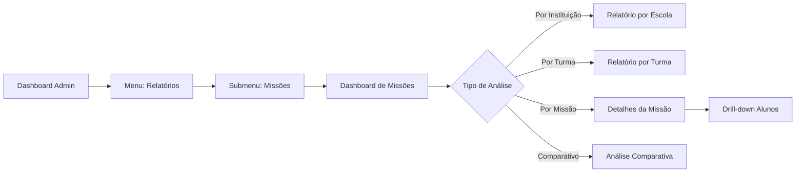

import {
  IconChart,
  IconCheck,
  IconCircleGreen,
  IconCircleRed,
  IconCircleYellow,
  IconClipboard,
  IconDocument,
  IconSparkle,
  IconTarget,
  IconX
} from '@site/src/components/MaterialIcon';

# ADMIN-001: Mission Reports

<span class="badge badge-danger"><IconCircleRed /> Alta Prioridade</span> <span class="badge badge-info">Sprint 1</span> <span class="badge badge-warning">Admin Context</span>

## Visão Geral

Jornada que permite **gestores e coordenadores** acessarem relatórios consolidados de desempenho de missões (do sistema educacional e customizadas) com visão por rede, escola, turma e aluno, incluindo análises comparativas e exportação de dados.

**Contexto de Usuário**: Coordenador, Gestor de Rede, Secretaria  
**Categoria**: Relatórios e Analytics  
**Complexidade**: <IconSparkle /><IconSparkle /><IconSparkle /><IconSparkle /> Muito Avançado  
**Duração Média**: 10-20 minutos por análise

---

## Problema que Resolve

Gestores educacionais precisam:
- **Visão consolidada** de desempenho em missões de múltiplas escolas/turmas
- **Comparativos** entre escolas, turmas, períodos
- **Identificar problemas** antes que se tornem críticos (baixa participação, alto índice de erro)
- **Tomar decisões** baseadas em dados (intervenções pedagógicas, formação de professores)
- **Prestação de contas** com dados exportáveis

**Pain Points Atuais**:
- <IconX /> Muitos cliques para chegar aos dados relevantes
- <IconX /> Gráficos complexos demais ou simplificados demais
- <IconX /> Falta de drill-down (visão geral → detalhe específico)
- <IconX /> Exportação limitada (apenas PDF, sem Excel/CSV)
- <IconX /> Sem alertas automáticos para situações críticas

---

## Rota e Navegação

### URL
```
/admin/reports/missions
/admin/reports/missions/details/:missionId
/admin/reports/missions/comparative
```

### Caminho de Navegação


### Breadcrumb
```
Home > Relatórios > Missões > [Tipo de Relatório]
```

---

## Arquitetura de Arquivos

### Componentes Vue

```
src/views/pages/admin-context/reports/missions/
├── Index.vue                          # Orquestrador principal
├── Filters.vue                        # Filtros (rede, escola, turma, período)
├── Dashboard.vue                      # Dashboard com KPIs principais
├── List.vue                           # Lista de missões com métricas
├── details/
│   ├── MissionDetailsReport.vue       # Relatório detalhado de uma missão
│   ├── PerformanceChart.vue          # Gráfico de desempenho
│   ├── ParticipationChart.vue        # Gráfico de participação
│   └── StudentsTable.vue             # Tabela de alunos
├── comparative/
│   ├── ComparativeReport.vue         # Análise comparativa
│   ├── SchoolsComparison.vue         # Comparativo entre escolas
│   ├── ClassesComparison.vue         # Comparativo entre turmas
│   └── PeriodsComparison.vue         # Comparativo temporal
├── components/
│   ├── KPICard.vue                   # Card de KPI
│   ├── TrendIndicator.vue            # Indicador de tendência
│   ├── AlertBanner.vue               # Banner de alerta
│   └── ExportMenu.vue                # Menu de exportação
└── useMissionReports.js              # Domain composable
```

### Vuex Module

```javascript
// src/store/pageModules/reports/module-mission-reports.js
export default {
  namespaced: true,
  state: {
    dashboard: {
      totalMissions: 0,
      avgParticipation: 0,
      avgScore: 0,
      criticalAlerts: [],
    },
    missions: [],
    missionDetails: null,
    comparative: null,
    loading: false,
    filters: {
      networkGroupId: null,
      institutionId: null,
      classId: null,
      startDate: null,
      endDate: null,
      missionType: null, // 'education_system', 'custom', 'all'
    },
  },
  mutations: {
    dashboard(state, payload) { state.dashboard = payload },
    missions(state, payload) { state.missions = payload },
    missionDetails(state, payload) { state.missionDetails = payload },
    comparative(state, payload) { state.comparative = payload },
    loading(state, payload) { state.loading = payload },
    setFilter(state, { key, value }) {
      state.filters[key] = value
    },
    resetFilters(state) {
      state.filters = {
        networkGroupId: null,
        institutionId: null,
        classId: null,
        startDate: null,
        endDate: null,
        missionType: 'all',
      }
    },
  },
  getters: {
    dashboard: state => state.dashboard,
    missions: state => state.missions,
    missionDetails: state => state.missionDetails,
    comparative: state => state.comparative,
    loading: state => state.loading,
    filters: state => state.filters,
    criticalMissions: state => {
      return state.missions.filter(m => 
        m.participationRate < 50 || m.avgScore < 60
      )
    },
    topPerformingMissions: state => {
      return state.missions
        .filter(m => m.participationRate >= 80 && m.avgScore >= 80)
        .sort((a, b) => b.avgScore - a.avgScore)
        .slice(0, 5)
    },
  },
  actions: {
    async fetchDashboard({ commit, state }) {
      commit('loading', true)
      const response = await getMissionsDashboard(state.filters)
      commit('dashboard', response.data)
      commit('loading', false)
    },
    async fetchMissions({ commit, state }) {
      commit('loading', true)
      const response = await getMissionsReport(state.filters)
      commit('missions', response.data)
      commit('loading', false)
    },
    async fetchMissionDetails({ commit }, missionId) {
      commit('loading', true)
      const response = await getMissionDetailsReport(missionId)
      commit('missionDetails', response.data)
      commit('loading', false)
    },
    async fetchComparative({ commit, state }, type) {
      commit('loading', true)
      const response = await getComparativeReport({
        ...state.filters,
        type, // 'schools', 'classes', 'periods'
      })
      commit('comparative', response.data)
      commit('loading', false)
    },
  },
}
```

### Services

```javascript
// src/services/admin-context/MissionReportsService.js
import axios from '@axios'

/**
 * Busca dashboard consolidado de missões
 * @param {Object} filters - Filtros aplicados
 * @returns {Promise<Object>} Dashboard com KPIs
 */
export const getMissionsDashboard = async (filters) => {
  return axios.get('/admin/reports/missions/dashboard', { params: filters })
}

/**
 * Busca relatório de missões com métricas
 * @param {Object} filters - Filtros aplicados
 * @returns {Promise<Array>} Lista de missões com métricas
 */
export const getMissionsReport = async (filters) => {
  return axios.get('/admin/reports/missions', { params: filters })
}

/**
 * Busca detalhes de uma missão específica
 * @param {number} missionId - ID da missão
 * @returns {Promise<Object>} Detalhes completos da missão
 */
export const getMissionDetailsReport = async (missionId) => {
  return axios.get(`/admin/reports/missions/${missionId}`)
}

/**
 * Busca relatório comparativo
 * @param {Object} params - Parâmetros do comparativo
 * @returns {Promise<Object>} Dados comparativos
 */
export const getComparativeReport = async (params) => {
  return axios.get('/admin/reports/missions/comparative', { params })
}

/**
 * Exporta relatório em formato específico
 * @param {Object} params - Parâmetros de exportação
 * @returns {Promise<Blob>} Arquivo para download
 */
export const exportMissionReport = async (params) => {
  return axios.get('/admin/reports/missions/export', {
    params,
    responseType: 'blob',
  })
}
```

---

## Fluxo de Usuário

```mermaid
sequenceDiagram
    actor Gestor
    participant Filters as Filtros
    participant Dashboard as Dashboard
    participant List as Lista de Missões
    participant Details as Detalhes
    participant API as Backend API
    participant Store as Vuex Store

    Gestor->>Filters: Acessa /admin/reports/missions
    Filters->>API: GET /reports/missions/dashboard
    API-->>Filters: KPIs iniciais
    Filters->>Store: commit('dashboard', data)
    
    Note over Gestor: Visualiza KPIs principais
    
    Gestor->>Filters: Seleciona Rede/Escola/Período
    Filters->>Store: commit('setFilter', filters)
    Filters->>API: GET /reports/missions
    API-->>Filters: Lista de missões filtradas
    Filters->>Store: commit('missions', data)
    
    Dashboard->>Gestor: Mostra alertas críticos
    Note over Dashboard: "3 missões com baixa participação"
    
    Gestor->>List: Clica em missão específica
    List->>Details: Navega para detalhes
    Details->>API: GET /reports/missions/:id
    API-->>Details: Dados detalhados
    
    Note over Details: Drill-down por turma/aluno
    
    Gestor->>Details: Clica "Ver Alunos com Dificuldade"
    Details->>API: GET /reports/missions/:id/students?filter=struggling
    API-->>Details: Lista de alunos
    
    Gestor->>Details: Clica "Exportar (Excel)"
    Details->>API: GET /reports/missions/export?format=xlsx
    API-->>Details: Arquivo Excel
    Details->>Gestor: Download inicia
```

---

## Estados da Interface

### Estado: Loading Dashboard
**Quando**: Carregando KPIs iniciais  
**Elementos**:
- Skeleton de 4 KPI cards
- Skeleton de gráfico principal
- Filtros desabilitados
- Tabela vazia com placeholder

### Estado: Dashboard Principal (Inicial)

**KPI Cards (4 principais)**:
1. **Total de Missões Ativas**
   - Número grande: 45
   - Subtexto: "Últimos 30 dias"
   - Trend: +12% vs período anterior

2. **Taxa de Participação Média**
   - Número: 78.5%
   - Subtexto: "Meta: 85%"
   - Indicador: <IconCircleYellow /> Abaixo da meta
   - Trend: -3% vs período anterior

3. **Média de Desempenho**
   - Número: 72.3 pontos
   - Subtexto: "De 100 pontos"
   - Indicador: <IconCircleGreen /> Dentro da meta
   - Trend: +5% vs período anterior

4. **Missões Críticas**
   - Número: 8
   - Subtexto: "Requerem atenção"
   - Indicador: <IconCircleRed /> Alerta
   - Link: "Ver detalhes"

**Gráfico Principal**:
- Linha temporal (últimos 30 dias)
- 2 linhas: Participação e Desempenho
- Hover mostra valores exatos

**Alertas**:
- Banner vermelho: "3 missões com participação < 50%"
- Banner amarelo: "5 turmas sem iniciar missão há 7 dias"
- Botão: "Ver Todas as Missões Críticas"

### Estado: Lista de Missões (Tabela)

**Colunas da Tabela**:
- Nome da Missão
- Tipo (Sistema / Customizada)
- Escolas Habilitadas (número)
- Turmas Ativas (número)
- Alunos Participando (número / total)
- Taxa de Participação (%)
- Média de Desempenho (pontos)
- Status (badge)
- Ações

**Ordenação**:
- Por participação (crescente/decrescente)
- Por desempenho
- Por data de criação

**Filtros Avançados**:
- Tipo de missão
- Faixa de participação (0-50%, 50-80%, 80-100%)
- Faixa de desempenho
- Status (ativa, encerrada, rascunho)

### Estado: Detalhes da Missão

**Seção 1: Header**
- Nome da missão
- Badge de tipo
- Badge de status
- Período de vigência
- Total de questões e pontos

**Seção 2: Métricas Consolidadas**
- Grid de 6 KPIs:
  - Escolas habilitadas
  - Turmas ativas
  - Alunos total
  - Taxa de participação
  - Média de desempenho
  - Taxa de conclusão

**Seção 3: Gráficos**
- **Gráfico 1**: Participação por Escola (barras horizontais)
- **Gráfico 2**: Distribuição de Notas (histograma)
- **Gráfico 3**: Desempenho por Questão (radar ou barras)
- **Gráfico 4**: Evolução Temporal (linha)

**Seção 4: Tabelas Drill-Down**
- **Aba 1: Por Escola**
  - Lista de escolas
  - Métricas por escola
  - Botão "Ver Turmas" (drill-down)
  
- **Aba 2: Por Turma**
  - Lista de turmas
  - Métricas por turma
  - Botão "Ver Alunos" (drill-down)
  
- **Aba 3: Por Aluno**
  - Filtros: Turma, Status
  - Tabela de alunos
  - Colunas: Nome, Turma, Status, Nota, Tempo gasto
  - Ordenação por nota

**Seção 5: Análise de Questões**
- Lista de questões da missão
- Para cada questão:
  - Enunciado (truncado)
  - Taxa de acerto
  - Tempo médio de resposta
  - Alternativas mais escolhidas
  - Gráfico de pizza das respostas

### Estado: Relatório Comparativo

**Tipos de Comparação**:

**1. Entre Escolas**
- Tabela com escolas em colunas
- Métricas em linhas
- Células com cores (heatmap)
- Ranking visual

**2. Entre Turmas**
- Similar ao de escolas
- Filtro: Escola específica
- Comparativo intra-escola

**3. Temporal**
- Linha do tempo
- Métricas: Participação, Desempenho, Conclusão
- Períodos: Semanal, Mensal, Trimestral
- Permite comparar 2 períodos

**Elementos Visuais**:
- Gráficos de barras agrupadas
- Tabela comparativa
- Indicadores de tendência (↑↓→)
- Botão "Exportar Comparativo"

### Estado: Exportação

**Modal de Exportação**:
- Título: "Exportar Relatório"
- Opções de formato:
  - <IconDocument /> PDF (visual completo)
  - <IconChart /> Excel (.xlsx) - dados tabulares
  - <IconClipboard /> CSV - dados brutos
  - 📷 PNG - gráficos como imagens
- Opções de conteúdo:
  - [ ] Dashboard completo
  - [ ] Lista de missões
  - [ ] Detalhes da missão
  - [ ] Dados de alunos
- Botão "Gerar Relatório"

### Estado: Alerta Crítico

**Banner Fixo no Topo**:
- Fundo vermelho
- Ícone de alerta
- Texto: "8 missões requerem atenção urgente"
- Botão "Ver Missões Críticas"
- Botão "X" (fechar temporariamente)

**Modal de Missões Críticas**:
- Lista de missões com problemas
- Para cada missão:
  - Nome
  - Problema identificado
  - Recomendação de ação
  - Botões: "Ver Detalhes" | "Notificar Professor"

---

## Componentes Críticos

### 1. Dashboard.vue
**Responsabilidade**: Dashboard principal com KPIs e gráficos  
**Props**: Nenhum  
**Emits**: Nenhum

**Estrutura**:
```vue
<template>
  <b-card>
    <!-- KPI Cards -->
    <b-row class="mb-3">
      <b-col cols="12" md="3" v-for="kpi in kpis" :key="kpi.id">
        <KPICard
          :title="kpi.title"
          :value="kpi.value"
          :subtitle="kpi.subtitle"
          :trend="kpi.trend"
          :variant="kpi.variant"
        />
      </b-col>
    </b-row>
    
    <!-- Alertas -->
    <AlertBanner
      v-if="criticalAlerts.length > 0"
      :alerts="criticalAlerts"
      @view-details="showCriticalMissions"
    />
    
    <!-- Gráfico Principal -->
    <b-row>
      <b-col cols="12">
        <PerformanceChart :data="performanceData" />
      </b-col>
    </b-row>
  </b-card>
</template>
```

### 2. KPICard.vue
**Responsabilidade**: Card visual de KPI  
**Props**:
- `title` (String, required)
- `value` (Number ou String, required)
- `subtitle` (String)
- `trend` (Object) - \{ value: 12, direction: 'up' \}
- `variant` (String) - 'success', 'warning', 'danger'

**Features**:
- Ícone de tendência (↑↓→)
- Cor dinâmica baseada em variant
- Animação de contagem (countup.js)
- Tooltip com explicação

### 3. List.vue com ListTable
**Responsabilidade**: Tabela de missões com métricas  
**Props**: Nenhum  
**Emits**: `@view-details` - Navegar para detalhes

**Colunas Configuradas**:
```javascript
const tableColumns = [
  { key: 'name', label: 'Missão', sortable: true, searchable: true },
  { key: 'type', label: 'Tipo', sortable: true },
  { key: 'schoolsCount', label: 'Escolas', sortable: true },
  { key: 'classesCount', label: 'Turmas', sortable: true },
  { key: 'participationRate', label: 'Participação', sortable: true },
  { key: 'avgScore', label: 'Desempenho', sortable: true },
  { key: 'status', label: 'Status' },
  { key: 'actions', label: 'Ações' },
]
```

**Cell Customization**:
```vue
<template #cell(participationRate)="{ item }">
  <div class="d-flex align-items-center">
    <b-progress
      :value="item.participationRate"
      :variant="getParticipationVariant(item.participationRate)"
      class="w-75"
    />
    <span class="ml-2">{{ item.participationRate }}%</span>
  </div>
</template>

<template #cell(avgScore)="{ item }">
  <span :class="getScoreClass(item.avgScore)">
    {{ item.avgScore }} pontos
  </span>
</template>
```

### 4. MissionDetailsReport.vue
**Responsabilidade**: Relatório detalhado de uma missão  
**Props**:
- `missionId` (Number, required)

**Emits**: Nenhum

**Features**:
- Múltiplas seções (métricas, gráficos, drill-down)
- Tabs para diferentes visões
- Exportação contextual
- Breadcrumb interno (Escola → Turma → Aluno)

---

## Integração com useFilters()

```javascript
// src/views/pages/admin-context/reports/missions/useMissionReports.js
import store from '@/store'
import useFilters from '@/store/filters/useFilters'
import { computed } from 'vue'

const moduleName = 'MissionReports'
const { networkGroup, institution, classe } = useFilters()

export default function useMissionReports() {
  const dashboard = computed({
    get: () => store.getters[`${moduleName}/dashboard`],
    set: val => store.commit(`${moduleName}/dashboard`, val),
  })

  const missions = computed({
    get: () => store.getters[`${moduleName}/missions`],
    set: val => store.commit(`${moduleName}/missions`, val),
  })

  const loading = computed({
    get: () => store.getters[`${moduleName}/loading`],
    set: val => store.commit(`${moduleName}/loading`, val),
  })

  const criticalMissions = computed(() => 
    store.getters[`${moduleName}/criticalMissions`]
  )

  const fetchDashboard = async () => {
    loading.value = true
    await store.dispatch(`${moduleName}/fetchDashboard`)
    loading.value = false
  }

  const fetchMissions = async () => {
    loading.value = true
    await store.dispatch(`${moduleName}/fetchMissions`)
    loading.value = false
  }

  const setFilter = (key, value) => {
    store.commit(`${moduleName}/setFilter`, { key, value })
  }

  return {
    moduleName,
    dashboard,
    missions,
    loading,
    criticalMissions,
    fetchDashboard,
    fetchMissions,
    setFilter,
  }
}
```

**Watch Filters**:
```javascript
import { watch } from 'vue'

watch([networkGroup, institution], () => {
  setFilter('networkGroupId', networkGroup.value?.id)
  setFilter('institutionId', institution.value?.id)
  fetchDashboard()
  fetchMissions()
})
```

---

## API Endpoints

### GET /admin/reports/missions/dashboard

**Request Params**:
```
?networkGroupId=1
&institutionId=5
&startDate=2026-01-01
&endDate=2026-02-03
```

**Response**:
```json
{
  "totalMissions": 45,
  "avgParticipation": 78.5,
  "avgScore": 72.3,
  "totalStudents": 1250,
  "criticalAlerts": [
    {
      "id": 1,
      "type": "low_participation",
      "missionId": 101,
      "missionName": "Missão de Matemática - Frações",
      "value": 42.5,
      "threshold": 50,
      "message": "Participação abaixo de 50%"
    }
  ],
  "trends": {
    "participation": { value: -3, direction: "down" },
    "score": { value: 5, direction: "up" }
  }
}
```

### GET /admin/reports/missions

**Request Params**:
```
?networkGroupId=1
&institutionId=5
&missionType=all
&page=1
&pageSize=20
```

**Response**:
```json
{
  "missions": [
    {
      "id": 101,
      "name": "Avaliação de Matemática - Frações",
      "type": "custom",
      "schoolsCount": 5,
      "classesCount": 12,
      "studentsTotal": 360,
      "studentsParticipating": 285,
      "participationRate": 79.2,
      "avgScore": 68.5,
      "maxScore": 100,
      "completionRate": 72.3,
      "status": "active",
      "startDate": "2026-01-15T00:00:00Z",
      "endDate": "2026-02-15T23:59:59Z"
    }
  ],
  "total": 45,
  "page": 1,
  "pageSize": 20
}
```

### GET /admin/reports/missions/:id

**Response**:
```json
{
  "mission": {
    "id": 101,
    "name": "Avaliação de Matemática - Frações",
    "description": "Avaliação sobre operações com frações",
    "type": "custom",
    "totalQuestions": 20,
    "totalPoints": 100,
    "duration": 60
  },
  "metrics": {
    "schoolsEnabled": 5,
    "classesActive": 12,
    "studentsTotal": 360,
    "studentsStarted": 320,
    "studentsCompleted": 285,
    "participationRate": 88.9,
    "completionRate": 79.2,
    "avgScore": 68.5,
    "medianScore": 70,
    "minScore": 20,
    "maxScore": 95
  },
  "schoolsData": [
    {
      "schoolId": 10,
      "schoolName": "Escola Municipal A",
      "classesCount": 3,
      "studentsTotal": 90,
      "participationRate": 82.2,
      "avgScore": 71.5
    }
  ],
  "questionsAnalysis": [
    {
      "questionId": 1,
      "order": 1,
      "statement": "Calcule: 1/2 + 1/4",
      "correctRate": 78.5,
      "avgTime": 45,
      "answersDistribution": {
        "A": 15,
        "B": 75,
        "C": 220,
        "D": 30,
        "E": 20
      },
      "correctAnswer": "C"
    }
  ],
  "performanceDistribution": {
    "0-20": 5,
    "21-40": 15,
    "41-60": 85,
    "61-80": 120,
    "81-100": 60
  }
}
```

### GET /admin/reports/missions/comparative

**Request Params**:
```
?type=schools
&networkGroupId=1
&startDate=2026-01-01
&endDate=2026-02-03
```

**Response**:
```json
{
  "type": "schools",
  "data": [
    {
      "schoolId": 10,
      "schoolName": "Escola Municipal A",
      "metrics": {
        "missionsCount": 15,
        "avgParticipation": 82.3,
        "avgScore": 71.2,
        "studentsTotal": 250
      },
      "rank": 1
    },
    {
      "schoolId": 11,
      "schoolName": "Escola Estadual B",
      "metrics": {
        "missionsCount": 12,
        "avgParticipation": 75.5,
        "avgScore": 68.9,
        "studentsTotal": 180
      },
      "rank": 2
    }
  ],
  "networkAverage": {
    "avgParticipation": 78.5,
    "avgScore": 70.1
  }
}
```

---

## Screenshots AS-IS

### Dashboard Principal


### Lista de Missões


### Detalhes da Missão


### Análise de Questões


### Relatório Comparativo


---

## Melhorias Propostas (TO-BE)

### <IconTarget /> Problema 1: Muitos Cliques para Dados Relevantes
**Impacto**: Gestores perdem tempo navegando

**Proposta**:
- <IconCheck /> Dashboard personalizável (drag & drop de widgets)
- <IconCheck /> Favoritos/bookmarks de relatórios
- <IconCheck /> Atalhos contextuais (clicar em KPI → drill-down direto)
- <IconCheck /> Navegação breadcrumb sempre visível

### <IconTarget /> Problema 2: Gráficos Pouco Acionáveis
**Impacto**: Dados não geram insights claros

**Proposta**:
- <IconCheck /> Gráficos interativos (clicar em barra → detalhes)
- <IconCheck /> Anotações automáticas ("Queda de 15% em relação ao mês anterior")
- <IconCheck /> Recomendações baseadas em IA ("Turma 5A precisa de reforço em frações")
- <IconCheck /> Comparação visual com meta/benchmark

### <IconTarget /> Problema 3: Sem Alertas Proativos
**Impacto**: Problemas são descobertos tarde demais

**Proposta**:
- <IconCheck /> Sistema de alertas configurável (email, notificação)
- <IconCheck /> Regras personalizadas ("Se participação < 60% por 3 dias, alertar")
- <IconCheck /> Dashboard de "Situações Críticas" separado
- <IconCheck /> Botão "Tomar Ação" direto do alerta (enviar mensagem, agendar reunião)

### <IconTarget /> Problema 4: Exportação Limitada
**Impacto**: Dificulta compartilhamento e análises externas

**Proposta**:
- <IconCheck /> Templates de relatório prontos (para diretoria, para pais, etc.)
- <IconCheck /> Agendamento de relatórios automáticos (semanal, mensal)
- <IconCheck /> Compartilhamento seguro via link (com senha)
- <IconCheck /> API para integração com BI externo (Power BI, Tableau)

**Protótipo**: [Veja o protótipo TO-BE](/prototypes/mission-reports-v2)

---

## Métricas e KPIs

### Métricas de Uso
- Logins de gestores/mês
- Relatórios acessados por gestor/mês
- Tempo médio de sessão
- Páginas mais visitadas

### Métricas de Valor
- Tempo para identificar problema crítico
- Taxa de intervenção pós-alerta
- Exportações de relatórios/mês
- Satisfação dos gestores (NPS)

### Metas (TO-BE)
- ⬆️ Frequência de acesso: de 2x/semana para 4x/semana
- ⬇️ Tempo para identificar problema: de 5 dias para 1 dia
- ⬆️ Taxa de intervenção: de 40% para 75%
- ⬆️ NPS de gestores: de 7.0 para 8.5

---

## Testes Recomendados

### Testes Unitários
```javascript
// tests/unit/views/admin/reports/useMissionReports.spec.js
import useMissionReports from '@/views/pages/admin-context/reports/missions/useMissionReports'
import store from '@/store'

describe('useMissionReports', () => {
  it('deve buscar dashboard corretamente', async () => {
    const { fetchDashboard, dashboard } = useMissionReports()
    
    await fetchDashboard()
    
    expect(dashboard.value).toBeDefined()
    expect(dashboard.value.totalMissions).toBeGreaterThan(0)
  })

  it('deve identificar missões críticas', () => {
    store.commit('MissionReports/missions', [
      { id: 1, participationRate: 45, avgScore: 80 },
      { id: 2, participationRate: 85, avgScore: 55 },
      { id: 3, participationRate: 90, avgScore: 85 },
    ])
    
    const critical = store.getters['MissionReports/criticalMissions']
    
    expect(critical).toHaveLength(2)
    expect(critical.find(m => m.id === 1)).toBeDefined()
    expect(critical.find(m => m.id === 2)).toBeDefined()
  })
})
```

### Testes de Integração
```javascript
// tests/integration/mission-reports-workflow.spec.js
import { shallowMount } from '@vue/test-utils'
import Index from '@/views/pages/admin-context/reports/missions/Index.vue'

describe('Mission Reports - Fluxo Completo', () => {
  it('deve carregar dashboard e filtrar por instituição', async () => {
    const wrapper = shallowMount(Index)
    
    // Aguardar carregamento inicial
    await wrapper.vm.$nextTick()
    expect(wrapper.vm.loading).toBe(false)
    
    // Selecionar instituição
    const filters = wrapper.findComponent({ name: 'Filters' })
    await filters.vm.$emit('filter-change', { institutionId: 5 })
    
    // Verificar se dados foram recarregados
    expect(wrapper.vm.missions.length).toBeGreaterThan(0)
  })

  it('deve navegar para detalhes ao clicar em missão', async () => {
    const $router = { push: jest.fn() }
    const wrapper = shallowMount(Index, {
      mocks: { $router }
    })
    
    const list = wrapper.findComponent({ name: 'List' })
    await list.vm.$emit('view-details', 101)
    
    expect($router.push).toHaveBeenCalledWith({
      name: 'mission-details-report',
      params: { missionId: 101 }
    })
  })
})
```

---

## Rastreamento de Mudanças

| Versão | Data | Mudanças | Autor |
|--------|------|----------|-------|
| AS-IS v1.0 | 2026-02-03 | Documentação inicial Sprint 1 | Equipe Docs |
| TO-BE Planned | 2026-03-20 | Protótipo v2 com IA e alertas | Equipe Product |

---

## Referências

- [Design System - Dashboard Components](https://fabioeducacross.github.io/DesignSystem-Vuexy/)
- [API Docs - Reports Endpoint](https://apieducacrossmanager-test.azurewebsites.net/index.html)
- [Protótipo TO-BE - Mission Reports v2](/prototypes/mission-reports-v2)
- [Architecture - DDD Pattern](/architecture/intro#ddd-page-structure-pattern)
- [PROF-003: Custom Missions](/journeys/teacher/custom-missions)
- [PROF-004: Events Management](/journeys/teacher/events-management)
