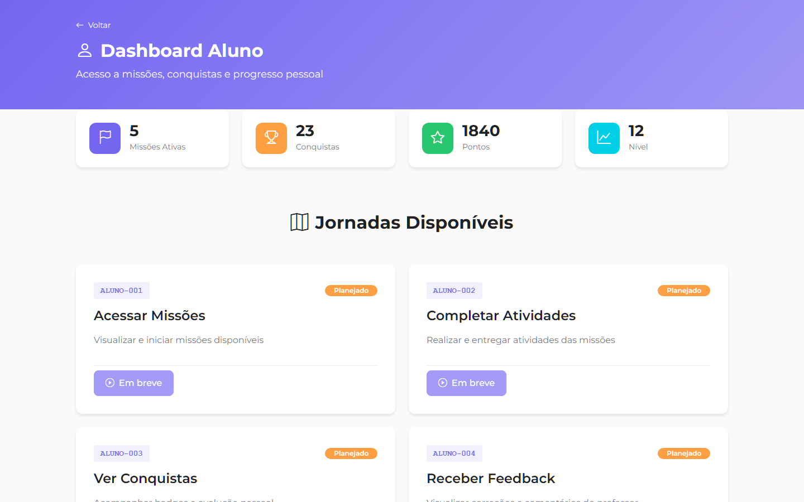

import {
  IconBookOpen,
  IconBooks,
  IconChart,
  IconCheck,
  IconCircleYellow,
  IconClipboard,
  IconCode,
  IconEdit,
  IconGame,
  IconHome,
  IconLightbulb,
  IconPalette,
  IconRefresh,
  IconSparkle,
  IconTrending,
  IconX
} from '@site/src/components/MaterialIcon';

# STUDENT-002: Learning Path (Trilha de Aprendizado)

:::info Contexto
**Jornada**: Estudante  
**Prioridade**: Média  
**Complexidade**: Média  
**Status**: <IconCheck /> Documentado (AS-IS Baseline)
:::

## 1. Visão Geral

### O que é

O **Learning Path** (Caminho de Aprendizado) é o sistema gamificado da plataforma que transforma a jornada educacional do estudante em uma experiência similar a jogos, com progressão clara, recompensas e reconhecimento. Implementado para aumentar o engajamento e motivação dos alunos através de elementos de game design aplicados ao contexto educacional.

### Como funciona hoje (AS-IS)

Trilha de aprendizado gamificada com:
- **Mapa de Missões Visual** mostrando sequência de atividades com status (bloqueado, disponível, em progresso, concluído)
- **Sistema de Pontos e XP** com conversão de acertos em experiência acumulada
- **Níveis e Badges** desbloqueáveis conforme progresso e conquistas especiais
- **Feedback Instantâneo** em exercícios objetivos (múltipla escolha, V/F)
- **Barra de Progresso** por disciplina, missão e meta de aprendizado
- **Recomendações Personalizadas** baseadas em desempenho anterior
- **Ranking Social** comparando desempenho com colegas da turma (opt-in)
- **Streak (Sequência)** contador de dias consecutivos estudando
- **Recompensas Virtuais** (moedas, avatares, temas) por atingir metas
- **Notificações Push** lembrando de missões pendentes e metas próximas do prazo

## 2. Jornada do Usuário (AS-IS)

### Persona

**Nome**: João Pedro Santos  
**Idade**: 12 anos (7º ano)  
**Contexto**: Aluno de escola pública, acessa plataforma via tablet fornecido pela escola  
**Perfil**: Gosta de jogos, precisa de motivação visual para estudar  
**Objetivo**: Completar missões de Matemática para melhorar nota do bimestre

**Dores**:
- Se distrai facilmente sem elementos gamificados
- Esquece de fazer tarefas sem lembretes
- Desmotiva quando não vê progresso claro
- Gosta de competir com amigos de forma saudável

### Fluxo Completo

```mermaid
graph TD
    Start([<IconHome /> João entra na plataforma]) --> Dashboard[<IconChart /> Vê Dashboard com<br/>mapa de missões]
    Dashboard --> CheckStreak{<span class="material-symbols-outlined">local_fire_department</span> Tem streak<br/>ativo?}
    
    CheckStreak -->|<IconCheck /> Sim| ShowStreak[<IconSparkle /> Animação: 5 dias consecutivos!]
    CheckStreak -->|<IconX /> Não| CheckPending{<IconClipboard /> Tem missões<br/>pendentes?}
    
    ShowStreak --> CheckPending
    CheckPending -->|<IconCheck /> Sim| ShowMissions[<IconBooks /> Lista missões disponíveis<br/>por prioridade]
    CheckPending -->|<IconX /> Não| ShowCompleted[<span class="material-symbols-outlined">celebration</span> Todas missões concluídas!<br/>Mostra badges conquistados]
    
    ShowMissions --> SelectMission[<span class="material-symbols-outlined">mouse</span> João seleciona<br/>Missão de Matemática]
    SelectMission --> MissionDetail[<IconBookOpen /> Tela de detalhes da missão]
    
    MissionDetail --> StartMission[<span class="material-symbols-outlined">play_arrow</span> Clica Iniciar Missão]
    StartMission --> Exercises[<span class="material-symbols-outlined">fitness_center</span> Resolve exercícios<br/>um a um]
    
    Exercises --> SubmitAnswer[<IconEdit /> Submete resposta]
    SubmitAnswer --> InstantFeedback{<IconCheck /> Resposta<br/>correta?}
    
    InstantFeedback -->|<IconCheck /> Sim| GainXP[<span class="material-symbols-outlined">arrow_upward</span> +10 XP<br/>Barra de progresso atualiza]
    InstantFeedback -->|<IconX /> Não| ShowHint[<IconLightbulb /> Mostra dica<br/>+ Explicação]
    
    ShowHint --> RetryAnswer{<IconRefresh /> Quer<br/>tentar de novo?}
    RetryAnswer -->|<IconCheck /> Sim| Exercises
    RetryAnswer -->|<IconX /> Não| NextExercise[<span class="material-symbols-outlined">arrow_forward</span> Próximo exercício]
    
    GainXP --> CheckAllCompleted{<span class="material-symbols-outlined">flag</span> Completou<br/>toda missão?}
    
    CheckAllCompleted -->|<IconX /> Não| NextExercise
    CheckAllCompleted -->|<IconCheck /> Sim| MissionComplete[<span class="material-symbols-outlined">celebration</span> Missão Concluída!]
    
    MissionComplete --> EarnRewards[<IconTrending /> Ganha recompensas:<br/>50 XP + Badge + 10 moedas]
    EarnRewards --> CheckLevelUp{<IconSparkle /> Subiu<br/>de nível?}
    
    CheckLevelUp -->|<IconCheck /> Sim| LevelUpAnimation[<span class="material-symbols-outlined">celebration</span> LEVEL UP!<br/>Nível 5 → Nível 6]
    CheckLevelUp -->|<IconX /> Não| UpdateRanking[<IconChart /> Atualiza ranking<br/>da turma]
    
    LevelUpAnimation --> UpdateRanking
    UpdateRanking --> UnlockNext[<span class="material-symbols-outlined">lock_open</span> Desbloqueia<br/>próxima missão]
    
    UnlockNext --> Decision{<span class="material-symbols-outlined">chat_bubble</span> João<br/>decide}
    
    Decision -->|<span class="material-symbols-outlined">play_arrow</span> Continuar| ShowMissions
    Decision -->|<IconHome /> Sair| End([<span class="material-symbols-outlined">flag</span> Fim])
    ShowCompleted --> End
    
    classDef startEnd fill:#e1f5e1,stroke:#4caf50,stroke-width:3px,color:#000
    classDef action fill:#e3f2fd,stroke:#2196f3,stroke-width:2px,color:#000
    classDef decision fill:#fff3e0,stroke:#ff9800,stroke-width:2px,color:#000
    classDef reward fill:#f3e5f5,stroke:#9c27b0,stroke-width:2px,color:#000
    
    class Start,End startEnd
    class Dashboard,ShowMissions,SelectMission,MissionDetail,StartMission,Exercises,SubmitAnswer,ShowHint,NextExercise,MissionComplete,UpdateRanking,UnlockNext action
    class CheckStreak,CheckPending,InstantFeedback,RetryAnswer,CheckAllCompleted,CheckLevelUp,Decision decision
    class ShowStreak,GainXP,EarnRewards,LevelUpAnimation,ShowCompleted reward
```

  ## 3. O que o aluno vê (telas-chave)

### Tela Principal: Mapa de Missões

**Elementos na tela**:
- Mapa visual com missões em sequência (nós conectados)
- Indicadores de status: lock Bloqueado, <IconCircleYellow /> Disponível, circle Em Progresso, <IconCheck /> Concluído
- Barra de progresso geral no topo
- Contador de streak (dias consecutivos)
- XP atual e próximo nível
- Botão "Continuar de onde parei"

### Detalhes da Missão

**Elementos na tela**:
- Título da missão e descrição
- Número de exercícios e XP potencial
- Tempo estimado de conclusão
- Botão "Iniciar Missão" (se novo) ou "Continuar" (se em progresso)
- Preview de recompensas (badges, moedas)
- Indicador de progresso (ex: 3/10 exercícios)

### Execução de Exercício

**Elementos na tela**:
- Enunciado da questão
- Opções de resposta (múltipla escolha)
- Botão "Confirmar Resposta"
- Timer opcional (se missão tem tempo limite)
- Barra de progresso da missão (exercício X de Y)
- Botão "Pular" (se permitido)

### Feedback Instantâneo (Acerto)

**Elementos na tela**:
- <IconCheck /> Animação de acerto (confete ou estrelas)
- "+10 XP" com animação de contagem
- Barra de XP se enchendo
- Explicação complementar (opcional)
- Botão "Próximo Exercício"

### Feedback Instantâneo (Erro)

**Elementos na tela**:
- <IconX /> Indicação de erro (sem efeitos negativos visuais pesados)
- <IconLightbulb /> Dica ou explicação
- <IconBooks /> Link para conteúdo teórico relacionado
- Botões: "Tentar Novamente" ou "Ver Resposta Correta"

### Modal de Missão Concluída

**Elementos na tela**:
- celebration Animação de celebração
- Resumo de desempenho: Acertos, Erros, Tempo gasto
- Total de XP ganho
- Badges desbloqueados (se houver)
- Moedas ganhas
- Botão "Próxima Missão" ou "Ver Ranking"

### Modal de Level Up

**Elementos na tela**:
- celebration Animação de fogos de artifício
- "LEVEL UP!" em destaque
- Nível anterior → Nível novo
- Desbloqueios: Novos avatares, temas, recursos
- Botão "Continuar"

### Perfil do Aluno

**Elementos na tela**:
- Avatar customizável
- Nome e apelido
- Nível atual e barra de XP
- Total de moedas e badges
- Estatísticas: Missões concluídas, Dias de streak, Posição no ranking
- Coleção de badges conquistados (grid)
- Gráfico de desempenho por disciplina

## 4. Regras e comportamentos visíveis (AS-IS)

- **Progressão por XP**: cada acerto gera XP; somando o suficiente, o aluno sobe de nível e vê a animação de Level Up.
- **Badges e conquistas**: primeiros passos, perfeição (100%), streaks semanais/mensais, top 3 do ranking, retorno após pausa, ajuda a colegas.
- **Streak (sequência)**: conta dias consecutivos com pelo menos 1 exercício; perde streak se ficar mais de um dia sem acessar.
- **Desbloqueio de missões**: sequência linear; precisa concluir missão anterior com nota mínima para abrir a próxima; pode refazer missões.
- **Moedas e loja**: moedas ganhas por missão, login e badges; podem ser trocadas por avatares, temas e power-ups (dica/pular questão).

## 5. Resultados entregues (AS-IS)

- **Engajamento**: mais tempo na plataforma por elementos de jogo (XP, badges, streak).
- **Clareza de caminho**: mapa de missões mostra onde o aluno está e o que vem depois.
- **Feedback rápido**: respostas corretas/erradas com explicação imediata mantém o ritmo.
- **Motivação social**: ranking opcional e comparação saudável dentro da turma.

## 6. Melhorias TO-BE

### Propostas de Evolução

1. **Modo Multiplayer em Tempo Real** <IconGame />
   - Desafios síncronos entre 2-4 alunos
   - Questões aparecem simultaneamente, primeiro a responder ganha bônus
   - Chat integrado para interação social saudável

2. **Adaptação Inteligente de Dificuldade** psychology
   - IA analisa padrão de erros e ajusta dificuldade automaticamente
   - Se aluno acerta 3 seguidas, aumenta nível de complexidade
   - Se erra 2 seguidas, diminui dificuldade e oferece revisão

3. **Modo História/Narrativa** <IconBookOpen />
   - Missões conectadas por narrativa envolvente (ex: "Salve o Reino da Matemática")
   - Personagens NPCs que guiam o aluno
   - Cutscenes animadas entre capítulos

4. **Sistema de Clãs/Guilds** shield
   - Alunos podem formar grupos de 5-10
   - Missões colaborativas com recompensas compartilhadas
   - Ranking entre clãs da escola

5. **Desafios Semanais Limitados** alarm
   - Eventos especiais com recompensas exclusivas
   - Leaderboards temporários
   - Badges de edição limitada

6. **Integração com Realidade Aumentada** <IconCode />
   - Usar câmera do tablet para "caçar" exercícios pela sala
   - Gamificação física (andar pela escola para desbloquear missões)

7. **Sistema de Mentoria** group
   - Alunos avançados podem ser mentores de colegas
   - Ganham XP especial por ensinar
   - Sistema de agendamento de sessões de ajuda

8. **Personalização Avançada de Avatar** <IconPalette />
   - Criar avatar 3D customizável
   - Roupas e acessórios desbloqueáveis
   - Avatar aparece em rankings e perfil

9. **Modo Offline** mobile_off
   - Baixar missões para fazer sem internet
   - Sincronização automática ao reconectar
   - Útil para áreas com conectividade limitada

10. **Dashboard para Pais** family_restroom
    - Pais acompanham progresso via app separado
    - Recebem notificações de conquistas importantes
    - Podem definir metas e recompensas reais (ex: mesada)

## 7. Referências

- [Design System - DSMissionCard](https://storybook.educacross.com/?path=/story/cards-missioncard)
- [Design System - DSBadge](https://storybook.educacross.com/?path=/story/components-badge)
- [API Docs - Learning Path Endpoints](https://apieducacrossmanager-test.azurewebsites.net/index.html)
- [Gamification Best Practices - Coursera](https://www.coursera.org/learn/gamification)
- [Student Dashboard (jornada relacionada)](./student-dashboard.md)

---

**Última atualização**: 2026-02-04  
**Versão**: AS-IS v1.0  
**Status**: <IconEdit /> Documentado - Aguardando Protótipo TO-BE
