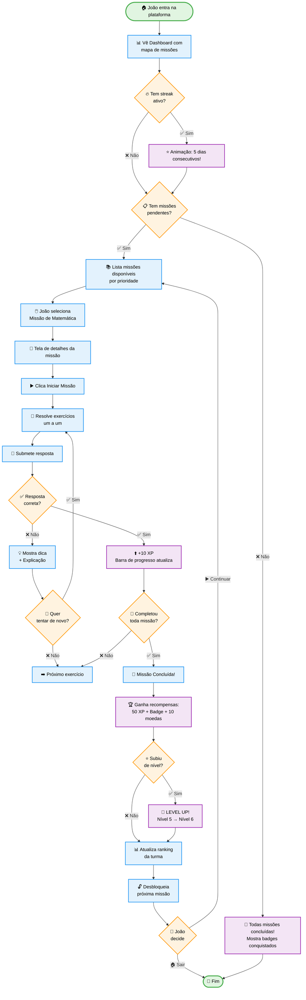

# STUDENT-002: Learning Path (Trilha de Aprendizado)

:::info Contexto
**Jornada**: Estudante  
**Prioridade**: Média  
**Complexidade**: Média  
**Status**: ✅ Documentado (AS-IS Baseline)
:::

## 1. Visão Geral

### Problema

Estudantes precisam de uma experiência gamificada e personalizada para engajamento com o conteúdo educacional, mas enfrentam dificuldades como: falta de clareza sobre quais atividades fazer primeiro, ausência de senso de progressão e conquista ao longo do aprendizado, dificuldade para manter motivação em tarefas repetitivas, falta de feedback imediato sobre desempenho, ausência de recompensas tangíveis por esforço e dedicação, dificuldade para identificar pontos fortes e fracos, falta de personalização baseada em ritmo individual de aprendizado, ausência de elementos sociais (colaboração, competição saudável), dificuldade para retomar estudos após pausas, e falta de visualização clara de objetivos e metas.

**Dores principais**:
- Estudante não sabe "o que fazer agora" ao entrar na plataforma
- Ausência de indicadores visuais de progresso (barras, estrelas, níveis)
- Tarefas são monótonas sem recompensas ou reconhecimento
- Feedback de desempenho demora a chegar (espera correção do professor)
- Não há sistema de pontos, badges ou conquistas
- Dificuldade para identificar habilidades que precisam melhorar
- Conteúdo não se adapta ao ritmo individual (muito fácil ou muito difícil)
- Falta de interação social (rankings, desafios entre colegas)
- Difícil retomar de onde parou após dias sem acessar
- Objetivos de longo prazo (trimestre, ano) não são claros

### Solução AS-IS

Trilha de aprendizado gamificada com:
- **Mapa de Missões Visual** mostrando sequência de atividades com status (bloqueado, disponível, em progresso, concluído)
- **Sistema de Pontos e XP** com conversão de acertos em experiência acumulada
- **Níveis e Badges** desbloqueáveis conforme progresso e conquistas especiais
- **Feedback Instantâneo** em exercícios objetivos (múltipla escolha, V/F)
- **Barra de Progresso** por disciplina, missão e meta de aprendizado
- **Recomendações Personalizadas** baseadas em desempenho anterior
- **Ranking Social** comparando desempenho com colegas da turma (opt-in)
- **Streak (Sequência)** contador de dias consecutivos estudando
- **Recompensas Virtuais** (moedas, avatares, temas) por atingir metas
- **Notificações Push** lembrando de missões pendentes e metas próximas do prazo

## 2. Rotas e Navegação

```typescript
// src/router/student-routes.js
export default [
  {
    path: '/student/learning-path',
    name: 'student-learning-path',
    component: () => import('@/views/pages/student-context/LearningPath.vue'),
    meta: {
      resource: 'Student',
      action: 'read',
      breadcrumb: [
        { text: 'Início', to: '/student' },
        { text: 'Trilha de Aprendizado', active: true }
      ]
    }
  },
  {
    path: '/student/mission/:missionId',
    name: 'student-mission-detail',
    component: () => import('@/views/pages/student-context/MissionDetail.vue'),
    meta: {
      resource: 'Student',
      action: 'read'
    }
  },
  {
    path: '/student/profile',
    name: 'student-profile',
    component: () => import('@/views/pages/student-context/StudentProfile.vue'),
    meta: {
      resource: 'Student',
      action: 'read'
    }
  }
]
```

## 3. Jornada do Usuário (AS-IS)

### Persona

**Nome**: João Pedro Santos  
**Idade**: 12 anos (7º ano)  
**Contexto**: Aluno de escola pública, acessa plataforma via tablet fornecido pela escola  
**Perfil**: Gosta de jogos, precisa de motivação visual para estudar  
**Objetivo**: Completar missões de Matemática para melhorar nota do bimestre

**Dores**:
- Se distrai facilmente sem elementos gamificados
- Esquece de fazer tarefas sem lembretes
- Desmotiva quando não vê progresso claro
- Gosta de competir com amigos de forma saudável

### Fluxo Completo



## 4. Estrutura de Componentes

```
src/views/pages/student-context/
├── LearningPath.vue               # Página principal
│   ├── MissionMap.vue             # Mapa visual de missões
│   ├── ProgressBar.vue            # Barra de progresso geral
│   ├── StreakCounter.vue          # Contador de dias consecutivos
│   └── QuickStats.vue             # XP, nível, badges
├── MissionDetail.vue              # Detalhes de uma missão
│   ├── MissionHeader.vue          # Cabeçalho com título e meta
│   ├── ExerciseList.vue           # Lista de exercícios
│   └── RewardPreview.vue          # Preview de recompensas
├── StudentProfile.vue             # Perfil do aluno
│   ├── AvatarCustomizer.vue      # Customização de avatar
│   ├── BadgeCollection.vue       # Coleção de badges
│   └── StatsChart.vue            # Gráficos de desempenho
└── components/
    ├── XPGainAnimation.vue       # Animação de ganho de XP
    ├── LevelUpModal.vue          # Modal de subida de nível
    └── RankingWidget.vue         # Widget de ranking da turma
```

## 5. Screenshots AS-IS

### Tela Principal: Mapa de Missões


**Elementos na tela**:
- Mapa visual com missões em sequência (nós conectados)
- Indicadores de status: 🔒 Bloqueado, 🟡 Disponível, 🔵 Em Progresso, ✅ Concluído
- Barra de progresso geral no topo
- Contador de streak (dias consecutivos)
- XP atual e próximo nível
- Botão "Continuar de onde parei"

### Detalhes da Missão


**Elementos na tela**:
- Título da missão e descrição
- Número de exercícios e XP potencial
- Tempo estimado de conclusão
- Botão "Iniciar Missão" (se novo) ou "Continuar" (se em progresso)
- Preview de recompensas (badges, moedas)
- Indicador de progresso (ex: 3/10 exercícios)

### Execução de Exercício


**Elementos na tela**:
- Enunciado da questão
- Opções de resposta (múltipla escolha)
- Botão "Confirmar Resposta"
- Timer opcional (se missão tem tempo limite)
- Barra de progresso da missão (exercício X de Y)
- Botão "Pular" (se permitido)

### Feedback Instantâneo (Acerto)


**Elementos na tela**:
- ✅ Animação de acerto (confete ou estrelas)
- "+10 XP" com animação de contagem
- Barra de XP se enchendo
- Explicação complementar (opcional)
- Botão "Próximo Exercício"

### Feedback Instantâneo (Erro)


**Elementos na tela**:
- ❌ Indicação de erro (sem efeitos negativos visuais pesados)
- 💡 Dica ou explicação
- 📚 Link para conteúdo teórico relacionado
- Botões: "Tentar Novamente" ou "Ver Resposta Correta"

### Modal de Missão Concluída


**Elementos na tela**:
- 🎊 Animação de celebração
- Resumo de desempenho: Acertos, Erros, Tempo gasto
- Total de XP ganho
- Badges desbloqueados (se houver)
- Moedas ganhas
- Botão "Próxima Missão" ou "Ver Ranking"

### Modal de Level Up


**Elementos na tela**:
- 🎉 Animação de fogos de artifício
- "LEVEL UP!" em destaque
- Nível anterior → Nível novo
- Desbloqueios: Novos avatares, temas, recursos
- Botão "Continuar"

### Perfil do Aluno


**Elementos na tela**:
- Avatar customizável
- Nome e apelido
- Nível atual e barra de XP
- Total de moedas e badges
- Estatísticas: Missões concluídas, Dias de streak, Posição no ranking
- Coleção de badges conquistados (grid)
- Gráfico de desempenho por disciplina

## 6. Regras de Negócio

### Sistema de XP (Experiência)

```typescript
// Ganho de XP por tipo de atividade
const XP_RULES = {
  exerciseCorrect: 10,      // Acertou questão
  exerciseFirstTry: 5,      // Acertou de primeira (bônus)
  missionComplete: 50,      // Completou missão inteira
  perfectScore: 20,         // 100% de acertos (bônus)
  dailyStreak: 10,          // Login diário
  helpColleague: 15,        // Ajudou colega em atividade colaborativa
  challengeWin: 30          // Venceu desafio entre colegas
}

// XP necessário por nível (progressão exponencial)
function getXPForLevel(level: number): number {
  return Math.floor(100 * Math.pow(1.5, level - 1))
}

// Exemplo:
// Nível 1 → 2: 100 XP
// Nível 2 → 3: 150 XP
// Nível 3 → 4: 225 XP
// Nível 4 → 5: 337 XP
```

### Sistema de Badges

```typescript
// Badges disponíveis
const BADGES = {
  FIRST_MISSION: {
    id: 'first-mission',
    name: 'Primeira Missão',
    description: 'Complete sua primeira missão',
    icon: '🎯',
    rarity: 'common'
  },
  PERFECT_SCORE: {
    id: 'perfect-score',
    name: 'Perfeição',
    description: '100% de acertos em uma missão',
    icon: '⭐',
    rarity: 'rare'
  },
  STREAK_7: {
    id: 'streak-7',
    name: 'Semana Completa',
    description: '7 dias consecutivos de estudo',
    icon: '🔥',
    rarity: 'uncommon'
  },
  STREAK_30: {
    id: 'streak-30',
    name: 'Mês Dedicado',
    description: '30 dias consecutivos de estudo',
    icon: '🏆',
    rarity: 'epic'
  },
  TOP_3: {
    id: 'top-3',
    name: 'Top 3 da Turma',
    description: 'Alcance o top 3 do ranking',
    icon: '🥉',
    rarity: 'rare'
  },
  HELP_OTHERS: {
    id: 'help-others',
    name: 'Colega Solidário',
    description: 'Ajude 10 colegas em atividades',
    icon: '🤝',
    rarity: 'uncommon'
  },
  SPEED_DEMON: {
    id: 'speed-demon',
    name: 'Raio',
    description: 'Complete missão em metade do tempo estimado',
    icon: '⚡',
    rarity: 'epic'
  },
  COMEBACK: {
    id: 'comeback',
    name: 'Volta por Cima',
    description: 'Retome estudos após 7 dias de ausência',
    icon: '💪',
    rarity: 'common'
  }
}
```

### Sistema de Streak (Sequência)

```typescript
// Lógica de streak
const STREAK_RULES = {
  minActivity: 1,           // Mínimo 1 exercício por dia para manter streak
  resetTime: '23:59',       // Hora de reset diário
  gracePeriod: 2,           // 2 horas de tolerância após meia-noite
  maxStreakBonus: 100,      // XP bônus máximo por streak longo
  
  calculateBonus(streakDays: number): number {
    // Bônus aumenta com o streak, até o máximo
    return Math.min(streakDays * 2, this.maxStreakBonus)
  }
}

// Verificação de streak
function checkStreak(lastAccessDate: Date): boolean {
  const now = new Date()
  const daysDiff = Math.floor((now.getTime() - lastAccessDate.getTime()) / (1000 * 60 * 60 * 24))
  
  // Perdeu streak se passou mais de 1 dia
  return daysDiff <= 1
}
```

### Desbloqueio de Missões

```typescript
// Missões são desbloqueadas sequencialmente
const UNLOCK_RULES = {
  sequential: true,         // Missões devem ser feitas em ordem
  minScore: 60,             // Nota mínima para desbloquear próxima (%)
  allowSkip: false,         // Não permite pular missões
  retryUnlimited: true,     // Permite refazer missões quantas vezes quiser
  
  canUnlock(currentMission: Mission, previousMission: Mission): boolean {
    // Verifica se missão anterior foi concluída com nota mínima
    return previousMission.completed && 
           previousMission.score >= this.minScore
  }
}
```

### Sistema de Moedas Virtuais

```typescript
// Moedas ganhas por atividade
const COIN_RULES = {
  missionComplete: 10,      // Completar missão
  dailyLogin: 5,            // Login diário
  badgeEarned: 20,          // Ganhar badge
  levelUp: 50               // Subir de nível
}

// Itens compráveis com moedas
const SHOP_ITEMS = {
  avatars: [
    { id: 'avatar-1', name: 'Astronauta', price: 100 },
    { id: 'avatar-2', name: 'Superhero', price: 150 },
    { id: 'avatar-3', name: 'Wizard', price: 200 }
  ],
  themes: [
    { id: 'theme-dark', name: 'Modo Escuro', price: 50 },
    { id: 'theme-nature', name: 'Natureza', price: 75 }
  ],
  powerups: [
    { id: 'hint', name: 'Dica Extra', price: 20, consumable: true },
    { id: 'skip', name: 'Pular Questão', price: 30, consumable: true }
  ]
}
```

## 7. Composable: useLearningPath

```typescript
// src/composables/useLearningPath.js
import { computed } from '@vue/composition-api'
import store from '@/store'
import { getStudentMissions, submitExercise, getMissionDetail } from '@/services/student-context/LearningPathService'

const moduleName = 'LearningPath'

export default function useLearningPath() {
  // State
  const missions = computed({
    get: () => store.getters[`${moduleName}/missions`],
    set: val => store.commit(`${moduleName}/missions`, val)
  })
  
  const currentMission = computed({
    get: () => store.getters[`${moduleName}/currentMission`],
    set: val => store.commit(`${moduleName}/currentMission`, val)
  })
  
  const studentProfile = computed({
    get: () => store.getters[`${moduleName}/profile`],
    set: val => store.commit(`${moduleName}/profile`, val)
  })
  
  const loading = computed({
    get: () => store.getters[`${moduleName}/loading`],
    set: val => store.commit(`${moduleName}/loading`, val)
  })
  
  // Methods
  const fetchMissions = async () => {
    loading.value = true
    try {
      const { data } = await getStudentMissions()
      missions.value = data.missions
      studentProfile.value = data.profile
    } catch (error) {
      console.error('Failed to fetch missions:', error)
    } finally {
      loading.value = false
    }
  }
  
  const startMission = async (missionId) => {
    loading.value = true
    try {
      const { data } = await getMissionDetail(missionId)
      currentMission.value = data
    } finally {
      loading.value = false
    }
  }
  
  const submitAnswer = async (exerciseId, answer) => {
    const { data } = await submitExercise(exerciseId, answer)
    
    // Atualiza XP e progresso
    if (data.correct) {
      studentProfile.value.xp += data.xpGained
      studentProfile.value.totalCorrect += 1
      
      // Verifica se subiu de nível
      checkLevelUp(data.xpGained)
    } else {
      studentProfile.value.totalIncorrect += 1
    }
    
    return data
  }
  
  const checkLevelUp = (xpGained) => {
    const currentLevel = studentProfile.value.level
    const xpForNextLevel = getXPForLevel(currentLevel + 1)
    
    if (studentProfile.value.xp >= xpForNextLevel) {
      studentProfile.value.level += 1
      studentProfile.value.xp -= xpForNextLevel
      
      // Dispara evento de level up
      store.dispatch('notification/showLevelUp', {
        newLevel: studentProfile.value.level
      })
    }
  }
  
  const getXPForLevel = (level) => {
    return Math.floor(100 * Math.pow(1.5, level - 1))
  }
  
  return {
    moduleName,
    missions,
    currentMission,
    studentProfile,
    loading,
    fetchMissions,
    startMission,
    submitAnswer
  }
}
```

## 8. API Endpoints

### GET /api/student/learning-path

**Request**:
```json
{
  "studentId": 123
}
```

**Response**:
```json
{
  "profile": {
    "studentId": 123,
    "name": "João Pedro Santos",
    "avatar": "avatar-default",
    "level": 5,
    "xp": 450,
    "xpForNextLevel": 560,
    "coins": 120,
    "streak": 7,
    "badges": [
      { "id": "first-mission", "earnedAt": "2026-01-15" },
      { "id": "streak-7", "earnedAt": "2026-02-01" }
    ],
    "rankingPosition": 3,
    "totalStudents": 30
  },
  "missions": [
    {
      "id": 1,
      "title": "Frações: Introdução",
      "subject": "Matemática",
      "status": "completed",
      "progress": 100,
      "score": 85,
      "xpEarned": 60,
      "completedAt": "2026-01-20"
    },
    {
      "id": 2,
      "title": "Frações: Soma e Subtração",
      "subject": "Matemática",
      "status": "in_progress",
      "progress": 40,
      "currentExercise": 4,
      "totalExercises": 10,
      "xpPotential": 100
    },
    {
      "id": 3,
      "title": "Frações: Multiplicação",
      "subject": "Matemática",
      "status": "locked",
      "unlockCondition": "Complete missão anterior com 60%+"
    }
  ]
}
```

### POST /api/student/exercise/submit

**Request**:
```json
{
  "exerciseId": 456,
  "missionId": 2,
  "answer": "B",
  "timeSpent": 45
}
```

**Response**:
```json
{
  "correct": true,
  "xpGained": 15,
  "feedback": "Parabéns! Resposta correta. Você somou as frações corretamente.",
  "explanation": "Para somar frações com denominadores iguais, basta somar os numeradores.",
  "levelUp": false,
  "badgeEarned": null,
  "missionProgress": {
    "completed": 5,
    "total": 10,
    "percentage": 50
  }
}
```

## 9. Melhorias TO-BE

### Propostas de Evolução

1. **Modo Multiplayer em Tempo Real** 🎮
   - Desafios síncronos entre 2-4 alunos
   - Questões aparecem simultaneamente, primeiro a responder ganha bônus
   - Chat integrado para interação social saudável

2. **Adaptação Inteligente de Dificuldade** 🧠
   - IA analisa padrão de erros e ajusta dificuldade automaticamente
   - Se aluno acerta 3 seguidas, aumenta nível de complexidade
   - Se erra 2 seguidas, diminui dificuldade e oferece revisão

3. **Modo História/Narrativa** 📖
   - Missões conectadas por narrativa envolvente (ex: "Salve o Reino da Matemática")
   - Personagens NPCs que guiam o aluno
   - Cutscenes animadas entre capítulos

4. **Sistema de Clãs/Guilds** 🛡️
   - Alunos podem formar grupos de 5-10
   - Missões colaborativas com recompensas compartilhadas
   - Ranking entre clãs da escola

5. **Desafios Semanais Limitados** ⏰
   - Eventos especiais com recompensas exclusivas
   - Leaderboards temporários
   - Badges de edição limitada

6. **Integração com Realidade Aumentada** 📱
   - Usar câmera do tablet para "caçar" exercícios pela sala
   - Gamificação física (andar pela escola para desbloquear missões)

7. **Sistema de Mentoria** 👥
   - Alunos avançados podem ser mentores de colegas
   - Ganham XP especial por ensinar
   - Sistema de agendamento de sessões de ajuda

8. **Personalização Avançada de Avatar** 🎨
   - Criar avatar 3D customizável
   - Roupas e acessórios desbloqueáveis
   - Avatar aparece em rankings e perfil

9. **Modo Offline** 📴
   - Baixar missões para fazer sem internet
   - Sincronização automática ao reconectar
   - Útil para áreas com conectividade limitada

10. **Dashboard para Pais** 👪
    - Pais acompanham progresso via app separado
    - Recebem notificações de conquistas importantes
    - Podem definir metas e recompensas reais (ex: mesada)

## 10. Referências

- [Design System - DSMissionCard](https://storybook.educacross.com/?path=/story/cards-missioncard)
- [Design System - DSBadge](https://storybook.educacross.com/?path=/story/components-badge)
- [API Docs - Learning Path Endpoints](https://apieducacrossmanager-test.azurewebsites.net/index.html)
- [Gamification Best Practices - Coursera](https://www.coursera.org/learn/gamification)
- [Student Dashboard (jornada relacionada)](./student-dashboard.md)

---

**Última atualização**: 2026-02-04  
**Versão**: AS-IS v1.0  
**Status**: 📝 Documentado - Aguardando Protótipo TO-BE
