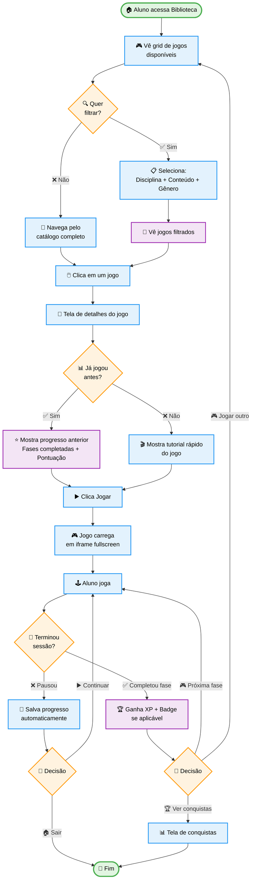

# STUDENT-003: Library Games (Jogos Educacionais)

:::info Contexto
**Jornada**: Estudante  
**Prioridade**: Baixa  
**Complexidade**: Baixa  
**Status**: ✅ Documentado (AS-IS Baseline)
:::

## 1. Visão Geral

### Problema

Estudantes precisam de momentos lúdicos de aprendizado para consolidar conhecimentos de forma divertida e sem pressão, mas enfrentam: falta de recursos educacionais que pareçam jogos de verdade, ausência de variedade de gêneros (puzzle, aventura, quiz, estratégia), dificuldade para encontrar jogos adequados ao nível de conhecimento, falta de integração entre jogos e currículo escolar, ausência de progressão e conquistas em jogos educacionais, dificuldade para professores avaliarem aprendizado via jogos, e falta de opções offline para uso sem internet.

**Dores principais**:
- "Jogos educacionais" são chatos e infantis
- Difícil encontrar jogo sobre tópico específico (ex: divisão de frações)
- Não há progressão clara como em jogos comerciais
- Professores não conseguem acompanhar se aluno realmente aprendeu jogando
- Jogos exigem internet estável (problema em áreas rurais)
- Variedade limitada (só quiz ou memória)

### Solução AS-IS

Biblioteca de jogos educacionais com:
- **Catálogo Curado** de 50+ jogos HTML5 educacionais de alta qualidade
- **Filtros Avançados** por disciplina, conteúdo, faixa etária, gênero de jogo
- **Sistema de Conquistas** integrado com perfil do aluno (XP, badges)
- **Modo Multiplayer** em jogos selecionados (local ou online)
- **Dashboard de Aprendizado** mostrando conceitos praticados em cada jogo
- **Recomendações Personalizadas** baseadas em histórico e dificuldades identificadas
- **Downloads para Offline** em jogos compatíveis
- **Relatórios para Professores** sobre engajamento e conceitos dominados

## 2. Rotas e Navegação

```typescript
// src/router/student-routes.js
{
  path: '/student/library/games',
  name: 'student-games',
  component: () => import('@/views/pages/student-context/library/Games.vue'),
  meta: {
    resource: 'Student',
    action: 'read',
    breadcrumb: [
      { text: 'Início', to: '/student' },
      { text: 'Biblioteca', to: '/student/library' },
      { text: 'Jogos', active: true }
    ]
  }
},
{
  path: '/student/library/games/:gameId',
  name: 'student-game-play',
  component: () => import('@/views/pages/student-context/library/GamePlay.vue'),
  meta: {
    resource: 'Student',
    action: 'read'
  }
}
```

## 3. Fluxo de Usuário



## 4. Screenshots AS-IS

### Biblioteca de Jogos (Grid)


**Elementos**: Cards com thumbnail, título, disciplina, nível, rating, botão Play

### Detalhes do Jogo


**Elementos**: Banner, descrição, conceitos praticados, dificuldade, tempo médio, botão Jogar, progresso anterior (se houver)

### Jogo em Execução


**Elementos**: Iframe fullscreen com jogo HTML5, botões de controle (pausar, sair, volume)

### Conquistas Desbloqueadas


**Elementos**: Lista de conquistas do jogo, XP ganho, progresso geral

## 5. Regras de Negócio

### Catálogo de Jogos

```typescript
// Categorias de jogos disponíveis
const GAME_CATEGORIES = {
  PUZZLE: 'Quebra-cabeças',
  QUIZ: 'Quiz',
  ADVENTURE: 'Aventura',
  STRATEGY: 'Estratégia',
  SIMULATION: 'Simulação',
  ARCADE: 'Arcade Educativo'
}

// Níveis de dificuldade
const DIFFICULTY_LEVELS = {
  EASY: 'Fácil (1º-3º ano)',
  MEDIUM: 'Médio (4º-6º ano)',
  HARD: 'Difícil (7º-9º ano)',
  EXPERT: 'Avançado (Ensino Médio)'
}
```

### Sistema de XP e Conquistas

```typescript
// XP ganho por jogo
const GAME_XP_RULES = {
  completeLevel: 20,        // Completar uma fase
  perfectScore: 10,         // Pontuação perfeita em fase
  firstTimePlay: 15,        // Primeira vez jogando esse jogo
  speedBonus: 5,            // Completar fase rapidamente
  noHints: 10               // Completar sem usar dicas
}

// Conquistas específicas de jogos
const GAME_ACHIEVEMENTS = [
  {
    id: 'math-master',
    game: 'fraction-quest',
    condition: 'Complete todas 10 fases',
    xp: 100,
    badge: '🎓'
  },
  {
    id: 'speed-reader',
    game: 'reading-race',
    condition: 'Leia 1000 palavras/min',
    xp: 50,
    badge: '⚡'
  }
]
```

### Integração com Currículo

```typescript
// Mapeamento jogo → conceitos BNCC
const GAME_CURRICULUM_MAP = {
  'fraction-quest': {
    subject: 'Matemática',
    concepts: [
      'EF06MA07', // Frações
      'EF06MA08', // Operações com frações
      'EF06MA09'  // Representação decimal
    ],
    skills: ['raciocínio lógico', 'resolução de problemas']
  },
  'reading-race': {
    subject: 'Português',
    concepts: [
      'EF67LP20', // Compreensão leitora
      'EF67LP21'  // Vocabulário
    ],
    skills: ['velocidade de leitura', 'interpretação']
  }
}
```

## 6. API Endpoints

### GET /api/student/library/games

**Response**:
```json
{
  "games": [
    {
      "id": "fraction-quest",
      "title": "Aventura das Frações",
      "thumbnail": "https://cdn.educacross.com/games/fraction-quest.jpg",
      "category": "ADVENTURE",
      "subject": "Matemática",
      "difficulty": "MEDIUM",
      "avgPlayTime": "15 min",
      "rating": 4.7,
      "concepts": ["Frações", "Operações"],
      "progress": {
        "played": true,
        "levelsCompleted": 3,
        "totalLevels": 10,
        "highScore": 850
      }
    }
  ]
}
```

### POST /api/student/game/progress

**Request**:
```json
{
  "gameId": "fraction-quest",
  "level": 4,
  "score": 950,
  "timeSpent": 180,
  "hintsUsed": 1
}
```

**Response**:
```json
{
  "xpEarned": 25,
  "levelUnlocked": 5,
  "achievementsEarned": ["speed-bonus"],
  "conceptsMastered": ["EF06MA07"]
}
```

## 7. Melhorias TO-BE

1. **Modo Competitivo Online** 🏆
   - Torneios semanais entre alunos da rede
   - Leaderboards globais por jogo
   - Recompensas exclusivas para vencedores

2. **Criador de Jogos** 🎨
   - Professores criam variações de jogos existentes
   - Editor visual drag-and-drop
   - Compartilhamento entre escolas

3. **VR/AR Games** 🥽
   - Jogos em realidade virtual (quando dispositivos disponíveis)
   - AR para laboratório virtual de ciências
   - Experiências imersivas

4. **Social Features** 👥
   - Compartilhar pontuações com amigos
   - Desafiar colegas para duelos
   - Sistema de presentes virtuais

5. **Gamification Avançada** 🎮
   - Temporadas com jogos rotativos
   - Battle Pass estilo Fortnite
   - Eventos especiais sazonais

## 8. Referências

- [Design System - DSGameCard](https://storybook.educacross.com/?path=/story/cards-gamecard)
- [Catálogo de Jogos HTML5 Educacionais](https://kahoot.com/)
- [API Docs - Library Games](https://apieducacrossmanager-test.azurewebsites.net/index.html)
- [Learning Path (jornada relacionada)](./learning-path.md)

---

**Última atualização**: 2026-02-04  
**Versão**: AS-IS v1.0  
**Status**: 📝 Documentado - Aguardando Protótipo TO-BE
