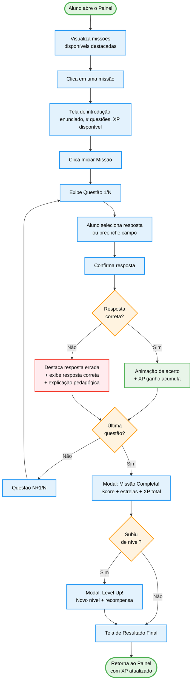

import { IconCheck, IconX, IconCircleGreen, IconCircleRed, IconCircleYellow, IconStudent, IconGame } from '@site/src/components/MaterialIcon';

# STD-001: Realizar Missão

:::info Contexto
**Jornada**: Aluno
**Prioridade**: Alta
**Complexidade**: Alta
**Status**: <IconCheck /> Documentado (AS-IS Baseline)
:::

## 1. Visão Geral

### O que é

Realizar uma Missão é o **loop de gameplay central** da plataforma Educacross. O aluno acessa uma missão atribuída pelo professor, responde uma sequência de questões pedagógicas e recebe feedback imediato a cada resposta — acumulando XP, estrelas e progressão de nível.

É a interação mais frequente de toda a plataforma: um aluno típico realiza entre 2 e 5 missões por semana.

### Jornada do Usuário

**Persona**: João Pedro Santos, 12 anos, 7º ano do Ensino Fundamental.

> *"Quando a professora libera a missão eu nem espero ela terminar de explicar, porque sei que se eu acabar antes dos outros ganho estrela bônus."*

João acessa a plataforma pelo celular em casa ou pelo tablet da escola. Ele vê as missões disponíveis no seu painel, escolhe uma missão de Matemática e começa a responder. Quando erra, quer entender o porquê — não apenas ver "Errou". Quando acerta, a animação de XP acumulando é o que o faz querer continuar.

## 2. Rotas e Navegação

```typescript
// src/router/student-routes/mission-execution-routes.js
export default [
  {
    path: '/student/missions/:missionId/execute',
    name: 'student-mission-execute',
    component: () => import('@/views/pages/student-context/missionExecution/Index.vue'),
    meta: {
      resource: 'MissionExecution',
      action: 'play',
      layout: 'full' // tela cheia, sem sidebar
    }
  },
  {
    path: '/student/missions/:missionId/result',
    name: 'student-mission-result',
    component: () => import('@/views/pages/student-context/missionExecution/MissionResult.vue'),
    meta: { resource: 'MissionExecution', action: 'read' }
  }
]
```

**Fluxo de navegação**:
1. Aluno acessa dashboard → visualiza missões disponíveis
2. Clica em uma missão → tela de detalhes/enunciado
3. Clica "Iniciar Missão" → modo execução (full-screen)
4. Responde questões sequencialmente
5. Ao concluir → tela de resultado com score e XP ganho
6. Retorna ao dashboard (com nível atualizado)

## 3. Arquitetura de Componentes

### Estrutura de Pastas

```
src/views/pages/student-context/missionExecution/
├── Index.vue                    # Orquestrador da execução
├── MissionResult.vue            # Tela de resultado final
└── components/
    ├── MissionHeader.vue        # Barra do topo: nome, progresso, timer
    ├── QuestionRenderer.vue     # Renderiza o tipo de questão correto
    ├── MultipleChoice.vue       # Questão de múltipla escolha
    ├── TrueOrFalse.vue          # Questão verdadeiro/falso
    ├── FillInTheBlank.vue       # Lacuna para preencher
    ├── FeedbackCorrect.vue      # Animação de acerto + XP ganho
    ├── FeedbackIncorrect.vue    # Explicação do erro + resposta correta
    ├── MissionCompleteModal.vue # Modal ao finalizar todas as questões
    └── LevelUpModal.vue         # Modal de subida de nível (se aplicável)
```

### Componente Index.vue (orquestrador)

```vue
<script setup>
import { ref, computed, onMounted } from 'vue'
import { useRoute, useRouter } from 'vue-router'
import { useMissionExecution } from '@/composables/useMissionExecution'

const route = useRoute()
const router = useRouter()
const {
  mission, currentQuestion, currentIndex, totalQuestions,
  progressPercent, xpGained, isComplete,
  submitAnswer, nextQuestion, finishMission
} = useMissionExecution(route.params.missionId)

const showFeedback = ref(false)
const lastAnswerCorrect = ref(false)

async function handleAnswer(answer) {
  const result = await submitAnswer(answer)
  lastAnswerCorrect.value = result.correct
  showFeedback.value = true
}

function handleNextQuestion() {
  showFeedback.value = false
  if (isComplete.value) {
    finishMission()
    router.push({ name: 'student-mission-result', params: { missionId: mission.value.id } })
  } else {
    nextQuestion()
  }
}
</script>
```

## 4. Composable de Domínio

```javascript
// src/composables/useMissionExecution.js
export function useMissionExecution(missionId) {
  const mission = ref(null)
  const questions = ref([])
  const currentIndex = ref(0)
  const answers = ref([])
  const xpGained = ref(0)
  const sessionId = ref(null)

  const currentQuestion = computed(() => questions.value[currentIndex.value])
  const totalQuestions = computed(() => questions.value.length)
  const progressPercent = computed(() =>
    Math.round((currentIndex.value / totalQuestions.value) * 100)
  )
  const isComplete = computed(() => currentIndex.value >= totalQuestions.value)

  async function loadMission() {
    const data = await MissionExecutionService.start(missionId)
    mission.value = data.mission
    questions.value = data.questions
    sessionId.value = data.sessionId
  }

  async function submitAnswer(selectedAnswer) {
    const result = await MissionExecutionService.answer({
      sessionId: sessionId.value,
      questionId: currentQuestion.value.id,
      answer: selectedAnswer
    })
    answers.value.push({ questionId: currentQuestion.value.id, correct: result.correct })
    if (result.correct) xpGained.value += result.xpEarned
    return result
  }

  function nextQuestion() {
    currentIndex.value++
  }

  async function finishMission() {
    await MissionExecutionService.finish(sessionId.value)
  }

  onMounted(loadMission)

  return {
    mission, currentQuestion, currentIndex, totalQuestions,
    progressPercent, xpGained, isComplete,
    submitAnswer, nextQuestion, finishMission
  }
}
```

## 5. Fluxo de Usuário (AS-IS)



## 6. Telas-chave

### Tela 1: Introdução da Missão

```typescript
interface MissionIntroState {
  mission: {
    id: string
    title: string              // 'Frações: Numerador e Denominador'
    subject: string            // 'Matemática'
    description: string        // 'Exercite seu conhecimento sobre frações...'
    questionCount: number      // 10
    estimatedMinutes: number   // 8
    xpAvailable: number        // 150
    maxStars: number           // 3
    teacher: string            // 'Professora Ana Lima'
    deadline: Date | null      // null se sem prazo
  }
}
```

**UI**: Ícone da disciplina, título, descrição, badges de "10 questões" e "≈ 8 min", barra de estrelas, XP disponível, botão grande "Iniciar Missão" (roxo). Link para voltar ao painel.

### Tela 2: Execução da Questão

```typescript
interface QuestionScreenState {
  question: {
    id: string
    index: number              // 3 (de 10)
    type: 'multiple-choice' | 'true-false' | 'fill-blank'
    stem: string               // 'Qual é o numerador da fração 3/7?'
    options?: string[]         // ['3', '7', '21', '1/3'] (múltipla escolha)
    media?: { type: 'image', url: string } | null
  }
  progressPercent: number      // 20 (2/10)
  xpGainedSoFar: number        // 30
  selectedAnswer: string | null
  timeElapsed: number          // segundos desde início da missão
}
```

**UI**: Barra de progresso no topo, enunciado centralizado, opções em botões grandes (fáceis de tocar no mobile), botão "Confirmar" desabilitado até seleção.

### Tela 3: Feedback de Acerto

```typescript
interface CorrectFeedbackState {
  xpEarned: number             // 15
  streakBonus: boolean         // true se 3+ acertos consecutivos
  streakCount: number          // 4
  celebrationAnimation: 'sparkle' | 'confetti' | 'stars'
}
```

**UI**: Fundo verde com ícone de check animado. "+" XP aparece flutuando em animação. Se streak ativo: mensagem "4 acertos seguidos! Bônus de streak!" em dourado. Botão "Próxima" para continuar.

### Tela 4: Feedback de Erro

```typescript
interface WrongFeedbackState {
  selectedAnswer: string       // resposta errada do aluno
  correctAnswer: string        // resposta correta
  explanation: string          // 'O numerador é o número de cima da fração...'
  hintText: string | null      // dica adicional opcional
}
```

**UI**: Fundo vermelho claro. Resposta do aluno tachada em vermelho. Resposta correta destacada em verde. Caixa de explicação pedagógica abaixo. Botão "Entendi, próxima".

### Tela 5: Missão Completa

```typescript
interface MissionCompleteState {
  score: number                // 80 (acertos %)
  starsEarned: number          // 2 (de 3)
  xpTotal: number              // 120
  correctAnswers: number       // 8
  totalQuestions: number       // 10
  timeSpent: number            // 420 (segundos)
  personalRecord: boolean      // true se melhor pontuação nesta missão
}
```

**UI**: Modal centralizado com estrelas animadas preenchendo (1→2→3). Score em destaque. Botão "Ver resultado completo" e "Fazer novamente" (se permitido pelo professor).

### Tela 6: Level Up

```typescript
interface LevelUpState {
  previousLevel: number        // 7
  newLevel: number             // 8
  levelName: string            // 'Explorador Avançado'
  rewardUnlocked: string | null // 'Novo avatar desbloqueado!'
  totalXP: number              // 2450
}
```

**UI**: Tela de celebração com animação de raios e confetes. Número de nível cresce animado de 7→8. Badge do novo título. Botão "Continuar".

## 7. Regras e Comportamentos

| Regra | Comportamento |
|-------|---------------|
| **Tentativas** | Por padrão, 1 tentativa por questão. O professor pode configurar múltiplas tentativas |
| **XP por acerto** | 15 XP base por questão. Bônus de streak: +5 XP a partir do 3º acerto consecutivo |
| **Estrelas** | 3 estrelas: ≥90%; 2 estrelas: ≥70%; 1 estrela: ≥50%; 0 estrelas: &lt;50% |
| **Prazo** | Missões com prazo vencido continuam acessíveis mas exibem badge "Atrasado" |
| **Re-execução** | Configurável pelo professor. Se permitida, mantém o melhor score histórico |
| **Ordem das questões** | Sequencial por padrão. Professor pode ativar randomização |
| **Tempo** | Sem limite por padrão. Professor pode definir tempo máximo por questão ou por missão |
| **Sessão interrompida** | Progresso salvo automaticamente a cada questão. Aluno pode retomar de onde parou |

## 8. API Endpoints

### POST `/student/missions/:id/start`
```json
// Response
{
  "sessionId": "sess_abc123",
  "mission": { "id": "...", "title": "Frações", "subject": "Matemática" },
  "questions": [
    {
      "id": "q1",
      "index": 1,
      "type": "multiple-choice",
      "stem": "Qual é o numerador da fração 3/7?",
      "options": ["3", "7", "21", "10"],
      "xpValue": 15
    }
  ]
}
```

### POST `/student/missions/answer`
```json
// Request
{ "sessionId": "sess_abc123", "questionId": "q1", "answer": "3" }

// Response
{
  "correct": true,
  "correctAnswer": "3",
  "explanation": null,
  "xpEarned": 15,
  "streakCount": 2,
  "streakBonus": 0
}
```

### POST `/student/missions/:id/finish`
```json
// Response
{
  "score": 80,
  "starsEarned": 2,
  "xpTotal": 120,
  "correctAnswers": 8,
  "totalQuestions": 10,
  "levelUp": {
    "occurred": true,
    "previousLevel": 7,
    "newLevel": 8,
    "levelName": "Explorador Avançado"
  }
}
```

## 9. Melhorias TO-BE

| Problema | Solução Proposta | Prioridade |
|----------|-----------------|------------|
| Explicação do erro genérica | IA gera explicação personalizada baseada no erro específico do aluno | <IconCircleRed size={14} /> Alta |
| Questões apenas textuais | Suporte a questões com vídeo, áudio e drag-and-drop | <IconCircleRed size={14} /> Alta |
| Sem modo colaborativo | Missão em dupla/grupo com score compartilhado | <IconCircleYellow size={14} /> Média |
| Feedback de erro imediato (pode "decorar") | Modo de revisão: feedback só ao final da missão | <IconCircleYellow size={14} /> Média |
| Sem adaptabilidade | Dificuldade adaptativa baseada no histórico do aluno | <IconCircleYellow size={14} /> Média |
| Timer não visual | Timer estilo "ampulheta" visual que aumenta a urgência | <IconCircleGreen size={14} /> Baixa |

## 10. Testes Recomendados

```javascript
// Unit: useMissionExecution composable
describe('useMissionExecution', () => {
  it('carrega missão e questões ao montar')
  it('calcula progressPercent corretamente')
  it('acumula xpGained apenas em acertos')
  it('marca isComplete quando passa da última questão')
  it('salva resposta antes de avançar')
})

// Unit: QuestionRenderer
describe('QuestionRenderer', () => {
  it('renderiza MultipleChoice para tipo multiple-choice')
  it('renderiza TrueOrFalse para tipo true-false')
  it('renderiza FillInTheBlank para tipo fill-blank')
  it('desabilita confirmação sem seleção')
})

// Integration: Fluxo completo de missão
describe('Mission Execution Flow', () => {
  it('exibe FeedbackCorrect e acumula XP após acerto')
  it('exibe FeedbackIncorrect com explicação após erro')
  it('exibe MissionCompleteModal após última questão')
  it('exibe LevelUpModal quando aluno sobe de nível')
  it('retoma sessão do ponto salvo após refresh da página')
})
```

## 11. Métricas de Sucesso

| Métrica | Atual | Meta |
|---------|-------|------|
| Taxa de conclusão de missão (iniciou → terminou) | ~65% | >80% |
| Missões realizadas por aluno/semana | ~2.1 | >3.5 |
| Tempo médio por missão | ~12 min | ~8 min (mais eficiente, não menos engajado) |
| Taxa de re-execução voluntária | ~15% | >30% |
| NPS do aluno (engajamento) | Não medido | >50 |

---

**Última Atualização**: Fevereiro 2026
**Referências**: [Persona: Aluno](../../personas/aluno) · [Dashboard do Aluno](./student-dashboard) · [Learning Path](./learning-path) · [Catálogo de Jornadas](../index)
