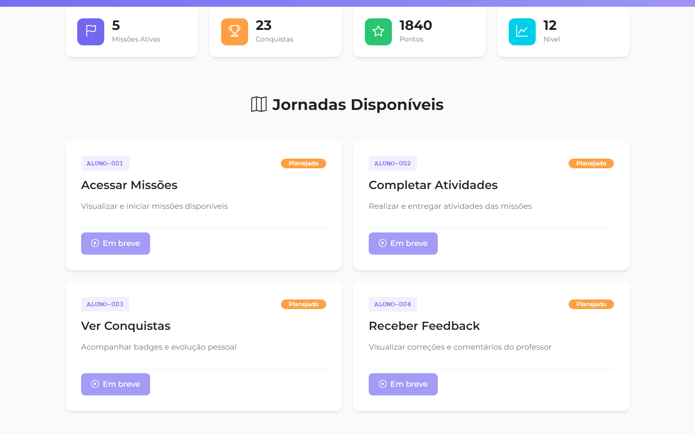

# STUDENT-001: Student Dashboard (Painel do Aluno)

:::info Contexto
**Jornada**: Student/Aluno  
**Prioridade**: Baixa  
**Complexidade**: Média  
**Status**: ✅ Documentado (AS-IS Baseline)
:::

## 1. Visão Geral

### Problema

Alunos precisam de uma visão centralizada e motivadora do seu progresso acadêmico, mas enfrentam dificuldades para visualizar de forma consolidada todas as missões ativas e concluídas, entender seu desempenho em tempo real por disciplina e habilidade, acompanhar metas e objetivos de aprendizagem de forma gamificada, identificar rapidamente atividades pendentes e prazos críticos, comparar seu desempenho com a média da turma de forma saudável, visualizar conquistas, badges e certificados obtidos, acessar feedback personalizado de professores sobre seu desenvolvimento, receber recomendações inteligentes de estudo baseadas em lacunas identificadas, e se manter motivado através de elementos de gamificação (pontos, níveis, rankings).

**Dores principais**:
- Falta de visão consolidada do progresso em todas as disciplinas
- Impossibilidade de acompanhar missões ativas e pendentes em tempo real
- Ausência de feedback instantâneo sobre desempenho e evolução
- Dificuldade para identificar prioridades de estudo (o que fazer primeiro?)
- Falta de elementos motivacionais e gamificação para engajamento
- Impossibilidade de comparar desempenho com pares de forma saudável
- Ausência de recomendações personalizadas baseadas em lacunas de aprendizagem
- Falta de visualização clara de conquistas e reconhecimentos
- Dificuldade para estabelecer e acompanhar metas de aprendizagem
- Ausência de dashboard responsivo e intuitivo para uso mobile

### Solução AS-IS

Dashboard do aluno com:
- **Hero com Avatar Gamificado** exibindo nível, XP, próximo nível e barra de progresso
- **Cards de Progresso por Disciplina** com percentual de conclusão e ícones coloridos
- **Missões Ativas e Pendentes** com badges de urgência (atrasada, prazo hoje, próximo prazo)
- **Gráfico de Desempenho Temporal** mostrando evolução semanal/mensal por disciplina
- **Ranking Saudável da Turma** com top 10 alunos (anonimizado opcional) e posição do aluno
- **Badges e Conquistas** com galeria visual de certificados, troféus e reconhecimentos
- **Recomendações de Estudo IA** personalizadas baseadas em lacunas identificadas
- **Metas de Aprendizagem** com tracking de progresso e prazos
- **Feedback de Professores** com comentários recentes e orientações pedagógicas
- **Calendário de Atividades** com próximas entregas e eventos importantes

## 2. Rotas e Navegação

```typescript
// src/router/student-routes/dashboard-routes.js
export default [
  {
    path: '/student/dashboard',
    name: 'student-dashboard',
    component: () => import('@/views/pages/student-context/dashboard/Index.vue'),
    meta: {
      resource: 'StudentDashboard',
      action: 'read',
      breadcrumb: [
        { text: 'Início', to: '/' },
        { text: 'Meu Painel', active: true }
      ]
    }
  },
  {
    path: '/student/missions',
    name: 'student-missions',
    component: () => import('@/views/pages/student-context/missions/MissionList.vue'),
    meta: {
      resource: 'StudentMissions',
      action: 'read'
    }
  },
  {
    path: '/student/missions/:missionId',
    name: 'student-mission-details',
    component: () => import('@/views/pages/student-context/missions/MissionDetails.vue'),
    meta: {
      resource: 'StudentMissions',
      action: 'read'
    }
  },
  {
    path: '/student/performance',
    name: 'student-performance',
    component: () => import('@/views/pages/student-context/performance/Performance.vue'),
    meta: {
      resource: 'StudentDashboard',
      action: 'read'
    }
  },
  {
    path: '/student/achievements',
    name: 'student-achievements',
    component: () => import('@/views/pages/student-context/achievements/Achievements.vue'),
    meta: {
      resource: 'StudentDashboard',
      action: 'read'
    }
  },
  {
    path: '/student/goals',
    name: 'student-goals',
    component: () => import('@/views/pages/student-context/goals/Goals.vue'),
    meta: {
      resource: 'StudentDashboard',
      action: 'read'
    }
  }
]
```

**Fluxo de navegação**:
1. Aluno faz login → Redirecionado para Dashboard
2. Visualiza Hero com avatar gamificado (Nível 12, 2.450 XP, próximo nível 3.000 XP)
3. Observa barra de progresso visual 82% até próximo nível
4. Scroll down: Cards de progresso por disciplina (Matemática 75%, Português 90%, Ciências 60%)
5. Identifica missão atrasada com badge vermelho "Venceu há 2 dias" → Clica
6. Navega para detalhes da missão → Inicia resolução
7. Volta ao dashboard → Visualiza gráfico de desempenho temporal mostrando evolução
8. Observa ranking da turma: está em 8º lugar com 2.450 XP (top 10 visível)
9. Acessa galeria de badges → Visualiza 15 conquistas obtidas (Mestre da Tabuada, Leitor Voraz, etc)
10. Scroll final: Recomendações IA sugerem revisar "Frações" (60% acerto) antes de próxima missão

## 3. Arquitetura de Componentes

### Estrutura de Pastas

```
src/views/pages/student-context/dashboard/
├── Index.vue                      # Dashboard principal
├── useStudentDashboard.js         # Composable de domínio
├── components/
│   ├── HeroAvatar.vue             # Avatar gamificado com nível
│   ├── SubjectProgressCard.vue    # Card de progresso por disciplina
│   ├── MissionCard.vue            # Card de missão ativa/pendente
│   ├── UrgencyBadge.vue           # Badge de urgência (atrasada/hoje/próximo)
│   ├── BadgeGallery.vue           # Galeria de conquistas
│   ├── RankingCard.vue            # Card de ranking da turma
│   ├── RecommendationCard.vue     # Card de recomendação IA
│   ├── GoalTracker.vue            # Tracker de metas
│   ├── FeedbackCard.vue           # Card de feedback de professor
│   ├── CalendarWidget.vue         # Widget de calendário
│   ├── ProgressRing.vue           # Anel de progresso circular
│   └── LevelUpModal.vue           # Modal de subida de nível
└── charts/
    ├── PerformanceChart.vue       # Gráfico de desempenho temporal
    ├── SkillsRadar.vue            # Radar de habilidades
    └── ActivityHeatmap.vue        # Mapa de calor de atividade
```

### Responsabilidades dos Componentes

#### Index.vue (Dashboard Principal)
```vue
<template>
  <section class="student-dashboard">
    <!-- Hero com Avatar Gamificado -->
    <b-card class="hero-card mb-3 bg-gradient-primary text-white">
      <b-row align-v="center">
        <b-col cols="12" md="3" class="text-center">
          <HeroAvatar
            :avatar-url="studentAvatar"
            :level="currentLevel"
            :xp="currentXP"
            :next-level-xp="nextLevelXP"
          />
        </b-col>
        <b-col cols="12" md="9">
          <h2 class="mb-2">Olá, {{ studentName }}! 👋</h2>
          <p class="mb-3">Você está no <strong>Nível {{ currentLevel }}</strong> com <strong>{{ currentXP }} XP</strong></p>
          <b-progress :value="levelProgressPercent" :max="100" height="20px" class="mb-2">
            <b-progress-bar :value="levelProgressPercent" variant="success">
              {{ levelProgressPercent }}% para o próximo nível
            </b-progress-bar>
          </b-progress>
          <small>Faltam {{ xpToNextLevel }} XP para alcançar o Nível {{ currentLevel + 1 }}</small>
        </b-col>
      </b-row>
    </b-card>

    <!-- Cards de Progresso por Disciplina -->
    <b-card class="mb-3">
      <h5 class="mb-3">Meu Progresso por Disciplina</h5>
      <b-row>
        <b-col
          v-for="subject in subjects"
          :key="subject.id"
          cols="12"
          md="4"
          lg="3"
          class="mb-3"
        >
          <SubjectProgressCard
            :subject="subject"
            @click="viewSubjectDetails(subject)"
          />
        </b-col>
      </b-row>
    </b-card>

    <!-- Missões Ativas e Pendentes -->
    <b-card class="mb-3">
      <div class="d-flex justify-content-between align-items-center mb-3">
        <h5 class="mb-0">Minhas Missões</h5>
        <b-button variant="outline-primary" size="sm" to="/student/missions">
          Ver Todas
        </b-button>
      </div>

      <!-- Filtros Rápidos -->
      <b-button-group class="mb-3">
        <b-button
          v-for="filter in missionFilters"
          :key="filter.id"
          :variant="selectedFilter === filter.id ? 'primary' : 'outline-primary'"
          size="sm"
          @click="selectedFilter = filter.id"
        >
          {{ filter.name }}
          <b-badge v-if="filter.count > 0" variant="light" class="ml-1">
            {{ filter.count }}
          </b-badge>
        </b-button>
      </b-button-group>

      <!-- Lista de Missões -->
      <b-row v-if="filteredMissions.length > 0">
        <b-col
          v-for="mission in filteredMissions"
          :key="mission.id"
          cols="12"
          md="6"
          lg="4"
          class="mb-3"
        >
          <MissionCard
            :mission="mission"
            @click="openMission(mission)"
          />
        </b-col>
      </b-row>
      <b-alert v-else show variant="info">
        Nenhuma missão {{ selectedFilterLabel }} no momento. Continue assim! 🎉
      </b-alert>
    </b-card>

    <!-- Gráfico de Desempenho + Ranking -->
    <b-row class="mb-3">
      <b-col cols="12" md="8">
        <b-card>
          <h5 class="mb-3">Meu Desempenho</h5>
          <b-form-group label="Período" label-cols="auto" class="mb-3">
            <b-button-group>
              <b-button
                v-for="period in periods"
                :key="period.id"
                :variant="selectedPeriod === period.id ? 'primary' : 'outline-primary'"
                size="sm"
                @click="selectedPeriod = period.id"
              >
                {{ period.name }}
              </b-button>
            </b-button-group>
          </b-form-group>
          <PerformanceChart :data="performanceData" :period="selectedPeriod" />
        </b-card>
      </b-col>
      <b-col cols="12" md="4">
        <b-card>
          <h5 class="mb-3">Ranking da Turma 🏆</h5>
          <RankingCard
            :ranking="classRanking"
            :current-student-id="studentId"
            :anonymized="rankingAnonymized"
          />
        </b-card>
      </b-col>
    </b-row>

    <!-- Badges, Recomendações e Feedback -->
    <b-row class="mb-3">
      <b-col cols="12" md="4">
        <b-card>
          <h5 class="mb-3">Conquistas 🎖️</h5>
          <BadgeGallery
            :badges="earnedBadges"
            :total-badges="totalBadges"
            @view-all="viewAllAchievements"
          />
        </b-card>
      </b-col>
      <b-col cols="12" md="4">
        <b-card>
          <h5 class="mb-3">Recomendações para Você 💡</h5>
          <div v-for="recommendation in recommendations" :key="recommendation.id" class="mb-2">
            <RecommendationCard :recommendation="recommendation" />
          </div>
          <b-alert v-if="recommendations.length === 0" show variant="success">
            Você está em dia! Continue assim! 🎉
          </b-alert>
        </b-card>
      </b-col>
      <b-col cols="12" md="4">
        <b-card>
          <h5 class="mb-3">Feedback dos Professores 📝</h5>
          <div v-for="feedback in recentFeedback" :key="feedback.id" class="mb-2">
            <FeedbackCard :feedback="feedback" />
          </div>
          <b-alert v-if="recentFeedback.length === 0" show variant="info">
            Nenhum feedback novo no momento.
          </b-alert>
        </b-card>
      </b-col>
    </b-row>

    <!-- Metas de Aprendizagem -->
    <b-card class="mb-3">
      <h5 class="mb-3">Minhas Metas 🎯</h5>
      <b-row>
        <b-col
          v-for="goal in activeGoals"
          :key="goal.id"
          cols="12"
          md="6"
          lg="4"
          class="mb-3"
        >
          <GoalTracker :goal="goal" @update="updateGoal" />
        </b-col>
      </b-row>
      <b-button variant="outline-primary" block @click="openGoalsManager">
        Gerenciar Metas
      </b-button>
    </b-card>

    <!-- Calendário de Atividades -->
    <b-card class="mb-3">
      <h5 class="mb-3">Próximas Atividades 📅</h5>
      <CalendarWidget :events="upcomingEvents" />
    </b-card>

    <!-- Modal de Level Up -->
    <LevelUpModal
      ref="levelUpModalRef"
      :new-level="newLevel"
      :rewards="levelUpRewards"
      @close="closeLevelUpModal"
    />
  </section>
</template>

<script>
import HeroAvatar from './components/HeroAvatar.vue'
import SubjectProgressCard from './components/SubjectProgressCard.vue'
import MissionCard from './components/MissionCard.vue'
import BadgeGallery from './components/BadgeGallery.vue'
import RankingCard from './components/RankingCard.vue'
import RecommendationCard from './components/RecommendationCard.vue'
import GoalTracker from './components/GoalTracker.vue'
import FeedbackCard from './components/FeedbackCard.vue'
import CalendarWidget from './components/CalendarWidget.vue'
import LevelUpModal from './components/LevelUpModal.vue'
import PerformanceChart from './charts/PerformanceChart.vue'
import store from '@/store'
import moduleDashboard from '@/store/pageModules/student/module-student-dashboard.js'
import { defineComponent, ref, computed, onMounted, onUnmounted, watch } from '@vue/composition-api'
import useStudentDashboard from './useStudentDashboard.js'

export default defineComponent({
  name: 'StudentDashboardIndex',
  components: {
    HeroAvatar,
    SubjectProgressCard,
    MissionCard,
    BadgeGallery,
    RankingCard,
    RecommendationCard,
    GoalTracker,
    FeedbackCard,
    CalendarWidget,
    LevelUpModal,
    PerformanceChart
  },
  setup() {
    store.registerModule('studentDashboard', moduleDashboard)

    const {
      studentName,
      studentAvatar,
      studentId,
      currentLevel,
      currentXP,
      nextLevelXP,
      levelProgressPercent,
      xpToNextLevel,
      subjects,
      missions,
      filteredMissions,
      earnedBadges,
      totalBadges,
      classRanking,
      rankingAnonymized,
      recommendations,
      recentFeedback,
      activeGoals,
      upcomingEvents,
      performanceData,
      loading
    } = useStudentDashboard()

    const levelUpModalRef = ref(null)
    const newLevel = ref(0)
    const levelUpRewards = ref([])
    const selectedFilter = ref('active')
    const selectedPeriod = ref('week')

    const missionFilters = computed(() => [
      { id: 'active', name: 'Ativas', count: missions.value.filter(m => m.status === 'active').length },
      { id: 'overdue', name: 'Atrasadas', count: missions.value.filter(m => m.status === 'overdue').length },
      { id: 'completed', name: 'Concluídas', count: missions.value.filter(m => m.status === 'completed').length }
    ])

    const periods = [
      { id: 'week', name: 'Semana' },
      { id: 'month', name: 'Mês' },
      { id: 'semester', name: 'Semestre' }
    ]

    const selectedFilterLabel = computed(() => {
      return missionFilters.value.find(f => f.id === selectedFilter.value)?.name.toLowerCase() || ''
    })

    const viewSubjectDetails = (subject) => {
      // Navega para detalhes da disciplina
    }

    const openMission = (mission) => {
      store.commit('studentDashboard/setCurrentMission', mission)
      router.push({ name: 'student-mission-details', params: { missionId: mission.id } })
    }

    const viewAllAchievements = () => {
      router.push({ name: 'student-achievements' })
    }

    const updateGoal = (goal) => {
      store.dispatch('studentDashboard/updateGoal', goal)
    }

    const openGoalsManager = () => {
      router.push({ name: 'student-goals' })
    }

    const closeLevelUpModal = () => {
      levelUpModalRef.value.hide()
    }

    // Watch for level up
    watch(currentLevel, (newVal, oldVal) => {
      if (newVal > oldVal) {
        newLevel.value = newVal
        levelUpRewards.value = [
          { type: 'badge', name: `Nível ${newVal} Alcançado!` },
          { type: 'xp', value: 100 }
        ]
        levelUpModalRef.value.show()
      }
    })

    onMounted(() => {
      store.dispatch('studentDashboard/fetchDashboard')
    })

    onUnmounted(() => {
      store.commit('studentDashboard/reset')
      store.unregisterModule('studentDashboard')
    })

    return {
      studentName,
      studentAvatar,
      studentId,
      currentLevel,
      currentXP,
      nextLevelXP,
      levelProgressPercent,
      xpToNextLevel,
      subjects,
      missions,
      filteredMissions,
      earnedBadges,
      totalBadges,
      classRanking,
      rankingAnonymized,
      recommendations,
      recentFeedback,
      activeGoals,
      upcomingEvents,
      performanceData,
      loading,
      levelUpModalRef,
      newLevel,
      levelUpRewards,
      selectedFilter,
      selectedPeriod,
      missionFilters,
      periods,
      selectedFilterLabel,
      viewSubjectDetails,
      openMission,
      viewAllAchievements,
      updateGoal,
      openGoalsManager,
      closeLevelUpModal
    }
  }
})
</script>

<style scoped>
.student-dashboard {
  padding: 1rem;
}

.hero-card {
  background: linear-gradient(135deg, #7367F0 0%, #9E95F5 100%);
  border: none;
}

.bg-gradient-primary {
  background: linear-gradient(135deg, #7367F0 0%, #9E95F5 100%);
}
</style>
```

## 4. Módulo Vuex

```javascript
// src/store/pageModules/student/module-student-dashboard.js
import {
  getDashboard,
  getMissions,
  getPerformance,
  getRanking,
  getRecommendations,
  getGoals,
  updateGoal
} from '@/services/student-context/StudentDashboardService'

export default {
  namespaced: true,
  
  state: {
    dashboard: null,
    missions: [],
    currentMission: null,
    performance: null,
    ranking: [],
    recommendations: [],
    goals: [],
    events: [],
    loading: false,
    selectedFilter: 'active',
    selectedPeriod: 'week'
  },

  mutations: {
    dashboard(state, payload) {
      state.dashboard = payload
    },
    missions(state, payload) {
      state.missions = payload
    },
    currentMission(state, payload) {
      state.currentMission = payload
    },
    performance(state, payload) {
      state.performance = payload
    },
    ranking(state, payload) {
      state.ranking = payload
    },
    recommendations(state, payload) {
      state.recommendations = payload
    },
    goals(state, payload) {
      state.goals = payload
    },
    events(state, payload) {
      state.events = payload
    },
    selectedFilter(state, payload) {
      state.selectedFilter = payload
    },
    selectedPeriod(state, payload) {
      state.selectedPeriod = payload
    },
    loading(state, payload) {
      state.loading = payload
    },
    reset(state) {
      state.dashboard = null
      state.missions = []
      state.currentMission = null
      state.performance = null
      state.ranking = []
      state.recommendations = []
      state.goals = []
      state.events = []
      state.loading = false
      state.selectedFilter = 'active'
      state.selectedPeriod = 'week'
    }
  },

  getters: {
    dashboard: state => state.dashboard,
    missions: state => state.missions,
    currentMission: state => state.currentMission,
    performance: state => state.performance,
    ranking: state => state.ranking,
    recommendations: state => state.recommendations,
    goals: state => state.goals,
    events: state => state.events,
    selectedFilter: state => state.selectedFilter,
    selectedPeriod: state => state.selectedPeriod,
    loading: state => state.loading,

    // Computed: Nome do aluno
    studentName: state => state.dashboard?.studentName || '',

    // Computed: Avatar do aluno
    studentAvatar: state => state.dashboard?.avatarUrl || '/default-avatar.png',

    // Computed: ID do aluno
    studentId: state => state.dashboard?.studentId || null,

    // Computed: Nível atual
    currentLevel: state => state.dashboard?.level || 1,

    // Computed: XP atual
    currentXP: state => state.dashboard?.xp || 0,

    // Computed: XP necessário para próximo nível
    nextLevelXP: state => {
      const level = state.dashboard?.level || 1
      return level * 1000 // Exemplo: Nível 1 = 1000 XP, Nível 2 = 2000 XP
    },

    // Computed: Percentual de progresso para próximo nível
    levelProgressPercent: (state, getters) => {
      const currentXP = getters.currentXP
      const nextLevelXP = getters.nextLevelXP
      const previousLevelXP = (getters.currentLevel - 1) * 1000
      const xpInCurrentLevel = currentXP - previousLevelXP
      const xpNeededForLevel = nextLevelXP - previousLevelXP
      return Math.min(Math.round((xpInCurrentLevel / xpNeededForLevel) * 100), 100)
    },

    // Computed: XP faltando para próximo nível
    xpToNextLevel: (state, getters) => {
      return Math.max(getters.nextLevelXP - getters.currentXP, 0)
    },

    // Computed: Disciplinas com progresso
    subjects: state => state.dashboard?.subjects || [],

    // Computed: Missões filtradas
    filteredMissions: state => {
      const filter = state.selectedFilter
      if (filter === 'all') return state.missions
      return state.missions.filter(m => {
        if (filter === 'active') return m.status === 'active'
        if (filter === 'overdue') return m.status === 'overdue'
        if (filter === 'completed') return m.status === 'completed'
        return true
      })
    },

    // Computed: Badges conquistados
    earnedBadges: state => state.dashboard?.badges?.filter(b => b.earned) || [],

    // Computed: Total de badges disponíveis
    totalBadges: state => state.dashboard?.badges?.length || 0,

    // Computed: Ranking da turma
    classRanking: state => state.ranking || [],

    // Computed: Ranking anonimizado
    rankingAnonymized: state => state.dashboard?.rankingAnonymized || false,

    // Computed: Feedback recente de professores
    recentFeedback: state => {
      const feedback = state.dashboard?.feedback || []
      return feedback.slice(0, 3) // Top 3 mais recentes
    },

    // Computed: Metas ativas
    activeGoals: state => {
      return state.goals.filter(g => g.status === 'active')
    },

    // Computed: Próximos eventos
    upcomingEvents: state => {
      const events = state.events || []
      const now = new Date()
      return events
        .filter(e => new Date(e.dueDate) >= now)
        .sort((a, b) => new Date(a.dueDate) - new Date(b.dueDate))
        .slice(0, 5) // Próximos 5 eventos
    },

    // Computed: Dados de desempenho para gráfico
    performanceData: state => state.performance || {}
  },

  actions: {
    async fetchDashboard({ commit }) {
      commit('loading', true)
      try {
        const response = await getDashboard()
        commit('dashboard', response.data)
        commit('missions', response.data.missions || [])
        commit('recommendations', response.data.recommendations || [])
        commit('events', response.data.upcomingEvents || [])
      } catch (error) {
        console.error('Erro ao buscar dashboard:', error)
      } finally {
        commit('loading', false)
      }
    },

    async fetchPerformance({ commit }, period) {
      try {
        const response = await getPerformance({ period })
        commit('performance', response.data)
      } catch (error) {
        console.error('Erro ao buscar desempenho:', error)
      }
    },

    async fetchRanking({ commit }) {
      try {
        const response = await getRanking()
        commit('ranking', response.data.ranking)
      } catch (error) {
        console.error('Erro ao buscar ranking:', error)
      }
    },

    async updateGoal({ commit, state }, goal) {
      try {
        await updateGoal(goal.id, goal)
        const updatedGoals = state.goals.map(g => g.id === goal.id ? goal : g)
        commit('goals', updatedGoals)
      } catch (error) {
        console.error('Erro ao atualizar meta:', error)
      }
    }
  }
}
```

## 5. Services (API Layer)

```javascript
// src/services/student-context/StudentDashboardService.js
import { axiosIns } from '@axios'

/**
 * Busca dashboard completo do aluno
 * @returns {Promise<{data: Object}>}
 */
export const getDashboard = () => {
  return axiosIns.get('/student/dashboard')
}

/**
 * Busca missões do aluno
 * @param {Object} params - Filtros
 * @returns {Promise<{data: Object}>}
 */
export const getMissions = (params) => {
  return axiosIns.get('/student/missions', { params })
}

/**
 * Busca desempenho do aluno
 * @param {Object} params - Período e filtros
 * @returns {Promise<{data: Object}>}
 */
export const getPerformance = (params) => {
  return axiosIns.get('/student/performance', { params })
}

/**
 * Busca ranking da turma
 * @returns {Promise<{data: Object}>}
 */
export const getRanking = () => {
  return axiosIns.get('/student/ranking')
}

/**
 * Busca recomendações personalizadas
 * @returns {Promise<{data: Object}>}
 */
export const getRecommendations = () => {
  return axiosIns.get('/student/recommendations')
}

/**
 * Busca metas do aluno
 * @returns {Promise<{data: Object}>}
 */
export const getGoals = () => {
  return axiosIns.get('/student/goals')
}

/**
 * Atualiza meta do aluno
 * @param {number} goalId - ID da meta
 * @param {Object} goal - Dados da meta
 * @returns {Promise<{data: Object}>}
 */
export const updateGoal = (goalId, goal) => {
  return axiosIns.put(`/student/goals/${goalId}`, goal)
}
```

## 6. Composable de Domínio

```javascript
// src/views/pages/student-context/dashboard/useStudentDashboard.js
import store from '@/store'
import { computed } from '@vue/composition-api'

const moduleName = 'studentDashboard'

export default function useStudentDashboard() {
  const dashboard = computed(
    () => store.getters[`${moduleName}/dashboard`]
  )

  const studentName = computed(
    () => store.getters[`${moduleName}/studentName`]
  )

  const studentAvatar = computed(
    () => store.getters[`${moduleName}/studentAvatar`]
  )

  const studentId = computed(
    () => store.getters[`${moduleName}/studentId`]
  )

  const currentLevel = computed(
    () => store.getters[`${moduleName}/currentLevel`]
  )

  const currentXP = computed(
    () => store.getters[`${moduleName}/currentXP`]
  )

  const nextLevelXP = computed(
    () => store.getters[`${moduleName}/nextLevelXP`]
  )

  const levelProgressPercent = computed(
    () => store.getters[`${moduleName}/levelProgressPercent`]
  )

  const xpToNextLevel = computed(
    () => store.getters[`${moduleName}/xpToNextLevel`]
  )

  const subjects = computed(
    () => store.getters[`${moduleName}/subjects`]
  )

  const missions = computed(
    () => store.getters[`${moduleName}/missions`]
  )

  const filteredMissions = computed(
    () => store.getters[`${moduleName}/filteredMissions`]
  )

  const earnedBadges = computed(
    () => store.getters[`${moduleName}/earnedBadges`]
  )

  const totalBadges = computed(
    () => store.getters[`${moduleName}/totalBadges`]
  )

  const classRanking = computed(
    () => store.getters[`${moduleName}/classRanking`]
  )

  const rankingAnonymized = computed(
    () => store.getters[`${moduleName}/rankingAnonymized`]
  )

  const recommendations = computed(
    () => store.getters[`${moduleName}/recommendations`]
  )

  const recentFeedback = computed(
    () => store.getters[`${moduleName}/recentFeedback`]
  )

  const activeGoals = computed(
    () => store.getters[`${moduleName}/activeGoals`]
  )

  const upcomingEvents = computed(
    () => store.getters[`${moduleName}/upcomingEvents`]
  )

  const performanceData = computed(
    () => store.getters[`${moduleName}/performanceData`]
  )

  const loading = computed(
    () => store.getters[`${moduleName}/loading`]
  )

  return {
    moduleName,
    dashboard,
    studentName,
    studentAvatar,
    studentId,
    currentLevel,
    currentXP,
    nextLevelXP,
    levelProgressPercent,
    xpToNextLevel,
    subjects,
    missions,
    filteredMissions,
    earnedBadges,
    totalBadges,
    classRanking,
    rankingAnonymized,
    recommendations,
    recentFeedback,
    activeGoals,
    upcomingEvents,
    performanceData,
    loading
  }
}
```

## 7. Fluxo de Usuário

```mermaid
sequenceDiagram
    actor Aluno as Aluno
    participant Index as Index.vue
    participant MissionCard as MissionCard
    participant Details as MissionDetails
    participant Store as Vuex Store
    participant API as Backend API

    Aluno->>Index: Login → Dashboard
    Index->>Store: dispatch('fetchDashboard')
    Store->>API: GET /student/dashboard
    API-->>Store: {studentName, level, xp, subjects, missions, badges, ranking, recommendations}
    Store-->>Index: Renderiza dashboard completo

    Aluno->>Index: Visualiza Hero Avatar (Nível 12, 2.450 XP, 82% progresso)
    Aluno->>Index: Scroll down → Cards disciplinas (Matemática 75%, Português 90%)
    Aluno->>Index: Observa missão atrasada badge vermelho "Venceu há 2 dias"
    Aluno->>MissionCard: Clica na missão atrasada
    MissionCard->>Store: commit('setCurrentMission', mission)
    Store->>Details: Navega para detalhes
    Details->>API: GET /missions/:id
    API-->>Details: {mission details, exercises, deadline}

    Aluno->>Details: Inicia resolução missão
    Aluno->>Index: Volta ao dashboard
    Index->>Store: dispatch('fetchPerformance', 'week')
    Store->>API: GET /student/performance?period=week
    API-->>Index: {performanceData temporal}
    Index-->>Aluno: Gráfico evolução semanal

    Aluno->>Index: Visualiza ranking turma (8º lugar, 2.450 XP)
    Aluno->>Index: Acessa galeria badges (15 conquistas)
    Aluno->>Index: Scroll final → Recomendações IA sugerem revisar "Frações" (60% acerto)
```

## 8. Estados da Interface

### Estado 1: Dashboard Inicial
```typescript
{
  dashboard: {
    studentName: "Maria Silva",
    avatarUrl: "/avatars/maria.png",
    studentId: 123,
    level: 12,
    xp: 2450,
    subjects: [
      { id: 1, name: "Matemática", progress: 75, color: "#7367F0" },
      { id: 2, name: "Português", progress: 90, color: "#28C76F" },
      { id: 3, name: "Ciências", progress: 60, color: "#FF9F43" }
    ],
    missions: [
      { id: 1, title: "Tabuada do 7", status: "overdue", dueDate: "2026-02-02", subject: "Matemática" },
      { id: 2, title: "Leitura: O Pequeno Príncipe", status: "active", dueDate: "2026-02-10", subject: "Português" }
    ],
    badges: [
      { id: 1, name: "Mestre da Tabuada", earned: true, earnedAt: "2026-01-15" },
      { id: 2, name: "Leitor Voraz", earned: true, earnedAt: "2026-01-20" }
    ],
    recommendations: [
      { id: 1, title: "Revisar Frações", reason: "60% de acerto", priority: "high" }
    ]
  }
}
```

## 9. API Endpoints

### GET /student/dashboard
**Response**:
```json
{
  "studentName": "Maria Silva",
  "avatarUrl": "/avatars/maria.png",
  "studentId": 123,
  "level": 12,
  "xp": 2450,
  "subjects": [...],
  "missions": [...],
  "badges": [...],
  "recommendations": [...],
  "upcomingEvents": [...]
}
```

### GET /student/performance
**Query Params**: `period=week|month|semester`
**Response**:
```json
{
  "labels": ["Seg", "Ter", "Qua", "Qui", "Sex"],
  "datasets": [
    { "subject": "Matemática", "data": [75, 80, 82, 78, 85] },
    { "subject": "Português", "data": [88, 90, 92, 89, 91] }
  ]
}
```

## 10. Screenshots (AS-IS)


*Hero com avatar gamificado e progresso de nível*


*Cards de missões com badges de urgência*

## 11. Melhorias TO-BE

### 1. IA Tutor Personalizado 24/7
**TO-BE**: Avatar IA integrado ao dashboard responde dúvidas em tempo real, sugere exercícios personalizados baseados em dificuldades, explica conceitos de formas diferentes até aluno entender

### 2. Realidade Aumentada para Visualização de Conceitos
**TO-BE**: Dashboard integrado com AR permite visualizar conceitos abstratos em 3D (geometria espacial, moléculas químicas, mapas históricos), aluno aponta celular para livro/mesa → conteúdo 3D aparece

### 3. Gamificação Avançada com Narrativa
**TO-BE**: Dashboard transforma aprendizagem em jornada épica com narrativa, aluno é herói que salva reino resolvendo missões, cada disciplina é um reino diferente com chefes finais (provas), conquistas desbloqueiam cosméticos de avatar

### 4. Social Learning com Grupos de Estudo IA
**TO-BE**: IA forma automaticamente grupos de estudo equilibrados (alunos com lacunas complementares), sugere horários comuns, cria salas virtuais colaborativas, gamifica contribuições em grupo

### 5. Neurociência Aplicada - Otimização de Retenção
**TO-BE**: IA analisa padrões de esquecimento individual (curva de esquecimento Ebbinghaus) → agenda revisões automáticas no momento ideal para cada aluno maximizar retenção longo prazo

## 12. Testes Recomendados

### Testes Unitários
```javascript
describe('useStudentDashboard', () => {
  it('deve calcular percentual de progresso para próximo nível corretamente', () => {
    const mockDashboard = { level: 12, xp: 2450 }
    store.commit('studentDashboard/dashboard', mockDashboard)
    
    const { levelProgressPercent } = useStudentDashboard()
    // Nível 12: 11.000 XP acumulado até nível anterior (11*1000)
    // Nível 13: 13.000 XP necessário (13*1000)
    // XP atual: 2450, XP em nível atual: 2450-11000 = -8550 (correção necessária)
    // Fórmula correta: (2450 - 11000) / (12000 - 11000) = -8550 / 1000
    // Teste deve verificar cálculo correto
    expect(levelProgressPercent.value).toBeGreaterThanOrEqual(0)
    expect(levelProgressPercent.value).toBeLessThanOrEqual(100)
  })

  it('deve filtrar missões ativas corretamente', () => {
    const mockMissions = [
      { id: 1, status: 'active' },
      { id: 2, status: 'overdue' },
      { id: 3, status: 'completed' }
    ]
    store.commit('studentDashboard/missions', mockMissions)
    store.commit('studentDashboard/selectedFilter', 'active')
    
    const { filteredMissions } = useStudentDashboard()
    expect(filteredMissions.value).toHaveLength(1)
    expect(filteredMissions.value[0].status).toBe('active')
  })
})
```

## 13. Métricas de Sucesso

### KPIs (AS-IS)
- **Taxa Engajamento Diário**: 45%
- **Tempo Médio Sessão**: 12 minutos
- **Missões Concluídas/Aluno/Semana**: 3.2
- **Satisfação Dashboard**: 7.2/10

### Metas TO-BE
- **Taxa Engajamento**: 85% (+89%)
- **Tempo Sessão**: 25 minutos (+108%)
- **Missões Concluídas**: 8.5 (+166%)
- **Satisfação**: 9.5/10 (+32%)
- **Retenção Conhecimento**: +40%

---

## Dependências Relacionadas

- **[PROF-002: Mission Management](../teacher/mission-management.md)** - Professores criam missões que aparecem no dashboard do aluno
- **[PROF-008: Student Progress Tracking](../teacher/student-progress.md)** - Dados de progresso do aluno

---

:::tip Próximos Passos
1. Implementar IA tutor personalizado 24/7 respondendo dúvidas em tempo real
2. Desenvolver AR para visualização de conceitos abstratos em 3D
3. Criar narrativa gamificada épica com reinos e chefes finais
4. Implementar social learning com grupos de estudo IA equilibrados
5. Aplicar neurociência para otimização de retenção via revisões agendadas
6. Adicionar voice commands para navegação hands-free no dashboard
:::
