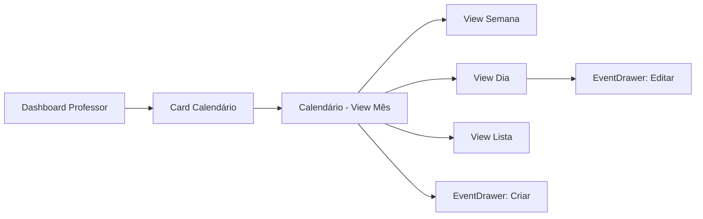
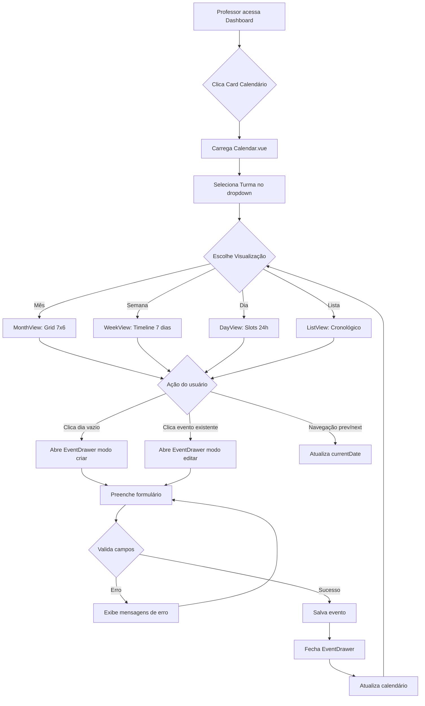
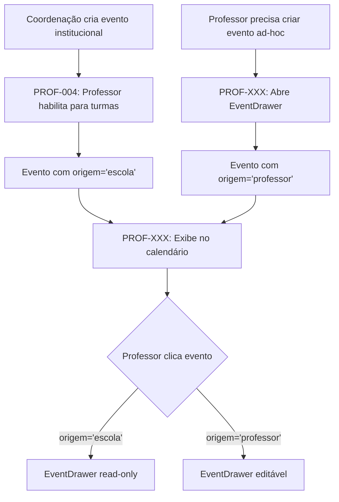

# PROF-XXX: Calendário de Eventos

<span class="badge badge-danger">🔴 Alta Prioridade</span>
<span class="badge badge-warning">Sprint TO-BE</span>
<span class="badge badge-info">Protótipo V1</span>

---

## Visão Geral

**Categoria**: Professores → Planejamento e Acompanhamento  
**Prioridade**: 🔴 Alta (>1000 acessos/dia esperados)  
**Status**: TO-BE (Protótipo Funcional V1)  
**Duração Estimada**: 6 semanas de desenvolvimento  
**Complexidade**: ⭐⭐⭐⭐ (4/5 - Alta)

### Resumo Executivo

O Calendário de Eventos é uma nova jornada que centraliza a visualização e gerenciamento de todos os eventos educacionais de um professor em um único lugar. Combina eventos institucional (criados pela escola/rede) com eventos customizados (criados pelo próprio professor), oferecendo 4 visualizações distintas: Mês, Semana, Dia e Lista.

---

## Problema que Resolve

### <IconTarget /> Pain Points Identificados

**Problema 1: Fragmentação de Informações**
- Professores precisam alternar entre múltiplas views para acessar diferentes tipos de eventos
- Eventos da escola (habilitados em PROF-004) e eventos customizados estão em lugares diferentes
- Falta visão consolidada temporal de todas as atividades

**Problema 2: Ausência de Visualização Calendário**
- Sistema atual usa apenas listas de eventos (PROF-004: Events Management)
- Professores não conseguem visualizar eventos em formato de calendário mensal/semanal
- Dificulta planejamento de aulas e identificação de conflitos de agenda

**Problema 3: Impossibilidade de Criar Eventos Customizados**
- Professores dependem da coordenação para criar eventos
- Não há forma de criar atividades ad-hoc (ex: revisão extra, atendimento individual)
- Processo lento e centralizado limita autonomia do professor

**Problema 4: Falta de Filtros por Turma**
- Professor com 4+ turmas vê eventos de todas misturados
- Não há filtro unificado para focar em uma turma específica
- Sobrecarga de informação dificulta planejamento por turma

---

## Solução Proposta

### <IconCheck /> Funcionalidades Principais

1. **Calendário Multi-View**: 4 visualizações (Mês/Semana/Dia/Lista) com navegação intuitiva
2. **Eventos Dual-Source**: Exibe eventos da escola (PROF-004) + eventos customizados do professor
3. **Criação de Eventos**: EventDrawer lateral para criar/editar eventos customizados
4. **Filtro de Turma**: Dropdown para filtrar eventos por turma específica ou "Todas"
5. **Color-Coded**: 6 tipos de atividades com cores distintas (Missões, Olimpíadas, Avaliações, Trilhas, Expedições, Outros)
6. **Responsivo**: Layout adaptativo para desktop, tablet e mobile

---

## Personas

### 👤 Persona Primária: **Professor (Isabella Cross)**

**Comportamento**:
- Acessa diariamente para planejar aulas e verificar próximos eventos
- Cria eventos customizados 2-3 vezes por semana (revisões, atendimentos)
- Alterna entre view Mês (planejamento) e Dia (execução)
- Filtra por turma para focar em uma classe específica

**

Necessidades**:
- Visão rápida de todos os eventos do mês
- Criar eventos sem depender da coordenação
- Ver apenas eventos de uma turma quando necessário
- Editar/cancelar eventos customizados criados por ele

**Jobs-to-be-Done**:
- "Quando estou planejando a semana, preciso ver todos os eventos para evitar conflitos"
- "Quando preciso marcar uma revisão extra, quero criar rapidamente sem burocracia"
- "Quando foco em uma turma, preciso ver apenas eventos dela"

### 👤 Persona Secundária: **Coordenador Pedagógico**

**Comportamento**:
- Acessa semanalmente para visualizar calendário de todos os professores
- Monitora quais eventos foram criados pelos professores
- Valida se há sobrecarga de avaliações em uma mesma data

**Necessidades**:
- View read-only do calendário de outros professores
- Filtro por professor + turma para monitoramento
- Exportar calendário mensal em PDF

### 👤 Persona Terciária: **Diretor de Área**

**Comportamento**:
- Acessa mensalmente para visão estratégica
- Compara volume de eventos entre professores/turmas
- Identifica períodos de baixa atividade

**Necessidades**:
- Dashboard agregado com métricas de eventos
- Heatmap de densidade de eventos por período
- Comparativo entre professores da área

---

## Rota e Navegação

### URL Principal
```
/teacher/calendar
```

### Query Parameters (opcional)
```
/teacher/calendar?view=month
/teacher/calendar?view=week
/teacher/calendar?view=day
/teacher/calendar?view=list
/teacher/calendar?turma=5a-manha
/teacher/calendar?date=2026-02-15
```

### Breadcrumb
```
Home > Calendário
```

### Navegação no Sistema



---

## Arquitetura de Arquivos

```
src/
├── components/
│   └── EventDrawer.vue                    # Drawer reutilizável (criar/editar evento)
│
├── views/teacher/
│   ├── Calendar.vue                       # Container principal (header + tabs + views)
│   └── calendar/                          # Sub-views da jornada
│       ├── MonthView.vue                 # Grid 7x6 com event pills
│       ├── WeekView.vue                  # Timeline horizontal 7 dias
│       ├── DayView.vue                   # Timeline vertical 24h
│       └── ListView.vue                  # Lista cronológica agrupada
│
├── composables/
│   └── useCalendar.js                    # Lógica compartilhada (filtros, formatação, cores)
│
├── data/
│   └── eventsCalendar.json               # Mock data (30 eventos para testes)
│
└── router/
    └── index.js                          # Rota: /teacher/calendar
```

### Responsabilidades dos Componentes

| Componente | Responsabilidade | Props | Emits |
|------------|------------------|-------|-------|
| **Calendar.vue** | Container principal, state central, tab switching, header com navegação | - | - |
| **MonthView.vue** | Grid 7x6, event pills, hover tooltips, max 3 events por dia | `currentDate`, `events`, `selectedTurma` | `select-date`, `edit-event` |
| **WeekView.vue** | Timeline 24h x 7 dias, event blocks posicionados por horário | `currentDate`, `events`, `selectedTurma` | `select-event`, `edit-event`, `create-event` |
| **DayView.vue** | Slots de 1h, eventos detalhados, click em slot vazio pré-preenche drawer | `currentDate`, `events`, `selectedTurma` | `edit-event`, `create-event` |
| **ListView.vue** | Cronológico, agrupado por período (hoje/amanhã/semana/futuro) | `events`, `selectedTurma`, `dateRange` | `edit-event` |
| **EventDrawer.vue** | Formulário criar/editar, validação, dual-mode (new/edit) | `isOpen`, `eventData` | `close`, `save` |

---

## Fluxo de Usuário Completo



---

## Estados da Interface

### Estado 1: Loading Inicial
- **Trigger**: Primeira carga da página
- **Elementos**: Skeleton screens no lugar do calendário
- **Duração**: ~1-2 segundos
- **Saída**: Transita para Estado 2 (Loaded)

### Estado 2: Loaded - View Mês
- **Elementos Visuais**:
  - Header roxo gradiente com título + breadcrumb
  - Turma selector (dropdown) + botão "Adicionar Evento"
  - Navegação: < Fevereiro 2026 > + botão "Hoje"
  - Tabs: **Mês** (ativa), Semana, Dia, Lista
  - Grid 7x6 com dias do mês
  - Event pills (max 3 por dia, overflow "+X mais")
  - Footer com legend de cores (6 tipos de atividade)
- **Interações**:
  - Click em dia vazio → abre drawer modo criar
  - Click em evento → abre drawer modo editar
  - Hover em evento → exibe tooltip com descrição completa
  - Click < ou > → navega mês anterior/próximo
  - Click "Hoje" → volta para mês atual

### Estado 3: Loaded - View Semana
- **Elementos Visuais**:
  - Header com 7 colunas (dom-sáb) com data e dia
  - Timeline vertical: 08:00 - 18:00 (11 horas)
  - Event blocks posicionados por horário
  - Altura proporcional à duração do evento
- **Interações**:
  - Click em slot vazio → abre drawer com data/hora pré-preenchida
  - Click em evento → abre drawer modo editar
  - Hover em evento → destaca com shadow
  - Click < ou > → navega semana anterior/próxima

### Estado 4: Loaded - View Dia
- **Elementos Visuais**:
  - Header roxo com data grande (ex: "Sexta-feira, 10 de fevereiro de 2026")
  - Subtitle: "3 eventos"
  - Timeline: 06:00 - 22:00 (17 horas)
  - Event cards detalhados com ícone, time range, título, badges, turmas
- **Interações**:
  - Click em slot vazio → abre drawer
  - Click em evento → abre drawer modo editar
  - Empty state se sem eventos: "Nenhum evento agendado para este dia" + botão "Adicionar Evento"

### Estado 5: Loaded - View Lista
- **Elementos Visuais**:
  - Eventos agrupados por período:
    - **Hoje** (dot roxo)
    - **Amanhã** (dot ciano)
    - **Esta Semana** (dot verde)
    - **Mais Adiante** (dot cinza)
  - Cada evento: barra colorida | data/hora | título | descrição | badges (tipo, turmas, origem)
- **Interações**:
  - Click em evento → abre drawer modo editar
  - Empty state se sem eventos: "Nenhum evento encontrado"

### Estado 6: EventDrawer Aberto (Criar)
- **Elementos Visuais**:
  - Overlay escuro 50% opacity + blur
  - Drawer 420px (90vw no mobile) deslizando da direita
  - Header: "Adicionar evento" + botão X
  - Form: 6 campos (Título, Atividade, Turmas, Data Início, Data Término, Description)
  - Footer: botão "Adicionar" (roxo) + "Cancelar" (cinza)
- **Validações exibidas**:
  - Campo obrigatório vazio → borda vermelha + mensagem "Campo obrigatório"
  - Data término < data início → mensagem "Data de término deve ser posterior"
- **Interações**:
  - Click "Cancelar" ou overlay → fecha drawer
  - Click "Adicionar" → valida, salva, fecha
  - ESC key → fecha drawer

### Estado 7: EventDrawer Aberto (Editar)
- **Diferenças do Estado 6**:
  - Header: "Editar evento" (não "Adicionar")
  - Campos pré-preenchidos com dados do evento selecionado
  - Botão: "Atualizar" (não "Adicionar")
  - Eventos de origem "escola" → campos desabilitados (read-only)
  - Eventos de origem "professor" → campos editáveis

### Estado 8: Filtrado por Turma
- **Elementos Visuais**:
  - Dropdown mostra "5° A - Manhã" (selected)
  - Todas as views exibem apenas eventos que incluem essa turma
  - Contador de eventos atualiza (ex: "12 eventos" → "4 eventos")
- **Interações**:
  - Trocar turma → re-filtra eventos instantaneamente
  - Selecionar "Todas as Turmas" → remove filtro

---

## Tipos de Atividade e Cores

| Tipo | Cor (Hex) | Variável CSS | Ícone Bootstrap | Uso |
|------|-----------|--------------|-----------------|-----|
| **Missão** | `#7367F0` | `--primary` | `bi-target` | Tarefas e atividades customizadas criadas pelo professor |
| **Olimpíada** | `#00CFE8` | `--info` | `bi-trophy` | Competições educacionais (OBM, OBMEP, Astronomia, etc) |
| **Avaliação** | `#FF9F43` | `--warning` | `bi-clipboard-check` | Provas, simulados, avaliações diagnósticas |
| **Trilha** | `#28C76F` | `--success` | `bi-bezier` | Percursos de aprendizagem BNCC/SAEB |
| **Expedição** | `#EA5455` | `--danger` | `bi-compass` | Projetos interdisciplinares de longo prazo |
| **Outro** | `#82868B` | `--secondary` | `bi-calendar-event` | Reuniões, palestras, eventos gerais |

---

## Integração com PROF-004 (Events Management)

### Relação entre as Jornadas

**PROF-004: Events Management** (AS-IS)
- Professores **habilitam** eventos criados pela escola/rede para suas turmas
- Events são pré-configurados (olimpíadas, simulados, avaliações externas)
- Fluxo: Lista de eventos disponíveis → Modal de seleção de turmas → Habilitar
- Origem: `evento.origem = 'escola'`

**PROF-XXX: Calendar** (TO-BE)
- Professores **visualizam** eventos habilitados (PROF-004) + criam eventos customizados
- Events podem ser criados pelo próprio professor (ad-hoc, revisões, atendimentos)
- Fluxo: Calendário multi-view → Drawer lateral → Criar/Editar
- Origem: `evento.origem = 'professor'` ou `'escola'`

### Complementaridade (Não Substituição)



### Diferenças-Chave

| Característica | PROF-004 (Events) | PROF-XXX (Calendar) |
|----------------|-------------------|---------------------|
| **Objetivo** | Habilitar eventos pré-criados | Visualizar + criar eventos |
| **Visualização** | Lista de cards | Calendário (4 views) |
| **Criação** | ❌ Não permite | ✅ Permite (customizado) |
| **Edição** | ❌ Apenas habilitar/desabilitar | ✅ Edita eventos próprios |
| **Filtro** | Status (ativo, encerrado) | Turma + Data |
| **Multi-view** | ❌ Apenas lista | ✅ Mês/Semana/Dia/Lista |

---

## Data Model

### Interface TypeScript: CalendarEvent

```typescript
interface CalendarEvent {
  id: number;                     // Unique identifier
  titulo: string;                 // Event title (required)
  tipo: EventType;                // Activity type (required)
  dataInicio: string;             // ISO 8601 datetime (required)
  dataTermino: string;            // ISO 8601 datetime (required)
  turmas: string[];               // Array of class IDs (required, min 1)
  descricao?: string;             // Optional description
  status: 'ativo' | 'encerrado' | 'cancelado'; // Event status
  origem: 'escola' | 'professor'; // Source (school or teacher-created)
  criadoPor?: number;             // User ID who created (if origem='professor')
  criadoEm?: string;              // Creation timestamp
  atualizadoEm?: string;          // Last update timestamp
}

type EventType = 'missao' | 'olimpiada' | 'avaliacao' | 'trilha' | 'expedicao' | 'outro';
```

### Exemplo de Payload (JSON)

```json
{
  "id": 42,
  "titulo": "Revisão: Frações e Decimais",
  "tipo": "missao",
  "dataInicio": "2026-02-20T14:00:00",
  "dataTermino": "2026-02-20T15:30:00",
  "turmas": ["5a-manha", "5b-manha"],
  "descricao": "Revisão com exercícios práticos para prova trimestral",
  "status": "ativo",
  "origem": "professor",
  "criadoPor": 1845,
  "criadoEm": "2026-02-10T10:30:00",
  "atualizadoEm": "2026-02-10T10:30:00"
}
```

---

## API Endpoints (TO-BE)

### GET `/api/v1/professor/calendar/events`

**Descrição**: Lista eventos do professor (escola + customizados)

**Query Parameters**:
```
?dataInicio=2026-02-01   # ISO date (required)
?dataFim=2026-02-29      # ISO date (required)
?turma=5a-manha          # Filter by class (optional)
?tipo=missao             # Filter by type (optional)
?origem=professor        # Filter by source (optional)
```

**Response 200**:
```json
{
  "eventos": [
    { "id": 1, "titulo": "...", /* CalendarEvent */ },
    { "id": 2, "titulo": "...", /* CalendarEvent */ }
  ],
  "total": 25,
  "pagina": 1,
  "porPagina": 100
}
```

### POST `/api/v1/professor/calendar/events`

**Descrição**: Cria novo evento customizado

**Request Body**:
```json
{
  "titulo": "Atendimento Extra - Matemática",
  "tipo": "outro",
  "dataInicio": "2026-02-15T16:00:00",
  "dataTermino": "2026-02-15T17:00:00",
  "turmas": ["5a-manha"],
  "descricao": "Atendimento para alunos com dificuldade"
}
```

**Response 201**:
```json
{
  "id": 43,
  "titulo": "Atendimento Extra - Matemática",
  "tipo": "outro",
  "dataInicio": "2026-02-15T16:00:00",
  "dataTermino": "2026-02-15T17:00:00",
  "turmas": ["5a-manha"],
  "descricao": "Atendimento para alunos com dificuldade",
  "status": "ativo",
  "origem": "professor",
  "criadoPor": 1845,
  "criadoEm": "2026-02-10T11:00:00"
}
```

**Response 400** (Validação):
```json
{
  "erro": "Validação falhou",
  "detalhes": [
    { "campo": "titulo", "mensagem": "Título é obrigatório" },
    { "campo": "dataTermino", "mensagem": "Data término deve ser posterior à data início" }
  ]
}
```

### PUT `/api/v1/professor/calendar/events/:id`

**Descrição**: Atualiza evento customizado (apenas origem='professor')

**Request Body**: Mesma estrutura do POST (campos opcionais)

**Response 200**: CalendarEvent atualizado  
**Response 403**: Tentativa de editar evento de origem='escola'  
**Response 404**: Evento não encontrado

### DELETE `/api/v1/professor/calendar/events/:id`

**Descrição**: Cancela evento customizado (apenas origem='professor')

**Response 204**: No content  
**Response 403**: Tentativa de deletar evento de origem='escola'  
**Response 404**: Evento não encontrado

---

## Business Rules

### RN-CAL-001: Restrição de Edição por Origem

**Regra**: Eventos com `origem='escola'` são **read-only** para professores.

**Implementação**:
- EventDrawer desabilita todos os campos quando `eventData.origem === 'escola'`
- API retorna 403 Forbidden em tentativas de PUT/DELETE de eventos escola
- Exibe badge "Evento da Escola" em modo read-only

**Exceção**: Coordenadores/Diretores podem editar qualquer evento.

### RN-CAL-002: Validação de Datas

**Regra**: `dataTermino` deve ser sempre >= `dataInicio`.

**Implementação**:
- Validação client-side no EventDrawer antes de submit
- Validação server-side na API (retorna 400 se inválido)
- Mensagem de erro: "Data de término deve ser posterior ou igual à data de início"

**Caso especial**: Eventos de um dia inteiro (ex: "Feira de Ciências") → `dataInicio` e `dataTermino` com mesmo dia, horários diferentes (ex: 08:00 - 17:00)

### RN-CAL-003: Limite de Turmas

**Regra**: Evento deve ter **pelo menos 1 turma** selecionada.

**Implementação**:
- Campo "Turmas" (multiselect) valida `turmas.length >= 1`
- UI exibe erro se tentar salvar sem nenhuma turma
- Mensagem: "Selecione ao menos uma turma"

**Caso especial**: Eventos administrativos (ex: "Reunião Pedagógica") podem ter opção "Todas as Turmas" como atalho.

### RN-CAL-004: Auto-Save de Rascunhos (V2.0)

**Regra**: EventDrawer salva automaticamente como rascunho a cada 30 segundos.

**Implementação** (TO-BE V2.0):
- Estado: `status='rascunho'` (adicionar ao enum)
- Auto-save em background via POST/PUT
- Toast discreto: "Rascunho salvo automaticamente"
- Ao reabrir drawer, recupera rascunho não finalizado

**Exceção**: Não implementado na V1 (MVP).

---

## Roadmap e Melhorias Futuras

### V1.0: MVP (6 semanas) ✅ Implementado

- ✅ Calendário com 4 views (Mês/Semana/Dia/Lista)
- ✅ EventDrawer criar/editar eventos customizados
- ✅ Filtro por turma (dropdown)
- ✅ 6 tipos de atividade com color-coding
- ✅ Mock data (30 eventos de teste)
- ✅ Responsivo desktop/mobile

### V1.1: Melhorias UX (4 semanas)

- 🔲 Drag & drop de eventos no calendário (arrastar para mudar data)
- 🔲 Quick actions: Click direito em evento → menu contextual (editar/duplicar/deletar)
- 🔲 Atalhos de teclado (N = novo evento, ← → = navegar, Esc = fechar drawer)
- 🔲 Toast notifications de sucesso/erro estilizadas
- 🔲 Tooltip com preview ao hover em event pill (sem click)
- 🔲 Badge "Novo" em eventos criados há menos de 24h

### V1.2: Features Avançadas (6 semanas)

- 🔲 Busca/filtro por título de evento (search bar no header)
- 🔲 Exportar calendário mensal em PDF
- 🔲 Compartilhar calendário com pais (link público)
- 🔲 Notificações push: lembrete 1 dia antes do evento
- 🔲 Conflitos: warning visual se 2+ avaliações no mesmo dia
- 🔲 Templates de eventos recorrentes (ex: "Aula de Reforço - Toda Quinta 16h")

### V2.0: Integração e Colaboração (8 semanas)

- 🔲 Auto-save de rascunhos (RN-CAL-004)
- 🔲 Comentários em eventos (professores colaboram)
- 🔲 Anexos: arquivos/links em eventos (ex: PDF da prova)
- 🔲 Integração com Google Calendar / Outlook (two-way sync)
- 🔲 Dashboard para coordenador: visão de todos os professores
- 🔲 Heatmap: densidade de eventos por período
- 🔲 Analytics: eventos mais criados, turmas com mais atividades

---

## Métricas e KPIs

### Métricas de Uso

| Métrica | Baseline (AS-IS) | Meta TO-BE | Período de Medição |
|---------|------------------|-------------|-------------------|
| **Acessos diários ao calendário** | 0 | >1000 | Mês 1 |
| **Taxa de uso do EventDrawer** | 0% | 60% dos professores | Trimestre 1 |
| **Eventos customizados criados/professor/mês** | 0 | 5-8 | Mês 3 |
| **Views mais usadas** | - | Mês (50%), Dia (30%), Semana (15%), Lista (5%) | Trimestre 1 |
| **Taxa de edição de eventos** | - | 20% dos eventos criados | Trimestre 1 |

### Métricas de Qualidade

| Métrica | Baseline | Meta TO-BE | Período |
|---------|----------|-------------|---------|
| **NPS professores (calendar)** | - | 8.5+ | Semestre 1 |
| **Taxa de abandono do drawer** | - | &lt;15% | Trimestre 1 |
| **Tempo médio de criação de evento** | N/A | &lt;3 minutos | Mês 2 |
| **Taxa de erro de validação** | - | &lt;10% dos submits | Trimestre 1 |
| **Feedback positivo** | - | &gt;80% | Semestre 1 |

### Métricas de Negócio

| Métrica | Baseline | Meta TO-BE | Impacto Esperado |
|---------|----------|-------------|------------------|
| **Redução de consultas à coordenação** | 100% | 40% | -60% de chamados |
| **Aumento de autonomia do professor** | - | +70% (pesquisa) | Empowerment |
| **Redução de conflitos de agenda** | - | -50% | Menos retrabalho |
| **Tempo de planejamento semanal** | ~2h | ~1.5h | +30min economizados |

---

## Testes Recomendados

### Testes Unitários

```javascript
// useCalendar.js
describe('getEventsForDate', () => {
  it('deve filtrar eventos por data exata', () => {
    const events = [
      { id: 1, dataInicio: '2026-02-15T10:00:00', dataTermino: '2026-02-15T11:00:00' },
      { id: 2, dataInicio: '2026-02-16T10:00:00', dataTermino: '2026-02-16T11:00:00' }
    ]
    const result = getEventsForDate(events, new Date('2026-02-15'))
    expect(result).toHaveLength(1)
    expect(result[0].id).toBe(1)
  })

  it('deve filtrar eventos por turma', () => {
    const events = [
      { id: 1, turmas: ['5a-manha', '5b-manha'] },
      { id: 2, turmas: ['6a-manha'] }
    ]
    const result = getEventsForDate(events, new Date(), '5a-manha')
    expect(result).toHaveLength(1)
    expect(result[0].id).toBe(1)
  })

  it('deve retornar array vazio se sem eventos na data', () => {
    const events = [
      { id: 1, dataInicio: '2026-02-15T10:00:00', dataTermino: '2026-02-15T11:00:00' }
    ]
    const result = getEventsForDate(events, new Date('2026-03-01'))
    expect(result).toEqual([])
  })
})

// EventDrawer.vue
describe('EventDrawer', () => {
  it('deve validar título obrigatório', async () => {
    const wrapper = mount(EventDrawer, { props: { isOpen: true } })
    await wrapper.find('form').trigger('submit.prevent')
    expect(wrapper.vm.errors.titulo).toBe('Título é obrigatório')
  })

  it('deve validar data término >= data início', async () => {
    const wrapper = mount(EventDrawer, { props: { isOpen: true } })
    await wrapper.setData({
      formData: {
        titulo: 'Test',
        atividade: 'missao',
        turmas: ['5a-manha'],
        dataInicio: '2026-02-20',
        dataTermino: '2026-02-15',
        description: ''
      }
    })
    await wrapper.find('form').trigger('submit.prevent')
    expect(wrapper.vm.errors.dataTermino).toContain('posterior')
  })

  it('deve emitir evento save com payload correto', async () => {
    const wrapper = mount(EventDrawer, { props: { isOpen: true } })
    await wrapper.setData({
      formData: {
        titulo: 'Revisão',
        atividade: 'missao',
        turmas: ['5a-manha'],
        dataInicio: '2026-02-15',
        dataTermino: '2026-02-15',
        description: 'Descrição'
      }
    })
    await wrapper.find('form').trigger('submit.prevent')
    
    const emitted = wrapper.emitted('save')
    expect(emitted).toHaveLength(1)
    expect(emitted[0][0]).toMatchObject({
      titulo: 'Revisão',
      tipo: 'missao',
      turmas: ['5a-manha']
    })
  })
})
```

### Testes de Integração

```javascript
// Calendar.vue integration
describe('Calendar Integration', () => {
  it('deve abrir EventDrawer ao clicar em "Adicionar Evento"', async () => {
    const wrapper = mount(Calendar)
    await wrapper.find('.btn-primary').trigger('click')
    expect(wrapper.vm.isDrawerOpen).toBe(true)
    expect(wrapper.vm.editingEvent).toBeNull()
  })

  it('deve salvar evento e atualizar lista', async () => {
    const wrapper = mount(Calendar)
    const initialCount = wrapper.vm.events.length
    
    wrapper.vm.saveEvent({
      id: Date.now(),
      titulo: 'Novo Evento',
      tipo: 'missao',
      turmas: ['5a-manha'],
      dataInicio: '2026-02-15T10:00:00',
      dataTermino: '2026-02-15T11:00:00',
      status: 'ativo',
      origem: 'professor'
    })
    
    await wrapper.vm.$nextTick()
    expect(wrapper.vm.events).toHaveLength(initialCount + 1)
  })

  it('deve filtrar eventos ao mudar turma selecionada', async () => {
    const wrapper = mount(Calendar)
    await wrapper.setData({ selectedTurma: '5a-manha' })
    
    const monthView = wrapper.findComponent(MonthView)
    expect(monthView.props('selectedTurma')).toBe('5a-manha')
  })

  it('deve navegar entre views corretamente', async () => {
    const wrapper = mount(Calendar)
    
    // Default: month
    expect(wrapper.vm.selectedView).toBe('month')
    expect(wrapper.findComponent(MonthView).exists()).toBe(true)
    
    // Switch to week
    await wrapper.findAll('.tab-btn')[1].trigger('click')
    expect(wrapper.vm.selectedView).toBe('week')
    expect(wrapper.findComponent(WeekView).exists()).toBe(true)
  })
})
```

### Testes E2E (Playwright)

```javascript
// tests/calendar.spec.ts
import { test, expect } from '@playwright/test'

test.describe('Calendário - Fluxo Completo', () => {
  test('deve criar evento customizado com sucesso', async ({ page }) => {
    // 1. Navegar para calendário
    await page.goto('/teacher/calendar')
    await expect(page.locator('h1')).toContainText('Calendário de Eventos')
    
    // 2. Abrir drawer
    await page.click('button:has-text("Adicionar Evento")')
    await expect(page.locator('.event-drawer')).toBeVisible()
    
    // 3. Preencher formulário
    await page.fill('#titulo', 'Revisão de Matemática')
    await page.selectOption('#atividade', 'missao')
    await page.selectOption('#turmas', ['5a-manha', '5b-manha'])
    await page.fill('#dataInicio', '2026-02-20')
    await page.fill('#dataTermino', '2026-02-20')
    await page.fill('#description', 'Revisão para prova trimestral')
    
    // 4. Salvar
    await page.click('button:has-text("Adicionar")')
    
    // 5. Verificar drawer fechou
    await expect(page.locator('.event-drawer')).not.toBeVisible()
    
    // 6. Verificar evento aparece no calendário
    await expect(page.locator('.event-pill:has-text("Revisão")')).toBeVisible()
  })

  test('deve validar campos obrigatórios', async ({ page }) => {
    await page.goto('/teacher/calendar')
    await page.click('button:has-text("Adicionar Evento")')
    
    // Tentar salvar sem preencher
    await page.click('button:has-text("Adicionar")')
    
    // Verificar mensagens de erro
    await expect(page.locator('.error-message')).toHaveCount(5) // 5 campos obrigatórios
    await expect(page.locator('.error-message').first()).toContainText('obrigatório')
  })

  test('deve filtrar por turma corretamente', async ({ page }) => {
    await page.goto('/teacher/calendar')
    
    // Selecionar turma específica
    await page.selectOption('.turma-selector', '5a-manha')
    
    // Verificar apenas eventos da turma aparecem
    const events = await page.locator('.event-pill').all()
    for (const event of events) {
      const classes = await event.getAttribute('data-turmas')
      expect(classes).toContain('5a-manha')
    }
  })

  test('deve navegar entre visualizações', async ({ page }) => {
    await page.goto('/teacher/calendar')
    
    // Default: mês
    await expect(page.locator('.calendar-grid')).toBeVisible()
    
    // Switch to week
    await page.click('.tab-btn:has-text("Semana")')
    await expect(page.locator('.week-view')).toBeVisible()
    
    // Switch to day
    await page.click('.tab-btn:has-text("Dia")')
    await expect(page.locator('.day-view')).toBeVisible()
    
    // Switch to list
    await page.click('.tab-btn:has-text("Lista")')
    await expect(page.locator('.list-view')).toBeVisible()
  })
})
```

---

## Rastreamento de Mudanças

| Versão | Data | Mudanças | Autor |
|--------|------|----------|-------|
| **AS-IS v0.0** | N/A | Feature não existia no sistema | - |
| **TO-BE v1.0** | 2026-02-10 | Implementação MVP completo: 4 views + EventDrawer + composable + mock data | Equipe de Desenvolvimento |
| **TO-BE v1.1** | Planejado Q1 2026 | Drag & drop, atalhos de teclado, quick actions | - |
| **TO-BE v1.2** | Planejado Q2 2026 | Busca, exportar PDF, compartilhar, notificações | - |
| **TO-BE v2.0** | Planejado Q3 2026 | Auto-save, colaboração, integração Google Calendar | - |

---

## Referências

- **Design System**: [Vuexy Color Palette](https://fabioeducacross.github.io/DesignSystem-Vuexy/)
- **PROF-004: Events Management**: `/documentation/docs/journeys/teacher/events-management.md`
- **Protótipo Funcional**: `http://localhost:5173/teacher/calendar`
- **Repositório**: `Ambiente_de_Prototipacao_V5/src/views/teacher/Calendar.vue`
- **Bootstrap Icons**: https://icons.getbootstrap.com/
- **Vue 3 Composition API**: https://vuejs.org/guide/introduction.html

---

**✅ Documentação Completa - PROF-XXX: Calendário de Eventos**

Last Updated: 10 de fevereiro de 2026
