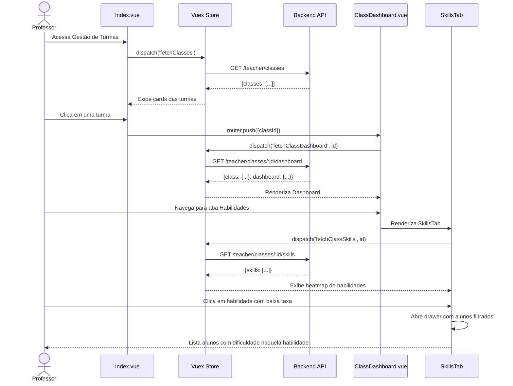

import { IconCheck } from '@site/src/components/MaterialIcon';

# PROF-006: Gestão de Turmas (Classes Records)

:::info Contexto
**Jornada**: Professor  
**Prioridade**: Média  
**Complexidade**: Média-Alta  
**Status**: <IconCheck /> Documentado (AS-IS Baseline)
:::

## 1. Visão Geral

### Problema

Professores precisam ter uma visão consolidada do desempenho coletivo de suas turmas, identificar tendências, comparar turmas entre si e gerar relatórios para coordenação pedagógica, mas os dados estão fragmentados e não há ferramentas analíticas adequadas.

**Dores principais**:
- Falta de dashboard com métricas agregadas da turma
- Dificuldade para identificar tópicos/habilidades que a turma toda tem dificuldade
- Ausência de comparação entre diferentes turmas do mesmo professor
- Relatórios manuais e trabalhosos para conselho de classe
- Impossibilidade de visualizar evolução temporal da turma

### Solução AS-IS

Sistema de gestão de turmas que oferece visão coletiva e analítica com:
- **Dashboard da turma** com KPIs consolidados
- **Análise de habilidades** coletivas (taxa de acerto por habilidade/tópico)
- **Distribuição de desempenho** (histogramas, quartis)
- **Comparação entre turmas** (quando professor leciona para múltiplas)
- **Relatórios para conselho de classe** com exportação
- **Evolução temporal** (métricas mês a mês)

## 2. Rotas e Navegação

```typescript
// src/router/professor-routes/classes-records-routes.js
export default [
  {
    path: '/professor/classes-records',
    name: 'professor-classes-records',
    component: () => import('@/views/pages/teacher-context/classesRecords/Index.vue'),
    meta: {
      resource: 'ClassesRecords',
      action: 'read',
      breadcrumb: [
        { text: 'Início', to: '/' },
        { text: 'Gestão de Turmas', active: true }
      ]
    }
  },
  {
    path: '/professor/classes-records/:classId',
    name: 'professor-class-dashboard',
    component: () => import('@/views/pages/teacher-context/classesRecords/ClassDashboard.vue'),
    meta: {
      resource: 'ClassesRecords',
      action: 'read',
      breadcrumb: [
        { text: 'Início', to: '/' },
        { text: 'Gestão de Turmas', to: '/professor/classes-records' },
        { text: 'Dashboard', active: true }
      ]
    }
  },
  {
    path: '/professor/classes-records/:classId/skills',
    name: 'professor-class-skills',
    component: () => import('@/views/pages/teacher-context/classesRecords/ClassSkills.vue'),
    meta: {
      resource: 'ClassesRecords',
      action: 'read'
    }
  },
  {
    path: '/professor/classes-records/compare',
    name: 'professor-classes-compare',
    component: () => import('@/views/pages/teacher-context/classesRecords/ClassesCompare.vue'),
    meta: {
      resource: 'ClassesRecords',
      action: 'read'
    }
  }
]
```

**Fluxo de navegação**:
1. Professor acessa lista de suas turmas via menu lateral
2. Seleciona disciplina (filtro global)
3. Visualiza cards com preview de métricas de cada turma
4. Clica em uma turma → Navega para Dashboard da turma
5. Explora abas: Visão Geral, Habilidades, Distribuição, Evolução
6. Acessa "Comparar Turmas" para análise comparativa
7. Exporta relatório para conselho de classe

## 3. Arquitetura de Componentes

### Estrutura de Pastas

```
src/views/pages/teacher-context/classesRecords/
├── Index.vue                       # Lista de turmas do professor
├── ClassDashboard.vue              # Dashboard de uma turma específica
├── ClassSkills.vue                 # Análise de habilidades da turma
├── ClassesCompare.vue              # Comparação entre turmas
├── useClassesRecords.js            # Composable de domínio
├── components/
│   ├── ClassCard.vue               # Card de turma (lista)
│   ├── DashboardKPI.vue            # Card de KPI no dashboard
│   ├── PerformanceDistribution.vue # Histograma de distribuição
│   ├── SkillsHeatmap.vue           # Heatmap de habilidades
│   ├── EvolutionChart.vue          # Gráfico de evolução temporal
│   ├── ComparisonTable.vue         # Tabela comparativa de turmas
│   ├── ExportReportModal.vue       # Modal de exportação
│   └── StudentListDrawer.vue       # Drawer com lista de alunos filtrados
└── charts/
    ├── PerformanceHistogram.vue    # Histograma de notas
    ├── AttendanceLineChart.vue     # Linha de frequência
    └── SkillsRadarMultiple.vue     # Radar comparativo de múltiplas turmas
```

### Responsabilidades dos Componentes

#### Index.vue (Lista de Turmas)
```vue
<template>
  <section>
    <b-card>
      <div class="d-flex justify-content-between align-items-center mb-2">
        <h3>Minhas Turmas - {{ subject?.name }}</h3>
        <b-button 
          v-if="classes.length > 1" 
          variant="outline-primary"
          @click="goToCompare"
        >
          <span class="material-symbols-outlined">compare_arrows</span>
          Comparar Turmas
        </b-button>
      </div>

      <b-row v-if="!loading">
        <b-col 
          v-for="classe in classes" 
          :key="classe.id"
          cols="12" md="6" xl="4"
          class="mb-2"
        >
          <ClassCard 
            :class-data="classe" 
            @click="goToDashboard(classe.id)" 
          />
        </b-col>
      </b-row>

      <div v-else class="text-center py-5">
        <b-spinner variant="primary" />
      </div>
    </b-card>
  </section>
</template>

<script>
import ClassCard from './components/ClassCard.vue'
import useClassesRecords from './useClassesRecords.js'
import useFilters from '@/store/filters/useFilters'
import router from '@/router'
import { defineComponent, watch } from '@vue/composition-api'

export default defineComponent({
  name: 'ClassesRecordsIndex',
  components: { ClassCard },
  setup() {
    const { subject } = useFilters()
    const { classes, loading, fetchClasses } = useClassesRecords()

    watch(subject, () => {
      if (subject.value?.id) {
        fetchClasses()
      }
    }, { immediate: true })

    const goToDashboard = (classId) => {
      router.push({ name: 'professor-class-dashboard', params: { classId } })
    }

    const goToCompare = () => {
      router.push({ name: 'professor-classes-compare' })
    }

    return { classes, loading, subject, goToDashboard, goToCompare }
  }
})
</script>
```

#### ClassDashboard.vue (Dashboard da Turma)
```vue
<template>
  <div v-if="classData">
    <!-- Header -->
    <b-card class="mb-2">
      <div class="d-flex justify-content-between align-items-center">
        <div>
          <h2 class="mb-0">{{ classData.name }}</h2>
          <p class="text-muted mb-0">
            {{ classData.totalStudents }} alunos • {{ subject?.name }}
          </p>
        </div>
        <b-button 
          variant="primary" 
          @click="openExportModal"
        >
          <span class="material-symbols-outlined">download</span>
          Exportar Relatório
        </b-button>
      </div>
    </b-card>

    <!-- Tabs -->
    <b-tabs content-class="mt-3" pills>
      <b-tab title="Visão Geral" active>
        <OverviewTab :class-id="classData.id" />
      </b-tab>

      <b-tab title="Habilidades">
        <SkillsTab :class-id="classData.id" />
      </b-tab>

      <b-tab title="Distribuição">
        <DistributionTab :class-id="classData.id" />
      </b-tab>

      <b-tab title="Evolução">
        <EvolutionTab :class-id="classData.id" />
      </b-tab>
    </b-tabs>

    <!-- Modal Export -->
    <ExportReportModal 
      ref="exportModalRef" 
      :class-data="classData" 
    />
  </div>
</template>

<script>
import OverviewTab from './components/OverviewTab.vue'
import SkillsTab from './components/SkillsTab.vue'
import DistributionTab from './components/DistributionTab.vue'
import EvolutionTab from './components/EvolutionTab.vue'
import ExportReportModal from './components/ExportReportModal.vue'
import useClassesRecords from './useClassesRecords.js'
import useFilters from '@/store/filters/useFilters'
import { defineComponent, ref, computed, onMounted } from '@vue/composition-api'

export default defineComponent({
  name: 'ClassDashboard',
  components: {
    OverviewTab, SkillsTab, DistributionTab, 
    EvolutionTab, ExportReportModal
  },
  setup(props, { root }) {
    const { subject } = useFilters()
    const { fetchClassDashboard, currentClass } = useClassesRecords()
    const exportModalRef = ref(null)

    const classId = computed(() => root.$route.params.classId)
    const classData = computed(() => currentClass.value)

    onMounted(() => {
      fetchClassDashboard(classId.value)
    })

    const openExportModal = () => exportModalRef.value.show()

    return { classData, subject, exportModalRef, openExportModal }
  }
})
</script>
```

## 4. Módulo Vuex

```javascript
// src/store/pageModules/module-classes-records.js
import { 
  getTeacherClasses, 
  getClassDashboard, 
  getClassSkills,
  getClassDistribution,
  getClassEvolution,
  exportClassReport
} from '@/services/teacher-context/ClassesRecordsService'

export default {
  namespaced: true,
  
  state: {
    classes: [],
    currentClass: null,
    dashboard: null,
    skills: [],
    distribution: null,
    evolution: [],
    loading: false,
    comparisonData: null
  },

  mutations: {
    classes(state, payload) {
      state.classes = payload
    },
    currentClass(state, payload) {
      state.currentClass = payload
    },
    dashboard(state, payload) {
      state.dashboard = payload
    },
    skills(state, payload) {
      state.skills = payload
    },
    distribution(state, payload) {
      state.distribution = payload
    },
    evolution(state, payload) {
      state.evolution = payload
    },
    loading(state, payload) {
      state.loading = payload
    },
    comparisonData(state, payload) {
      state.comparisonData = payload
    },
    reset(state) {
      state.classes = []
      state.currentClass = null
      state.dashboard = null
      state.skills = []
      state.distribution = null
      state.evolution = []
      state.loading = false
      state.comparisonData = null
    }
  },

  getters: {
    classes: state => state.classes,
    currentClass: state => state.currentClass,
    dashboard: state => state.dashboard,
    skills: state => state.skills,
    distribution: state => state.distribution,
    evolution: state => state.evolution,
    loading: state => state.loading,
    comparisonData: state => state.comparisonData,

    // Computed: Turmas com alerta (baixo desempenho)
    classesNeedingAttention: state => {
      return state.classes.filter(c => 
        c.averageScore < 60 || c.attendance < 75 || c.completionRate < 50
      )
    },

    // Computed: Habilidades críticas (< 50% acerto)
    criticalSkills: state => {
      return state.skills.filter(s => s.correctRate < 50)
    },

    // Computed: Percentual de alunos em cada quartil
    performanceQuartiles: state => {
      if (!state.distribution) return null
      
      const total = state.distribution.histogram.reduce((sum, item) => sum + item.count, 0)
      return {
        q1: (state.distribution.quartiles.q1Count / total * 100).toFixed(1),
        q2: (state.distribution.quartiles.q2Count / total * 100).toFixed(1),
        q3: (state.distribution.quartiles.q3Count / total * 100).toFixed(1),
        q4: (state.distribution.quartiles.q4Count / total * 100).toFixed(1)
      }
    }
  },

  actions: {
    async fetchClasses({ commit, rootGetters }) {
      commit('loading', true)
      try {
        const { subject } = rootGetters['filters/selectedFilters']
        const response = await getTeacherClasses({ SubjectId: subject?.id })
        commit('classes', response.data.classes)
      } catch (error) {
        console.error('Erro ao buscar turmas:', error)
        commit('classes', [])
      } finally {
        commit('loading', false)
      }
    },

    async fetchClassDashboard({ commit }, classId) {
      commit('loading', true)
      try {
        const response = await getClassDashboard(classId)
        commit('currentClass', response.data.class)
        commit('dashboard', response.data.dashboard)
      } catch (error) {
        console.error('Erro ao buscar dashboard:', error)
      } finally {
        commit('loading', false)
      }
    },

    async fetchClassSkills({ commit }, classId) {
      commit('loading', true)
      try {
        const response = await getClassSkills(classId)
        commit('skills', response.data.skills)
      } catch (error) {
        console.error('Erro ao buscar habilidades:', error)
        commit('skills', [])
      } finally {
        commit('loading', false)
      }
    },

    async fetchClassDistribution({ commit }, classId) {
      commit('loading', true)
      try {
        const response = await getClassDistribution(classId)
        commit('distribution', response.data)
      } catch (error) {
        console.error('Erro ao buscar distribuição:', error)
      } finally {
        commit('loading', false)
      }
    },

    async fetchClassEvolution({ commit }, { classId, months }) {
      commit('loading', true)
      try {
        const response = await getClassEvolution(classId, months)
        commit('evolution', response.data.evolution)
      } catch (error) {
        console.error('Erro ao buscar evolução:', error)
        commit('evolution', [])
      } finally {
        commit('loading', false)
      }
    }
  }
}
```

## 5. Services (API Layer)

```javascript
// src/services/teacher-context/ClassesRecordsService.js
import { axiosIns } from '@axios'

/**
 * Busca turmas do professor
 * @param {Object} params - Parâmetros de filtro
 * @param {number} params.SubjectId - ID da disciplina
 * @returns {Promise<{data: {classes: Array}}>}
 */
export const getTeacherClasses = (params) => {
  return axiosIns.get('/teacher/classes', { params })
}

/**
 * Busca dashboard consolidado da turma
 * @param {number} classId - ID da turma
 * @returns {Promise<{data: Object}>}
 */
export const getClassDashboard = (classId) => {
  return axiosIns.get(`/teacher/classes/${classId}/dashboard`)
}

/**
 * Busca análise de habilidades da turma
 * @param {number} classId - ID da turma
 * @returns {Promise<{data: {skills: Array}}>}
 */
export const getClassSkills = (classId) => {
  return axiosIns.get(`/teacher/classes/${classId}/skills`)
}

/**
 * Busca distribuição de desempenho da turma
 * @param {number} classId - ID da turma
 * @returns {Promise<{data: Object}>}
 */
export const getClassDistribution = (classId) => {
  return axiosIns.get(`/teacher/classes/${classId}/distribution`)
}

/**
 * Busca evolução temporal da turma
 * @param {number} classId - ID da turma
 * @param {number} months - Número de meses para análise
 * @returns {Promise<{data: {evolution: Array}}>}
 */
export const getClassEvolution = (classId, months = 6) => {
  return axiosIns.get(`/teacher/classes/${classId}/evolution`, {
    params: { Months: months }
  })
}

/**
 * Busca dados comparativos entre turmas
 * @param {Array<number>} classIds - IDs das turmas a comparar
 * @returns {Promise<{data: Object}>}
 */
export const getClassesComparison = (classIds) => {
  return axiosIns.get('/teacher/classes/compare', {
    params: { ClassIds: classIds.join(',') }
  })
}

/**
 * Exporta relatório da turma
 * @param {number} classId - ID da turma
 * @param {Object} options - Opções de exportação
 * @param {string} options.format - Formato (pdf|excel)
 * @param {Array<string>} options.sections - Seções a incluir
 * @param {string} options.reportType - Tipo (dashboard|skills|council)
 * @returns {Promise<Blob>}
 */
export const exportClassReport = (classId, options) => {
  return axiosIns.post(
    `/teacher/classes/${classId}/export`,
    options,
    { responseType: 'blob' }
  )
}
```

## 6. Composable de Domínio

```javascript
// src/views/pages/teacher-context/classesRecords/useClassesRecords.js
import store from '@/store'
import useFilters from '@/store/filters/useFilters'
import { computed } from '@vue/composition-api'

const moduleName = 'classesRecords'
const { subject } = useFilters()

/**
 * Composable para gerenciar registros de turmas
 * @returns {Object} Interface de gerenciamento de turmas
 */
export default function useClassesRecords() {
  // State
  const classes = computed({
    get: () => store.getters[`${moduleName}/classes`],
    set: val => store.commit(`${moduleName}/classes`, val)
  })

  const currentClass = computed({
    get: () => store.getters[`${moduleName}/currentClass`],
    set: val => store.commit(`${moduleName}/currentClass`, val)
  })

  const dashboard = computed({
    get: () => store.getters[`${moduleName}/dashboard`],
    set: val => store.commit(`${moduleName}/dashboard`, val)
  })

  const skills = computed({
    get: () => store.getters[`${moduleName}/skills`],
    set: val => store.commit(`${moduleName}/skills`, val)
  })

  const distribution = computed({
    get: () => store.getters[`${moduleName}/distribution`],
    set: val => store.commit(`${moduleName}/distribution`, val)
  })

  const evolution = computed({
    get: () => store.getters[`${moduleName}/evolution`],
    set: val => store.commit(`${moduleName}/evolution`, val)
  })

  const loading = computed({
    get: () => store.getters[`${moduleName}/loading`],
    set: val => store.commit(`${moduleName}/loading`, val)
  })

  const comparisonData = computed({
    get: () => store.getters[`${moduleName}/comparisonData`],
    set: val => store.commit(`${moduleName}/comparisonData`, val)
  })

  // Computed getters
  const classesNeedingAttention = computed(
    () => store.getters[`${moduleName}/classesNeedingAttention`]
  )

  const criticalSkills = computed(
    () => store.getters[`${moduleName}/criticalSkills`]
  )

  const performanceQuartiles = computed(
    () => store.getters[`${moduleName}/performanceQuartiles`]
  )

  // Methods
  const fetchClasses = async () => {
    await store.dispatch(`${moduleName}/fetchClasses`)
  }

  const fetchClassDashboard = async (classId) => {
    await store.dispatch(`${moduleName}/fetchClassDashboard`, classId)
  }

  const fetchClassSkills = async (classId) => {
    await store.dispatch(`${moduleName}/fetchClassSkills`, classId)
  }

  const fetchClassDistribution = async (classId) => {
    await store.dispatch(`${moduleName}/fetchClassDistribution`, classId)
  }

  const fetchClassEvolution = async (classId, months = 6) => {
    await store.dispatch(`${moduleName}/fetchClassEvolution`, { classId, months })
  }

  return {
    moduleName,
    // State
    classes,
    currentClass,
    dashboard,
    skills,
    distribution,
    evolution,
    loading,
    comparisonData,
    // Computed
    classesNeedingAttention,
    criticalSkills,
    performanceQuartiles,
    // Methods
    fetchClasses,
    fetchClassDashboard,
    fetchClassSkills,
    fetchClassDistribution,
    fetchClassEvolution,
    // Global filters
    subject
  }
}
```

## 7. Fluxo de Usuário



## 8. Estados da Interface

### Estado 1: Lista de Turmas
```typescript
{
  loading: false,
  classes: [
    {
      id: 34,
      name: '7º Ano A',
      totalStudents: 30,
      averageScore: 7.2,
      attendance: 88,
      completionRate: 75,
      criticalSkillsCount: 2,
      lastUpdate: '2024-02-01T10:00:00Z'
    },
    {
      id: 35,
      name: '7º Ano B',
      totalStudents: 28,
      averageScore: 6.8,
      attendance: 82,
      completionRate: 68,
      criticalSkillsCount: 4,
      lastUpdate: '2024-02-01T10:00:00Z'
    }
  ]
}
```
**UI - ClassCard**:
- Nome da turma (heading)
- Badge: Total de alunos
- 3 métricas principais com progress bars:
  - Nota média (0-10, cores: verde maior que 7, amarelo 5-7, vermelho menor que 5)
  - Frequência % (cores: verde maior que 85%, amarelo 70-85%, vermelho menor que 70%)
  - Taxa de conclusão % (missões completadas)
- Alert badge: "2 habilidades críticas" (se existir)
- Última atualização (data relativa)
- Hover: Eleva card e exibe botão "Ver Dashboard"

### Estado 2: Dashboard - Aba Visão Geral
```typescript
{
  currentClass: {
    id: 34,
    name: '7º Ano A',
    totalStudents: 30,
    grade: '7º Ano',
    shift: 'Manhã'
  },
  dashboard: {
    kpis: {
      averageScore: 7.2,
      attendance: 88,
      completionRate: 75,
      activeStudents: 28,
      studentsNeedingAttention: 5
    },
    performanceDistribution: [
      { range: '9-10', count: 4, percentage: 13 },
      { range: '7-9', count: 12, percentage: 40 },
      { range: '5-7', count: 9, percentage: 30 },
      { range: '0-5', count: 5, percentage: 17 }
    ],
    topPerformers: [
      { name: 'Ana Silva', score: 9.5 },
      { name: 'João Costa', score: 9.2 }
    ],
    needingAttention: [
      { name: 'Carlos Lima', reason: 'Baixa frequência' },
      { name: 'Maria Santos', reason: 'Desempenho crítico' }
    ]
  }
}
```
**UI - OverviewTab**:
- Grid 2x3 de DashboardKPI cards:
  1. Nota Média (ícone estrela, número grande 7.2, comparação com período anterior)
  2. Frequência Média (ícone calendário, 88%, trend indicator ↑ +2%)
  3. Taxa de Conclusão (ícone check, 75%, progress bar)
  4. Alunos Ativos (ícone person, 28/30, badge verde)
  5. Necessitam Atenção (ícone warning, 5, badge laranja)
- Histograma de distribuição de desempenho (PerformanceHistogram component)
- 2 cards side-by-side:
  - Top Performers (lista com avatares e scores)
  - Necessitam Atenção (lista com nomes e motivos, botão "Ver ficha")

### Estado 3: Dashboard - Aba Habilidades
```typescript
{
  skills: [
    {
      id: 1,
      tag: 'EF07MA01',
      name: 'Resolver problemas com números naturais',
      correctRate: 45,
      totalQuestions: 120,
      studentsWithDifficulty: 18,
      category: 'Números e Operações'
    },
    {
      id: 2,
      tag: 'EF07MA15',
      name: 'Resolver equações de 1º grau',
      correctRate: 72,
      totalQuestions: 90,
      studentsWithDifficulty: 8,
      category: 'Álgebra'
    }
  ]
}
```
**UI - SkillsTab**:
- Filtros (topo):
  - Dropdown: Categoria (Números, Álgebra, Geometria, etc)
  - Dropdown: Taxa de acerto (Crítico menor que 50%, Atenção 50-70%, Consolidado maior que 70%)
- SkillsHeatmap component:
  - Grid/tabela de habilidades
  - Colunas: Tag, Nome, Taxa de Acerto, Nº Alunos com Dificuldade, Ações
  - Célula de Taxa de Acerto: Progress bar com cor (vermelho menor que 50%, amarelo 50-70%, verde maior que 70%)
  - Botão de ação: "Ver alunos" (ícone lista)
- Ao clicar "Ver alunos":
  - Abre StudentListDrawer (lateral direita)
  - Lista dos alunos com dificuldade naquela habilidade específica
  - Botões: "Ver ficha completa", "Adicionar anotação"

### Estado 4: Dashboard - Aba Distribuição
```typescript
{
  distribution: {
    histogram: [
      { scoreRange: '0-1', count: 1 },
      { scoreRange: '1-2', count: 2 },
      { scoreRange: '2-3', count: 3 },
      { scoreRange: '3-4', count: 4 },
      { scoreRange: '4-5', count: 5 },
      { scoreRange: '5-6', count: 6 },
      { scoreRange: '6-7', count: 5 },
      { scoreRange: '7-8', count: 3 },
      { scoreRange: '8-9', count: 1 },
      { scoreRange: '9-10', count: 0 }
    ],
    statistics: {
      mean: 7.2,
      median: 7.5,
      mode: 6.5,
      standardDeviation: 1.8
    },
    quartiles: {
      q1: 5.5,
      q2: 7.5,
      q3: 8.5,
      q1Count: 8,
      q2Count: 7,
      q3Count: 8,
      q4Count: 7
    }
  }
}
```
**UI - DistributionTab**:
- Card de estatísticas descritivas (topo):
  - Grid 2x2: Média, Mediana, Moda, Desvio Padrão
  - Cada valor com ícone e tooltip explicativo
- PerformanceHistogram (gráfico de barras verticais):
  - Eixo X: Faixas de nota (0-1, 1-2, ..., 9-10)
  - Eixo Y: Quantidade de alunos
  - Barras coloridas por faixa (vermelho menor que 5, amarelo 5-7, verde maior que 7)
  - Hover: Tooltip com nomes dos alunos naquela faixa
- Box plot visual mostrando quartis
- Card com interpretação textual:
  - "25% dos alunos estão abaixo de 5.5"
  - "50% dos alunos estão entre 5.5 e 8.5"
  - "A turma apresenta dispersão moderada (DP = 1.8)"

### Estado 5: Dashboard - Aba Evolução
```typescript
{
  evolution: [
    {
      month: '2023-09',
      averageScore: 6.5,
      attendance: 85,
      completionRate: 60,
      activeMissions: 4
    },
    {
      month: '2023-10',
      averageScore: 6.8,
      attendance: 87,
      completionRate: 65,
      activeMissions: 5
    },
    {
      month: '2023-11',
      averageScore: 7.0,
      attendance: 86,
      completionRate: 70,
      activeMissions: 6
    },
    {
      month: '2023-12',
      averageScore: 7.2,
      attendance: 88,
      completionRate: 75,
      activeMissions: 5
    }
  ]
}
```
**UI - EvolutionTab**:
- Filtro de período: Dropdown (Últimos 3 meses, 6 meses, Ano letivo completo)
- EvolutionChart (gráfico de linhas múltiplas):
  - 3 linhas sobrepostas:
    1. Nota Média (linha roxa, eixo Y esquerdo 0-10)
    2. Frequência % (linha verde, eixo Y direito 0-100%)
    3. Taxa de Conclusão % (linha azul, eixo Y direito 0-100%)
  - Eixo X: Meses
  - Markers nos pontos de dados
  - Hover: Tooltip com valores exatos e comparação com mês anterior
- Cards de tendência (abaixo do gráfico):
  - "Nota média cresceu 11% no período" (badge verde ↑)
  - "Frequência estável" (badge azul →)
  - "Taxa de conclusão cresceu 25%" (badge verde ↑↑)
- Timeline de eventos relevantes (opcional):
  - Marcadores no gráfico indicando eventos (ex: "Avaliação diagnóstica", "Intervenção pedagógica")

### Estado 6: Comparação entre Turmas
```typescript
{
  comparisonData: {
    classes: [
      { id: 34, name: '7º Ano A', averageScore: 7.2, attendance: 88, completionRate: 75 },
      { id: 35, name: '7º Ano B', averageScore: 6.8, attendance: 82, completionRate: 68 }
    ],
    skillsComparison: [
      {
        skill: 'EF07MA01',
        classes: [
          { classId: 34, correctRate: 72 },
          { classId: 35, correctRate: 65 }
        ]
      }
    ],
    radarData: {
      categories: ['Números', 'Álgebra', 'Geometria', 'Estatística'],
      classes: [
        { name: '7º Ano A', values: [7.5, 7.0, 7.2, 6.8] },
        { name: '7º Ano B', values: [6.8, 6.5, 6.9, 6.3] }
      ]
    }
  }
}
```
**UI - ClassesCompare**:
- Seletor de turmas (topo):
  - Checkboxes: Selecionar turmas para comparar (max 3)
  - Botão "Comparar"
- ComparisonTable (tabela de métricas):
  - Linhas: Turmas
  - Colunas: Nota Média, Frequência, Taxa de Conclusão, Alunos, Habilidades Críticas
  - Células coloridas por desempenho relativo (verde melhor, vermelho pior)
  - Coluna extra: Diferença % (relativa à primeira turma)
- SkillsRadarMultiple (gráfico radar):
  - Eixos: Categorias de habilidades (4-6 eixos)
  - Uma linha por turma (cores diferentes)
  - Legenda abaixo
- Heatmap de habilidades comparativo:
  - Linhas: Habilidades
  - Colunas: Turmas
  - Células: Taxa de acerto com cor gradient (vermelho → verde)

### Estado 7: Modal de Exportação
```typescript
{
  exportOptions: {
    reportType: 'dashboard', // 'dashboard' | 'skills' | 'council'
    format: 'pdf',
    sections: ['overview', 'skills', 'distribution'],
    includeStudentList: true,
    includeCharts: true,
    dateRange: {
      start: '2024-01-01',
      end: '2024-02-01'
    }
  }
}
```
**UI - ExportReportModal**:
- Título: "Exportar Relatório da Turma"
- Formulário:
  - Radio buttons: Tipo de relatório
    - Dashboard Completo
    - Análise de Habilidades
    - Relatório para Conselho de Classe
  - Radio buttons: Formato (PDF, Excel)
  - Checkboxes: Seções a incluir (lista dinâmica baseada no tipo)
  - Checkbox: Incluir lista de alunos
  - Checkbox: Incluir gráficos (apenas PDF)
  - Date range picker: Período dos dados
- Preview: Thumbnail do relatório (se tempo permitir)
- Botões: Cancelar, Exportar (com loading)

## 9. API Endpoints

### GET /teacher/classes
**Request Params**: `?SubjectId=12`

**Response**:
```json
{
  "classes": [
    {
      "id": 34,
      "name": "7º Ano A",
      "grade": "7º Ano",
      "shift": "Manhã",
      "totalStudents": 30,
      "averageScore": 7.2,
      "attendance": 88,
      "completionRate": 75,
      "criticalSkillsCount": 2,
      "lastUpdate": "2024-02-01T10:00:00Z"
    }
  ]
}
```

### GET /teacher/classes/:id/dashboard
**Response**:
```json
{
  "class": {
    "id": 34,
    "name": "7º Ano A",
    "grade": "7º Ano",
    "shift": "Manhã",
    "totalStudents": 30
  },
  "dashboard": {
    "kpis": {
      "averageScore": 7.2,
      "scoreTrend": 2.5,
      "attendance": 88,
      "attendanceTrend": -1.2,
      "completionRate": 75,
      "completionTrend": 5.0,
      "activeStudents": 28,
      "studentsNeedingAttention": 5
    },
    "performanceDistribution": [
      { "range": "9-10", "count": 4, "percentage": 13 },
      { "range": "7-9", "count": 12, "percentage": 40 },
      { "range": "5-7", "count": 9, "percentage": 30 },
      { "range": "0-5", "count": 5, "percentage": 17 }
    ],
    "topPerformers": [
      {
        "studentId": 123,
        "name": "Ana Silva",
        "score": 9.5,
        "avatarUrl": "https://..."
      }
    ],
    "needingAttention": [
      {
        "studentId": 456,
        "name": "Carlos Lima",
        "reason": "Baixa frequência",
        "attendance": 65
      }
    ]
  }
}
```

### GET /teacher/classes/:id/skills
**Response**:
```json
{
  "skills": [
    {
      "id": 1,
      "tag": "EF07MA01",
      "name": "Resolver problemas com números naturais",
      "category": "Números e Operações",
      "correctRate": 45,
      "totalQuestions": 120,
      "correctAnswers": 54,
      "studentsWithDifficulty": 18,
      "studentsWithDifficultyIds": [101, 102, 103, ...]
    }
  ],
  "categories": [
    {
      "name": "Números e Operações",
      "averageCorrectRate": 58
    }
  ]
}
```

### GET /teacher/classes/:id/distribution
**Response**:
```json
{
  "histogram": [
    { "scoreRange": "0-1", "count": 1, "percentage": 3 },
    { "scoreRange": "1-2", "count": 2, "percentage": 7 },
    { "scoreRange": "7-8", "count": 3, "percentage": 10 }
  ],
  "statistics": {
    "mean": 7.2,
    "median": 7.5,
    "mode": 6.5,
    "standardDeviation": 1.8,
    "min": 3.5,
    "max": 9.8
  },
  "quartiles": {
    "q1": 5.5,
    "q2": 7.5,
    "q3": 8.5,
    "q1Count": 8,
    "q2Count": 7,
    "q3Count": 8,
    "q4Count": 7
  }
}
```

### GET /teacher/classes/:id/evolution
**Request Params**: `?Months=6`

**Response**:
```json
{
  "evolution": [
    {
      "month": "2023-09",
      "monthLabel": "Set/2023",
      "averageScore": 6.5,
      "attendance": 85,
      "completionRate": 60,
      "activeMissions": 4,
      "totalStudents": 30
    }
  ],
  "events": [
    {
      "date": "2023-10-15",
      "type": "assessment",
      "description": "Avaliação diagnóstica de Matemática"
    }
  ]
}
```

### GET /teacher/classes/compare
**Request Params**: `?ClassIds=34,35`

**Response**:
```json
{
  "classes": [
    {
      "id": 34,
      "name": "7º Ano A",
      "averageScore": 7.2,
      "attendance": 88,
      "completionRate": 75,
      "totalStudents": 30
    }
  ],
  "skillsComparison": [
    {
      "skillId": 1,
      "skillTag": "EF07MA01",
      "skillName": "Resolver problemas com números naturais",
      "classes": [
        { "classId": 34, "correctRate": 72 },
        { "classId": 35, "correctRate": 65 }
      ]
    }
  ],
  "radarData": {
    "categories": ["Números e Operações", "Álgebra", "Geometria", "Estatística e Probabilidade"],
    "classes": [
      {
        "classId": 34,
        "name": "7º Ano A",
        "values": [7.5, 7.0, 7.2, 6.8]
      }
    ]
  }
}
```

### POST /teacher/classes/:id/export
**Request**:
```json
{
  "reportType": "dashboard",
  "format": "pdf",
  "sections": ["overview", "skills", "distribution"],
  "includeStudentList": true,
  "includeCharts": true,
  "dateRange": {
    "start": "2024-01-01",
    "end": "2024-02-01"
  }
}
```

**Response**: Blob (PDF ou Excel file)
**Headers**: 
```
Content-Type: application/pdf
Content-Disposition: attachment; filename="relatorio-7ano-a-2024-02-01.pdf"
```

## 10. Screenshots (AS-IS)

### Lista de Turmas

*Grid de cards das turmas com métricas principais e alertas*

### Dashboard - Visão Geral

*KPIs consolidados, distribuição de desempenho, top performers*

### Dashboard - Habilidades

*Heatmap de habilidades com taxas de acerto e drawer de alunos*

### Dashboard - Distribuição

*Histograma, estatísticas descritivas e box plot*

### Dashboard - Evolução

*Gráfico de linhas com evolução temporal de múltiplas métricas*

### Comparação entre Turmas

*Tabela comparativa e radar de habilidades de múltiplas turmas*

## 11. Melhorias TO-BE

### Problema 1: Análise Reativa ao Invés de Proativa
**AS-IS**: Professor precisa acessar dashboard manualmente para identificar problemas.

**TO-BE**:
- **Alertas Inteligentes Automáticos**:
  - Email/notificação quando habilidade da turma cai abaixo de 50%
  - Alerta quando mais de 5 alunos faltam na mesma semana
  - Aviso quando taxa de conclusão de missões cai mais de 10% em relação ao mês anterior
- **Dashboard Preditivo**:
  - IA prevê tendências: "Com base no padrão atual, a nota média pode cair para 6.8 até fim do mês"
  - Sugestões proativas: "Considere reforço em [habilidade X] antes da próxima avaliação"
- **Comparação Automática com Padrão**:
  - Benchmarking com outras turmas similares da rede
  - Identificação automática de outliers (turmas muito acima ou abaixo do esperado)

### Problema 2: Habilidades Críticas Sem Contexto
**AS-IS**: Dashboard mostra habilidades com baixa taxa de acerto, mas não explica o porquê.

**TO-BE**:
- **Análise de Causa Raiz**:
  - Correlação com outras variáveis: "65% dos alunos com dificuldade em [habilidade] também faltaram mais de 3 aulas no período"
  - Identificação de pré-requisitos não dominados: "Habilidade EF07MA01 requer domínio de EF06MA08 (apenas 40% da turma possui)"
- **Sugestões de Intervenção Contextualizadas**:
  - Biblioteca de estratégias pedagógicas por habilidade
  - Materiais complementares sugeridos (vídeos, exercícios, jogos)
  - Templates de plano de intervenção personalizados
- **Rastreamento de Intervenções**:
  - Registrar intervenção aplicada (data, tipo, alunos envolvidos)
  - Monitorar eficácia: "Após intervenção X, taxa de acerto subiu de 45% para 68%"

### Problema 3: Comparação entre Turmas Superficial
**AS-IS**: Comparação mostra apenas diferenças numéricas.

**TO-BE**:
- **Análise Diferencial Profunda**:
  - Identificar **por que** uma turma performa melhor:
    - Diferenças demográficas (idade média, background)
    - Diferenças de engajamento (tempo médio de estudo, participação)
    - Diferenças metodológicas (se professor usa estratégias diferentes)
  - Destacar "práticas de sucesso" da turma de melhor desempenho
- **Aprendizado entre Pares (Professores)**:
  - Se outro professor tem turma com desempenho superior, sugerir troca de experiências
  - Repositório de "o que funcionou": Professores compartilham estratégias que melhoraram métricas específicas
- **Equalização Inteligente**:
  - Sugestões de remanejamento de alunos entre turmas para equilibrar desempenho
  - Simulador: "Se mover 3 alunos de alto desempenho para Turma B, ambas ficam equilibradas"

### Problema 4: Exportação para Conselho de Classe Estática
**AS-IS**: Relatório PDF estático gerado apenas quando solicitado.

**TO-BE**:
- **Dossiê Digital Sempre Atualizado**:
  - Link permanente para dashboard "modo conselho" (atualizado em tempo real)
  - Acesso temporário para coordenação/outros professores (link expira em 7 dias)
  - Histórico de versões: Comparar conselho do 1º vs 2º trimestre
- **Modo Apresentação**:
  - View otimizada para projeção em reunião
  - Navegação simplificada entre seções
  - Highlights automáticos: Sistema marca os pontos mais críticos para discussão
- **Colaboração Durante Conselho**:
  - Anotações colaborativas: Múltiplos professores adicionam observações ao mesmo tempo
  - Votação/priorização: Marcar alunos que precisam de intervenção urgente
  - Plano de ação compartilhado: Definir responsáveis e prazos para cada ação

### Problema 5: Falta de Gamificação e Motivação da Turma
**AS-IS**: Métricas são apenas números para o professor, alunos não têm visibilidade.

**TO-BE**:
- **Dashboard da Turma para Alunos** (visão pública, sem dados individuais):
  - Metas coletivas: "Nossa turma quer atingir 80% de conclusão até fim do mês!"
  - Progresso visual gamificado: Barra de progresso, badges conquistadas pela turma
  - Comparação amistosa com outras turmas (sem expor dados individuais)
- **Desafios Coletivos**:
  - Professor define desafio: "Se toda a turma completar as missões desta semana, assistimos ao filme de matemática"
  - Sistema acompanha progresso e envia notificações motivacionais
- **Quadro de Honra da Turma**:
  - Celebração de conquistas coletivas (exibido em TV na sala)
  - "Habilidade do Mês": Turma escolhe uma habilidade para focar e melhorar juntos
  - Reconhecimento de "ajudantes": Alunos que mais ajudaram colegas

## 12. Testes Recomendados

### Testes Unitários

#### useClassesRecords Composable
```javascript
import useClassesRecords from './useClassesRecords'
import store from '@/store'

describe('useClassesRecords', () => {
  beforeEach(() => {
    store.registerModule('classesRecords', moduleClassesRecords)
  })

  afterEach(() => {
    store.unregisterModule('classesRecords')
  })

  it('deve retornar turmas que precisam de atenção', () => {
    const mockClasses = [
      { id: 1, averageScore: 55, attendance: 70, completionRate: 45 },
      { id: 2, averageScore: 80, attendance: 90, completionRate: 85 }
    ]
    store.commit('classesRecords/classes', mockClasses)
    
    const { classesNeedingAttention } = useClassesRecords()
    expect(classesNeedingAttention.value).toHaveLength(1)
    expect(classesNeedingAttention.value[0].id).toBe(1)
  })

  it('deve calcular quartis de desempenho corretamente', () => {
    const mockDistribution = {
      histogram: [
        { scoreRange: '0-5', count: 5 },
        { scoreRange: '5-7', count: 10 },
        { scoreRange: '7-9', count: 10 },
        { scoreRange: '9-10', count: 5 }
      ],
      quartiles: {
        q1Count: 8,
        q2Count: 7,
        q3Count: 8,
        q4Count: 7
      }
    }
    store.commit('classesRecords/distribution', mockDistribution)
    
    const { performanceQuartiles } = useClassesRecords()
    expect(performanceQuartiles.value.q1).toBe('26.7')
  })
})
```

#### Vuex Module Getters
```javascript
describe('classesRecords Vuex Module', () => {
  it('deve filtrar habilidades críticas', () => {
    const state = {
      skills: [
        { id: 1, correctRate: 45 },
        { id: 2, correctRate: 72 },
        { id: 3, correctRate: 38 }
      ]
    }
    
    const criticalSkills = moduleClassesRecords.getters.criticalSkills(state)
    expect(criticalSkills).toHaveLength(2)
    expect(criticalSkills[0].id).toBe(1)
    expect(criticalSkills[1].id).toBe(3)
  })
})
```

### Testes de Integração

#### Navegação entre Abas
```javascript
import { mount } from '@vue/test-utils'
import ClassDashboard from './ClassDashboard.vue'
import SkillsTab from './components/SkillsTab.vue'
import store from '@/store'

describe('ClassDashboard - Navegação entre Abas', () => {
  it('deve carregar dados ao trocar para aba Habilidades', async () => {
    const wrapper = mount(ClassDashboard, {
      store,
      mocks: {
        $route: { params: { classId: 34 } }
      }
    })

    // Clicar na aba Habilidades
    await wrapper.find('[data-test="tab-skills"]').trigger('click')
    await wrapper.vm.$nextTick()

    // Verificar chamada API
    expect(ClassesRecordsService.getClassSkills).toHaveBeenCalledWith(34)
    
    // Verificar renderização
    expect(wrapper.findComponent(SkillsTab).exists()).toBe(true)
  })
})
```

#### Drawer de Alunos com Dificuldade
```javascript
describe('SkillsTab - Drawer de Alunos', () => {
  it('deve abrir drawer com alunos filtrados ao clicar em habilidade', async () => {
    const wrapper = mount(SkillsTab, { store })

    // Clicar em botão "Ver alunos" de uma habilidade
    await wrapper.find('[data-test="view-students-btn-1"]').trigger('click')
    await wrapper.vm.$nextTick()

    // Verificar drawer aberto
    const drawer = wrapper.findComponent(StudentListDrawer)
    expect(drawer.props('isOpen')).toBe(true)
    expect(drawer.props('studentIds')).toEqual([101, 102, 103])
  })
})
```

## 13. Métricas de Sucesso

### KPIs de Uso (AS-IS)
- **Acesso ao Dashboard**: 50% dos professores acessam mensalmente
- **Tempo Médio na Ferramenta**: 8 minutos por sessão
- **Exportações para Conselho**: 70% dos professores exportam relatórios trimestrais
- **Identificação de Habilidades Críticas**: 35% dos professores identificam e atuam sobre habilidades menor que 50%
- **Comparação entre Turmas**: 20% dos professores (apenas quem tem múltiplas turmas)

### Metas TO-BE
- **Acesso ao Dashboard**: 80% semanalmente (aumento de 60%)
- **Tempo Médio na Ferramenta**: 5 minutos (redução de 37%, mais eficiência)
- **Uso de Alertas Proativos**: 90% dos professores ativam notificações
- **Taxa de Intervenção em Habilidades Críticas**: 75% (aumento de 114%)
- **Comparação entre Turmas**: 60% dos elegíveis (triplo do atual)
- **Colaboração em Conselhos**: 85% dos conselhos usam dossiê digital (nova métrica)
- **Metas Coletivas Definidas**: 70% das turmas têm metas gamificadas ativas (nova métrica)

### Indicadores de Impacto TO-BE
- **Melhoria de Desempenho**: Turmas com dashboard ativo melhoram 15% mais que controle
- **Redução de Habilidades Críticas**: De média de 3 por turma para 1 por turma
- **Tempo para Intervenção**: Reduzir de 4 semanas para 1 semana
- **NPS de Professores**: Subir de 7.0 para 8.5
- **Engajamento dos Alunos**: +25% em turmas com dashboard gamificado

---

## Dependências Relacionadas

- **[PROF-005: Student Records](./student-records.md)** - Dados individuais dos alunos alimentam métricas coletivas
- **[PROF-002: Education System Missions](./education-system-missions.md)** - Missões completadas impactam taxa de conclusão
- **[Architecture: DDD Pattern](../../architecture/intro.md)** - Padrão arquitetural seguido
- **[API Documentation](#)** - Especificação completa dos endpoints
- **[Design System: Vuexy](https://fabioeducacross.github.io/DesignSystem-Vuexy/)** - Componentes e paleta de cores
- **[Prototypes TO-BE](../../prototypes/intro.md)** - Protótipos das melhorias propostas

---

:::tip Próximos Passos
1. Criar protótipo do heatmap de habilidades com drill-down
2. Validar estrutura de dados para comparação entre turmas
3. Desenvolver templates de relatório para conselho de classe
4. Testar dashboard gamificado com turma piloto
5. Implementar sistema de alertas inteligentes com regras configuráveis
:::
