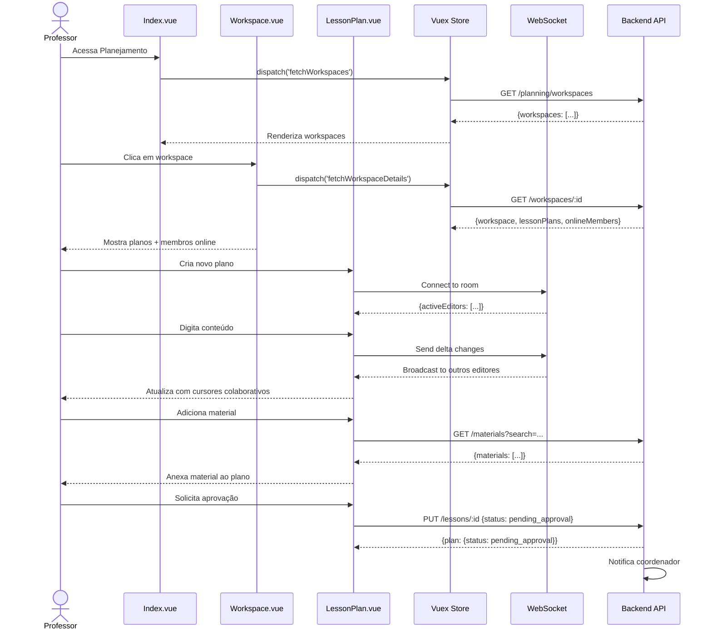
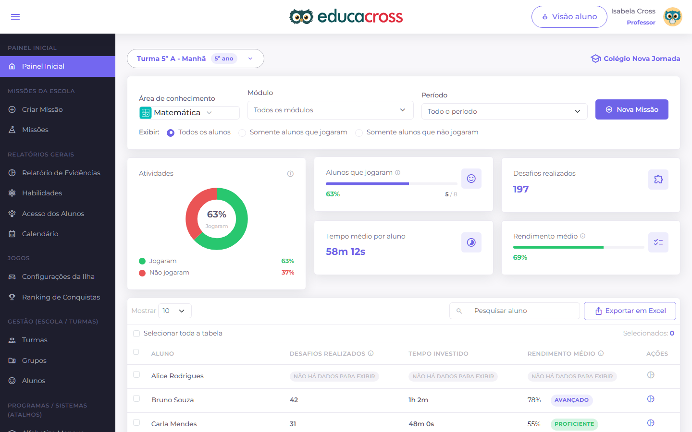

# PROF-009: Collaborative Planning (Planejamento Colaborativo)

:::info Contexto
**Jornada**: Professor  
**Prioridade**: Baixa  
**Complexidade**: Média  
**Status**: ✅ Documentado (AS-IS Baseline)
:::

## 1. Visão Geral

### Problema

Professores da mesma disciplina ou série precisam planejar aulas, compartilhar materiais, alinhar conteúdos e trocar experiências de forma colaborativa, mas não possuem ferramentas digitais que facilitem o planejamento em grupo, versionamento de planos de aula, reutilização de materiais entre colegas, feedback assíncrono sobre planejamentos, e consolidação de melhores práticas pedagógicas da rede.

**Dores principais**:
- Planejamento isolado sem compartilhamento entre professores da mesma disciplina
- Retrabalho ao criar planos de aula similares já feitos por colegas
- Impossibilidade de co-criar documentos pedagógicos em tempo real
- Falta de versionamento de planos (perdas de alterações, dificuldade para reverter)
- Ausência de biblioteca centralizada de materiais aprovados pela coordenação
- Dificuldade para alinhar sequências didáticas entre turmas paralelas
- Falta de feedback estruturado de coordenadores sobre planejamentos
- Impossibilidade de identificar melhores práticas e replicá-las na rede

### Solução AS-IS

Sistema de planejamento colaborativo com:
- **Workspace Compartilhado** para grupos de professores (por disciplina, série, projeto)
- **Editor Colaborativo em Tempo Real** de planos de aula (multi-cursor)
- **Biblioteca de Materiais** centralizada com busca avançada e tags
- **Versionamento Automático** com histórico de alterações e rollback
- **Sistema de Comentários** assíncronos em planos (feedback de coordenadores)
- **Templates de Planejamento** pré-aprovados pela coordenação
- **Calendário Compartilhado** de aulas planejadas
- **Aprovação de Planejamentos** com workflow (professor → coordenador → aprovado)
- **Dashboard de Métricas** (taxa de colaboração, reuso de materiais, tempo economizado)

## 2. Rotas e Navegação

```typescript
// src/router/professor-routes/collaborative-planning-routes.js
export default [
  {
    path: '/teacher/planning',
    name: 'teacher-planning',
    component: () => import('@/views/pages/teacher-context/planning/Index.vue'),
    meta: {
      resource: 'Planning',
      action: 'read',
      breadcrumb: [
        { text: 'Início', to: '/' },
        { text: 'Planejamento Colaborativo', active: true }
      ]
    }
  },
  {
    path: '/teacher/planning/workspace/:workspaceId',
    name: 'teacher-planning-workspace',
    component: () => import('@/views/pages/teacher-context/planning/Workspace.vue'),
    meta: {
      resource: 'Planning',
      action: 'read'
    }
  },
  {
    path: '/teacher/planning/lesson/:lessonId',
    name: 'teacher-lesson-plan',
    component: () => import('@/views/pages/teacher-context/planning/LessonPlan.vue'),
    meta: {
      resource: 'Planning',
      action: 'read'
    }
  },
  {
    path: '/teacher/planning/library',
    name: 'teacher-materials-library',
    component: () => import('@/views/pages/teacher-context/planning/MaterialsLibrary.vue'),
    meta: {
      resource: 'Planning',
      action: 'read'
    }
  }
]
```

**Fluxo de navegação**:
1. Professor acessa página de Planejamento Colaborativo
2. Visualiza workspaces disponíveis (Matemática 7º Ano, Projeto Interdisciplinar, etc.)
3. Clica em workspace → Entra no espaço compartilhado com calendário de aulas + planos recentes
4. Cria novo plano de aula → Abre editor colaborativo (vê cursores de outros professores online)
5. Pesquisa na biblioteca de materiais → Anexa recursos ao plano (vídeos, PDFs, exercícios)
6. Solicita feedback de coordenador → Adiciona comentário "@coordenadora revise este plano"
7. Coordenador recebe notificação → Comenta plano → Aprova
8. Professor publica plano → Fica disponível para toda rede reutilizar
9. Outros professores encontram plano na busca → Clonam e adaptam para suas turmas

## 3. Arquitetura de Componentes

### Estrutura de Pastas

```
src/views/pages/teacher-context/planning/
├── Index.vue                      # Orquestrador principal
├── Workspace.vue                  # Workspace compartilhado
├── LessonPlan.vue                 # Editor de plano de aula
├── MaterialsLibrary.vue           # Biblioteca de materiais
├── Calendar.vue                   # Calendário de aulas planejadas
├── usePlanning.js                 # Composable de domínio
├── components/
│   ├── WorkspaceCard.vue          # Card de workspace com membros
│   ├── LessonPlanCard.vue         # Card de plano na lista
│   ├── CollaborativeEditor.vue    # Editor rich text colaborativo
│   ├── VersionHistory.vue         # Histórico de versões
│   ├── CommentThread.vue          # Thread de comentários
│   ├── MaterialCard.vue           # Card de material na biblioteca
│   ├── ApprovalWorkflow.vue       # Status de aprovação
│   ├── MemberAvatar.vue           # Avatar de membro online
│   ├── TemplateSelector.vue       # Seletor de template
│   ├── TagManager.vue             # Gerenciador de tags
│   └── ShareModal.vue             # Modal para compartilhar plano
└── charts/
    ├── CollaborationMetrics.vue   # Métricas de colaboração
    └── ReuseChart.vue             # Gráfico de reuso de materiais
```

### Responsabilidades dos Componentes

#### Index.vue (Orquestrador)
```vue
<template>
  <section>
    <!-- Header -->
    <b-card class="mb-3">
      <div class="d-flex align-items-center justify-content-between">
        <div>
          <h3 class="mb-0">Planejamento Colaborativo</h3>
          <p class="text-muted mb-0">
            Crie e compartilhe planos de aula com sua equipe
          </p>
        </div>
        <b-button variant="primary" @click="createWorkspace">
          <span class="material-symbols-outlined">add</span>
          Criar Workspace
        </b-button>
      </div>
    </b-card>

    <!-- Tabs -->
    <b-tabs content-class="mt-3" pills>
      <b-tab title="Meus Workspaces" active>
        <b-row>
          <b-col
            v-for="workspace in myWorkspaces"
            :key="workspace.id"
            cols="12"
            md="4"
            class="mb-3"
          >
            <WorkspaceCard
              :workspace="workspace"
              @click="openWorkspace(workspace.id)"
            />
          </b-col>
        </b-row>
      </b-tab>

      <b-tab title="Biblioteca" :badge="totalMaterials">
        <MaterialsLibrary />
      </b-tab>

      <b-tab title="Calendário">
        <Calendar />
      </b-tab>

      <b-tab title="Métricas">
        <b-row>
          <b-col cols="12" md="6">
            <b-card>
              <h5>Colaboração</h5>
              <CollaborationMetrics :data="metrics.collaboration" />
            </b-card>
          </b-col>
          <b-col cols="12" md="6">
            <b-card>
              <h5>Reuso de Materiais</h5>
              <ReuseChart :data="metrics.reuse" />
            </b-card>
          </b-col>
        </b-row>
      </b-tab>
    </b-tabs>
  </section>
</template>

<script>
import WorkspaceCard from './components/WorkspaceCard.vue'
import MaterialsLibrary from './MaterialsLibrary.vue'
import Calendar from './Calendar.vue'
import CollaborationMetrics from './charts/CollaborationMetrics.vue'
import ReuseChart from './charts/ReuseChart.vue'
import store from '@/store'
import router from '@/router'
import modulePlanning from '@/store/pageModules/planning/module-planning.js'
import { defineComponent, computed, onMounted, onUnmounted } from '@vue/composition-api'
import usePlanning from './usePlanning.js'

export default defineComponent({
  name: 'PlanningIndex',
  components: {
    WorkspaceCard,
    MaterialsLibrary,
    Calendar,
    CollaborationMetrics,
    ReuseChart
  },
  setup() {
    store.registerModule('planning', modulePlanning)

    const { myWorkspaces, totalMaterials, metrics } = usePlanning()

    const openWorkspace = (workspaceId) => {
      router.push({ name: 'teacher-planning-workspace', params: { workspaceId } })
    }

    const createWorkspace = () => {
      // Abre modal de criação
    }

    onMounted(() => {
      store.dispatch('planning/fetchWorkspaces')
      store.dispatch('planning/fetchMetrics')
    })

    onUnmounted(() => {
      store.commit('planning/reset')
      store.unregisterModule('planning')
    })

    return {
      myWorkspaces,
      totalMaterials,
      metrics,
      openWorkspace,
      createWorkspace
    }
  }
})
</script>
```

#### Workspace.vue (Workspace Compartilhado)
```vue
<template>
  <div>
    <!-- Header do Workspace -->
    <b-card class="mb-3">
      <div class="d-flex align-items-center justify-content-between">
        <div>
          <h3 class="mb-1">{{ workspace.name }}</h3>
          <p class="text-muted mb-0">{{ workspace.description }}</p>
        </div>
        <div class="d-flex align-items-center">
          <!-- Membros Online -->
          <b-avatar-group size="40px" class="mr-3">
            <MemberAvatar
              v-for="member in onlineMembers"
              :key="member.id"
              :member="member"
            />
          </b-avatar-group>
          
          <b-button variant="primary" @click="createLessonPlan">
            <span class="material-symbols-outlined">add</span>
            Novo Plano
          </b-button>
        </div>
      </div>
    </b-card>

    <!-- Calendário de Aulas -->
    <b-card class="mb-3">
      <h5>Calendário de Aulas Planejadas</h5>
      <Calendar :workspace-id="workspaceId" />
    </b-card>

    <!-- Planos Recentes -->
    <b-card>
      <div class="d-flex align-items-center justify-content-between mb-3">
        <h5 class="mb-0">Planos de Aula</h5>
        <b-form-input
          v-model="searchQuery"
          placeholder="Buscar planos..."
          style="max-width: 300px"
        />
      </div>

      <b-tabs content-class="mt-3">
        <b-tab title="Todos" :active="filter === 'all'" @click="filter = 'all'">
          <b-row>
            <b-col
              v-for="plan in filteredPlans"
              :key="plan.id"
              cols="12"
              md="6"
              class="mb-3"
            >
              <LessonPlanCard
                :plan="plan"
                @click="openLessonPlan(plan.id)"
              />
            </b-col>
          </b-row>
        </b-tab>

        <b-tab title="Meus" :active="filter === 'mine'" @click="filter = 'mine'">
          <b-row>
            <b-col
              v-for="plan in myPlans"
              :key="plan.id"
              cols="12"
              md="6"
              class="mb-3"
            >
              <LessonPlanCard
                :plan="plan"
                @click="openLessonPlan(plan.id)"
              />
            </b-col>
          </b-row>
        </b-tab>

        <b-tab title="Pendentes Aprovação" :badge="pendingApprovalCount">
          <b-row>
            <b-col
              v-for="plan in pendingApprovalPlans"
              :key="plan.id"
              cols="12"
              md="6"
              class="mb-3"
            >
              <LessonPlanCard
                :plan="plan"
                @click="openLessonPlan(plan.id)"
              />
            </b-col>
          </b-row>
        </b-tab>
      </b-tabs>
    </b-card>
  </div>
</template>

<script>
import MemberAvatar from './components/MemberAvatar.vue'
import Calendar from './Calendar.vue'
import LessonPlanCard from './components/LessonPlanCard.vue'
import usePlanning from './usePlanning.js'
import router from '@/router'
import { ref, computed } from '@vue/composition-api'

export default {
  components: { MemberAvatar, Calendar, LessonPlanCard },
  setup() {
    const {
      workspace,
      onlineMembers,
      lessonPlans,
      pendingApprovalCount
    } = usePlanning()

    const filter = ref('all')
    const searchQuery = ref('')

    const filteredPlans = computed(() => {
      let plans = lessonPlans.value
      
      if (filter.value === 'mine') {
        plans = plans.filter(p => p.isMine)
      } else if (filter.value === 'pending') {
        plans = plans.filter(p => p.status === 'pending_approval')
      }

      if (searchQuery.value) {
        plans = plans.filter(p =>
          p.title.toLowerCase().includes(searchQuery.value.toLowerCase())
        )
      }

      return plans
    })

    const myPlans = computed(() => 
      lessonPlans.value.filter(p => p.isMine)
    )

    const pendingApprovalPlans = computed(() =>
      lessonPlans.value.filter(p => p.status === 'pending_approval')
    )

    const openLessonPlan = (planId) => {
      router.push({ name: 'teacher-lesson-plan', params: { lessonId: planId } })
    }

    const createLessonPlan = () => {
      // Abre modal de criação com templates
    }

    return {
      workspace,
      onlineMembers,
      filter,
      searchQuery,
      filteredPlans,
      myPlans,
      pendingApprovalPlans,
      pendingApprovalCount,
      openLessonPlan,
      createLessonPlan
    }
  }
}
</script>
```

#### LessonPlan.vue (Editor de Plano)
```vue
<template>
  <div>
    <!-- Header com Status de Salvamento -->
    <b-card class="mb-3">
      <div class="d-flex align-items-center justify-content-between">
        <div>
          <b-form-input
            v-model="plan.title"
            placeholder="Título do Plano de Aula"
            size="lg"
            class="mb-2"
          />
          <div class="d-flex align-items-center">
            <span class="text-muted mr-3">
              <span class="material-symbols-outlined">schedule</span>
              {{ lastSaved }}
            </span>
            <b-badge :variant="statusVariant">{{ statusText }}</b-badge>
          </div>
        </div>

        <div class="d-flex align-items-center">
          <!-- Editores Online -->
          <b-avatar-group size="32px" class="mr-3">
            <MemberAvatar
              v-for="editor in activeEditors"
              :key="editor.id"
              :member="editor"
              :show-cursor-color="true"
            />
          </b-avatar-group>

          <b-button variant="outline-secondary" class="mr-2" @click="showVersionHistory">
            <span class="material-symbols-outlined">history</span>
            Histórico
          </b-button>

          <b-button
            v-if="plan.status === 'draft'"
            variant="primary"
            @click="requestApproval"
          >
            <span class="material-symbols-outlined">check_circle</span>
            Solicitar Aprovação
          </b-button>

          <b-button variant="success" @click="sharePlan">
            <span class="material-symbols-outlined">share</span>
            Compartilhar
          </b-button>
        </div>
      </div>
    </b-card>

    <!-- Editor Colaborativo -->
    <b-card class="mb-3">
      <CollaborativeEditor
        v-model="plan.content"
        :collaborators="activeEditors"
        @change="handleContentChange"
      />
    </b-card>

    <!-- Materiais Anexados -->
    <b-card class="mb-3">
      <h5>Materiais</h5>
      <b-button variant="outline-primary" size="sm" @click="searchMaterials">
        <span class="material-symbols-outlined">add</span>
        Adicionar da Biblioteca
      </b-button>
      
      <div class="mt-3">
        <MaterialCard
          v-for="material in plan.materials"
          :key="material.id"
          :material="material"
          class="mb-2"
        />
      </div>
    </b-card>

    <!-- Comentários -->
    <b-card>
      <h5>Comentários e Feedback</h5>
      <CommentThread
        :comments="plan.comments"
        :can-comment="true"
        @add-comment="addComment"
      />
    </b-card>

    <!-- Modals -->
    <VersionHistory
      v-if="showVersionHistoryModal"
      :plan-id="plan.id"
      @close="showVersionHistoryModal = false"
      @restore="restoreVersion"
    />

    <ShareModal
      v-if="showShareModal"
      :plan="plan"
      @close="showShareModal = false"
    />
  </div>
</template>

<script>
import MemberAvatar from './components/MemberAvatar.vue'
import CollaborativeEditor from './components/CollaborativeEditor.vue'
import MaterialCard from './components/MaterialCard.vue'
import CommentThread from './components/CommentThread.vue'
import VersionHistory from './components/VersionHistory.vue'
import ShareModal from './components/ShareModal.vue'
import usePlanning from './usePlanning.js'
import { ref, computed } from '@vue/composition-api'

export default {
  components: {
    MemberAvatar,
    CollaborativeEditor,
    MaterialCard,
    CommentThread,
    VersionHistory,
    ShareModal
  },
  setup() {
    const { plan, activeEditors, savePlan } = usePlanning()

    const showVersionHistoryModal = ref(false)
    const showShareModal = ref(false)

    const statusVariant = computed(() => {
      const variants = {
        'draft': 'secondary',
        'pending_approval': 'warning',
        'approved': 'success',
        'rejected': 'danger'
      }
      return variants[plan.value.status] || 'secondary'
    })

    const statusText = computed(() => {
      const texts = {
        'draft': 'Rascunho',
        'pending_approval': 'Aguardando Aprovação',
        'approved': 'Aprovado',
        'rejected': 'Rejeitado'
      }
      return texts[plan.value.status] || 'Rascunho'
    })

    const lastSaved = computed(() => {
      // Formata timestamp de último salvamento
      return 'Salvo há 2 minutos'
    })

    const handleContentChange = () => {
      // Auto-save a cada 30 segundos
      savePlan()
    }

    const requestApproval = () => {
      // Muda status para pending_approval
    }

    const sharePlan = () => {
      showShareModal.value = true
    }

    const showVersionHistory = () => {
      showVersionHistoryModal.value = true
    }

    const restoreVersion = (versionId) => {
      // Restaura versão anterior
    }

    const searchMaterials = () => {
      // Abre modal de busca na biblioteca
    }

    const addComment = (content) => {
      // Adiciona comentário
    }

    return {
      plan,
      activeEditors,
      statusVariant,
      statusText,
      lastSaved,
      showVersionHistoryModal,
      showShareModal,
      handleContentChange,
      requestApproval,
      sharePlan,
      showVersionHistory,
      restoreVersion,
      searchMaterials,
      addComment
    }
  }
}
</script>
```

## 4. Módulo Vuex

```javascript
// src/store/pageModules/planning/module-planning.js
import {
  getWorkspaces,
  getWorkspaceDetails,
  getLessonPlan,
  saveLessonPlan,
  getMaterials,
  getMetrics
} from '@/services/teacher-context/PlanningService'

export default {
  namespaced: true,
  
  state: {
    workspaces: [],
    currentWorkspace: null,
    lessonPlans: [],
    currentPlan: null,
    materials: [],
    metrics: null,
    activeEditors: [],
    onlineMembers: [],
    loading: false
  },

  mutations: {
    workspaces(state, payload) {
      state.workspaces = payload
    },
    currentWorkspace(state, payload) {
      state.currentWorkspace = payload
    },
    lessonPlans(state, payload) {
      state.lessonPlans = payload
    },
    currentPlan(state, payload) {
      state.currentPlan = payload
    },
    materials(state, payload) {
      state.materials = payload
    },
    metrics(state, payload) {
      state.metrics = payload
    },
    activeEditors(state, payload) {
      state.activeEditors = payload
    },
    onlineMembers(state, payload) {
      state.onlineMembers = payload
    },
    loading(state, payload) {
      state.loading = payload
    },
    reset(state) {
      state.workspaces = []
      state.currentWorkspace = null
      state.lessonPlans = []
      state.currentPlan = null
      state.materials = []
      state.metrics = null
      state.activeEditors = []
      state.onlineMembers = []
      state.loading = false
    }
  },

  getters: {
    workspaces: state => state.workspaces,
    currentWorkspace: state => state.currentWorkspace,
    lessonPlans: state => state.lessonPlans,
    currentPlan: state => state.currentPlan,
    materials: state => state.materials,
    metrics: state => state.metrics,
    activeEditors: state => state.activeEditors,
    onlineMembers: state => state.onlineMembers,
    loading: state => state.loading,

    // Computed: Meus workspaces
    myWorkspaces: state => state.workspaces.filter(w => w.isMember),

    // Computed: Total de materiais na biblioteca
    totalMaterials: state => state.materials.length,

    // Computed: Planos pendentes de aprovação
    pendingApprovalCount: state => 
      state.lessonPlans.filter(p => p.status === 'pending_approval').length,

    // Computed: Taxa de colaboração (planos com múltiplos autores)
    collaborationRate: state => {
      if (state.lessonPlans.length === 0) return 0
      const collaborative = state.lessonPlans.filter(p => p.authors.length > 1).length
      return ((collaborative / state.lessonPlans.length) * 100).toFixed(1)
    },

    // Computed: Materiais mais reutilizados
    mostReusedMaterials: state => {
      return [...state.materials]
        .sort((a, b) => b.reuseCount - a.reuseCount)
        .slice(0, 10)
    }
  },

  actions: {
    async fetchWorkspaces({ commit }) {
      commit('loading', true)
      try {
        const response = await getWorkspaces()
        commit('workspaces', response.data.workspaces)
      } catch (error) {
        console.error('Erro ao buscar workspaces:', error)
      } finally {
        commit('loading', false)
      }
    },

    async fetchWorkspaceDetails({ commit }, workspaceId) {
      commit('loading', true)
      try {
        const response = await getWorkspaceDetails(workspaceId)
        commit('currentWorkspace', response.data.workspace)
        commit('lessonPlans', response.data.lessonPlans)
        commit('onlineMembers', response.data.onlineMembers)
      } catch (error) {
        console.error('Erro ao buscar detalhes do workspace:', error)
      } finally {
        commit('loading', false)
      }
    },

    async fetchLessonPlan({ commit }, planId) {
      commit('loading', true)
      try {
        const response = await getLessonPlan(planId)
        commit('currentPlan', response.data.plan)
        commit('activeEditors', response.data.activeEditors)
      } catch (error) {
        console.error('Erro ao buscar plano de aula:', error)
      } finally {
        commit('loading', false)
      }
    },

    async fetchMetrics({ commit }) {
      try {
        const response = await getMetrics()
        commit('metrics', response.data)
      } catch (error) {
        console.error('Erro ao buscar métricas:', error)
      }
    }
  }
}
```

## 5. Services (API Layer)

```javascript
// src/services/teacher-context/PlanningService.js
import { axiosIns } from '@axios'

/**
 * Busca workspaces do professor
 * @returns {Promise<{data: Object}>}
 */
export const getWorkspaces = () => {
  return axiosIns.get('/teacher/planning/workspaces')
}

/**
 * Busca detalhes de um workspace
 * @param {number} workspaceId - ID do workspace
 * @returns {Promise<{data: Object}>}
 */
export const getWorkspaceDetails = (workspaceId) => {
  return axiosIns.get(`/teacher/planning/workspaces/${workspaceId}`)
}

/**
 * Busca plano de aula
 * @param {number} planId - ID do plano
 * @returns {Promise<{data: Object}>}
 */
export const getLessonPlan = (planId) => {
  return axiosIns.get(`/teacher/planning/lessons/${planId}`)
}

/**
 * Salva plano de aula
 * @param {number} planId - ID do plano
 * @param {Object} data - Dados do plano
 * @returns {Promise<{data: Object}>}
 */
export const saveLessonPlan = (planId, data) => {
  return axiosIns.put(`/teacher/planning/lessons/${planId}`, data)
}

/**
 * Busca materiais da biblioteca
 * @param {Object} params - Parâmetros de busca
 * @returns {Promise<{data: Object}>}
 */
export const getMaterials = (params) => {
  return axiosIns.get('/teacher/planning/materials', { params })
}

/**
 * Busca métricas de planejamento
 * @returns {Promise<{data: Object}>}
 */
export const getMetrics = () => {
  return axiosIns.get('/teacher/planning/metrics')
}
```

## 6. Composable de Domínio

```javascript
// src/views/pages/teacher-context/planning/usePlanning.js
import store from '@/store'
import { computed } from '@vue/composition-api'

const moduleName = 'planning'

export default function usePlanning() {
  const workspaces = computed({
    get: () => store.getters[`${moduleName}/workspaces`],
    set: val => store.commit(`${moduleName}/workspaces`, val)
  })

  const myWorkspaces = computed(
    () => store.getters[`${moduleName}/myWorkspaces`]
  )

  const totalMaterials = computed(
    () => store.getters[`${moduleName}/totalMaterials`]
  )

  const pendingApprovalCount = computed(
    () => store.getters[`${moduleName}/pendingApprovalCount`]
  )

  const collaborationRate = computed(
    () => store.getters[`${moduleName}/collaborationRate`]
  )

  const workspace = computed(
    () => store.getters[`${moduleName}/currentWorkspace`]
  )

  const lessonPlans = computed(
    () => store.getters[`${moduleName}/lessonPlans`]
  )

  const plan = computed(
    () => store.getters[`${moduleName}/currentPlan`]
  )

  const activeEditors = computed(
    () => store.getters[`${moduleName}/activeEditors`]
  )

  const onlineMembers = computed(
    () => store.getters[`${moduleName}/onlineMembers`]
  )

  const metrics = computed(
    () => store.getters[`${moduleName}/metrics`]
  )

  const mostReusedMaterials = computed(
    () => store.getters[`${moduleName}/mostReusedMaterials`]
  )

  const savePlan = async () => {
    // Auto-save implementation
  }

  return {
    moduleName,
    workspaces,
    myWorkspaces,
    totalMaterials,
    pendingApprovalCount,
    collaborationRate,
    workspace,
    lessonPlans,
    plan,
    activeEditors,
    onlineMembers,
    metrics,
    mostReusedMaterials,
    savePlan
  }
}
```

## 7. Fluxo de Usuário



## 8. Estados da Interface

### Estado 1: Lista de Workspaces
```typescript
{
  workspaces: [
    {
      id: 1,
      name: 'Matemática 7º Ano',
      description: 'Planejamento colaborativo de Matemática',
      members: 8,
      onlineMembers: 3,
      recentPlans: 12,
      isMember: true
    }
  ]
}
```

### Estado 2: Editor Colaborativo
```typescript
{
  plan: {
    id: 1,
    title: 'Números Inteiros - Aula 1',
    content: '...',
    status: 'draft',
    authors: [{id: 1, name: 'Ana'}, {id: 2, name: 'João'}],
    materials: [...],
    comments: [...]
  },
  activeEditors: [
    {
      id: 1,
      name: 'Ana Silva',
      cursorColor: '#7367F0',
      cursorPosition: 120
    }
  ]
}
```

## 9. API Endpoints

### GET /teacher/planning/workspaces
**Response**:
```json
{
  "workspaces": [
    {
      "id": 1,
      "name": "Matemática 7º Ano",
      "description": "...",
      "members": 8,
      "onlineMembers": 3,
      "recentPlans": 12,
      "isMember": true
    }
  ]
}
```

## 10. Screenshots (AS-IS)


*Lista de workspaces*


*Editor colaborativo*

## 11. Melhorias TO-BE

### 1. IA de Sugestão de Planos
**TO-BE**: IA analisa BNCC + histórico + contexto da turma → sugere estrutura completa de plano de aula

### 2. Tradução Automática
**TO-BE**: Planos traduzidos automaticamente para LIBRAS, Braille, áudio, outras línguas

### 3. Gamificação de Colaboração
**TO-BE**: Badges (Top Colaborador, Curador de Materiais), ranking de contribuições, missões de colaboração

### 4. Integração com Google Docs/Notion
**TO-BE**: Importar/exportar planos de Google Docs, Notion, Microsoft Word

### 5. Recomendação Inteligente de Materiais
**TO-BE**: IA sugere materiais da biblioteca baseado no conteúdo do plano sendo escrito

## 12. Testes Recomendados

### Testes Unitários
```javascript
describe('usePlanning', () => {
  it('deve calcular taxa de colaboração corretamente', () => {
    const mockPlans = [
      { id: 1, authors: [1, 2] },
      { id: 2, authors: [1] },
      { id: 3, authors: [2, 3, 4] }
    ]
    store.commit('planning/lessonPlans', mockPlans)
    
    const { collaborationRate } = usePlanning()
    expect(collaborationRate.value).toBe('66.7') // 2 de 3
  })
})
```

## 13. Métricas de Sucesso

### KPIs (AS-IS)
- **Uso de Planejamento Colaborativo**: 20% professores
- **Reuso de Materiais**: 15%
- **Tempo de Planejamento**: 3h por semana

### Metas TO-BE
- **Uso**: 75% (+275%)
- **Reuso**: 60% (+300%)
- **Tempo**: 1.5h (-50%)
- **Satisfação NPS**: 8.5/10

---

## Dependências Relacionadas

- **[PROF-002: Education System Missions](./education-system-missions.md)** - Missões podem ser anexadas a planos
- **[PROF-003: Custom Missions](./custom-missions.md)** - Criação de missões dentro de planos

---

:::tip Próximos Passos
1. Implementar WebSocket para colaboração em tempo real
2. Desenvolver IA de sugestão de planos baseada em BNCC
3. Criar sistema de versionamento com diff visual
4. Implementar tradução automática para acessibilidade
5. Desenvolver gamificação de colaboração (badges, ranking)
:::
