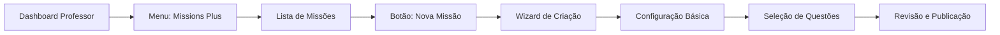
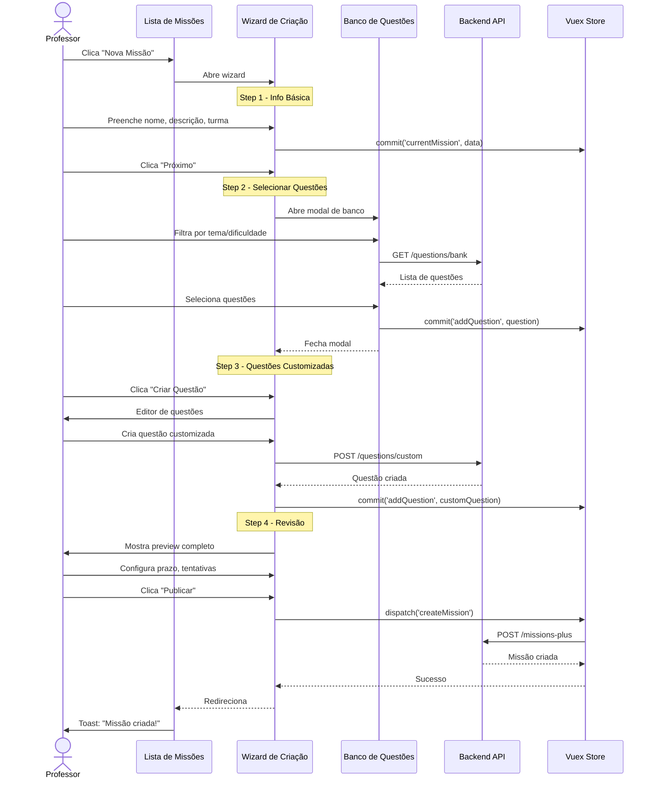

import { IconCheck, IconCircleRed, IconSparkle, IconTarget, IconX } from '@site/src/components/MaterialIcon';

# PROF-003: Custom Missions

<span class="badge badge-warning"><IconCircleRed /> Alta Prioridade</span> <span class="badge badge-info">Sprint 1</span> <span class="badge badge-primary">Teacher Context</span>

## Visão Geral

Jornada que permite professores criarem **missões personalizadas** (Missions Plus) combinando questões de diferentes fontes: banco de questões, livros do sistema educacional, ou questões customizadas criadas manualmente.

**Contexto de Usuário**: Professor  
**Categoria**: Gestão de Conteúdo  
**Complexidade**: <IconSparkle /><IconSparkle /><IconSparkle /> Avançado  
**Duração Média**: 15-30 minutos para criar uma missão completa

---

## Problema que Resolve

Professores precisam criar avaliações e atividades personalizadas que:
- Combinem questões de diferentes fontes (banco, livros, customizadas)
- Atendam necessidades específicas da turma ou aluno
- Permitam configuração detalhada (prazo, tentativas, ordem aleatória)
- Integrem com o sistema de notas e desempenho

**Pain Points Atuais**:
- <IconX /> Fluxo longo com muitos passos
- <IconX /> Preview limitado de questões antes de adicionar
- <IconX /> Dificuldade para reorganizar questões adicionadas
- <IconX /> Falta de templates ou duplicação de missões existentes

---

## Rota e Navegação

### URL
```
/professor/missions-plus/create
```

### Caminho de Navegação


### Breadcrumb
```
Home > Missions Plus > Criar Missão Personalizada
```

---

## Arquitetura de Arquivos

### Componentes Vue

```
src/views/pages/teacher-context/missions-plus/
├── Index.vue                          # Orquestrador principal
├── List.vue                           # Lista de missões existentes
├── CreateWizard/
│   ├── Index.vue                      # Wizard completo
│   ├── Step1BasicInfo.vue             # Nome, descrição, turma
│   ├── Step2SelectQuestions.vue       # Banco de questões
│   ├── Step3CustomQuestions.vue       # Criar questões customizadas
│   ├── Step4Review.vue                # Revisão e configurações
│   └── QuestionCard.vue               # Card de preview de questão
├── components/
│   ├── MissionCard.vue                # Card de missão na lista
│   ├── QuestionBankModal.vue          # Modal de seleção do banco
│   ├── QuestionEditor.vue             # Editor de questões custom
│   └── MissionConfigForm.vue          # Formulário de configurações
└── useMissionsPlus.js                 # Domain composable
```

### Vuex Module

```javascript
// src/store/pageModules/missions-plus/module-missions-plus.js
export default {
  namespaced: true,
  state: {
    missions: [],
    currentMission: null,
    selectedQuestions: [],
    loading: false,
    wizardStep: 1,
  },
  mutations: {
    missions(state, payload) { state.missions = payload },
    currentMission(state, payload) { state.currentMission = payload },
    selectedQuestions(state, payload) { state.selectedQuestions = payload },
    loading(state, payload) { state.loading = payload },
    wizardStep(state, payload) { state.wizardStep = payload },
    addQuestion(state, question) {
      state.selectedQuestions.push(question)
    },
    removeQuestion(state, questionId) {
      state.selectedQuestions = state.selectedQuestions.filter(
        q => q.id !== questionId
      )
    },
    reorderQuestions(state, { oldIndex, newIndex }) {
      const item = state.selectedQuestions.splice(oldIndex, 1)[0]
      state.selectedQuestions.splice(newIndex, 0, item)
    },
  },
  getters: {
    missions: state => state.missions,
    currentMission: state => state.currentMission,
    selectedQuestions: state => state.selectedQuestions,
    loading: state => state.loading,
    wizardStep: state => state.wizardStep,
    totalPoints: state => {
      return state.selectedQuestions.reduce((sum, q) => sum + q.points, 0)
    },
  },
  actions: {
    async fetchMissions({ commit, rootGetters }) {
      commit('loading', true)
      const response = await getMissionsPlus({
        TeacherId: rootGetters['account/userId'],
        ClassId: rootGetters['filters/classe']?.ClassId,
      })
      commit('missions', response.data)
      commit('loading', false)
    },
    async createMission({ state, commit }) {
      commit('loading', true)
      const payload = {
        name: state.currentMission.name,
        description: state.currentMission.description,
        classId: state.currentMission.classId,
        deadline: state.currentMission.deadline,
        maxAttempts: state.currentMission.maxAttempts,
        randomizeQuestions: state.currentMission.randomizeQuestions,
        questions: state.selectedQuestions.map((q, index) => ({
          questionId: q.id,
          order: index + 1,
          points: q.points,
        })),
      }
      const response = await createMissionPlus(payload)
      commit('loading', false)
      return response.data
    },
  },
}
```

### Services

```javascript
// src/services/teacher-context/MissionsPlusService.js
import axios from '@axios'

/**
 * Busca missões personalizadas do professor
 * @param {Object} params - Parâmetros de busca
 * @returns {Promise<Array>} Lista de missões
 */
export const getMissionsPlus = async (params) => {
  return axios.get('/missions-plus', { params })
}

/**
 * Cria nova missão personalizada
 * @param {Object} payload - Dados da missão
 * @returns {Promise<Object>} Missão criada
 */
export const createMissionPlus = async (payload) => {
  return axios.post('/missions-plus', payload)
}

/**
 * Busca questões do banco por filtros
 * @param {Object} filters - Filtros de busca
 * @returns {Promise<Array>} Lista de questões
 */
export const getQuestionBank = async (filters) => {
  return axios.get('/questions/bank', { params: filters })
}

/**
 * Cria questão customizada
 * @param {Object} payload - Dados da questão
 * @returns {Promise<Object>} Questão criada
 */
export const createCustomQuestion = async (payload) => {
  return axios.post('/questions/custom', payload)
}
```

---

## Fluxo de Usuário



---

## Estados da Interface

### Estado: Loading Inicial
**Quando**: Carregando lista de missões existentes  
**Elementos**:
- Skeleton cards (3-5 placeholders)
- Header da página visível
- Botão "Nova Missão" desabilitado

### Estado: Lista Vazia
**Quando**: Professor ainda não criou nenhuma missão  
**Elementos**:
- Ilustração empty state
- Texto: "Você ainda não criou missões personalizadas"
- CTA: "Criar Primeira Missão"

### Estado: Wizard - Step 1 (Info Básica)
**Campos**:
- Nome da missão (obrigatório, max 100 caracteres)
- Descrição (opcional, max 500 caracteres)
- Turma (select, obrigatório)
- Matéria (select, obrigatório)

**Validações**:
- Nome não pode ser vazio
- Turma deve ser selecionada

### Estado: Wizard - Step 2 (Selecionar Questões)
**Elementos**:
- Lista de questões selecionadas (vazia inicialmente)
- Botão "Adicionar do Banco de Questões"
- Botão "Adicionar de Livro"
- Contador: "0 questões selecionadas | 0 pontos"

**Modal de Banco de Questões**:
- Filtros: tema, dificuldade, tipo (múltipla escolha, discursiva)
- Grid de cards de questões
- Preview ao passar mouse
- Checkbox para seleção
- Botão "Adicionar X questões"

### Estado: Wizard - Step 3 (Questões Customizadas)
**Elementos**:
- Lista de questões já adicionadas
- Botão "Criar Questão Customizada"
- Drag & drop para reordenar

**Editor de Questão**:
- Campo: Enunciado (rich text)
- Campo: Alternativas (A, B, C, D, E)
- Campo: Resposta correta
- Campo: Pontuação
- Campo: Explicação da resposta (opcional)

### Estado: Wizard - Step 4 (Revisão)
**Elementos**:
- Preview completo da missão
- Lista de todas as questões (colapsável)
- Formulário de configurações:
  - Prazo de entrega (date picker)
  - Número de tentativas (1-5 ou ilimitado)
  - Ordem aleatória das questões (toggle)
  - Feedback imediato (toggle)
- Total de questões e pontos
- Botão "Publicar Missão"

### Estado: Sucesso
**Quando**: Missão criada com sucesso  
**Elementos**:
- Toast verde: "Missão criada com sucesso!"
- Redirecionamento para lista de missões
- Card da nova missão destacado

### Estado: Erro
**Quando**: Falha ao criar missão  
**Elementos**:
- Toast vermelho: "Erro ao criar missão. Tente novamente."
- Wizard permanece aberto
- Dados preenchidos mantidos

---

## Componentes Críticos

### 1. CreateWizard/Index.vue
**Responsabilidade**: Orquestrar fluxo de 4 passos  
**Props**: Nenhum  
**Emits**:
- `@mission-created` - Quando missão é publicada

**Padrão de Navegação**:
```vue
<template>
  <div class="wizard-container">
    <b-card>
      <!-- Stepper horizontal -->
      <b-nav tabs>
        <b-nav-item :active="wizardStep === 1">1. Info Básica</b-nav-item>
        <b-nav-item :active="wizardStep === 2">2. Questões</b-nav-item>
        <b-nav-item :active="wizardStep === 3">3. Customizar</b-nav-item>
        <b-nav-item :active="wizardStep === 4">4. Revisar</b-nav-item>
      </b-nav>

      <!-- Step content -->
      <Step1BasicInfo v-if="wizardStep === 1" @next="nextStep" />
      <Step2SelectQuestions v-if="wizardStep === 2" @next="nextStep" @back="prevStep" />
      <Step3CustomQuestions v-if="wizardStep === 3" @next="nextStep" @back="prevStep" />
      <Step4Review v-if="wizardStep === 4" @publish="publishMission" @back="prevStep" />
    </b-card>
  </div>
</template>
```

### 2. QuestionBankModal.vue
**Responsabilidade**: Selecionar questões do banco  
**Props**:
- `visible` (Boolean) - Controla visibilidade do modal
- `alreadySelected` (Array) - IDs de questões já selecionadas

**Emits**:
- `@close` - Fechar modal
- `@add-questions` - Adicionar questões selecionadas

**Features**:
- Filtros por tema, dificuldade, tipo
- Paginação (10 questões por página)
- Preview de questão ao hover
- Seleção múltipla com checkboxes

### 3. QuestionEditor.vue
**Responsabilidade**: Editor de questões customizadas  
**Props**:
- `question` (Object|null) - Questão para editar ou null para nova

**Emits**:
- `@save` - Salvar questão
- `@cancel` - Cancelar edição

**Features**:
- Rich text editor (Quill) para enunciado
- Alternativas dinâmicas (adicionar/remover)
- Validação de resposta correta obrigatória
- Preview da questão em tempo real

---

## Integração com useFilters()

```javascript
// src/views/pages/teacher-context/missions-plus/useMissionsPlus.js
import store from '@/store'
import useFilters from '@/store/filters/useFilters'
import { computed } from 'vue'

const moduleName = 'MissionsPlus'
const { classe, subject } = useFilters()

export default function useMissionsPlus() {
  const missions = computed({
    get: () => store.getters[`${moduleName}/missions`],
    set: val => store.commit(`${moduleName}/missions`, val),
  })

  const selectedQuestions = computed({
    get: () => store.getters[`${moduleName}/selectedQuestions`],
    set: val => store.commit(`${moduleName}/selectedQuestions`, val),
  })

  const loading = computed({
    get: () => store.getters[`${moduleName}/loading`],
    set: val => store.commit(`${moduleName}/loading`, val),
  })

  const fetchMissions = async () => {
    if (!classe.value?.ClassId) return
    
    loading.value = true
    await store.dispatch(`${moduleName}/fetchMissions`)
    loading.value = false
  }

  const addQuestion = (question) => {
    store.commit(`${moduleName}/addQuestion`, question)
  }

  const removeQuestion = (questionId) => {
    store.commit(`${moduleName}/removeQuestion`, questionId)
  }

  return {
    moduleName,
    missions,
    selectedQuestions,
    loading,
    fetchMissions,
    addQuestion,
    removeQuestion,
  }
}
```

**Watch Filters**:
```javascript
import { watch } from 'vue'

watch([classe, subject], () => {
  if (classe.value?.ClassId && subject.value?.id) {
    fetchMissions()
  }
})
```

---

## API Endpoints

### POST /missions-plus

**Request**:
```json
{
  "name": "Avaliação de Matemática - Frações",
  "description": "Avaliação sobre operações com frações",
  "classId": 123,
  "subjectId": 5,
  "deadline": "2026-03-15T23:59:00Z",
  "maxAttempts": 2,
  "randomizeQuestions": true,
  "immediateFeedback": false,
  "questions": [
    {
      "questionId": 456,
      "order": 1,
      "points": 10
    },
    {
      "questionId": 789,
      "order": 2,
      "points": 15
    }
  ]
}
```

**Response**:
```json
{
  "id": 999,
  "name": "Avaliação de Matemática - Frações",
  "status": "draft",
  "totalQuestions": 2,
  "totalPoints": 25,
  "createdAt": "2026-02-03T10:30:00Z",
  "url": "/professor/missions-plus/999"
}
```

### GET /questions/bank

**Request Params**:
```
?subjectId=5
&theme=frações
&difficulty=medium
&type=multiple_choice
&page=1
&pageSize=10
```

**Response**:
```json
{
  "questions": [
    {
      "id": 456,
      "statement": "Qual é o resultado de 1/2 + 1/4?",
      "alternatives": ["1/6", "2/6", "3/4", "5/8", "1/8"],
      "correctAnswer": "C",
      "difficulty": "medium",
      "theme": "Operações com frações",
      "points": 10
    }
  ],
  "total": 125,
  "page": 1,
  "pageSize": 10
}
```

### POST /questions/custom

**Request**:
```json
{
  "statement": "<p>Resolva: (3/4) × (2/5) = ?</p>",
  "alternatives": ["5/9", "6/20", "5/20", "3/10", "6/9"],
  "correctAnswer": "B",
  "explanation": "<p>Multiplicamos numerador por numerador e denominador por denominador: (3×2)/(4×5) = 6/20</p>",
  "points": 15,
  "teacherId": 789
}
```

**Response**:
```json
{
  "id": 1001,
  "statement": "<p>Resolva: (3/4) × (2/5) = ?</p>",
  "isCustom": true,
  "createdAt": "2026-02-03T10:35:00Z"
}
```

---

## Screenshots AS-IS

### Lista de Missões


### Wizard - Step 1 (Info Básica)


### Wizard - Step 2 (Banco de Questões)


### Wizard - Step 3 (Editor de Questão)


### Wizard - Step 4 (Revisão)


---

## Melhorias Propostas (TO-BE)

### <IconTarget /> Problema 1: Fluxo Muito Longo (4 steps)
**Impacto**: Professores abandonam criação no meio do processo

**Proposta**:
- <IconCheck /> Reduzir para 2 steps: (1) Info + Questões, (2) Revisão
- <IconCheck /> Permitir adicionar questões inline sem modal
- <IconCheck /> Salvar draft automático a cada 30 segundos

### <IconTarget /> Problema 2: Preview Limitado de Questões
**Impacto**: Professores adicionam questões erradas e só percebem na revisão

**Proposta**:
- <IconCheck /> Preview expansível ao hover (mostrar enunciado completo + alternativas)
- <IconCheck /> Botão "Visualizar Questão" abre modal com preview completo
- <IconCheck /> Indicador visual de dificuldade e tema na listagem

### <IconTarget /> Problema 3: Sem Templates ou Duplicação
**Impacto**: Professores recriam missões similares manualmente

**Proposta**:
- <IconCheck /> Botão "Duplicar Missão" na lista
- <IconCheck /> Galeria de templates pré-configurados (Avaliação Diagnóstica, Revisão, etc.)
- <IconCheck /> Salvar como template para reutilização

### <IconTarget /> Problema 4: Reordenar Questões é Difícil
**Impacto**: Professores não conseguem organizar ordem lógica facilmente

**Proposta**:
- <IconCheck /> Drag & drop intuitivo com visual feedback
- <IconCheck /> Botões "Mover para Cima/Baixo"
- <IconCheck /> Numeração automática das questões

**Protótipo**: [Veja o protótipo TO-BE](/prototypes/missions-plus-v3)

---

## Métricas e KPIs

### Métricas de Uso
- Missões criadas por professor/mês
- Taxa de conclusão do wizard (% que chegam até step 4)
- Tempo médio para criar uma missão
- Número médio de questões por missão

### Métricas de Qualidade
- Taxa de edição pós-publicação
- Feedback de professores (NPS)
- Questões customizadas vs banco (ratio)

### Metas (TO-BE)
- ⬆️ +30% missões criadas por professor/mês
- ⬆️ Taxa de conclusão: de 60% para 85%
- ⬇️ Tempo médio: de 25min para 15min
- ⬆️ NPS: de 6.5 para 8.0

---

## Testes Recomendados

### Testes Unitários
```javascript
// tests/unit/views/missions-plus/useMissionsPlus.spec.js
import useMissionsPlus from '@/views/pages/teacher-context/missions-plus/useMissionsPlus'
import store from '@/store'

describe('useMissionsPlus', () => {
  it('deve adicionar questão ao estado', () => {
    const { addQuestion, selectedQuestions } = useMissionsPlus()
    
    const question = {
      id: 1,
      statement: 'Teste',
      points: 10
    }
    
    addQuestion(question)
    
    expect(selectedQuestions.value).toHaveLength(1)
    expect(selectedQuestions.value[0].id).toBe(1)
  })

  it('deve calcular pontuação total corretamente', () => {
    const { addQuestion } = useMissionsPlus()
    
    addQuestion({ id: 1, points: 10 })
    addQuestion({ id: 2, points: 15 })
    
    const totalPoints = store.getters['MissionsPlus/totalPoints']
    
    expect(totalPoints).toBe(25)
  })
})
```

### Testes de Integração
```javascript
// tests/integration/missions-plus-workflow.spec.js
import { shallowMount } from '@vue/test-utils'
import CreateWizard from '@/views/pages/teacher-context/missions-plus/CreateWizard/Index.vue'

describe('Missions Plus - Fluxo Completo', () => {
  it('deve completar wizard de 4 steps', async () => {
    const wrapper = shallowMount(CreateWizard)
    
    // Step 1: Preencher info básica
    await wrapper.find('[data-test="mission-name"]').setValue('Teste')
    await wrapper.find('[data-test="btn-next"]').trigger('click')
    
    expect(wrapper.vm.wizardStep).toBe(2)
    
    // Step 2: Adicionar questões
    wrapper.vm.addQuestion({ id: 1, points: 10 })
    await wrapper.find('[data-test="btn-next"]').trigger('click')
    
    expect(wrapper.vm.wizardStep).toBe(3)
    
    // Step 3: Skip customização
    await wrapper.find('[data-test="btn-next"]').trigger('click')
    
    expect(wrapper.vm.wizardStep).toBe(4)
    
    // Step 4: Publicar
    await wrapper.find('[data-test="btn-publish"]').trigger('click')
    
    expect(wrapper.emitted('mission-created')).toBeTruthy()
  })
})
```

---

## Rastreamento de Mudanças

| Versão | Data | Mudanças | Autor |
|--------|------|----------|-------|
| AS-IS v1.0 | 2026-02-03 | Documentação inicial Sprint 1 | Equipe Docs |
| TO-BE Planned | 2026-03-01 | Protótipo v3 com melhorias UX | Equipe Product |

---

## Referências

- [Design System - Wizard Component](https://fabioeducacross.github.io/DesignSystem-Vuexy/)
- [API Docs - Missions Plus](https://apieducacrossmanager-test.azurewebsites.net/index.html)
- [Protótipo TO-BE - Missions Plus v3](/prototypes/missions-plus-v3)
- [PROF-002: Education System Missions](/journeys/teacher/education-system-missions)
- [Architecture - DDD Pattern](/architecture/intro#ddd-page-structure-pattern)
