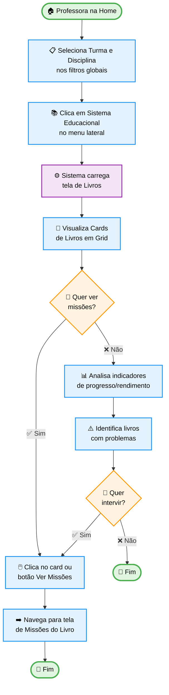

# Livros do Sistema Educacional

## 📋 Informações Básicas

| Campo | Valor |
|-------|-------|
| **ID da Jornada** | `PROF-001` |
| **Título** | Visualizar e Navegar nos Livros do Sistema Educacional |
| **Contexto** | Professor / Teacher Context |
| **Persona** | Professora Maria - 35 anos, ensina Matemática para 5º ano |
| **Prioridade** | 🔴 Alta |
| **Status** | 📝 Documentado - Aguardando Protótipo |
| **Última Atualização** | 2026-02-03 |

## 🎯 Objetivo da Jornada

A professora Maria precisa acessar os livros (ou trilhas) do sistema educacional para visualizar o progresso e rendimento dos seus alunos em cada livro. A partir dessa visão geral, ela pode navegar para as missões específicas de cada livro.

**O que a professora quer alcançar:**
- Visualizar todos os livros disponíveis para sua disciplina e turma
- Ver rapidamente o progresso geral da turma em cada livro
- Identificar livros com baixo rendimento para intervenção
- Acessar as missões de um livro específico com um clique

## 👤 Persona

**Nome**: Maria Silva  
**Papel**: Professora de Matemática - 5º ano  
**Contexto**: Usa a plataforma diariamente para acompanhar progresso dos alunos  
**Experiência**: Intermediária com tecnologia, confortável com navegadores web

**Necessidades:**
- Visualização rápida do status de cada livro
- Acesso fácil às missões do livro
- Indicadores visuais de progresso e rendimento
- Interface responsiva para usar no tablet durante aulas

## 📍 Contexto de Entrada

**Pré-condições:**
- Professora autenticada no sistema
- Turma e disciplina selecionadas nos filtros globais
- Sistema educacional configurado para a turma

**Ponto de entrada:**
- Menu lateral: "Sistema Educacional" → Clique automático carrega livros
- Rota: `/education-system/books/:educationSystemId`
- Breadcrumb: `[Nome do Sistema Educacional]`

## 🗺️ Fluxo AS-IS (Estado Atual)

### Diagrama de Fluxo

### Passos Detalhados

1. **Seleção de Filtros Globais**
   - Descrição: Professora seleciona turma e disciplina usando `useFilters()`
   - Tela: Filtros globais no topo da página
   - Ações: Seleciona turma (ex: "5º A"), seleciona disciplina (ex: "Matemática")
   - Sistema: Atualiza contexto global, dispara fetch dos livros

2. **Navegação para Sistema Educacional**
   - Descrição: Clica no item "Sistema Educacional" do menu lateral
   - Tela: Menu vertical com ícone de livros
   - Ações: Clique no item do menu
   - Sistema: Redireciona para `/education-system/books/:educationSystemId`, registra módulo Vuex `EducationSystemBooks`

3. **Visualização dos Livros em Cards**
   - Descrição: Sistema exibe grid de cards com informações de cada livro
   - Tela: `Index.vue` com componente `List.vue`
   - Componentes: `EducationSystemBooksList.vue` (renderiza cards)
   - Dados exibidos por card:
     - Imagem de capa do livro
     - Nome do livro
     - Indicador de progresso (barra de progresso %)
     - Indicador de rendimento/acurácia (badge colorido)
     - Botão "Ver Missões"
   - Layout: Grid responsivo (3 colunas desktop, 2 tablet, 1 mobile)

4. **Análise de Indicadores**
   - Descrição: Professora analisa visualmente os cards
   - Indicadores disponíveis:
     - **Progresso**: Barra horizontal com % de conclusão (verde: `>70%`, amarelo: `30-70%`, vermelho: `<30%`)
     - **Rendimento**: Badge colorido (verde: alto, amarelo: médio, vermelho: baixo)
   - Sistema: Calcula valores agregados da turma

5. **Navegação para Missões**
   - Descrição: Clica na imagem do card ou botão "Ver Missões"
   - Ações: Click event redireciona para rota de missões
   - Sistema: 
     - Navega para `/education-system/missions/:bookId`
     - Atualiza breadcrumb: `[Sistema Educacional] > [Nome do Livro]`
     - Define `book.value = { id: bookId, name: '' }` no filtro global
     - Registra módulo `EducationSystemMissions`

### Telas do Fluxo Atual

**Tela 1: Grid de Livros**
- Componente: `src/views/pages/teacher-context/educationSystem/books/Index.vue`
- Sub-componentes:
  - `Filter.vue` - Filtros adicionais (ex: "Todos os livros" vs específico)
  - `List.vue` - Grid de cards
  - `LegendEnum.vue` - Legenda de indicadores
- Rota: `/education-system/books/:educationSystemId`
- Estado Vuex: `store.state.EducationSystemBooks`

<!-- IMAGEM: Screenshot da tela completa de listagem de livros -->
<!-- Capturar de: educacross-frontoffice rodando localmente -->
<!-- URL: /education-system/books/:educationSystemId -->
<!-- Mostrar: Grid completo com múltiplos cards, filtros no topo, legendas embaixo -->

**Detalhe: Card Individual de Livro**
<!-- IMAGEM: Close-up de um card específico -->
<!-- Mostrar: Capa do livro, nome, barra de progresso, badge de rendimento, botão -->

**Tela 2: Lista de Missões (destino)**
- Componente: `src/views/pages/teacher-context/educationSystem/missions/Index.vue`
- Rota: `/education-system/missions/:bookId`

<!-- IMAGEM: Screenshot da tela de missões (para contexto) -->
<!-- Capturar de: educacross-frontoffice -->
<!-- URL: /education-system/missions/:bookId -->

## 😓 Pontos de Dor (Pain Points)

### 1. Tour Modal Intrusivo na Primeira Visita
- **Descrição**: Sistema exibe modal de tour guiado automaticamente na primeira vez que professor acessa a tela, interrompendo o fluxo natural
- **Impacto**: Médio
- **Frequência**: Ocasional (primeira visita)
- **Evidência**: Código em `Index.vue` linhas 73-85 (`openTourModal`, `refTourModal`)
- **Citação do usuário**: _"Sempre que entro pela primeira vez, aparece esse popup explicando. Eu só quero ver os livros rápido."_

### 2. Falta de Filtro Rápido de Status
- **Descrição**: Não há forma de filtrar livros por status (ex: "mostrar só livros com baixo rendimento")
- **Impacto**: Médio
- **Frequência**: Frequente
- **Evidência**: Apenas filtro "Todos os livros" disponível
- **Citação do usuário**: _"Tenho 15 livros, mas só quero ver os que estão vermelhos pra focar neles."_

### 3. Cards Sem Preview Rápido
- **Descrição**: Para ver detalhes de missões, precisa navegar para outra página. Não há preview/tooltip com resumo
- **Impacto**: Baixo
- **Frequência**: Frequente
- **Evidência**: Click obrigatório para ver missões
- **Citação do usuário**: _"Seria bom ver quantas missões tem sem precisar abrir o livro."_

### 4. Ausência de Ações Rápidas
- **Descrição**: Não há opções de ação direta no card (ex: "Habilitar missão", "Exportar relatório")
- **Impacto**: Baixo
- **Frequência**: Ocasional
- **Evidência**: Apenas botão "Ver Missões"
- **Citação do usuário**: _"Gostaria de poder habilitar uma missão direto daqui."_

### Métricas do Problema

| Métrica | Valor Atual | Objetivo Ideal |
|---------|-------------|----------------|
| Tempo médio para achar livro problemático | 45 segundos | 15 segundos |
| Cliques até acessar missão | 3 cliques | 2 cliques |
| Taxa de uso do tour | 12% | 5% (opcional) |
| Satisfação com navegação | NPS 6 | NPS 8+ |

---

## � Referências

### Documentação Relacionada

- [Jornada: Missões do Livro](/docs/journeys/teacher/education-system-missions) - Tela de destino
- Filtros Globais useFilters (documentação em breve) - Sistema de filtros
- Padrão DDD (documentação em breve) - Arquitetura de componentes

### Recursos Externos

- [Design System Vuexy - Cards](https://fabioeducacross.github.io/DesignSystem-Vuexy)
- [Bootstrap Icons - Education](https://icons.getbootstrap.com/?q=book)

### Código Fonte AS-IS

**Arquivos de Referência (educacross-frontoffice)**:  
- `src/views/pages/teacher-context/educationSystem/books/Index.vue`
- `src/views/pages/teacher-context/educationSystem/books/List.vue`
- `src/store/pageModules/educationSystem/module-education-system-books.js`
- `src/views/pages/teacher-context/educationSystem/books/useEducationSystemBooks.js`

---

## 📅 Histórico de Mudanças

| Data | Versão | Autor | Mudanças |
|------|--------|-------|----------|
| 2026-02-03 | 1.0 | Fábio Educacross | Criação inicial da documentação AS-IS |
