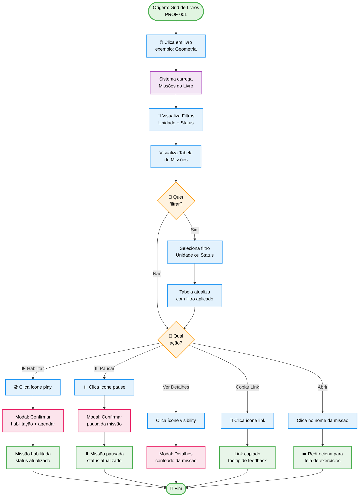
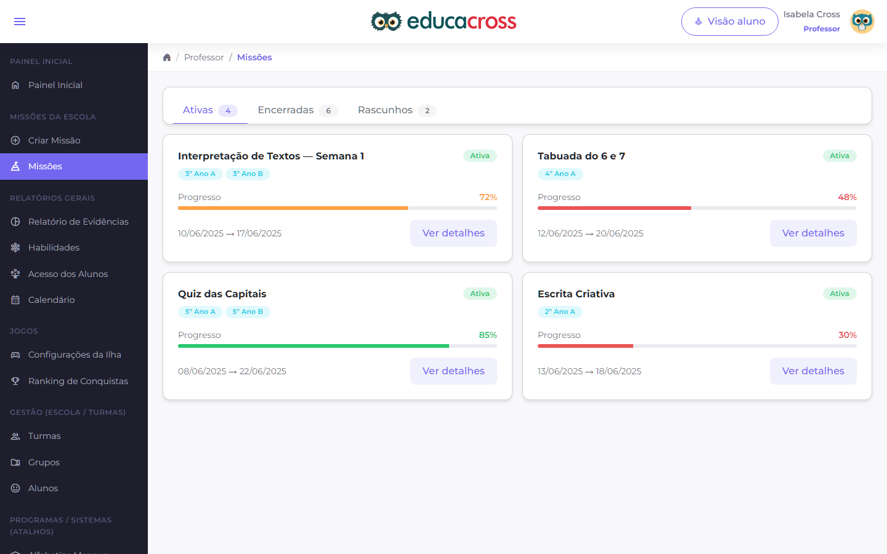

import {
  IconBookOpen,
  IconBooks,
  IconCheck,
  IconCircleRed,
  IconClipboard,
  IconDocument,
  IconEdit,
  IconEye,
  IconLink,
  IconRefresh,
  IconSearch,
  IconSettings,
  IconTarget,
  IconX
} from '@site/src/components/MaterialIcon';

# Missões do Livro do Sistema Educacional

## <IconClipboard /> Informações Básicas

| Campo | Valor |
|-------|-------|
| **ID da Jornada** | `PROF-002` |
| **Título** | Visualizar e Gerenciar Missões de um Livro |
| **Contexto** | Professor / Teacher Context |
| **Persona** | Professora Maria - 35 anos, ensina Matemática para 5º ano |
| **Prioridade** | <IconCircleRed /> Alta |
| **Status** | <IconEdit /> Documentado - Aguardando Protótipo |
| **Última Atualização** | 2026-02-03 |

## <IconTarget /> Objetivo da Jornada

Após selecionar um livro, a professora Maria precisa visualizar todas as missões (atividades) daquele livro, acompanhar o progresso e rendimento da turma em cada missão, e realizar ações de gestão como habilitar, pausar ou visualizar detalhes de missões.

**O que a professora quer alcançar:**
- Ver lista completa de missões do livro selecionado
- Identificar missões já habilitadas vs não habilitadas
- Visualizar progresso (% de alunos que fizeram) e rendimento (% de acertos) por missão
- Habilitar novas missões para a turma
- Pausar missões em andamento
- Acessar detalhes e link de compartilhamento de missões
- Filtrar missões por unidade do livro e status

## 👤 Persona

**Nome**: Maria Silva  
**Papel**: Professora de Matemática - 5º ano  
**Contexto**: Acaba de clicar em um livro de Geometria e quer habilitar a próxima missão  
**Experiência**: Intermediária com tecnologia, usa plataforma diariamente

**Necessidades:**
- Visão clara do status de cada missão (habilitada, pausada, não enviada)
- Ações rápidas para habilitar/pausar missões
- Compartilhar link de missão com alunos facilmente
- Filtrar missões por capítulo/unidade do livro
- Ver quais são "Missões Plus" (premium)

## 📍 Contexto de Entrada

**Pré-condições:**
- Professora navegou de "Livros do Sistema Educacional" ([PROF-001](/docs/journeys/teacher/education-system-books))
- Livro específico selecionado (ex: "Geometria Básica")
- Turma e disciplina já selecionadas nos filtros globais
- Sistema educacional configurado

**Ponto de entrada:**
- Origem: Clique no card de livro ou botão "Ver Missões" (PROF-001)
- Rota: `/education-system/missions/:bookId`
- Breadcrumb: `[Sistema Educacional] > [Nome do Livro]`
- Filtro global `book` definido: `{ id: bookId, name: 'Nome do Livro' }`

## 🗺️ Fluxo AS-IS (Estado Atual)

### Diagrama de Fluxo

### Passos Detalhados

1. **Carregamento da Página de Missões**
   - Descrição: Sistema busca e exibe missões do livro selecionado
   - Tela: `missions/Index.vue` com componentes `Filters.vue`, `List.vue`, `Title.vue`
   - Ações do sistema:
     - Registra módulo Vuex `EducationSystemMissions`
     - Define `book.value = { id: bookId, name: '' }`
     - Define `mission.value = { id: null, name: 'Todas as missões' }`
     - Atualiza breadcrumb: `[Sistema Educacional] > [Nome do Livro]`
     - Chama API para buscar missões: `fetchDetails()`
   - Dados carregados: Lista de missões com progresso, rendimento, status

2. **Visualização dos Filtros**
   - Descrição: Filtros permitem refinar visualização das missões
   - Componente: `Filters.vue`
   - Filtros disponíveis:
     - **Unidades do livro**: Dropdown com capítulos/unidades (ex: "Unidade 1", "Unidade 2", "Todas")
     - **Status**: Dropdown com opções (Todas, Não enviada, Não iniciada, Em andamento, Pausada, Finalizada)
   - Comportamento: Alteração de filtro dispara `resetAndfetch()` que atualiza tabela

3. **Visualização da Tabela de Missões**
   - Descrição: Tabela exibe todas as missões com indicadores visuais
   - Componente: `List.vue` com `ListTableLocalSorting`
   - Colunas da tabela:
     - **Nome**: Nome da missão + badge "Missão Plus" (se premium)
     - **Progresso**: Barra horizontal com % de alunos que fizeram (cores: verde/amarelo/vermelho)
     - **Rendimento**: Badge colorido com % de acertos médios
     - **Status**: Badge pill (Não enviada, Habilitada, Pausada, Finalizada)
     - **Ações**: Ícones clicáveis (play, pause, visibility, link)
   - Funcionalidades:
     - Busca por nome de missão (search bar)
     - Ordenação por colunas (clique no header)
     - Scroll interno (não paginada, usa `ListTableLocalSorting`)

4. **Ações Disponíveis por Missão**
   
   **4.1. Habilitar Missão** (ícone `play_arrow`)
   - Condição: Missão com status "Não enviada" ou "Pausada"
   - Ação: Clique abre modal `EducationSystemMissionsEnableModal`
   - Modal contém: Confirmação + opção de agendar data/hora
   - Resultado: Missão habilitada, status muda para "Habilitada", alunos podem acessar

   **4.2. Pausar Missão** (ícone `pause`)
   - Condição: Missão com status "Habilitada" ou "Em andamento"
   - Ação: Clique abre modal de confirmação `ModalConfirm`
   - Modal contém: "Tem certeza que deseja pausar? A missão será ocultada para [Turma]"
   - Resultado: Missão pausada, alunos não veem mais

   **4.3. Ver Detalhes** (ícone `visibility`)
   - Condição: Missões Plus (premium)
   - Ação: Clique abre modal `MissionBookDetails`
   - Modal contém: Descrição da missão, objetivos, questões, preview
   - Resultado: Professora visualiza conteúdo sem habilitar

   **4.4. Copiar Link** (ícone `link`)
   - Condição: Missão com status "Habilitada" e possui `guideLinkUrl`
   - Ação: Clique copia URL para clipboard
   - Feedback: Tooltip verde "Link copiado" por 2 segundos
   - Resultado: Professora pode compartilhar link em WhatsApp/Google Classroom

   **4.5. Abrir Missão** (clique no nome)
   - Condição: Qualquer missão
   - Ação: Redireciona para tela de exercícios da missão
   - Destino: `/education-system/mission/:missionId/exercises`
   - Resultado: Visualiza questões individuais da missão

5. **Feedback Visual e Legendas**
   - Descrição: Indicadores coloridos auxiliam interpretação rápida
   - Legendas exibidas embaixo da tabela (`LegendEnum`):
     - **Progresso**: Verde (`maior que 70%`), Amarelo (`30-70%`), Vermelho (`menor que 30%`)
     - **Rendimento**: Verde (`maior que 70%`), Amarelo (`40-70%`), Vermelho (`menor que 40%`)
   - Badge "Missão Plus": Identifica missões premium com ícone especial

### Telas do Fluxo Atual

**Tela 1: Lista de Missões com Filtros**
- Componente: `src/views/pages/teacher-context/educationSystem/missions/Index.vue`
- Sub-componentes:
  - `Title.vue` - Breadcrumb e título do livro
  - `Filters.vue` - Card com filtros (Unidade + Status)
  - `List.vue` - Tabela com missões
  - `LegendEnum.vue` - Legendas de progresso e rendimento
- Rota: `/education-system/missions/:bookId`
- Estado Vuex: `store.state.EducationSystemMissions`

<!-- IMAGEM: Screenshot da tela completa de missões -->
<!-- Capturar de: educacross-frontoffice rodando localmente -->
<!-- URL: /education-system/missions/:bookId -->
<!-- Mostrar: Filtros no topo, tabela com múltiplas missões, legendas embaixo -->

**Detalhe: Linha da Tabela com Ações**
<!-- IMAGEM: Close-up de uma linha da tabela -->
<!-- Mostrar: Nome da missão, barra de progresso, badge de rendimento, status, ícones de ação -->

**Modal: Habilitar Missão**
<!-- IMAGEM: Screenshot do modal de habilitação -->
<!-- Mostrar: Modal com título, campo de data/hora, botões Cancelar/Confirmar -->

**Modal: Detalhes Missão Plus**
<!-- IMAGEM: Screenshot do modal de detalhes -->
<!-- Mostrar: Modal com descrição, objetivos, preview de questões -->

## 😓 Pontos de Dor (Pain Points)

### 1. Ausência de Visão de Sequência Pedagógica
- **Descrição**: Missões são listadas em tabela linear sem indicar ordem sugerida ou pré-requisitos
- **Impacto**: Alto
- **Frequência**: Sempre
- **Evidência**: Tabela ordenável por qualquer coluna, mas sem indicador de "próxima missão sugerida"
- **Citação do usuário**: _"Não sei qual missão devo habilitar primeiro. Elas têm uma ordem certa?"_

### 2. Filtro de Status com Muitas Opções Pouco Usadas
- **Descrição**: Dropdown de status tem 6 opções, mas professoras usam principalmente "Todas" e "Não enviada"
- **Impacto**: Baixo
- **Frequência**: Frequente
- **Evidência**: Código mostra 6 status, UX research indica foco em 2-3
- **Citação do usuário**: _"Só quero ver as que posso habilitar agora. O resto não importa muito."_

### 3. Ações Pouco Descobríveis em Ícones Pequenos
- **Descrição**: Ícones de ação (play, pause, visibility, link) são pequenos e sem texto, dependem de tooltip
- **Impacto**: Médio
- **Frequência**: Ocasional (usuários novos)
- **Evidência**: Ícones Material Symbols sem labels, tooltip apenas ao hover
- **Citação do usuário**: _"No começo eu não sabia que tinha como copiar o link. Achei por acaso."_

### 4. Falta de Contexto sobre "Missão Plus"
- **Descrição**: Badge "Missão Plus" aparece mas não explica o que é (conteúdo premium) até clicar
- **Impacto**: Baixo
- **Frequência**: Ocasional
- **Evidência**: Badge com ícone e texto, mas sem tooltip explicativo
- **Citação do usuário**: _"O que é Missão Plus? É melhor que as outras?"_

### 5. Processo de Habilitar é Lento para Múltiplas Missões
- **Descrição**: Para habilitar 5 missões, precisa clicar → modal → confirmar → fechar, 5 vezes
- **Impacto**: Alto
- **Frequência**: Frequente (início de bimestre)
- **Evidência**: Modal individual para cada missão
- **Citação do usuário**: _"Queria poder marcar várias e habilitar todas de uma vez."_

### Métricas do Problema

| Métrica | Valor Atual | Objetivo Ideal |
|---------|-------------|----------------|
| Tempo para habilitar 5 missões | 2 minutos | 30 segundos |
| Taxa de uso do filtro de unidade | 35% | 70% |
| Cliques até copiar link | 2 cliques | 1 clique |
| Taxa de descoberta de ação "link" | 45% (usuários novos) | 90% |
| Dúvidas sobre ordem pedagógica | 8 tickets/mês | 2 tickets/mês |

---

## 🧩 Regras Operacionais TO-BE (Sistema de Ensino)

### 1) Lista de Missões por Turma

- A lista é sempre contextualizada pela turma selecionada no topo da jornada.
- Coluna **Alunos** segue padrão `X de N`:
  - `N`: total de alunos da turma.
  - `X`: alunos vinculados/enviados para aquela missão.
- Colunas **Início/Fim** mostram data apenas quando período estiver definido; caso contrário exibem `-`.
- **Rendimento médio** mostra `NÃO HÁ DADOS` quando não houver dados de jogo para a turma/missão.

### 2) Máquina de estados da missão

| Estado | Cor | Regra de entrada | Regra de saída |
|---|---|---|---|
| Não enviada | `#FFB443` | Estado inicial | Primeiro habilitar/envio |
| Iniciada | `#8BC728` | Missão habilitada com início vigente | Pausar total, finalizar, ou novo ciclo |
| Não iniciada | `#FFB443` | Missão habilitada com período futuro | Início do período |
| Finalizada | `#7F6CC3` | Critério de conclusão atingido | Novo ciclo de envio |

### 3) Regras das ações na coluna Ações

- **Enviar** abre drawer em modo `send` com alunos elegíveis para vinculação.
- **Pausar** abre drawer em modo `pause` com alunos elegíveis para desvinculação.
- Quando sem elegíveis:
  - Enviar desabilitado + tooltip: `Não há alunos para enviar`.
  - Pausar desabilitado + tooltip: `Não há alunos para pausar`.

### 4) Drawer lateral para operação em lote

- Único componente com dois modos (`send` e `pause`).
- Estrutura mínima:
  - Header fixo (título + fechar)
  - Resumo (`Total de alunos` e `Alunos na missão`)
  - Opção **Definir período**
  - Filtro por nome em tempo real
  - Tabela de alunos com seleção individual e seleção em massa
  - Footer fixo com botão contextual (**ENVIAR** ou **PAUSAR**)
- Regra de seleção em massa: aplica somente aos alunos elegíveis e visíveis após filtro.
- Regra de confirmação: botão só habilita com ao menos 1 aluno elegível selecionado.

### 5) Regras de atualização após operação em lote

- Atualizar imediatamente na linha da missão:
  - `X de N` (alunos)
  - Status visual
  - Habilitação/desabilitação dos botões Enviar/Pausar
- Persistir histórico mínimo do lote:
  - Data/hora
  - Turma
  - Missão
  - Quantidade de alunos afetados
  - Ação executada (`send`/`pause`)

### 6) Critérios de aceite (foco MVP)

- Professor consegue enviar missão para múltiplos alunos da turma em uma única operação.
- Professor consegue pausar missão para múltiplos alunos da turma em uma única operação.
- Interface impede ação inválida (sem elegíveis) com feedback claro via estado desabilitado e tooltip.
- Indicadores da tabela refletem o resultado do lote sem necessidade de recarregar a página.

---

## <IconLink /> Referências

### Documentação Relacionada

- [Jornada: Livros do Sistema Educacional](/docs/journeys/teacher/education-system-books) - PROF-001 (origem)
- Jornada: Exercícios da Missão (PROF-003 - documentação em breve) - Destino ao clicar no nome
- Filtros Globais useFilters (documentação em breve) - Sistema de filtros
- Padrão DDD (documentação em breve) - Arquitetura

### Recursos Externos

- [Design System Vuexy - Tables](https://fabioeducacross.github.io/DesignSystem-Vuexy)
- [Bootstrap Icons - Education](https://icons.getbootstrap.com/?q=book)
- [Material Symbols - Actions](https://fonts.google.com/icons?selected=Material+Symbols+Outlined:play_arrow)

### Código Fonte AS-IS

**Arquivos de Referência (educacross-frontoffice)**:  
- `src/views/pages/teacher-context/educationSystem/missions/Index.vue`
- `src/views/pages/teacher-context/educationSystem/missions/List.vue`
- `src/views/pages/teacher-context/educationSystem/missions/Filters.vue`
- `src/store/pageModules/educationSystem/module-education-system-missions.js`
- `src/views/pages/teacher-context/educationSystem/missions/useEducationSystemMissions.js`

---

## 📅 Histórico de Mudanças

| Data | Versão | Autor | Mudanças |
|------|--------|-------|----------|
| 2026-02-23 | 1.1 | GitHub Copilot | Consolidação das regras TO-BE: lista por turma, estados da missão, drawer lateral e operação em lote |
| 2026-02-03 | 1.0 | Fábio Educacross | Criação inicial da documentação AS-IS |
