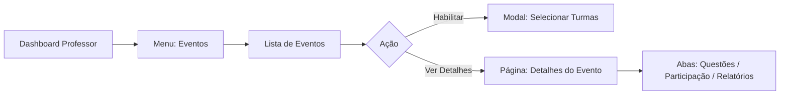
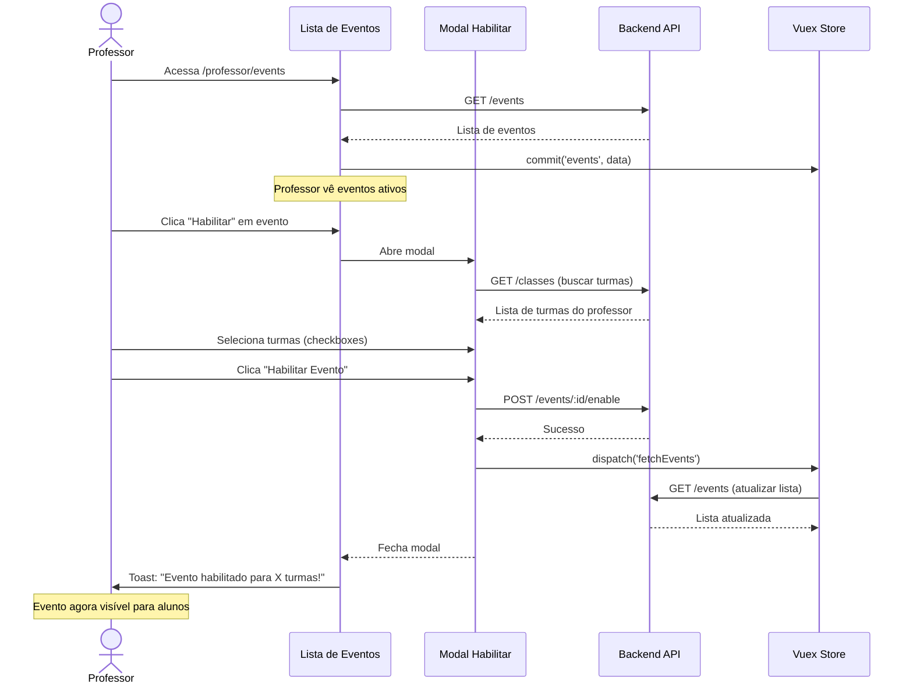

# PROF-004: Events Management

<span class="badge badge-warning">🔴 Alta Prioridade</span> <span class="badge badge-info">Sprint 1</span> <span class="badge badge-primary">Teacher Context</span>

## Visão Geral

Jornada que permite professores gerenciarem **eventos educacionais** (avaliações externas, simulados, olimpíadas) para suas turmas, incluindo habilitação de provas, configuração de datas e acompanhamento de participação dos alunos.

**Contexto de Usuário**: Professor  
**Categoria**: Avaliações e Eventos  
**Complexidade**: ⭐⭐ Intermediário  
**Duração Média**: 5-10 minutos por evento

---

## Problema que Resolve

Professores precisam gerenciar eventos educacionais que:
- São configurados centralmente pela rede ou coordenação
- Requerem habilitação manual para turmas específicas
- Têm períodos de aplicação definidos (data início/fim)
- Precisam ser acompanhados em tempo real (participação, conclusão)

**Pain Points Atuais**:
- ❌ Interface confusa com muitas informações visuais
- ❌ Falta de clareza sobre status do evento (ativo, pendente, encerrado)
- ❌ Dificuldade para ver quais turmas já habilitaram o evento
- ❌ Sem preview das questões antes de habilitar

---

## Rota e Navegação

### URL
```
/professor/events
/professor/events/:eventId/details
```

### Caminho de Navegação


### Breadcrumb
```
Home > Eventos > [Nome do Evento]
```

---

## Arquitetura de Arquivos

### Componentes Vue

```
src/views/pages/teacher-context/events/
├── EventsRoot.vue                     # Route entry point
├── list/
│   ├── EventsList.vue                 # Lista de eventos (Index)
│   ├── EventListFilter.vue            # Filtros (status, data)
│   ├── EventListCard.vue              # Card de evento
│   └── EventModalEnable.vue           # Modal habilitar evento
├── details/
│   ├── EventDetails.vue               # Página de detalhes
│   ├── EventQuestionsTab.vue          # Aba: Questões do evento
│   ├── EventParticipationTab.vue      # Aba: Participação
│   └── EventReportsTab.vue            # Aba: Relatórios
├── components/
│   ├── EventStatusBadge.vue           # Badge de status
│   ├── EventDateRange.vue             # Componente data início/fim
│   └── ParticipationProgress.vue      # Barra de progresso
└── useEvents.js                       # Domain composable
```

### Vuex Module

```javascript
// src/store/pageModules/events/module-events.js
export default {
  namespaced: true,
  state: {
    events: [],
    eventDetails: null,
    loading: false,
    filters: {
      status: null, // 'active', 'upcoming', 'finished'
      searchTerm: '',
    },
  },
  mutations: {
    events(state, payload) { state.events = payload },
    eventDetails(state, payload) { state.eventDetails = payload },
    loading(state, payload) { state.loading = payload },
    setFilter(state, { key, value }) {
      state.filters[key] = value
    },
  },
  getters: {
    events: state => state.events,
    eventDetails: state => state.eventDetails,
    loading: state => state.loading,
    filters: state => state.filters,
    activeEvents: state => {
      return state.events.filter(e => e.status === 'active')
    },
    filteredEvents: state => {
      let filtered = state.events
      
      if (state.filters.status) {
        filtered = filtered.filter(e => e.status === state.filters.status)
      }
      
      if (state.filters.searchTerm) {
        const term = state.filters.searchTerm.toLowerCase()
        filtered = filtered.filter(e => 
          e.name.toLowerCase().includes(term) ||
          e.description.toLowerCase().includes(term)
        )
      }
      
      return filtered
    },
  },
  actions: {
    async fetchEvents({ commit, rootGetters }) {
      commit('loading', true)
      const response = await getEvents({
        TeacherId: rootGetters['account/userId'],
        SubjectId: rootGetters['filters/subject']?.id,
      })
      commit('events', response.data)
      commit('loading', false)
    },
    async fetchEventDetails({ commit }, eventId) {
      commit('loading', true)
      const response = await getEventDetails(eventId)
      commit('eventDetails', response.data)
      commit('loading', false)
    },
    async enableEvent({ dispatch }, { eventId, classIds }) {
      await enableEventForClasses(eventId, classIds)
      await dispatch('fetchEvents')
    },
  },
}
```

### Services

```javascript
// src/services/teacher-context/EventsService.js
import axios from '@axios'

/**
 * Busca eventos disponíveis para o professor
 * @param {Object} params - Parâmetros de busca
 * @returns {Promise<Array>} Lista de eventos
 */
export const getEvents = async (params) => {
  return axios.get('/events', { params })
}

/**
 * Busca detalhes de um evento específico
 * @param {number} eventId - ID do evento
 * @returns {Promise<Object>} Detalhes do evento
 */
export const getEventDetails = async (eventId) => {
  return axios.get(`/events/${eventId}`)
}

/**
 * Habilita evento para turmas específicas
 * @param {number} eventId - ID do evento
 * @param {Array<number>} classIds - IDs das turmas
 * @returns {Promise<Object>} Confirmação
 */
export const enableEventForClasses = async (eventId, classIds) => {
  return axios.post(`/events/${eventId}/enable`, { classIds })
}

/**
 * Busca participação dos alunos no evento
 * @param {number} eventId - ID do evento
 * @param {number} classId - ID da turma
 * @returns {Promise<Array>} Lista de participação
 */
export const getEventParticipation = async (eventId, classId) => {
  return axios.get(`/events/${eventId}/participation`, {
    params: { classId }
  })
}
```

---

## Fluxo de Usuário



---

## Estados da Interface

### Estado: Loading Inicial
**Quando**: Carregando lista de eventos  
**Elementos**:
- Skeleton cards em grid 3 colunas
- Header da página visível
- Filtros desabilitados

### Estado: Lista Vazia
**Quando**: Sem eventos disponíveis no momento  
**Elementos**:
- Ilustração empty state
- Texto: "Não há eventos disponíveis no momento"
- Mensagem: "Novos eventos serão exibidos aqui quando disponibilizados"

### Estado: Lista de Eventos (Principal)
**Elementos no Card de Evento**:
- Título do evento
- Badge de status (Ativo, Em Breve, Encerrado)
- Data início - Data fim
- Descrição curta (máx 100 caracteres)
- Ícone da matéria
- Botão "Habilitar" ou "Ver Detalhes"
- Contador: "X turmas habilitadas"

**Variações de Badge**:
- 🟢 **Ativo** (verde) - Evento em andamento, dentro do período
- 🟡 **Em Breve** (amarelo) - Evento futuro, ainda não iniciou
- 🔴 **Encerrado** (vermelho) - Evento finalizado, fora do período
- ⚫ **Rascunho** (cinza) - Evento não publicado (apenas admin)

### Estado: Modal de Habilitação
**Elementos**:
- Título: "Habilitar [Nome do Evento]"
- Descrição do evento (completa)
- Lista de turmas (checkboxes):
  - Nome da turma
  - Quantidade de alunos
  - Status: "Já habilitado" (desabilitado) ou disponível
- Checkbox "Selecionar Todas"
- Botão "Cancelar" | "Habilitar Evento"

**Validações**:
- Pelo menos 1 turma deve ser selecionada
- Não permitir habilitar turma já habilitada

### Estado: Detalhes do Evento (3 Abas)

**Aba 1: Questões**
- Lista de questões do evento (read-only)
- Preview de cada questão
- Tipo de questão (múltipla escolha, discursiva)
- Pontuação por questão
- Total de questões e pontos

**Aba 2: Participação**
- Filtro por turma
- Tabela de alunos:
  - Nome do aluno
  - Status: Não iniciado / Em andamento / Concluído
  - Nota (se concluído)
  - Data de conclusão
  - Tempo gasto
- Estatísticas:
  - Taxa de participação: X%
  - Média da turma: Y pontos
  - Alunos concluídos: Z/Total

**Aba 3: Relatórios**
- Gráficos de desempenho
- Análise por questão
- Comparativo entre turmas
- Botão "Exportar Relatório (PDF/Excel)"

### Estado: Sucesso
**Quando**: Evento habilitado com sucesso  
**Elementos**:
- Toast verde: "Evento habilitado para X turmas!"
- Card do evento atualizado com contador de turmas
- Badge "Habilitado" no card

### Estado: Erro
**Quando**: Falha ao habilitar evento  
**Elementos**:
- Toast vermelho: "Erro ao habilitar evento. Tente novamente."
- Modal permanece aberto
- Seleções de turmas mantidas

---

## Componentes Críticos

### 1. EventsList.vue (Index)
**Responsabilidade**: Orquestrar lista de eventos com filtros  
**Props**: Nenhum  
**Emits**: Nenhum

**Padrão de Composição**:
```vue
<template>
  <section>
    <EventListFilter @filter-change="handleFilterChange" />
    
    <b-row v-if="!loading">
      <b-col cols="12" md="4" v-for="event in filteredEvents" :key="event.id">
        <EventListCard
          :event="event"
          @enable="openEnableModal"
          @view-details="goToDetails"
        />
      </b-col>
    </b-row>
    
    <EventModalEnable
      :visible="modalVisible"
      :event="selectedEvent"
      @close="modalVisible = false"
      @enabled="handleEventEnabled"
    />
  </section>
</template>
```

### 2. EventListCard.vue
**Responsabilidade**: Card visual de um evento  
**Props**:
- `event` (Object, required) - Dados do evento

**Emits**:
- `@enable` - Habilitar evento
- `@view-details` - Ver detalhes do evento

**Features**:
- Badge de status com cor dinâmica
- Data formatada (dd/MM/yyyy)
- Ícone da matéria
- Truncate description com "Ver mais"
- Botões condicionais (Habilitar ou Ver Detalhes)

### 3. EventModalEnable.vue
**Responsabilidade**: Modal para selecionar turmas  
**Props**:
- `visible` (Boolean, required) - Controla visibilidade
- `event` (Object, required) - Evento sendo habilitado

**Emits**:
- `@close` - Fechar modal
- `@enabled` - Evento habilitado com sucesso

**Features**:
- Buscar turmas do professor
- Checkboxes com estado (habilitado/desabilitado)
- "Selecionar Todas" com lógica de toggle
- Validação de seleção mínima
- Loading state durante requisição

### 4. EventStatusBadge.vue
**Responsabilidade**: Badge visual de status  
**Props**:
- `status` (String, required) - Status do evento
- `startDate` (String) - Data início
- `endDate` (String) - Data fim

**Computed**:
```javascript
const badgeVariant = computed(() => {
  const today = new Date()
  const start = new Date(props.startDate)
  const end = new Date(props.endDate)
  
  if (props.status === 'draft') return 'secondary'
  if (today < start) return 'warning' // Em Breve
  if (today > end) return 'danger' // Encerrado
  return 'success' // Ativo
})

const badgeText = computed(() => {
  const today = new Date()
  const start = new Date(props.startDate)
  const end = new Date(props.endDate)
  
  if (props.status === 'draft') return 'Rascunho'
  if (today < start) return 'Em Breve'
  if (today > end) return 'Encerrado'
  return 'Ativo'
})
```

---

## Integração com useFilters()

```javascript
// src/views/pages/teacher-context/events/useEvents.js
import store from '@/store'
import useFilters from '@/store/filters/useFilters'
import { computed } from 'vue'

const moduleName = 'Events'
const { subject, classe } = useFilters()

export default function useEvents() {
  const events = computed({
    get: () => store.getters[`${moduleName}/events`],
    set: val => store.commit(`${moduleName}/events`, val),
  })

  const eventDetails = computed({
    get: () => store.getters[`${moduleName}/eventDetails`],
    set: val => store.commit(`${moduleName}/eventDetails`, val),
  })

  const loading = computed({
    get: () => store.getters[`${moduleName}/loading`],
    set: val => store.commit(`${moduleName}/loading`, val),
  })

  const filteredEvents = computed(() => 
    store.getters[`${moduleName}/filteredEvents`]
  )

  const fetchEvents = async () => {
    loading.value = true
    await store.dispatch(`${moduleName}/fetchEvents`)
    loading.value = false
  }

  const fetchEventDetails = async (eventId) => {
    loading.value = true
    await store.dispatch(`${moduleName}/fetchEventDetails`, eventId)
    loading.value = false
  }

  const enableEvent = async (eventId, classIds) => {
    await store.dispatch(`${moduleName}/enableEvent`, { eventId, classIds })
  }

  return {
    moduleName,
    events,
    eventDetails,
    loading,
    filteredEvents,
    fetchEvents,
    fetchEventDetails,
    enableEvent,
  }
}
```

**Watch Filters**:
```javascript
import { watch } from 'vue'

watch([subject], () => {
  if (subject.value?.id) {
    fetchEvents()
  }
})
```

---

## API Endpoints

### GET /events

**Request Params**:
```
?teacherId=123
&subjectId=5
```

**Response**:
```json
{
  "events": [
    {
      "id": 1,
      "name": "Simulado ENEM 2026 - 1ª Edição",
      "description": "Simulado completo com questões do ENEM dos últimos 5 anos",
      "subjectId": 5,
      "subjectName": "Matemática",
      "startDate": "2026-03-01T00:00:00Z",
      "endDate": "2026-03-15T23:59:59Z",
      "status": "active",
      "totalQuestions": 45,
      "totalPoints": 450,
      "enabledClassesCount": 3,
      "thumbnailUrl": "https://blob.educacross.com/events/enem-2026.jpg"
    }
  ],
  "total": 5
}
```

### GET /events/:id

**Response**:
```json
{
  "id": 1,
  "name": "Simulado ENEM 2026 - 1ª Edição",
  "description": "Simulado completo com questões do ENEM...",
  "instructions": "<p>Leia atentamente todas as questões...</p>",
  "subjectId": 5,
  "subjectName": "Matemática",
  "startDate": "2026-03-01T00:00:00Z",
  "endDate": "2026-03-15T23:59:59Z",
  "status": "active",
  "totalQuestions": 45,
  "totalPoints": 450,
  "duration": 180,
  "maxAttempts": 1,
  "enabledClasses": [
    {
      "classId": 101,
      "className": "5º Ano A",
      "studentsCount": 30,
      "enabledAt": "2026-02-28T10:00:00Z"
    }
  ],
  "questions": [
    {
      "id": 501,
      "order": 1,
      "statement": "Calcule o valor de x na equação: 2x + 5 = 15",
      "type": "multiple_choice",
      "alternatives": ["x = 2", "x = 5", "x = 7", "x = 10"],
      "points": 10
    }
  ]
}
```

### POST /events/:id/enable

**Request**:
```json
{
  "classIds": [101, 102, 103]
}
```

**Response**:
```json
{
  "success": true,
  "enabledClassesCount": 3,
  "message": "Evento habilitado para 3 turmas"
}
```

### GET /events/:id/participation

**Request Params**:
```
?classId=101
```

**Response**:
```json
{
  "eventId": 1,
  "classId": 101,
  "className": "5º Ano A",
  "students": [
    {
      "studentId": 1001,
      "studentName": "João Silva",
      "status": "completed",
      "score": 380,
      "maxScore": 450,
      "percentage": 84.4,
      "startedAt": "2026-03-02T14:00:00Z",
      "completedAt": "2026-03-02T17:15:00Z",
      "timeSpent": 195
    },
    {
      "studentId": 1002,
      "studentName": "Maria Santos",
      "status": "in_progress",
      "score": null,
      "startedAt": "2026-03-03T09:00:00Z",
      "completedAt": null,
      "timeSpent": null
    },
    {
      "studentId": 1003,
      "studentName": "Pedro Costa",
      "status": "not_started",
      "score": null,
      "startedAt": null,
      "completedAt": null,
      "timeSpent": null
    }
  ],
  "statistics": {
    "totalStudents": 30,
    "completed": 15,
    "inProgress": 5,
    "notStarted": 10,
    "participationRate": 50.0,
    "averageScore": 325.5,
    "averagePercentage": 72.3
  }
}
```

---

## Screenshots AS-IS

### Lista de Eventos


### Card de Evento (Detalhes)


### Modal de Habilitação


### Página de Detalhes (Aba Questões)


### Aba de Participação


---

## Métricas e KPIs

### Métricas de Uso
- Eventos habilitados por professor/mês
- Taxa de habilitação (% de eventos disponíveis que são habilitados)
- Tempo médio entre disponibilização e habilitação
- Turmas por evento (média)

### Métricas de Participação
- Taxa de conclusão de alunos (% que completam o evento)
- Taxa de participação no prazo (% que completam antes do deadline)
- Tempo médio de conclusão
- Taxa de visualização de relatórios pós-evento

---

## Testes Recomendados

### Testes Unitários
```javascript
// tests/unit/views/events/useEvents.spec.js
import useEvents from '@/views/pages/teacher-context/events/useEvents'
import store from '@/store'

describe('useEvents', () => {
  it('deve buscar eventos corretamente', async () => {
    const { fetchEvents, events } = useEvents()
    
    await fetchEvents()
    
    expect(events.value).toBeDefined()
    expect(Array.isArray(events.value)).toBe(true)
  })

  it('deve filtrar eventos por status', () => {
    store.commit('Events/events', [
      { id: 1, status: 'active', name: 'Evento 1' },
      { id: 2, status: 'finished', name: 'Evento 2' },
      { id: 3, status: 'active', name: 'Evento 3' },
    ])
    
    store.commit('Events/setFilter', { key: 'status', value: 'active' })
    
    const filtered = store.getters['Events/filteredEvents']
    
    expect(filtered).toHaveLength(2)
    expect(filtered[0].status).toBe('active')
  })
})
```

### Testes de Integração
```javascript
// tests/integration/events-workflow.spec.js
import { shallowMount } from '@vue/test-utils'
import EventsList from '@/views/pages/teacher-context/events/list/EventsList.vue'

describe('Events - Fluxo de Habilitação', () => {
  it('deve abrir modal ao clicar em Habilitar', async () => {
    const wrapper = shallowMount(EventsList, {
      data() {
        return {
          events: [
            { id: 1, name: 'Evento Teste', status: 'active' }
          ]
        }
      }
    })
    
    const card = wrapper.findComponent({ name: 'EventListCard' })
    await card.vm.$emit('enable', 1)
    
    expect(wrapper.vm.modalVisible).toBe(true)
    expect(wrapper.vm.selectedEvent.id).toBe(1)
  })

  it('deve habilitar evento para turmas selecionadas', async () => {
    const mockEnableEvent = jest.fn()
    const wrapper = shallowMount(EventModalEnable, {
      propsData: {
        visible: true,
        event: { id: 1, name: 'Evento Teste' }
      },
      methods: { enableEvent: mockEnableEvent }
    })
    
    await wrapper.find('[data-test="class-checkbox-101"]').setChecked()
    await wrapper.find('[data-test="btn-enable"]').trigger('click')
    
    expect(mockEnableEvent).toHaveBeenCalledWith(1, [101])
  })
})
```

---

## Rastreamento de Mudanças

| Versão | Data | Mudanças | Autor |
|--------|------|----------|-------|
| AS-IS v1.0 | 2026-02-03 | Documentação inicial Sprint 1 | Equipe Docs |
| AS-IS v1.1 | 2026-02-05 | Removida seção TO-BE (aguardando discovery) | Equipe Docs |

---

## Referências

- [Design System - Event Card](https://fabioeducacross.github.io/DesignSystem-Vuexy/)
- [API Docs - Events Endpoint](https://apieducacrossmanager-test.azurewebsites.net/index.html)
- [Architecture - DDD Pattern](/architecture/intro#ddd-page-structure-pattern)
- [PROF-003: Custom Missions](/journeys/teacher/custom-missions)
