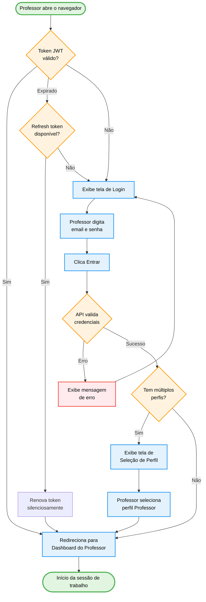

import { IconCheck, IconX, IconRefresh, IconCircleGreen, IconCircleRed, IconCircleYellow, IconTeacher } from '@site/src/components/MaterialIcon';

# PROF-001: Acesso e Login

:::info Contexto
**Jornada**: Professor
**Prioridade**: Alta
**Complexidade**: Baixa
**Status**: <IconCheck /> Documentado (AS-IS Baseline)
:::

## 1. Visão Geral

### Problema

Professores precisam acessar a plataforma de forma rápida e segura. O processo de autenticação deve ser simples o suficiente para não criar fricção no início da aula, mas robusto para proteger dados de alunos conforme LGPD.

**Dores principais**:
- Login demorado quando o professor está na sala de aula
- Esquecimento de senha frequente (política de rotação periódica)
- Falta de SSO com sistemas municipais/estaduais já existentes
- Re-autenticação forçada após expiração de sessão durante o uso

### Solução AS-IS

Sistema de autenticação com:
- **Login por email/senha** com validação de credenciais via Azure AD B2C
- **Sessão persistente** com token JWT de longa duração (configurável por rede)
- **Recuperação de senha** via link no email cadastrado
- **Seleção de perfil** quando um mesmo usuário tem múltiplos papéis (ex: professor e coordenador)
- **Redirecionamento automático** para o dashboard do professor após autenticação bem-sucedida

## 2. Rotas e Navegação

```typescript
// src/router/auth-routes.js
export default [
  {
    path: '/login',
    name: 'auth-login',
    component: () => import('@/views/pages/auth/Login.vue'),
    meta: { layout: 'full', redirectIfLoggedIn: true }
  },
  {
    path: '/forgot-password',
    name: 'auth-forgot-password',
    component: () => import('@/views/pages/auth/ForgotPassword.vue'),
    meta: { layout: 'full', redirectIfLoggedIn: true }
  },
  {
    path: '/reset-password',
    name: 'auth-reset-password',
    component: () => import('@/views/pages/auth/ResetPassword.vue'),
    meta: { layout: 'full' }
  },
  {
    path: '/select-profile',
    name: 'auth-select-profile',
    component: () => import('@/views/pages/auth/SelectProfile.vue'),
    meta: { layout: 'full', requiresAuth: true }
  }
]
```

**Fluxo de navegação**:
1. Usuário não autenticado é redirecionado para `/login`
2. Submete email + senha → validação JWT
3. Se múltiplos perfis → `/select-profile`
4. Redirecionamento para `/professor/dashboard`
5. Guard global verifica token em cada navegação

## 3. Arquitetura de Componentes

### Estrutura de Pastas

```
src/views/pages/auth/
├── Login.vue              # Formulário de login
├── ForgotPassword.vue     # Solicitar reset de senha
├── ResetPassword.vue      # Definir nova senha (via token de email)
├── SelectProfile.vue      # Seleção de perfil (multi-role)
└── components/
    ├── LoginForm.vue      # Campo email + senha + botão
    ├── SocialLogin.vue    # Botões SSO (Azure AD, Google)
    └── ProfileCard.vue    # Card de perfil para seleção
```

### Componentes Principais

**Login.vue**:
```vue
<template>
  <div class="auth-wrapper">
    <b-card class="login-card">
      <LoginForm @submit="handleLogin" :loading="isLoading" />
      <SocialLogin v-if="ssoEnabled" @sso="handleSSO" />
      <router-link to="/forgot-password">Esqueci minha senha</router-link>
    </b-card>
  </div>
</template>
```

**SelectProfile.vue**:
```vue
<template>
  <div class="profile-selection">
    <h3>Selecione seu perfil</h3>
    <ProfileCard
      v-for="profile in availableProfiles"
      :key="profile.role"
      :profile="profile"
      @select="selectProfile(profile)"
    />
  </div>
</template>
```

## 4. Módulo Vuex

```javascript
// src/store/modules/auth.js
const state = {
  token: null,
  refreshToken: null,
  user: null,
  currentProfile: null,
  availableProfiles: []
}

const mutations = {
  SET_TOKEN(state, { token, refreshToken }) {
    state.token = token
    state.refreshToken = refreshToken
  },
  SET_USER(state, user) {
    state.user = user
    state.availableProfiles = user.roles || []
  },
  SET_PROFILE(state, profile) {
    state.currentProfile = profile
  },
  LOGOUT(state) {
    state.token = null
    state.refreshToken = null
    state.user = null
    state.currentProfile = null
  }
}

const actions = {
  async login({ commit }, { email, password }) {
    const { token, refreshToken, user } = await AuthService.login(email, password)
    commit('SET_TOKEN', { token, refreshToken })
    commit('SET_USER', user)
    setAuthHeader(token)
  },
  async selectProfile({ commit }, profile) {
    commit('SET_PROFILE', profile)
    await AuthService.setActiveRole(profile.role)
  },
  async logout({ commit }) {
    await AuthService.logout()
    commit('LOGOUT')
    removeAuthHeader()
  },
  async refreshSession({ state, commit }) {
    const { token } = await AuthService.refresh(state.refreshToken)
    commit('SET_TOKEN', { token, refreshToken: state.refreshToken })
    setAuthHeader(token)
  }
}
```

## 5. Serviço de Autenticação

```javascript
// src/services/authService.js
const AuthService = {
  async login(email, password) {
    const response = await api.post('/auth/login', { email, password })
    return response.data // { token, refreshToken, user }
  },

  async logout() {
    await api.post('/auth/logout')
    localStorage.removeItem('accessToken')
    localStorage.removeItem('refreshToken')
  },

  async refresh(refreshToken) {
    const response = await api.post('/auth/refresh', { refreshToken })
    return response.data
  },

  async forgotPassword(email) {
    await api.post('/auth/forgot-password', { email })
  },

  async resetPassword(token, newPassword) {
    await api.post('/auth/reset-password', { token, newPassword })
  },

  async setActiveRole(role) {
    await api.post('/auth/set-role', { role })
  }
}
```

## 6. Fluxo de Usuário (AS-IS)



## 7. Estados da Interface

### Estado 1: Tela de Login

```typescript
interface LoginState {
  email: string           // 'professor@escola.edu.br'
  password: string        // ''
  isLoading: boolean      // false
  errorMessage: string    // ''
  ssoEnabled: boolean     // true (se rede configurou Azure AD)
}
```

**UI**: Formulário centralizado, logo Educacross, campos email e senha, botão "Entrar" (roxo #7367F0), link "Esqueci minha senha", botão SSO opcional.

### Estado 2: Carregando

```typescript
interface LoadingState {
  isLoading: true
  buttonText: 'Entrando...'
}
```

**UI**: Botão desabilitado com spinner, campos bloqueados.

### Estado 3: Erro de Credenciais

```typescript
interface ErrorState {
  errorMessage: 'E-mail ou senha incorretos. Tente novamente.'
  attempts: number        // Incrementa a cada erro
  isBlocked: boolean      // true após 5 tentativas
}
```

**UI**: Alert vermelho abaixo do formulário. Após 5 tentativas: mensagem "Conta temporariamente bloqueada. Verifique seu e-mail."

### Estado 4: Seleção de Perfil

```typescript
interface ProfileSelectionState {
  availableProfiles: Array<{
    role: 'Professor' | 'Admin' | 'Coordinator'
    schoolName: string
    lastAccess: Date
  }>
}
```

**UI**: Cards empilhados, cada um com ícone do perfil, nome da escola e "Último acesso". Botão "Entrar como [Perfil]".

## 8. API Endpoints

### POST `/auth/login`
```json
// Request
{ "email": "professor@escola.edu.br", "password": "***" }

// Response 200
{
  "token": "eyJhbGci...",
  "refreshToken": "dGhpcyBp...",
  "expiresIn": 86400,
  "user": {
    "id": "usr_123",
    "name": "Ana Lima",
    "email": "professor@escola.edu.br",
    "roles": [{ "role": "Professor", "schoolId": "sch_456", "schoolName": "EM João XXIII" }]
  }
}

// Response 401
{ "error": "INVALID_CREDENTIALS", "message": "E-mail ou senha incorretos" }

// Response 423
{ "error": "ACCOUNT_LOCKED", "message": "Conta bloqueada", "unlockAt": "2026-02-25T10:30:00Z" }
```

### POST `/auth/refresh`
```json
// Request
{ "refreshToken": "dGhpcyBp..." }

// Response 200
{ "token": "eyJhbGci_new...", "expiresIn": 86400 }
```

### POST `/auth/forgot-password`
```json
// Request
{ "email": "professor@escola.edu.br" }

// Response 200
{ "message": "Se o e-mail existir, um link de recuperação foi enviado." }
```

## 9. Melhorias TO-BE

| Problema | Solução Proposta | Prioridade |
|----------|-----------------|------------|
| Re-autenticação interrompe aula | Token de sessão de 8h + refresh automático | <IconCircleRed size={14} /> Alta |
| Sem SSO municipal | Integração com sistemas das secretarias (SAML 2.0) | <IconCircleYellow size={14} /> Média |
| Recuperação de senha lenta | Reset via SMS (além de email) | <IconCircleYellow size={14} /> Média |
| Sem biometria em mobile | Login biométrico via WebAuthn | <IconCircleYellow size={14} /> Média |
| Seleção de perfil confusa | Lembrar último perfil escolhido | <IconCircleGreen size={14} /> Baixa |

## 10. Testes Recomendados

```javascript
// Unit: authService
describe('AuthService.login', () => {
  it('retorna token e usuário em credenciais válidas')
  it('lança INVALID_CREDENTIALS em senha errada')
  it('lança ACCOUNT_LOCKED após 5 tentativas')
})

// Unit: Vuex auth module
describe('auth/login action', () => {
  it('armazena token no estado após login bem-sucedido')
  it('redireciona para seleção de perfil se múltiplos papéis')
  it('redireciona para dashboard se perfil único')
})

// Integration: Login.vue
describe('Tela de Login', () => {
  it('exibe mensagem de erro em credenciais inválidas')
  it('desabilita botão durante carregamento')
  it('redireciona para /forgot-password ao clicar no link')
})
```

## 11. Métricas de Sucesso

| Métrica | Atual | Meta |
|---------|-------|------|
| Taxa de login bem-sucedido na primeira tentativa | ~80% | >90% |
| Tempo médio de autenticação | ~3s | <1.5s |
| Solicitações de reset de senha por mês | ~15% usuários | <5% usuários |
| Taxa de sessões encerradas por timeout | ~20% | <5% |

---

**Última Atualização**: Fevereiro 2026
**Referências**: [Persona: Professor](../../personas/professor) · [Catálogo de Jornadas](../index)
