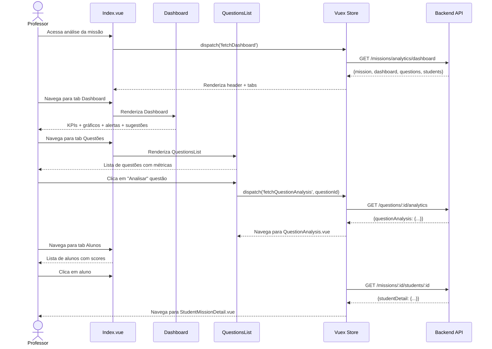
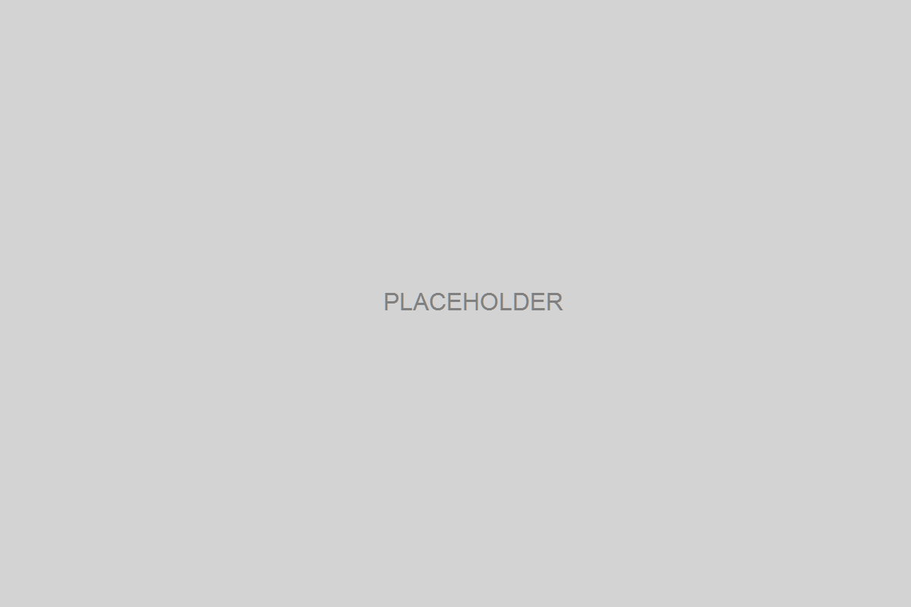

# PROF-007: Mission Analytics (Análise Detalhada de Missões)

:::info Contexto
**Jornada**: Professor  
**Prioridade**: Baixa  
**Complexidade**: Média  
**Status**: ✅ Documentado (AS-IS Baseline)
:::

## 1. Visão Geral

### Problema

Professores precisam analisar o desempenho detalhado dos alunos em missões específicas para entender padrões de erro, identificar questões problemáticas, ajustar estratégias pedagógicas e fornecer feedback personalizado, mas não possuem ferramentas que consolidem dados de respostas, tempo de execução, tentativas e evolução em um dashboard acionável por missão.

**Dores principais**:
- Dados de desempenho individual por missão dispersos e difíceis de acessar
- Impossibilidade de identificar questões com alta taxa de erro
- Falta de visibilidade sobre padrões de erro comuns entre alunos
- Dificuldade para entender tempo médio gasto por questão
- Ausência de análise de tentativas (quantas vezes aluno tentou antes de acertar)
- Impossibilidade de comparar desempenho entre turmas na mesma missão
- Falta de insights para ajustar missões futuras ou reabilitar missões com baixo desempenho
- Feedback manual e demorado para cada aluno individualmente

### Solução AS-IS

Sistema de análise detalhada de missões com:
- **Dashboard de Missão** com KPIs de desempenho agregado
- **Análise por Questão** (taxa de acerto, erros comuns, tempo médio)
- **Visão de Aluno** (respostas individuais, tentativas, tempo gasto)
- **Comparativo entre Turmas** (benchmarking de desempenho)
- **Análise Temporal** (evolução de notas ao longo do tempo)
- **Detecção de Padrões de Erro** (questões correlacionadas com dificuldade)
- **Sugestões de Feedback** automáticas baseadas em desempenho
- **Exportação de Relatórios** por missão para documentação

## 2. Rotas e Navegação

```typescript
// src/router/professor-routes/mission-analytics-routes.js
export default [
  {
    path: '/teacher/missions/:missionId/analytics',
    name: 'teacher-mission-analytics',
    component: () => import('@/views/pages/teacher-context/missions/analytics/Index.vue'),
    meta: {
      resource: 'MissionAnalytics',
      action: 'read',
      breadcrumb: [
        { text: 'Início', to: '/' },
        { text: 'Missões', to: '/teacher/missions' },
        { text: 'Análise Detalhada', active: true }
      ]
    }
  },
  {
    path: '/teacher/missions/:missionId/analytics/question/:questionId',
    name: 'teacher-question-analysis',
    component: () => import('@/views/pages/teacher-context/missions/analytics/QuestionAnalysis.vue'),
    meta: {
      resource: 'MissionAnalytics',
      action: 'read'
    }
  },
  {
    path: '/teacher/missions/:missionId/analytics/student/:studentId',
    name: 'teacher-student-mission-detail',
    component: () => import('@/views/pages/teacher-context/missions/analytics/StudentMissionDetail.vue'),
    meta: {
      resource: 'MissionAnalytics',
      action: 'read'
    }
  }
]
```

**Fluxo de navegação**:
1. Professor acessa lista de missões → Clica em "Ver Análise" em uma missão concluída
2. Visualiza dashboard com métricas gerais (média da turma, taxa de conclusão, tempo médio)
3. Navega entre abas: Dashboard, Questões, Alunos, Comparativo, Temporal
4. Clica em questão específica → Abre análise de questão (taxa de acerto, erros comuns, distribuição)
5. Clica em aluno → Abre detalhes individuais (respostas, tempo, tentativas, comparação com turma)
6. Identifica padrões de erro → Recebe sugestões de feedback e intervenção
7. Exporta relatório detalhado da missão para documentação pedagógica

## 3. Arquitetura de Componentes

### Estrutura de Pastas

```
src/views/pages/teacher-context/missions/analytics/
├── Index.vue                      # Orquestrador principal
├── Dashboard.vue                  # Dashboard com KPIs de desempenho
├── Filters.vue                    # Filtros (turma, status, período)
├── QuestionsList.vue              # Lista de questões com métricas
├── StudentsList.vue               # Lista de alunos com desempenho
├── Comparative.vue                # Comparativo entre turmas
├── Temporal.vue                   # Evolução temporal de notas
├── QuestionAnalysis.vue           # Análise detalhada de uma questão
├── StudentMissionDetail.vue       # Detalhes do aluno na missão
├── useMissionAnalytics.js        # Composable de domínio
├── components/
│   ├── PerformanceKPI.vue        # Card de KPI de desempenho
│   ├── QuestionCard.vue          # Card de questão com métricas
│   ├── StudentPerformanceCard.vue # Card de aluno com nota/status
│   ├── AnswerReview.vue          # Revisão de resposta (correta/incorreta)
│   ├── ErrorPatternAlert.vue     # Alerta de padrão de erro identificado
│   ├── FeedbackSuggestion.vue    # Sugestão de feedback automática
│   ├── AttemptTimeline.vue       # Timeline de tentativas do aluno
│   └── ExportAnalyticsModal.vue  # Modal de exportação de relatório
└── charts/
    ├── ScoreDistribution.vue     # Histograma de distribuição de notas
    ├── QuestionPerformanceBar.vue # Barras de performance por questão
    ├── TimeSpentChart.vue        # Gráfico de tempo gasto
    └── TrendLine.vue             # Linha de evolução temporal
```

### Responsabilidades dos Componentes

#### Index.vue (Orquestrador)
```vue
<template>
  <section>
    <!-- Header com Info da Missão -->
    <b-card class="mb-3">
      <div class="d-flex align-items-center justify-content-between">
        <div class="d-flex align-items-center">
          <b-avatar
            :src="mission.thumbnailUrl"
            size="64"
            variant="light-primary"
            class="mr-2"
          />
          <div>
            <h3 class="mb-0">{{ mission.title }}</h3>
            <p class="text-muted mb-0">
              {{ mission.questionsCount }} questões • {{ mission.estimatedTime }}
            </p>
          </div>
        </div>
        <b-button variant="outline-primary" @click="exportReport">
          <span class="material-symbols-outlined">download</span>
          Exportar Relatório
        </b-button>
      </div>
    </b-card>

    <!-- Filtros -->
    <Filters />

    <!-- Tabs -->
    <b-tabs content-class="mt-3" pills>
      <b-tab title="Dashboard" active>
        <Dashboard />
      </b-tab>
      
      <b-tab title="Questões" :badge="questionsCount">
        <QuestionsList />
      </b-tab>
      
      <b-tab title="Alunos" :badge="studentsCount">
        <StudentsList />
      </b-tab>
      
      <b-tab title="Comparativo entre Turmas">
        <Comparative />
      </b-tab>
      
      <b-tab title="Evolução Temporal">
        <Temporal />
      </b-tab>
    </b-tabs>
  </section>
</template>

<script>
import Filters from './Filters.vue'
import Dashboard from './Dashboard.vue'
import QuestionsList from './QuestionsList.vue'
import StudentsList from './StudentsList.vue'
import Comparative from './Comparative.vue'
import Temporal from './Temporal.vue'
import store from '@/store'
import router from '@/router'
import moduleMissionAnalytics from '@/store/pageModules/missions/module-mission-analytics.js'
import { defineComponent, computed, onMounted, onUnmounted } from '@vue/composition-api'
import useMissionAnalytics from './useMissionAnalytics.js'

export default defineComponent({
  name: 'MissionAnalyticsIndex',
  components: {
    Filters, Dashboard, QuestionsList, 
    StudentsList, Comparative, Temporal
  },
  setup() {
    store.registerModule('missionAnalytics', moduleMissionAnalytics)

    const missionId = computed(() => parseInt(router.currentRoute.params.missionId))
    const { mission, questionsCount, studentsCount, exportReport } = useMissionAnalytics()

    onMounted(() => {
      store.commit('missionAnalytics/setParams', { MissionId: missionId.value })
      store.dispatch('missionAnalytics/fetchDashboard')
    })

    onUnmounted(() => {
      store.commit('missionAnalytics/reset')
      store.unregisterModule('missionAnalytics')
    })

    return { mission, questionsCount, studentsCount, exportReport }
  }
})
</script>
```

#### Dashboard.vue (Dashboard de Desempenho)
```vue
<template>
  <div>
    <!-- KPIs Principais -->
    <b-row>
      <b-col cols="12" md="3">
        <PerformanceKPI
          title="Média da Turma"
          :value="dashboard.averageScore"
          :trend="dashboard.scoreTrend"
          icon="grade"
          variant="primary"
          suffix="/10"
        />
      </b-col>
      <b-col cols="12" md="3">
        <PerformanceKPI
          title="Taxa de Conclusão"
          :value="dashboard.completionRate"
          icon="check_circle"
          variant="success"
          suffix="%"
        />
      </b-col>
      <b-col cols="12" md="3">
        <PerformanceKPI
          title="Tempo Médio"
          :value="dashboard.averageTimeMinutes"
          icon="schedule"
          variant="info"
          suffix="min"
        />
      </b-col>
      <b-col cols="12" md="3">
        <PerformanceKPI
          title="Taxa de Acerto"
          :value="dashboard.correctAnswersRate"
          icon="check"
          variant="warning"
          suffix="%"
        />
      </b-col>
    </b-row>

    <!-- Alertas de Padrão de Erro -->
    <ErrorPatternAlert
      v-for="pattern in errorPatterns"
      :key="pattern.id"
      :pattern="pattern"
      class="mt-3"
    />

    <!-- Gráficos -->
    <b-row class="mt-3">
      <b-col cols="12" md="6">
        <b-card>
          <h5>Distribuição de Notas</h5>
          <ScoreDistribution :data="dashboard.scoreDistribution" />
        </b-card>
      </b-col>
      <b-col cols="12" md="6">
        <b-card>
          <h5>Performance por Questão</h5>
          <QuestionPerformanceBar :data="dashboard.questionPerformance" />
        </b-card>
      </b-col>
    </b-row>

    <!-- Resumo de Dificuldades -->
    <b-card class="mt-3">
      <h5>Questões com Maior Dificuldade</h5>
      <b-list-group>
        <b-list-group-item
          v-for="question in difficultQuestions"
          :key="question.id"
          class="d-flex justify-content-between align-items-center"
        >
          <div>
            <strong>Questão {{ question.number }}</strong>
            <p class="mb-0 text-muted">{{ question.statement.substring(0, 80) }}...</p>
          </div>
          <div class="text-right">
            <b-badge variant="danger">{{ question.correctRate }}% acerto</b-badge>
            <p class="mb-0 text-muted small">{{ question.attemptsCount }} alunos</p>
          </div>
        </b-list-group-item>
      </b-list-group>
    </b-card>

    <!-- Sugestões de Feedback -->
    <b-card class="mt-3">
      <h5>Sugestões de Feedback Automático</h5>
      <FeedbackSuggestion
        v-for="suggestion in feedbackSuggestions"
        :key="suggestion.id"
        :suggestion="suggestion"
      />
    </b-card>
  </div>
</template>

<script>
import PerformanceKPI from './components/PerformanceKPI.vue'
import ErrorPatternAlert from './components/ErrorPatternAlert.vue'
import ScoreDistribution from './charts/ScoreDistribution.vue'
import QuestionPerformanceBar from './charts/QuestionPerformanceBar.vue'
import FeedbackSuggestion from './components/FeedbackSuggestion.vue'
import useMissionAnalytics from './useMissionAnalytics.js'

export default {
  components: {
    PerformanceKPI,
    ErrorPatternAlert,
    ScoreDistribution,
    QuestionPerformanceBar,
    FeedbackSuggestion
  },
  setup() {
    const {
      dashboard,
      errorPatterns,
      difficultQuestions,
      feedbackSuggestions
    } = useMissionAnalytics()

    return {
      dashboard,
      errorPatterns,
      difficultQuestions,
      feedbackSuggestions
    }
  }
}
</script>
```

#### QuestionsList.vue (Lista de Questões)
```vue
<template>
  <div>
    <b-row>
      <b-col
        v-for="question in questions"
        :key="question.id"
        cols="12"
        md="6"
        class="mb-3"
      >
        <QuestionCard
          :question="question"
          @click="viewQuestionAnalysis(question.id)"
        />
      </b-col>
    </b-row>

    <!-- Tabela Detalhada (opcional) -->
    <b-card class="mt-3">
      <h5>Análise Detalhada por Questão</h5>
      <ListTableLocalSorting
        :data-table="questions"
        :table-columns="questionColumns"
        :per-page-default="10"
      >
        <template #cell(correctRate)="{ item }">
          <b-progress
            :value="item.correctRate"
            :variant="getCorrectRateVariant(item.correctRate)"
            show-value
            height="24px"
          />
        </template>

        <template #cell(avgTime)="{ item }">
          <span>{{ formatTime(item.avgTimeSeconds) }}</span>
        </template>

        <template #cell(actions)="{ item }">
          <b-button
            size="sm"
            variant="outline-primary"
            @click="viewQuestionAnalysis(item.id)"
          >
            <span class="material-symbols-outlined">analytics</span>
            Analisar
          </b-button>
        </template>
      </ListTableLocalSorting>
    </b-card>
  </div>
</template>

<script>
import QuestionCard from './components/QuestionCard.vue'
import ListTableLocalSorting from '@/components/table/ListTableLocalSorting.vue'
import useMissionAnalytics from './useMissionAnalytics.js'
import router from '@/router'

export default {
  components: { QuestionCard, ListTableLocalSorting },
  setup() {
    const { questions } = useMissionAnalytics()

    const questionColumns = [
      { key: 'number', label: '#', sortable: true },
      { key: 'statement', label: 'Questão', sortable: true },
      { key: 'correctRate', label: 'Taxa de Acerto', sortable: true },
      { key: 'avgTime', label: 'Tempo Médio', sortable: true },
      { key: 'attemptsCount', label: 'Tentativas', sortable: true },
      { key: 'actions', label: 'Ações' }
    ]

    const viewQuestionAnalysis = (questionId) => {
      router.push({
        name: 'teacher-question-analysis',
        params: {
          missionId: router.currentRoute.params.missionId,
          questionId
        }
      })
    }

    const getCorrectRateVariant = (rate) => {
      if (rate >= 80) return 'success'
      if (rate >= 60) return 'warning'
      return 'danger'
    }

    const formatTime = (seconds) => {
      const mins = Math.floor(seconds / 60)
      const secs = seconds % 60
      return `${mins}min ${secs}s`
    }

    return {
      questions,
      questionColumns,
      viewQuestionAnalysis,
      getCorrectRateVariant,
      formatTime
    }
  }
}
</script>
```

## 4. Módulo Vuex

```javascript
// src/store/pageModules/missions/module-mission-analytics.js
import {
  getMissionAnalyticsDashboard,
  getQuestionAnalytics,
  getStudentMissionDetails,
  getComparativeAnalytics,
  getTemporalAnalytics,
  exportMissionReport
} from '@/services/teacher-context/MissionAnalyticsService'

export default {
  namespaced: true,
  
  state: {
    mission: null,
    dashboard: null,
    questions: [],
    students: [],
    comparativeData: null,
    temporalData: null,
    currentQuestionAnalysis: null,
    currentStudentDetail: null,
    loading: false,
    params: {
      MissionId: null,
      ClassId: null,
      Status: 'completed', // 'all' | 'completed' | 'in_progress' | 'not_started'
      StartDate: null,
      EndDate: null
    }
  },

  mutations: {
    mission(state, payload) {
      state.mission = payload
    },
    dashboard(state, payload) {
      state.dashboard = payload
    },
    questions(state, payload) {
      state.questions = payload
    },
    students(state, payload) {
      state.students = payload
    },
    comparativeData(state, payload) {
      state.comparativeData = payload
    },
    temporalData(state, payload) {
      state.temporalData = payload
    },
    currentQuestionAnalysis(state, payload) {
      state.currentQuestionAnalysis = payload
    },
    currentStudentDetail(state, payload) {
      state.currentStudentDetail = payload
    },
    loading(state, payload) {
      state.loading = payload
    },
    setParams(state, payload) {
      state.params = { ...state.params, ...payload }
    },
    reset(state) {
      state.mission = null
      state.dashboard = null
      state.questions = []
      state.students = []
      state.comparativeData = null
      state.temporalData = null
      state.currentQuestionAnalysis = null
      state.currentStudentDetail = null
      state.loading = false
      state.params = {
        MissionId: null,
        ClassId: null,
        Status: 'completed',
        StartDate: null,
        EndDate: null
      }
    }
  },

  getters: {
    mission: state => state.mission,
    dashboard: state => state.dashboard,
    questions: state => state.questions,
    students: state => state.students,
    comparativeData: state => state.comparativeData,
    temporalData: state => state.temporalData,
    currentQuestionAnalysis: state => state.currentQuestionAnalysis,
    currentStudentDetail: state => state.currentStudentDetail,
    loading: state => state.loading,
    params: state => state.params,

    // Computed: Número de questões
    questionsCount: state => state.questions.length,

    // Computed: Número de alunos
    studentsCount: state => state.students.length,

    // Computed: Padrões de erro detectados
    errorPatterns: state => {
      if (!state.questions) return []
      return state.questions
        .filter(q => q.correctRate < 50 && q.attemptsCount >= 5)
        .map(q => ({
          id: q.id,
          questionNumber: q.number,
          statement: q.statement,
          correctRate: q.correctRate,
          commonError: q.mostCommonError,
          affectedStudents: q.attemptsCount,
          severity: q.correctRate < 30 ? 'high' : 'medium'
        }))
    },

    // Computed: Questões difíceis (taxa acerto < 60%)
    difficultQuestions: state => {
      if (!state.questions) return []
      return state.questions
        .filter(q => q.correctRate < 60)
        .sort((a, b) => a.correctRate - b.correctRate)
        .slice(0, 5)
    },

    // Computed: Sugestões de feedback
    feedbackSuggestions: (state, getters) => {
      const suggestions = []
      
      // Baixa taxa de conclusão
      if (state.dashboard && state.dashboard.completionRate < 70) {
        suggestions.push({
          id: 'completion',
          type: 'warning',
          title: 'Baixa Taxa de Conclusão',
          description: `Apenas ${state.dashboard.completionRate}% dos alunos concluíram. Considere revisar prazo ou complexidade.`,
          action: 'Estender prazo ou simplificar questões iniciais'
        })
      }

      // Questões muito difíceis
      if (getters.difficultQuestions.length > 0) {
        suggestions.push({
          id: 'difficult',
          type: 'danger',
          title: 'Questões com Alta Dificuldade',
          description: `${getters.difficultQuestions.length} questões têm taxa de acerto < 60%.`,
          action: 'Revisar enunciados, fornecer dicas ou criar atividade de reforço'
        })
      }

      // Tempo muito alto
      if (state.dashboard && state.dashboard.averageTimeMinutes > 45) {
        suggestions.push({
          id: 'time',
          type: 'info',
          title: 'Tempo Médio Elevado',
          description: `Alunos levam em média ${state.dashboard.averageTimeMinutes}min para completar.`,
          action: 'Considerar dividir missão em partes ou reduzir número de questões'
        })
      }

      return suggestions
    },

    // Computed: Alunos com baixo desempenho (menor que 6.0)
    studentsAtRisk: state => {
      if (!state.students) return []
      return state.students.filter(s => s.score < 6.0)
    }
  },

  actions: {
    async fetchDashboard({ commit, state }) {
      commit('loading', true)
      try {
        const response = await getMissionAnalyticsDashboard(state.params)
        commit('mission', response.data.mission)
        commit('dashboard', response.data.dashboard)
        commit('questions', response.data.questions)
        commit('students', response.data.students)
      } catch (error) {
        console.error('Erro ao buscar dashboard:', error)
      } finally {
        commit('loading', false)
      }
    },

    async fetchQuestionAnalysis({ commit }, questionId) {
      commit('loading', true)
      try {
        const response = await getQuestionAnalytics(questionId)
        commit('currentQuestionAnalysis', response.data)
      } catch (error) {
        console.error('Erro ao buscar análise de questão:', error)
      } finally {
        commit('loading', false)
      }
    },

    async fetchStudentDetail({ commit }, { missionId, studentId }) {
      commit('loading', true)
      try {
        const response = await getStudentMissionDetails(missionId, studentId)
        commit('currentStudentDetail', response.data)
      } catch (error) {
        console.error('Erro ao buscar detalhes do aluno:', error)
      } finally {
        commit('loading', false)
      }
    },

    async fetchComparativeData({ commit, state }) {
      commit('loading', true)
      try {
        const response = await getComparativeAnalytics(state.params.MissionId)
        commit('comparativeData', response.data)
      } catch (error) {
        console.error('Erro ao buscar dados comparativos:', error)
      } finally {
        commit('loading', false)
      }
    },

    async fetchTemporalData({ commit, state }) {
      commit('loading', true)
      try {
        const response = await getTemporalAnalytics(state.params)
        commit('temporalData', response.data)
      } catch (error) {
        console.error('Erro ao buscar dados temporais:', error)
      } finally {
        commit('loading', false)
      }
    }
  }
}
```

## 5. Services (API Layer)

```javascript
// src/services/teacher-context/MissionAnalyticsService.js
import { axiosIns } from '@axios'

/**
 * Busca dashboard de análise de missão
 * @param {Object} params - Parâmetros de filtro
 * @param {number} params.MissionId - ID da missão
 * @param {number} [params.ClassId] - ID da turma
 * @param {string} [params.Status] - Status de conclusão
 * @returns {Promise<{data: Object}>}
 */
export const getMissionAnalyticsDashboard = (params) => {
  return axiosIns.get('/teacher/missions/analytics/dashboard', { params })
}

/**
 * Busca análise detalhada de uma questão
 * @param {number} questionId - ID da questão
 * @returns {Promise<{data: Object}>}
 */
export const getQuestionAnalytics = (questionId) => {
  return axiosIns.get(`/teacher/missions/questions/${questionId}/analytics`)
}

/**
 * Busca detalhes de um aluno em uma missão
 * @param {number} missionId - ID da missão
 * @param {number} studentId - ID do aluno
 * @returns {Promise<{data: Object}>}
 */
export const getStudentMissionDetails = (missionId, studentId) => {
  return axiosIns.get(`/teacher/missions/${missionId}/students/${studentId}`)
}

/**
 * Busca dados comparativos entre turmas
 * @param {number} missionId - ID da missão
 * @returns {Promise<{data: Object}>}
 */
export const getComparativeAnalytics = (missionId) => {
  return axiosIns.get(`/teacher/missions/${missionId}/analytics/comparative`)
}

/**
 * Busca análise temporal de desempenho
 * @param {Object} params - Parâmetros de filtro
 * @returns {Promise<{data: Object}>}
 */
export const getTemporalAnalytics = (params) => {
  return axiosIns.get('/teacher/missions/analytics/temporal', { params })
}

/**
 * Exporta relatório de análise de missão
 * @param {Object} options - Opções de exportação
 * @param {number} options.missionId - ID da missão
 * @param {string} options.format - Formato (pdf|xlsx)
 * @param {boolean} options.includeStudentDetails - Incluir detalhes por aluno
 * @returns {Promise<Blob>}
 */
export const exportMissionReport = (options) => {
  return axiosIns.post(
    '/teacher/missions/analytics/export',
    options,
    { responseType: 'blob' }
  )
}
```

## 6. Composable de Domínio

```javascript
// src/views/pages/teacher-context/missions/analytics/useMissionAnalytics.js
import store from '@/store'
import useFilters from '@/store/filters/useFilters'
import { computed } from '@vue/composition-api'
import { exportMissionReport } from '@/services/teacher-context/MissionAnalyticsService'

const moduleName = 'missionAnalytics'
const { classe } = useFilters()

/**
 * Composable para gerenciar análise de missões
 * @returns {Object} Interface de gerenciamento de analytics
 */
export default function useMissionAnalytics() {
  // State
  const mission = computed({
    get: () => store.getters[`${moduleName}/mission`],
    set: val => store.commit(`${moduleName}/mission`, val)
  })

  const dashboard = computed({
    get: () => store.getters[`${moduleName}/dashboard`],
    set: val => store.commit(`${moduleName}/dashboard`, val)
  })

  const questions = computed({
    get: () => store.getters[`${moduleName}/questions`],
    set: val => store.commit(`${moduleName}/questions`, val)
  })

  const students = computed({
    get: () => store.getters[`${moduleName}/students`],
    set: val => store.commit(`${moduleName}/students`, val)
  })

  const comparativeData = computed({
    get: () => store.getters[`${moduleName}/comparativeData`],
    set: val => store.commit(`${moduleName}/comparativeData`, val)
  })

  const temporalData = computed({
    get: () => store.getters[`${moduleName}/temporalData`],
    set: val => store.commit(`${moduleName}/temporalData`, val)
  })

  const loading = computed({
    get: () => store.getters[`${moduleName}/loading`],
    set: val => store.commit(`${moduleName}/loading`, val)
  })

  // Computed getters
  const questionsCount = computed(
    () => store.getters[`${moduleName}/questionsCount`]
  )

  const studentsCount = computed(
    () => store.getters[`${moduleName}/studentsCount`]
  )

  const errorPatterns = computed(
    () => store.getters[`${moduleName}/errorPatterns`]
  )

  const difficultQuestions = computed(
    () => store.getters[`${moduleName}/difficultQuestions`]
  )

  const feedbackSuggestions = computed(
    () => store.getters[`${moduleName}/feedbackSuggestions`]
  )

  const studentsAtRisk = computed(
    () => store.getters[`${moduleName}/studentsAtRisk`]
  )

  // Methods
  const fetchDashboard = async () => {
    await store.dispatch(`${moduleName}/fetchDashboard`)
  }

  const fetchQuestionAnalysis = async (questionId) => {
    await store.dispatch(`${moduleName}/fetchQuestionAnalysis`, questionId)
  }

  const fetchStudentDetail = async (missionId, studentId) => {
    await store.dispatch(`${moduleName}/fetchStudentDetail`, {
      missionId,
      studentId
    })
  }

  const fetchComparativeData = async () => {
    await store.dispatch(`${moduleName}/fetchComparativeData`)
  }

  const fetchTemporalData = async () => {
    await store.dispatch(`${moduleName}/fetchTemporalData`)
  }

  const exportReport = async () => {
    try {
      const blob = await exportMissionReport({
        missionId: mission.value.id,
        format: 'pdf',
        includeStudentDetails: true
      })
      
      const url = window.URL.createObjectURL(blob)
      const link = document.createElement('a')
      link.href = url
      link.download = `analise-missao-${mission.value.id}-${new Date().toISOString()}.pdf`
      link.click()
      window.URL.revokeObjectURL(url)
    } catch (error) {
      console.error('Erro ao exportar relatório:', error)
    }
  }

  return {
    moduleName,
    // State
    mission,
    dashboard,
    questions,
    students,
    comparativeData,
    temporalData,
    loading,
    // Computed
    questionsCount,
    studentsCount,
    errorPatterns,
    difficultQuestions,
    feedbackSuggestions,
    studentsAtRisk,
    // Methods
    fetchDashboard,
    fetchQuestionAnalysis,
    fetchStudentDetail,
    fetchComparativeData,
    fetchTemporalData,
    exportReport,
    // Global filters
    classe
  }
}
```

## 7. Fluxo de Usuário



## 8. Estados da Interface

### Estado 1: Dashboard - Visão Geral
```typescript
{
  mission: {
    id: 10,
    title: 'Missão Números Inteiros',
    thumbnailUrl: 'https://...',
    questionsCount: 12,
    estimatedTime: '45min'
  },
  dashboard: {
    averageScore: 7.5,
    scoreTrend: 0.8, // vs tentativa anterior
    completionRate: 82,
    averageTimeMinutes: 38,
    correctAnswersRate: 75,
    scoreDistribution: [
      { range: '0-4', count: 3 },
      { range: '5-6', count: 8 },
      { range: '7-8', count: 15 },
      { range: '9-10', count: 6 }
    ],
    questionPerformance: [
      { questionNumber: 1, correctRate: 92 },
      { questionNumber: 2, correctRate: 68 }
    ]
  }
}
```
**UI**: 4 KPI cards (média, conclusão, tempo, acerto), alertas de padrão de erro, histograma de notas, barras de performance por questão, lista de questões difíceis, sugestões de feedback

### Estado 2: Lista de Questões
```typescript
{
  questions: [
    {
      id: 1,
      number: 1,
      statement: 'Calcule o valor de (-5) + (+8)',
      correctRate: 92,
      avgTimeSeconds: 45,
      attemptsCount: 30,
      mostCommonError: 'Erro de sinal'
    }
  ]
}
```
**UI**: Cards de questões (2 colunas) com métricas + tabela detalhada com progress bars de taxa de acerto

### Estado 3: Análise de Questão Específica
```typescript
{
  currentQuestionAnalysis: {
    question: {
      id: 1,
      number: 2,
      statement: 'Qual o resultado de (-3) × (-4)?',
      correctAnswer: '+12',
      type: 'multiple_choice'
    },
    correctRate: 68,
    totalAttempts: 30,
    answersDistribution: [
      { answer: '+12', count: 20, isCorrect: true },
      { answer: '-12', count: 8, isCorrect: false },
      { answer: '12', count: 2, isCorrect: false }
    ],
    avgTimeSeconds: 52,
    commonErrors: [
      {
        error: 'Multiplicação de sinais negativos',
        count: 8,
        percentage: 26.7
      }
    ],
    studentsWhoGotWrong: [
      {
        id: 123,
        name: 'Ana Silva',
        answer: '-12',
        timeSpent: 65
      }
    ]
  }
}
```
**UI**: Enunciado completo, taxa de acerto grande, distribuição de respostas (pizza), erros comuns (lista), alunos que erraram (tabela)

### Estado 4: Detalhes do Aluno na Missão
```typescript
{
  currentStudentDetail: {
    student: {
      id: 123,
      name: 'Ana Silva',
      avatar: 'https://...'
    },
    score: 6.5,
    status: 'completed',
    completedAt: '2024-02-02T15:30:00Z',
    timeSpentMinutes: 42,
    attempts: [
      {
        attemptNumber: 1,
        score: 5.0,
        completedAt: '2024-02-01T10:00:00Z'
      },
      {
        attemptNumber: 2,
        score: 6.5,
        completedAt: '2024-02-02T15:30:00Z'
      }
    ],
    answers: [
      {
        questionId: 1,
        questionNumber: 1,
        statement: 'Calcule (-5) + (+8)',
        studentAnswer: '+3',
        correctAnswer: '+3',
        isCorrect: true,
        timeSpentSeconds: 30,
        attemptCount: 1
      },
      {
        questionId: 2,
        questionNumber: 2,
        statement: 'Qual o resultado de (-3) × (-4)?',
        studentAnswer: '-12',
        correctAnswer: '+12',
        isCorrect: false,
        timeSpentSeconds: 65,
        attemptCount: 2,
        feedback: 'Lembre-se: negativo × negativo = positivo'
      }
    ]
  }
}
```
**UI**: Header com avatar + nome + nota, timeline de tentativas, tabela de respostas (correta/incorreta) com tempo e feedback

### Estado 5: Comparativo entre Turmas
```typescript
{
  comparativeData: {
    classes: [
      {
        classId: 1,
        className: '7º A',
        averageScore: 7.5,
        completionRate: 82,
        averageTimeMinutes: 38
      },
      {
        classId: 2,
        className: '7º B',
        averageScore: 6.8,
        completionRate: 75,
        averageTimeMinutes: 45
      }
    ]
  }
}
```
**UI**: Tabela ou gráfico de barras agrupadas comparando turmas

### Estado 6: Evolução Temporal
```typescript
{
  temporalData: {
    evolution: [
      {
        date: '2024-01-15',
        averageScore: 6.2,
        completionCount: 15
      },
      {
        date: '2024-02-02',
        averageScore: 7.5,
        completionCount: 28
      }
    ]
  }
}
```
**UI**: Gráfico de linha mostrando evolução de notas ao longo do tempo

## 9. API Endpoints

### GET /teacher/missions/analytics/dashboard
**Request**: `?MissionId=10&ClassId=34&Status=completed`

**Response**:
```json
{
  "mission": {
    "id": 10,
    "title": "Missão Números Inteiros",
    "thumbnailUrl": "https://...",
    "questionsCount": 12,
    "estimatedTime": "45min"
  },
  "dashboard": {
    "averageScore": 7.5,
    "scoreTrend": 0.8,
    "completionRate": 82,
    "averageTimeMinutes": 38,
    "correctAnswersRate": 75,
    "scoreDistribution": [...],
    "questionPerformance": [...]
  },
  "questions": [...],
  "students": [...]
}
```

### GET /teacher/missions/questions/:id/analytics
**Response**:
```json
{
  "question": {...},
  "correctRate": 68,
  "totalAttempts": 30,
  "answersDistribution": [...],
  "avgTimeSeconds": 52,
  "commonErrors": [...],
  "studentsWhoGotWrong": [...]
}
```

### GET /teacher/missions/:missionId/students/:studentId
**Response**:
```json
{
  "student": {...},
  "score": 6.5,
  "status": "completed",
  "completedAt": "2024-02-02T15:30:00Z",
  "timeSpentMinutes": 42,
  "attempts": [...],
  "answers": [...]
}
```

## 10. Screenshots (AS-IS)


*Dashboard com KPIs e gráficos*


*Lista de questões com métricas*


*Análise detalhada de questão*

## 11. Melhorias TO-BE

### Problema 1: Feedback Manual e Demorado
**AS-IS**: Professor precisa escrever feedback individualizado manualmente.

**TO-BE**:
- **IA de Feedback Automático**: Sistema gera feedback personalizado baseado em erro do aluno
- **Banco de Feedbacks**: Biblioteca de feedbacks pré-escritos por tipo de erro
- **Feedback em Vídeo**: Gravar vídeo curto explicando questão, disponibilizar para alunos que erraram

### Problema 2: Impossibilidade de Identificar Conceitos Não Dominados
**AS-IS**: Sistema mostra taxa de acerto por questão, mas não conecta a conceitos.

**TO-BE**:
- **Mapeamento Questão → Conceito**: Cada questão vinculada a conceitos (ex: "multiplicação de negativos")
- **Dashboard de Conceitos**: Mostrar quais conceitos turma não domina
- **Recomendação de Conteúdo**: Sugerir vídeos, exercícios ou materiais para reforço

### Problema 3: Falta de Predição de Desempenho Futuro
**AS-IS**: Sistema mostra apenas desempenho passado.

**TO-BE**:
- **IA Preditiva**: Prever quais alunos têm probabilidade de ir mal em próximas missões
- **Alertas Proativos**: Notificar professor antes do aluno falhar
- **Recomendações de Intervenção**: Sugerir ações específicas para prevenir fracasso

### Problema 4: Análise Limitada de Tempo Gasto
**AS-IS**: Sistema mostra tempo total, mas não analisa padrões.

**TO-BE**:
- **Análise de Padrão de Tempo**: Identificar alunos que gastam muito tempo em questões fáceis (possível dificuldade de leitura)
- **Correlação Tempo × Acerto**: Mostrar se mais tempo resulta em melhor desempenho
- **Alertas de Tempo Excessivo**: Notificar professor se aluno está travado em uma questão

### Problema 5: Falta de Gamificação de Melhoria
**AS-IS**: Aluno vê apenas nota, sem incentivo para melhorar.

**TO-BE**:
- **Badges de Progresso**: "Melhorou +1.5 pontos na retentativa!"
- **Ranking de Evolução**: Mostrar quem mais evoluiu, não apenas quem tirou a melhor nota
- **Desafios de Reforço**: Missões curtas focadas em conceitos não dominados

## 12. Testes Recomendados

### Testes Unitários
```javascript
describe('useMissionAnalytics', () => {
  it('deve calcular padrões de erro corretamente', () => {
    const mockQuestions = [
      { id: 1, correctRate: 35, attemptsCount: 10 },
      { id: 2, correctRate: 85, attemptsCount: 10 }
    ]
    store.commit('missionAnalytics/questions', mockQuestions)
    
    const { errorPatterns } = useMissionAnalytics()
    expect(errorPatterns.value).toHaveLength(1)
    expect(errorPatterns.value[0].severity).toBe('high')
  })
})
```

## 13. Métricas de Sucesso

### KPIs de Uso (AS-IS)
- **Acesso ao Analytics**: 35% dos professores acessam após missão
- **Tempo de Análise**: 15 minutos por missão
- **Taxa de Feedback Individual**: 20% dos alunos recebem feedback personalizado

### Metas TO-BE
- **Acesso**: 85% (+143%)
- **Tempo**: 8 minutos (-47%)
- **Feedback**: 90% (+350% com IA)
- **Melhoria de Desempenho**: +25% em notas de retentativas

---

## Dependências Relacionadas

- **[PROF-002: Education System Missions](./education-system-missions.md)** - Missões habilitadas para análise
- **[PROF-005: Student Records](./student-records.md)** - Diário integrado com analytics
- **[ADMIN-004: Skill Report](../admin/skill-report.md)** - Habilidades mapeadas em questões

---

:::tip Próximos Passos
1. Desenvolver IA de feedback automático por tipo de erro
2. Implementar mapeamento questão → conceito
3. Criar modelo preditivo de desempenho
4. Desenvolver análise de padrão de tempo gasto
5. Implementar gamificação de melhoria (badges, ranking de evolução)
:::
