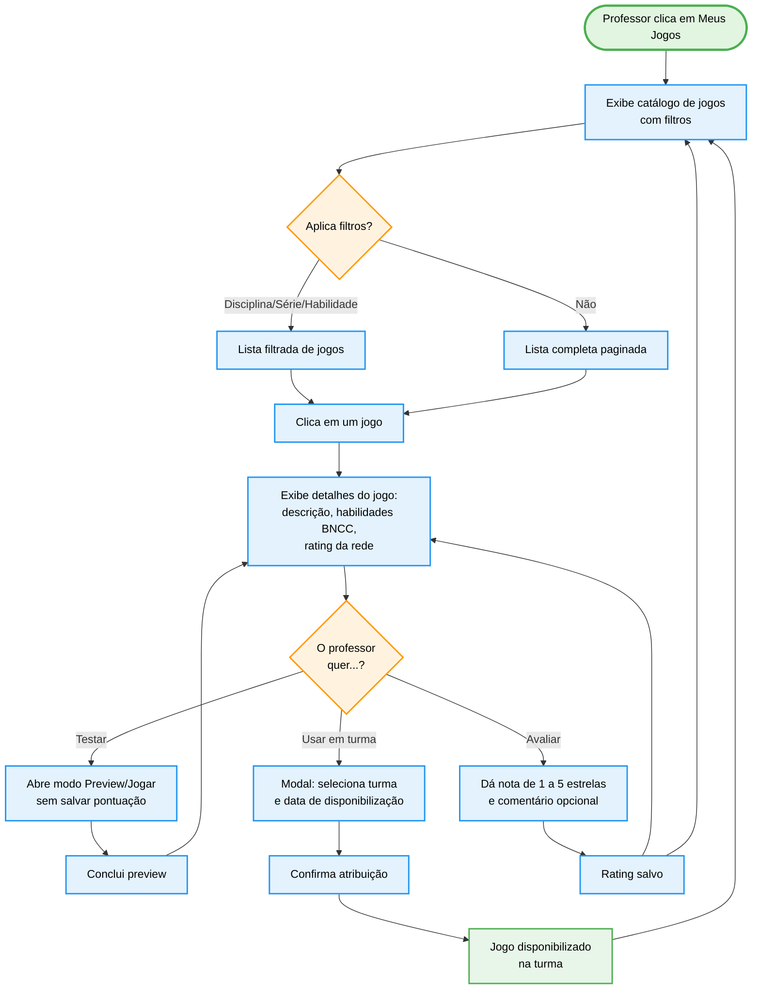

import { IconCheck, IconX, IconCircleGreen, IconCircleRed, IconCircleYellow, IconGame, IconSearch, IconBooks } from '@site/src/components/MaterialIcon';

# PROF-007: Meus Jogos (Avaliar/Jogar)

:::info Contexto
**Jornada**: Professor
**Prioridade**: Baixa
**Complexidade**: Baixa-Média
**Status**: <IconCheck /> Documentado (AS-IS Baseline)
:::

## 1. Visão Geral

### Problema

Professores têm acesso a uma biblioteca de jogos educacionais na plataforma, mas não sabem quais jogos são adequados para cada série, disciplina ou habilidade BNCC. Sem uma forma de previsualizá-los antes de usar em sala de aula, o professor corre o risco de apresentar conteúdo inadequado ou de baixa qualidade.

**Dores principais**:
- Impossibilidade de testar o jogo antes de indicar para os alunos
- Falta de filtros por habilidade BNCC específica
- Ausência de classificação de qualidade por professores da rede
- Não fica claro quais jogos foram usados em quais turmas

### Solução AS-IS

Módulo de biblioteca de jogos com:
- **Catálogo com filtros** por disciplina, série, tipo de jogo e habilidade BNCC
- **Preview/Jogar** o jogo completo no modo professor (sem salvar pontuação de aluno)
- **Avaliação (rating)** do jogo por professores da rede (1–5 estrelas)
- **Histórico de uso** por turma (quais jogos foram apresentados)
- **Indicação para alunos** via missão ou acesso avulso

## 2. Rotas e Navegação

```typescript
// src/router/professor-routes/my-games-routes.js
export default [
  {
    path: '/professor/my-games',
    name: 'professor-my-games',
    component: () => import('@/views/pages/teacher-context/myGames/Index.vue'),
    meta: {
      resource: 'MyGames',
      action: 'read',
      breadcrumb: [
        { text: 'Início', to: '/' },
        { text: 'Meus Jogos', active: true }
      ]
    }
  },
  {
    path: '/professor/my-games/:gameId',
    name: 'professor-game-detail',
    component: () => import('@/views/pages/teacher-context/myGames/GameDetail.vue'),
    meta: { resource: 'MyGames', action: 'read' }
  },
  {
    path: '/professor/my-games/:gameId/play',
    name: 'professor-game-play',
    component: () => import('@/views/pages/teacher-context/myGames/GamePlayer.vue'),
    meta: { resource: 'MyGames', action: 'play', layout: 'full' }
  }
]
```

**Fluxo de navegação**:
1. Professor acessa menu lateral → "Meus Jogos"
2. Visualiza catálogo com filtros rápidos (disciplina, série)
3. Clica em um jogo para ver os detalhes e avaliações
4. Clica "Jogar/Preview" para testar o jogo no modo professor
5. Opcionalmente atribui o jogo a uma turma ou avalia com estrelas

## 3. Arquitetura de Componentes

### Estrutura de Pastas

```
src/views/pages/teacher-context/myGames/
├── Index.vue              # Lista/grid do catálogo com filtros
├── GameDetail.vue         # Detalhes, avaliações, como usar em sala
├── GamePlayer.vue         # Player de jogo (modo professor preview)
└── components/
    ├── GameCard.vue       # Card do jogo no catálogo
    ├── GameFilters.vue    # Filtros: disciplina, série, habilidade, tipo
    ├── GameRating.vue     # Componente de avaliação por estrelas
    └── GameAssignModal.vue # Modal para indicar jogo a uma turma
```

### Componente GameCard.vue

```vue
<template>
  <b-card class="game-card" @click="$emit('select', game)">
    
    <div class="game-info">
      <h5>{{ game.title }}</h5>
      <b-badge :variant="subjectVariant(game.subject)">{{ game.subject }}</b-badge>
      <p class="text-muted">{{ game.gradeRange }}</p>
      <GameRating :value="game.averageRating" :total="game.ratingCount" readonly />
    </div>
    <div class="game-actions">
      <b-button size="sm" variant="primary" @click.stop="$emit('play', game)">
        Jogar / Preview
      </b-button>
    </div>
  </b-card>
</template>
```

## 4. Módulo Vuex

```javascript
// src/store/modules/myGames.js
const state = {
  games: [],
  filters: { subject: null, grade: null, skill: null, type: null },
  selectedGame: null,
  loading: false,
  pagination: { page: 1, total: 0, perPage: 20 }
}

const mutations = {
  SET_GAMES(state, { games, total }) {
    state.games = games
    state.pagination.total = total
  },
  SET_FILTERS(state, filters) {
    state.filters = { ...state.filters, ...filters }
    state.pagination.page = 1 // reset paginação
  },
  SET_SELECTED_GAME(state, game) {
    state.selectedGame = game
  },
  SET_GAME_RATING(state, { gameId, rating }) {
    const game = state.games.find(g => g.id === gameId)
    if (game) game.myRating = rating
  }
}

const actions = {
  async fetchGames({ commit, state }) {
    const games = await MyGamesService.list({
      ...state.filters,
      page: state.pagination.page
    })
    commit('SET_GAMES', games)
  },
  async rateGame({ commit }, { gameId, rating }) {
    await MyGamesService.rate(gameId, rating)
    commit('SET_GAME_RATING', { gameId, rating })
  },
  async assignToClass({ }, { gameId, classId }) {
    await MyGamesService.assignToClass(gameId, classId)
  }
}
```

## 5. Fluxo de Usuário (AS-IS)



## 6. Estados da Interface

### Estado 1: Catálogo de Jogos

```typescript
interface GameCatalogState {
  games: Array<{
    id: string
    title: string                // 'Aventura da Multiplicação'
    subject: string              // 'Matemática'
    gradeRange: string           // '4º ao 6º ano'
    type: 'quiz' | 'puzzle' | 'adventure' | 'simulation'
    bnccSkills: string[]         // ['EF06MA14', 'EF06MA15']
    averageRating: number        // 4.2
    ratingCount: number          // 87
    thumbnail: string            // URL da imagem
    myRating: number | null      // nota do professor logado (null se não avaliou)
  }>
  filters: {
    subject: string | null
    grade: string | null
    skill: string | null
    type: string | null
  }
  viewMode: 'grid' | 'list'
}
```

**UI**: Grid 3 colunas (desktop) / 1 coluna (mobile). Filtros laterais recolhíveis. Badge colorido por disciplina. Estrelas de rating visíveis no card.

### Estado 2: Detalhes do Jogo

```typescript
interface GameDetailState {
  game: {
    id: string
    title: string
    description: string
    howToUse: string          // Instruções pedagógicas para o professor
    bnccAlignment: Array<{
      skill: string           // 'EF06MA14'
      description: string     // 'Reconhecer que...'
    }>
    estimatedTime: number     // em minutos
    ratings: Array<{
      teacherName: string
      rating: number
      comment: string
      date: Date
    }>
    usedByTeachersCount: number
  }
}
```

### Estado 3: Preview em Execução

**UI**: Layout full-screen com o jogo em iframe. Barra superior com "Modo Preview — Professor" (distingue do modo aluno). Botão "Sair do Preview" no canto superior.

## 7. API Endpoints

### GET `/my-games`
```
Query: subject, grade, skill, type, page, perPage
Response: { items: Game[], total: number }
```

### GET `/my-games/:id`
```
Response: GameDetail com ratings e alinhamento BNCC
```

### POST `/my-games/:id/rate`
```json
{ "rating": 4, "comment": "Ótimo para introdução de frações" }
```

### POST `/my-games/:id/assign`
```json
{ "classId": "cls_123", "availableFrom": "2026-02-25", "availableUntil": "2026-03-10" }
```

## 8. Melhorias TO-BE

| Problema | Solução Proposta | Prioridade |
|----------|-----------------|------------|
| Difícil descobrir jogos relevantes | Recomendação por IA baseada em habilidades pendentes da turma | <IconCircleRed size={14} /> Alta |
| Falta de contexto pedagógico | Plano de aula sugerido para cada jogo | <IconCircleYellow size={14} /> Média |
| Rating sem contexto de série | Avaliação por faixa etária/série específica | <IconCircleYellow size={14} /> Média |
| Sem histórico de uso | Dashboard "Jogos que uso com cada turma" | <IconCircleYellow size={14} /> Média |
| Sem modo apresentação | Projetar jogo em tela grande para sala de aula | <IconCircleGreen size={14} /> Baixa |

## 9. Testes Recomendados

```javascript
// Unit: GameFilters
describe('GameFilters', () => {
  it('emite evento de filtro ao mudar disciplina')
  it('reseta página ao aplicar novo filtro')
  it('permite múltiplas habilidades BNCC selecionadas')
})

// Unit: myGames Vuex
describe('myGames/fetchGames', () => {
  it('aplica filtros corretamente na query')
  it('atualiza total de registros na paginação')
})

// Integration: GameDetail
describe('Tela de Detalhe do Jogo', () => {
  it('exibe alinhamento BNCC corretamente')
  it('salva rating e atualiza média visível')
  it('abre modal de atribuição ao clicar em usar na turma')
})
```

## 10. Métricas de Sucesso

| Métrica | Atual | Meta |
|---------|-------|------|
| % professores que acessam a biblioteca/mês | ~25% | >50% |
| Tempo médio na biblioteca por sessão | ~3 min | >8 min |
| % jogos com pelo menos 1 avaliação | ~20% | >60% |
| Atribuições de jogos a turmas/mês | ~50 | >200 |

---

**Última Atualização**: Fevereiro 2026
**Referências**: [Persona: Professor](../../personas/professor) · [Sistema Educacional: Livros](./education-system-books) · [Catálogo de Jornadas](../index)
