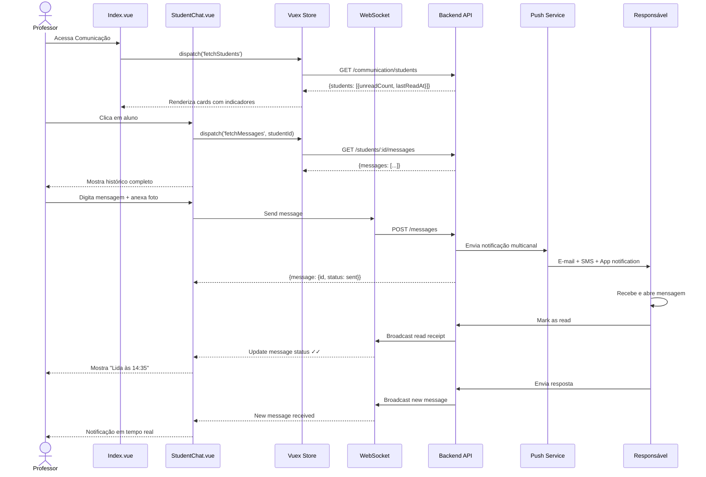

import { IconCheck } from '@site/src/components/MaterialIcon';

# PROF-010: Parent Communication (Comunicação com Responsáveis)

:::info Contexto
**Jornada**: Professor  
**Prioridade**: Baixa  
**Complexidade**: Alta  
**Status**: <IconCheck /> Documentado (AS-IS Baseline)
:::

## 1. Visão Geral

### Problema

Professores precisam se comunicar frequentemente com pais e responsáveis sobre o desempenho, comportamento e situações dos alunos, mas enfrentam dificuldades para realizar comunicação eficiente em escala, documentar historicamente todas as interações, garantir que mensagens importantes sejam lidas, agendar reuniões online, compartilhar evidências visuais (fotos, vídeos), e manter privacidade/segurança em conformidade com LGPD.

**Dores principais**:
- Comunicação fragmentada (WhatsApp pessoal, caderneta física, telefone, e-mail)
- Impossibilidade de enviar mensagens para múltiplos responsáveis simultaneamente
- Falta de confirmação de leitura e rastreabilidade de comunicações
- Ausência de histórico centralizado de interações por aluno
- Dificuldade para agendar e realizar reuniões online (presencial nem sempre viável)
- Impossibilidade de anexar evidências (fotos do caderno, vídeos de apresentações)
- Falta de tradutor automático para famílias de imigrantes ou alunos surdos
- Risco de vazamento de dados pessoais (WhatsApp pessoal do professor)
- Dificuldade para coordenadores monitorarem qualidade da comunicação
- Ausência de templates padronizados para mensagens recorrentes

### Solução AS-IS

Sistema de comunicação digital bidirecional com:
- **Mensagens Individuais e em Grupo** com confirmação de leitura
- **Templates de Mensagens** pré-aprovados pela coordenação (felicitações, alertas, convites)
- **Agendamento de Reuniões** online integrado (Google Meet, Zoom, Teams)
- **Anexos Multimídia** com privacidade (fotos, vídeos, PDFs com termo de consentimento)
- **Tradutor Automático** em tempo real (português ↔ outras línguas + LIBRAS)
- **Histórico Completo** de interações por aluno (timeline auditável)
- **Notificações Multicanal** (e-mail, SMS, push notification in-app)
- **Dashboard de Engajamento** (taxa de leitura, tempo médio resposta, responsáveis inativos)
- **Portal do Responsável** para acesso autônomo (boletim, faltas, missões, eventos)
- **Conformidade LGPD** com logs de acesso, consentimentos documentados, anonimização

## 2. Rotas e Navegação

```typescript
// src/router/professor-routes/parent-communication-routes.js
export default [
  {
    path: '/teacher/communication',
    name: 'teacher-communication',
    component: () => import('@/views/pages/teacher-context/communication/Index.vue'),
    meta: {
      resource: 'Communication',
      action: 'read',
      breadcrumb: [
        { text: 'Início', to: '/' },
        { text: 'Comunicação com Responsáveis', active: true }
      ]
    }
  },
  {
    path: '/teacher/communication/student/:studentId',
    name: 'teacher-communication-student',
    component: () => import('@/views/pages/teacher-context/communication/StudentChat.vue'),
    meta: {
      resource: 'Communication',
      action: 'read'
    }
  },
  {
    path: '/teacher/communication/group/:groupId',
    name: 'teacher-communication-group',
    component: () => import('@/views/pages/teacher-context/communication/GroupChat.vue'),
    meta: {
      resource: 'Communication',
      action: 'read'
    }
  },
  {
    path: '/teacher/communication/meeting/:meetingId',
    name: 'teacher-communication-meeting',
    component: () => import('@/views/pages/teacher-context/communication/MeetingDetails.vue'),
    meta: {
      resource: 'Communication',
      action: 'read'
    }
  }
]
```

**Fluxo de navegação**:
1. Professor acessa página de Comunicação com Responsáveis
2. Visualiza lista de alunos/responsáveis com indicadores (não lidas, pendentes resposta)
3. Clica em aluno → Abre chat individual com histórico completo de mensagens
4. Digita mensagem → Pode anexar foto, vídeo, PDF → Envia
5. Sistema envia notificação multicanal (e-mail + SMS + push) para responsável
6. Responsável recebe e lê mensagem → Sistema marca como "lida" com timestamp
7. Responsável responde → Professor recebe notificação em tempo real
8. Professor pode criar mensagem em grupo → Seleciona múltiplos responsáveis (ex: todos de 7ºA)
9. Professor agenda reunião online → Sistema envia link de videoconferência + lembretes automáticos
10. Dashboard mostra métricas (taxa leitura 78%, tempo médio resposta 4h, 3 responsáveis inativos)

## 3. Arquitetura de Componentes

### Estrutura de Pastas

```
src/views/pages/teacher-context/communication/
├── Index.vue                      # Orquestrador principal
├── StudentChat.vue                # Chat individual com aluno
├── GroupChat.vue                  # Chat em grupo
├── MeetingDetails.vue             # Detalhes de reunião agendada
├── useCommunication.js            # Composable de domínio
├── components/
│   ├── StudentCard.vue            # Card de aluno com indicadores
│   ├── MessageBubble.vue          # Bolha de mensagem (sent/received)
│   ├── MessageInput.vue           # Input de mensagem com anexos
│   ├── TemplateSelector.vue       # Seletor de templates
│   ├── AttachmentViewer.vue       # Visualizador de anexos
│   ├── TranslationToggle.vue      # Toggle de tradução automática
│   ├── ReadReceipt.vue            # Indicador de leitura (✓✓)
│   ├── MeetingCard.vue            # Card de reunião agendada
│   ├── ScheduleMeetingModal.vue   # Modal para agendar reunião
│   ├── GroupSelector.vue          # Seletor de múltiplos responsáveis
│   ├── NotificationSettings.vue   # Configurações de notificações
│   └── LGPDConsent.vue            # Modal de consentimento LGPD
└── charts/
    ├── EngagementMetrics.vue      # Métricas de engajamento
    ├── ResponseTimeChart.vue      # Gráfico de tempo de resposta
    └── ReadRateChart.vue          # Taxa de leitura por período
```

### Responsabilidades dos Componentes

#### Index.vue (Orquestrador)
```vue
<template>
  <section>
    <!-- Header com Métricas Rápidas -->
    <b-card class="mb-3">
      <b-row>
        <b-col cols="12" md="3">
          <div class="text-center">
            <h2 class="text-primary mb-0">{{ unreadCount }}</h2>
            <small class="text-muted">Não Lidas</small>
          </div>
        </b-col>
        <b-col cols="12" md="3">
          <div class="text-center">
            <h2 class="text-success mb-0">{{ readRate }}%</h2>
            <small class="text-muted">Taxa de Leitura</small>
          </div>
        </b-col>
        <b-col cols="12" md="3">
          <div class="text-center">
            <h2 class="text-warning mb-0">{{ averageResponseTime }}</h2>
            <small class="text-muted">Tempo Médio Resposta</small>
          </div>
        </b-col>
        <b-col cols="12" md="3">
          <div class="text-center">
            <h2 class="text-danger mb-0">{{ inactiveParents }}</h2>
            <small class="text-muted">Responsáveis Inativos</small>
          </div>
        </b-col>
      </b-row>
    </b-card>

    <!-- Ações Rápidas -->
    <b-card class="mb-3">
      <div class="d-flex align-items-center justify-content-between">
        <h5 class="mb-0">Comunicações</h5>
        <div>
          <b-button variant="outline-primary" class="mr-2" @click="createGroupMessage">
            <span class="material-symbols-outlined">group</span>
            Mensagem em Grupo
          </b-button>
          <b-button variant="primary" @click="scheduleMeeting">
            <span class="material-symbols-outlined">video_call</span>
            Agendar Reunião
          </b-button>
        </div>
      </div>
    </b-card>

    <!-- Tabs -->
    <b-tabs content-class="mt-3" pills>
      <b-tab title="Conversas" active :badge="unreadCount">
        <b-row>
          <!-- Filtros -->
          <b-col cols="12" class="mb-3">
            <b-form-inline>
              <b-form-input
                v-model="searchQuery"
                placeholder="Buscar aluno ou responsável..."
                class="mr-2"
                style="width: 300px"
              />
              <b-form-select v-model="statusFilter" class="mr-2">
                <b-form-select-option value="all">Todos</b-form-select-option>
                <b-form-select-option value="unread">Não Lidas</b-form-select-option>
                <b-form-select-option value="pending">Aguardando Resposta</b-form-select-option>
                <b-form-select-option value="inactive">Inativos</b-form-select-option>
              </b-form-select>
            </b-form-inline>
          </b-col>

          <!-- Lista de Conversas -->
          <b-col
            v-for="student in filteredStudents"
            :key="student.id"
            cols="12"
            md="4"
            class="mb-3"
          >
            <StudentCard
              :student="student"
              @click="openChat(student.id)"
            />
          </b-col>
        </b-row>
      </b-tab>

      <b-tab title="Reuniões" :badge="upcomingMeetingsCount">
        <b-row>
          <b-col
            v-for="meeting in upcomingMeetings"
            :key="meeting.id"
            cols="12"
            md="6"
            class="mb-3"
          >
            <MeetingCard
              :meeting="meeting"
              @click="viewMeeting(meeting.id)"
            />
          </b-col>
        </b-row>
      </b-tab>

      <b-tab title="Templates">
        <TemplateSelector
          :templates="templates"
          @select="applyTemplate"
        />
      </b-tab>

      <b-tab title="Métricas">
        <b-row>
          <b-col cols="12" md="6" class="mb-3">
            <b-card>
              <h5>Taxa de Leitura</h5>
              <ReadRateChart :data="metrics.readRate" />
            </b-card>
          </b-col>
          <b-col cols="12" md="6" class="mb-3">
            <b-card>
              <h5>Tempo de Resposta</h5>
              <ResponseTimeChart :data="metrics.responseTime" />
            </b-card>
          </b-col>
          <b-col cols="12">
            <b-card>
              <h5>Engajamento Geral</h5>
              <EngagementMetrics :data="metrics.engagement" />
            </b-card>
          </b-col>
        </b-row>
      </b-tab>
    </b-tabs>

    <!-- Modals -->
    <ScheduleMeetingModal
      v-if="showScheduleMeetingModal"
      @close="showScheduleMeetingModal = false"
      @scheduled="onMeetingScheduled"
    />

    <GroupSelector
      v-if="showGroupSelector"
      :students="students"
      @close="showGroupSelector = false"
      @selected="sendGroupMessage"
    />
  </section>
</template>

<script>
import StudentCard from './components/StudentCard.vue'
import MeetingCard from './components/MeetingCard.vue'
import TemplateSelector from './components/TemplateSelector.vue'
import ReadRateChart from './charts/ReadRateChart.vue'
import ResponseTimeChart from './charts/ResponseTimeChart.vue'
import EngagementMetrics from './charts/EngagementMetrics.vue'
import ScheduleMeetingModal from './components/ScheduleMeetingModal.vue'
import GroupSelector from './components/GroupSelector.vue'
import store from '@/store'
import router from '@/router'
import moduleCommunication from '@/store/pageModules/communication/module-communication.js'
import { defineComponent, ref, computed, onMounted, onUnmounted } from '@vue/composition-api'
import useCommunication from './useCommunication.js'

export default defineComponent({
  name: 'CommunicationIndex',
  components: {
    StudentCard,
    MeetingCard,
    TemplateSelector,
    ReadRateChart,
    ResponseTimeChart,
    EngagementMetrics,
    ScheduleMeetingModal,
    GroupSelector
  },
  setup() {
    store.registerModule('communication', moduleCommunication)

    const {
      students,
      unreadCount,
      readRate,
      averageResponseTime,
      inactiveParents,
      upcomingMeetings,
      upcomingMeetingsCount,
      templates,
      metrics
    } = useCommunication()

    const searchQuery = ref('')
    const statusFilter = ref('all')
    const showScheduleMeetingModal = ref(false)
    const showGroupSelector = ref(false)

    const filteredStudents = computed(() => {
      let result = students.value

      if (searchQuery.value) {
        result = result.filter(s =>
          s.name.toLowerCase().includes(searchQuery.value.toLowerCase()) ||
          s.parentName.toLowerCase().includes(searchQuery.value.toLowerCase())
        )
      }

      if (statusFilter.value !== 'all') {
        result = result.filter(s => s.status === statusFilter.value)
      }

      return result
    })

    const openChat = (studentId) => {
      router.push({ name: 'teacher-communication-student', params: { studentId } })
    }

    const viewMeeting = (meetingId) => {
      router.push({ name: 'teacher-communication-meeting', params: { meetingId } })
    }

    const createGroupMessage = () => {
      showGroupSelector.value = true
    }

    const scheduleMeeting = () => {
      showScheduleMeetingModal.value = true
    }

    const applyTemplate = (template) => {
      // Aplica template
    }

    const sendGroupMessage = (selectedStudents, message) => {
      // Envia mensagem em grupo
    }

    const onMeetingScheduled = (meeting) => {
      // Atualiza lista de reuniões
    }

    onMounted(() => {
      store.dispatch('communication/fetchStudents')
      store.dispatch('communication/fetchMeetings')
      store.dispatch('communication/fetchMetrics')
      store.dispatch('communication/fetchTemplates')
    })

    onUnmounted(() => {
      store.commit('communication/reset')
      store.unregisterModule('communication')
    })

    return {
      students,
      filteredStudents,
      unreadCount,
      readRate,
      averageResponseTime,
      inactiveParents,
      upcomingMeetings,
      upcomingMeetingsCount,
      templates,
      metrics,
      searchQuery,
      statusFilter,
      showScheduleMeetingModal,
      showGroupSelector,
      openChat,
      viewMeeting,
      createGroupMessage,
      scheduleMeeting,
      applyTemplate,
      sendGroupMessage,
      onMeetingScheduled
    }
  }
})
</script>
```

#### StudentChat.vue (Chat Individual)
```vue
<template>
  <div class="chat-container">
    <!-- Header do Chat -->
    <b-card class="chat-header mb-3">
      <div class="d-flex align-items-center justify-content-between">
        <div class="d-flex align-items-center">
          <b-avatar :src="student.avatar" size="50px" class="mr-3" />
          <div>
            <h5 class="mb-0">{{ student.name }}</h5>
            <small class="text-muted">
              Responsável: {{ student.parentName }}
              <b-badge v-if="student.parentOnline" variant="success" class="ml-2">
                Online
              </b-badge>
            </small>
          </div>
        </div>

        <div class="d-flex align-items-center">
          <TranslationToggle
            v-model="translationEnabled"
            :target-language="student.parentLanguage"
            class="mr-3"
          />

          <b-button variant="outline-primary" size="sm" @click="scheduleMeeting">
            <span class="material-symbols-outlined">video_call</span>
            Agendar Reunião
          </b-button>
        </div>
      </div>
    </b-card>

    <!-- Timeline de Mensagens -->
    <b-card class="chat-messages mb-3" style="height: 500px; overflow-y: auto">
      <div v-for="message in messages" :key="message.id" class="mb-3">
        <MessageBubble
          :message="message"
          :is-own="message.senderId === currentUserId"
          :show-translation="translationEnabled"
        />
        <ReadReceipt v-if="message.senderId === currentUserId" :message="message" />
      </div>

      <!-- Typing Indicator -->
      <div v-if="parentTyping" class="text-muted">
        <small>{{ student.parentName }} está digitando...</small>
      </div>
    </b-card>

    <!-- Input de Mensagem -->
    <MessageInput
      v-model="newMessage"
      :attachments="attachments"
      @send="sendMessage"
      @attach="handleAttachment"
    />

    <!-- Templates Rápidos -->
    <b-card class="mt-3">
      <small class="text-muted">Templates Rápidos:</small>
      <div class="d-flex flex-wrap mt-2">
        <b-button
          v-for="template in quickTemplates"
          :key="template.id"
          variant="outline-secondary"
          size="sm"
          class="mr-2 mb-2"
          @click="applyQuickTemplate(template)"
        >
          {{ template.label }}
        </b-button>
      </div>
    </b-card>
  </div>
</template>

<script>
import MessageBubble from './components/MessageBubble.vue'
import MessageInput from './components/MessageInput.vue'
import ReadReceipt from './components/ReadReceipt.vue'
import TranslationToggle from './components/TranslationToggle.vue'
import useCommunication from './useCommunication.js'
import { ref, onMounted, onUnmounted } from '@vue/composition-api'
import { emitter } from '@/eventBus'

export default {
  components: {
    MessageBubble,
    MessageInput,
    ReadReceipt,
    TranslationToggle
  },
  setup() {
    const {
      student,
      messages,
      currentUserId,
      parentTyping,
      quickTemplates
    } = useCommunication()

    const newMessage = ref('')
    const attachments = ref([])
    const translationEnabled = ref(false)

    const sendMessage = () => {
      if (!newMessage.value.trim() && attachments.value.length === 0) return

      // Envia mensagem via WebSocket
      emitter.emit('send-message', {
        studentId: student.value.id,
        content: newMessage.value,
        attachments: attachments.value
      })

      newMessage.value = ''
      attachments.value = []
    }

    const handleAttachment = (files) => {
      // Upload e adiciona anexos
      attachments.value.push(...files)
    }

    const applyQuickTemplate = (template) => {
      newMessage.value = template.content
    }

    const scheduleMeeting = () => {
      // Abre modal de agendamento
    }

    onMounted(() => {
      // Conecta WebSocket para chat em tempo real
      emitter.on('message-received', (msg) => {
        messages.value.push(msg)
      })

      emitter.on('parent-typing', () => {
        parentTyping.value = true
        setTimeout(() => { parentTyping.value = false }, 3000)
      })
    })

    onUnmounted(() => {
      emitter.off('message-received')
      emitter.off('parent-typing')
    })

    return {
      student,
      messages,
      currentUserId,
      parentTyping,
      quickTemplates,
      newMessage,
      attachments,
      translationEnabled,
      sendMessage,
      handleAttachment,
      applyQuickTemplate,
      scheduleMeeting
    }
  }
}
</script>

<style scoped>
.chat-messages {
  display: flex;
  flex-direction: column;
}
</style>
```

## 4. Módulo Vuex

```javascript
// src/store/pageModules/communication/module-communication.js
import {
  getStudents,
  getMessages,
  sendMessage,
  getMeetings,
  scheduleMeeting,
  getTemplates,
  getMetrics
} from '@/services/teacher-context/CommunicationService'

export default {
  namespaced: true,
  
  state: {
    students: [],
    currentStudent: null,
    messages: [],
    meetings: [],
    templates: [],
    metrics: null,
    parentTyping: false,
    loading: false
  },

  mutations: {
    students(state, payload) {
      state.students = payload
    },
    currentStudent(state, payload) {
      state.currentStudent = payload
    },
    messages(state, payload) {
      state.messages = payload
    },
    meetings(state, payload) {
      state.meetings = payload
    },
    templates(state, payload) {
      state.templates = payload
    },
    metrics(state, payload) {
      state.metrics = payload
    },
    parentTyping(state, payload) {
      state.parentTyping = payload
    },
    loading(state, payload) {
      state.loading = payload
    },
    reset(state) {
      state.students = []
      state.currentStudent = null
      state.messages = []
      state.meetings = []
      state.templates = []
      state.metrics = null
      state.parentTyping = false
      state.loading = false
    }
  },

  getters: {
    students: state => state.students,
    currentStudent: state => state.currentStudent,
    messages: state => state.messages,
    meetings: state => state.meetings,
    templates: state => state.templates,
    metrics: state => state.metrics,
    parentTyping: state => state.parentTyping,
    loading: state => state.loading,

    // Computed: Total de mensagens não lidas
    unreadCount: state => {
      return state.students.reduce((sum, s) => sum + s.unreadCount, 0)
    },

    // Computed: Taxa de leitura média
    readRate: state => {
      if (state.students.length === 0) return 0
      const totalSent = state.students.reduce((sum, s) => sum + s.messagesSent, 0)
      const totalRead = state.students.reduce((sum, s) => sum + s.messagesRead, 0)
      return totalSent > 0 ? ((totalRead / totalSent) * 100).toFixed(1) : 0
    },

    // Computed: Tempo médio de resposta (em horas)
    averageResponseTime: state => {
      if (!state.metrics) return '0h'
      const hours = state.metrics.averageResponseTimeMinutes / 60
      if (hours < 1) return `${state.metrics.averageResponseTimeMinutes}min`
      return `${hours.toFixed(1)}h`
    },

    // Computed: Responsáveis inativos (maior que 7 dias sem ler)
    inactiveParents: state => {
      return state.students.filter(s => {
        if (!s.lastReadAt) return true
        const daysSinceRead = (Date.now() - new Date(s.lastReadAt)) / (1000 * 60 * 60 * 24)
        return daysSinceRead > 7
      }).length
    },

    // Computed: Reuniões próximas (próximos 7 dias)
    upcomingMeetings: state => {
      const now = Date.now()
      const sevenDays = 7 * 24 * 60 * 60 * 1000
      return state.meetings.filter(m => {
        const meetingTime = new Date(m.scheduledAt).getTime()
        return meetingTime >= now && meetingTime <= now + sevenDays
      })
    },

    // Computed: Contagem de reuniões próximas
    upcomingMeetingsCount: (state, getters) => getters.upcomingMeetings.length,

    // Computed: Templates rápidos (mais usados)
    quickTemplates: state => {
      return [...state.templates]
        .sort((a, b) => b.usageCount - a.usageCount)
        .slice(0, 5)
    }
  },

  actions: {
    async fetchStudents({ commit }) {
      commit('loading', true)
      try {
        const response = await getStudents()
        commit('students', response.data.students)
      } catch (error) {
        console.error('Erro ao buscar alunos:', error)
      } finally {
        commit('loading', false)
      }
    },

    async fetchMessages({ commit }, studentId) {
      commit('loading', true)
      try {
        const response = await getMessages(studentId)
        commit('messages', response.data.messages)
      } catch (error) {
        console.error('Erro ao buscar mensagens:', error)
      } finally {
        commit('loading', false)
      }
    },

    async fetchMeetings({ commit }) {
      try {
        const response = await getMeetings()
        commit('meetings', response.data.meetings)
      } catch (error) {
        console.error('Erro ao buscar reuniões:', error)
      }
    },

    async fetchTemplates({ commit }) {
      try {
        const response = await getTemplates()
        commit('templates', response.data.templates)
      } catch (error) {
        console.error('Erro ao buscar templates:', error)
      }
    },

    async fetchMetrics({ commit }) {
      try {
        const response = await getMetrics()
        commit('metrics', response.data)
      } catch (error) {
        console.error('Erro ao buscar métricas:', error)
      }
    }
  }
}
```

## 5. Services (API Layer)

```javascript
// src/services/teacher-context/CommunicationService.js
import { axiosIns } from '@axios'

/**
 * Busca lista de alunos e responsáveis
 * @returns {Promise<{data: Object}>}
 */
export const getStudents = () => {
  return axiosIns.get('/teacher/communication/students')
}

/**
 * Busca mensagens com responsável
 * @param {number} studentId - ID do aluno
 * @returns {Promise<{data: Object}>}
 */
export const getMessages = (studentId) => {
  return axiosIns.get(`/teacher/communication/students/${studentId}/messages`)
}

/**
 * Envia mensagem para responsável
 * @param {number} studentId - ID do aluno
 * @param {Object} data - Dados da mensagem
 * @returns {Promise<{data: Object}>}
 */
export const sendMessage = (studentId, data) => {
  return axiosIns.post(`/teacher/communication/students/${studentId}/messages`, data)
}

/**
 * Busca reuniões agendadas
 * @returns {Promise<{data: Object}>}
 */
export const getMeetings = () => {
  return axiosIns.get('/teacher/communication/meetings')
}

/**
 * Agenda reunião online
 * @param {Object} data - Dados da reunião
 * @returns {Promise<{data: Object}>}
 */
export const scheduleMeeting = (data) => {
  return axiosIns.post('/teacher/communication/meetings', data)
}

/**
 * Busca templates de mensagens
 * @returns {Promise<{data: Object}>}
 */
export const getTemplates = () => {
  return axiosIns.get('/teacher/communication/templates')
}

/**
 * Busca métricas de comunicação
 * @returns {Promise<{data: Object}>}
 */
export const getMetrics = () => {
  return axiosIns.get('/teacher/communication/metrics')
}
```

## 6. Composable de Domínio

```javascript
// src/views/pages/teacher-context/communication/useCommunication.js
import store from '@/store'
import { computed } from '@vue/composition-api'

const moduleName = 'communication'

export default function useCommunication() {
  const students = computed(
    () => store.getters[`${moduleName}/students`]
  )

  const unreadCount = computed(
    () => store.getters[`${moduleName}/unreadCount`]
  )

  const readRate = computed(
    () => store.getters[`${moduleName}/readRate`]
  )

  const averageResponseTime = computed(
    () => store.getters[`${moduleName}/averageResponseTime`]
  )

  const inactiveParents = computed(
    () => store.getters[`${moduleName}/inactiveParents`]
  )

  const upcomingMeetings = computed(
    () => store.getters[`${moduleName}/upcomingMeetings`]
  )

  const upcomingMeetingsCount = computed(
    () => store.getters[`${moduleName}/upcomingMeetingsCount`]
  )

  const quickTemplates = computed(
    () => store.getters[`${moduleName}/quickTemplates`]
  )

  const student = computed(
    () => store.getters[`${moduleName}/currentStudent`]
  )

  const messages = computed(
    () => store.getters[`${moduleName}/messages`]
  )

  const parentTyping = computed(
    () => store.getters[`${moduleName}/parentTyping`]
  )

  const templates = computed(
    () => store.getters[`${moduleName}/templates`]
  )

  const metrics = computed(
    () => store.getters[`${moduleName}/metrics`]
  )

  const currentUserId = computed(() => store.getters['account/userData'].id)

  return {
    moduleName,
    students,
    unreadCount,
    readRate,
    averageResponseTime,
    inactiveParents,
    upcomingMeetings,
    upcomingMeetingsCount,
    quickTemplates,
    student,
    messages,
    parentTyping,
    templates,
    metrics,
    currentUserId
  }
}
```

## 7. Fluxo de Usuário



## 8. Estados da Interface

### Estado 1: Lista de Conversas
```typescript
{
  students: [
    {
      id: 1,
      name: 'Ana Silva',
      avatar: '...',
      parentName: 'Maria Silva',
      parentLanguage: 'pt-BR',
      unreadCount: 2,
      lastReadAt: '2024-02-01T10:30:00Z',
      messagesSent: 15,
      messagesRead: 12,
      status: 'unread'
    }
  ],
  unreadCount: 5,
  readRate: '78.5',
  averageResponseTime: '4.2h',
  inactiveParents: 3
}
```

### Estado 2: Chat Individual
```typescript
{
  messages: [
    {
      id: 1,
      senderId: 1,
      senderName: 'Prof. João',
      content: 'Olá! Ana teve ótimo desempenho na missão de Matemática.',
      attachments: [{type: 'image', url: '...'}],
      sentAt: '2024-02-01T10:00:00Z',
      readAt: '2024-02-01T10:35:00Z',
      status: 'read',
      translated: false
    }
  ]
}
```

## 9. API Endpoints

### GET /teacher/communication/students
**Response**:
```json
{
  "students": [
    {
      "id": 1,
      "name": "Ana Silva",
      "avatar": "https://...",
      "parentName": "Maria Silva",
      "parentEmail": "maria@example.com",
      "parentPhone": "+5511999999999",
      "parentLanguage": "pt-BR",
      "unreadCount": 2,
      "lastReadAt": "2024-02-01T10:30:00Z",
      "messagesSent": 15,
      "messagesRead": 12,
      "status": "unread"
    }
  ]
}
```

## 10. Screenshots (AS-IS)


*Lista de conversas com indicadores*


*Chat individual com anexos e tradução*

## 11. Melhorias TO-BE

### 1. IA de Resumo Automático
**TO-BE**: IA gera resumo executivo semanal da comunicação (principais temas, alunos com mais contato, sentimento geral)

### 2. Chatbot de Atendimento 24/7
**TO-BE**: Chatbot responde dúvidas frequentes (horários, calendário, material necessário) automaticamente, escala para professor se necessário

### 3. Análise de Sentimento
**TO-BE**: IA detecta sentimento negativo em mensagens de responsáveis → alerta coordenador imediatamente para intervenção

### 4. Videochamadas Nativas
**TO-BE**: Sistema próprio de videochamadas (sem dependência Google/Zoom), gravação automática com consentimento, transcrição em tempo real

### 5. Portal do Responsável Avançado
**TO-BE**: Responsável acessa dashboard completo (boletim, faltas, missões, fotos da rotina, cardápio, vacinas, documentos), notificações personalizadas

## 12. Testes Recomendados

### Testes Unitários
```javascript
describe('useCommunication', () => {
  it('deve calcular taxa de leitura corretamente', () => {
    const mockStudents = [
      { messagesSent: 10, messagesRead: 8 },
      { messagesSent: 5, messagesRead: 5 }
    ]
    store.commit('communication/students', mockStudents)
    
    const { readRate } = useCommunication()
    expect(readRate.value).toBe('86.7') // (13/15)*100
  })

  it('deve identificar responsáveis inativos', () => {
    const mockStudents = [
      { lastReadAt: new Date(Date.now() - 10 * 24 * 60 * 60 * 1000).toISOString() },
      { lastReadAt: new Date(Date.now() - 2 * 24 * 60 * 60 * 1000).toISOString() }
    ]
    store.commit('communication/students', mockStudents)
    
    const { inactiveParents } = useCommunication()
    expect(inactiveParents.value).toBe(1) // maior que 7 dias
  })
})
```

## 13. Métricas de Sucesso

### KPIs (AS-IS)
- **Uso de Comunicação Digital**: 30% professores
- **Taxa de Leitura**: 45%
- **Tempo Médio Resposta**: 24h
- **Reuniões Online**: 10%

### Metas TO-BE
- **Uso**: 90% (+200%)
- **Taxa de Leitura**: 85% (+89%)
- **Tempo**: 4h (-83%)
- **Reuniões**: 60% (+500%)
- **Satisfação Responsáveis**: 9.0/10

---

## Dependências Relacionadas

- **[PROF-008: Student Progress Tracking](./student-progress-tracking.md)** - Relatórios compartilhados com responsáveis
- **[PROF-005: Student Records](./student-records.md)** - Contexto do aluno para comunicação

---

:::tip Próximos Passos
1. Implementar WebSocket para chat em tempo real
2. Integrar tradutor automático (Google Translate API + LIBRAS)
3. Desenvolver chatbot de atendimento 24/7
4. Implementar análise de sentimento com alertas
5. Criar portal do responsável com dashboard completo
6. Garantir conformidade total com LGPD (logs, consentimentos, anonimização)
:::
