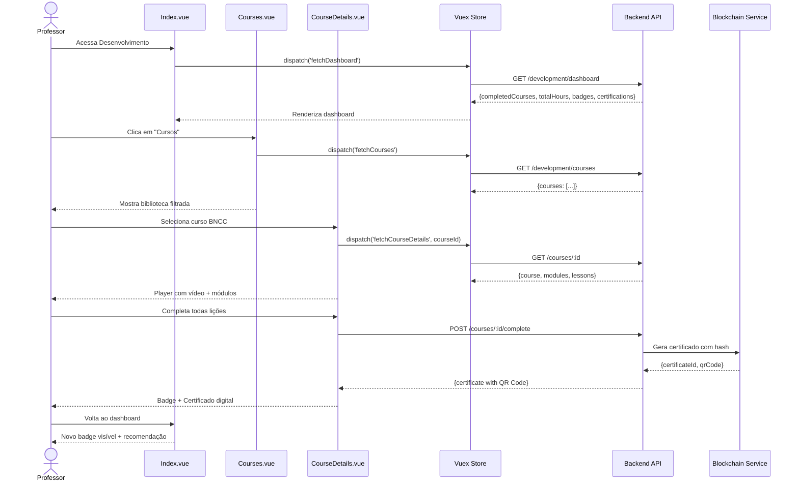
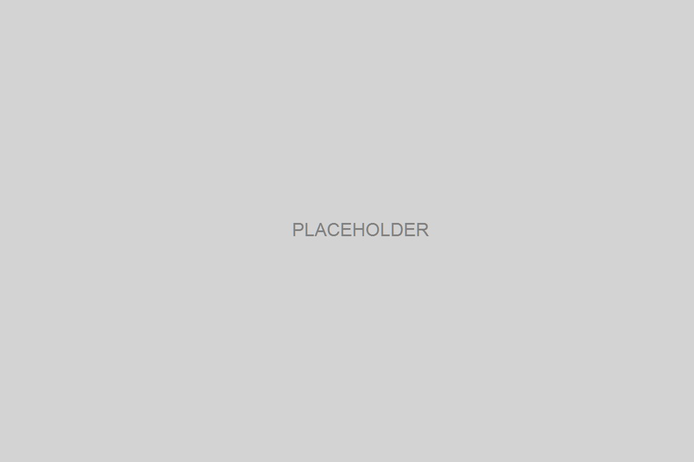
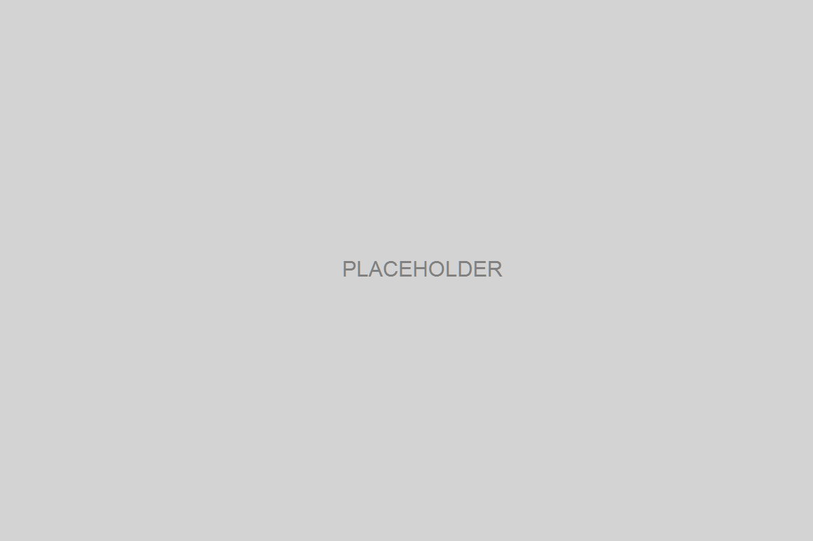

import { IconCheck } from '@site/src/components/MaterialIcon';

# PROF-011: Professional Development (Desenvolvimento Profissional)

:::info Contexto
**Jornada**: Professor  
**Prioridade**: Baixa  
**Complexidade**: Média  
**Status**: <IconCheck /> Documentado (AS-IS Baseline)
:::

## 1. Visão Geral

### Problema

Professores precisam de formação continuada para atualizar práticas pedagógicas, cumprir requisitos de certificação, e desenvolver novas competências, mas enfrentam dificuldades para acessar cursos relevantes e flexíveis, acompanhar progresso em certificações obrigatórias, documentar portfólio profissional para progressão de carreira, receber feedback estruturado sobre desempenho pedagógico, e identificar lacunas de competências para desenvolvimento direcionado.

**Dores principais**:
- Falta de plataforma centralizada de formação continuada com cursos relevantes
- Impossibilidade de acompanhar progresso em certificações obrigatórias (BNCC, inclusão, tecnologias)
- Ausência de portfólio digital profissional documentando práticas bem-sucedidas
- Falta de feedback estruturado sobre desempenho pedagógico (além de avaliação anual genérica)
- Dificuldade para identificar lacunas de competências e receber recomendações personalizadas
- Cursos presenciais incompatíveis com rotina docente (falta de tempo, localização)
- Certificados em papel perdidos, impossibilidade de validar autenticidade
- Falta de reconhecimento e gamificação do desenvolvimento profissional
- Impossibilidade de compartilhar conhecimento entre pares (comunidade de prática)
- Ausência de trilhas de carreira claras e recomendações de próximos passos

### Solução AS-IS

Sistema de desenvolvimento profissional com:
- **Biblioteca de Cursos** com conteúdo EaD (vídeos, textos, exercícios, projetos)
- **Trilhas de Formação** estruturadas (iniciante → intermediário → avançado)
- **Portfólio Digital** documentando práticas, projetos, evidências de impacto
- **Certificações Digitais** com blockchain para autenticidade e portabilidade
- **Sistema de Badges** gamificado (conquistas por competências desenvolvidas)
- **Autoavaliação e Feedback 360º** (coordenadores, pares, alunos)
- **Recomendações Personalizadas** baseadas em lacunas de competências identificadas
- **Comunidade de Prática** com fóruns, grupos de estudo, mentorias entre pares
- **Dashboard de Progresso** com metas, prazos, certificações pendentes
- **Integração com Plano de Carreira** (requisitos para progressão funcional)

## 2. Rotas e Navegação

```typescript
// src/router/professor-routes/professional-development-routes.js
export default [
  {
    path: '/teacher/development',
    name: 'teacher-development',
    component: () => import('@/views/pages/teacher-context/development/Index.vue'),
    meta: {
      resource: 'Development',
      action: 'read',
      breadcrumb: [
        { text: 'Início', to: '/' },
        { text: 'Desenvolvimento Profissional', active: true }
      ]
    }
  },
  {
    path: '/teacher/development/courses',
    name: 'teacher-courses',
    component: () => import('@/views/pages/teacher-context/development/Courses.vue'),
    meta: {
      resource: 'Development',
      action: 'read'
    }
  },
  {
    path: '/teacher/development/course/:courseId',
    name: 'teacher-course-details',
    component: () => import('@/views/pages/teacher-context/development/CourseDetails.vue'),
    meta: {
      resource: 'Development',
      action: 'read'
    }
  },
  {
    path: '/teacher/development/portfolio',
    name: 'teacher-portfolio',
    component: () => import('@/views/pages/teacher-context/development/Portfolio.vue'),
    meta: {
      resource: 'Development',
      action: 'read'
    }
  },
  {
    path: '/teacher/development/feedback',
    name: 'teacher-feedback',
    component: () => import('@/views/pages/teacher-context/development/Feedback360.vue'),
    meta: {
      resource: 'Development',
      action: 'read'
    }
  }
]
```

**Fluxo de navegação**:
1. Professor acessa página de Desenvolvimento Profissional
2. Visualiza dashboard com progresso geral, certificações pendentes, recomendações
3. Clica em "Cursos" → Vê biblioteca filtrada por área (Didática, Tecnologia, Inclusão, BNCC)
4. Seleciona curso "BNCC na Prática - 40h" → Vê ementa, módulos, carga horária, certificação
5. Inicia curso → Assiste vídeo-aula, lê material, faz exercícios, submete projeto prático
6. Completa curso → Recebe certificado digital com QR Code blockchain
7. Sistema atualiza portfólio automaticamente com certificado + evidências de projeto
8. Professor recebe badge "Especialista BNCC" visível no perfil
9. Dashboard mostra nova recomendação baseada em progresso: "Próximo passo: Avaliação Formativa"
10. Professor acessa Feedback 360º → Vê avaliação de coordenador, autoavaliação, feedback de pares

## 3. Arquitetura de Componentes

### Estrutura de Pastas

```
src/views/pages/teacher-context/development/
├── Index.vue                      # Orquestrador principal
├── Courses.vue                    # Biblioteca de cursos
├── CourseDetails.vue              # Detalhes e player de curso
├── Portfolio.vue                  # Portfólio digital
├── Feedback360.vue                # Feedback 360 graus
├── useDevelopment.js              # Composable de domínio
├── components/
│   ├── ProgressDashboard.vue      # Dashboard de progresso
│   ├── CourseCard.vue             # Card de curso na biblioteca
│   ├── CoursePlayer.vue           # Player de vídeo com controles
│   ├── CertificateCard.vue        # Card de certificado com QR Code
│   ├── BadgeDisplay.vue           # Exibição de badges conquistados
│   ├── TrackSelector.vue          # Seletor de trilhas de formação
│   ├── PortfolioItem.vue          # Item do portfólio (projeto, prática)
│   ├── FeedbackForm.vue           # Formulário de autoavaliação
│   ├── CompetencyRadar.vue        # Radar de competências
│   ├── RecommendationCard.vue     # Card de recomendação personalizada
│   ├── CommunityForum.vue         # Fórum da comunidade de prática
│   └── MentorCard.vue             # Card de mentor disponível
└── charts/
    ├── ProgressChart.vue          # Gráfico de progresso por área
    ├── CompetencyGap.vue          # Gráfico de lacunas de competências
    └── TimeInvestment.vue         # Tempo investido em formação
```

### Responsabilidades dos Componentes

#### Index.vue (Orquestrador)
```vue
<template>
  <section>
    <!-- Hero com Motivação -->
    <b-card class="mb-3 bg-gradient-primary text-white">
      <div class="d-flex align-items-center justify-content-between">
        <div>
          <h3 class="text-white mb-2">Olá, {{ teacherName }}! 👋</h3>
          <p class="mb-0">Você completou <strong>{{ completedCoursesCount }} cursos</strong> este ano.</p>
          <p class="mb-0">Continue investindo no seu desenvolvimento!</p>
        </div>
        <div class="text-right">
          <h1 class="text-white mb-0">{{ totalHours }}h</h1>
          <small class="text-white-50">Horas de Formação</small>
        </div>
      </div>
    </b-card>

    <!-- Dashboard de Progresso -->
    <ProgressDashboard :data="progressData" class="mb-3" />

    <!-- Tabs -->
    <b-tabs content-class="mt-3" pills>
      <b-tab title="Visão Geral" active>
        <b-row>
          <!-- Recomendações Personalizadas -->
          <b-col cols="12" md="6" class="mb-3">
            <b-card>
              <h5>Recomendado para Você</h5>
              <RecommendationCard
                v-for="rec in recommendations"
                :key="rec.id"
                :recommendation="rec"
                class="mb-2"
              />
            </b-card>
          </b-col>

          <!-- Certificações Pendentes -->
          <b-col cols="12" md="6" class="mb-3">
            <b-card>
              <h5>Certificações Pendentes</h5>
              <b-list-group>
                <b-list-group-item
                  v-for="cert in pendingCertifications"
                  :key="cert.id"
                  class="d-flex justify-content-between align-items-center"
                >
                  <div>
                    <strong>{{ cert.name }}</strong>
                    <br>
                    <small class="text-muted">Prazo: {{ cert.deadline }}</small>
                  </div>
                  <b-badge :variant="cert.urgent ? 'danger' : 'warning'">
                    {{ cert.progress }}%
                  </b-badge>
                </b-list-group-item>
              </b-list-group>
            </b-card>
          </b-col>

          <!-- Badges Conquistados -->
          <b-col cols="12" class="mb-3">
            <b-card>
              <h5>Badges Conquistados</h5>
              <BadgeDisplay :badges="badges" />
            </b-card>
          </b-col>
        </b-row>
      </b-tab>

      <b-tab title="Cursos" :badge="availableCoursesCount">
        <Courses />
      </b-tab>

      <b-tab title="Portfólio">
        <Portfolio />
      </b-tab>

      <b-tab title="Feedback 360º">
        <Feedback360 />
      </b-tab>

      <b-tab title="Comunidade">
        <CommunityForum />
      </b-tab>

      <b-tab title="Trilhas">
        <TrackSelector :tracks="tracks" />
      </b-tab>
    </b-tabs>
  </section>
</template>

<script>
import ProgressDashboard from './components/ProgressDashboard.vue'
import RecommendationCard from './components/RecommendationCard.vue'
import BadgeDisplay from './components/BadgeDisplay.vue'
import Courses from './Courses.vue'
import Portfolio from './Portfolio.vue'
import Feedback360 from './Feedback360.vue'
import CommunityForum from './components/CommunityForum.vue'
import TrackSelector from './components/TrackSelector.vue'
import store from '@/store'
import moduleDevelopment from '@/store/pageModules/development/module-development.js'
import { defineComponent, computed, onMounted, onUnmounted } from '@vue/composition-api'
import useDevelopment from './useDevelopment.js'

export default defineComponent({
  name: 'DevelopmentIndex',
  components: {
    ProgressDashboard,
    RecommendationCard,
    BadgeDisplay,
    Courses,
    Portfolio,
    Feedback360,
    CommunityForum,
    TrackSelector
  },
  setup() {
    store.registerModule('development', moduleDevelopment)

    const {
      teacherName,
      completedCoursesCount,
      totalHours,
      progressData,
      recommendations,
      pendingCertifications,
      badges,
      availableCoursesCount,
      tracks
    } = useDevelopment()

    onMounted(() => {
      store.dispatch('development/fetchDashboard')
      store.dispatch('development/fetchRecommendations')
      store.dispatch('development/fetchTracks')
    })

    onUnmounted(() => {
      store.commit('development/reset')
      store.unregisterModule('development')
    })

    return {
      teacherName,
      completedCoursesCount,
      totalHours,
      progressData,
      recommendations,
      pendingCertifications,
      badges,
      availableCoursesCount,
      tracks
    }
  }
})
</script>

<style scoped>
.bg-gradient-primary {
  background: linear-gradient(135deg, #7367F0 0%, #9E95F5 100%);
}
</style>
```

#### CourseDetails.vue (Player de Curso)
```vue
<template>
  <div>
    <!-- Header do Curso -->
    <b-card class="mb-3">
      <b-row>
        <b-col cols="12" md="8">
          <h3>{{ course.name }}</h3>
          <p class="text-muted">{{ course.description }}</p>
          <div class="d-flex align-items-center">
            <b-badge variant="primary" class="mr-2">{{ course.category }}</b-badge>
            <span class="text-muted mr-3">
              <span class="material-symbols-outlined">schedule</span>
              {{ course.duration }}h
            </span>
            <span class="text-muted">
              <span class="material-symbols-outlined">workspace_premium</span>
              Certificado Digital
            </span>
          </div>
        </b-col>
        <b-col cols="12" md="4" class="text-right">
          <b-progress :value="course.progress" max="100" class="mb-2" />
          <p class="mb-0">{{ course.progress }}% Completo</p>
        </b-col>
      </b-row>
    </b-card>

    <!-- Player de Vídeo -->
    <b-card class="mb-3">
      <CoursePlayer
        :video-url="currentLesson.videoUrl"
        :lesson="currentLesson"
        @completed="markLessonCompleted"
      />
    </b-card>

    <!-- Módulos e Lições -->
    <b-row>
      <b-col cols="12" md="8">
        <b-card>
          <h5>{{ currentLesson.title }}</h5>
          <div v-html="currentLesson.content" />

          <!-- Exercícios -->
          <div v-if="currentLesson.exercises" class="mt-4">
            <h6>Exercícios</h6>
            <div v-for="exercise in currentLesson.exercises" :key="exercise.id">
              <!-- Exercise component -->
            </div>
          </div>

          <!-- Projeto Prático -->
          <div v-if="currentLesson.project" class="mt-4">
            <h6>Projeto Prático</h6>
            <p>{{ currentLesson.project.description }}</p>
            <b-button variant="primary" @click="submitProject">
              Enviar Projeto
            </b-button>
          </div>
        </b-card>
      </b-col>

      <b-col cols="12" md="4">
        <b-card>
          <h6>Módulos do Curso</h6>
          <b-list-group>
            <b-list-group-item
              v-for="module in course.modules"
              :key="module.id"
              :active="module.id === currentModule.id"
              @click="selectModule(module)"
            >
              <div class="d-flex justify-content-between align-items-center">
                <span>{{ module.name }}</span>
                <b-badge v-if="module.completed" variant="success">
                  <span class="material-symbols-outlined">check</span>
                </b-badge>
              </div>
            </b-list-group-item>
          </b-list-group>
        </b-card>
      </b-col>
    </b-row>
  </div>
</template>

<script>
import CoursePlayer from './components/CoursePlayer.vue'
import useDevelopment from './useDevelopment.js'
import { ref } from '@vue/composition-api'

export default {
  components: { CoursePlayer },
  setup() {
    const { course, currentLesson, currentModule } = useDevelopment()

    const markLessonCompleted = () => {
      // Marca lição como completa
    }

    const selectModule = (module) => {
      // Seleciona módulo
    }

    const submitProject = () => {
      // Submete projeto prático
    }

    return {
      course,
      currentLesson,
      currentModule,
      markLessonCompleted,
      selectModule,
      submitProject
    }
  }
}
</script>
```

## 4. Módulo Vuex

```javascript
// src/store/pageModules/development/module-development.js
import {
  getDashboard,
  getCourses,
  getCourseDetails,
  getPortfolio,
  getFeedback,
  getRecommendations,
  getTracks
} from '@/services/teacher-context/DevelopmentService'

export default {
  namespaced: true,
  
  state: {
    dashboard: null,
    courses: [],
    currentCourse: null,
    portfolio: [],
    feedback: null,
    recommendations: [],
    tracks: [],
    badges: [],
    loading: false
  },

  mutations: {
    dashboard(state, payload) {
      state.dashboard = payload
    },
    courses(state, payload) {
      state.courses = payload
    },
    currentCourse(state, payload) {
      state.currentCourse = payload
    },
    portfolio(state, payload) {
      state.portfolio = payload
    },
    feedback(state, payload) {
      state.feedback = payload
    },
    recommendations(state, payload) {
      state.recommendations = payload
    },
    tracks(state, payload) {
      state.tracks = payload
    },
    badges(state, payload) {
      state.badges = payload
    },
    loading(state, payload) {
      state.loading = payload
    },
    reset(state) {
      state.dashboard = null
      state.courses = []
      state.currentCourse = null
      state.portfolio = []
      state.feedback = null
      state.recommendations = []
      state.tracks = []
      state.badges = []
      state.loading = false
    }
  },

  getters: {
    dashboard: state => state.dashboard,
    courses: state => state.courses,
    currentCourse: state => state.currentCourse,
    portfolio: state => state.portfolio,
    feedback: state => state.feedback,
    recommendations: state => state.recommendations,
    tracks: state => state.tracks,
    badges: state => state.badges,
    loading: state => state.loading,

    // Computed: Nome do professor
    teacherName: state => state.dashboard?.teacherName || '',

    // Computed: Total de cursos completados
    completedCoursesCount: state => 
      state.dashboard?.completedCoursesCount || 0,

    // Computed: Total de horas de formação
    totalHours: state => 
      state.dashboard?.totalHours || 0,

    // Computed: Cursos disponíveis
    availableCoursesCount: state => state.courses.length,

    // Computed: Certificações pendentes urgentes
    pendingCertifications: state => {
      if (!state.dashboard?.certifications) return []
      return state.dashboard.certifications.filter(c => c.status === 'pending')
    },

    // Computed: Badges por categoria
    badgesByCategory: state => {
      const grouped = {}
      state.badges.forEach(badge => {
        if (!grouped[badge.category]) {
          grouped[badge.category] = []
        }
        grouped[badge.category].push(badge)
      })
      return grouped
    },

    // Computed: Progresso em trilhas
    trackProgress: state => {
      return state.tracks.map(track => ({
        ...track,
        progress: (track.completedCourses / track.totalCourses) * 100
      }))
    },

    // Computed: Top 3 recomendações prioritárias
    topRecommendations: state => {
      return [...state.recommendations]
        .sort((a, b) => b.priority - a.priority)
        .slice(0, 3)
    }
  },

  actions: {
    async fetchDashboard({ commit }) {
      commit('loading', true)
      try {
        const response = await getDashboard()
        commit('dashboard', response.data)
        commit('badges', response.data.badges)
      } catch (error) {
        console.error('Erro ao buscar dashboard:', error)
      } finally {
        commit('loading', false)
      }
    },

    async fetchCourses({ commit }) {
      try {
        const response = await getCourses()
        commit('courses', response.data.courses)
      } catch (error) {
        console.error('Erro ao buscar cursos:', error)
      }
    },

    async fetchRecommendations({ commit }) {
      try {
        const response = await getRecommendations()
        commit('recommendations', response.data.recommendations)
      } catch (error) {
        console.error('Erro ao buscar recomendações:', error)
      }
    },

    async fetchTracks({ commit }) {
      try {
        const response = await getTracks()
        commit('tracks', response.data.tracks)
      } catch (error) {
        console.error('Erro ao buscar trilhas:', error)
      }
    }
  }
}
```

## 5. Services (API Layer)

```javascript
// src/services/teacher-context/DevelopmentService.js
import { axiosIns } from '@axios'

/**
 * Busca dashboard de desenvolvimento profissional
 * @returns {Promise<{data: Object}>}
 */
export const getDashboard = () => {
  return axiosIns.get('/teacher/development/dashboard')
}

/**
 * Busca biblioteca de cursos
 * @param {Object} params - Filtros de busca
 * @returns {Promise<{data: Object}>}
 */
export const getCourses = (params) => {
  return axiosIns.get('/teacher/development/courses', { params })
}

/**
 * Busca detalhes de um curso
 * @param {number} courseId - ID do curso
 * @returns {Promise<{data: Object}>}
 */
export const getCourseDetails = (courseId) => {
  return axiosIns.get(`/teacher/development/courses/${courseId}`)
}

/**
 * Busca portfólio do professor
 * @returns {Promise<{data: Object}>}
 */
export const getPortfolio = () => {
  return axiosIns.get('/teacher/development/portfolio')
}

/**
 * Busca feedback 360º
 * @returns {Promise<{data: Object}>}
 */
export const getFeedback = () => {
  return axiosIns.get('/teacher/development/feedback')
}

/**
 * Busca recomendações personalizadas
 * @returns {Promise<{data: Object}>}
 */
export const getRecommendations = () => {
  return axiosIns.get('/teacher/development/recommendations')
}

/**
 * Busca trilhas de formação
 * @returns {Promise<{data: Object}>}
 */
export const getTracks = () => {
  return axiosIns.get('/teacher/development/tracks')
}
```

## 6. Composable de Domínio

```javascript
// src/views/pages/teacher-context/development/useDevelopment.js
import store from '@/store'
import { computed } from '@vue/composition-api'

const moduleName = 'development'

export default function useDevelopment() {
  const dashboard = computed(
    () => store.getters[`${moduleName}/dashboard`]
  )

  const teacherName = computed(
    () => store.getters[`${moduleName}/teacherName`]
  )

  const completedCoursesCount = computed(
    () => store.getters[`${moduleName}/completedCoursesCount`]
  )

  const totalHours = computed(
    () => store.getters[`${moduleName}/totalHours`]
  )

  const progressData = computed(
    () => dashboard.value?.progressData || {}
  )

  const recommendations = computed(
    () => store.getters[`${moduleName}/topRecommendations`]
  )

  const pendingCertifications = computed(
    () => store.getters[`${moduleName}/pendingCertifications`]
  )

  const badges = computed(
    () => store.getters[`${moduleName}/badges`]
  )

  const badgesByCategory = computed(
    () => store.getters[`${moduleName}/badgesByCategory`]
  )

  const availableCoursesCount = computed(
    () => store.getters[`${moduleName}/availableCoursesCount`]
  )

  const tracks = computed(
    () => store.getters[`${moduleName}/trackProgress`]
  )

  const course = computed(
    () => store.getters[`${moduleName}/currentCourse`]
  )

  const currentLesson = computed(
    () => course.value?.currentLesson || {}
  )

  const currentModule = computed(
    () => course.value?.currentModule || {}
  )

  return {
    moduleName,
    dashboard,
    teacherName,
    completedCoursesCount,
    totalHours,
    progressData,
    recommendations,
    pendingCertifications,
    badges,
    badgesByCategory,
    availableCoursesCount,
    tracks,
    course,
    currentLesson,
    currentModule
  }
}
```

## 7. Fluxo de Usuário



## 8. Estados da Interface

### Estado 1: Dashboard Geral
```typescript
{
  dashboard: {
    teacherName: 'João Silva',
    completedCoursesCount: 8,
    totalHours: 120,
    progressData: {
      didatica: 75,
      tecnologia: 60,
      inclusao: 40,
      bncc: 90
    },
    certifications: [
      {
        id: 1,
        name: 'BNCC na Prática',
        progress: 90,
        deadline: '2024-03-15',
        urgent: false
      }
    ],
    badges: [
      {
        id: 1,
        name: 'Especialista BNCC',
        category: 'Competências',
        earnedAt: '2024-02-01'
      }
    ]
  }
}
```

### Estado 2: Curso em Progresso
```typescript
{
  course: {
    id: 1,
    name: 'BNCC na Prática',
    progress: 65,
    modules: [
      {
        id: 1,
        name: 'Módulo 1: Introdução',
        completed: true,
        lessons: [...]
      }
    ],
    currentLesson: {
      id: 5,
      title: 'Competências Socioemocionais',
      videoUrl: 'https://...',
      content: '...',
      exercises: [...],
      project: {...}
    }
  }
}
```

## 9. API Endpoints

### GET /teacher/development/dashboard
**Response**:
```json
{
  "teacherName": "João Silva",
  "completedCoursesCount": 8,
  "totalHours": 120,
  "progressData": {
    "didatica": 75,
    "tecnologia": 60,
    "inclusao": 40,
    "bncc": 90
  },
  "certifications": [...],
  "badges": [...]
}
```

## 10. Screenshots (AS-IS)


*Dashboard de desenvolvimento profissional*


*Biblioteca de cursos*

## 11. Melhorias TO-BE

### 1. IA de Recomendação Hiperpersonalizada
**TO-BE**: IA analisa desempenho dos alunos do professor + práticas documentadas + lacunas → sugere cursos específicos com maior impacto potencial

### 2. Mentorias Virtuais com IA
**TO-BE**: Avatar IA como mentor 24/7 responde dúvidas pedagógicas, sugere estratégias, simula situações de sala de aula para prática

### 3. Micro-credenciais Blockchain
**TO-BE**: Certificados em blockchain NFT portáveis entre redes de ensino, validáveis globalmente, compõem carteira digital de competências

### 4. Gamificação Avançada
**TO-BE**: Missões semanais (Ex: "Implemente 1 estratégia ativa esta semana"), rankings por escola, recompensas (dias de folga, materiais premium)

### 5. Comunidade Global de Prática
**TO-BE**: Conexão com professores globalmente (tradução automática), intercâmbio de práticas cross-cultural, co-criação de recursos, mentorias internacionais

## 12. Testes Recomendados

### Testes Unitários
```javascript
describe('useDevelopment', () => {
  it('deve calcular progresso em trilhas corretamente', () => {
    const mockTracks = [
      { id: 1, completedCourses: 3, totalCourses: 10 },
      { id: 2, completedCourses: 5, totalCourses: 5 }
    ]
    store.commit('development/tracks', mockTracks)
    
    const { tracks } = useDevelopment()
    expect(tracks.value[0].progress).toBe(30)
    expect(tracks.value[1].progress).toBe(100)
  })

  it('deve filtrar certificações pendentes', () => {
    const mockCerts = [
      { status: 'pending', name: 'BNCC' },
      { status: 'completed', name: 'Inclusão' },
      { status: 'pending', name: 'Tecnologia' }
    ]
    store.commit('development/dashboard', { certifications: mockCerts })
    
    const { pendingCertifications } = useDevelopment()
    expect(pendingCertifications.value).toHaveLength(2)
  })
})
```

## 13. Métricas de Sucesso

### KPIs (AS-IS)
- **Professores com maior que 40h Formação/Ano**: 25%
- **Certificações Obrigatórias em Dia**: 60%
- **Uso de Portfólio**: 15%
- **Satisfação com Formação**: 6.5/10

### Metas TO-BE
- **maior que 40h Formação**: 85% (+240%)
- **Certificações em Dia**: 95% (+58%)
- **Uso de Portfólio**: 70% (+367%)
- **Satisfação**: 9.2/10 (+41%)
- **Impacto em Desempenho Alunos**: +18%

---

## Dependências Relacionadas

- **[PROF-009: Collaborative Planning](./collaborative-planning.md)** - Compartilhamento de práticas bem-sucedidas
- **[PROF-007: Mission Analytics](./mission-analytics.md)** - Evidências de impacto para portfólio

---

:::tip Próximos Passos
1. Integrar blockchain para certificados NFT autênticos
2. Desenvolver IA de recomendação hiperpersonalizada
3. Implementar mentoria virtual com avatar IA
4. Criar comunidade global de prática com tradução automática
5. Desenvolver gamificação avançada com missões e recompensas reais
6. Integrar feedback 360º com plano de desenvolvimento individual (PDI)
:::
