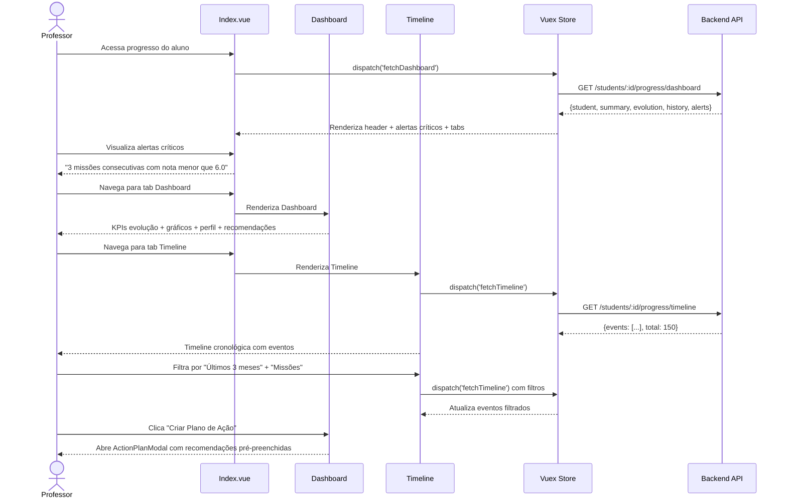

# PROF-008: Student Progress Tracking (Acompanhamento de Progresso Individual)

:::info Contexto
**Jornada**: Professor  
**Prioridade**: Baixa  
**Complexidade**: Alta  
**Status**: ✅ Documentado (AS-IS Baseline)
:::

## 1. Visão Geral

### Problema

Professores precisam acompanhar o progresso longitudinal de cada aluno de forma detalhada, identificar tendências de desempenho ao longo do tempo, antecipar dificuldades antes que se tornem críticas, e fornecer intervenções personalizadas baseadas em dados históricos, mas não possuem ferramentas que consolidem a jornada completa do aluno (missões, avaliações, participação, evolução de habilidades) em uma timeline visual acionável.

**Dores principais**:
- Visão fragmentada do desempenho do aluno (missões separadas, eventos separados, diário separado)
- Impossibilidade de visualizar evolução longitudinal (3 meses, 6 meses, ano letivo)
- Falta de detecção precoce de tendências negativas (queda progressiva de notas, aumento de faltas)
- Ausência de alertas proativos sobre alunos em risco de reprovação ou evasão
- Dificuldade para identificar correlações (ex: baixa participação → queda de notas)
- Impossibilidade de comparar aluno com histórico próprio (está melhorando ou piorando?)
- Falta de documentação histórica para reuniões de conselho de classe ou com responsáveis
- Feedback genérico sem considerar histórico e contexto individual do aluno

### Solução AS-IS

Sistema de acompanhamento longitudinal com:
- **Timeline Cronológica** de todas as atividades do aluno (missões, eventos, frequência, notas)
- **Dashboard de Evolução** com gráficos de tendência de desempenho
- **Alertas Inteligentes** de risco (queda de performance, faltas excessivas, missões não entregues)
- **Comparação Temporal** (aluno vs ele mesmo em períodos anteriores)
- **Análise de Padrões** (dias da semana com melhor performance, horários de maior engajamento)
- **Perfil de Aprendizagem** (velocidade, estilo, pontos fortes/fracos)
- **Recomendações Personalizadas** baseadas em histórico
- **Relatório para Responsáveis** com evolução detalhada e plano de ação

## 2. Rotas e Navegação

```typescript
// src/router/professor-routes/student-progress-routes.js
export default [
  {
    path: '/teacher/students/:studentId/progress',
    name: 'teacher-student-progress',
    component: () => import('@/views/pages/teacher-context/students/progress/Index.vue'),
    meta: {
      resource: 'StudentProgress',
      action: 'read',
      breadcrumb: [
        { text: 'Início', to: '/' },
        { text: 'Alunos', to: '/teacher/students' },
        { text: 'Acompanhamento de Progresso', active: true }
      ]
    }
  },
  {
    path: '/teacher/students/:studentId/progress/timeline',
    name: 'teacher-student-timeline',
    component: () => import('@/views/pages/teacher-context/students/progress/Timeline.vue'),
    meta: {
      resource: 'StudentProgress',
      action: 'read'
    }
  },
  {
    path: '/teacher/students/:studentId/progress/report',
    name: 'teacher-student-report',
    component: () => import('@/views/pages/teacher-context/students/progress/Report.vue'),
    meta: {
      resource: 'StudentProgress',
      action: 'read'
    }
  }
]
```

**Fluxo de navegação**:
1. Professor acessa lista de alunos da turma → Clica em "Ver Progresso" de um aluno
2. Visualiza dashboard com resumo de evolução (notas, frequência, missões, habilidades)
3. Navega entre abas: Dashboard, Timeline (cronológica), Análise (gráficos), Alertas, Relatório
4. Identifica alerta de risco (ex: "3 missões consecutivas com nota abaixo de 6.0")
5. Analisa timeline para entender contexto (quando começou a queda? havia faltas?)
6. Visualiza gráfico de tendência confirmando declínio nas últimas 4 semanas
7. Recebe recomendações automáticas de intervenção baseadas no perfil do aluno
8. Gera relatório para compartilhar com responsáveis ou coordenação
9. Cria plano de ação personalizado e agenda acompanhamento de 15 dias

## 3. Arquitetura de Componentes

### Estrutura de Pastas

```
src/views/pages/teacher-context/students/progress/
├── Index.vue                      # Orquestrador principal
├── Dashboard.vue                  # Dashboard de evolução
├── Timeline.vue                   # Timeline cronológica de atividades
├── Analysis.vue                   # Análise com gráficos de tendência
├── Alerts.vue                     # Alertas de risco e recomendações
├── Report.vue                     # Relatório para responsáveis
├── useStudentProgress.js          # Composable de domínio
├── components/
│   ├── StudentHeader.vue          # Header com foto, nome, turma, resumo
│   ├── EvolutionKPI.vue           # Card de KPI de evolução (média, variação)
│   ├── TimelineEvent.vue          # Evento na timeline (missão, avaliação, falta)
│   ├── TrendIndicator.vue         # Indicador de tendência (↑↓) com cor
│   ├── RiskAlert.vue              # Card de alerta de risco com severity
│   ├── LearningProfile.vue        # Perfil de aprendizagem do aluno
│   ├── RecommendationCard.vue     # Card de recomendação personalizada
│   ├── ComparisonCard.vue         # Card de comparação temporal
│   ├── ActionPlanModal.vue        # Modal para criar plano de ação
│   └── ParentReportModal.vue      # Modal para gerar relatório responsáveis
└── charts/
    ├── GradesTrendLine.vue        # Linha de tendência de notas
    ├── AttendanceCalendar.vue     # Calendário de frequência (heatmap)
    ├── SkillsRadar.vue            # Radar de habilidades ao longo do tempo
    ├── MissionsCompletion.vue     # Gráfico de conclusão de missões
    └── ComparisonBar.vue          # Barras de comparação temporal
```

### Responsabilidades dos Componentes

#### Index.vue (Orquestrador)
```vue
<template>
  <section>
    <!-- Header do Aluno -->
    <StudentHeader
      :student="student"
      :summary="summary"
    />

    <!-- Alertas Críticos -->
    <b-alert
      v-for="alert in criticalAlerts"
      :key="alert.id"
      :variant="alert.variant"
      show
      dismissible
      class="mb-3"
    >
      <div class="d-flex align-items-center">
        <span class="material-symbols-outlined mr-2">{{ alert.icon }}</span>
        <div>
          <strong>{{ alert.title }}</strong>
          <p class="mb-0">{{ alert.description }}</p>
        </div>
      </div>
    </b-alert>

    <!-- Tabs -->
    <b-tabs content-class="mt-3" pills>
      <b-tab title="Dashboard" active>
        <Dashboard />
      </b-tab>
      
      <b-tab title="Timeline" :badge="timelineEventsCount">
        <Timeline />
      </b-tab>
      
      <b-tab title="Análise">
        <Analysis />
      </b-tab>
      
      <b-tab title="Alertas" :badge="activeAlertsCount">
        <Alerts />
      </b-tab>
      
      <b-tab title="Relatório">
        <Report />
      </b-tab>
    </b-tabs>
  </section>
</template>

<script>
import StudentHeader from './components/StudentHeader.vue'
import Dashboard from './Dashboard.vue'
import Timeline from './Timeline.vue'
import Analysis from './Analysis.vue'
import Alerts from './Alerts.vue'
import Report from './Report.vue'
import store from '@/store'
import router from '@/router'
import moduleStudentProgress from '@/store/pageModules/students/module-student-progress.js'
import { defineComponent, computed, onMounted, onUnmounted } from '@vue/composition-api'
import useStudentProgress from './useStudentProgress.js'

export default defineComponent({
  name: 'StudentProgressIndex',
  components: {
    StudentHeader, Dashboard, Timeline, 
    Analysis, Alerts, Report
  },
  setup() {
    store.registerModule('studentProgress', moduleStudentProgress)

    const studentId = computed(() => parseInt(router.currentRoute.params.studentId))
    const {
      student,
      summary,
      criticalAlerts,
      timelineEventsCount,
      activeAlertsCount
    } = useStudentProgress()

    onMounted(() => {
      store.commit('studentProgress/setParams', { StudentId: studentId.value })
      store.dispatch('studentProgress/fetchDashboard')
    })

    onUnmounted(() => {
      store.commit('studentProgress/reset')
      store.unregisterModule('studentProgress')
    })

    return {
      student,
      summary,
      criticalAlerts,
      timelineEventsCount,
      activeAlertsCount
    }
  }
})
</script>
```

#### Dashboard.vue (Dashboard de Evolução)
```vue
<template>
  <div>
    <!-- KPIs de Evolução -->
    <b-row>
      <b-col cols="12" md="3">
        <EvolutionKPI
          title="Média Geral"
          :value="evolution.currentAverage"
          :previous="evolution.previousAverage"
          :trend="evolution.averageTrend"
          icon="grade"
          variant="primary"
          suffix="/10"
        />
      </b-col>
      <b-col cols="12" md="3">
        <EvolutionKPI
          title="Frequência"
          :value="evolution.currentAttendance"
          :previous="evolution.previousAttendance"
          :trend="evolution.attendanceTrend"
          icon="event_available"
          variant="success"
          suffix="%"
        />
      </b-col>
      <b-col cols="12" md="3">
        <EvolutionKPI
          title="Missões Concluídas"
          :value="evolution.completedMissions"
          :previous="evolution.previousCompletedMissions"
          :trend="evolution.missionsTrend"
          icon="task_alt"
          variant="info"
        />
      </b-col>
      <b-col cols="12" md="3">
        <EvolutionKPI
          title="Engajamento"
          :value="evolution.engagementScore"
          :previous="evolution.previousEngagementScore"
          :trend="evolution.engagementTrend"
          icon="psychology"
          variant="warning"
          suffix="/100"
        />
      </b-col>
    </b-row>

    <!-- Gráficos de Evolução -->
    <b-row class="mt-3">
      <b-col cols="12" md="8">
        <b-card>
          <h5>Evolução de Notas (Últimos 6 Meses)</h5>
          <GradesTrendLine :data="gradesHistory" />
        </b-card>
      </b-col>
      <b-col cols="12" md="4">
        <b-card>
          <h5>Calendário de Frequência</h5>
          <AttendanceCalendar :data="attendanceHistory" />
        </b-card>
      </b-col>
    </b-row>

    <!-- Perfil de Aprendizagem -->
    <b-row class="mt-3">
      <b-col cols="12" md="6">
        <b-card>
          <h5>Perfil de Aprendizagem</h5>
          <LearningProfile :profile="learningProfile" />
        </b-card>
      </b-col>
      <b-col cols="12" md="6">
        <b-card>
          <h5>Habilidades Desenvolvidas</h5>
          <SkillsRadar :data="skillsEvolution" />
        </b-card>
      </b-col>
    </b-row>

    <!-- Comparação Temporal -->
    <b-card class="mt-3">
      <h5>Comparação com Períodos Anteriores</h5>
      <b-row>
        <b-col
          v-for="comparison in temporalComparisons"
          :key="comparison.period"
          cols="12"
          md="4"
        >
          <ComparisonCard :comparison="comparison" />
        </b-col>
      </b-row>
    </b-card>

    <!-- Recomendações -->
    <b-card class="mt-3">
      <h5>Recomendações Personalizadas</h5>
      <RecommendationCard
        v-for="recommendation in recommendations"
        :key="recommendation.id"
        :recommendation="recommendation"
        class="mb-3"
      />
    </b-card>
  </div>
</template>

<script>
import EvolutionKPI from './components/EvolutionKPI.vue'
import GradesTrendLine from './charts/GradesTrendLine.vue'
import AttendanceCalendar from './charts/AttendanceCalendar.vue'
import LearningProfile from './components/LearningProfile.vue'
import SkillsRadar from './charts/SkillsRadar.vue'
import ComparisonCard from './components/ComparisonCard.vue'
import RecommendationCard from './components/RecommendationCard.vue'
import useStudentProgress from './useStudentProgress.js'

export default {
  components: {
    EvolutionKPI,
    GradesTrendLine,
    AttendanceCalendar,
    LearningProfile,
    SkillsRadar,
    ComparisonCard,
    RecommendationCard
  },
  setup() {
    const {
      evolution,
      gradesHistory,
      attendanceHistory,
      learningProfile,
      skillsEvolution,
      temporalComparisons,
      recommendations
    } = useStudentProgress()

    return {
      evolution,
      gradesHistory,
      attendanceHistory,
      learningProfile,
      skillsEvolution,
      temporalComparisons,
      recommendations
    }
  }
}
</script>
```

#### Timeline.vue (Timeline Cronológica)
```vue
<template>
  <div>
    <!-- Filtros de Timeline -->
    <b-card class="mb-3">
      <b-row>
        <b-col cols="12" md="3">
          <b-form-group label="Período">
            <b-form-select
              v-model="timelinePeriod"
              :options="periodOptions"
              @change="fetchTimeline"
            />
          </b-form-group>
        </b-col>
        <b-col cols="12" md="3">
          <b-form-group label="Tipo de Evento">
            <b-form-select
              v-model="eventTypeFilter"
              :options="eventTypeOptions"
              @change="fetchTimeline"
            />
          </b-form-group>
        </b-col>
        <b-col cols="12" md="6">
          <b-form-group label="Buscar">
            <b-form-input
              v-model="searchQuery"
              placeholder="Buscar por nome de missão, evento..."
              @input="fetchTimeline"
            />
          </b-form-group>
        </b-col>
      </b-row>
    </b-card>

    <!-- Timeline -->
    <div class="timeline-container">
      <div
        v-for="event in timelineEvents"
        :key="event.id"
        class="timeline-item"
      >
        <TimelineEvent :event="event" />
      </div>
    </div>

    <!-- Paginação -->
    <b-pagination
      v-model="currentPage"
      :total-rows="totalEvents"
      :per-page="20"
      @change="fetchTimeline"
      align="center"
      class="mt-3"
    />
  </div>
</template>

<script>
import TimelineEvent from './components/TimelineEvent.vue'
import useStudentProgress from './useStudentProgress.js'
import { ref } from '@vue/composition-api'

export default {
  components: { TimelineEvent },
  setup() {
    const {
      timelineEvents,
      totalEvents,
      fetchTimeline
    } = useStudentProgress()

    const timelinePeriod = ref('3months')
    const eventTypeFilter = ref('all')
    const searchQuery = ref('')
    const currentPage = ref(1)

    const periodOptions = [
      { value: '1month', text: 'Último mês' },
      { value: '3months', text: 'Últimos 3 meses' },
      { value: '6months', text: 'Últimos 6 meses' },
      { value: 'year', text: 'Ano letivo' },
      { value: 'all', text: 'Todo histórico' }
    ]

    const eventTypeOptions = [
      { value: 'all', text: 'Todos os eventos' },
      { value: 'mission', text: 'Missões' },
      { value: 'evaluation', text: 'Avaliações' },
      { value: 'attendance', text: 'Frequência' },
      { value: 'note', text: 'Anotações do Professor' }
    ]

    return {
      timelineEvents,
      totalEvents,
      timelinePeriod,
      eventTypeFilter,
      searchQuery,
      currentPage,
      periodOptions,
      eventTypeOptions,
      fetchTimeline
    }
  }
}
</script>

<style scoped>
.timeline-container {
  position: relative;
  padding-left: 40px;
}

.timeline-container::before {
  content: '';
  position: absolute;
  left: 20px;
  top: 0;
  bottom: 0;
  width: 2px;
  background: var(--primary);
}

.timeline-item {
  position: relative;
  margin-bottom: 20px;
}
</style>
```

## 4. Módulo Vuex

```javascript
// src/store/pageModules/students/module-student-progress.js
import {
  getStudentProgressDashboard,
  getStudentTimeline,
  getStudentAnalysis,
  getStudentAlerts,
  generateStudentReport,
  createActionPlan
} from '@/services/teacher-context/StudentProgressService'

export default {
  namespaced: true,
  
  state: {
    student: null,
    summary: null,
    evolution: null,
    gradesHistory: [],
    attendanceHistory: [],
    learningProfile: null,
    skillsEvolution: null,
    temporalComparisons: [],
    recommendations: [],
    timelineEvents: [],
    totalEvents: 0,
    alerts: [],
    actionPlans: [],
    loading: false,
    params: {
      StudentId: null,
      Period: '3months', // '1month' | '3months' | '6months' | 'year' | 'all'
      EventType: 'all', // 'all' | 'mission' | 'evaluation' | 'attendance' | 'note'
      Page: 1,
      PageSize: 20
    }
  },

  mutations: {
    student(state, payload) {
      state.student = payload
    },
    summary(state, payload) {
      state.summary = payload
    },
    evolution(state, payload) {
      state.evolution = payload
    },
    gradesHistory(state, payload) {
      state.gradesHistory = payload
    },
    attendanceHistory(state, payload) {
      state.attendanceHistory = payload
    },
    learningProfile(state, payload) {
      state.learningProfile = payload
    },
    skillsEvolution(state, payload) {
      state.skillsEvolution = payload
    },
    temporalComparisons(state, payload) {
      state.temporalComparisons = payload
    },
    recommendations(state, payload) {
      state.recommendations = payload
    },
    timelineEvents(state, payload) {
      state.timelineEvents = payload
    },
    totalEvents(state, payload) {
      state.totalEvents = payload
    },
    alerts(state, payload) {
      state.alerts = payload
    },
    actionPlans(state, payload) {
      state.actionPlans = payload
    },
    loading(state, payload) {
      state.loading = payload
    },
    setParams(state, payload) {
      state.params = { ...state.params, ...payload }
    },
    reset(state) {
      state.student = null
      state.summary = null
      state.evolution = null
      state.gradesHistory = []
      state.attendanceHistory = []
      state.learningProfile = null
      state.skillsEvolution = null
      state.temporalComparisons = []
      state.recommendations = []
      state.timelineEvents = []
      state.totalEvents = 0
      state.alerts = []
      state.actionPlans = []
      state.loading = false
      state.params = {
        StudentId: null,
        Period: '3months',
        EventType: 'all',
        Page: 1,
        PageSize: 20
      }
    }
  },

  getters: {
    student: state => state.student,
    summary: state => state.summary,
    evolution: state => state.evolution,
    gradesHistory: state => state.gradesHistory,
    attendanceHistory: state => state.attendanceHistory,
    learningProfile: state => state.learningProfile,
    skillsEvolution: state => state.skillsEvolution,
    temporalComparisons: state => state.temporalComparisons,
    recommendations: state => state.recommendations,
    timelineEvents: state => state.timelineEvents,
    totalEvents: state => state.totalEvents,
    alerts: state => state.alerts,
    actionPlans: state => state.actionPlans,
    loading: state => state.loading,
    params: state => state.params,

    // Computed: Contagem de eventos na timeline
    timelineEventsCount: state => state.totalEvents,

    // Computed: Alertas ativos
    activeAlertsCount: state => state.alerts.filter(a => a.status === 'active').length,

    // Computed: Alertas críticos (severity: critical)
    criticalAlerts: state => {
      return state.alerts
        .filter(a => a.severity === 'critical' && a.status === 'active')
        .map(a => ({
          ...a,
          variant: 'danger',
          icon: 'warning'
        }))
    },

    // Computed: Tendência geral (média das últimas 4 semanas vs 4 anteriores)
    overallTrend: state => {
      if (!state.evolution) return null
      
      const diff = state.evolution.currentAverage - state.evolution.previousAverage
      return {
        direction: diff > 0 ? 'up' : diff < 0 ? 'down' : 'stable',
        value: Math.abs(diff),
        percentage: state.evolution.previousAverage !== 0 
          ? (diff / state.evolution.previousAverage * 100).toFixed(1)
          : 0
      }
    },

    // Computed: Aluno em risco? (média < 6.0 OU frequência < 75% OU tendência negativa)
    studentAtRisk: (state, getters) => {
      if (!state.evolution) return false
      
      return state.evolution.currentAverage < 6.0 ||
             state.evolution.currentAttendance < 75 ||
             (getters.overallTrend && getters.overallTrend.direction === 'down' && getters.overallTrend.value > 1.0)
    },

    // Computed: Período de maior desempenho
    bestPerformancePeriod: state => {
      if (!state.gradesHistory || state.gradesHistory.length === 0) return null
      
      const sorted = [...state.gradesHistory].sort((a, b) => b.average - a.average)
      return sorted[0]
    },

    // Computed: Habilidades com evolução positiva
    improvingSkills: state => {
      if (!state.skillsEvolution) return []
      
      return state.skillsEvolution.skills
        .filter(s => s.trend === 'up')
        .sort((a, b) => b.improvement - a.improvement)
        .slice(0, 3)
    },

    // Computed: Habilidades em declínio
    decliningSkills: state => {
      if (!state.skillsEvolution) return []
      
      return state.skillsEvolution.skills
        .filter(s => s.trend === 'down')
        .sort((a, b) => b.decline - a.decline)
        .slice(0, 3)
    }
  },

  actions: {
    async fetchDashboard({ commit, state }) {
      commit('loading', true)
      try {
        const response = await getStudentProgressDashboard(state.params.StudentId, {
          Period: state.params.Period
        })
        commit('student', response.data.student)
        commit('summary', response.data.summary)
        commit('evolution', response.data.evolution)
        commit('gradesHistory', response.data.gradesHistory)
        commit('attendanceHistory', response.data.attendanceHistory)
        commit('learningProfile', response.data.learningProfile)
        commit('skillsEvolution', response.data.skillsEvolution)
        commit('temporalComparisons', response.data.temporalComparisons)
        commit('recommendations', response.data.recommendations)
        commit('alerts', response.data.alerts)
      } catch (error) {
        console.error('Erro ao buscar dashboard de progresso:', error)
      } finally {
        commit('loading', false)
      }
    },

    async fetchTimeline({ commit, state }) {
      commit('loading', true)
      try {
        const response = await getStudentTimeline(state.params.StudentId, state.params)
        commit('timelineEvents', response.data.events)
        commit('totalEvents', response.data.total)
      } catch (error) {
        console.error('Erro ao buscar timeline:', error)
      } finally {
        commit('loading', false)
      }
    },

    async fetchAlerts({ commit, state }) {
      commit('loading', true)
      try {
        const response = await getStudentAlerts(state.params.StudentId)
        commit('alerts', response.data.alerts)
      } catch (error) {
        console.error('Erro ao buscar alertas:', error)
      } finally {
        commit('loading', false)
      }
    }
  }
}
```

## 5. Services (API Layer)

```javascript
// src/services/teacher-context/StudentProgressService.js
import { axiosIns } from '@axios'

/**
 * Busca dashboard de progresso do aluno
 * @param {number} studentId - ID do aluno
 * @param {Object} params - Parâmetros de filtro
 * @returns {Promise<{data: Object}>}
 */
export const getStudentProgressDashboard = (studentId, params) => {
  return axiosIns.get(`/teacher/students/${studentId}/progress/dashboard`, { params })
}

/**
 * Busca timeline cronológica do aluno
 * @param {number} studentId - ID do aluno
 * @param {Object} params - Parâmetros de paginação e filtro
 * @returns {Promise<{data: Object}>}
 */
export const getStudentTimeline = (studentId, params) => {
  return axiosIns.get(`/teacher/students/${studentId}/progress/timeline`, { params })
}

/**
 * Busca análise detalhada do aluno
 * @param {number} studentId - ID do aluno
 * @returns {Promise<{data: Object}>}
 */
export const getStudentAnalysis = (studentId) => {
  return axiosIns.get(`/teacher/students/${studentId}/progress/analysis`)
}

/**
 * Busca alertas de risco do aluno
 * @param {number} studentId - ID do aluno
 * @returns {Promise<{data: Object}>}
 */
export const getStudentAlerts = (studentId) => {
  return axiosIns.get(`/teacher/students/${studentId}/progress/alerts`)
}

/**
 * Gera relatório de progresso para responsáveis
 * @param {number} studentId - ID do aluno
 * @param {Object} options - Opções de relatório
 * @returns {Promise<Blob>}
 */
export const generateStudentReport = (studentId, options) => {
  return axiosIns.post(
    `/teacher/students/${studentId}/progress/report`,
    options,
    { responseType: 'blob' }
  )
}

/**
 * Cria plano de ação para aluno
 * @param {number} studentId - ID do aluno
 * @param {Object} plan - Dados do plano
 * @returns {Promise<{data: Object}>}
 */
export const createActionPlan = (studentId, plan) => {
  return axiosIns.post(`/teacher/students/${studentId}/progress/action-plan`, plan)
}
```

## 6. Composable de Domínio

```javascript
// src/views/pages/teacher-context/students/progress/useStudentProgress.js
import store from '@/store'
import useFilters from '@/store/filters/useFilters'
import { computed } from '@vue/composition-api'

const moduleName = 'studentProgress'
const { classe } = useFilters()

/**
 * Composable para gerenciar progresso individual de aluno
 * @returns {Object} Interface de gerenciamento de progresso
 */
export default function useStudentProgress() {
  // State
  const student = computed({
    get: () => store.getters[`${moduleName}/student`],
    set: val => store.commit(`${moduleName}/student`, val)
  })

  const summary = computed({
    get: () => store.getters[`${moduleName}/summary`],
    set: val => store.commit(`${moduleName}/summary`, val)
  })

  const evolution = computed({
    get: () => store.getters[`${moduleName}/evolution`],
    set: val => store.commit(`${moduleName}/evolution`, val)
  })

  const gradesHistory = computed({
    get: () => store.getters[`${moduleName}/gradesHistory`],
    set: val => store.commit(`${moduleName}/gradesHistory`, val)
  })

  const attendanceHistory = computed({
    get: () => store.getters[`${moduleName}/attendanceHistory`],
    set: val => store.commit(`${moduleName}/attendanceHistory`, val)
  })

  const learningProfile = computed({
    get: () => store.getters[`${moduleName}/learningProfile`],
    set: val => store.commit(`${moduleName}/learningProfile`, val)
  })

  const skillsEvolution = computed({
    get: () => store.getters[`${moduleName}/skillsEvolution`],
    set: val => store.commit(`${moduleName}/skillsEvolution`, val)
  })

  const temporalComparisons = computed({
    get: () => store.getters[`${moduleName}/temporalComparisons`],
    set: val => store.commit(`${moduleName}/temporalComparisons`, val)
  })

  const recommendations = computed({
    get: () => store.getters[`${moduleName}/recommendations`],
    set: val => store.commit(`${moduleName}/recommendations`, val)
  })

  const timelineEvents = computed({
    get: () => store.getters[`${moduleName}/timelineEvents`],
    set: val => store.commit(`${moduleName}/timelineEvents`, val)
  })

  const totalEvents = computed({
    get: () => store.getters[`${moduleName}/totalEvents`],
    set: val => store.commit(`${moduleName}/totalEvents`, val)
  })

  const alerts = computed({
    get: () => store.getters[`${moduleName}/alerts`],
    set: val => store.commit(`${moduleName}/alerts`, val)
  })

  const loading = computed({
    get: () => store.getters[`${moduleName}/loading`],
    set: val => store.commit(`${moduleName}/loading`, val)
  })

  // Computed getters
  const timelineEventsCount = computed(
    () => store.getters[`${moduleName}/timelineEventsCount`]
  )

  const activeAlertsCount = computed(
    () => store.getters[`${moduleName}/activeAlertsCount`]
  )

  const criticalAlerts = computed(
    () => store.getters[`${moduleName}/criticalAlerts`]
  )

  const overallTrend = computed(
    () => store.getters[`${moduleName}/overallTrend`]
  )

  const studentAtRisk = computed(
    () => store.getters[`${moduleName}/studentAtRisk`]
  )

  const bestPerformancePeriod = computed(
    () => store.getters[`${moduleName}/bestPerformancePeriod`]
  )

  const improvingSkills = computed(
    () => store.getters[`${moduleName}/improvingSkills`]
  )

  const decliningSkills = computed(
    () => store.getters[`${moduleName}/decliningSkills`]
  )

  // Methods
  const fetchDashboard = async () => {
    await store.dispatch(`${moduleName}/fetchDashboard`)
  }

  const fetchTimeline = async () => {
    await store.dispatch(`${moduleName}/fetchTimeline`)
  }

  const fetchAlerts = async () => {
    await store.dispatch(`${moduleName}/fetchAlerts`)
  }

  return {
    moduleName,
    // State
    student,
    summary,
    evolution,
    gradesHistory,
    attendanceHistory,
    learningProfile,
    skillsEvolution,
    temporalComparisons,
    recommendations,
    timelineEvents,
    totalEvents,
    alerts,
    loading,
    // Computed
    timelineEventsCount,
    activeAlertsCount,
    criticalAlerts,
    overallTrend,
    studentAtRisk,
    bestPerformancePeriod,
    improvingSkills,
    decliningSkills,
    // Methods
    fetchDashboard,
    fetchTimeline,
    fetchAlerts,
    // Global filters
    classe
  }
}
```

## 7. Fluxo de Usuário



## 8. Estados da Interface

### Estado 1: Dashboard - Resumo de Evolução
```typescript
{
  student: {
    id: 123,
    name: 'Ana Silva',
    avatar: 'https://...',
    className: '7º A'
  },
  summary: {
    totalMissions: 45,
    completedMissions: 38,
    averageGrade: 7.2,
    attendanceRate: 88
  },
  evolution: {
    currentAverage: 7.2,
    previousAverage: 6.8,
    averageTrend: 'up',
    currentAttendance: 88,
    previousAttendance: 85,
    attendanceTrend: 'up',
    completedMissions: 38,
    previousCompletedMissions: 32,
    missionsTrend: 'up',
    engagementScore: 75,
    previousEngagementScore: 68,
    engagementTrend: 'up'
  },
  criticalAlerts: [
    {
      id: 1,
      severity: 'critical',
      title: 'Queda de Desempenho',
      description: '3 missões consecutivas com nota abaixo de 6.0',
      variant: 'danger',
      icon: 'warning'
    }
  ]
}
```
**UI**: Header com foto+nome+turma, alertas críticos destacados, 4 KPI cards com tendências (↑↓), gráfico de linha de notas (6 meses), calendário heatmap de frequência, perfil de aprendizagem (velocidade, estilo), radar de habilidades, cards de comparação temporal, recomendações personalizadas

### Estado 2: Timeline Cronológica
```typescript
{
  timelineEvents: [
    {
      id: 1,
      type: 'mission',
      date: '2024-02-01T14:30:00Z',
      title: 'Missão Números Inteiros',
      status: 'completed',
      grade: 8.5,
      details: 'Concluiu missão com 85% de acerto'
    },
    {
      id: 2,
      type: 'attendance',
      date: '2024-01-30T08:00:00Z',
      title: 'Presença',
      status: 'present',
      details: 'Presente na aula'
    },
    {
      id: 3,
      type: 'note',
      date: '2024-01-28T16:00:00Z',
      title: 'Anotação do Professor',
      content: 'Aluno demonstrou grande interesse em geometria',
      author: 'Prof. João'
    }
  ],
  totalEvents: 150
}
```
**UI**: Filtros (período, tipo de evento, busca), timeline vertical com linha lateral, eventos em cards cronológicos (ícone+data+título+detalhes), paginação (20 por página)

### Estado 3: Perfil de Aprendizagem
```typescript
{
  learningProfile: {
    learningSpeed: 'average', // 'fast' | 'average' | 'slow'
    learningStyle: 'visual', // 'visual' | 'auditory' | 'kinesthetic' | 'mixed'
    bestPerformanceTime: 'morning', // 'morning' | 'afternoon' | 'evening'
    bestPerformanceDay: 'tuesday',
    averageTimePerMission: 35, // minutes
    preferredSubjects: ['Matemática', 'Ciências'],
    strengths: ['Resolução de problemas', 'Raciocínio lógico'],
    weaknesses: ['Interpretação textual', 'Redação'],
    engagementPatterns: {
      highEngagementDays: ['Tuesday', 'Thursday'],
      lowEngagementDays: ['Monday'],
      peakHours: ['09:00-11:00']
    }
  }
}
```
**UI**: Card com ícones e badges (velocidade média, estilo visual, melhor horário manhã), lista de pontos fortes (verde) e fracos (vermelho), gráfico de barras de engajamento por dia da semana

### Estado 4: Alertas de Risco
```typescript
{
  alerts: [
    {
      id: 1,
      severity: 'critical',
      type: 'performance',
      title: 'Queda de Desempenho',
      description: '3 missões consecutivas com nota abaixo de 6.0',
      status: 'active',
      createdAt: '2024-02-01',
      recommendations: [
        'Agendar reunião individual',
        'Revisar missões recentes',
        'Contatar responsáveis'
      ]
    },
    {
      id: 2,
      severity: 'high',
      type: 'attendance',
      title: 'Faltas Frequentes',
      description: '5 faltas nas últimas 2 semanas (25% de ausências)',
      status: 'active',
      createdAt: '2024-01-28',
      recommendations: [
        'Contatar responsáveis sobre justificativas',
        'Verificar se aluno está acompanhando conteúdo'
      ]
    }
  ]
}
```
**UI**: Cards de alertas com severity badges (critical=vermelho, high=laranja, medium=amarelo), ícones, título, descrição, recomendações em lista, botões de ação (Criar Plano / Marcar como Resolvido)

### Estado 5: Análise Temporal Comparativa
```typescript
{
  temporalComparisons: [
    {
      period: 'Últimas 4 semanas',
      average: 7.2,
      previousAverage: 6.8,
      difference: 0.4,
      trend: 'up',
      percentageChange: 5.9
    },
    {
      period: 'Bimestre Atual',
      average: 7.0,
      previousAverage: 7.5,
      difference: -0.5,
      trend: 'down',
      percentageChange: -6.7
    },
    {
      period: 'Ano Letivo',
      average: 7.1,
      previousAverage: 6.9,
      difference: 0.2,
      trend: 'up',
      percentageChange: 2.9
    }
  ]
}
```
**UI**: Cards de comparação com período, média atual grande, média anterior pequena, diferença com ícone ↑↓, percentual de variação, barra de progresso colorida

### Estado 6: Relatório para Responsáveis
```typescript
{
  report: {
    student: {...},
    period: 'Janeiro - Fevereiro 2024',
    summary: 'Ana demonstrou melhora significativa...',
    achievements: [
      'Melhorou média de 6.8 para 7.2',
      'Frequência de 88%',
      'Completou 38 de 45 missões'
    ],
    concerns: [
      'Dificuldade em interpretação textual',
      '3 missões com nota abaixo de 6.0'
    ],
    actionPlan: {
      goals: ['Melhorar interpretação textual', 'Manter frequência acima de 90%'],
      actions: [
        'Leitura diária de 15 minutos',
        'Revisão semanal com monitor'
      ],
      nextReview: '2024-03-15'
    }
  }
}
```
**UI**: Relatório formatado com seções (resumo, conquistas, preocupações, plano de ação), exportável em PDF, botão para enviar por email aos responsáveis

## 9. API Endpoints

### GET /teacher/students/:id/progress/dashboard
**Request**: `?Period=3months`

**Response**:
```json
{
  "student": {...},
  "summary": {...},
  "evolution": {...},
  "gradesHistory": [...],
  "attendanceHistory": [...],
  "learningProfile": {...},
  "skillsEvolution": {...},
  "temporalComparisons": [...],
  "recommendations": [...],
  "alerts": [...]
}
```

### GET /teacher/students/:id/progress/timeline
**Request**: `?Period=3months&EventType=mission&Page=1&PageSize=20`

**Response**:
```json
{
  "events": [...],
  "total": 150
}
```

## 10. Screenshots (AS-IS)


*Dashboard de evolução*


*Timeline cronológica*


*Alertas de risco*

## 11. Melhorias TO-BE

### Problema 1: Alertas Apenas Reativos
**AS-IS**: Sistema alerta depois que problema já aconteceu (3 notas baixas).

**TO-BE**:
- **IA Preditiva de Risco**: Modelo ML prevê risco de baixo desempenho 2-3 semanas antes
- **Alertas Proativos**: "Ana tem 78% de chance de ir mal na próxima avaliação"
- **Intervenção Precoce**: Sugere ações antes do fracasso, não depois

### Problema 2: Recomendações Genéricas
**AS-IS**: Recomendações são textos padrão sem personalização real.

**TO-BE**:
- **IA de Recomendação Personalizada**: Baseada em perfil completo (estilo, horário, interesses)
- **Biblioteca de Intervenções Testadas**: Casos de sucesso de outros alunos similares
- **Gamificação de Metas**: "Missão da Semana: Completar 2 exercícios de leitura"

### Problema 3: Falta de Integração com Responsáveis
**AS-IS**: Professor gera relatório e envia manualmente.

**TO-BE**:
- **Portal do Responsável**: Acesso em tempo real ao progresso do aluno
- **Notificações Automáticas**: Email/SMS quando alerta crítico é gerado
- **Videoconferências Agendadas**: Integração com Google Meet/Teams para reuniões

### Problema 4: Impossibilidade de Comparar com Pares
**AS-IS**: Sistema compara aluno apenas com ele mesmo.

**TO-BE**:
- **Comparação Anônima com Pares**: "Ana está 15% acima da média da turma"
- **Ranking Contextualizado**: Considerar perfil socioeconômico, ponto de partida
- **Grupos de Estudo Sugeridos**: IA sugere pareamento com colegas complementares

### Problema 5: Falta de Feedback do Próprio Aluno
**AS-IS**: Apenas visão do professor, aluno não participa.

**TO-BE**:
- **Auto-Avaliação Integrada**: Aluno responde "Como você está se sentindo?" semanalmente
- **Metas Colaborativas**: Professor e aluno definem metas juntos
- **Portfolio Digital do Aluno**: Aluno documenta própria evolução com reflexões

## 12. Testes Recomendados

### Testes Unitários
```javascript
describe('useStudentProgress', () => {
  it('deve calcular tendência geral corretamente', () => {
    const mockEvolution = {
      currentAverage: 7.2,
      previousAverage: 6.8
    }
    store.commit('studentProgress/evolution', mockEvolution)
    
    const { overallTrend } = useStudentProgress()
    expect(overallTrend.value.direction).toBe('up')
    expect(overallTrend.value.value).toBe(0.4)
  })

  it('deve identificar aluno em risco', () => {
    const mockEvolution = {
      currentAverage: 5.5,
      currentAttendance: 72
    }
    store.commit('studentProgress/evolution', mockEvolution)
    
    const { studentAtRisk } = useStudentProgress()
    expect(studentAtRisk.value).toBe(true)
  })
})
```

## 13. Métricas de Sucesso

### KPIs de Uso (AS-IS)
- **Acesso ao Progress Tracking**: 25% dos professores acessam regularmente
- **Tempo de Análise**: 20 minutos por aluno
- **Planos de Ação Criados**: 10% dos alunos têm plano formal
- **Reuniões com Responsáveis**: 15% dos casos críticos

### Metas TO-BE
- **Acesso**: 80% (+220%)
- **Tempo**: 10 minutos (-50% com IA)
- **Planos**: 60% (+500%)
- **Reuniões**: 70% (+367%)
- **Redução de Evasão**: -30%
- **Melhoria de Desempenho**: +40% em alunos com plano ativo

---

## Dependências Relacionadas

- **[PROF-005: Student Records](./student-records.md)** - Diário integrado com progresso
- **[PROF-007: Mission Analytics](./mission-analytics.md)** - Dados de missões na timeline
- **[ADMIN-004: Skill Report](../admin/skill-report.md)** - Habilidades BNCC no perfil

---

:::tip Próximos Passos
1. Desenvolver modelo ML preditivo de risco de baixo desempenho
2. Implementar IA de recomendações personalizadas baseadas em perfil completo
3. Criar portal do responsável com acesso em tempo real
4. Desenvolver comparação anônima com pares (contextualizada)
5. Implementar auto-avaliação integrada do aluno e metas colaborativas
:::
