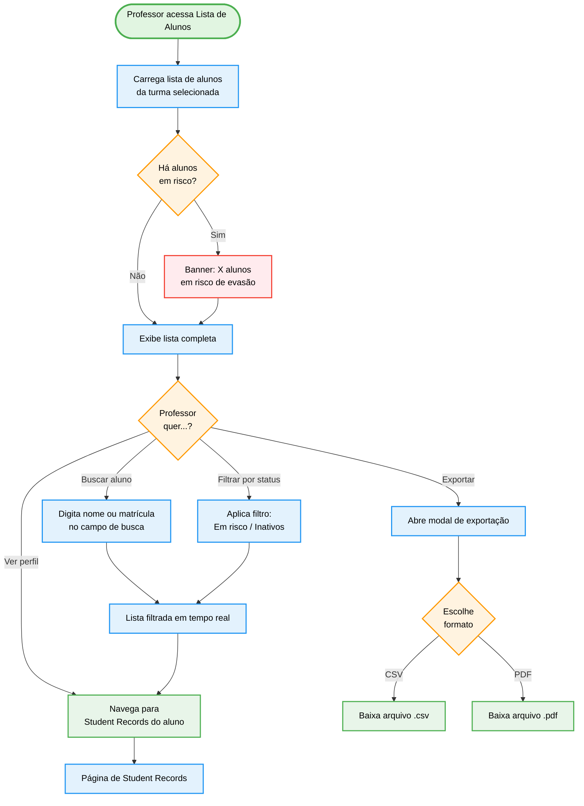

import { IconCheck, IconX, IconCircleGreen, IconCircleRed, IconCircleYellow, IconSearch, IconTeacher } from '@site/src/components/MaterialIcon';

# PROF-011: Lista de Alunos

:::info Contexto
**Jornada**: Professor
**Prioridade**: Média
**Complexidade**: Baixa-Média
**Status**: <IconCheck /> Documentado (AS-IS Baseline)
:::

## 1. Visão Geral

### Problema

Professores precisam de uma visão rápida e consolidada de todos os alunos de suas turmas para realizar operações de gestão: identificar alunos em risco, verificar status de engajamento, acessar rapidamente o perfil de um aluno específico e exportar listas para uso externo (chamada, boletim, reunião com pais).

**Dores principais**:
- Necessidade de navegar turma por turma para encontrar um aluno específico
- Falta de indicadores de risco visíveis diretamente na lista
- Ausência de exportação em formatos usados pela escola (CSV, PDF)
- Impossibilidade de ver múltiplas turmas ao mesmo tempo em uma visão unificada

### Solução AS-IS

Lista consolidada de alunos com:
- **Visão por turma ou todas as turmas** do professor
- **Busca por nome ou matrícula** com resultado em tempo real
- **Filtros por status**: ativo, inativo, em risco de evasão
- **Indicadores de engajamento** na linha do aluno (último acesso, missões concluídas)
- **Acesso rápido ao perfil** individual do aluno
- **Exportação** da lista em CSV e PDF

## 2. Rotas e Navegação

```typescript
// src/router/professor-routes/students-list-routes.js
export default [
  {
    path: '/professor/students-list',
    name: 'professor-students-list',
    component: () => import('@/views/pages/teacher-context/studentsList/Index.vue'),
    meta: {
      resource: 'StudentsList',
      action: 'read',
      breadcrumb: [
        { text: 'Início', to: '/' },
        { text: 'Lista de Alunos', active: true }
      ]
    }
  }
]
```

**Fluxo de navegação**:
1. Professor acessa menu lateral → "Alunos" ou "Lista de Alunos"
2. Seleciona turma via filtro global (ou "Todas as Turmas")
3. Visualiza lista com indicadores rápidos
4. Busca por nome/matrícula para encontrar aluno específico
5. Clica no aluno para ir ao perfil detalhado (Student Records)

## 3. Arquitetura de Componentes

### Estrutura de Pastas

```
src/views/pages/teacher-context/studentsList/
├── Index.vue                 # Página principal com lista
└── components/
    ├── StudentsTable.vue     # Tabela de alunos com paginação e ordenação
    ├── StudentsFilters.vue   # Filtros: turma, status, período
    ├── StudentRow.vue        # Linha da tabela com indicadores rápidos
    ├── RiskBadge.vue         # Badge colorido de risco (verde/amarelo/vermelho)
    └── ExportModal.vue       # Modal para exportar lista (CSV / PDF)
```

### Componente StudentRow.vue

```vue
<template>
  <tr class="student-row" @click="goToProfile(student.id)">
    <td>
      <b-avatar :src="student.avatar" size="32" />
      {{ student.name }}
    </td>
    <td>{{ student.registration }}</td>
    <td>{{ student.className }}</td>
    <td>
      <RiskBadge :level="student.riskLevel" />
    </td>
    <td>{{ formatDate(student.lastAccess) }}</td>
    <td>{{ student.completedMissions }} / {{ student.totalMissions }}</td>
    <td>
      <b-button size="sm" variant="flat-primary" @click.stop="goToProfile(student.id)">
        Ver Perfil
      </b-button>
    </td>
  </tr>
</template>
```

## 4. Módulo Vuex

```javascript
// src/store/modules/studentsList.js
const state = {
  students: [],
  filters: {
    classId: null,     // null = todas as turmas
    status: null,      // 'active' | 'inactive' | 'at-risk'
    search: ''
  },
  loading: false,
  pagination: { page: 1, total: 0, perPage: 25 },
  sortBy: 'name',
  sortDesc: false
}

const getters = {
  filteredStudents: state => {
    let list = state.students
    if (state.filters.search) {
      const q = state.filters.search.toLowerCase()
      list = list.filter(s =>
        s.name.toLowerCase().includes(q) ||
        s.registration.includes(q)
      )
    }
    return list
  },
  atRiskCount: state => state.students.filter(s => s.riskLevel === 'high').length
}

const actions = {
  async fetchStudents({ commit, state }) {
    const data = await StudentsListService.list({
      classId: state.filters.classId,
      status: state.filters.status,
      page: state.pagination.page,
      perPage: state.pagination.perPage,
      sortBy: state.sortBy,
      sortDesc: state.sortDesc
    })
    commit('SET_STUDENTS', data)
  },
  async exportList({ state }, format) {
    const blob = await StudentsListService.export({
      classId: state.filters.classId,
      format // 'csv' | 'pdf'
    })
    downloadBlob(blob, `alunos-${Date.now()}.${format}`)
  }
}
```

## 5. Fluxo de Usuário (AS-IS)



## 6. Estados da Interface

### Estado 1: Lista Completa

```typescript
interface StudentsListState {
  students: Array<{
    id: string
    name: string                     // 'Ana Paula Ferreira'
    registration: string             // '2024001'
    className: string                // '7º A'
    avatar: string | null
    riskLevel: 'none' | 'low' | 'medium' | 'high'
    lastAccess: Date | null          // null se nunca acessou
    completedMissions: number        // 8
    totalMissions: number            // 12
    engagementScore: number          // 0–100
  }>
  pagination: { page: number, total: number, perPage: number }
}
```

**UI**: Tabela com colunas ordenáveis. Linha do aluno "em risco" com fundo levemente vermelho. Coluna "Último Acesso" com texto "Nunca" em vermelho se null. Indicador de progresso de missões como barra simples.

### Estado 2: Busca Ativa

**UI**: Campo de busca com ícone lupa, resultados filtrados em tempo real (sem re-request ao backend para buscas curtas). Contador "X alunos encontrados" acima da tabela.

### Estado 3: Nenhum Aluno na Turma

**UI**: Empty state com ícone e mensagem "Esta turma ainda não tem alunos cadastrados. Acesse o módulo de Cadastros para adicionar alunos."

### Estado 4: Banner de Alerta de Risco

```typescript
interface RiskAlertBanner {
  highRiskCount: number    // 3
  mediumRiskCount: number  // 7
  action: 'filter-risk'    // Clica → filtra por "Em risco"
}
```

**UI**: Faixa amarela/vermelha no topo da tabela. Clicável para filtrar a lista por alunos em risco.

## 7. API Endpoints

### GET `/professor/students`
```
Query: classId?, status?, page, perPage, sortBy, sortDesc, search?
Response: {
  items: Student[],
  total: number,
  riskSummary: { high: 3, medium: 7, low: 12, none: 45 }
}
```

### GET `/professor/students/export`
```
Query: classId?, format ('csv'|'pdf')
Response: Blob (arquivo para download)
```

## 8. Melhorias TO-BE

| Problema | Solução Proposta | Prioridade |
|----------|-----------------|------------|
| Sem critério claro de "risco" | Definir algoritmo transparente: dias sem acesso + missões atrasadas + nota | <IconCircleRed size={14} /> Alta |
| Exportação sem formatação para chamada | Template de chamada com assinatura | <IconCircleYellow size={14} /> Média |
| Sem contato rápido com responsável | Botão "Avisar responsável" direto da lista (integração com Parent Communication) | <IconCircleYellow size={14} /> Média |
| Não indica alunos novos | Badge "Novo" para alunos adicionados nos últimos 7 dias | <IconCircleGreen size={14} /> Baixa |
| Sem ordenação por engajamento | Ordenar por "Menos engajado" para priorizar atenção | <IconCircleGreen size={14} /> Baixa |

## 9. Testes Recomendados

```javascript
// Unit: StudentsFilters
describe('StudentsFilters', () => {
  it('emite evento ao mudar turma selecionada')
  it('limpa busca ao trocar de turma')
  it('aplica filtro de status corretamente')
})

// Unit: studentsList Vuex
describe('studentsList/filteredStudents getter', () => {
  it('filtra por nome parcial case-insensitive')
  it('filtra por número de matrícula')
  it('retorna lista completa quando busca está vazia')
})

// Integration: Página Lista de Alunos
describe('Students List Page', () => {
  it('exibe banner de risco quando há alunos em risco high')
  it('navega para Student Records ao clicar em um aluno')
  it('exibe empty state quando turma não tem alunos')
  it('dispara download ao confirmar exportação')
})
```

## 10. Métricas de Sucesso

| Métrica | Atual | Meta |
|---------|-------|------|
| Tempo para encontrar um aluno específico | ~45s | <10s |
| % professores que exportam a lista/mês | ~10% | >30% |
| Taxa de uso do filtro "Em risco" | Não medido | >40% dos professores/semana |
| Tempo médio na página | ~2 min | >4 min |

---

**Última Atualização**: Fevereiro 2026
**Referências**: [Persona: Professor](../../personas/professor) · [Student Records](./student-records) · [Classes Records](./classes-records) · [Catálogo de Jornadas](../index)
