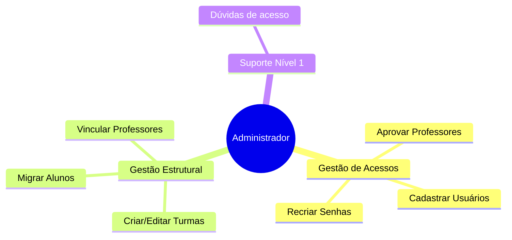

#  Administrador

O Administrador Escolar é a peça chave operacional. Ele garante que todos (professores e alunos) tenham acesso à plataforma e que a estrutura de turmas reflita a realidade da escola.

---

## Quem é

| | |
|---|---|
| **Perfil** | Secretário escolar / TI da escola |
| **Onde atua** | Secretaria |
| **Experiência digital** | Intermediária a Avançada |
| **Frequência de uso** | Diária (início do ano) / Semanal (manutenção) |

> *"Preciso garantir que ninguém esteja bloqueado e que as transferências de turma sejam rápidas."*

---

## O que faz no Educacross

---

## Principais ações

| Ação | Descrição | Criticidade |
|------|-----------|------------|
| **Gerenciar Usuários** | Cria, edita e bloqueia acessos de professores e alunos | Alta |
| **Configuração de Turmas** | Define quais turmas existem e quais alunos pertencem a elas | Alta |
| **Aprovações Pendentes** | Libera solicitações de cadastro automático | Média |

---

## Jornadas relacionadas

- [Gestão de Usuários](../journeys/administrator/user-management)

