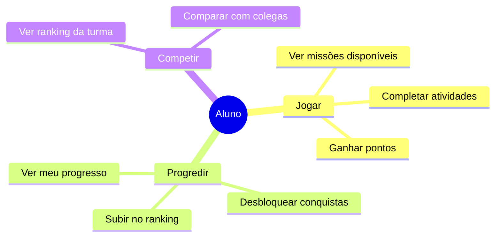

# 👨‍🎓 Aluno

O aluno é quem **realiza as missões** e **aprende de forma gamificada**. A experiência é projetada para ser divertida, com recompensas e progressão visual.

---

## Quem é

| | |
|---|---|
| **Perfil** | Estudante do ensino fundamental (6 a 14 anos) |
| **Onde usa** | Escola (tablet/computador) e casa (celular/tablet) |
| **Experiência digital** | Alta — joga Roblox, usa YouTube e TikTok |
| **Frequência de uso** | Diária (quando há missões) |

> *"Quero jogar e ganhar pontos! As missões são legais quando têm recompensas."*

---

## O que faz no Educacross

---

## Principais ações

| Ação | Descrição | Frequência |
|------|-----------|------------|
| **Ver Missões** | Lista missões liberadas pelo professor | Diária |
| **Completar Atividades** | Realiza jogos e exercícios | Diária |
| **Ver Progresso** | Acompanha seu desempenho | Diária |
| **Ver Ranking** | Compara posição com colegas | Semanal |

---

## Jornadas relacionadas

- [Completar Missão](../fluxos/completar-missao)
- [Jornadas do Estudante](../journeys/student/)

---

## Elementos de gamificação

| Elemento | O que é |
|----------|---------|
| ⭐ Estrelas | Pontos por atividade completada |
| 🏅 Medalhas | Conquistas por marcos atingidos |
| 📊 Ranking | Posição na turma |
| 🎯 Progresso | Barra visual de conclusão |

---

## Telas principais

| Tela | Função |
|------|--------|
| Home | Missões disponíveis |
| Missão | Atividades para completar |
| Meu Progresso | Desempenho pessoal |
| Ranking | Comparação com turma |

