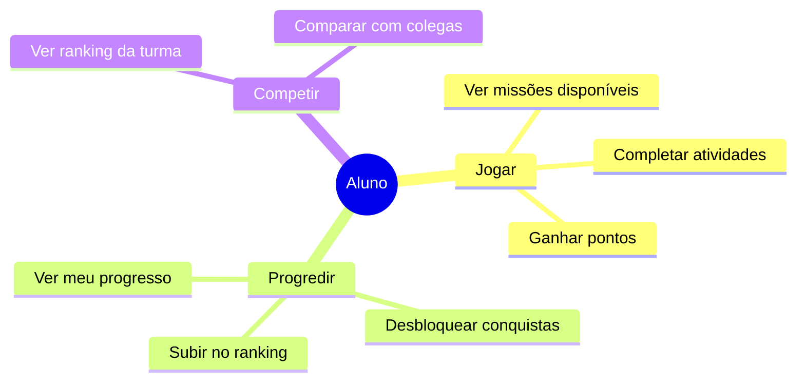

import { IconChart, IconSparkle, IconTarget, IconStudent } from '@site/src/components/MaterialIcon';

# <IconStudent size={28} /> Aluno

O aluno é quem **realiza as missões** e **aprende de forma gamificada**. A experiência é projetada para ser divertida, com recompensas e progressão visual.

---

## Quem é

| | |
|---|---|
| **Perfil** | Estudante do ensino fundamental (6 a 14 anos) |
| **Onde usa** | Escola (tablet/computador) e casa (celular/tablet) |
| **Experiência digital** | Alta — joga Roblox, usa YouTube e TikTok |
| **Frequência de uso** | Diária (quando há missões) |

> *"Quero jogar e ganhar pontos! As missões são legais quando têm recompensas."*

---

## O que faz no Educacross

---

## Menu de navegação (real)

| Item | Permissão |
|------|----------|
| **Painel Inicial** | `Student` |
| **Missões da Escola** | `SchoolMissions` |
| **Sistema de Ensino** | `EducationSystems` (dinâmico, por escola) |
| **Treinos da Família** | `SpecialMissions` |
| **High Five** | `HighFive` |

---

## Jornadas relacionadas

- [Completar Missão](../fluxos/completar-missao)
- [Jornadas do Estudante](../journeys/student/)

---

## Elementos de gamificação

| Elemento | O que é |
|----------|---------|
| <IconSparkle /> Estrelas | Pontos por atividade completada |
| military_tech Medalhas | Conquistas por marcos atingidos |
| <IconChart /> Ranking | Posição na turma |
| <IconTarget /> Progresso | Barra visual de conclusão |

---

## Telas principais

| Tela | Função |
|------|--------|
| Home | Missões disponíveis |
| Missão | Atividades para completar |
| Meu Progresso | Desempenho pessoal |
| Ranking | Comparação com turma |

