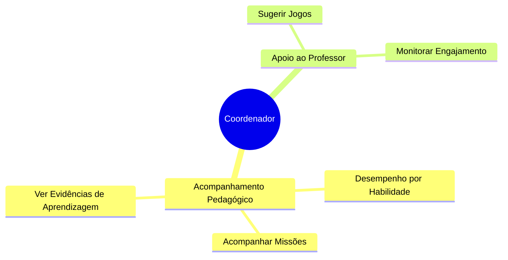

# 👩‍🏫 Coordenador Pedagógico

O Coordenador é o elo entre a direção e os professores. Seu foco no Educacross é garantir a qualidade do uso pedagógico, verificando se as missões estão sendo enviadas e se os alunos estão desenvolvendo as habilidades esperadas.

---

## Quem é

| | |
|---|---|
| **Perfil** | Coordenador Pedagógico / Orientador |
| **Onde atua** | Coordenação Pedagógica |
| **Experiência digital** | Básica a Intermediária |
| **Frequência de uso** | Semanal / Quinzenal |

> *"Preciso identificar quais turmas estão com dificuldade em matemática para intervir junto aos professores."*

---

## O que faz no Educacross

---

## Principais ações

| Ação | Descrição | Frequência |
|------|-----------|------------|
| **Relatórios de Habilidade** | Analisa quais BNCCs estão sendo trabalhadas | Mensal |
| **Monitorar Missões** | Verifica se professores estão criando roteiros de estudo | Semanal |
| **Relatório de Evidências** | Acompanha o progresso detalhado de aprendizado | Quinzenal |

---

## Jornadas relacionadas

- [Relatório de Missões](../journeys/coordinator/mission-reports)
- [Relatório de Evidências](../journeys/coordinator/evidence-report)
- [Relatório de Habilidades](../journeys/coordinator/skill-report)

